# Parso Platterhead — Architecture & Low-Level Design Specification (iOS)

**Version 2.0-iOS** · Canonical engineering blueprint
**Status:** Implementation-ready · supersedes `../tonearm-mvp/TONEARM_DJ_ARCHITECTURE.md` (v1.0, macOS-first)
**Repository:** `johnarleyburns/parso-tonearm`
**Platform target:** **iOS 18+ / iPadOS 18+** (universal, one binary, Apple Silicon) · watchOS 11+ remote
**Monetization:** Free = the complete listener (including remote libraries, semantic search and auto-playlists) · **Pro = performing, one-time purchase**
**License:** GPL-3.0 (source-available; Pro builds from source with no gate — Appendix T.6)
**Audience:** Agentic coding systems and human contributors implementing Platterhead with minimal ambiguity.

> **What changed from v1.0.** The DJ product was specified as a macOS application with the iPhone
> as a read-only companion, and Pro was the remote-library connectors. This version puts the whole
> product on the device the library already lives on: **one universal iOS/iPadOS app**, remote
> libraries and on-device semantic search **free for everyone**, and a single one-time purchase for
> decks, stems, recording and hardware. Parts III–V (schema, analysis, engine) survive
> substantially intact; Parts I, VI, VII and IX are rewritten. See §1.2 for the change table and
> "Document status" for the section-level summary.
>
> Commercial reasoning, the competitor matrix and pricing live in
> [`../tonearm-mvp/DJ_PLATFORM_STRATEGY.md`](../tonearm-mvp/DJ_PLATFORM_STRATEGY.md), which is
> **authoritative** wherever the two documents appear to disagree.

---

## Document conventions

- **Requirement IDs.** Functional requirements are `FR-<area>-<n>`, non-functional `NFR-<area>-<n>`. They are referenced by acceptance tests in Part IX and traced in Appendix L. **IDs from v1.0 are preserved verbatim where the requirement is unchanged**, so existing test names and traceability remain valid; new groups are `FR-PLIST`, `FR-SESS`, `FR-STORE`, `FR-FREE`/`FR-PRO`, and `NFR-THERM`.
- **Tier markers.** Requirements and capabilities carry **[F]** (free) or **[P]** (Pro). The line is defined normatively in §2.4 and enforced by CI per Appendix T.5.
- **Section numbering is stable.** New material takes lettered section numbers (§28A, §34A, §39A, §42B, Appendix T) rather than renumbering, so cross-references from v1.0 and from existing code comments continue to resolve.
- **Interface listings** are Swift and are *normative*: type names, access levels, and signatures are the contract an implementer must honor. Bodies are illustrative unless marked `// NORMATIVE BODY`.
- **DSP constants** appear in `Config` structs and are *tunable*: the identifier and units are fixed; the default value is a starting point for iterative tuning.
- **Diagrams** are Mermaid and render on GitHub.
- **"MUST / SHOULD / MAY"** follow RFC 2119 sense.
- **Repo alignment callouts** (⟢) note where this design reuses or extends an existing `TonearmCore` type, so implementers extend rather than fork.
- **Public naming.** The app's user-visible name is **Platterhead** everywhere: app chrome, App Store copy, screenshots, onboarding, alerts, settings, privacy copy, and HTML mockups. Legacy/internal identifiers such as `TonearmCore`, `TonearmDJ`, `guru.parso.tonearm`, `iCloud.guru.parso.tonearm`, `tonearm-dj.sqlite`, repo paths, target names, and migration/tool names remain only when they refer to existing implementation or persistence identifiers; they MUST NOT appear in user-facing UI text.
- **Mockups.** Every screen in Part VII has a standalone HTML mockup under `mockups/`. The coverage contract is §40.6.

---

## Table of contents

**[Part I — Product & Requirements](#part-i--product--requirements)**
1. Vision and product thesis · 1.1 commercial position · 1.2 relationship to v1.0
2. Product topology and the free/Pro line · 2.1 division by device · 2.2 iPhone *and* iPad · 2.3 what was deleted · **2.4 the free/Pro line (normative)**
3. Personas and primary journeys
4. Functional requirements — 4.1 `FR-LIB` · 4.2 `FR-ANL` (staged) · 4.3 `FR-SEM` (free) · **4.3a `FR-PLIST` (auto-playlists, free)** · 4.4 `FR-PREP` · **4.4a `FR-WAVE` (waveform display, new)** · 4.5 `FR-ENG` · **4.5a `FR-SESS`** · **4.5b `FR-TRANS` (the five transitions, new)** · 4.6 `FR-REC` · 4.7 `FR-SYNC` · 4.8 `FR-HW` · **4.9 `FR-STORE`**
5. Non-functional requirements — `NFR-PERF` · **`NFR-THERM`** · `NFR-PRIV` · `NFR-REL` · `NFR-DET` · `NFR-A11Y`
6. Constraints, assumptions, non-goals
7. Glossary

**[Part II — System Architecture](#part-ii--system-architecture)**
8. Architectural overview and layering · 8.1 the two-clocks principle
9. Swift package and module architecture — **9.1 no platform gates, models as ODR** · 9.2 module map
10. Public module interfaces
11. Concurrency architecture (actors and isolation)
12. Thread, queue, and real-time execution model

**[Part III — Data Layer](#part-iii--data-layer)**
13. Data architecture and storage engines — **13.1 iOS locations and backup exclusion** · 13.3 table inventory (53 + 2 virtual)
14. Complete SQLite schema — relational core · **14.3 crates, playlists, auto-playlists, gig crates**
15. Complete SQLite schema — analysis, embeddings, performance · **15.4 embeddings (int8)**
16. **Vector storage — a tiered strategy for a phone** — 16.0 the arithmetic · 16.1 two implementations · 16.2 brute-force vDSP · 16.3 sqlite-vec · 16.4 crate-scoped windows · 16.5 query shape · 16.6 quantization · 16.7 lifecycle
17. Migrations and analysis versioning
18. GRDB record and repository layer
**18A. Genre libraries — the practice-material connector (new — M5)** — 18A.1 the problem · 18A.2 source selection (and why not FMA) · 18A.3 a genre is a library · 18A.4 the path to a deck · 18A.5 licensing obligations · 18A.6 failure and honesty

**[Part IV — Offline Analysis Pipeline](#part-iv--offline-analysis-pipeline)**
19. Analysis pipeline architecture — **19.4 persisted analysis artifacts, the render contract (new — M5)**
20.–26. Loudness · FFT/DSP · onset & tempo · beat & downbeat · key (Camelot) · phrase segmentation · waveform pyramid
**26A. Performance waveform display (new — M5)** — 26A.1 data contract · 26A.2 frequency colouring · 26A.3 beat grid · 26A.4 the phrase ribbon · 26A.5 the three views · 26A.6 cues and loops · 26A.7 budget and degradation · 26A.8 the acceptance target
27. CLAP semantic embeddings — **27.1a On-Demand Resource delivery** · 27.4 streaming pooling · 27.5 text, audio-to-audio and window search
28. Recommendation and transition scoring
**28A. Auto-playlist generation (new — free tier)** — 28A.1 the problem · 28A.2 cost terms · 28A.3 the algorithm · 28A.4 locks/rejects/regenerate · 28A.5 energy arcs · 28A.6 parsing the brief · 28A.7 gates

**[Part V — Real-Time Audio Engine](#part-v--real-time-audio-engine)**
29.–33. Node graph · master clock & scheduler · time-stretch & key lock · beat sync · cue, loop, quantize
34. Latency budget and buffer management — **granted vs requested; the route latency table**
**34A. The audio session (new — iOS only)** — 34A.1 modes · 34A.2 negotiation · 34A.3 route changes · 34A.4 interruptions · 34A.5 graph rebuild · 34A.6 background & lifecycle · 34A.7 tests
35. Deck and mixer architecture
**35A. Beat FX — the beat-synced echo send (new — M5)** — 35A.1 why post-fader is the whole design · 35A.2 the kernel · 35A.3 controls and RT boundary · 35A.4 honest scope
**35B. The five transitions (new — M5)** — the normative transition → control mapping
36. Stem separation pipeline — **36.5 prepared-first policy**
37. Recording pipeline — **37.6 delivery format: why M4A and not MP3 (new — M5)**

**[Part VI — Multi-Device Sync and the Watch Remote](#part-vi--multi-device-sync-and-the-watch-remote)**
38. CloudKit sync protocol — 38.1 what syncs and what is re-derived · 38.2 record types · 38.4 cue merge
39. The multi-device model — peers, not tiers
**39A. The Apple Watch performance remote**

**[Part VII — Presentation Layer](#part-vii--presentation-layer)**
40. UI architecture pattern — **40.4 tier presentation rules** · 40.5 screen inventory · 40.6 mockup coverage contract · **40.7 the jog control model**
41. iPad screens (16) — **41.1a the genre picker (new)** · **41.9a the deck module slot** · **41.9b club-standard control ergonomics (new — M5)** · **41.9c per-deck queues (new)** · **41.18 the transition coach (new)**
42. iPhone screens (10) — **42.1 the two postures** · **42.7a twin deck** · **42.7b momentary banks** · **42.7c club conventions on a 393 pt screen (new — M5)**
42A. Liquid Glass adoption · **42B. watchOS screen**

**[Part VIII — Cross-Cutting Concerns](#part-viii--cross-cutting-concerns)**
43. Performance and resource budgets — **43.5 the memory ceiling** · **43.6 rescaled storage** · **43.7 the thermal governor**
44. Hardware integration — USB-C · **44.2a cue monitoring and split cue** · three MIDI transports
45. Security and privacy model — permissions table
46. Error handling, resilience, and watchdogs
47. Testing strategy and acceptance criteria

**[Part IX — Delivery](#part-ix--delivery)**
48. Implementation roadmap — **three free releases before the paid feature exists** · **48.6 M5, the milestone where it becomes a DJ app**
49. Coding-agent execution guide — **49.3a reachability, the invariant M4 violated (new)**
50. Risks and open questions

**[Part X — Go-Live Defects and the UI Regression Suite](#part-x--go-live-defects-and-the-ui-regression-suite)**
51. The defect register — **D-1…D-17, an M0 exit gate**
52. Now Playing information architecture — six primary controls and an overflow menu
53. The UI regression suite — **run by hand, never in CI**
54. Fixtures, servers, and credentials — `.test-credentials`, never committed

**Appendices** — A records · B Camelot · C DSP constants · D Core ML conversion · E ER overview · F reference algorithms · G semantic subsystem · H worked traces · I interface index · J configuration · K concurrency · L traceability · M build manifest · N ADR log · O glossary · P state machines · Q dependencies & licensing · R test fixtures · S agent quick-start · **T entitlement, purchase, and the free-tier registry** (Q gains **Q.1a network hosts** — the one M5 exception)

---
---

# Part I — Product & Requirements

## 1. Vision and product thesis

Parso Platterhead is a **local-first music platform built for Apple Silicon, and it performs on
the device already in your pocket.** One application, on iPhone and iPad, that is a complete
player for people who own their music — and, for a single one-time purchase, a real two-deck
DJ instrument for that same library.

There is no Mac in this design. There is no companion. There is no bridge. The library, the
analysis, the semantic index, the decks, the stems and the recording all live on the device you
are holding. That is the entire architectural thesis, and every decision in this document falls
out of it.

The design commitments are non-negotiable:

- **One-time purchase, no subscription.** No recurring revenue mechanics leak into the
  architecture: there is no license server to phone, no feature that degrades when "offline,"
  no account. The DJ tier is a StoreKit non-consumable, verified once, cached locally, and
  honored forever in airplane mode.
- **No vendor cloud, no proprietary backend.** The only network dependency is the user's own
  **private CloudKit** database, and it is entirely optional. There is no Platterhead server in
  the data path, ever.
- **Native Swift throughout, Apple-Silicon optimized.** Accelerate/vDSP for DSP, Core ML on the
  Neural Engine for semantic embedding, Metal for stem separation, AVAudioEngine for the
  real-time graph. No cross-platform audio middleware, no AudioKit fork. A-series and M-series
  run the same code.
- **Deterministic real-time audio, AI-assisted preparation.** AI never drives the performance.
  AI prepares: it labels, embeds, segments, sequences and *suggests*. The performing DJ remains
  in a sample-accurate, deterministic engine whose behavior does not depend on a model's
  latency or a network round-trip.
- **Privacy as architecture, not policy.** Original audio is never copied into iCloud. Only
  compact metadata, embeddings, cue data, and mixes the user explicitly records and chooses to
  sync ever leave the device.
- **Thermals are a first-class budget.** On a Mac you can spend watts freely. On a phone you
  cannot. Every pipeline in this document declares what it does when the device gets hot, and
  the performance engine always wins.

The product thesis in one sentence: **your phone is the studio, your library is the instrument,
and you buy the instrument once.**

### 1.1 Why this is a strong commercial position

Every pro-grade mobile DJ app is now a subscription — djay (~$49.99/yr), rekordbox
($120–$360/yr), edjing (IAP to $49.99), and DJ Player Professional, which was the last pay-once
holdout on iOS until it converted. The one-time-purchase position on mobile is currently
*uncontested*, not merely under-served.

Every one of them is also streaming-first. The tell is that **djay's own Neural Mix and its
recording feature do not work on tracks streamed from Apple Music or Spotify** — the
incumbent's flagship AI features only function on files the user owns, which is precisely and
exclusively the population Platterhead already serves.

And none of them, on any platform, ships **on-device semantic search over your own library**.

The commercial reasoning, the competitor matrix and the pricing recommendation live in
[`../tonearm-mvp/DJ_PLATFORM_STRATEGY.md`](../tonearm-mvp/DJ_PLATFORM_STRATEGY.md). This
document does not re-derive them; §2.4 and Appendix T implement them. Where the two documents
appear to disagree about price, packaging or migration, **the strategy document is
authoritative** and this one is the bug.

### 1.2 Relationship to the previous specification

This specification supersedes `TONEARM_DJ_ARCHITECTURE.md` (the macOS-first DJ spec). It
**preserves that document's entire engineering core** — the immutable analysis pipeline, the
vDSP FFT, the CLAP embeddings, the sqlite-vec vector store, Demucs stems, the AVAudioEngine
node graph, the actor concurrency model, the schema (46 tables, now 53) — because all of it is portable
Swift on frameworks that exist identically on iOS. Parts III, IV and V are substantially the
same document.

What changes:

| Area | Change |
|---|---|
| **Platform** | macOS 14+ → **iOS 18+ / iPadOS 18+**, universal binary, one app |
| **Topology** | Two apps + CloudKit bridge → **one app**; sync demoted to optional multi-device convenience (Part VI) |
| **Free/Pro line** | Pro = remote libraries → **Pro = DJ/performance only**; remote libraries and semantic search become free (§2.4) |
| **Semantic search** | Pro-adjacent Mac feature → **free-tier hero feature**, with a new auto-playlist generator (§28A) |
| **Vector storage** | 6.3 GB f32 windowed index → **tiered int8 policy**, ~26 MB for 50k tracks (§16) |
| **Stem cache** | 18.7 GB library-wide → **gig-crate scoped** with a user-set budget (§43.6) |
| **Audio session** | (absent — macOS has none) → **new §34A**, the single largest new subsystem |
| **Presentation** | 10 Mac screens + 5 companion screens → **iPad workspace + iPhone solo/twin-deck surfaces + Watch remote** (Part VII) |
| **Hardware** | Full multichannel + DVS → **USB-C class-compliant MIDI + split-cue strategy** (§44) |

## 2. Product topology and the free/Pro line

Platterhead is **one application, one core, one library, two capability tiers.**

```mermaid
flowchart TB
    subgraph App["Platterhead — iOS 18+ / iPadOS 18+ (universal, one binary)"]
        direction TB
        subgraph Free["FREE — the complete listener"]
            Player["Player · formats · gapless · EQ<br/>ReplayGain · cache · widgets · Watch"]
            Remote["Remote Libraries<br/>all 10 providers"]
            Analysis["Analysis stages 1–2<br/>BPM · key · energy · embeddings"]
            Search["Semantic Vibe Search<br/>+ Auto-Playlists"]
        end
        subgraph Pro["PRO — the performer · one-time purchase"]
            Decks["Two decks · mixer · EQ · filter<br/>crossfader · sync · key lock"]
            Prep["Cues · loops · grid editing<br/>gig crates"]
            Stems["Stem separation<br/>analysis stage 3"]
            Rec["Recording · mix export<br/>MIDI · hardware"]
        end
        Core["TonearmCore + TonearmDJ<br/>(one SPM package, no platform gates)"]
        Free --> Core
        Pro --> Core
    end

    subgraph Cloud["User's private CloudKit — OPTIONAL"]
        Priv["iCloud.guru.parso.tonearm<br/>private database"]
    end

    Core <-.->|"metadata · cues · mixes<br/>(user may disable entirely)"| Priv

    style Free fill:#12211a,stroke:#42dc88
    style Pro fill:#1c1633,stroke:#7c5cff
    style App fill:#0f1219,stroke:#343947
    style Cloud fill:#14202b,stroke:#344457
```

**Key topology facts an implementer must internalize:**

- ⟢ **`TonearmCore` already exists** (`Package.swift`, product `TonearmCore`, platforms iOS 18 /
  macOS 15 / watchOS 11, GRDB 7 dependency, `linkedLibrary("sqlite3")`). The DJ capability
  **extends** this package with new modules in the *same binary*. Shared types — `Source`,
  `Album`, `Track`, `Asset`, `Playlist`, `LibraryStore`, `CloudSyncEngine`, `RecordMapping`,
  `CacheKeyGenerator`, `ReplayGain` — are reused verbatim.
- **There is no `#if os(macOS)` gate and no `#if os(iOS)` gate on the DJ modules.** They compile
  everywhere `TonearmCore` compiles. This is deliberate: it costs nothing today and it is the
  only thing that keeps a future Mac or Vision build on the *same one-time purchase* rather than
  a second product. Platform-specific code is confined to the presentation layer and to §34A.
- The **CloudKit container is unchanged** — `iCloud.guru.parso.tonearm` (see
  `CloudSyncEngine.containerID`) — and DJ record types join the same private database with the
  same zone strategy `RecordMapping` already establishes. But sync is now a *convenience*
  (iPhone↔iPad↔Watch), not the product's spine (Part VI).
- Bundle identifier stays `guru.parso.tonearm`. **There is no second app target.**

### 2.1 Division of responsibility by device

| Capability | iPhone | iPad | Apple Watch |
|---|---|---|---|
| Library import, watched folders, remote libraries | ✅ | ✅ | ⛔ |
| Analysis stage 1–2 (BPM/key/energy/embeddings) | ✅ | ✅ | ⛔ |
| Semantic search & auto-playlists | ✅ | ✅ | ⛔ (voice handoff, roadmap) |
| Track preparation (grid, cues, loops) | ✅ compact | ✅ full | ⛔ |
| Two-deck performance | ✅ **twin deck in landscape, solo deck in portrait** (§42.1) | ✅ **full workspace** (§41) | ⛔ |
| Jog wheel control | ✅ 168 pt, one per deck, haptic detents (§40.7) | ✅ 248 pt module (§41.9a) | ⛔ |
| Stem separation & live stem faders | ✅ (2 stems live, 4 prepared) | ✅ 4 live | ⛔ |
| Mix recording | ✅ | ✅ | ⛔ |
| **Performance remote** (rec start/stop, deck time, load-next) | ⛔ | ⛔ | ✅ (§39A) |
| MIDI / USB-C hardware | ✅ | ✅ | ⛔ |
| Mix playback | ✅ | ✅ | ✅ |

The iPhone is **not** a degraded iPad. It runs the identical engine with an identical feature
set; only the *control surface* differs (§42.1). Everything a user prepares on one device is
available on the other.

### 2.2 Why iPhone *and* iPad, and not one of them

iPad is where mobile DJing physically happens: it is the screen a two-deck layout fits on and
the device a DJ props next to a controller. iPhone is where the library already lives, where
the existing user base is, and where the "I have twenty minutes on a train and I want to make a
mix" use case exists — a use case no competitor addresses at all.

They are one universal binary and one purchase. Shipping only one would be self-inflicted.

The iPhone surface also carries disproportionate commercial weight, which is why §42.1 spends the
design effort it does on it: two decks and a pair of jogs is a screenshot that sells a one-time
purchase, and one deck with the other in a strip is a screenshot that reads as a limitation
whether or not it is one. The engine is identical either way (FR-ENG-9); only the first
impression differs.

### 2.3 What was deleted from the previous spec, and why

| Deleted | Reason |
|---|---|
| macOS application target, AppKit hosts, 10 Mac screens (§41 old) | The studio is the device. |
| iPhone *companion* architecture (§39 old) | There is nothing to be a companion to. |
| CloudKit as the product's spine (§38 old) | Mixes are recorded where they are played. Sync is now optional convenience. |
| Milestone M5 "Sync, companion & hardware" | Dissolved; hardware folds into M4. |
| DVS (vinyl control) | Was already a non-goal; remains one. |
| Four-deck ambitions | Two decks, done well, on a screen that can hold them. |

### 2.4 The free/Pro line (normative)

The shipped README currently draws the line as *"Free — everything you can do with your music,
on your own devices; Pro — reach."* **That line is retired.** DJ mixing is your own music on
your own device, so the old wording would put mixing in Free. The line is redrawn along a
different axis:

> **Free — everything about *listening*.** A complete player for music you own, wherever it
> lives, including finding it by feel and having the app build playlists for you.
>
> **Pro — everything about *performing*.** Decks, mixing, stems, recording and hardware. One
> price, once, forever.

**Free tier (permanent, CI-enforced — `FR-FREE-*`):**

All formats (FLAC, Opus, ALAC, MP3, AAC, WAV/AIFF) · gapless · 10-band and parametric EQ ·
ReplayGain · crossfade · crossfeed · convolution · bit-perfect output · unlimited cache · any
prefetch depth · folder watch · full Music browse · queue and playlist editing · local import ·
widgets, Shortcuts, share extension · listening stats · scrobbling · lyrics · iCloud sync ·
smart playlists · tag editor · bulk edits · duplicate detection · **all 10 remote-library
providers (archive.org, Dropbox, Google Drive, OneDrive, pCloud, Subsonic/Navidrome, WebDAV,
Jellyfin, Plex, SMB)** · **semantic vibe search** · **auto-generated playlists** · **analysis
stages 1–2 (BPM, key, energy, embeddings)** · zero telemetry, no account.

**Pro tier — Platterhead DJ, one-time purchase (`FR-PRO-*`):**

Two decks · 3-band EQ, filter, crossfader, master limiter · beat sync · key lock · hot cues ·
loops · grid editing · gig crates · **stem separation (analysis stage 3) and live stem
faders** · mix recording and export · MIDI-learn and USB-C hardware · split-cue monitoring ·
the Watch performance remote.

**Migration (normative).** `ProFeature.remoteLibraries` is **removed**, not repriced. Remote
libraries become free for everyone. Anyone who purchased it before the transition receives
**Platterhead DJ at no charge** (the "Founders grant", Appendix T.4), determined from the
StoreKit original purchase date. Nobody who paid loses anything or is asked to pay again.

**CI enforcement.** `Tests/FreeTierRegistryTests.swift` currently fails the build if a
previously-free convenience is re-gated. Its registry **gains** every capability listed above
as free — including remote libraries, semantic search and auto-playlists. The test that was
written to stop conveniences being re-gated now guards the largest give-away in the product's
history. See Appendix T.5.

## 3. Personas and primary journeys

**P1 — The owner-listener (primary buyer, ~all free users).** Owns thousands of DRM-free files,
possibly spread across a NAS and a Dropbox. Has never DJ'd. Wants their library to feel
*navigable* — "play me something like this but calmer" — and wants good playlists without
building them by hand. Converts to Pro when they realize the app can also *blend* the playlist
it just made them.

**P2 — The bedroom DJ (primary Pro buyer).** Practices at home, plays the occasional party,
refuses to rent software. Has a laptop but resents carrying it. Wants two decks, honest
beatmatching, stems for practice, and a recording at the end. Has a USB-C controller or wants
to buy one.

**P3 — The mix archivist.** Records every practice set, wants a private history of what was
played, wants it on their phone and Watch for the commute. Promoted from a secondary persona in
the old spec to a first-class one: on a single device, the archive is trivially local.

**P4 — The gigging DJ (secondary, explicitly not the target).** Plays real venues on club gear.
Platterhead should not embarrass itself in front of this person — hence MIDI, split cue and
sample-accurate sync — but the product is not designed to displace rekordbox in a booth. This
persona is a *credibility constraint*, not a market.

### 3.1 Primary journeys (each maps to screens and acceptance tests)

1. **First run → library ready (free).** Launch → choose sources → staged background analysis →
   library becomes searchable. *(Screens: iPad-01/iPhone-01, iPad-03. Tests: AT-ING-\*.)*
2. **Find by feel (free).** "dark driving bassline, no vocals" → ranked results → refine with
   additive/subtractive terms → play or save as a Smart Crate. *(Screens: iPad-04a/b,
   iPhone-04. Tests: AT-SEARCH-\*.)*
3. **Auto-playlist (free).** "an hour that starts mellow and ends euphoric" → sequenced
   playlist with a visible energy arc → tweak → save. *(Screens: iPad-05a/b, iPhone-05.
   Tests: AT-PLIST-\*.)*
4. **Convert to Pro.** Tap a locked deck → paywall in context → purchase → decks unlock without
   a relaunch. *(Screens: iPad-14a/b. Tests: AT-STORE-\*.)*
5. **Prepare a gig crate (Pro).** Mark a crate → stems separate in the background under a
   storage budget → cues and grids set. *(Screens: iPad-06, iPad-15a/b. Tests: AT-GRID-\*,
   AT-STEM-\*.)*
6. **Perform and record (Pro).** Two decks, stems, EQ, crossfade, sync → record → finish and
   title. *(Screens: iPad-07, iPad-09, iPhone-08a/b, iPad-10. Tests: AT-ENGINE-\*, AT-REC-\*.)*
7. **Perform from the Watch (Pro).** Start/stop the recording and load the next suggestion
   without touching the phone. *(Screen: watch-01. Tests: AT-WATCH-\*.)*
8. **Configure hardware (Pro).** Map a USB-C controller; set up split cue. *(Screen: iPad-12.
   Tests: AT-MIDI-\*.)*

## 4. Functional requirements

Requirements are grouped by area. Each is testable; Part IX and Appendix L link them to
acceptance tests. **Requirement IDs from the previous specification are preserved verbatim
where the requirement is unchanged**, so the traceability matrix and existing test names remain
valid. New groups are `FR-PLIST` (auto-playlists), `FR-FREE`/`FR-PRO` (tiering), `FR-STORE`
(purchase), and `FR-SESS` (audio session).

Each requirement carries a tier marker: **[F]** free, **[P]** Pro.

### 4.1 Library & ingestion (`FR-LIB`)

- **FR-LIB-1 [F]** The app MUST import DRM-free audio by reference (security-scoped bookmark),
  never copying originals. ⟢ reuse `BookmarkVault`.
- **FR-LIB-2 [F]** The app MUST monitor watched directories and enqueue new/changed files for
  analysis. ⟢ reuse `FolderWatchService`. On iOS this means Files-app locations and the app
  container; external volumes over USB-C are supported where the system exposes them.
- **FR-LIB-3 [F]** Supported decode formats MUST include FLAC, ALAC, MP3, AAC/M4A, WAV, AIFF;
  Opus via the existing remux path when needed.
- **FR-LIB-4 [F]** The library view MUST display, per track: title, artist, album, duration,
  BPM, musical key (Camelot + classical), an energy indicator, and analysis status
  (Ready / analyzing / stems %).
- **FR-LIB-5 [F]** Library search MUST support both literal (title/artist) and semantic (vibe)
  queries from a single field.
- **FR-LIB-6 [F]** The app MUST surface library-health metrics: percent analyzed per stage,
  vector index size, storage used by each cache, watched-source status.
- **FR-LIB-7 [F]** *(new)* **All ten remote-library providers MUST be available in the free
  tier.** A remote track MUST be usable by every free feature, including analysis and semantic
  search, once its bytes are cached.
- **FR-LIB-8 [P]** *(new)* A track MUST be **fully cached locally before it can be loaded to a
  deck.** The real-time render path never waits on a network. The UI MUST show the caching
  state and MUST NOT present a partially-cached remote track as deck-ready.
- **FR-LIB-9 [F]** *(new — M5)* The app MUST offer **genre libraries**: a remote source whose
  unit of subscription is a *genre*, not a server. Each subscribed genre is an independent
  library with its own track list, ordered by the provider's popularity/interest metric
  **descending** by default. A genre library MUST work with **no account**; credentials are an
  optional enhancement, never a precondition (§18A).
- **FR-LIB-10 [F]** *(new — M5)* First run MUST offer a **genre picker** — top-level genres plus
  sub-genres where the provider exposes them — and MUST create one genre library per selection.
  Selecting nothing is valid and MUST NOT block onboarding (§41.1).

### 4.2 Analysis (`FR-ANL`)

Analysis is now **staged**, because it runs on a battery-powered device and because the three
stages have different costs, different value, and different tiers.

| Stage | Produces | Cost (per 5-min track, A17-class) | Tier |
|---|---|---|---|
| **1 — Essentials** | loudness (LUFS + ReplayGain), dynamic range, onset envelope, tempo + beat grid, downbeats, musical key, energy curve, waveform pyramid | ~1.5–3 s | **[F]** |
| **2 — Semantic** | CLAP track-level pooled embedding; phrase segmentation | ~1–2 s | **[F]** |
| **3 — Stems** | Demucs 4-stem separation, cached | ~20–60 s | **[P]**, gig-crate scoped |

- **FR-ANL-1 [F]** Every imported track MUST pass through stages 1 and 2 exactly once per
  analysis version.
- **FR-ANL-2 [F]** Analysis MUST run at background priority and MUST NOT degrade real-time
  playback or performance. When a deck is loaded, **all analysis lanes suspend** (§43.7).
- **FR-ANL-3 [F]** Analysis results MUST be versioned so improved algorithms can selectively
  re-run only affected stages.
- **FR-ANL-4 [F]** Beat grids MUST be sample-accurate and MUST store per-beat confidence.
- **FR-ANL-5 [P]** The user MUST be able to correct a grid (nudge, set downbeat, ×2 / ÷2 BPM)
  and persist the correction as authoritative over the detected grid.
- **FR-ANL-6 [F]** Stage-1 analysis SHOULD average ≤ 3 s per 5-minute track on an A17-class
  device (see NFR-PERF-1a).
- **FR-ANL-7 [F]** *(new)* **Analysis MUST be thermally governed.** Bulk analysis MUST pause at
  `ProcessInfo.thermalState == .serious` and MUST NOT begin a bulk pass on battery below 20%
  unless the user explicitly overrides. Prepared-crate and just-imported tracks jump the queue.
- **FR-ANL-8 [F]** *(new)* Analysis MUST be presented as a **visible, cancellable activity**
  with an estimate, not a silent background crawl. The user MUST be able to say "analyze
  everything now" and "only when charging".
- **FR-ANL-9 [P]** *(new)* Stage 3 MUST run only for tracks in a **prepared crate**, MUST
  respect a user-set storage budget, and MUST evict least-recently-performed stems first.

### 4.3 Semantic search (`FR-SEM`) — **now free**

- **FR-SEM-1 [F]** Free-text queries MUST be embedded locally with the CLAP text encoder and
  matched against the local vector index; **no network call, ever**.
- **FR-SEM-2 [F]** Results MUST be re-ranked by a hybrid score combining semantic similarity,
  BPM proximity, Camelot compatibility, and energy.
- **FR-SEM-3 [F]** Query latency (embed + search + re-rank) SHOULD be ≤ 120 ms on an A17-class
  device for a 30k-track library (relaxed from the Mac's 60 ms; see NFR-PERF-4).
- **FR-SEM-4 [F]** The user MUST be able to refine results with additive/subtractive vibe terms.
  Constraining to a loaded deck's BPM/key is **[P]** (there is no deck without Pro).
- **FR-SEM-5 [F]** A result set MUST be savable as a **Smart Crate** (a stored query, not a
  static copy).
- **FR-SEM-6 [F]** *(new)* The CLAP model MUST NOT be embedded in the app binary. It MUST be
  delivered as an **on-demand resource** downloaded on first use, and the app MUST remain fully
  functional (minus semantic features) if it is absent or deleted (§27.1a).
- **FR-SEM-7 [F]** *(new)* Search MUST support **"more like this track"** (audio-to-audio) as
  well as text-to-audio, using the same index.
- **FR-SEM-8 [F]** *(new)* Semantic search MUST degrade gracefully on a partially-indexed
  library: results MUST be returned from what is indexed, with an honest indicator of coverage.

### 4.3a Auto-playlists (`FR-PLIST`) — **new, free**

This is the free tier's hero feature and the primary conversion surface. See §28A.

- **FR-PLIST-1 [F]** The user MUST be able to generate a playlist from a natural-language brief
  (e.g. "two hours, starts mellow, ends euphoric, nothing with vocals after the first half").
- **FR-PLIST-2 [F]** Generation MUST accept a **target duration** or **target track count**, and
  MUST hit a duration target within ±5%.
- **FR-PLIST-3 [F]** The generated **sequence** MUST be optimized, not merely filtered: adjacent
  tracks MUST be scored on key compatibility (Camelot adjacency), BPM continuity, energy-arc
  adherence, and artist/album spacing.
- **FR-PLIST-4 [F]** The user MUST be able to choose an **energy arc** from presets (Steady,
  Build, Peak-and-Release, Wind-down, Wave) or draw one.
- **FR-PLIST-5 [F]** The result MUST be inspectable: per-track energy, BPM and key shown against
  the requested arc, with each transition's compatibility visible.
- **FR-PLIST-6 [F]** The user MUST be able to lock tracks, reject tracks ("not this one" →
  regenerate around it), reshuffle a section, and extend the playlist.
- **FR-PLIST-7 [F]** A generated playlist MUST be savable as a **static playlist** (frozen) or a
  **Smart Crate** (re-resolves as the library grows). Both MUST sync via the existing playlist
  sync path.
- **FR-PLIST-8 [F]** Generation MUST be fully on-device and MUST complete in ≤ 3 s for a 2-hour
  playlist over a 30k-track library.
- **FR-PLIST-9 [P]** A generated playlist MUST be loadable as a **gig crate**, which queues
  stage-3 stem separation for its tracks and pre-warms the performance cache.
- **FR-PLIST-10 [F]** *(conversion surface)* When a generated playlist is viewed, the app MAY
  offer to "blend these" — a single, non-nagging, dismissible entry point to the Pro paywall
  that explains exactly what it would do. It MUST NOT interrupt playback and MUST NOT reappear
  after dismissal in the same session.

### 4.4 Track preparation (`FR-PREP`) — **Pro**

- **FR-PREP-1 [P]** The preparation view MUST render a zoomable, sample-accurate waveform with
  beat markers and bar/beat labels, driven by direct manipulation (pinch, drag, two-finger
  nudge).
- **FR-PREP-2 [P]** The user MUST be able to place, name, colour and delete hot cues at
  sample-accurate positions.
- **FR-PREP-3 [P]** The user MUST be able to define loops (in/out, length in beats) that snap to
  the grid.
- **FR-PREP-4 [F]** The view MUST display AI analysis: energy curve/value, phrase length, and
  semantic descriptors ("vibe"). *This subset is free — it is information about your music, not
  a performance capability.*
- **FR-PREP-5 [P]** *(new)* Grid correction MUST be possible with **one thumb**: tap-to-set
  downbeat, drag-to-nudge with haptic detents at beat boundaries, and ×2 / ÷2 as buttons.

### 4.4a Waveform display (`FR-WAVE`) — **new, M5**

The waveform is the DJ's primary instrument surface. A club-trained user reads structure, phrase
and bass content from it at a glance; a waveform that shows only amplitude is not a working
surface. These requirements apply to **every** waveform in the product.

- **FR-WAVE-1 [F]** *(new)* Every waveform MUST be rendered from **persisted analysis** — the
  `waveform_pyramid`, `beat_grid`, `downbeat` and `phrase` rows — never by scanning audio at
  draw time, and never from placeholder geometry (§19.4, §26A.1).
- **FR-WAVE-2 [F]** *(new)* Waveforms MUST be **frequency-coloured** from the pyramid's
  band-split RMS: low / mid / high map to three distinct hues so bass content is identifiable
  without hearing it (§26A.2). Monochrome amplitude is not acceptable.
- **FR-WAVE-3 [P]** *(new)* The performance waveform MUST draw the **beat grid**, with downbeats
  emphasised over beats and bar numbers legible at performance zoom (§26A.3).
- **FR-WAVE-4 [F]** *(new)* Every track surface MUST carry a **phrase ribbon** — the §25 phrase
  segmentation as labelled, coloured spans (intro / build / drop / chorus / breakdown / outro),
  so the user can see the drop coming (§26A.4). *Free — this is information about your music.*
- **FR-WAVE-5 [P]** *(new)* Each deck MUST show both a **full-track overview** (whole track,
  fixed) and a **scrolling detail waveform** (moving under a fixed playhead). Twin-deck surfaces
  MUST stack the two decks' detail waveforms on **one shared playhead** so beat alignment is
  visually verifiable (§26A.5).
- **FR-WAVE-6 [P]** *(new)* Cue points, loop regions and the active loop MUST be drawn on both
  the overview and the detail waveform, at sample-accurate positions (§26A.6).
- **FR-WAVE-7 [P]** *(new)* The waveform MUST sustain the §43.3 frame budget on the
  thermal-floor device with two decks rendering, and MUST degrade by reducing pyramid detail —
  never by dropping frames or stalling audio (§26A.7, NFR-PERF-3).

### 4.5 Performance engine (`FR-ENG`) — **Pro**

- **FR-ENG-1 [P]** Two independent decks MUST provide transport, waveform, cue memory, looping,
  beat sync, and key lock.
- **FR-ENG-2 [P]** The mixer MUST provide per-deck 3-band EQ (high/mid/low), filters, a
  crossfader, and a master limiter.
- **FR-ENG-3 [P]** Stem separation MUST expose four stems per deck (vocals/drums/bass/other) as
  independently faded/muted channels. **Prepared (cached) stems are the primary path**;
  on-demand separation during performance is best-effort (§36.5) and MUST degrade to full-mix
  playback rather than stall.
- **FR-ENG-4 [P]** Beat sync MUST phase- and tempo-align a synced deck to the master deck within
  sample accuracy at the sync instant.
- **FR-ENG-5 [P]** Cue and loop triggers MUST be quantizable to the beat/bar grid.
- **FR-ENG-6 [P]** Key lock MUST preserve pitch when tempo is changed within a defined range
  without artifacts objectionable at performance volume.
- **FR-ENG-7 [P]** The engine MUST record the master output to `.m4a` (AAC) locally while
  performing, with playlist history captured.
- **FR-ENG-8 [P]** *(new)* The engine MUST survive **audio-session interruptions** (phone call,
  alarm, Siri) without corrupting a recording and MUST offer resumption (§34A.4).
- **FR-ENG-9 [P]** *(new)* On iPhone, the compact control surface MUST expose the full engine
  (§42.1); no engine capability may be iPad-exclusive.
- **FR-ENG-10 [P]** *(new)* The iPhone MUST present **both decks resident in landscape**, each
  with its own jog wheel, and one deck in focus with the other in a strip in portrait.
  Orientation is the only mode switch, and rotating MUST NOT change engine state (§42.1).
- **FR-ENG-11 [P]** *(new)* A jog MUST emit only the transport intents the engine already
  defines (`scrub`, `nudge`, `hold`, `release`); no jog code may execute on the render thread,
  and jog rendering MUST be display-rate off the telemetry pump (§40.7, §40.3).
- **FR-ENG-12 [P]** *(new)* Control banks (EQ, stems, pads, cues) on the compact surface are
  **momentary**. No modal surface may occlude the crossfader, either waveform, the beat-phase
  meter, or the opposite deck's jog (§42.7b).
- **FR-ENG-13 [P]** *(new — M5)* Each deck MUST have an independently selectable **source
  playlist** — its queue — and loading the next track MUST be a one-gesture action from that
  deck's own browse surface. The two decks MUST be able to draw from **different** playlists at
  the same time (§41.9c). This is how a set is actually built: an A-list and a B-list, alternating.

### 4.5a Audio session (`FR-SESS`) — new, all tiers

- **FR-SESS-1** The app MUST configure `AVAudioSession` per mode: `.playback` for listening,
  and `.playback` with a reduced IO buffer for performance. `.playAndRecord` is used **only**
  when microphone talkover is explicitly enabled.
- **FR-SESS-2** In performance mode the app MUST request `preferredIOBufferDuration` matching
  the user's buffer-size setting and MUST report the *granted* value, never the requested one.
- **FR-SESS-3** Route changes (headphones unplugged, USB-C interface attached/detached,
  Bluetooth connected) MUST be handled without a crash, without a stuck engine, and — during a
  recording — without dropping a segment.
- **FR-SESS-4** The app MUST refuse to enter performance mode over **Bluetooth audio** without
  an explicit user acknowledgement of the latency (§34A.3), and MUST display the measured
  round-trip latency.
- **FR-SESS-5** Background audio MUST continue for playback and for an active recording when the
  screen locks or the app backgrounds.

### 4.5b Transitions and Beat FX (`FR-TRANS`) — **new, M5, Pro**

The product's competence test is not a feature list — it is whether a DJ trained on a club
controller can walk up and perform. We fix that target on the five transitions taught as the
beginner core (§35B): **Bass Swap, Filter Transition, Echo Out, Fader Cut, Blend/Mix.**

- **FR-TRANS-1 [P]** *(new)* All five transitions MUST be performable **on the default surface,
  with no configuration, no menu, and no mode switch** — the controls each one needs are
  present and reachable at all times (§41.9b, §42.7c).
- **FR-TRANS-2 [P]** *(new)* The controls MUST occupy their **club-standard positions and
  behaviours** (§41.9b): per-channel TRIM → HI → MID → LOW → FILTER above a vertical channel
  fader; crossfader horizontal and bottom-centre; CUE left of PLAY at each deck's inner base;
  jog centred in the deck; tempo fader on the deck's outer edge. Muscle memory from a
  two-channel club controller MUST transfer without retraining.
- **FR-TRANS-3 [P]** *(new)* The EQ MUST **kill** — LOW at minimum removes bass entirely, not
  approximately — because Bass Swap depends on it (§35.2).
- **FR-TRANS-4 [P]** *(new)* A **beat-synced echo** MUST be available per channel with on/off,
  beat length (1/4 … 4 beats) and depth, positioned **post-fader** so its tail continues to
  sound after the channel fader is cut — this is what makes Echo Out an exit rather than a
  cut (§35A).
- **FR-TRANS-5 [P]** *(new)* The crossfader MUST offer selectable curves (constant-power /
  linear / sharp) so Fader Cut is a genuine cut, and the selection MUST persist (§35.4).
- **FR-TRANS-6 [F]** *(new)* The app MUST include a **transition coach**: for each of the five,
  a short in-app description of what it is, when to use it and which controls it moves, with
  the controls highlighted in place (§41.18). *Free — it is teaching, not performing.*

### 4.6 Recording & mixes (`FR-REC`) — **Pro**

- **FR-REC-1 [P]** On finishing, the user MUST be able to title and annotate the mix, review its
  timeline and track history, and choose local-only or synced.
- **FR-REC-2 [P]** A synced mix MUST be wrapped as a `CKAsset` in the private database with
  playlist history and locally generated artwork attached.
- **FR-REC-3 [P]** The Recorded Mixes view MUST show storage used, upload progress and iCloud
  quota remaining.
- **FR-REC-4 [P]** *(new)* A finished mix MUST be exportable to the Files app and shareable via
  the share sheet, with an optional cue-sheet / tracklist text file.
- **FR-REC-5 [P]** *(new)* A finished mix MUST appear in the **free player** as an ordinary
  playable item, including on the Watch. Losing Pro (e.g. restoring to a device where the
  purchase is not yet restored) MUST NOT make existing recordings unplayable.
- **FR-REC-6 [P]** *(new — M5)* A finished mix MUST be playable **from inside the app the moment
  it finalises**, with no export step, no re-encode and no wait — the review listen is part of
  the recording flow, not a separate feature (§41.11).
- **FR-REC-7 [P]** *(new — M5)* The share export MUST produce a file that plays on a recipient's
  device without special software. **The shipped container is AAC in M4A**; the platform
  provides no system MP3 *encoder*, so `.mp3` output would require vendoring a third-party
  encoder and is explicitly **deferred to M6** behind a licensing review (§37.6, §50.3). The UI
  MUST name the format it is actually producing and MUST NOT promise MP3.

### 4.7 Sync & multi-device (`FR-SYNC`) — **free, and optional**

- **FR-SYNC-1 [F]** Track metadata, embeddings, ratings, playlists and smart crates MUST sync
  via the private CloudKit database. ⟢ extend `CloudSyncEngine`/`RecordMapping`.
- **FR-SYNC-2 [P]** Cue points, loops and grid corrections MUST sync, so a track prepared on
  iPad is prepared on iPhone.
- **FR-SYNC-3 [P]** Mix recordings MAY sync as `CKAsset`s (user choice, off by default given
  their size) and MUST be playable offline once downloaded.
- **FR-SYNC-4 [F]** Original audio files MUST NEVER be uploaded.
- **FR-SYNC-5 [F]** **Stems and the vector index MUST NOT sync.** Both are large and both are
  deterministically reproducible from the source audio and the analysis version (NFR-DET-1).
  Re-deriving is cheaper than transferring and keeps iCloud quota free for mixes.
- **FR-SYNC-6 [F]** The app MUST be completely functional with sync disabled. No feature may be
  gated on an iCloud account.

### 4.8 Hardware (`FR-HW`) — **Pro**

- **FR-HW-1 [P]** The app MUST support **MIDI-learn** mapping of controls (transport, EQ, stem
  levels, crossfader, cues, loops) to CC/note messages, per deck, over CoreMIDI — USB-C
  class-compliant, Bluetooth LE MIDI, and Network MIDI.
- **FR-HW-2 [P]** Mappings MUST be importable/exportable and persisted, with bundled presets for
  common USB-C-to-mobile controllers.
- **FR-HW-3 [P]** *(revised for iOS)* The app MUST support **split-cue monitoring** by at least
  one of: (a) a multichannel USB-C audio interface with channel-role routing; (b) **split
  output mode** — master to the left channel, cue to the right, for use with a splitter cable.
  Mode (b) MUST be available on every device with a headphone path and requires no accessory
  beyond a $10 cable.
- **FR-HW-4 [P]** *(new)* The app MUST enumerate USB-C audio devices, report their channel count
  and the granted sample rate/buffer, and allow channel-role assignment when > 2 channels exist.
- **FR-HW-5 [P]** *(new)* The **Apple Watch performance remote** (§39A) MUST provide: recording
  start/stop, both decks' remaining time, master level, and load-next-suggestion. It MUST fail
  safe — losing the Watch connection never affects audio.

*Removed from the previous spec:* DVS (vinyl control) remains a non-goal; MIDI clock master is
roadmap.

### 4.9 Purchase & entitlement (`FR-STORE`) — new

- **FR-STORE-1** Platterhead DJ MUST be a **StoreKit 2 non-consumable**, purchased once, with
  Family Sharing enabled.
- **FR-STORE-2** Entitlement MUST be verified via `Transaction.currentEntitlements`, cached
  locally, and **honored offline indefinitely**. No feature may fail because the device cannot
  reach the App Store.
- **FR-STORE-3** Restore MUST be available and MUST work without an account or a support ticket.
- **FR-STORE-4** Users who purchased the retired `remoteLibraries` product before the transition
  MUST receive Platterhead DJ at no charge (**Founders grant**, Appendix T.4).
- **FR-STORE-5** The paywall MUST be **contextual and honest**: shown when the user reaches for a
  Pro capability, stating the one-time price, what is included, that the source is GPLv3 and
  buildable, and that nothing free is being taken away.
- **FR-STORE-6** The app MUST NOT nag. No repeated interstitials, no countdown timers, no
  "limited time" language, no artificial trial expiry. **A single "try the decks" session
  limited to 10 minutes MAY be offered once**, and if used, the paywall is not shown again
  unprompted.
- **FR-STORE-7** No purchase state may ever be transmitted anywhere except Apple's own StoreKit.

## 5. Non-functional requirements

### 5.1 Performance (`NFR-PERF`) — summarized; full budgets in §43

- **NFR-PERF-1** The real-time audio callback MUST never block on disk, network, database, or
  the GPU-synchronous path. Target output latency ≤ **12 ms** round-trip at 48 kHz with a
  256-frame buffer on a wired path (device-dependent; §34).
- **NFR-PERF-1a** Stage-1 analysis SHOULD average ≤ 3 s per 5-minute track on an A17-class
  device; stage 2 ≤ 2 s; stage 3 ≤ 60 s.
- **NFR-PERF-2** Sustained CPU during a two-deck performance with **prepared** stems SHOULD stay
  ≤ 35% of available performance cores on an A17-class device, leaving thermal headroom for a
  90-minute set.
- **NFR-PERF-3** UI MUST remain responsive (≥ 60 fps, and 120 fps on ProMotion where the view
  supports it) during background analysis.
- **NFR-PERF-4** Semantic query latency ≤ 120 ms warm for 30k tracks; auto-playlist generation
  ≤ 3 s for a 2-hour target.
- **NFR-PERF-5** *(new)* A cold launch to an interactive library view MUST be ≤ 1.2 s on an
  A17-class device with a 30k-track library.

### 5.1a Thermal and power (`NFR-THERM`) — new

- **NFR-THERM-1** A 90-minute two-deck performance with prepared stems MUST NOT drive the device
  to `ProcessInfo.thermalState == .critical` at 50% screen brightness on an A17-class device.
- **NFR-THERM-2** Every background lane MUST declare its behavior at each thermal state
  (§43.7). The performance engine's declared behavior at `.critical` is: **continue, and shed
  everything else.**
- **NFR-THERM-3** Battery drain during performance SHOULD be ≤ 25%/hour with the screen on at
  50% and no external accessory.
- **NFR-THERM-4** The app MUST surface thermal state to the user during performance *before* it
  affects audio, not after.

### 5.2 Privacy & security (`NFR-PRIV`)

- **NFR-PRIV-1** No Platterhead-operated network endpoint may appear in any code path. The only
  remote hosts are Apple CloudKit (user's private DB), Apple's StoreKit, the on-demand-resource
  CDN for the CLAP model, and the remote-library providers the user explicitly connects.
- **NFR-PRIV-2** No telemetry, analytics, crash-phone-home, or ad SDK.
- **NFR-PRIV-3** Provider credentials/tokens MUST live in Keychain.
- **NFR-PRIV-4** Original audio never leaves the device.
- **NFR-PRIV-5** *(new)* **Search queries are never transmitted.** The CLAP text encoder runs
  on-device; the query string does not leave the process. This MUST be stated in the search UI
  the first time it is used.

### 5.3 Reliability (`NFR-REL`)

- **NFR-REL-1** Analysis MUST be crash-safe and resumable.
- **NFR-REL-2** A recording in progress MUST be recoverable to the last flushed segment if the
  app terminates unexpectedly, **including termination by the system for memory pressure or by
  a thermal shutdown**.
- **NFR-REL-3** Sync MUST be eventually consistent and MUST NOT bulk-delete local data on
  toggle-off (⟢ matches `CloudSyncEngine.stop()` semantics).
- **NFR-REL-4** *(new)* The app MUST NOT be killed mid-performance by the iOS memory watchdog.
  The performance-time memory budget (§43.5) is a hard ceiling, not a target.

### 5.4 Portability & determinism (`NFR-DET`)

- **NFR-DET-1** Analysis outputs MUST be deterministic given identical input bytes and analysis
  version. This is what makes FR-SYNC-5 (don't sync derived data) safe.
- **NFR-DET-2** Cache and content identity MUST use SHA-256 content/URL hashing — never Swift
  `Hasher`. ⟢ reuse `CacheKeyGenerator`.
- **NFR-DET-3** *(new)* Analysis output MUST be **bit-identical between A-series and M-series**
  for the same analysis version, so a future Mac build shares the library without re-analysis.
  This constrains the DSP to deterministic vDSP paths and forbids fast-math reassociation.

### 5.5 Accessibility & localization (`NFR-A11Y`)

- **NFR-A11Y-1** All controls MUST expose accessibility labels and VoiceOver traits. Performance
  controls MUST expose custom actions so a VoiceOver user can trigger cues and sync.
- **NFR-A11Y-2** Text MUST honor Dynamic Type where the layout allows; colour is never the sole
  carrier of state.
- **NFR-A11Y-3** *(new)* Performance controls MUST have a **minimum 44×44 pt hit target** and
  MUST provide haptic confirmation, because the user is not looking at the screen.
- **NFR-A11Y-4** *(new)* The app MUST support hardware-keyboard shortcuts on iPad for every
  performance action, mirroring the previous spec's ⌘1/⌘2/⌘3 navigation.
- **NFR-A11Y-5** *(new)* Reduce Motion MUST disable waveform scroll animation without disabling
  the waveform.
- **NFR-A11Y-6** *(new)* Every twin-deck control MUST clear the 44 pt floor of NFR-A11Y-3 — a
  control may not be shrunk below it to make a layout fit; the layout gives way instead
  (§42.7a, §41.9). Jog detents MUST be haptic on devices with a Taptic Engine, and the absence
  of one MUST NOT remove the control (§40.7.4).

## 6. Constraints, assumptions, non-goals

**Constraints**
- **iOS 18+ / iPadOS 18+**, Apple Silicon (A-series and M-series). watchOS 11+ for the remote.
- The design assumes a Neural Engine and a Metal GPU. All supported devices have both.
- DRM-free audio only. The app never attempts to bypass DRM. Apple Music and Spotify catalogue
  tracks are **not** mixable and this is by design, not omission.
- SQLite extension loading is unavailable on iOS; `sqlite-vec` MUST be statically linked and
  registered via `sqlite3_auto_extension` (§16.3).
- Storage is finite and shared with the user's photos. Every cache has a visible budget.
- Thermals are a hard constraint, not an optimization target.

**Assumptions**
- The user owns their music and has it on-device or in a remote library they control.
- Libraries can be large; the design targets **up to ~100k tracks**, with the vector strategy
  switching implementation at ~30k (§16.1).
- The user may have no iCloud account. Sync is optional everywhere.
- The Pro user has, or will acquire, wired headphones or a USB-C interface for cueing. Bluetooth
  is supported for listening and discouraged for performing.

**Non-goals (v1.0)**
- No streaming-service integration for DJ (owned files only).
- No AI-driven autoplay/automix performing without the user. (Auto-*playlists* are not automix:
  they sequence, they do not perform.)
- No macOS, Windows, Linux, or Android. **The Mac is not excluded architecturally** (§2) — it is
  simply not shipped in v1.0.
- No cloud rendering or server-side analysis.
- No four-deck mode, no DVS, no video, no MIDI clock master.
- No subscription. Not now, not later, not as an "optional cloud add-on".

## 7. Glossary

- **Analysis stage** — one of three gated phases (essentials / semantic / stems) with distinct
  cost, value and tier. *(New in this spec.)*
- **Analysis version** — integer identifying the algorithm set that produced a stored artifact.
- **ANN** — approximate nearest neighbor search over embedding vectors.
- **Arc** — the target energy curve of an auto-generated playlist. *(New.)*
- **Beat grid** — ordered set of sample-accurate beat positions with confidence.
- **Camelot** — harmonic mixing notation (e.g. `8A`); adjacency defines "compatible."
- **CLAP** — Contrastive Language–Audio Pretraining; a joint text/audio embedding model.
  Platterhead uses a **music-specialized** CLAP variant, delivered on demand.
- **CKAsset** — CloudKit large-file attachment; mixes travel as CKAssets.
- **Downbeat** — the first beat of a bar.
- **Founders grant** — the free Pro entitlement given to purchasers of the retired
  `remoteLibraries` product. *(New.)*
- **Gig crate** — a crate marked for performance, which triggers stage-3 stem separation and
  cache pre-warming under a storage budget. *(New.)*
- **HPCP** — Harmonic Pitch Class Profile (chroma); input to key detection.
- **Phrase** — a musically coherent span (intro/verse/chorus/breakdown/drop/outro).
- **Smart Crate** — a persisted semantic/attribute query that resolves to a live set of tracks.
- **Solo-deck surface** — the iPhone performance UI: one deck in focus, the other in a compact
  strip. *(New.)*
- **Split cue** — monitoring the cue bus on one channel and master on the other, over a single
  stereo output with a splitter cable. *(New.)*
- **Stem** — an isolated source (vocals/drums/bass/other) produced by source separation.
- **syncID** — a UUID string used as the cross-device stable identity for a row/record.
- **Transition cost** — the scalar an auto-playlist sequencer minimizes between adjacent tracks.
  *(New.)*
- **vDSP / Accelerate** — Apple's SIMD-accelerated DSP framework; the exclusive FFT/vector
  backend.

---
---

# Part II — System Architecture

## 8. Architectural overview and layering

Platterhead is layered so that **real-time audio is isolated from everything that can stall** (disk, network, database, GPU-synchronous work, and the model), and so that **all pure logic is unit-testable without hardware**. This mirrors the existing repo philosophy where mapping/merge/gating logic is pure and networking is a thin shell (`RecordMapping` vs `CloudSyncEngine`).

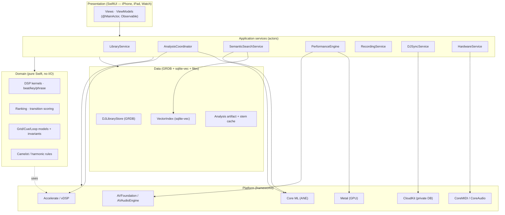

**Layering rules (enforced by module boundaries):**
1. **L1 Platform** is only touched by L4 services and a few L2 adapters. Domain (L3) never imports AVFoundation/CloudKit/Metal.
2. **L3 Domain** is pure and synchronous. Every DSP kernel, ranking function, and invariant check is a free function or value type with no `async`, no I/O, deterministic given inputs. This is what makes NFR-DET testable.
3. **L4 Application services** are the *only* place that combines I/O with logic. They are Swift **actors** (or `@MainActor` classes for UI-facing state). They own concurrency.
4. **L5 Presentation** holds no business logic beyond formatting; it observes L4 state.
5. The **real-time audio render thread lives below all of this** (CoreAudio's own thread, reached via AVAudioEngine and a `AURenderCallback`/`AVAudioSourceNode`). It communicates with L4 only through lock-free structures (§12). No Swift concurrency, no allocation, no locks on that thread.

### 8.1 The "two clocks" principle

Platterhead has two independent time domains that must not be conflated:

- **Preparation time** (wall-clock, best-effort, cancellable): analysis, embedding, search. Latency in the tens of milliseconds to seconds. Runs on background actors and `TaskPriority.background`.
- **Performance time** (sample-accurate, hard real-time): the render callback advancing sample-by-sample against the master clock. Latency budget in milliseconds; *no* best-effort work allowed.

Every subsystem in this document declares which clock it lives in. Mixing the two (e.g., calling the database from the render thread) is the cardinal sin the architecture is designed to prevent.

## 9. Swift package and module architecture

### 9.1 Package strategy

⟢ **Extend, don't fork.** The repo ships a single SPM library, `TonearmCore` (`Package.swift`).
The DJ implementation introduces a second library product in the *same* package, `TonearmDJ`,
that depends on `TonearmCore`. **The single app target links both.** This keeps shared types
(entities, store, sync) singly-defined and keeps free and Pro capability in one binary, which is
what makes an in-app purchase unlock the decks without a relaunch (FR-STORE-2, AT-STORE-2).

**No platform gating.** The previous specification compiled the DJ modules under
`#if os(macOS)`. That conditional is **removed, not inverted** (invariant §49.3.6). `TonearmDJ`
compiles wherever `TonearmCore` compiles — iOS, iPadOS, and macOS — because:

- it costs nothing today (the code is Accelerate, Core ML, Metal and AVFoundation, all of which
  exist on every one of those platforms);
- it is the only thing that keeps a future Mac or Vision build on the *same one-time purchase*
  rather than a second product and a second price;
- and NFR-DET-3 (bit-identical analysis across A- and M-series) is only testable if the same
  code actually builds for both.

Platform-conditional code is confined to the presentation layer and to §34A (audio session).
`watchOS` links only `TonearmCore`, since the Watch is a remote (§39A), not a performer.

**Model weights are not bundled** (FR-SEM-6). The previous spec's `.copy("Resources/CLAP")` and
`.copy("Resources/Demucs")` would add hundreds of megabytes to a free download for a feature
some users never touch. Both models ship as **On-Demand Resources** in the app target, requested
at first use, and are absent from the SPM target entirely (§27.1a, §36.2).

```swift
// Package.swift (additions shown; existing TonearmCore target unchanged)
let package = Package(
    name: "TonearmCore",
    platforms: [.iOS(.v18), .macOS(.v15), .watchOS(.v11)],
    products: [
        .library(name: "TonearmCore", targets: ["TonearmCore"]),
        .library(name: "TonearmDJ",   targets: ["TonearmDJ"])   // NEW
    ],
    dependencies: [
        .package(url: "https://github.com/groue/GRDB.swift", from: "7.0.0"),
        // sqlite-vec is vendored as a C target (see §16.3), not a SwiftPM remote,
        // to keep the extension statically linked and offline-buildable.
    ],
    targets: [
        .target(name: "TonearmCore", /* ...existing... */),

        // NEW — vendored C extension for vector search
        .target(
            name: "CSQLiteVec",
            path: "Sources/CSQLiteVec",
            sources: ["sqlite-vec.c"],
            publicHeadersPath: "include",
            cSettings: [.define("SQLITE_CORE", to: "1")]
        ),

        // NEW — DJ engine + analysis + shared DJ domain. No platform gate.
        // Models are NOT bundled here; they arrive as On-Demand Resources (§27.1a, §36.2).
        .target(
            name: "TonearmDJ",
            dependencies: [
                "TonearmCore",
                "CSQLiteVec",
                .product(name: "GRDB", package: "GRDB.swift")
            ],
            path: "Sources/DJ",
            linkerSettings: [
                .linkedFramework("Accelerate"),
                .linkedFramework("CoreML"),
                .linkedFramework("Metal"),
                .linkedFramework("MetalPerformanceShaders"),
                .linkedFramework("AVFoundation"),
                .linkedFramework("CoreMIDI"),
                .linkedLibrary("sqlite3")
            ]
        ),
        .testTarget(name: "TonearmDJTests", dependencies: ["TonearmDJ"], path: "Tests/DJ",
                    resources: [.copy("Fixtures")])
    ]
)
```

### 9.2 Module map

`TonearmDJ` is internally organized into modules (Swift files grouped by folder; not separate SPM targets, to keep build graph simple and cross-module `internal` access ergonomic). Each module has a **public façade** (an actor or namespace) and **internal** implementation.

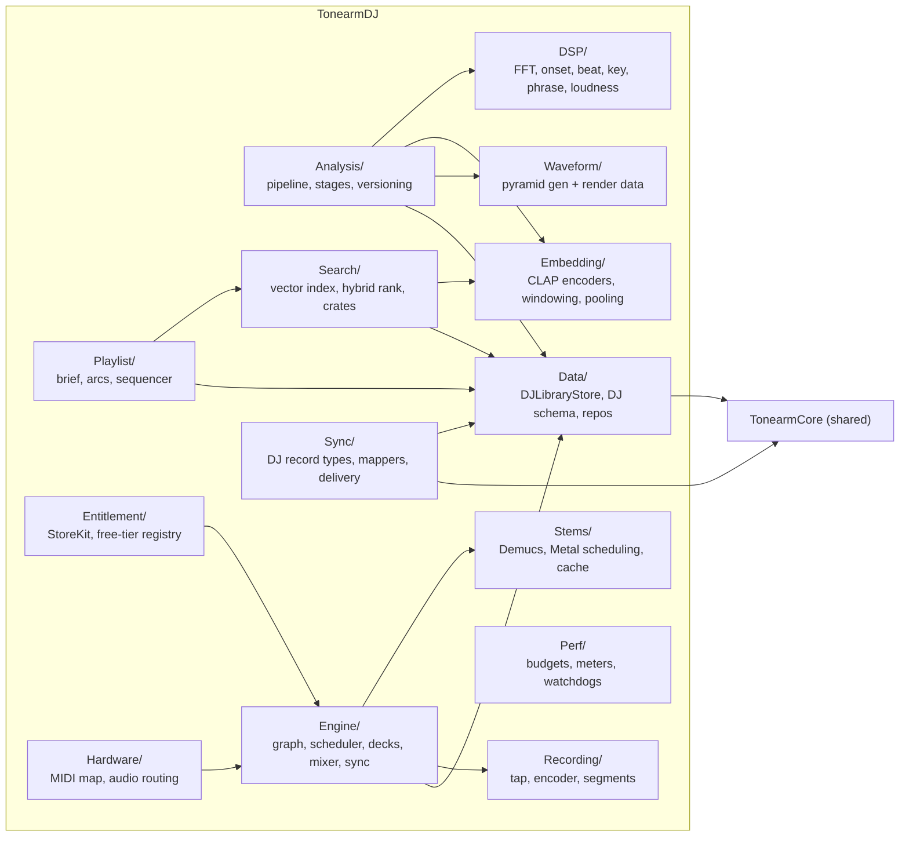

| Module | Clock | Responsibility | Key public type |
|---|---|---|---|
| `Data/` | prep | DJ tables, repositories over GRDB | `actor DJLibraryStore` |
| `DSP/` | prep (pure) | FFT, features, onset, beat, key, phrase, loudness | `enum` kernels (pure) |
| `Analysis/` | prep | Orchestrate stages, versioning, resumability | `actor AnalysisCoordinator` |
| `Embedding/` | prep | CLAP text/audio encode, windowing, pooling | `actor CLAPEmbedder` |
| `Search/` | prep | Vector index, hybrid ranking, Smart Crates | `actor SemanticSearchService` |
| `Playlist/` | prep (pure core) | Brief parsing, energy arcs, transition cost, beam-search sequencing (§28A) | `enum PlaylistSequencer` (pure) + `actor PlaylistGenerator` |
| `Entitlement/` | prep | StoreKit 2 verification, offline entitlement cache, Founders grant, free-tier registry | `@MainActor EntitlementStore` |
| `Waveform/` | prep | Multi-resolution waveform pyramids | `enum WaveformPyramid` |
| `Engine/` | perf | AVAudioEngine graph, scheduler, decks, mixer, sync | `@MainActor PerformanceEngine` + RT core |
| `Stems/` | perf-adjacent | Demucs inference, Metal scheduling, stem cache | `actor StemSeparator` |
| `Recording/` | perf-adjacent | Master tap → AAC segments → `.m4a` | `actor RecordingService` |
| `Sync/` | prep | DJ record types, mappers, CKAsset lifecycle (optional; §38) | `enum DJRecordMapping` + `actor DJSyncService` |
| `Hardware/` | perf-adjacent | MIDI-learn, mapping store, audio device routing, split cue | `actor HardwareService` |
| `Session/` | perf | `AVAudioSession` configuration, route changes, interruptions (§34A) — the one platform-conditional module | `actor AudioSessionCoordinator` |
| `Perf/` | both | Meters, budgets, watchdogs | `actor PerformanceMonitor` |

## 10. Public module interfaces

The following listings are **normative signatures**. They define the seams an agentic implementer builds against. (Bodies are illustrative.)

### 10.1 Data façade

⟢ `DJLibraryStore` wraps a GRDB `DatabaseQueue`/`DatabasePool` exactly as `LibraryStore` does in the repo; it exposes the DJ tables. It is an `actor` for write serialization; reads use GRDB's own concurrency.

```swift
public actor DJLibraryStore {
    public static let shared = try! DJLibraryStore()

    /// Opens (and migrates) the DJ database. Shares the app-group container
    /// so the CloudKit sync layer and the app read the same file.
    public init(path: URL = DJLibraryStore.defaultURL) throws

    // Tracks & analysis
    public func upsertTrack(_ t: DJTrack) throws -> DJTrack.ID
    public func track(id: DJTrack.ID) throws -> DJTrack?
    public func tracks(matching q: LibraryQuery) throws -> [DJTrackRow]
    public func setAnalysisState(_ s: AnalysisState, for id: DJTrack.ID, version: Int) throws

    // Grids / cues / loops
    public func saveBeatGrid(_ g: BeatGrid, for id: DJTrack.ID, source: GridSource) throws
    public func beatGrid(for id: DJTrack.ID) throws -> BeatGrid?
    public func cuePoints(for id: DJTrack.ID) throws -> [CuePoint]
    public func upsertCuePoint(_ c: CuePoint) throws -> CuePoint.ID
    public func loops(for id: DJTrack.ID) throws -> [Loop]

    // Analysis artifacts (frames, phrases, waveform, loudness)
    public func saveFrames(_ f: [FFTFrame], for id: DJTrack.ID) throws
    public func savePhrases(_ p: [Phrase], for id: DJTrack.ID) throws
    public func saveWaveform(_ w: WaveformBlob, for id: DJTrack.ID) throws
    public func saveLoudness(_ l: LoudnessAnalysis, for id: DJTrack.ID) throws

    // Embeddings
    public func saveEmbeddings(track: DJTrack.ID, whole: Embedding, windows: [WindowEmbedding], version: Int) throws

    // Playlists / crates / mixes
    public func upsertSmartCrate(_ c: SmartCrate) throws -> SmartCrate.ID
    public func upsertMix(_ m: DJMix) throws -> DJMix.ID
    public func mixes() throws -> [DJMixRow]

    // Change stream for reactive UI (GRDB ValueObservation bridge)
    public nonisolated func observeTracks(_ q: LibraryQuery) -> AsyncStream<[DJTrackRow]>
}
```

### 10.2 Analysis façade

```swift
public actor AnalysisCoordinator {
    public init(store: DJLibraryStore, embedder: CLAPEmbedder, monitor: PerformanceMonitor)

    /// Enqueue a track for (re)analysis. Idempotent per (trackID, version).
    public func enqueue(_ id: DJTrack.ID, reason: AnalysisReason) async

    /// Enqueue only the stages whose version is behind current (selective re-run).
    public func reconcileVersions() async

    public func pause() async
    public func resume() async

    /// Progress stream for the Ingestion & Analysis screen.
    public nonisolated var progress: AsyncStream<AnalysisProgress> { get }
}

public enum AnalysisReason: Sendable { case newImport, fileChanged, versionUpgrade, userRequested }

public struct AnalysisProgress: Sendable {
    public let trackID: DJTrack.ID
    public let title: String
    public let stage: AnalysisStage      // .decode, .fft, .beat, .key, .phrase, .embed, .waveform, .persist
    public let stageFraction: Double     // 0...1 within stage
    public let queueDepth: Int
}
```

### 10.3 DSP kernels (pure, synchronous)

These live in `DSP/` and import only `Accelerate`. They are the substance of Part IV and are individually testable against fixtures.

```swift
public enum FFTKernel {
    /// Real FFT of a Hann-windowed frame. `log2n` fixes the transform size.
    public static func spectrum(_ frame: [Float], setup: FFTSetupHandle) -> Spectrum
}

public enum SpectralFeatures {
    public static func centroid(_ s: Spectrum) -> Float
    public static func rolloff(_ s: Spectrum, energyFraction: Float = 0.85) -> Float
    public static func flux(_ s: Spectrum, previous: Spectrum) -> Float
    public static func rms(_ frame: [Float]) -> Float
    public static func zeroCrossingRate(_ frame: [Float]) -> Float
    public static func bandEnergy(_ s: Spectrum, low: Float, high: Float) -> Float
}

public enum OnsetDetector {
    public static func envelope(frames: [Spectrum], config: OnsetConfig) -> [Float]
    public static func peaks(_ envelope: [Float], config: OnsetConfig) -> [OnsetPeak]
}

public enum TempoEstimator {
    public static func histogram(_ onsets: [OnsetPeak], config: TempoConfig) -> TempoHistogram
    public static func bpmCandidates(_ h: TempoHistogram, range: ClosedRange<Double> = 60...220) -> [BPMCandidate]
}

public enum BeatTracker {
    public static func grid(onsets: [OnsetPeak], bpm: BPMCandidate, config: BeatConfig) -> BeatGrid
    public static func downbeats(_ grid: BeatGrid, features: [FrameFeature], config: DownbeatConfig) -> [Int]
}

public enum KeyDetector {
    public static func chroma(_ frames: [ConstantQFrame], config: ChromaConfig) -> [HPCP]
    public static func estimate(_ chroma: [HPCP], config: KeyConfig) -> KeyEstimate  // key, mode, confidence
}

public enum PhraseSegmenter {
    public static func segment(features: [FrameFeature], beats: BeatGrid, config: PhraseConfig) -> [Phrase]
}

public enum LoudnessAnalyzer {
    public static func integratedLUFS(_ pcm: PCMBuffer) -> Double
    public static func replayGain(_ pcm: PCMBuffer) -> Double   // ⟢ align with TonearmCore.ReplayGain
    public static func dynamicRange(_ pcm: PCMBuffer) -> Double  // e.g., EBU DR / crest factor
}
```

### 10.4 Embedding façade

```swift
public actor CLAPEmbedder {
    public init(model: CLAPModel = .musicFP16)

    /// Whole-track + per-window audio embeddings (see §27 for windowing).
    public func embedAudio(_ pcm: PCMBuffer, config: EmbedConfig) async throws -> AudioEmbeddingResult

    /// Text → 512-d vector using the CLAP text encoder, for vibe search.
    public func embedText(_ prompt: String) async throws -> Embedding

    public nonisolated var version: Int { get }   // embedding_version
}

public struct AudioEmbeddingResult: Sendable {
    public let whole: Embedding                 // pooled 512-d
    public let windows: [WindowEmbedding]       // per-10s 512-d + time span
    public let version: Int
}
```

### 10.5 Search façade

```swift
public actor SemanticSearchService {
    public init(store: DJLibraryStore, embedder: CLAPEmbedder, index: VectorIndex)

    public func search(_ query: VibeQuery) async throws -> [SearchResult]
    public func saveCrate(_ query: VibeQuery, name: String) async throws -> SmartCrate.ID
    public func resolveCrate(_ id: SmartCrate.ID) async throws -> [SearchResult]

    /// Called by AnalysisCoordinator when embeddings change; keeps ANN index warm.
    public func indexDidChange(trackIDs: [DJTrack.ID]) async
}

public struct VibeQuery: Sendable, Codable {
    public var text: String
    public var positiveTerms: [String]     // "+ instrumental", "+ hypnotic"
    public var negativeTerms: [String]     // "– bright vocals"
    public var bpmRange: ClosedRange<Double>?
    public var compatibleWithKey: CamelotKey?   // "Compatible with Deck A · 8A"
    public var limit: Int = 100
}

public struct SearchResult: Sendable {
    public let track: DJTrackRow
    public let similarity: Float     // cosine, 0...1 (the "92% match")
    public let finalScore: Float     // hybrid score used for ordering
    public let reasons: RankBreakdown
}
```

### 10.6 Performance engine façade

The engine's *control surface* is `@MainActor` (bindable to SwiftUI); its *audio core* runs on the render thread and is reached only via the lock-free command ring (§12, §30).

```swift
@MainActor
public final class PerformanceEngine: ObservableObject {
    public static let shared = PerformanceEngine()

    @Published public private(set) var deckA: DeckState
    @Published public private(set) var deckB: DeckState
    @Published public private(set) var mixer: MixerState
    @Published public private(set) var meters: EngineMeters   // CPU/GPU/levels, updated ~30 Hz

    // Transport (enqueue RT commands; return immediately)
    public func load(_ track: DJTrack.ID, into deck: DeckID) async throws
    public func play(_ deck: DeckID)
    public func pause(_ deck: DeckID)
    public func cue(_ deck: DeckID)
    public func setPitch(_ deck: DeckID, percent: Double)      // tempo change
    public func toggleKeyLock(_ deck: DeckID)
    public func sync(_ deck: DeckID, to master: DeckID)
    public func setLoop(_ deck: DeckID, beats: Int?)
    public func triggerCue(_ deck: DeckID, _ cue: CuePoint.ID, quantize: Quantize)

    // Mixer
    public func setEQ(_ deck: DeckID, band: EQBand, gainDB: Float)
    public func setFilter(_ deck: DeckID, cutoff: Float, resonance: Float)
    public func setCrossfader(_ position: Float)               // -1...+1
    public func setStemLevel(_ deck: DeckID, stem: Stem, level: Float)
    public func setStemMute(_ deck: DeckID, stem: Stem, muted: Bool)

    // Recording
    public func startRecording() async throws
    public func stopRecording() async throws -> DJMix.ID
}
```

### 10.7 Stems, recording, sync, hardware façades

```swift
public actor StemSeparator {
    public init(model: DemucsModel = .htdemucsFP16, device: MTLDevice = MTLCreateSystemDefaultDevice()!)
    /// Offline pre-separation into cached stem files (preferred for performance).
    public func separateToCache(_ id: DJTrack.ID, pcm: PCMBuffer) async throws -> StemCacheHandle
    /// Live path: process a windowed buffer on GPU (used only when cache miss).
    public func separateLive(_ window: PCMBuffer) async throws -> StemBuffers
    public func evict(olderThan: Date) async
}

public actor RecordingService {
    public init(store: DJLibraryStore)
    public func begin(format: RecordingFormat) async throws -> RecordingHandle
    public func appendPlaylistEvent(_ e: MixTrackEvent) async
    public func finish(title: String, notes: String) async throws -> DJMix.ID
    public nonisolated var elapsed: AsyncStream<TimeInterval> { get }
}

public actor DJSyncService {
    public init(store: DJLibraryStore, engine: CloudSyncEngine = .shared)  // ⟢ reuse existing engine
    public func syncNow() async
    public func uploadMix(_ id: DJMix.ID) async throws
    public nonisolated var status: AsyncStream<DJSyncStatus> { get }
}

public actor HardwareService {
    public init()
    public func audioDevices() async -> [AudioDeviceInfo]
    public func setRouting(_ routing: ChannelRouting) async throws
    public func beginMIDILearn(for target: MIDITarget) async -> AsyncStream<MIDILearnEvent>
    public func saveMapping(_ m: MIDIMapping) async throws
    public func importMapping(_ url: URL) async throws -> MIDIMapping
}
```

## 11. Concurrency architecture (actors and isolation)

Platterhead uses Swift structured concurrency with a small number of **actors** as concurrency domains, `@MainActor` for UI-facing observable state, and a **lock-free boundary** to the audio render thread. The guiding rule: *every mutable subsystem is owned by exactly one isolation domain; cross-domain communication is by value (`Sendable`) or by lock-free ring.*

```mermaid
flowchart TB
    subgraph Main["@MainActor"]
        VMs["ViewModels · PerformanceEngine control · meters"]
    end
    subgraph Actors["Background actors (each = one domain)"]
        A1["DJLibraryStore"]:::a
        A2["AnalysisCoordinator"]:::a
        A3["CLAPEmbedder"]:::a
        A4["SemanticSearchService"]:::a
        A5["StemSeparator"]:::a
        A6["RecordingService"]:::a
        A7["DJSyncService"]:::a
        A8["HardwareService"]:::a
        A9["PerformanceMonitor"]:::a
    end
    subgraph RT["Real-time render thread (NO Swift concurrency)"]
        Ring["Lock-free command ring + atomic snapshots"]
        Render["AVAudioSourceNode render blocks"]
    end

    VMs -->|await| Actors
    VMs -->|enqueue commands| Ring
    Ring --> Render
    Render -->|lock-free meters/levels| A9
    A9 -->|await| VMs
    A2 --> A1 & A3
    A4 --> A1 & A3
    A5 --> A1
    A6 --> A1
    A7 --> A1

    classDef a fill:#181c24,stroke:#7c5cff;
```

### 11.1 Isolation rules

- **`DJLibraryStore` is the single writer** to the DJ database. All writes funnel through it (serialized by the actor). Reads may use GRDB `ValueObservation` bridged to `AsyncStream` for reactive UI; those observations run on GRDB's reader pool, not the actor, avoiding read/write contention.
- **`AnalysisCoordinator` owns the analysis queue** and a bounded task group (concurrency = number of performance cores minus a reserve; see §43). It never touches UI or the engine. It calls `CLAPEmbedder` and `DJLibraryStore`.
- **`CLAPEmbedder` serializes Core ML calls.** Core ML models are not free-threaded; the actor guarantees one prediction at a time per model and lets Core ML schedule the ANE. Text and audio encoders may be separate models behind one actor.
- **`StemSeparator` serializes GPU submission.** It owns the `MTLCommandQueue` and the stem cache. Live separation and cache eviction cannot race.
- **`PerformanceEngine` (control) is `@MainActor`.** It is bindable and cheap. It does *not* do audio work; it translates user intent into commands pushed onto the lock-free ring and updates published state from meter callbacks.
- **The render thread is outside Swift concurrency entirely.** It is created and managed by CoreAudio via AVAudioEngine. Our render blocks (`AVAudioSourceNode`) must be `@Sendable`, allocation-free, lock-free, and wait-free. They read an **atomic engine snapshot** (double-buffered) and drain a **single-producer/single-consumer command ring**. See §12 and §30.

### 11.2 Sendability and data transfer

- All types crossing an actor boundary are `Sendable`. Value types (`struct`, `enum`) dominate the domain layer for this reason.
- Large buffers (PCM, stem audio) are transferred as `@unchecked Sendable` wrappers around immutable, uniquely-owned storage (`class PCMBuffer` with copy-on-handoff discipline) to avoid copies while keeping the compiler's guarantees meaningful. Ownership is transferred, not shared.
- The render thread never receives a Swift object by reference from an actor. It receives **plain-old-data** written into pre-allocated ring slots (§12.2).

### 11.3 Cancellation and priority

- Analysis and embedding run at `TaskPriority.background`. Search runs at `.userInitiated`. Loading a deck runs at `.userInitiated` but its RT arming is immediate.
- Every long task checks `Task.isCancelled` between stages; the `AnalysisCoordinator` cancels in-flight work for a track if the file changes again or the user removes it.
- Priority inversion is avoided at the render boundary because the render thread never waits on an actor; it only reads lock-free state.

## 12. Thread, queue, and real-time execution model

This section defines the **hard real-time boundary** — the single most important correctness property in the product (NFR-PERF-1).

### 12.1 Threads and queues inventory

| Domain | Mechanism | Priority | May block? |
|---|---|---|---|
| UI | Main thread / `@MainActor` | user-interactive | No long blocks |
| Analysis | Actor + `TaskGroup` | background | Yes (disk, ANE) |
| Embedding | Actor, serial Core ML | background/user-init | Yes (ANE) |
| Search | Actor | user-initiated | Yes (SQLite) |
| Stems (offline) | Actor, serial Metal queue | user-initiated | Yes (GPU) |
| Recording | Actor + `AVAudioFile` writer | user-initiated | Yes (disk) |
| **Audio render** | **CoreAudio thread (HAL)** | **real-time** | **NEVER** |
| Sync | Actor → `CKSyncEngine` | utility | Yes (network) |

### 12.2 The lock-free boundary

Between `@MainActor` control and the render thread sit two structures, both pre-allocated at engine start and never reallocated:

1. **Command ring (SPSC).** A fixed-capacity, single-producer (main)/single-consumer (render) ring buffer of POD `RTCommand` values. Producer writes with release semantics; consumer reads with acquire semantics; head/tail are `atomic`. Commands are small (tag + union payload): `play/pause/cue/setPitch/setEQ/setXfader/setStemLevel/triggerCue/setLoop/...`. The render block drains up to *N* commands at the top of each callback, applies them to its private RT state, and returns.

```swift
// Illustrative shape; real impl uses C atomics or Swift Atomics package.
struct RTCommand {              // POD, trivially copyable, fixed size
    enum Tag: UInt8 { case play, pause, cue, setPitch, setEQ, setXfader,
                          setStemLevel, setStemMute, triggerCue, setLoop, loadArm }
    var tag: Tag
    var deck: UInt8             // 0 = A, 1 = B
    var i0: Int64              // e.g., cue sample position, loop length in beats
    var f0: Float              // e.g., gain dB, xfader position, level
    var f1: Float
    var ptr: UnsafeRawPointer? // e.g., pre-armed track render source (ownership transferred)
}

final class CommandRing {       // capacity is power of two
    private let capacity: Int
    private let buffer: UnsafeMutablePointer<RTCommand>
    private var head = ManagedAtomic<Int>(0)   // consumer (render)
    private var tail = ManagedAtomic<Int>(0)   // producer (main)

    /// Main thread. Returns false if full (caller coalesces or drops non-critical).
    func tryPush(_ cmd: RTCommand) -> Bool { /* CAS-free SPSC push */ }

    /// Render thread. Wait-free drain.
    @inline(__always) func drain(_ apply: (RTCommand) -> Void) { /* ... */ }
}
```

2. **Engine snapshot (double-buffered, atomic pointer swap).** For state too large or too structured for the ring (e.g., a newly computed beat grid, a swapped-in stem buffer set, a full EQ coefficient set), the producer builds an immutable snapshot off-thread, then publishes it with a single atomic pointer store. The render thread reads the current pointer once per callback with acquire semantics. The previous snapshot is reclaimed later on a non-RT thread (a simple retire list drained by the control side), never freed on the render thread.

### 12.3 The render callback contract

Each `AVAudioSourceNode` render block MUST:
- allocate nothing (no Swift `Array`, no `String`, no ARC traffic on non-`Unmanaged` objects);
- take no locks and call nothing that might (no `os_unfair_lock` held across work, no `NSLock`, no `print`, no logging that allocates);
- perform only bounded arithmetic and memory reads/writes on pre-allocated buffers;
- read the command ring and current snapshot exactly as described;
- write output frames and update *atomic* meter counters (peak, RMS) that the `PerformanceMonitor` samples at ~30 Hz.

Violations are caught in review and by a debug-only "RT assertion" shim that traps if allocation/locking is detected on the render thread (see §46.3).

### 12.4 Why AVAudioSourceNode (not a raw AURemoteIO)

`AVAudioSourceNode`/`AVAudioSinkNode` give us render blocks with full control while letting AVAudioEngine own device management, format conversion, and the multichannel `AVAudioEngine`↔device plumbing we need for cue/master routing (§29, §44). We get the deterministic callback we require without hand-rolling the HAL, and we keep the option to attach Apple's `AVAudioUnitTimePitch` and `AVAudioUnitEQ` where they meet quality/latency needs (§31, §35).

---
---

# Part III — Data Layer

## 13. Data architecture and storage engines

Platterhead persists three qualitatively different kinds of data, each with a matched engine:

1. **Relational + queryable state** — tracks, cues, loops, phrases, grids, playlists, mixes, hardware maps. Engine: **SQLite via GRDB 7** (⟢ the version already in `Package.swift`), WAL mode, one authoritative writer (`DJLibraryStore` actor). This is where editable, joinable, syncable state lives.
2. **Dense numeric arrays** — per-frame FFT features, onset envelopes, beat positions, energy curves, waveform pyramids, and embedding vectors. Storing one SQLite row per frame/beat would mean millions of rows per library and pathological write amplification. Instead these are stored as **compact binary BLOBs** with documented, versioned layouts, in "header" rows that carry metadata and a `format` byte. (⟢ mirrors the repo's `cache_entry.byteRanges` blob approach.)
3. **Vector search** — whole-track and per-window 512-D embeddings indexed for cosine ANN. Engine: **sqlite-vec** virtual tables in the *same* database file, so search joins directly against `track` without a second store (§16).

Large media on disk (stem caches, mix `.m4a` files) are **files referenced by path**, never blobs in SQLite. The database stores their locations, sizes, and lifecycle state.

### 13.1 Database files and locations

| File | Owner | Contents | Sync? | Backed up? |
|---|---|---|---|---|
| `tonearm-dj.sqlite` (+ `-wal`, `-shm`) | `DJLibraryStore` | all relational + analysis-header + vector *row* tables | rows sync selectively via CloudKit | ✅ |
| `vectors.i8` | `SemanticSearchService` | Tier A int8 vector matrix (§16.2) | never | ⛔ excluded |
| `Stems/<sha256>/*.caf` | `StemSeparator` | cached separated stems | never | ⛔ excluded |
| `Mixes/<uuid>.m4a` | `RecordingService` | recorded mixes | as `CKAsset` when user opts in | ✅ |
| `Waveforms/` (optional overflow) | `DJLibraryStore` | oversized waveform pyramids if not inlined | never | ⛔ excluded |
| `Models/` (ODR-managed) | `ModelResourceService` | CLAP + Demucs Core ML packages (§27.1a) | never | ⛔ system-managed |

**iOS locations (normative).** The database and mixes live in
`Application Support/`. Every derived cache — vectors, stems, waveform overflow — lives under
`Caches/`, and every one of them is marked
`URLResourceValues.isExcludedFromBackup = true`.

This is not housekeeping; it is a correctness requirement. iCloud Backup and iTunes/Finder
backup will otherwise attempt to copy tens of gigabytes of stems, and App Review has rejected
apps for writing large regenerable data outside `Caches/`. Every one of these files is
deterministically reproducible from the source audio and the analysis version (NFR-DET-1), which
is precisely why FR-SYNC-5 forbids syncing them and why losing them to a cache purge is a
recoverable event rather than data loss. The app MUST detect a purged cache on launch and
re-derive lazily, without an error dialog.

The database lives in the app-group container so the app, the widget extension and the share
extension share one file. **All tables exist on every device** — the previous specification's
split, where iOS materialized only mix records, is deleted along with the companion model
(§39.1).

### 13.2 Conventions (aligned to the existing repo)

- **Table names** `snake_case`; **columns** `camelCase` (dominant repo style, e.g. `addedAt`, `followUpdates`).
- Every syncable table carries a **`syncID TEXT`** (UUID string) — the cross-device identity CloudKit uses (⟢ exactly as `RecordMapping` does; see §38). Local integer PKs are never sent over the wire.
- Foreign keys use `.references(onDelete:)` with explicit cascade/set-null semantics.
- Timestamps are stored as SQLite `datetime` (GRDB `Date`).
- All migrations are registered in an ordered list in `DJSchema` (⟢ mirrors `Schema.migrationOrder`), named `dj_v1`, `dj_v2`, ….
- **Analysis-version columns** (`analysisVersion`, `embeddingVersion`) are integers gating selective re-run (§17).
- BLOB layouts begin with a 1-byte `format` tag and are documented in §15.7 and Appendix C.

### 13.3 Table inventory (53 tables + 2 virtual)

Grouped by domain; DDL follows. Virtual (sqlite-vec) tables marked ▲. Seven tables are new in
this specification: `auto_playlist_brief`, `auto_playlist_result`, `auto_playlist_item`,
`auto_playlist_rejection`, `gig_crate`, `gig_crate_track` (§14.3) and `vector_matrix_meta`
(§15.4). The `vec_window` virtual table is now crate-scoped rather than library-wide (§16.4).

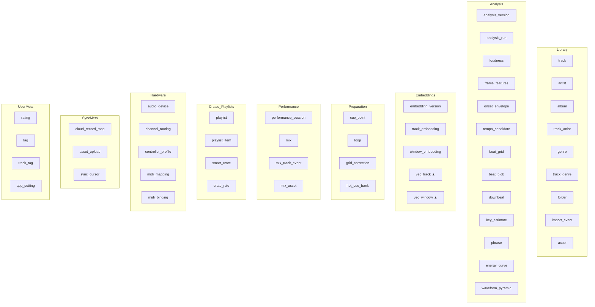

## 14. Complete SQLite schema — relational core (`Library`, `Preparation`, `Crates`, `UserMeta`)

The DDL below is presented as GRDB migration bodies. Migration `dj_v1` creates the library + preparation + crate + user-meta core; `dj_v2` (§15) adds analysis/embedding/performance/hardware/sync tables. (Splitting is cosmetic; both ship in v1.0.)

### 14.1 Library domain

```swift
migrator.registerMigration("dj_v1") { db in

    // ---- artist ----
    try db.create(table: "artist") { t in
        t.autoIncrementedPrimaryKey("id")
        t.column("syncID", .text).notNull().unique()
        t.column("name", .text).notNull()
        t.column("sortName", .text).notNull()
        t.column("createdAt", .datetime).notNull()
    }
    try db.create(indexOn: "artist", columns: ["sortName"])

    // ---- album ----
    try db.create(table: "album") { t in
        t.autoIncrementedPrimaryKey("id")
        t.column("syncID", .text).notNull().unique()
        t.column("title", .text).notNull()
        t.column("albumArtist", .text)
        t.column("year", .integer)
        t.column("artworkID", .text)              // hash key into artwork cache (local)
        t.column("createdAt", .datetime).notNull()
    }

    // ---- track (DJ-authoritative library row) ----
    try db.create(table: "track") { t in
        t.autoIncrementedPrimaryKey("id")
        t.column("syncID", .text).notNull().unique()
        t.column("albumID", .integer).references("album", onDelete: .setNull)
        t.column("title", .text).notNull()
        t.column("trackNo", .integer)
        t.column("discNo", .integer)
        t.column("durationSec", .double)
        t.column("codec", .text)                  // "flac","alac","mp3","aac","wav","aiff","opus"
        t.column("sampleRate", .integer)          // source sample rate
        t.column("channelCount", .integer)
        t.column("bitDepthOrBitrate", .text)
        t.column("contentHash", .text).notNull()  // SHA-256 of decoded PCM header + file id (⟢ CacheKeyGenerator style)
        t.column("sortKey", .text).notNull()
        // denormalized analysis summary for fast library listing (FR-LIB-4)
        t.column("bpm", .double)                  // authoritative (corrected) BPM
        t.column("detectedBPM", .double)
        t.column("camelot", .text)                // "8A"
        t.column("musicalKey", .text)             // "A minor"
        t.column("energy", .double)               // 0...10 summary (FR-PREP-4)
        t.column("analysisVersion", .integer).notNull().defaults(to: 0)
        t.column("embeddingVersion", .integer).notNull().defaults(to: 0)
        t.column("analysisState", .text).notNull().defaults(to: "pending") // see AnalysisState
        t.column("stemState", .text).notNull().defaults(to: "none")        // none|caching|ready
        t.column("addedAt", .datetime).notNull()
        t.column("updatedAt", .datetime).notNull()
    }
    try db.create(indexOn: "track", columns: ["sortKey"])
    try db.create(indexOn: "track", columns: ["bpm"])
    try db.create(indexOn: "track", columns: ["camelot"])
    try db.create(indexOn: "track", columns: ["analysisState"])

    // ---- track_artist (many-to-many, ordered, role) ----
    try db.create(table: "track_artist") { t in
        t.autoIncrementedPrimaryKey("id")
        t.column("trackID", .integer).notNull().references("track", onDelete: .cascade)
        t.column("artistID", .integer).notNull().references("artist", onDelete: .cascade)
        t.column("role", .text).notNull().defaults(to: "primary")   // primary|feature|remixer
        t.column("position", .integer).notNull().defaults(to: 0)
    }
    try db.create(index: "idx_track_artist_track", on: "track_artist", columns: ["trackID"])

    // ---- genre + track_genre ----
    try db.create(table: "genre") { t in
        t.autoIncrementedPrimaryKey("id")
        t.column("name", .text).notNull().unique()
    }
    try db.create(table: "track_genre") { t in
        t.column("trackID", .integer).notNull().references("track", onDelete: .cascade)
        t.column("genreID", .integer).notNull().references("genre", onDelete: .cascade)
        t.primaryKey(["trackID", "genreID"])
    }

    // ---- folder (watched directories; ⟢ populated by TonearmCore FolderWatchService adapter) ----
    try db.create(table: "folder") { t in
        t.autoIncrementedPrimaryKey("id")
        t.column("syncID", .text).notNull().unique()
        t.column("displayPath", .text).notNull()   // "~/Music/Platterhead", "/Volumes/DJ Archive"
        t.column("bookmark", .blob).notNull()       // security-scoped bookmark (⟢ BookmarkVault)
        t.column("watching", .boolean).notNull().defaults(to: true)
        t.column("addedAt", .datetime).notNull()
        t.column("lastScanAt", .datetime)
    }

    // ---- asset (file reference for a track; never a copy) ----
    try db.create(table: "asset") { t in
        t.autoIncrementedPrimaryKey("id")
        t.column("trackID", .integer).notNull().references("track", onDelete: .cascade)
        t.column("folderID", .integer).references("folder", onDelete: .setNull)
        t.column("bookmark", .blob)                 // security-scoped bookmark to the file
        t.column("relPath", .text)                  // path relative to folder, for display/rescan
        t.column("sizeBytes", .integer)
        t.column("fileModifiedAt", .datetime)       // for change detection (FR-LIB-2)
        t.column("unsupportedReason", .text)        // non-null if file can't be decoded
    }
    try db.create(index: "idx_asset_track", on: "asset", columns: ["trackID"])

    // ---- import_event (audit of ingestion) ----
    try db.create(table: "import_event") { t in
        t.autoIncrementedPrimaryKey("id")
        t.column("trackID", .integer).references("track", onDelete: .setNull)
        t.column("kind", .text).notNull()           // discovered|reanalyzed|removed|error
        t.column("detail", .text)
        t.column("at", .datetime).notNull()
    }
```

### 14.2 Preparation domain (cues, loops, grid corrections)

```swift
    // ---- cue_point (hot cues + named markers; FR-PREP-2) ----
    try db.create(table: "cue_point") { t in
        t.autoIncrementedPrimaryKey("id")
        t.column("syncID", .text).notNull().unique()
        t.column("trackID", .integer).notNull().references("track", onDelete: .cascade)
        t.column("samplePosition", .integer).notNull()   // sample-accurate (Int64)
        t.column("kind", .text).notNull().defaults(to: "hot")  // hot|load|fade|grid|memory
        t.column("label", .text)                          // "Intro","Bass enters","Breakdown"
        t.column("colorIndex", .integer).notNull().defaults(to: 0)
        t.column("hotIndex", .integer)                    // A=0,B=1,... nullable if not a pad
        t.column("createdAt", .datetime).notNull()
        t.column("updatedAt", .datetime).notNull()
    }
    try db.create(index: "idx_cue_track", on: "cue_point", columns: ["trackID"])

    // ---- hot_cue_bank (per-track pad layout metadata; optional grouping) ----
    try db.create(table: "hot_cue_bank") { t in
        t.autoIncrementedPrimaryKey("id")
        t.column("trackID", .integer).notNull().references("track", onDelete: .cascade)
        t.column("bankIndex", .integer).notNull().defaults(to: 0)
        t.column("name", .text)
    }

    // ---- loop (in/out, beats; snaps to grid; FR-PREP-3) ----
    try db.create(table: "loop") { t in
        t.autoIncrementedPrimaryKey("id")
        t.column("syncID", .text).notNull().unique()
        t.column("trackID", .integer).notNull().references("track", onDelete: .cascade)
        t.column("startSample", .integer).notNull()
        t.column("endSample", .integer).notNull()
        t.column("lengthBeats", .double)                  // e.g., 4, 8, 0.5 (grid-relative)
        t.column("label", .text)
        t.column("isActive", .boolean).notNull().defaults(to: false)
        t.column("createdAt", .datetime).notNull()
    }
    try db.create(index: "idx_loop_track", on: "loop", columns: ["trackID"])

    // ---- grid_correction (authoritative user override log; FR-ANL-5) ----
    try db.create(table: "grid_correction") { t in
        t.autoIncrementedPrimaryKey("id")
        t.column("syncID", .text).notNull().unique()
        t.column("trackID", .integer).notNull().references("track", onDelete: .cascade)
        t.column("op", .text).notNull()                   // nudge|setDownbeat|doubleBPM|halveBPM|setBPM|shift
        t.column("valueDouble", .double)                  // e.g., new BPM, nudge ms
        t.column("valueInt", .integer)                    // e.g., sample offset
        t.column("appliedAt", .datetime).notNull()
    }
```

### 14.3 Crates & playlists domain

```swift
    // ---- playlist (static, ordered) ----
    try db.create(table: "playlist") { t in
        t.autoIncrementedPrimaryKey("id")
        t.column("syncID", .text).notNull().unique()
        t.column("title", .text).notNull()
        t.column("kind", .text).notNull().defaults(to: "manual")   // manual|performance
        t.column("createdAt", .datetime).notNull()
        t.column("updatedAt", .datetime).notNull()
    }
    try db.create(table: "playlist_item") { t in
        t.autoIncrementedPrimaryKey("id")
        t.column("playlistID", .integer).notNull().references("playlist", onDelete: .cascade)
        t.column("trackID", .integer).notNull().references("track", onDelete: .cascade)
        t.column("position", .integer).notNull()
    }
    try db.create(index: "idx_pli_playlist", on: "playlist_item", columns: ["playlistID", "position"])

    // ---- smart_crate (a stored VibeQuery; resolves live; FR-SEM-5) ----
    try db.create(table: "smart_crate") { t in
        t.autoIncrementedPrimaryKey("id")
        t.column("syncID", .text).notNull().unique()
        t.column("name", .text).notNull()
        t.column("queryJSON", .text).notNull()            // encoded VibeQuery
        t.column("pinned", .boolean).notNull().defaults(to: false)
        t.column("createdAt", .datetime).notNull()
        t.column("updatedAt", .datetime).notNull()
    }
    // ---- crate_rule (optional normalized constraints for non-semantic crates) ----
    try db.create(table: "crate_rule") { t in
        t.autoIncrementedPrimaryKey("id")
        t.column("crateID", .integer).notNull().references("smart_crate", onDelete: .cascade)
        t.column("field", .text).notNull()                // bpm|camelot|energy|genre|rating|addedAt
        t.column("op", .text).notNull()                   // between|eq|gte|lte|in
        t.column("valueJSON", .text).notNull()
    }

    // ---- auto_playlist_brief (FREE; §28A, FR-PLIST-7) ------------------------
    // The user's *intent*, kept as a first-class editable object. A generated
    // playlist stores the brief that made it, so "regenerate", "extend", and
    // re-resolution on another device all work from the same source of truth.
    try db.create(table: "auto_playlist_brief") { t in
        t.autoIncrementedPrimaryKey("id")
        t.column("syncID", .text).notNull().unique()
        t.column("prompt", .text).notNull()               // the user's own words
        t.column("arcKind", .text).notNull()              // steady|build|peakRelease|windDown|wave|custom
        t.column("arcPointsJSON", .text)                  // [Double] normalized 0…1, custom arcs only
        t.column("targetSeconds", .integer)               // XOR with targetTrackCount
        t.column("targetTrackCount", .integer)
        t.column("constraintsJSON", .text).notNull()      // encoded SequencingConstraints (§28A.2)
        t.column("seedTrackID", .integer).references("track", onDelete: .setNull)
        t.column("seedCrateID", .integer).references("smart_crate", onDelete: .setNull)
        t.column("randomSeed", .integer).notNull()        // makes generation reproducible (NFR-DET-1)
        t.column("createdAt", .datetime).notNull()
        t.column("updatedAt", .datetime).notNull()
    }

    // ---- auto_playlist_result (the generated sequence + its scoring) --------
    try db.create(table: "auto_playlist_result") { t in
        t.autoIncrementedPrimaryKey("id")
        t.column("briefID", .integer).notNull().references("auto_playlist_brief", onDelete: .cascade)
        t.column("playlistID", .integer).references("playlist", onDelete: .cascade)   // if saved static
        t.column("smartCrateID", .integer).references("smart_crate", onDelete: .cascade) // if saved smart
        t.column("generatedAt", .datetime).notNull()
        t.column("totalSeconds", .integer).notNull()
        t.column("arcError", .double).notNull()           // mean |actual − target| energy, 0…1
        t.column("meanTransitionCost", .double).notNull() // §28A.1
        t.column("analysisVersion", .integer).notNull()
    }

    // ---- auto_playlist_item (per-slot state: locks, rejects, why it's here) --
    try db.create(table: "auto_playlist_item") { t in
        t.autoIncrementedPrimaryKey("id")
        t.column("resultID", .integer).notNull().references("auto_playlist_result", onDelete: .cascade)
        t.column("trackID", .integer).notNull().references("track", onDelete: .cascade)
        t.column("position", .integer).notNull()
        t.column("locked", .boolean).notNull().defaults(to: false)   // FR-PLIST-6
        t.column("targetEnergy", .double).notNull()       // what the arc asked for here
        t.column("actualEnergy", .double).notNull()       // what this track delivers
        t.column("transitionCostIn", .double)             // cost from the previous slot; NULL at head
        t.column("semanticScore", .double).notNull()
    }
    try db.create(index: "idx_apl_item_result", on: "auto_playlist_item",
                  columns: ["resultID", "position"])

    // ---- auto_playlist_rejection (tracks the user said no to; §28A.4) -------
    try db.create(table: "auto_playlist_rejection") { t in
        t.autoIncrementedPrimaryKey("id")
        t.column("briefID", .integer).notNull().references("auto_playlist_brief", onDelete: .cascade)
        t.column("trackID", .integer).notNull().references("track", onDelete: .cascade)
        t.column("rejectedAt", .datetime).notNull()
    }
    try db.create(index: "idx_apl_reject", on: "auto_playlist_rejection", columns: ["briefID", "trackID"])

    // ---- gig_crate (PRO; §41.17, FR-PLIST-9, FR-ANL-9) ----------------------
    // A crate promoted to performance readiness: audio cached, stage-3 stems
    // queued, all under a storage budget.
    try db.create(table: "gig_crate") { t in
        t.autoIncrementedPrimaryKey("id")
        t.column("syncID", .text).notNull().unique()
        t.column("name", .text).notNull()
        t.column("playlistID", .integer).references("playlist", onDelete: .setNull)
        t.column("smartCrateID", .integer).references("smart_crate", onDelete: .setNull)
        t.column("storageBudgetBytes", .integer).notNull()
        t.column("lastPerformedAt", .datetime)            // drives LRU eviction (FR-ANL-9)
        t.column("createdAt", .datetime).notNull()
    }
    try db.create(table: "gig_crate_track") { t in
        t.autoIncrementedPrimaryKey("id")
        t.column("gigCrateID", .integer).notNull().references("gig_crate", onDelete: .cascade)
        t.column("trackID", .integer).notNull().references("track", onDelete: .cascade)
        t.column("position", .integer).notNull()
        t.column("audioCached", .boolean).notNull().defaults(to: false)   // FR-LIB-8 gate
        t.column("stemsState", .text).notNull().defaults(to: "pending")   // pending|running|ready|failed|evicted
        t.column("stemsBytes", .integer).notNull().defaults(to: 0)
    }
    try db.create(index: "idx_gct_crate", on: "gig_crate_track", columns: ["gigCrateID", "position"])
```

**Why `auto_playlist_brief` is a table and not a JSON blob on `playlist`.** The brief is the
thing the user actually authored — "an hour that starts mellow and ends euphoric" is a sentence
they wrote and may want to edit six months later. Storing it structurally means it syncs
(§38.2), it re-resolves against a library that has grown, and "make me another one like that
but shorter" is an `UPDATE` rather than a re-typing. `randomSeed` makes the whole generation
reproducible, which is what lets the same brief produce the same playlist on an iPad and an
iPhone holding the same tracks (NFR-DET-1).

### 14.4 User-meta domain (ratings, tags, settings)

```swift
    // ---- rating ----
    try db.create(table: "rating") { t in
        t.column("trackID", .integer).notNull().references("track", onDelete: .cascade)
        t.column("syncID", .text).notNull().unique()
        t.column("stars", .integer).notNull()             // 0...5
        t.column("updatedAt", .datetime).notNull()
        t.primaryKey(["trackID"])
    }
    // ---- tag + track_tag ----
    try db.create(table: "tag") { t in
        t.autoIncrementedPrimaryKey("id")
        t.column("syncID", .text).notNull().unique()
        t.column("name", .text).notNull().unique()
        t.column("colorIndex", .integer).notNull().defaults(to: 0)
    }
    try db.create(table: "track_tag") { t in
        t.column("trackID", .integer).notNull().references("track", onDelete: .cascade)
        t.column("tagID", .integer).notNull().references("tag", onDelete: .cascade)
        t.primaryKey(["trackID", "tagID"])
    }
    // ---- app_setting (typed key/value; ⟢ analog to AppSettings sync singleton) ----
    try db.create(table: "app_setting") { t in
        t.column("key", .text).notNull()
        t.column("valueJSON", .text).notNull()
        t.column("updatedAt", .datetime).notNull()
        t.primaryKey(["key"])
    }
} // end dj_v1
```

### 14.5 Library ER diagram

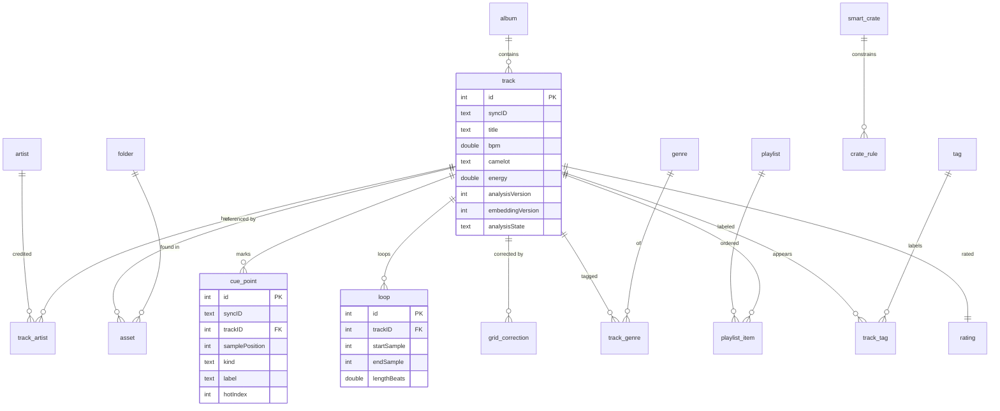

## 15. Complete SQLite schema — analysis, embeddings, performance, hardware, sync (`dj_v2`)

### 15.1 Analysis versioning & run-state

```swift
migrator.registerMigration("dj_v2") { db in

    // ---- analysis_version (registry of algorithm sets) ----
    try db.create(table: "analysis_version") { t in
        t.column("stage", .text).notNull()          // fft|beat|key|phrase|loudness|waveform|embedding
        t.column("version", .integer).notNull()
        t.column("descriptor", .text).notNull()     // human note, e.g., "HPCP+Krumhansl v3"
        t.column("introducedAt", .datetime).notNull()
        t.primaryKey(["stage", "version"])
    }

    // ---- analysis_run (per track, per stage: the resumable state machine; NFR-REL-1) ----
    try db.create(table: "analysis_run") { t in
        t.autoIncrementedPrimaryKey("id")
        t.column("trackID", .integer).notNull().references("track", onDelete: .cascade)
        t.column("stage", .text).notNull()
        t.column("version", .integer).notNull()
        t.column("state", .text).notNull()          // pending|running|done|failed|skipped
        t.column("attempts", .integer).notNull().defaults(to: 0)
        t.column("lastError", .text)
        t.column("startedAt", .datetime)
        t.column("finishedAt", .datetime)
        t.column("durationMS", .integer)
    }
    try db.create(index: "idx_run_track_stage", on: "analysis_run", columns: ["trackID", "stage"])
    try db.create(index: "idx_run_state", on: "analysis_run", columns: ["state"])
```

### 15.2 Loudness & dynamic range

```swift
    // ---- loudness (LUFS + ReplayGain + DR; FR-ANL-1) ----
    try db.create(table: "loudness") { t in
        t.column("trackID", .integer).notNull().references("track", onDelete: .cascade)
        t.column("integratedLUFS", .double)         // ITU-R BS.1770
        t.column("truePeakDBTP", .double)
        t.column("replayGainDB", .double)           // ⟢ compatible with TonearmCore.ReplayGain
        t.column("dynamicRangeDB", .double)         // crest / EBU DR
        t.column("loudnessRangeLU", .double)        // LRA
        t.column("version", .integer).notNull()
        t.primaryKey(["trackID"])
    }
```

### 15.3 Spectral / temporal analysis (headers + BLOBs)

Dense arrays are stored as BLOBs (§15.7). Editable/queryable structures (tempo candidates, phrases, key) are normalized rows.

```swift
    // ---- frame_features (one BLOB per track: N frames × M features) ----
    try db.create(table: "frame_features") { t in
        t.column("trackID", .integer).notNull().references("track", onDelete: .cascade)
        t.column("frameCount", .integer).notNull()
        t.column("hopSize", .integer).notNull()     // samples between frames
        t.column("fftSize", .integer).notNull()
        t.column("sampleRate", .integer).notNull()
        t.column("featureMask", .integer).notNull() // bitmask of which features present
        t.column("blob", .blob).notNull()           // FrameFeatures binary layout (§15.7)
        t.column("version", .integer).notNull()
        t.primaryKey(["trackID"])
    }

    // ---- onset_envelope (one BLOB per track: Float32 novelty curve) ----
    try db.create(table: "onset_envelope") { t in
        t.column("trackID", .integer).notNull().references("track", onDelete: .cascade)
        t.column("sampleRate", .double).notNull()   // envelope frame rate (Hz)
        t.column("count", .integer).notNull()
        t.column("blob", .blob).notNull()
        t.column("version", .integer).notNull()
        t.primaryKey(["trackID"])
    }

    // ---- tempo_candidate (top-K BPM hypotheses with confidence; FR-ANL-4) ----
    try db.create(table: "tempo_candidate") { t in
        t.autoIncrementedPrimaryKey("id")
        t.column("trackID", .integer).notNull().references("track", onDelete: .cascade)
        t.column("bpm", .double).notNull()
        t.column("confidence", .double).notNull()
        t.column("rank", .integer).notNull()        // 0 = best
    }
    try db.create(index: "idx_tempo_track", on: "tempo_candidate", columns: ["trackID", "rank"])

    // ---- beat_grid (header; authoritative grid metadata) ----
    try db.create(table: "beat_grid") { t in
        t.column("trackID", .integer).notNull().references("track", onDelete: .cascade)
        t.column("syncID", .text).notNull().unique()
        t.column("bpm", .double).notNull()          // grid tempo (may be corrected)
        t.column("firstBeatSample", .integer).notNull()
        t.column("beatCount", .integer).notNull()
        t.column("isConstantTempo", .boolean).notNull().defaults(to: true)
        t.column("source", .text).notNull()         // detected|corrected|imported
        t.column("confidence", .double)
        t.column("version", .integer).notNull()
        t.column("updatedAt", .datetime).notNull()
        t.primaryKey(["trackID"])
    }

    // ---- beat_blob (per-beat sample positions + confidence, for variable tempo) ----
    try db.create(table: "beat_blob") { t in
        t.column("trackID", .integer).notNull().references("track", onDelete: .cascade)
        t.column("blob", .blob).notNull()           // Int64 sample positions + Float32 confidence (§15.7)
        t.primaryKey(["trackID"])
    }

    // ---- downbeat (bar starts; anchors phrase & "1") ----
    try db.create(table: "downbeat") { t in
        t.autoIncrementedPrimaryKey("id")
        t.column("trackID", .integer).notNull().references("track", onDelete: .cascade)
        t.column("beatIndex", .integer).notNull()   // index into beat grid
        t.column("samplePosition", .integer).notNull()
        t.column("barNumber", .integer).notNull()
        t.column("confidence", .double)
    }
    try db.create(index: "idx_downbeat_track", on: "downbeat", columns: ["trackID"])

    // ---- key_estimate (global + optional per-segment) ----
    try db.create(table: "key_estimate") { t in
        t.autoIncrementedPrimaryKey("id")
        t.column("trackID", .integer).notNull().references("track", onDelete: .cascade)
        t.column("scope", .text).notNull().defaults(to: "global") // global|segment
        t.column("startSample", .integer)          // null for global
        t.column("endSample", .integer)
        t.column("camelot", .text).notNull()        // "8A"
        t.column("tonic", .integer).notNull()       // 0..11 (C=0)
        t.column("mode", .text).notNull()           // major|minor
        t.column("confidence", .double).notNull()
        t.column("version", .integer).notNull()
    }
    try db.create(index: "idx_key_track", on: "key_estimate", columns: ["trackID", "scope"])

    // ---- phrase (intro/verse/chorus/breakdown/drop/outro; FR-ANL-1, FR-PREP-4) ----
    try db.create(table: "phrase") { t in
        t.autoIncrementedPrimaryKey("id")
        t.column("syncID", .text).notNull().unique()
        t.column("trackID", .integer).notNull().references("track", onDelete: .cascade)
        t.column("startSample", .integer).notNull()
        t.column("endSample", .integer).notNull()
        t.column("startBeat", .integer)
        t.column("lengthBeats", .integer)           // e.g., 32
        t.column("type", .text).notNull()           // intro|verse|build|chorus|breakdown|drop|outro
        t.column("energy", .double)                 // 0...10 within phrase
        t.column("confidence", .double)
        t.column("version", .integer).notNull()
    }
    try db.create(index: "idx_phrase_track", on: "phrase", columns: ["trackID", "startSample"])

    // ---- energy_curve (BLOB: Float32 per-beat or per-frame energy 0...1) ----
    try db.create(table: "energy_curve") { t in
        t.column("trackID", .integer).notNull().references("track", onDelete: .cascade)
        t.column("resolution", .text).notNull()     // beat|frame
        t.column("count", .integer).notNull()
        t.column("blob", .blob).notNull()
        t.column("version", .integer).notNull()
        t.primaryKey(["trackID"])
    }

    // ---- waveform_pyramid (multi-resolution min/max/rms; §26) ----
    try db.create(table: "waveform_pyramid") { t in
        t.column("trackID", .integer).notNull().references("track", onDelete: .cascade)
        t.column("levels", .integer).notNull() // number of resolution levels
        t.column("baseSamplesPerBin", .integer).notNull()
        t.column("channelLayout", .text).notNull()  // mono|stereo-sum|stereo-split
        t.column("blob", .blob).notNull()           // packed per-level {min,max,rms} + optional band-split
        t.column("version", .integer).notNull()
        t.primaryKey(["trackID"])
    }
```

### 15.4 Embeddings

```swift
    // ---- embedding_version ----
    try db.create(table: "embedding_version") { t in
        t.column("version", .integer).notNull()
        t.column("modelName", .text).notNull()      // e.g., "music-clap-fp16"
        t.column("dimensions", .integer).notNull()  // 512
        t.column("windowSeconds", .double).notNull()
        t.column("hopSeconds", .double).notNull()
        t.column("pooling", .text).notNull()        // mean|attention
        t.column("introducedAt", .datetime).notNull()
        t.primaryKey(["version"])
    }

    // ---- track_embedding (whole-track pooled vector) ----
    // Library-wide. int8-quantized per §16.6 — 516 B/row, not 2 KB.
    try db.create(table: "track_embedding") { t in
        t.column("trackID", .integer).notNull().references("track", onDelete: .cascade)
        t.column("dims", .integer).notNull()
        t.column("vector", .blob).notNull()         // Int8[dims], L2-normalized then quantized
        t.column("scale", .double).notNull()        // per-row dequantization scale (§16.6)
        t.column("matrixRow", .integer)             // row in vectors.i8 for Tier A; NULL if tombstoned
        t.column("version", .integer).notNull()
        t.primaryKey(["trackID"])
    }
    try db.create(index: "idx_trackemb_row", on: "track_embedding", columns: ["matrixRow"])

    // ---- window_embedding (per-10s vectors; §27.3) ----
    // CRATE-SCOPED, not library-wide (§16.4). Rows exist only while some crate
    // referencing the track is marked prepared; deleting the crate deletes them.
    try db.create(table: "window_embedding") { t in
        t.autoIncrementedPrimaryKey("id")
        t.column("trackID", .integer).notNull().references("track", onDelete: .cascade)
        t.column("windowIndex", .integer).notNull()
        t.column("startSample", .integer).notNull()
        t.column("endSample", .integer).notNull()
        t.column("vector", .blob).notNull()         // Int8[dims], L2-normalized then quantized
        t.column("scale", .double).notNull()
        t.column("version", .integer).notNull()
    }
    try db.create(index: "idx_winemb_track", on: "window_embedding", columns: ["trackID", "windowIndex"])

    // ---- vector_matrix_meta (Tier A bookkeeping; §16.2) ----
    try db.create(table: "vector_matrix_meta") { t in
        t.column("id", .integer).notNull()          // singleton row, always 1
        t.column("rowCount", .integer).notNull()
        t.column("tombstoneCount", .integer).notNull()
        t.column("dims", .integer).notNull()
        t.column("tier", .text).notNull()           // "A" (brute-force) | "B" (sqlite-vec)
        t.column("lastCompactedAt", .datetime)
        t.primaryKey(["id"])
    }
```

### 15.5 Performance & mixes

```swift
    // ---- performance_session (a DJ set in progress or completed) ----
    try db.create(table: "performance_session") { t in
        t.autoIncrementedPrimaryKey("id")
        t.column("syncID", .text).notNull().unique()
        t.column("startedAt", .datetime).notNull()
        t.column("endedAt", .datetime)
        t.column("deckAStartTrackID", .integer).references("track", onDelete: .setNull)
        t.column("deckBStartTrackID", .integer).references("track", onDelete: .setNull)
    }

    // ---- mix (recorded output; FR-REC-1) ----
    try db.create(table: "mix") { t in
        t.autoIncrementedPrimaryKey("id")
        t.column("syncID", .text).notNull().unique()
        t.column("sessionID", .integer).references("performance_session", onDelete: .setNull)
        t.column("title", .text).notNull()
        t.column("notes", .text)
        t.column("durationSec", .double).notNull()
        t.column("trackCount", .integer).notNull()
        t.column("format", .text).notNull()          // "m4a-aac-256"
        t.column("bitrateKbps", .integer)
        t.column("sizeBytes", .integer)
        t.column("artworkID", .text)                 // locally generated
        t.column("recordedAt", .datetime).notNull()
        t.column("syncPolicy", .text).notNull().defaults(to: "localOnly") // localOnly|syncToPhone
        t.column("localState", .text).notNull().defaults(to: "complete")  // recording|complete|corrupt
    }
    try db.create(index: "idx_mix_recordedAt", on: "mix", columns: ["recordedAt"])

    // ---- mix_track_event (playlist history within a mix; FR-REC-2) ----
    try db.create(table: "mix_track_event") { t in
        t.autoIncrementedPrimaryKey("id")
        t.column("mixID", .integer).notNull().references("mix", onDelete: .cascade)
        t.column("trackID", .integer).references("track", onDelete: .setNull)
        t.column("title", .text).notNull()           // snapshot (survives track deletion)
        t.column("artist", .text)
        t.column("deck", .text).notNull()            // A|B
        t.column("startOffsetSec", .double).notNull() // position within the mix
        t.column("bpmAtPlay", .double)
        t.column("camelotAtPlay", .text)
        t.column("position", .integer).notNull()      // 1..n order
    }
    try db.create(index: "idx_mte_mix", on: "mix_track_event", columns: ["mixID", "position"])

    // ---- mix_asset (local file + CKAsset lifecycle; §38.6) ----
    try db.create(table: "mix_asset") { t in
        t.column("mixID", .integer).notNull().references("mix", onDelete: .cascade)
        t.column("localRelPath", .text).notNull()     // "Mixes/<uuid>.m4a"
        t.column("ckRecordName", .text)               // "DJMix-<syncID>"
        t.column("ckAssetUploaded", .boolean).notNull().defaults(to: false)
        t.column("uploadedBytes", .integer).notNull().defaults(to: 0)
        t.column("totalBytes", .integer)
        t.column("lastUploadAt", .datetime)
        t.primaryKey(["mixID"])
    }
```

### 15.6 Hardware & sync-meta

```swift
    // ---- audio_device (observed AVAudioSession routes; FR-HW-4) ----
    // NOTE: on iOS the route is observed, never selected (§44.2). This table is a
    // memory of devices we have seen, so their cue routing and buffer preference
    // are restored automatically the next time they are plugged in.
    try db.create(table: "audio_device") { t in
        t.autoIncrementedPrimaryKey("id")
        t.column("uid", .text).notNull().unique()     // AVAudioSessionPortDescription.uid
        t.column("name", .text).notNull()             // "DDJ-FLX4"
        t.column("portType", .text).notNull()         // usbAudio|headphones|builtInSpeaker|bluetoothA2DP|…
        t.column("outputChannels", .integer).notNull()
        t.column("sampleRate", .double)               // granted, not requested (§34A.2)
        t.column("grantedBufferDuration", .double)
        t.column("measuredOutputLatency", .double)
        t.column("cueMode", .text).notNull().defaults(to: "splitOutput")  // multichannel|splitOutput|inPlace
        t.column("lastSeenAt", .datetime).notNull()
    }

    // ---- channel_routing (role → device channel map; FR-HW-1) ----
    try db.create(table: "channel_routing") { t in
        t.autoIncrementedPrimaryKey("id")
        t.column("deviceUID", .text).notNull()
        t.column("role", .text).notNull()             // master|cue|deckAStems|deckBStems
        t.column("channelLow", .integer).notNull()    // e.g., 1
        t.column("channelHigh", .integer).notNull()   // e.g., 2
        t.column("updatedAt", .datetime).notNull()
    }
    try db.create(index: "idx_routing_device", on: "channel_routing", columns: ["deviceUID"])

    // ---- controller_profile (a mapped MIDI controller; FR-HW-2) ----
    try db.create(table: "controller_profile") { t in
        t.autoIncrementedPrimaryKey("id")
        t.column("syncID", .text).notNull().unique()
        t.column("name", .text).notNull()             // "DDJ-XP2"
        t.column("vendor", .text)
        t.column("midiEndpointName", .text)
        t.column("active", .boolean).notNull().defaults(to: false)
        t.column("createdAt", .datetime).notNull()
    }

    // ---- midi_mapping (a named mapping set belonging to a profile) ----
    try db.create(table: "midi_mapping") { t in
        t.autoIncrementedPrimaryKey("id")
        t.column("profileID", .integer).notNull().references("controller_profile", onDelete: .cascade)
        t.column("name", .text).notNull()
        t.column("updatedAt", .datetime).notNull()
    }

    // ---- midi_binding (single control → target; FR-HW-2/3) ----
    try db.create(table: "midi_binding") { t in
        t.autoIncrementedPrimaryKey("id")
        t.column("mappingID", .integer).notNull().references("midi_mapping", onDelete: .cascade)
        t.column("target", .text).notNull()           // deckA.play|deckA.vocalLevel|xfader|deckB.eqLow ...
        t.column("messageType", .text).notNull()      // cc|note|pitchbend
        t.column("channel", .integer).notNull()       // 1..16
        t.column("number", .integer).notNull()        // CC# or note#
        t.column("mode", .text).notNull()             // absolute|relative|toggle|trigger
        t.column("minValue", .integer).notNull().defaults(to: 0)
        t.column("maxValue", .integer).notNull().defaults(to: 127)
        t.column("invert", .boolean).notNull().defaults(to: false)
    }
    try db.create(index: "idx_binding_mapping", on: "midi_binding", columns: ["mappingID"])

    // ---- cloud_record_map (syncID ↔ local id ↔ CK record + change tag; §38) ----
    try db.create(table: "cloud_record_map") { t in
        t.column("recordType", .text).notNull()       // Track|CuePoint|Loop|DJMix|BeatGrid|...
        t.column("syncID", .text).notNull()
        t.column("localTable", .text).notNull()
        t.column("localID", .integer).notNull()
        t.column("ckRecordName", .text).notNull()
        t.column("ckChangeTag", .text)
        t.column("lastPushedAt", .datetime)
        t.column("lastPulledAt", .datetime)
        t.column("dirty", .boolean).notNull().defaults(to: false)
        t.primaryKey(["recordType", "syncID"])
    }
    try db.create(index: "idx_crm_dirty", on: "cloud_record_map", columns: ["dirty"])

    // ---- asset_upload (CKAsset upload queue for mixes; §38.6) ----
    try db.create(table: "asset_upload") { t in
        t.autoIncrementedPrimaryKey("id")
        t.column("mixID", .integer).notNull().references("mix", onDelete: .cascade)
        t.column("state", .text).notNull()            // queued|uploading|done|failed
        t.column("progress", .double).notNull().defaults(to: 0)
        t.column("attempts", .integer).notNull().defaults(to: 0)
        t.column("lastError", .text)
        t.column("updatedAt", .datetime).notNull()
    }

    // ---- sync_cursor (opaque CKSyncEngine state is stored by CK; this holds our aux cursors) ----
    try db.create(table: "sync_cursor") { t in
        t.column("scope", .text).notNull()            // "private"
        t.column("serverChangeToken", .blob)
        t.column("updatedAt", .datetime).notNull()
        t.primaryKey(["scope"])
    }
} // end dj_v2
```

### 15.7 BLOB binary layouts (normative)

All multi-byte integers are little-endian; floats are IEEE-754 `Float32`. Every BLOB begins with a 4-byte header: `magic:UInt8='T'`, `kind:UInt8`, `format:UInt8`, `flags:UInt8`.

**FrameFeatures** (`kind=0x01`): header, then `frameCount:UInt32`, `featureCount:UInt8`, `featureIDs:[UInt8]` (e.g., centroid, rolloff, flux, rms, zcr, lowE, highE), then a column-major `Float32[featureCount][frameCount]` matrix (column-major = each feature contiguous, enabling `vDSP` reductions per feature). Decoded lazily into `UnsafeBufferPointer<Float>` views; never fully re-boxed into Swift arrays for hot paths.

**OnsetEnvelope** (`kind=0x02`): header, `count:UInt32`, `frameRateHz:Float32`, then `Float32[count]`.

**BeatBlob** (`kind=0x03`): header, `beatCount:UInt32`, then `Int64[beatCount]` sample positions, then `Float32[beatCount]` confidences. (Downbeats are normalized rows; beats are dense → BLOB.)

**EnergyCurve** (`kind=0x04`): header, `count:UInt32`, `Float32[count]` in `0...1`.

**WaveformPyramid** (`kind=0x05`): header, `levelCount:UInt8`, `baseSamplesPerBin:UInt32`, `channels:UInt8`; then per level `{binCount:UInt32, Int16 min[], Int16 max[], UInt16 rms[]}`. Optional band-split (low/mid/high RMS) appended when `flags & 0x01` (used for the colored waveform look in mockups `ipad/06-track-preparation.html` and `ipad/07-dj-workspace.html`).

**Embedding vectors** (`track_embedding.vector`, `window_embedding.vector`): raw `Float32[dims]`, L2-normalized, no header (dims come from the row). Stored redundantly here and in the sqlite-vec virtual tables (§16) — the row copy is the source of truth; the vec table is a derived index rebuilt on version change.

## 16. Vector storage — a tiered strategy for a phone

This section replaces the previous specification's single-strategy sqlite-vec design. The reason
is arithmetic.

### 16.0 The arithmetic that forces the change

The Mac spec stored **window-level f32 embeddings for the whole library** and arrived at a
**6.3 GB** index for 12,842 tracks. On a Mac that is a rounding error. On a 128 GB iPhone whose
owner already keeps their music on it, it is the entire feature budget spent on an index.

| Strategy | Bytes/track | 12.8k tracks | 50k tracks | 100k tracks |
|---|---|---|---|---|
| Window-level f32, 512-d, ~30 windows/track *(old spec)* | ~61 KB | 6.3 GB | 24.6 GB | 49 GB |
| Window-level f16 | ~31 KB | 3.1 GB | 12.3 GB | 24.6 GB |
| **Track-level pooled f32** | 2 KB | 26 MB | 100 MB | 200 MB |
| **Track-level pooled int8 + scale** *(chosen default)* | **516 B** | **6.6 MB** | **26 MB** | **52 MB** |

Track-level int8 is **950× smaller** than the previous design and — as §16.6 shows — costs
almost nothing in ranking quality for the queries users actually type. Window-level embeddings
do not disappear; they become **crate-scoped** (§16.4), computed only for tracks the user has
prepared, where "find the moment in this track that sounds like that" is actually useful.

### 16.1 Two implementations, one façade

`SemanticSearchService` exposes one API. Behind it are two implementations, selected at runtime
by library size:

| Tier | Library size | Implementation | Why |
|---|---|---|---|
| **Tier A — exact** | ≤ 30,000 tracks | Brute-force cosine over an mmap'd int8 matrix, using `vDSP`/`BNNS` | Exact results, no index to build, no index to corrupt, no extension to link, nothing to keep in sync. At 30k × 512 int8 the whole matrix is 15 MB and a full scan is well under the 120 ms budget. |
| **Tier B — approximate** | > 30,000 tracks | `sqlite-vec` `vec0` virtual table, ANN | Sub-linear scaling for the minority of users with very large libraries. |

**Tier A is the default and the fallback.** If `sqlite-vec` fails to link, fails to initialize,
or an index is found corrupt, the service degrades to Tier A and logs it — search keeps working,
just with a linear scan. This is a genuinely complete fallback, not a degraded mode, which is
why §50.1 rates the sqlite-vec integration risk as low.

**Validate before you build Tier B.** §50.3 makes this explicit: measure Tier A at 30k on real
hardware in M2 *before* integrating sqlite-vec at all. If a linear scan is fast enough at the
sizes real users have, Tier B is deferrable indefinitely.

### 16.2 Tier A — the brute-force path

The vectors live in a single append-only file, `vectors.i8`, memory-mapped read-only, plus a
row-index table in SQLite mapping `trackID → row`. Layout is normative and defined in §15.7a.

```swift
/// Exact cosine top-K over L2-normalized int8 vectors.
/// Pure, synchronous, no allocation in the loop. Called off the main actor.
func topK(query: [Float], k: Int, matrix: UnsafePointer<Int8>,
          rows: Int, dim: Int, scales: UnsafePointer<Float>) -> [(row: Int, score: Float)] {
    // Query is dequantized-domain f32, L2-normalized. Rows are int8 with a per-row scale.
    // Cosine reduces to a dot product because both sides are unit-norm.
    var scratch = [Float](repeating: 0, count: dim)
    var heap = FixedMinHeap(capacity: k)
    for row in 0..<rows {
        let base = matrix + row * dim
        vDSP_vflt8(base, 1, &scratch, 1, vDSP_Length(dim))     // int8 -> f32
        var dot: Float = 0
        vDSP_dotpr(scratch, 1, query, 1, &dot, vDSP_Length(dim))
        heap.offer(row: row, score: dot * scales[row])
    }
    return heap.sortedDescending()
}
```

Notes an implementer must respect:

- **`vDSP_vflt8` + `vDSP_dotpr` per row is the readable version, not the fast one.** The shipping
  implementation converts in blocks of 32 rows to keep the working set in L1, or uses
  `BNNSDirectApplyLayerBatch` with an int8 inner-product layer where the platform provides it.
  The readable version is what the golden test compares against (Appendix R.1).
- The scan is **cancellable** between blocks; a user typing another character must not wait for
  the previous query.
- Results are exact. There is no recall metric to monitor, no index to rebuild, and no version
  skew between the vectors and the index — the file *is* the index.
- The matrix is mmap'd, so a 26 MB file costs no resident memory until touched, and the kernel
  evicts it under pressure instead of the app being killed (NFR-REL-4).

### 16.3 Tier B — sqlite-vec

sqlite-vec ships as a single C file, vendored as the `CSQLiteVec` SwiftPM target (§9.1),
compiled into the app and registered as a **statically linked, auto-initialized extension**
before GRDB opens the database. This is required on iOS, where loadable extensions are
unavailable — there is no `.dylib` to load and `sqlite3_load_extension` is not a path here.

```swift
enum VecExtension {
    /// Call once, before any DatabaseQueue/Pool is created.
    /// Must run before the first sqlite3_open in the process.
    static func register() {
        sqlite3_auto_extension(unsafeBitCast(sqlite3_vec_init as @convention(c) () -> Void,
                                             to: (@convention(c) () -> Int32)?.self))
    }
}
```

⟢ The package already links `sqlite3`. `sqlite3_auto_extension` is public API in the system
SQLite on iOS and does not require `SQLITE_ENABLE_LOAD_EXTENSION`, because nothing is being
*loaded* — the entry point is already in the binary. **Registration must happen before the first
connection opens**; doing it lazily is the single most likely way to ship this broken, so it is
called from the same one-time initializer that configures GRDB, and an assertion in debug builds
trips if a connection is opened first.

```sql
-- whole-track ANN, int8 quantized (Tier B only, > 30k tracks)
CREATE VIRTUAL TABLE vec_track USING vec0(
    trackID   INTEGER PRIMARY KEY,
    embedding INT8[512] distance_metric=cosine
);
```

### 16.4 Crate-scoped window vectors

Window-level embeddings (§27.3) are computed **only** for tracks in a crate the user has
prepared, and only for the Pro capability that needs them: finding a comparable moment when
choosing an outro-to-intro transition. They live in their own virtual table, sized by crate not
by library:

```sql
CREATE VIRTUAL TABLE vec_window USING vec0(
    windowRowID INTEGER PRIMARY KEY,
    trackID     INTEGER,
    embedding   INT8[512] distance_metric=cosine
);
```

A 300-track gig crate at ~30 windows/track is 9,000 vectors — 4.6 MB. Deleting a crate deletes
its windows. There is no library-wide window index and there never will be.

### 16.5 Query shape (hybrid, single statement — Tier B)

Unchanged in shape from the previous spec. The ANN pool is retrieved and re-ranked with
attribute math in SQL, so only the final ordered rows cross into Swift:

```sql
WITH ann AS (
    SELECT trackID, distance
    FROM vec_track
    WHERE embedding MATCH :qvec
    ORDER BY distance
    LIMIT :poolSize                     -- e.g., 400 candidates before re-rank
)
SELECT t.id, t.title, t.bpm, t.camelot, t.energy,
       (1.0 - ann.distance)                              AS similarity,
       :wSem  * (1.0 - ann.distance)
     + :wBPM  * bpmProximity(t.bpm, :targetBPM, :bpmTolerance)
     + :wKey  * camelotCompatibility(t.camelot, :targetCamelot)
     + :wEn   * (1.0 - abs(t.energy - :targetEnergy)/10.0)          AS finalScore
FROM ann JOIN track t ON t.id = ann.trackID
WHERE (:bpmLo IS NULL OR t.bpm BETWEEN :bpmLo AND :bpmHi)
ORDER BY finalScore DESC
LIMIT :limit;
```

`bpmProximity` and `camelotCompatibility` are registered **application-defined SQL functions**
(GRDB `add(function:)`), pure and unit-tested (§28).

**Tier A runs the identical re-rank**, but in Swift over the top-`poolSize` rows the scan
returned, using the same pure scoring functions the SQL functions wrap. There is exactly one
implementation of the hybrid score and both tiers call it — this is enforced by a test that
runs the same fixture through both tiers and asserts identical ordering (AT-SEARCH-5).

### 16.6 Quantization and its cost

Vectors are L2-normalized in f32, then quantized per-row to int8 with a stored per-row scale:

```
scale[r] = max(|v[r][i]|) / 127
q[r][i]  = round(v[r][i] / scale[r])       clamped to [-127, 127]
```

Symmetric, per-row, no zero-point — the vectors are already centred by normalization, and a
zero-point would cost a byte per row for nothing.

**The quality question is empirical and gated (§50.3).** M2 must measure **recall@10 of int8
against f32 ground truth** over at least 200 real queries on a real library. The gate is
**recall@10 ≥ 0.95**. Published results for symmetric int8 quantization of L2-normalized 512-d
embeddings typically land well above that, but "typically" is not a shipping criterion; if the
gate fails, the fallback is f16 (still 100 MB at 50k, still 60× better than the old design) and
not a return to f32 windows.

### 16.7 Index lifecycle & incremental re-indexing (FR-SEM, §27.6)

- **Tier A:** a new embedding appends a row to `vectors.i8` and a mapping row in SQLite, in one
  transaction. Deletion tombstones the row (a scan skips tombstones) and a compaction pass runs
  when tombstones exceed 20%. Compaction is resumable and safe to interrupt.
- **Tier B:** `INSERT INTO vec_track(trackID, embedding) VALUES(?, ?)` inside the same
  transaction that writes `track_embedding`.
- **On embedding-version upgrade:** affected tracks only, driven by
  `AnalysisCoordinator.reconcileVersions()`. `track_embedding` (the row table) remains the source
  of truth, so any rebuild — either tier — is a scan-and-insert: resumable, idempotent, and
  interruptible by the thermal governor.
- **On tier crossing:** when a library grows past the Tier B threshold, the ANN index builds in
  the background *while Tier A keeps serving queries*, and the switch happens atomically when
  the build completes. The user never sees search unavailable because their library got bigger.
- **On track delete:** cascade removes `track_embedding` / `window_embedding`; the same
  transaction removes the matching vec rows or tombstones the matrix row.
- **Never syncs.** Per FR-SYNC-5, no part of this section touches CloudKit. It is derived data,
  it is deterministic (NFR-DET-1), and re-deriving it is cheaper than moving it.

## 17. Migrations and analysis versioning

### 17.1 Migration policy

⟢ `DJSchema` mirrors `TonearmCore.Schema`: an ordered `migrationOrder` array and a `migrator(upTo:)` that registers migrations in sequence. In `DEBUG`, `eraseDatabaseOnSchemaChange = true` for fast iteration; in release builds migrations are strictly additive and never destructive. New tables/columns arrive as `dj_v3`, `dj_v4`, ….

```swift
public enum DJSchema {
    static let migrationOrder = ["dj_v1", "dj_v2"]   // append-only

    public static func migrator() -> DatabaseMigrator {
        var m = DatabaseMigrator()
        #if DEBUG
        m.eraseDatabaseOnSchemaChange = true
        #endif
        registerV1(&m)   // §14
        registerV2(&m)   // §15
        return m
    }
}
```

### 17.2 Analysis versioning (the selective-re-run engine)

Each analysis **stage** has an independent integer version, registered in `analysis_version`. The current versions the binary knows about are compile-time constants:

```swift
public enum AnalysisVersions {
    public static let fft       = 1
    public static let beat      = 2   // e.g., improved downbeat model shipped
    public static let key       = 1
    public static let phrase    = 1
    public static let loudness  = 1
    public static let waveform  = 1
    public static let embedding = 3   // music-CLAP fp16 revision
}
```

`AnalysisCoordinator.reconcileVersions()` computes, per track, the set of stages whose stored `version` is behind the constant, and enqueues **only those stages** — not a full re-analysis. Example: shipping a better downbeat detector bumps `beat` to 3; only the beat/downbeat stages re-run; embeddings, key, and waveform are untouched. This is the mechanism behind FR-ANL-3 and is what keeps a 12k-track library upgradeable in minutes, not hours.

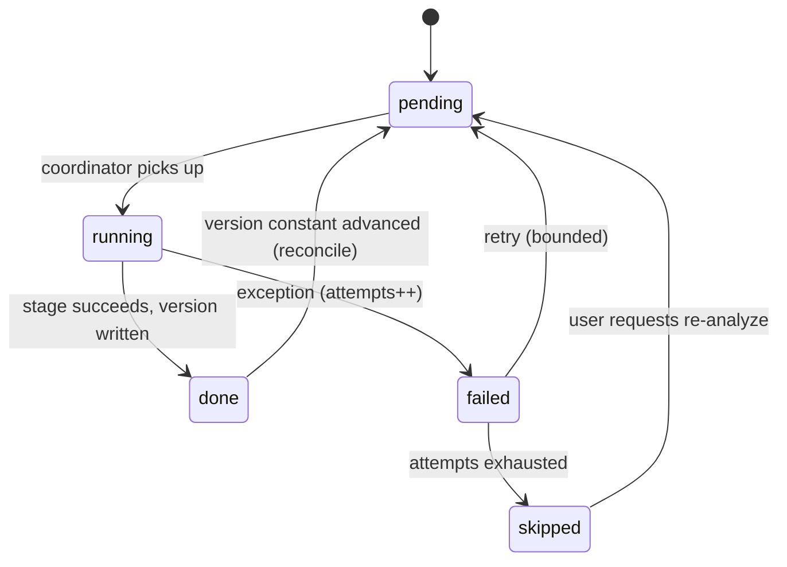

Each stage transition is a row update in `analysis_run` (crash-safe: on relaunch, `running` rows older than a threshold are reset to `pending`, satisfying NFR-REL-1). The denormalized `track.analysisState` is a roll-up (`pending` if any stage pending; `ready` when all `done`) used purely for fast library listing and the status column in mockup `ipad/02-library.html`.

## 18. GRDB record and repository layer

### 18.1 Record types

Every table has a `Codable` struct conforming to GRDB's `FetchableRecord, MutablePersistableRecord` (⟢ exactly the pattern in `Records.swift`). Example for the two most-touched records:

```swift
public struct DJTrack: Codable, Identifiable, Equatable, Sendable {
    public var id: Int64?
    public var syncID: String
    public var albumID: Int64?
    public var title: String
    public var trackNo: Int?
    public var discNo: Int?
    public var durationSec: Double?
    public var codec: String?
    public var sampleRate: Int?
    public var channelCount: Int?
    public var bitDepthOrBitrate: String?
    public var contentHash: String
    public var sortKey: String
    public var bpm: Double?
    public var detectedBPM: Double?
    public var camelot: String?
    public var musicalKey: String?
    public var energy: Double?
    public var analysisVersion: Int
    public var embeddingVersion: Int
    public var analysisState: String
    public var stemState: String
    public var addedAt: Date
    public var updatedAt: Date
}
extension DJTrack: FetchableRecord, MutablePersistableRecord {
    public static let databaseTableName = "track"
    public mutating func didInsert(_ inserted: InsertionSuccess) { id = inserted.rowID }
}

public struct CuePoint: Codable, Identifiable, Equatable, Sendable {
    public var id: Int64?
    public var syncID: String
    public var trackID: Int64
    public var samplePosition: Int64
    public var kind: String          // hot|load|fade|grid|memory
    public var label: String?
    public var colorIndex: Int
    public var hotIndex: Int?
    public var createdAt: Date
    public var updatedAt: Date
}
extension CuePoint: FetchableRecord, MutablePersistableRecord {
    public static let databaseTableName = "cue_point"
    public mutating func didInsert(_ inserted: InsertionSuccess) { id = inserted.rowID }
}
```

The remaining records (`Loop`, `BeatGridHeader`, `Phrase`, `KeyEstimate`, `TempoCandidate`, `DJMix`, `MixTrackEvent`, `MixAsset`, `MIDIBinding`, `ChannelRouting`, `SmartCrateRecord`, `CloudRecordMap`, `AssetUpload`, …) follow the identical shape and are enumerated in Appendix A.

### 18.2 Row / view models for listing

Fast list screens (Library, Recorded Mixes) fetch **flat row structs** via joined SQL rather than object graphs, to avoid N+1 and to feed SwiftUI directly:

```swift
public struct DJTrackRow: Codable, FetchableRecord, Identifiable, Sendable {
    public var id: Int64
    public var title: String
    public var artistNames: String     // GROUP_CONCAT from track_artist
    public var albumTitle: String?
    public var durationSec: Double?
    public var bpm: Double?
    public var camelot: String?
    public var energy: Double?
    public var analysisState: String
    public var stemState: String
}
```

### 18.3 Repositories (grouped query surfaces on `DJLibraryStore`)

`DJLibraryStore` exposes repository-style methods (§10.1). Reactive listing uses GRDB `ValueObservation` bridged to `AsyncStream`, so the Library and Analysis screens update live as analysis completes without polling:

```swift
public nonisolated func observeTracks(_ q: LibraryQuery) -> AsyncStream<[DJTrackRow]> {
    AsyncStream { continuation in
        let observation = ValueObservation.tracking { db in
            try DJTrackRow.fetchAll(db, SearchQueryBuilder.sql(for: q))   // ⟢ reuse builder pattern
        }
        let cancellable = observation.start(
            in: dbPool,
            onError: { _ in continuation.finish() },
            onChange: { rows in continuation.yield(rows) })
        continuation.onTermination = { _ in cancellable.cancel() }
    }
}
```

### 18.4 Write discipline & transactions

- All writes go through `DJLibraryStore` actor methods, each wrapping a single GRDB transaction. Multi-table operations (e.g., "persist analysis": frames + onset + grid + downbeats + key + phrases + waveform + embeddings + vec rows) are **one transaction** so a crash leaves either the whole analysis or none (NFR-REL-1, NFR-DET-1).
- The `dirty` flag on `cloud_record_map` is set within the same transaction as any syncable change, so the sync layer (§38) can find exactly what to push without diffing.
- WAL mode + a `DatabasePool` gives concurrent readers (UI observations) during writes (analysis), which is essential for NFR-PERF-3 (responsive UI during analysis).

---
---

# Part IV — Offline Analysis Pipeline

## 18A. Genre libraries — the practice-material connector (new — M5)

### 18A.1 The problem this solves

M5's exit is a performance: *pick a genre, build two deck playlists, mix, record, listen, share.*
That narrative dies at step one if the user has no music. The existing ten providers all assume
the user **already owns a library** — a Plex server, a Subsonic instance, a Dropbox of files. A
new DJ opening the app for the first time has none of that.

A **genre library** inverts the unit of subscription: instead of connecting a *server*, the user
subscribes to a *genre*, and gets a ready-made, ordered crate of legally usable tracks. Each genre
is an independent library with its own list (FR-LIB-9), because that is how DJs actually think
about practice material — you build a techno set from techno, not from "everything".

### 18A.2 Source selection — and why not the Free Music Archive

The Free Music Archive is the obvious candidate and was the original request. It cannot be used:

> FMA's own app-developers page states they **"unfortunately had to shut down our API"**, and
> further prohibits both of the things this feature would need — hotlinked playback ("directly
> playing music hosted on FMA's servers") and scraped browsing ("it is not allowed to forward
> search queries from your users to our search engine and scrape content"). Building against FMA
> without written permission would violate the source's stated terms on two counts.

**The shipped source is the Jamendo API** (`api.jamendo.com/v3.0`), which permits exactly this
use: a documented public read API over a Creative-Commons catalogue, with tag/genre filtering and
a popularity `order` parameter that provides the "most interesting, descending" ranking the
product wants. The concrete endpoint shapes, parameter names and page limits MUST be verified
against `developer.jamendo.com/v3.0` at implementation time rather than assumed from this
document.

Two constraints are recorded as decisions:

- **`client_id` is an application credential, not a user login.** It is registered once by the
  owner and travels in the build — so the feature satisfies FR-LIB-9's "works with no account".
  The registration is a **user-owned step** and belongs on the same checklist as the Plex claim
  token and the App Store Connect products (§50.3).
- **A user account is optional and additive only.** The optional-credentials checkbox (§41.1)
  unlocks per-user features (favourites, playlists) and MUST NOT gate browsing, playback, or
  library creation. A user who never signs in loses nothing the milestone narrative needs.

### 18A.3 Model — a genre is a library

`SourceKind` gains one case, `jamendoGenre`. A subscribed genre is an ordinary `Source` row whose
identity is the genre path, so everything downstream — caching, analysis, semantic search,
playlists, gig crates — works with no special-casing:

```
Source(kind: .jamendoGenre, identifier: "electronic/techno", title: "Techno")
  → tracks ordered by popularity DESC, paged
  → each track: title, artist, duration, license, stream URL, download URL
```

- **Sub-genres are first-class.** Where the provider exposes a hierarchy (electronic, hip-hop),
  the picker offers the children, and `electronic/techno` is a *different library* from
  `electronic`. This is the point of the feature: a techno crate, not an electronica crate.
- **Ordering is popularity descending by default**, and the chosen ordering is part of the
  source's stored configuration so a refresh is reproducible.
- **The provider is core-side, not DJ-side.** `SourceKind` lives in `Sources/Domain`; the provider
  joins the existing `Sources/Remote/Providers` family behind `RemoteLibraryProvider`, is
  registered in `RemoteConnectorCatalog`, and — like every other provider since M0 — is **free
  tier** and MUST appear in the free-tier registry (FR-LIB-7, AT-FREE-\*).
- **It is a normal remote-library type, available after onboarding.** Because it registers in the
  catalogue, "add a genre library" MUST appear in **Add source** (§41.1's ordinary flow) alongside
  Plex, Subsonic and the rest, with the same genre / sub-genre selector the first-run picker uses
  and the same optional-credentials checkbox. The §41.1a picker is a **convenience at first run,
  not the only door** — a user who skipped it, or who wants a fourth genre six months later, adds
  one from Sources like any other library.

### 18A.4 The path to a deck

A genre track becomes performable through the **existing** remote pipeline, with no new mechanism:

1. Browse — list pages fetched and cached as `Source` + `Track` rows.
2. **Cache** — the audio is downloaded to the managed cache. FR-LIB-8 governs: a partially cached
   track is **never** deck-ready, and the UI says so.
3. **Analyse** — once cached, the track is an ordinary local asset and runs the full §19 pipeline,
   producing the grid, phrases and pyramid that §26A draws.
4. **Perform** — the track loads to a deck like any other.

Steps 2–4 are already built. The connector's only job is to make step 1 produce rows the rest of
the system already understands.

### 18A.5 Licensing obligations are not optional

The catalogue is Creative Commons; several licences require attribution and some prohibit
commercial use. Therefore:

- Each track MUST carry its **licence identifier** through to the library row, and the UI MUST
  show artist and licence wherever the track is listed.
- The **recording finish screen and exported cue-sheet MUST list attribution** for every genre
  track that appeared in the mix (§41.11) — this is what makes a shared practice set safe to post.
- The app MUST NOT strip or rewrite licence metadata on cached copies.

### 18A.6 Failure and honesty

Network failures follow the §46 convention already used by the other ten providers: an empty
genre reports "couldn't reach the catalogue", never an empty-looking library; a failed page keeps
the pages already fetched; and a genre whose tracks are not yet cached shows the caching state
rather than a deck-ready affordance it cannot honour. The Part X defect register's D-9 lesson
(a provider that returns nothing must say so) applies directly.

## 19. Analysis pipeline architecture

Every imported track passes through an **immutable, staged, versioned** pipeline exactly once per analysis version. The pipeline is a directed acyclic graph of pure DSP kernels (L3) orchestrated by the `AnalysisCoordinator` actor (L4), which owns scheduling, persistence, and resumability.

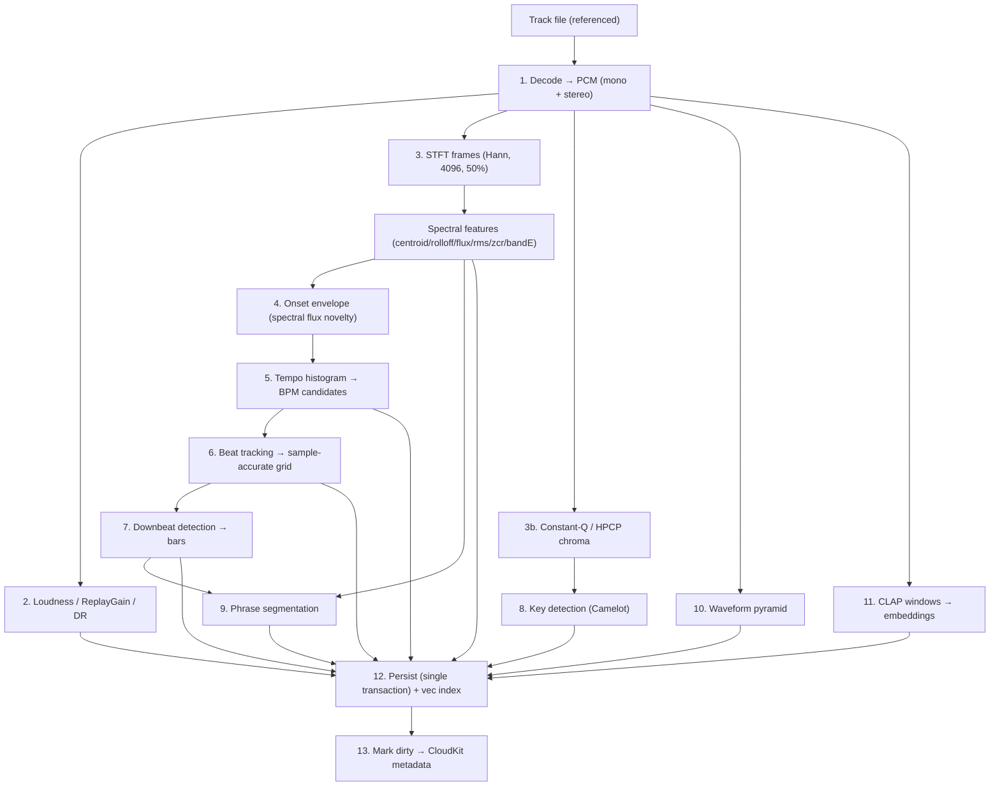

### 19.1 Execution properties

- **Idempotent per (track, version).** Re-running a stage overwrites its rows/BLOB and bumps the stored version; never appends duplicates.
- **Resumable.** Each stage's state is a row in `analysis_run`. On relaunch, stale `running` rows reset to `pending`; the coordinator continues.
- **Bounded concurrency.** A `withTaskGroup` runs up to `maxConcurrentTracks` (default = performanceCoreCount − 1, min 1) *tracks* in parallel; within a track, stages that depend on each other run in order, independent stages (e.g., waveform, embedding, loudness) may run concurrently. See §43 for the budget rationale.
- **Priority-fenced.** All analysis tasks run at `.background`; the coordinator additionally throttles when `PerformanceMonitor` reports the audio engine is live, protecting the playback thread (FR-ANL-2). Concretely: while a performance is active, `maxConcurrentTracks` is clamped to 1 and CLAP/Demucs (ANE/GPU) work is paused.

### 19.2 Decode substrate

⟢ Reuse `AVAudioFile`/`AVAudioConverter` (the repo already decodes via AVFoundation). The pipeline decodes once into a canonical **analysis format**: 44.1 kHz, `Float32`, both a mono sum (for most DSP) and stereo (for loudness true-peak and stem pre-separation). Opus is remuxed via the existing `Opus/` path when a direct AVFoundation decode is unavailable. A single decode pass feeds all downstream stages from an in-memory `PCMBuffer` (or a memory-mapped scratch file for very long tracks), avoiding repeated file reads.

### 19.3 The `PCMBuffer` type

```swift
public final class PCMBuffer: @unchecked Sendable {   // uniquely-owned; transferred, not shared
    public let sampleRate: Double
    public let channelCount: Int
    public let frameCount: Int
    public let mono: UnsafeBufferPointer<Float>        // length == frameCount
    public let channels: [UnsafeBufferPointer<Float>]  // deinterleaved
    // backing storage freed on deinit; never mutated after construction
}
```

Handing a `PCMBuffer` to another actor transfers ownership (the producer drops its reference). This gives zero-copy movement of large audio between decode → DSP → embedding → stems while keeping `Sendable` meaningful.

### 19.4 Persisted analysis artifacts — the render contract (new — M5)

> **Normative, and a correction to what shipped.** Through M4 the pipeline *computed* stage 6–10
> outputs and then discarded all but scalars: `AnalyzeResult` carried `phraseCount: Int` and
> `waveformLevels: Int`, the `phrase` and `waveform_pyramid` tables were created but never
> written, no `downbeat` row was ever inserted, and `beat_grid` was written with
> `firstBeatSample = 0, beatCount = 0` placeholders. Every waveform in the product was
> consequently placeholder geometry. **This section closes that gap and is a prerequisite for
> all of FR-WAVE and for M5's exit.**

Step 12 of the pipeline ("Persist — single transaction") MUST write, for every analysed track,
in one GRDB transaction (NFR-REL-1):

| Artifact | Destination | Required content |
|---|---|---|
| Loudness | `loudness` | *(already shipped)* |
| Key | `key_estimate`, `track.camelot`/`musicalKey` | *(already shipped)* |
| Tempo | `beat_grid.bpm`, `track.bpm` | *(already shipped)* |
| **Beat grid** | `beat_grid` + `beat_blob` | **real `firstBeatSample` and `beatCount`**; the per-beat sample positions as a `beat_blob` BLOB (§15.7). Placeholder zeros are a defect. |
| **Downbeats** | `downbeat` | one row per bar start, the anchor for phrase display and bar numbering |
| **Phrases** | `phrase` | one row per §25 phrase: `startSample`, `lengthBeats`, `type`, `energy`, `confidence` |
| **Waveform pyramid** | `waveform_pyramid` | the packed multi-level BLOB (§15.7 `kind=0x05`), **including band-split low/mid/high RMS** — FR-WAVE-2 has no other source |
| Energy curve | `energy_curve` | the per-beat curve BLOB backing the prep energy display |

Three rules bind the implementation:

1. **Compute-then-discard is a defect, not an optimisation.** Any pipeline stage whose output has
   a destination table MUST write it. A `count`-only return type is the smell (§46.2's
   silent-fallback principle applied to analysis).
2. **Re-analysis is idempotent per (track, `analysis_version`)** — the artifact rows are replaced,
   never appended (§19.1), and a version bump re-derives them.
3. **Grid corrections never mutate these rows.** The §23.3 `grid_correction` override log remains
   the authoritative user layer over an immutable analysis; the renderer composes
   `beat_grid` + `grid_correction` at read time exactly as `GridCorrectionRepository` already does.

## 20. Decode, loudness, dynamic range

### 20.1 Loudness (ITU-R BS.1770 / EBU R128)

Integrated loudness uses BS.1770 K-weighting: a two-stage pre-filter (a high-shelf "head" filter + a high-pass), mean-square per 400 ms block with 75% overlap, absolute gate at −70 LUFS, then a relative gate at −10 LU below the ungated mean. Implemented with `vDSP` biquad (`vDSP_biquad`) for the K-weighting and `vDSP_measqv` for block mean-square.

```swift
public enum LoudnessAnalyzer {
    public static func integratedLUFS(_ pcm: PCMBuffer) -> Double {
        let kw = KWeighting.filter(pcm)                 // vDSP_biquad, per channel
        let blocks = kw.blockMeanSquares(windowMS: 400, overlap: 0.75)  // vDSP_measqv
        let gated = R128Gate.apply(blocks)              // absolute −70, relative −10 LU
        return -0.691 + 10 * log10(gated.channelWeightedSum)
    }
}
```

**True peak** (`truePeakDBTP`) is measured by 4× oversampling (polyphase FIR via `vDSP`) then max-abs. **ReplayGain** (`replayGainDB`) is derived from integrated loudness targeting −18 LUFS (−23 for R128 profile; both stored is unnecessary — pick −18 for DJ headroom and record the reference in `loudness.version`). ⟢ Cross-check the value against `TonearmCore.ReplayGain` so the player and DJ agree.

**Dynamic range** (`dynamicRangeDB`): loudness range LRA (10th–95th percentile of short-term loudness distribution) plus a crest-factor DR (peak − RMS) for a "how punchy" hint used lightly in phrase energy and recommendation.

Loudness informs (a) auto-gain on deck load so tracks are level-matched (the mixer's per-deck trim seeds from `replayGainDB`), and (b) the master limiter's headroom.

## 21. FFT / DSP engine

Accelerate/vDSP is used **exclusively**. No third-party DSP.

### 21.1 STFT configuration

```swift
public struct STFTConfig: Sendable {
    public var fftSize: Int = 4096        // tunable; power of two
    public var hopSize: Int = 2048        // 50% overlap
    public var window: WindowType = .hann
    public var sampleRate: Double = 44_100
}
```

Rationale: 4096 at 44.1 kHz → ~10.8 Hz bin spacing and ~93 ms frames, a good balance for music onset/timbre features; 50% overlap (hop 2048) gives ~21.5 fps frame rate. These are the v0.2 HLD values, retained and made configurable.

### 21.2 Windowing and the real FFT

A Hann window is precomputed once (`vDSP_hann_window`) and applied with `vDSP_vmul`. The real FFT uses `vDSP_fft_zrip` with a shared `FFTSetup` (created once per size, reused across all frames and tracks — creating a setup per frame is a common performance bug):

```swift
public final class FFTSetupHandle {
    let setup: FFTSetup                    // vDSP_create_fftsetup(log2n, FFT_RADIX2)
    let log2n: vDSP_Length
    // window buffer + split-complex scratch, all preallocated
}

public enum FFTKernel {
    public static func spectrum(_ frame: [Float], setup s: FFTSetupHandle) -> Spectrum {
        // 1) windowed = frame * hann         (vDSP_vmul)
        // 2) pack real → split complex        (vDSP_ctoz)
        // 3) in-place real FFT                (vDSP_fft_zrip)
        // 4) magnitude^2 per bin              (vDSP_zvmags) → power spectrum
        // 5) optional sqrt for magnitude      (vvsqrtf)
        // returns Spectrum { power:[Float], magnitude:[Float], binHz:Double }
    }
}
```

`Spectrum` holds the positive-frequency bins (`fftSize/2 + 1`). Frames are processed in a tight loop over the mono buffer; the setup, window, and scratch buffers are reused, so per-frame allocation is zero.

### 21.3 Spectral features (per frame)

Each frame yields the feature set stored in `frame_features` (§15.3). All are `vDSP` reductions over the power/magnitude spectrum:

- **Spectral centroid** — magnitude-weighted mean bin frequency (`vDSP_dotpr` of magnitude·binHz / sum(magnitude)). "Brightness."
- **Spectral rolloff** — frequency below which 85% of energy lies (cumulative sum threshold).
- **Spectral flux** — positive L2 difference of successive normalized magnitude spectra (`vDSP_vsub`, half-wave rectify, `vDSP_svesq`). The onset novelty driver.
- **RMS energy** — `vDSP_rmsqv` of the frame.
- **Zero-crossing rate** — sign-change count / frame length (noisiness/percussiveness cue).
- **Low/high band energy** — summed power in sub-band ranges (kick band ~20–120 Hz; air band ~8–20 kHz) via bin-range `vDSP_sve`.

These features feed onset detection (flux), phrase segmentation (all), key confidence weighting, and are summarized into the library `energy` value.

## 22. Onset detection and tempo estimation

### 22.1 Onset novelty envelope

The onset detection function is a **multi-band spectral flux** novelty curve. The spectrum is split into transient-relevant bands (kick, snare, hi-hat), each contributes half-wave-rectified flux, and the bands are summed with weights emphasizing percussive content:

```swift
public struct OnsetConfig: Sendable {
    public var bands: [ClosedRange<Float>] = [20...120, 120...2_000, 2_000...16_000] // kick/snare/hat
    public var bandWeights: [Float] = [1.0, 0.8, 0.6]
    public var meanRemovalWindow: Int = 16     // frames, for adaptive whitening
    public var frameRateHz: Float = 21.53      // = sampleRate/hopSize
}

public enum OnsetDetector {
    public static func envelope(frames: [Spectrum], config: OnsetConfig) -> [Float] {
        // per band: flux_b[n] = Σ max(0, |X_b[n]| − |X_b[n−1]|)
        // novelty[n] = Σ_b w_b · flux_b[n]
        // subtract moving mean (adaptive threshold), half-wave rectify
        // normalize to 0...1
    }
}
```

The envelope is stored in `onset_envelope` (BLOB) at the frame rate, so beat tracking and any future re-tuning don't need to re-run the FFT.

### 22.2 Peak picking

Onset peaks are local maxima of the novelty envelope that exceed an adaptive threshold (moving mean + k·moving std over a window), with a minimum inter-onset interval to suppress double-triggers:

```swift
public enum OnsetDetector {
    public static func peaks(_ env: [Float], config: OnsetConfig) -> [OnsetPeak] {
        // threshold[n] = mean(env, w) + k*std(env, w)
        // peak if env[n] == local max in ±m AND env[n] > threshold[n]
        // enforce minGapMS between accepted peaks
    }
}
```

### 22.3 Tempo histogram

Inter-onset intervals (and their integer multiples/divisions) vote into a tempo histogram over 60–220 BPM. Two complementary estimators are combined for robustness:

1. **Autocorrelation of the novelty envelope** (`vDSP_conv` for the correlation), peaks → periodicities → BPM.
2. **Inter-onset-interval histogram** with octave folding (a period T and 2T/½T reinforce the same tempo class).

```swift
public struct TempoConfig: Sendable {
    public var range: ClosedRange<Double> = 60...220
    public var binWidthBPM: Double = 0.5
    public var acfWeight: Double = 0.6
    public var ioiWeight: Double = 0.4
    public var preferredTempoCenter: Double = 125   // gentle prior toward common DJ tempos
    public var preferenceStrengthBPM: Double = 30
}
```

The histogram is smoothed, a **tempo prior** (a broad Gaussian around a configurable center, default 125 BPM) gently disambiguates octave errors common in electronic music, and the top-K peaks become `tempo_candidate` rows with confidences (rank 0 = best). The denormalized `track.detectedBPM` is candidate 0; `track.bpm` starts equal but becomes the corrected value if the user edits (FR-ANL-5).

### 22.4 Octave-error handling

Half/double-tempo confusion is the dominant BPM error. Mitigations: (a) octave-folded voting; (b) the tempo prior; (c) at beat-tracking time, the phase/energy fit of the grid is evaluated at candidate BPM *and* its ×2/÷2 — the variant whose beats land on higher onset energy wins. The user's ×2/÷2 control (mockup `ipad/06-track-preparation.html`, "×2 BPM") writes a `grid_correction` and re-derives the grid from the chosen multiple.

## 23. Beat and downbeat tracking

### 23.1 Beat grid construction

Given a BPM candidate and the onset envelope, beat tracking finds the **phase** (position of beat 1) and lays a grid, then refines each beat to the nearest strong onset within a tolerance (so the grid is sample-accurate to the audio, not just periodic). The core is a dynamic-programming beat tracker (Ellis-style): maximize a score summing onset strength at beat locations minus a tempo-deviation penalty that keeps inter-beat intervals near the target period.

```swift
public struct BeatConfig: Sendable {
    public var tightness: Double = 100        // penalty weight for deviating from target period
    public var refineWindowMS: Double = 25    // snap-to-onset tolerance per beat
    public var allowVariableTempo: Bool = false  // constant-tempo default for DJ tracks
}

public enum BeatTracker {
    public static func grid(onsets: [OnsetPeak], bpm: BPMCandidate, config: BeatConfig) -> BeatGrid {
        // 1) target period P = sampleRate * 60 / bpm
        // 2) DP over candidate beat times maximizing Σ onset(t) − tightness·(log(Δt/P))²
        // 3) backtrack → beat times; refine each to nearest onset within refineWindowMS
        // 4) confidence per beat = normalized onset strength at that beat
        // returns BeatGrid { firstBeatSample, bpm, beats:[Int64], confidence:[Float] }
    }
}
```

For DJ material (typically constant tempo), `allowVariableTempo=false` fits a single global period + phase, producing a rigid grid that sync and loops rely on. The grid header goes to `beat_grid`; per-beat positions/confidence to `beat_blob`.

### 23.2 Downbeat detection

Downbeats (bar starts) are found by scoring each candidate phase (which beat is "1") over the track using features that correlate with bar boundaries: low-frequency energy peaks (kick on 1), spectral novelty at 4- and 8-beat periods, and harmonic-change alignment. A comb-filter / periodicity analysis at the bar level (assuming 4/4 by default, configurable) selects the beat offset (0–3) that best explains the pattern.

```swift
public struct DownbeatConfig: Sendable {
    public var beatsPerBar: Int = 4
    public var lowBandHz: ClosedRange<Float> = 20...120
    public var harmonicChangeWeight: Double = 0.5
    public var lowEnergyWeight: Double = 0.5
}

public enum BeatTracker {
    public static func downbeats(_ grid: BeatGrid, features: [FrameFeature],
                                 config: DownbeatConfig) -> [Int] {
        // for each offset o in 0..<beatsPerBar:
        //   score_o = Σ over bars ( lowEnergyWeight·lowBandEnergyAtBeat(o) +
        //                           harmonicChangeWeight·harmonicNoveltyAtBeat(o) )
        // pick argmax offset; downbeats = beats at indices ≡ offset (mod beatsPerBar)
        // returns beat indices that are downbeats
    }
}
```

Downbeats populate the `downbeat` table with `barNumber`, anchoring the bar/beat labels shown in preparation (mockup `ipad/06-track-preparation.html`: `1.1.1 … 2.1.1`) and giving phrase segmentation its bar grid. The user's "Set Downbeat" control writes a `grid_correction` that shifts the chosen offset.

### 23.3 Grid corrections as authoritative overrides

User edits (nudge, set downbeat, ×2/÷2, set BPM) are appended to `grid_correction` and **replayed deterministically** over the detected grid to produce the authoritative `beat_grid` (`source = corrected`). This keeps corrections durable across re-analysis: bumping the beat analysis version re-detects, then re-applies the stored corrections on top, so the DJ never loses hand-tuned grids to an algorithm upgrade (a direct consequence of NFR-REL and FR-ANL-5).

## 24. Key detection (Constant-Q / HPCP / Camelot)

### 24.1 Chroma extraction

Musical key detection operates on a **Harmonic Pitch Class Profile (HPCP / chroma)** derived from a **Constant-Q transform (CQT)**, which gives log-frequency resolution matching musical semitones (unlike the linear FFT). The CQT is implemented as a precomputed sparse kernel matrix applied to FFT spectra (Brown–Puckette method): compute the linear FFT once (reusing §21), then multiply by the sparse CQT kernel (`vDSP` sparse matmul or a hand-rolled banded multiply) to obtain log-spaced bins spanning the musical range (e.g., 3 octaves from ~C2), folded into 12 pitch classes.

```swift
public struct ChromaConfig: Sendable {
    public var binsPerOctave: Int = 36        // 3 bins/semitone for tuning tolerance
    public var minFreqHz: Double = 65.4       // C2
    public var octaves: Int = 5
    public var tuningToleranceCents: Double = 50
    public var harmonicWeighting: Bool = true // weight by harmonic series to sharpen tonic
}

public enum KeyDetector {
    public static func chroma(_ frames: [ConstantQFrame], config: ChromaConfig) -> [HPCP] {
        // per frame: CQT magnitude → fold to 12 pitch classes (sum across octaves)
        // apply harmonic weighting; normalize each 12-vector
        // returns per-frame HPCP (12 floats)
    }
}
```

Tuning deviation is estimated from the CQT (peak clustering relative to equal-tempered grid) so tracks tuned off A440 still key-detect correctly.

### 24.2 Key estimation (template correlation)

The per-frame HPCP is aggregated (mean over the track, optionally excluding low-energy frames) into a single 12-vector, then correlated against the 24 major/minor **key profiles** (Krumhansl–Schmuckler, or the Temperley/Albrecht refinements). The best-correlating profile gives tonic + mode; the correlation margin gives confidence.

```swift
public struct KeyConfig: Sendable {
    public var profile: KeyProfile = .temperley   // krumhansl|temperley|albrecht
    public var segmentation: Bool = false         // also emit per-segment keys for key changes
    public var minConfidence: Double = 0.3
}

public enum KeyDetector {
    public static func estimate(_ chroma: [HPCP], config: KeyConfig) -> KeyEstimate {
        // aggregate chroma → 12-vector; for each of 24 keys: r = corr(vector, rotate(profile, tonic))
        // pick argmax; confidence = (rBest − rSecond) normalized
        // map (tonic, mode) → Camelot via table
    }
}
```

### 24.3 Camelot mapping and compatibility

The (tonic, mode) result maps to Camelot notation via a fixed table. Compatibility for harmonic mixing is defined by adjacency on the Camelot wheel:

```swift
public enum Camelot {
    /// Compatible = same number (relative major/minor), ±1 on the wheel same letter,
    /// and same number opposite letter. e.g., 8A ↔ {8A, 7A, 9A, 8B}.
    public static func compatible(_ key: CamelotKey) -> Set<CamelotKey>
    public static func compatibility(_ a: CamelotKey, _ b: CamelotKey) -> Float  // 1.0 same, 0.7 adjacent, ...
    public static func from(tonic: Int, mode: Mode) -> CamelotKey
}
```

The result is written to `key_estimate` (global scope) and denormalized into `track.camelot` / `track.musicalKey` for the library table and search re-rank. Optional per-segment key detection (`scope=segment`) captures modulations for tracks that change key.

### 24.4 The full Camelot table (Appendix reference)

The complete tonic×mode→Camelot table is in Appendix D; the compatibility values (`1.0` identical, `0.9` relative maj/min, `0.7` ±1 same letter, `0.5` energy-boost +7 semitones, `0.0` otherwise) are the tunable weights the `camelotCompatibility` SQL function and `Camelot.compatibility` share, so search re-rank and suggestion scoring agree.

## 25. Phrase segmentation

### 25.1 Approach

Phrase boundaries are found by combining **novelty in a self-similarity structure** with the bar grid. Two signals are fused:

1. **Timbral/harmonic self-similarity novelty.** Build a feature sequence (beat-synchronous averages of MFCC-like timbral features + chroma), compute a self-similarity matrix, and convolve a checkerboard kernel along its diagonal (Foote novelty) to score structural change points.
2. **Energy contour segmentation.** Detect sustained changes in RMS/low-band energy (breakdowns drop bass; drops spike it), giving intro/build/breakdown/drop cues.

Boundaries are snapped to the nearest **downbeat**, and phrases are quantized to musically plausible lengths (multiples of 4/8/16/32 beats), because DJ phrasing is bar-aligned.

```swift
public struct PhraseConfig: Sendable {
    public var beatSync: Bool = true
    public var kernelBars: Int = 8               // checkerboard kernel half-width in bars
    public var minPhraseBeats: Int = 16
    public var quantizeToBeats: [Int] = [16, 32]  // preferred phrase lengths
    public var energyDropThreshold: Double = 0.35 // fraction drop marking a breakdown
}

public enum PhraseSegmenter {
    public static func segment(features: [FrameFeature], beats: BeatGrid,
                               config: PhraseConfig) -> [Phrase] {
        // 1) beat-synchronous feature averaging
        // 2) self-similarity matrix + Foote checkerboard novelty → candidate boundaries
        // 3) fuse with energy-contour change points
        // 4) snap to downbeats; quantize lengths; label by energy shape:
        //    intro (low, rising) | build | drop (energy spike post-breakdown) |
        //    chorus (high sustained) | breakdown (bass drop) | outro (low, falling)
        // 5) energy per phrase (0..10) from RMS/low-band
    }
}
```

### 25.2 Output and use

Phrases go to the `phrase` table with type, `lengthBeats` (e.g., 32 as shown in mockup `ipad/06-track-preparation.html`), energy, and confidence. They drive: the preparation view's phrase display, auto-placement of default cue regions (a "Bass enters" load cue at the first drop, a memory cue at each breakdown), and phrase-compatibility scoring in recommendations (§28). The denormalized `track.energy` is a weighted aggregate of phrase energies (peaks weighted higher, matching how DJs think about a track's "energy").

## 26. Waveform pyramid generation

### 26.1 Multi-resolution structure

A single full-resolution waveform is useless for both the zoomed-out overview and the sample-accurate zoom in preparation (mockup `ipad/06-track-preparation.html`, "Zoom 1:8"). The pipeline generates a **pyramid** of precomputed min/max/RMS reductions at successive power-of-two bin sizes, so any zoom level renders by picking the nearest level and slicing — never by scanning the audio at draw time.

```swift
public struct WaveformConfig: Sendable {
    public var baseSamplesPerBin: Int = 256      // finest level
    public var levels: Int = 8                    // ×2 per level → up to 256*2^7 samples/bin
    public var bandSplit: Bool = true             // low/mid/high RMS for colored waveform
}

public enum WaveformPyramid {
    public static func build(_ pcm: PCMBuffer, config: WaveformConfig) -> WaveformBlob {
        // level 0: for each 256-sample bin → {min, max, rms} via vDSP_minv/maxv/rmsqv
        //          if bandSplit: also low/mid/high RMS from band-filtered copies
        // level k>0: reduce level k−1 pairwise (min of mins, max of maxes, rms combine)
        // pack into WaveformPyramid BLOB layout (§15.7, kind=0x05)
    }
}
```

### 26.2 Rendering contract

The UI waveform renderer (a `MTKView` or Canvas, §41) is handed a slice of the appropriate pyramid level plus the beat grid and cue/loop positions; it draws bars from min/max and colors from band-split RMS. Because the pyramid is precomputed and memory-mappable, scrolling and zooming during preparation and performance are allocation-free and smooth (NFR-PERF-3). The playing deck's moving playhead is a simple offset into the same slice; the render never touches the audio buffer.

## 26A. Performance waveform display (new — M5)

§26 builds the pyramid; §19.4 persists it. This section specifies what is **drawn**, and it is
normative because the waveform is the instrument surface a club-trained DJ actually reads. The
target is explicit: a user who mixes on rekordbox with a two-channel controller should recognise
this display and need no retraining to read structure, phrase and bass content from it.

### 26A.1 Data contract — the renderer never touches audio

The renderer is handed, per deck, a **`WaveformRenderModel`** assembled control-side:

```swift
public struct WaveformRenderModel: Sendable {
    public let pyramidLevel: WaveformLevelSlice   // chosen for the zoom; min/max/rms + band RMS
    public let beats: ArraySlice<Int64>           // sample positions, from beat_blob + corrections
    public let downbeats: ArraySlice<Int64>       // bar starts
    public let barNumberOrigin: Int               // bar 1 = first downbeat
    public let phrases: ArraySlice<PhraseSpan>    // type + energy + sample range
    public let cues: ArraySlice<CueMarker>        // hot cues, colour + label
    public let activeLoop: SampleRange?
    public let playhead: Int64                    // master-clock sample
}
```

Three prohibitions, each a defect if violated (§46.2):

- The renderer MUST NOT read the audio file, decode, or compute a reduction at draw time.
- The renderer MUST NOT allocate per frame; the slices are views into memory-mapped BLOBs.
- The renderer MUST NOT invent geometry when analysis is missing. An unanalysed track draws the
  **honest empty state** ("not analysed yet" + an analyse action), never a synthetic wave.

### 26A.2 Frequency colouring (FR-WAVE-2)

Each pyramid bin carries low/mid/high RMS (§26.1 `bandSplit`). The bar for a bin is drawn as three
stacked contributions, normalised to the bin's total energy:

| Band | Split | Hue | Reads as |
|---|---|---|---|
| Low | < 200 Hz | blue / cyan | kick and bass — the band Bass Swap operates on |
| Mid | 200 Hz – 2 kHz | amber / orange | body, vocal, chords |
| High | > 2 kHz | pale / white | hats, air, transient detail |

The band splits are **the same 200 Hz / 2 kHz crossovers as the mixer's three-band EQ** (§35.2).
This is deliberate and normative: when the user pulls LOW, the blue is what leaves. A waveform
whose colours do not correspond to the EQ bands teaches the wrong instrument.

### 26A.3 Beat grid and bar numbering (FR-WAVE-3)

- Beats draw as thin ticks; **downbeats draw at full height and heavier weight**.
- At performance zoom, every fourth downbeat carries a bar number; at prep zoom, every downbeat.
- The grid is drawn from `beat_blob` composed with the `grid_correction` log (§23.3) — what the
  user sees is what the engine quantises to, always. A grid the engine does not use is a lie.
- When `beat_grid.isConstantTempo` is false the grid follows the stored per-beat positions rather
  than extrapolating from BPM.

### 26A.4 The phrase ribbon (FR-WAVE-4)

Above each waveform runs a **phrase ribbon**: the §25 segmentation as contiguous labelled spans.

| Phrase | Colour role | Label |
|---|---|---|
| `intro` | muted / neutral | INTRO |
| `build` | amber, rising tint with energy | BUILD |
| `drop` | accent, highest saturation | DROP |
| `chorus` | accent, sustained | CHORUS |
| `breakdown` | cool / desaturated | BREAKDOWN |
| `outro` | muted / neutral | OUTRO |

Rules:

- The ribbon spans the **overview** waveform (whole track) at all times, so the next drop is
  visible before it arrives — this is the display's main tactical value.
- Each span shows its length in **bars**, not seconds — DJs phrase in bars (`32` not `62 s`).
- A span whose `confidence` is below the display threshold renders with a dashed edge rather than
  being hidden; the honest signal is "boundary uncertain", not silence.
- The ribbon is **free-tier** (FR-WAVE-4, matching FR-PREP-4's rationale — information about your
  music, not a performance capability).

### 26A.5 The three waveform views (FR-WAVE-5)

1. **Overview** — the whole track at fixed scale, with the phrase ribbon, cues, and a position
   cursor. Tapping seeks (quantised per §33). This is the "where am I in the arrangement" view.
2. **Detail (performance)** — a scrolling window, typically 8–16 bars, moving under a **fixed
   centre playhead**. Frequency-coloured, beat-gridded. This is the "am I in phase" view.
3. **Detail (preparation)** — the same renderer with pinch-zoom to sample resolution and the §41.6
   grid tools live (FR-PREP-1).

On any surface showing both decks, the two **detail** waveforms stack vertically on **one shared
playhead line** (§42.7a already establishes this for the compact twin deck). Beat alignment is
then directly readable: when the grids line up across the shared playhead, the decks are in phase.
The signed beat-phase meter (§32) remains the numeric confirmation, not the primary cue.

### 26A.6 Cues, loops, and markers (FR-WAVE-6)

Hot cues draw as full-height coloured markers with their pad letter on both overview and detail.
The active loop draws as a translucent region with hard in/out edges; a loop being *set* draws its
in-point immediately so the user sees the anchor before choosing the length. Markers are positioned
from sample values, never from interpolated pixel time — a marker that drifts against the grid at
high zoom is a defect.

### 26A.7 Budget and degradation (FR-WAVE-7)

Two decks rendering detail waveforms plus two jogs at display rate is the §43.3 worst case. The
renderer:

- Picks the **coarsest pyramid level whose bin width is ≤ 1 device pixel** — never a finer one.
- Draws into a `Canvas`/Metal layer sized to the strip, not the screen.
- Degrades under `.serious` thermal state by stepping **one pyramid level coarser** and halving
  ribbon label density — visibly less detail, never a dropped frame and never audio impact
  (NFR-THERM-2, §43.7's lane order).

### 26A.8 What "rekordbox-class" means as an acceptance target

The display is complete when, without audio, a user can answer all five from the screen alone:
where the drop is, whether the bass is currently playing on each deck, whether the two decks'
grids are aligned, how many bars until the next phrase boundary, and where their cues sit relative
to that boundary. `AT-WAVE-*` (§47.3) tests exactly these.

## 27. CLAP semantic embeddings

Platterhead uses a **music-specialized CLAP** model (contrastive language–audio pretraining trained on music, not a generic environmental-audio CLAP) so that text like "dark driving bassline" or "late-night hypnotic" maps to musically meaningful audio neighborhoods. This is the engine behind Vibe Search and semantic recommendations.

### 27.1 Model selection and packaging

- **Model:** a music-domain CLAP (e.g., a LAION-CLAP music checkpoint or equivalent) converted to **Core ML**, quantized to **FP16**, packaged as `.mlpackage` and delivered as an **On-Demand Resource** (§27.1a) — *not* bundled in the binary, per FR-SEM-6. Two encoders are used: the **audio encoder** (for track/window embeddings) and the **text encoder** (for query embeddings). Both output a shared 512-D space; vectors are **L2-normalized** so cosine == dot product.
- **Compute target:** `MLModelConfiguration.computeUnits = .cpuAndNeuralEngine` (matches HLD v0.2). The `CLAPEmbedder` actor serializes predictions; the ANE handles the heavy lifting, keeping CPU free for analysis and UI.
- **Versioning:** `embedding_version` (registry row) records model name, dims, window/hop seconds, and pooling. Bumping the model bumps the version and triggers incremental re-embedding + vec rebuild (§27.6).

### 27.1a Model delivery via On-Demand Resources (new — FR-SEM-6)

Bundling CLAP and Demucs would add roughly 300–500 MB to a **free** download for features a
given user may never touch, on a platform where download size measurably suppresses installs and
where cellular download limits still exist. Both models therefore ship as **On-Demand
Resources** tagged in the app target:

| Tag | Contents | Requested when | Approx. size | Tier |
|---|---|---|---|---|
| `clap-text` | CLAP text encoder | first semantic query, or opt-in at first run (§41.1) | ~40 MB | Free |
| `clap-audio` | CLAP audio encoder | first stage-2 analysis | ~120 MB | Free |
| `demucs` | 4-stem separator | first gig-crate preparation | ~180 MB | Pro |

Normative behaviour:

- `ModelResourceService` is an actor owning `NSBundleResourceRequest` lifetimes. A model is
  **retained** while any pipeline holds a lease and released when the last lease drops, so the
  system may reclaim the space under pressure.
- **The app is fully functional without any of them.** A missing `clap-*` disables semantic
  search and stage 2, and every other feature — playback, remote libraries, stage 1, manual
  playlists, and (with Pro) the entire performance engine — continues. Nothing throws; the
  search UI states plainly that the model is not downloaded and offers to fetch it.
- Download progress is surfaced in §41.3, never as a modal.
- The system may **purge** an ODR at any time. The service detects this at request time and
  re-requests transparently. A purge is not an error and never produces a dialog.
- Downloads respect the user's Wi-Fi-only preference and never begin without the user having
  asked for the feature that needs them.
- **Failure is honest.** If the tag cannot be fetched (offline, no space), the UI says which and
  offers a retry. It does not silently return empty search results.

`AT-SEM-6` runs the full free-tier acceptance suite with every ODR tag absent and asserts that
nothing crashes, nothing hangs, and every non-semantic feature passes.

### 27.2 Audio preprocessing

The audio encoder expects a fixed input representation (typically a log-mel spectrogram at the model's sample rate, e.g., 48 kHz, with the model's mel/window parameters). The embedder resamples the analysis PCM to the model rate (`AVAudioConverter`), computes the log-mel front-end (reusing vDSP mel-filterbank on the existing STFT machinery where parameters match, else a dedicated front-end), and feeds fixed-length windows.

### 27.3 Windowing strategy (10 s overlapping)

Each track is embedded as a sequence of **10-second windows with overlap** (default hop 5 s → 50% overlap), matching HLD v0.2 ("each 10-second window produces a 512-d embedding"). Overlap ensures a musical moment near a window boundary still lands well inside some window. Very short tracks use a single padded window; very long tracks are bounded (a cap on window count with uniform sub-sampling) to keep embedding time and storage predictable.

```swift
public struct EmbedConfig: Sendable {
    public var windowSeconds: Double = 10
    public var hopSeconds: Double = 5
    public var maxWindows: Int = 240            // ~20 min cap before subsampling
    public var pooling: Pooling = .attention    // mean|attention
}
```

### 27.4 Pooling to a whole-track vector

Per-window vectors are pooled into one whole-track vector for coarse "tracks like this" search. Two strategies:

- **Mean pooling** (baseline): L2-normalize the mean of window vectors. Robust, cheap.
- **Attention pooling** (default): a lightweight learned or heuristic attention that down-weights silence/intro/outro windows and up-weights the track's characteristic sections (often the drop/chorus). In the heuristic form, window weights are a softmax over window "salience" = a blend of energy (from §25) and distance-from-centroid (a window that is very unlike the track average is likely an intro/ambient tail and is de-emphasized). Pooling strategy is recorded in `embedding_version.pooling` so results are interpretable across upgrades.

**What is stored, and what is discarded (revised for iOS).** The pooled whole-track vector is
quantized to int8 (§16.6) and stored for **every** track. Window vectors are **computed,
consumed by the pooler, and then discarded** unless the track belongs to a prepared crate
(§16.4) — in which case they are quantized and persisted to `window_embedding`.

This is the single change that turns a 6.3 GB index into a 6.6 MB one (§16.0). It costs nothing
for the free-tier use case, because text-to-track search only ever queries the pooled vector;
and it costs nothing for the Pro use case either, because window search is only meaningful for
tracks you have prepared to perform.

Note the ordering consequence: pooling must therefore happen **in the same pass** that produces
the windows, streaming, rather than by a second pass over a stored window table. The pooler
consumes windows as they arrive and keeps only the running accumulation (and, for attention
pooling, the salience weights) — bounded memory regardless of track length, which also satisfies
the performance-time memory ceiling (§43.5).

When a crate is promoted to prepared, window vectors for its tracks are re-computed on demand.
Re-embedding a track costs ~1–2 s and happens under the thermal governor alongside stem
separation, so it is invisible next to the ~20–60 s the stems take anyway.

### 27.5 Text query path and window-level search

- **Text search [F]:** `embedText("dark driving bassline")` → text encoder → 512-D → L2-normalize
  → quantize → `:qvec` for the §16.5 query. Target ≤ **120 ms** on an A17-class device
  (FR-SEM-3), which decomposes as roughly: text-encoder forward pass on the ANE ~60–90 ms,
  vector search ~5–25 ms (Tier A linear scan at 30k, or Tier B ANN), hybrid re-rank and
  marshalling ~5 ms. **The model, not the search, is the budget** — which is the other reason
  Tier A is viable: making the search 20× faster would improve the total by under 10%.
- **Query debouncing is therefore mandatory.** The encoder runs at most once per 250 ms of
  typing, and an in-flight embed is cancelled when a new character arrives. Without this the ANE
  queue backs up and the UI feels worse than a slower design would.
- **Audio-to-audio search [F]** ("more like this track", FR-SEM-7): skip the text encoder
  entirely and use the track's own stored pooled vector as `:qvec`, excluding itself from
  results. This path costs ~5–25 ms total because there is no forward pass at all, and it is the
  fastest and most-used entry point in the free tier.
- **Window-level search [P]** ("find the part of a song that sounds like this"): query
  `vec_window` — which exists only for prepared crates (§16.4) — to retrieve the closest
  *windows*, then group by `trackID` and surface the matching time span. This powers transition
  suggestion: match the incoming track's intro window to the outgoing track's outro window.

### 27.6 Incremental background re-indexing

Embedding is the most expensive stage, so re-indexing is incremental and background-fenced:

- New/changed track → embed → write `track_embedding` + `window_embedding` + `vec_*` rows in the analysis transaction.
- Model upgrade → `embedding_version` bumps → `reconcileVersions()` enqueues only tracks whose `embeddingVersion` is behind → re-embed at `.background`, pausing while a performance is live. The vec virtual tables (or the Tier A matrix) are rebuilt per-track from the row-table source of truth (§16.7), so an interrupted rebuild resumes cleanly.
- `SemanticSearchService.indexDidChange(trackIDs:)` is notified so any cached ANN structures stay warm and Smart Crates re-resolve against the new space.

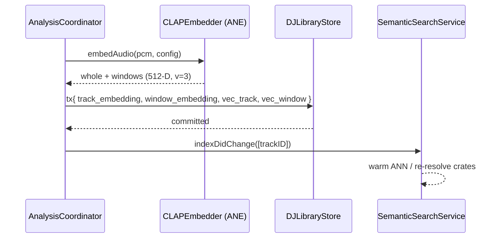

## 28. Recommendation and transition scoring

### 28.1 Candidate scoring

The recommendation score blends semantic similarity with DJ-domain compatibility, using the weights from the HLD (40/20/20/10/10), all tunable:

```swift
public struct RankWeights: Sendable {
    public var semantic: Float = 0.40
    public var bpm: Float = 0.20
    public var camelot: Float = 0.20
    public var energy: Float = 0.10
    public var phrase: Float = 0.10
}

public enum TransitionScorer {
    /// Score a candidate next track against a reference (loaded deck / current track).
    public static func score(candidate: DJTrackRow, reference: TrackContext,
                             weights: RankWeights) -> RankBreakdown {
        // semantic:  cosine(candidate.embedding, reference.embedding)      [from vec table]
        // bpm:       triangular proximity within tolerance (e.g., ±6%)
        // camelot:   Camelot.compatibility(candidate, reference)
        // energy:    1 − |candidate.energy − target.energy| / 10
        // phrase:    compatibility of candidate intro length vs reference outro (bar-multiple match)
        // final = Σ weight·component; RankBreakdown carries per-component values for UI "why"
    }
}
```

This same scorer serves three surfaces: Vibe Search re-rank (§16.5, semantic-dominant), the "Compatible with Deck A · 8A" refinement (constrain candidates to compatible keys/BPM), and future live "next track" suggestions. The `reasons`/`RankBreakdown` returned to the UI lets the app explain a suggestion ("+ higher energy, key-compatible").

### 28.2 "Feels like this but…" queries

Directional requests ("like this but slightly higher energy," HLD §11) are expressed by shifting the **target** used in scoring: start from the reference track's embedding and attributes, then bias `targetEnergy` up (or BPM, or key toward the next Camelot step) before scoring candidates. Because attributes are explicit columns and the embedding is a vector, these transforms are cheap and composable, and they combine with the additive/subtractive vibe terms from `VibeQuery` (a "+ hypnotic − bright vocals" query nudges the *semantic* target by adding/subtracting the text-embeddings of those terms before ANN).

### 28.3 Harmonic transition scoring

The previous specification listed sequence-level harmonic scoring as a roadmap hook. It is now
**shipped, free, and load-bearing** — it is the core of §28A. Its inputs (per-track Camelot,
energy, phrase structure, and — for prepared crates — window embeddings for intro/outro
matching) are all already produced by this pipeline, so it required no new analysis, only a new
scorer over stored data.

## 28A. Auto-playlist generation (new — free tier)

This section specifies the free tier's hero feature: turning a sentence and a shape into an
ordered sequence of tracks from the user's own library. It is the single largest addition this
specification makes to the previous one, and it is deliberately **free**, because it is the
thing that makes a 12,000-track library feel navigable — and because a user who has watched the
app build them a good hour of music is the user who will pay to blend it.

**What it is not.** It is not automix. It does not perform, beatmatch, or crossfade. It
*sequences*. The distinction is the same one §1 draws about AI generally: the machine prepares,
the human performs. A generated playlist played in the free player is a playlist; loaded into a
gig crate with Pro, it is a set list.

### 28A.1 The problem, stated precisely

Given:

- a candidate set `C` (the whole library, or a crate, filtered by the brief's constraints),
- a target duration `T` or track count `N`,
- a target energy arc `a: [0,1] → [0,1]` (position in the playlist → desired energy),
- a semantic target vector `q` (from the brief's prose, §27.5),

produce an ordered sequence `S = (s₁ … sₙ)` from `C` minimizing

```
J(S) = Σᵢ  wₐ · arcError(sᵢ, i)          // does this track sit where the arc asks?
     + Σᵢ  w_s · (1 − semanticScore(sᵢ, q))
     + Σᵢ₌₂ⁿ w_t · transitionCost(sᵢ₋₁, sᵢ)
     + w_d · |duration(S) − T| / T
     +      spacingPenalty(S)
```

subject to: no track appears twice, locked slots are fixed, rejected tracks are excluded.

This is a constrained sequencing problem — an ordering-with-selection variant of a travelling
salesman with a soft path prior. It is NP-hard in general and completely irrelevant that it is,
because `n ≤ ~40` and the beam search in §28A.3 finds sequences a human cannot distinguish from
optimal in well under the 3-second budget (FR-PLIST-8).

### 28A.2 The cost terms

All terms are pure functions over data the analysis pipeline already produces. No new analysis
stage is required — this is the payoff for §28.3's inputs having been specified all along.

```swift
public struct SequencingConstraints: Codable, Sendable {
    public var minArtistGap: Int = 3          // slots between tracks by the same artist
    public var minAlbumGap: Int = 2
    public var maxBPMJump: Double = 8.0       // absolute BPM delta between neighbours
    public var keyStrictness: Double = 0.6    // 0 = ignore key, 1 = Camelot-adjacent only
    public var allowExplicit: Bool = true
    public var requireCached: Bool = false    // only fully-local tracks (FR-LIB-8 pre-flight)
    public var bpmRange: ClosedRange<Double>? = nil
    public var excludeGenres: [String] = []
}

public enum PlaylistSequencer {   // pure, synchronous, deterministic, unit-testable

    /// Energy distance from what the arc asks for at this position.
    static func arcError(energy: Double, position: Int, count: Int, arc: EnergyArc) -> Double {
        let t = count > 1 ? Double(position) / Double(count - 1) : 0
        return abs(energy - arc.value(at: t))
    }

    /// Cost of playing `b` immediately after `a`. Lower is smoother. Range ≈ 0…1.
    static func transitionCost(_ a: TrackFeatures, _ b: TrackFeatures,
                               _ c: SequencingConstraints) -> Double {
        // 1. Tempo continuity — a listener notices a big jump; a DJ cannot beatmatch one.
        let bpmDelta = abs(a.bpm - b.bpm)
        let bpmCost  = min(1.0, bpmDelta / c.maxBPMJump)

        // 2. Harmonic compatibility — Camelot wheel distance, 0 for same/adjacent (§24.3).
        let keyCost  = camelotDistance(a.camelot, b.camelot) * c.keyStrictness

        // 3. Timbral continuity — cosine distance between pooled CLAP vectors (§27.4).
        //    This is what stops a sequence being harmonically perfect and tonally absurd.
        let timbreCost = 1.0 - cosine(a.embedding, b.embedding)

        // 4. Energy step — small rises feel intentional, large drops feel like a mistake.
        let step = b.energy - a.energy
        let energyCost = step >= 0 ? min(1.0, step / 0.35)
                                   : min(1.0, -step / 0.20)   // drops penalised harder

        return 0.30 * bpmCost + 0.25 * keyCost + 0.30 * timbreCost + 0.15 * energyCost
    }
}
```

Three of these four terms are ideas borrowed straight from DJ practice; the third — timbral
continuity via the CLAP vector — is the one no rules-based playlist tool has, and it is what
makes the output feel curated rather than sorted. A sequence built only on BPM and key produces
technically valid transitions between records that have nothing to do with each other. The
embedding is what knows they don't belong together.

`camelotDistance` is the same pure function §16.5 registers as a SQL function; there is one
implementation (§49.3 invariant: no scoring logic exists twice).

### 28A.3 The algorithm

```
1. RESOLVE candidates
   - embed the brief's prose  → q                          (§27.5, ~60–90 ms, once)
   - semantic search          → top P by hybrid score       (§16, P ≈ 8·N, capped 600)
   - apply hard constraints   → C                           (BPM range, genre, cached, explicit)
   - subtract rejections      → C                           (auto_playlist_rejection)
   - if |C| < N: widen the semantic pool and re-filter; if still short, generate what
     is possible and SAY SO — never pad with tracks that don't fit the brief.

2. ESTIMATE n
   - if targetTrackCount given: n = that
   - else: n = round(T / medianDuration(C)), refined in step 4

3. SEED the beam
   - for the head slot, take the K best tracks by (arc + semantic) alone   (K = beam width, 24)

4. EXTEND, slot by slot, for n slots
   - for each of the K partial sequences, consider the M best next candidates
     (M = 32, ranked by transitionCost from that sequence's tail + arcError at this slot)
   - score each extension by the running J, plus a duration-aware term that starts
     applying pressure once Σduration is within one track of T
   - keep the best K by score, with a diversity guard: no two beam entries may share
     their last two tracks (this is what stops the beam collapsing to K near-identical paths)
   - honour locks: a locked slot admits exactly one candidate
   - honour spacing: reject an extension violating minArtistGap / minAlbumGap

5. FINISH
   - take the best complete sequence
   - if |duration − T| > 5%: swap the single track whose replacement best closes the gap
     without raising J by more than ε  (this is what actually delivers FR-PLIST-2)
   - persist brief + result + per-item scoring (§14.3)
```

**Complexity** is `O(n · K · M · log K)` with a dominant constant of one `transitionCost` call —
about 30 floating-point operations plus a 512-lane dot product. At `n=30, K=24, M=32` that is
~23,000 cost evaluations, or a few milliseconds. **The entire 3-second budget is spent on step 1's
text embedding and search**, exactly as in §27.5, which means generation feels instant after the
first one and *is* instant for "more like this" briefs that skip the text encoder.

**Determinism.** `randomSeed` (stored on the brief) seeds every tie-break. Two devices with the
same library and the same brief produce the same playlist (NFR-DET-1) — which is what makes
syncing the brief rather than the track list correct in §38.2.

### 28A.4 Interaction: locks, rejects, regenerate, extend

The generator is not a slot machine. Every interaction in FR-PLIST-6 maps to a constrained
re-run rather than a fresh roll:

| Action | Implementation |
|---|---|
| **Lock** a track | The slot is pinned; the beam admits only that track at that index. Everything else re-sequences around it. |
| **Reject** a track | Row into `auto_playlist_rejection` (persisted against the brief, so it is remembered next time), then re-run with the remaining slots' locks intact. |
| **Replace** one track | Re-run steps 4–5 for that slot only, holding neighbours fixed and minimising `transitionCost(prev, x) + transitionCost(x, next) + arcError(x)`. Sub-millisecond. |
| **Reshuffle a section** | Re-run the beam over slots `[i, j]` with the boundary tracks as fixed endpoints. |
| **Extend** | Continue the beam from the final track for additional slots; the arc is re-parameterised over the new length, so extending a wind-down does not restart it. |

Rejections being persistent and per-brief is a small decision with a large effect: the second
generation from the same brief is visibly better than the first, and the user feels listened to
rather than re-rolled.

### 28A.5 Energy arcs

```swift
public enum EnergyArc: Codable, Sendable {
    case steady(level: Double)                    // flat; "background music for four hours"
    case build                                    // monotone rise, gentle S-curve
    case peakAndRelease(peakAt: Double)           // rise to peakAt (default 0.7), then fall
    case windDown                                 // monotone fall — the "end of the night" arc
    case wave(cycles: Double)                     // sinusoidal; sustains attention over long sets
    case custom(points: [Double])                 // user-drawn, linearly interpolated

    public func value(at t: Double) -> Double { /* all pure, all closed-form */ }
}
```

Arcs are normalized to `[0,1]` and mapped onto the **library's own energy distribution**, not an
absolute scale — "high energy" in an ambient collection is not "high energy" in a techno one, and
a generator that ignores this produces an empty result for half its users. Concretely, the arc's
output is mapped through the empirical CDF of `energy` over the candidate set, so `arc = 1.0`
always means "the most energetic thing that fits this brief" rather than a magic number.

### 28A.6 Parsing the brief

The brief is prose, and it is parsed by **CLAP plus a small deterministic extractor**, not by a
language model. There is no LLM in this product, on-device or otherwise; adding one would break
NFR-PRIV-1, the download budget, and the thermal budget in a single stroke.

- **Extractor (deterministic, ~200 lines):** pulls durations ("two hours", "45 min"), track
  counts, BPM ranges, explicit-content and vocal preferences, decade/genre mentions that match
  library tags, and arc language mapped from a fixed phrase table ("starts mellow and ends
  euphoric" → `peakAndRelease`; "wind down" → `windDown`; "for studying" → `steady`).
- **CLAP (semantic):** the *whole* brief, unmodified, is embedded and used as `q`. This is what
  handles everything the extractor cannot — "rainy Sunday", "like a long drive at night" — and it
  handles it better than a keyword system would, because that is exactly what a joint text-audio
  embedding is for.
- **Anything the extractor does not recognise is not an error.** Unparsed text still reaches
  CLAP. The system degrades to "pure vibe search with a default arc", which is a perfectly good
  playlist.
- The UI shows what was understood as editable chips (§41.6), so the parse is inspectable and
  correctable rather than mysterious. If the extractor read "two hours" as a duration, the user
  sees a duration chip saying so and can change it.

### 28A.7 Quality gates (acceptance)

- **AT-PLIST-1** Duration within ±5% of target for 20 briefs across 3 library sizes (FR-PLIST-2).
- **AT-PLIST-2** Generation ≤ 3 s at 30k tracks, warm model (FR-PLIST-8); ≤ 400 ms for an
  audio-seeded brief that skips the text encoder.
- **AT-PLIST-3** Mean `transitionCost` of a generated sequence is at least **40% lower** than a
  random permutation of the *same track set*. This is the test that proves the sequencer does
  something; a generator that merely filters would score identically to shuffle.
- **AT-PLIST-4** Arc error (mean |actual − target|) ≤ 0.15 for all five preset arcs.
- **AT-PLIST-5** No constraint violation across 1,000 randomized generations: no duplicates, no
  spacing breach, no rejected track, every lock honoured.
- **AT-PLIST-6** Determinism: same brief + same seed + same library ⇒ byte-identical result rows.
- **AT-PLIST-7** Blind preference: in a listening test, the generated sequence beats shuffle over
  the same track set. This is subjective and it is still a gate (§48.4) — the feature's entire
  value is that the *order* is good, and no automated metric fully substitutes for someone
  listening to it.


---
---

# Part V — Real-Time Audio Engine

The engine is where determinism is non-negotiable (NFR-PERF-1, NFR-DET). Everything in Part V lives on or below the **performance clock**; nothing here may touch disk, network, the database, or synchronous GPU/model calls on the render thread.

## 29. AVAudioEngine node graph

### 29.1 Complete graph

Two decks, each with source → time/pitch → per-stem gain → EQ/filter → deck bus; the two deck buses feed a crossfader, then master EQ, limiter, a tap for recording, and split routing to master and cue outputs.

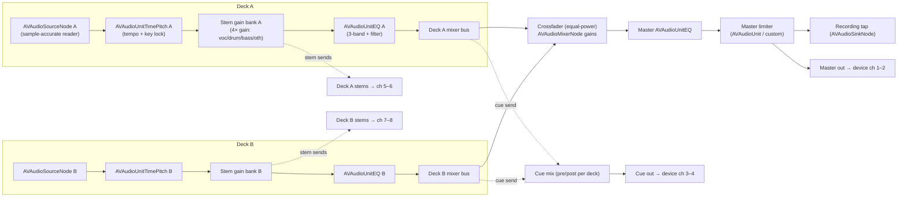

### 29.2 Node responsibilities

| Node | Type | Role | Clock |
|---|---|---|---|
| Source A/B | `AVAudioSourceNode` | Render frames from the deck's private reader (pre-decoded PCM + stem buffers), apply loop/cue logic sample-accurately, advance playhead | perf (render block) |
| TimePitch A/B | `AVAudioUnitTimePitch` | Tempo scaling (rate) and independent pitch (key lock) | perf |
| Stem gain bank | 4× gain (in source node or `AVAudioMixerNode` inputs) | Independent stem levels/mutes | perf |
| EQ A/B | `AVAudioUnitEQ` | 3-band shelf/peak + resonant filter (LP/HP sweep) | perf |
| Crossfader | `AVAudioMixerNode` input gains | Equal-power A↔B blend | perf |
| Master EQ | `AVAudioUnitEQ` | Master tone | perf |
| Limiter | custom `AVAudioUnit` or `AVAudioUnitEffect` | Brickwall protection at master | perf |
| Recording tap | `AVAudioSinkNode` | Copy master frames to the recording ring (§37) | perf → non-RT drain |
| Master/Cue/Stem outs | engine output routing | Multichannel device mapping (§44) | perf |

### 29.3 Why this shape

- **Source nodes, not `AVAudioPlayerNode`.** DJ playback needs sample-accurate loop points, key-lock-friendly rate control, and reading from **stem buffers** (four sources summed with independent gains) rather than a single file. `AVAudioSourceNode` gives a render block where the deck's reader controls exactly which samples come out this callback, enabling frame-accurate cue/loop and stem mixing. `AVAudioPlayerNode`'s scheduling model can't express beat-accurate looping cleanly.
- **Apple's TimePitch/EQ where they're good enough.** `AVAudioUnitTimePitch` provides quality time-stretch/pitch-shift on Apple Silicon; `AVAudioUnitEQ` provides clean shelving/peaking. Using them keeps the custom render code focused on the DJ-specific logic (reading, looping, stem summing) and leverages Apple's optimized DSP. The limiter is custom because DJ limiting has specific attack/release needs.
- **Stems summed in the source node.** Each deck's source node reads four stem buffers (from cache, §36) and sums them with per-stem gains before output, so "vocals mute / bass solo" is a gain change applied sample-accurately with no extra nodes. When stems aren't ready, the node reads the original mixed buffer and the stem faders are disabled.

## 30. Master clock and sample-accurate scheduler

### 30.1 The master clock

The engine's time base is the audio device's sample clock, surfaced by AVAudioEngine. All scheduling is expressed in **absolute sample frames** on this timeline. Each deck maintains a `playheadSample` (position within its track, in the track's own sample space) and a mapping to the master timeline via its current rate.

The **master deck** (mockup `ipad/07-dj-workspace.html` marks Deck A "MASTER") defines the tempo/phase reference for sync. A `MasterClock` value snapshot (current master sample, master BPM, master downbeat phase) is published to the render thread via the double-buffered snapshot (§12.2) and read once per callback.

### 30.2 Sample-accurate scheduling of events

Cue triggers, loop boundaries, and sync engage points are scheduled at exact sample frames. The render block, each callback, knows the sample range `[frameStart, frameStart + frameCount)` it is about to produce and checks scheduled events against that range:

```swift
// Inside a deck's render block (illustrative; POD state only, no allocation)
func render(into out: UnsafeMutableBufferPointer<Float>, frames: Int, masterSample: Int64) {
    commandRing.drain { apply($0) }                 // §12.2
    var f = 0
    while f < frames {
        // Determine the next sample-accurate boundary within this callback:
        let nextEvent = min(loopBoundarySample(), scheduledCueSample(), Int64(frames - f) + cursor)
        let chunk = Int(nextEvent - cursor)
        readStemsMixed(into: out, at: f, count: chunk)   // sum 4 stems × gains
        cursor += Int64(chunk); f += chunk
        if cursor == loopEndSample && loopActive { cursor = loopStartSample }   // sample-accurate loop
        if cursor == scheduledCueSample { jumpTo(scheduledCueTarget); consumeCue() }
    }
    advancePlayheadAndMeters()
}
```

Because boundaries are honored *within* a callback (splitting the buffer at the exact frame), loops and cues are frame-accurate regardless of buffer size — the defining property DJs rely on.

### 30.3 Quantization

A quantized trigger (loop, cue, sync) computes its target sample as the next beat/bar boundary on the **master** grid, translated into the deck's local sample position via the current tempo mapping, then schedules the jump for that frame. Quantize resolution (1 beat, ½ beat, 1 bar, 4 bars) is a `Quantize` enum passed with the command; the boundary is derived from the beat grid snapshot the deck holds.

## 31. Time-stretching and pitch (key) lock

### 31.1 Tempo change

Deck tempo is changed by setting `AVAudioUnitTimePitch.rate` (mockup `ipad/07-dj-workspace.html`: "Pitch +1.2%" on the synced deck). Rate `r` means playback is `r×` speed. With **key lock on**, pitch is held constant while rate changes (the unit time-stretches). With key lock off, the classic vinyl behavior applies: rate change also shifts pitch (`pitch` follows `rate` as `1200·log2(r)` cents), which some DJs prefer for certain transitions.

```swift
public func setPitch(_ deck: DeckID, percent: Double) {   // e.g., +1.2 → rate 1.012
    let rate = 1.0 + percent / 100.0
    enqueue(.setRate(deck: deck, rate: Float(rate), keyLock: keyLock[deck]))
}
```

### 31.2 Key lock quality

`AVAudioUnitTimePitch` uses a high-quality algorithm suitable for the ±6–8% tempo range typical in beatmatching; artifacts are minimal within that range (FR-ENG-6). For larger shifts the UI can warn. The `overlap`/algorithm parameters are set for music (favoring transient preservation). Key lock state is per deck and reflected in the deck node's `pitch` handling as above.

### 31.3 Independent musical key shift

Beyond tempo, the engine supports shifting a deck's musical **key** by ±N semitones for harmonic mixing (e.g., nudging a track a semitone to match Camelot) via `AVAudioUnitTimePitch.pitch` (in cents, 100 per semitone) with rate held. This changes the effective Camelot of the playing deck; the UI reflects the shifted key so the compatibility hints (§28) stay honest.

## 32. Beat sync algorithms

### 32.1 What sync guarantees

`sync(deck, to: master)` makes the synced deck **tempo-matched and phase-aligned** to the master at the sync instant (FR-ENG-4). Two steps:

1. **Tempo match.** Set the synced deck's rate so its effective BPM equals the master's current effective BPM: `rate_synced = masterBPM / trackBPM_synced`. (If the master's tempo changes later, sync can be *continuous* — the synced deck's rate tracks — or *momentary*; default is continuous while "SYNC" is engaged, mockup `ipad/07-dj-workspace.html` shows Deck B "SYNCED".)
2. **Phase align.** Compute the synced deck's current beat phase and the master's current beat phase (both from their grids and playheads at the sync sample), and shift the synced deck's playhead by the phase difference so beats coincide. The shift is applied as a scheduled, sample-accurate jump (a sub-beat nudge) at the next callback boundary, or ramped over a few milliseconds to avoid a click for large corrections.

```swift
public enum SyncEngine {
    /// Pure computation of the correction; applied by the render layer.
    public static func correction(master: DeckClock, synced: DeckClock,
                                  atMasterSample: Int64) -> SyncCorrection {
        let targetRate = master.effectiveBPM / synced.trackBPM
        let masterPhase = master.beatPhase(atMasterSample)            // 0..1 within a beat
        let syncedPhase = synced.beatPhase(synced.playheadSample)
        let phaseDeltaBeats = phaseDifference(masterPhase, syncedPhase) // (−0.5, 0.5]
        let sampleShift = Int64(phaseDeltaBeats * synced.samplesPerBeat)
        return SyncCorrection(setRate: Float(targetRate), playheadShiftSamples: sampleShift)
    }
}
```

### 32.2 Downbeat-aware sync

Optionally sync aligns **downbeats** (bar 1 to bar 1), not just beats, using the `downbeat` data — important for phrase-aligned mixing. The `SyncCorrection` then targets the nearest master downbeat phase. Beat-only vs bar sync is a preference; bar sync is the safer default for phrase-matched transitions.

### 32.3 Purity and testability

`SyncEngine.correction` is pure (no I/O, deterministic), so its phase math is unit-tested against fixtures with known grids (AT-ENGINE-SYNC-\*). The render layer only *applies* the returned rate and sample shift, keeping the hard-real-time code trivial and the tricky math testable off-thread — the same pure/shell split used throughout.

## 33. Cue, loop, and quantized triggering

### 33.1 Cues

Hot cues (from `cue_point`) are triggered by pad or MIDI. A cue trigger schedules a sample-accurate jump of the playhead to `samplePosition` (optionally quantized to the next beat/bar, §30.3). "Cue" (the transport CUE button, mockup `ipad/07-dj-workspace.html`) sets/returns to a temporary cue point (press-to-preview, release-to-return — classic CDJ behavior), implemented as a scheduled jump plus a play/pause gate. All cue logic is playhead arithmetic in the render block; no allocation.

### 33.2 Loops

A loop (from `loop`, or set live via "LOOP 8"/"LOOP 4" in mockup `ipad/07-dj-workspace.html`) defines `[startSample, endSample)`. When active, the render block wraps the cursor at `endSample` back to `startSample` (§30.2), sample-accurately, so the loop is seamless and beat-aligned. Loop length in beats (½, 1, 2, 4, 8, 16) is converted to samples via the grid; halving/doubling adjusts `endSample` to the grid. Loop in/out can be moved live; changes arrive as RT commands and take effect at the next boundary.

### 33.3 Quantized triggering

Both cues and loops honor a global **quantize** setting so triggers land on the grid (FR-ENG-5). The quantize resolution and the deck's grid snapshot let the render layer compute the exact target frame. This is what makes live looping and cue-juggling musical rather than sloppy.

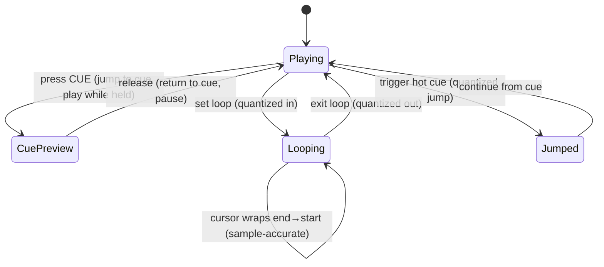

## 34. Latency budget and buffer management

### 34.1 The end-to-end budget

Performance credibility rests on *round-trip* latency — from a physical action (nudge a jog, move the crossfader, hit a cue pad) to the resulting change in the audio at the output. The target is **≤ 12 ms** action-to-audio at the default hardware buffer, and the engine must remain glitch-free (no dropouts) while sustaining it (NFR-PERF-2, FR-ENG-8). The budget decomposes as:

| Stage | Budget | Notes |
|---|---|---|
| Input event acquisition (HID/MIDI → main) | ≤ 1 ms | CoreMIDI / HID callback to main-actor intent |
| Intent → RT command enqueue | ≤ 0.1 ms | lock-free ring push (§12) |
| Command pickup latency (worst case) | 1 buffer | command applied at next render callback |
| Render callback compute | ≤ 30% of buffer period | headroom so we never overrun |
| Hardware output buffer | 1 buffer | AVAudioEngine → CoreAudio |
| DAC / interface | device-dependent | typically 1–2 ms on class-compliant gear |

At a **128-frame** buffer / 48 kHz, one buffer is ≈ 2.67 ms; two buffers plus compute and DAC land comfortably under 12 ms. At **256 frames** (≈ 5.33 ms) the app is still well within budget with more compute headroom, and this is the default for multi-deck + stems. The user can choose the buffer size in `ipad/11-midi-audio-cue.html` ("Buffer Size") to trade latency for headroom.

**On iOS the buffer size is a request, not a setting.** `AVAudioSession.preferredIOBufferDuration` is advisory; the system grants what it grants, and the granted value changes when the route changes. Every latency number the UI displays MUST be derived from the *granted* `ioBufferDuration` and `outputLatency`, never from the request (FR-SESS-2). An app that shows "2.7 ms" while the system granted 21 ms is lying to a performer, and they will find out at the worst possible moment.

The output path adds a term macOS did not have:

| Output route | Typical added latency | Verdict for performing |
|---|---|---|
| Wired USB-C / Lightning headphones or interface | ~1–3 ms | ✅ the intended path |
| Built-in speaker | ~5–10 ms | ⚠️ usable for preparation, not performance |
| **Bluetooth (AAC/SBC)** | **~120–300 ms** | ⛔ unusable — nudging a jog wheel a third of a second before it is heard is not beatmatching |
| AirPlay | 1–2 s | ⛔ |

Hence FR-SESS-4: entering performance mode over Bluetooth requires an explicit acknowledgement, and the measured round-trip figure is shown next to it. The app does not silently refuse and does not silently allow — it tells the truth and lets the user decide.

### 34.2 Why buffer size is a first-class setting

Stem playback (four AVAudioPlayerNodes per deck) plus EQ, filter, and metering costs materially more per callback than a single stereo file. The safe operating point depends on the mix of features and the machine. The engine therefore:

- Requests **256 frames** when stems are enabled on any deck, **128 frames** otherwise, and reports what it was granted.
- Exposes a live **callback-load meter** (the CPU % in mockup `ipad/07-dj-workspace.html`'s status bar is derived from render-time-over-period) so the user sees headroom.
- Applies an internal policy that *warns and suggests a larger buffer* if the measured render-time-over-period ratio exceeds a threshold (e.g., > 0.6) for a sustained window, rather than silently glitching (see §46 watchdogs).

### 34.3 Measuring render load

Render load is measured **inside** the render callback using the audio timestamp and the host clock, never with `Date`:

```swift
// Inside the render callback (illustrative; real code avoids even this if it allocates)
let start = mach_absolute_time()
renderAllDecksAndMix(into: outputBuffers, frameCount: frames)
let end = mach_absolute_time()
// Convert to seconds with cached timebase; publish via an atomic for the meter to read.
renderNanos.store(machToNanos(end - start), ordering: .relaxed)
```

The UI meter reads `renderNanos` (an atomic) at display cadence and divides by the buffer period to show a percentage. No timing computation crosses the RT boundary except a single relaxed atomic store.

### 34.4 Buffer pool and zero-allocation steady state

All buffers the render path can touch are **pre-allocated**:

- Per-deck scratch buffers for stem summing and EQ/filter state (sized to the max frame count).
- The mixer's master accumulation buffers.
- The metering ring that the spectrum/level views read from.

Steady-state rendering performs **no heap allocation, no locks, no Swift ARC traffic on reference types** (all hot structures are value types or pre-retained). Buffer size changes (a rare, user-initiated event) tear down and rebuild the engine and pools off the RT path, then resume — this is the one sanctioned time the graph is reconfigured.

### 34.5 Per-callback compute breakdown

Where §34.1's table budgets the *round-trip*, this one budgets the *compute inside a single callback* — the part the app controls. At 128 frames / 48 kHz (≈ 2.67 ms period) with two decks and stems, the callback must finish with headroom:

| Stage in callback | Budget (128f @48k, ~2.67 ms) |
|---|---|
| Drain command ring + read snapshot | < 50 µs |
| Deck A: read + stem-sum + loop/cue resolve | < 700 µs |
| Deck B: read + stem-sum + loop/cue resolve | < 700 µs |
| TimePitch / EQ (Apple units) | amortized in their own render |
| Crossfade + master EQ + limiter | < 300 µs |
| Recording/metering tap copy | < 100 µs |
| **Headroom** | remainder (≥ ~40%) |

These are targets the RT profiler (§34.3, §46.3) validates; the hard constraint is *never miss a callback*, guaranteed by the no-alloc/no-lock/no-IO contract (§34.4), not by hitting an average. If a deck's buffer is somehow not ready (should not happen given pre-loading, §34.2), that deck renders silence and bumps an atomic "starved" counter the monitor surfaces (NFR-REL) — the master output never blocks or glitches.

## 34A. The audio session (new — iOS only)

macOS has no `AVAudioSession`. iOS does, it is mandatory, it is stateful, it is shared with the
rest of the operating system, and it can take your output away mid-set. This section is the
largest genuinely new subsystem in this specification and the one §48.5 flags as the highest
implementation risk in the plan.

It lives in the `Session/` module (§9.2) — the only platform-conditional module in `TonearmDJ`.

### 34A.1 Modes

The session has exactly three configurations. There is no fourth, and no view is permitted to
call `AVAudioSession` directly; everything goes through `AudioSessionCoordinator`.

| Mode | Category / options | `preferredIOBufferDuration` | Used for |
|---|---|---|---|
| **Listening** | `.playback`, `.default` | system default (~23 ms) | The free player. Long battery life, no reason for a small buffer. |
| **Performing** | `.playback`, `.mixWithOthers` **off**, `.allowBluetoothA2DP` | 128 or 256 frames (§34.2) | Decks live. |
| **Performing + talkover** | `.playAndRecord`, `.defaultToSpeaker` off, `.allowBluetooth` | as above | Only when mic talkover is explicitly enabled. |

Deliberate choices worth stating:

- **`.playAndRecord` is not the default for recording.** Recording the master is an
  `installTap` on the engine's main mixer (§37.2), not a microphone capture. Using
  `.playAndRecord` unnecessarily would request the microphone permission, show the orange
  privacy indicator, degrade output quality on some routes, and invite the user to wonder what
  the app is listening to. It is requested **only** for talkover, and the permission prompt is
  therefore honestly motivated when it appears.
- **`.mixWithOthers` is off while performing.** Another app's notification sound arriving in the
  master bus, and in the recording, is unacceptable.
- The transition Listening → Performing happens when the first deck loads, and Performing →
  Listening when both decks unload and no recording is active. It is **not** tied to view
  appearance; navigating away from the workspace mid-set must not reconfigure the session.

### 34A.2 Activation and negotiation

```swift
actor AudioSessionCoordinator {
    struct Granted: Sendable {
        let ioBufferDuration: TimeInterval   // what we actually got
        let sampleRate: Double
        let outputLatency: TimeInterval
        let inputLatency: TimeInterval
        let outputChannels: Int
        let routeName: String
        let isBluetooth: Bool
        var roundTripMillis: Double { (ioBufferDuration * 2 + outputLatency) * 1000 }
    }

    func enter(_ mode: Mode) throws -> Granted {
        let s = AVAudioSession.sharedInstance()
        try s.setCategory(mode.category, mode: .default, options: mode.options)
        try s.setPreferredIOBufferDuration(mode.preferredBuffer)
        try s.setPreferredSampleRate(48_000)
        try s.setActive(true, options: [])
        return snapshot(s)          // ALWAYS read back; never assume the request was honored
    }
}
```

**Read back, always.** The request/grant asymmetry is the defining property of this API and the
source of most of its bugs. `Granted` is what the UI displays (FR-SESS-2), what the render
budget (§34.1) is computed against, and what the watchdog (§46.4) compares against on every
route change.

Ordering is normative: **category → preferences → activate → read back → build/start the engine
graph.** Configuring `AVAudioEngine` before the session is active produces a graph negotiated
against the wrong format, which manifests later as silence on a route change and is miserable to
debug.

### 34A.3 Route changes

`AVAudioSession.routeChangeNotification` arrives on an arbitrary thread and must be marshalled.
The engine's response is table-driven, not ad hoc:

| Reason | Response |
|---|---|
| `.oldDeviceUnavailable` (headphones/interface unplugged) | **Pause both decks immediately.** iOS's default of continuing on the speaker would blast a venue or a bedroom at 3 a.m. Recording continues (the tap is pre-output); the UI states what happened. |
| `.newDeviceAvailable` (interface attached) | Re-read `Granted`, re-negotiate buffer, reconfigure output channel map if the device offers > 2 channels (§44.2), notify the cue router. Decks keep playing where the sample rate is unchanged. |
| `.categoryChange`, `.override` | Re-read `Granted`; re-assert preferences if another party changed them. |
| `.routeConfigurationChange` | Re-read only. Common and usually benign. |
| Sample-rate change on any of the above | **Full graph rebuild** (§34A.5), because AVAudioEngine node formats are fixed at connect time. |

A route change to Bluetooth while performing raises the FR-SESS-4 warning with the measured
`roundTripMillis` rather than silently degrading.

### 34A.4 Interruptions

The scenario the previous specification could not have: a phone call arrives 40 minutes into a
recorded set.

```
.began
  ├─ engine is paused BY THE SYSTEM (we do not get to refuse)
  ├─ RecordingService.flushSegment()          ← the critical line (NFR-REL-2)
  ├─ capture deck transport state + playhead frames
  ├─ mark the session interrupted; UI shows a persistent, non-modal banner
  └─ Watch remote (§39A) is told, so it shows "interrupted", not stale time

.ended
  ├─ if options contains .shouldResume:
  │     re-activate session → read back Granted
  │     if sample rate or channel count changed → rebuild graph (§34A.5)
  │     restore transports to captured playheads
  │     ├─ recording: OPEN A NEW SEGMENT, do not reopen the flushed one
  │     └─ decks: DO NOT auto-play. Restore paused, at position, and let the human
  │              decide. Audio resuming by itself into a room is worse than silence.
  └─ else: remain paused; the banner offers an explicit Resume
```

The recording is a **segmented** file precisely so this works (§37.2): an interruption costs at
most the current in-flight segment, and the finished mix is the concatenation. The segments
either side of an interruption are joined with a short crossfade and the gap is recorded in the
mix timeline, so the user can see where it happened rather than wondering why a bar is missing.

Media services can also die (`mediaServicesWereResetNotification`). That is the same handler as
"sample rate changed": tear down and rebuild everything, restore playheads, keep the recording's
flushed segments. It is rare and it is not optional to handle — an unhandled reset leaves the app
permanently silent until relaunch, mid-set.

### 34A.5 Graph rebuild

Rebuilding is a **reconfiguration window** in the sense of Appendix K.4: the RT thread is
stopped, the graph is torn down and rebuilt against the new format, buffers are re-allocated from
the pool, and the RT thread restarts. It is the only time node topology may change.

Rules:

- Never rebuild while the render callback can run. Stop first, assert stopped.
- Rebuild is **idempotent and reentrant-safe**; a second route change during a rebuild coalesces
  rather than queueing a second rebuild.
- Deck playhead positions are captured in *frames at the source's sample rate*, not seconds, so
  a rate change does not drift the position.
- A rebuild must complete within **300 ms** or the watchdog surfaces it (§46.4). In practice it
  is ~30–60 ms.
- Cue routing, MIDI mappings and stem assignments are re-applied from persisted state, never
  from in-memory graph inspection.

### 34A.6 Background and lifecycle

- `UIBackgroundModes: audio` is required and is honestly used: playback continues backgrounded,
  and **an active recording continues backgrounded** (FR-SESS-5). A user who backgrounds the app
  to answer a message mid-set does not lose the set.
- On backgrounding: the telemetry pump suspends (§40.3), waveform rendering stops, analysis
  lanes stay suspended, the engine continues.
- **`isIdleTimerDisabled = true` while any deck is playing**, restored the moment both stop.
  Scoped to the engine's state, never to a view's lifetime — a screen that locks mid-transition
  is a ruined transition, and an idle timer left disabled after the set is a flat battery.
- On termination (system or user): flush the current recording segment, persist deck state,
  release the session. `applicationWillTerminate` is not guaranteed, which is why §37.3's
  crash-recovery path — not this one — is the actual guarantee behind NFR-REL-2.

### 34A.7 Acceptance tests

- **AT-SESS-1** Unplugging headphones mid-playback pauses both decks within one buffer period and
  never emits audio from the built-in speaker.
- **AT-SESS-2** A phone call at minute 40 of a recording yields a finished mix whose duration is
  within one segment length of expected, with the gap present in the timeline.
- **AT-SESS-3** Attaching a 4-channel USB-C interface mid-session re-negotiates and re-applies
  cue routing without stopping playback, where the sample rate is unchanged.
- **AT-SESS-4** `mediaServicesWereReset` mid-set restores audio within 300 ms with playheads
  intact and the recording continuing into a new segment.
- **AT-SESS-5** The latency shown in the UI equals the *granted* round trip on every route, for
  all of: built-in, wired, USB-C interface, Bluetooth.
- **AT-SESS-6** Backgrounding during a recording for five minutes loses no audio.
- **AT-SESS-7** No microphone permission is requested unless talkover is enabled.

## 35. Deck and mixer architecture

### 35.1 A deck as a summed stem voice

Each deck is either a **single stereo source** (stems disabled) or **four stem voices** (vocals, drums, bass, other) summed with per-stem gain (mockup `ipad/07-dj-workspace.html`'s stem faders). The deck presents one stereo signal to the mixer regardless. Internally:

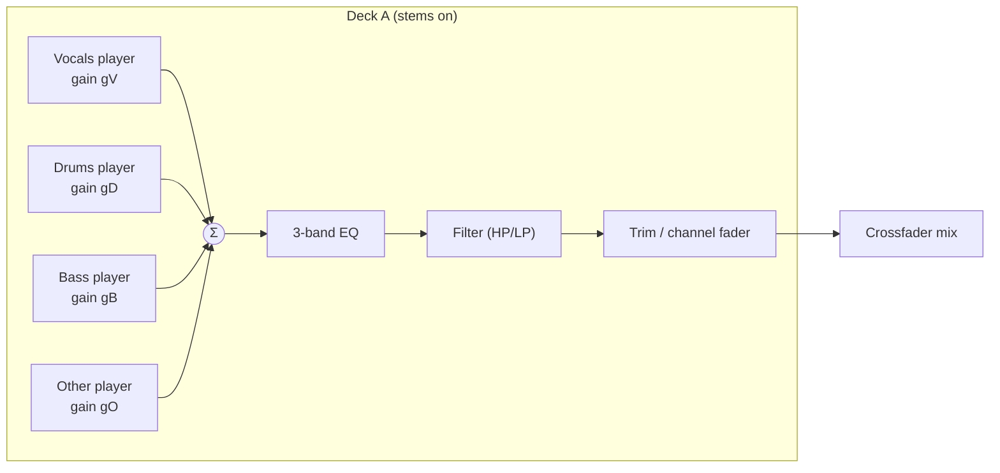

With stems **off**, `V` carries the full mix and `D/B/O` are silent (or, equivalently, a single player feeds the chain) — the downstream EQ/filter/fader path is identical, so the mixer doesn't care whether a deck is stemmed. Per-stem gains are smoothed (one-pole ramp) so fader moves don't click.

### 35.2 Three-band EQ

The channel EQ is a classic **isolator-style 3-band** (LOW/MID/HIGH, mockup `ipad/07-dj-workspace.html` knobs) with full kill. Implementation is a pair of Linkwitz–Riley crossovers splitting the signal into three bands, each scaled by its knob gain (0 → −∞ dB kill, unity at 12 o'clock, up to +6 dB boost), then summed:

```swift
struct ThreeBandEQ {
    var lowMid  = LinkwitzRiley(splitHz: 200)   // LF/MF crossover
    var midHigh = LinkwitzRiley(splitHz: 2_000) // MF/HF crossover
    var gLow: Float = 1, gMid: Float = 1, gHigh: Float = 1  // smoothed targets

    mutating func process(_ x: SIMD2<Float>) -> SIMD2<Float> {
        let (lo, hiA) = lowMid.split(x)
        let (mid, hi) = midHigh.split(hiA)
        return lo * gLow + mid * gMid + hi * gHigh
    }
}
```

The crossover topology gives flat magnitude at unity and musical, phase-coherent kills. Coefficients are precomputed for 48 kHz; gains are ramped per block. (`SIMD2<Float>` carries the stereo pair; the real kernel processes a block with vDSP where it pays.)

### 35.3 Filter (HP/LP sweep)

A single per-channel **resonant filter** knob sweeps from low-pass (turn left) through neutral (center detent, bypassed) to high-pass (turn right), the standard DJ-mixer color filter. Implemented as a state-variable filter with a mapped cutoff and mild resonance; bypassed exactly at center to avoid coloring the neutral position.

### 35.4 Crossfader and channel faders

The **channel fader** (trim) sets each deck's contribution; the **crossfader** blends decks A↔B with a selectable curve (constant-power for smooth blends, or sharp for scratch-style cuts). Both use equal-power or linear laws as configured, with smoothing:

```swift
enum CrossfaderCurve { case constantPower, linear, sharp }

func crossfaderGains(_ x: Float, _ curve: CrossfaderCurve) -> (a: Float, b: Float) {
    switch curve {
    case .constantPower:
        let t = (x + 1) * 0.25 * .pi          // x∈[-1,1] → [0, π/2]
        return (cos(t), sin(t))
    case .linear:
        return ((1 - x) * 0.5, (x + 1) * 0.5)
    case .sharp:
        return (x < 0.4 ? 1 : 0, x > -0.4 ? 1 : 0) // hard cut with small overlap
    }
}
```

### 35.5 Master bus, limiter, and metering

Deck outputs are summed on the **master bus**, passed through a transparent **brickwall limiter** (lookahead, soft-knee) to guarantee the output never clips (FR-ENG-7), then split to (a) the output device and (b) the **recording tap** (§37) and (c) the **metering tap** feeding the spectrum and level meters (mockup `ipad/07-dj-workspace.html`). The limiter's ceiling and metering ballistics are fixed defaults; the limiter protects both ears and the recorded file. The master signal path (sum → limiter → taps) is the single point where the whole mix exists, which is exactly where recording and analysis of the live output attach.

### 35.6 Mapping to the node graph

Where feasible the chain uses **`AVAudioSourceNode` per deck** — the deck renders its own summed, EQ'd, filtered stereo block in its render block (all the DSP above executes there, lock-free), and AVAudioEngine handles device I/O and the master mix node. The limiter can be an `AVAudioUnit` (an Audio Unit effect) on the main mixer output, or hand-written in a final source/tap stage. This keeps sample-accurate control (§30) in our code while leaning on the engine for hardware plumbing (§29.3).

## 35A. Beat FX — the beat-synced echo send (new — M5)

M4 shipped EQ, filter, crossfader and limiter (§35.2–35.5). Four of the five core transitions
(§35B) are performable with exactly those. The fifth — **Echo Out** — is not, and this section
adds the one DSP block that closes the gap. The FX pads shipped as honest-unavailable in M4;
this is what makes them live.

### 35A.1 Why post-fader is the whole design

An echo used as a *transition* must keep sounding after its source is removed. If the delay sits
**pre-fader**, cutting the channel fader kills the source *and* the tail, and the transition
collapses into a fader cut. The echo therefore sits **post-fader, pre-crossfader**, per channel:

```
stems → Σ → EQ → filter → trim → channel fader → ECHO SEND → crossfader → master → limiter
                                                     ↑
                                         tail survives the fader cut
```

This placement is normative (FR-TRANS-4). It is also why the echo cannot be a master-bus effect:
the tail must belong to the outgoing channel while the incoming channel stays dry.

### 35A.2 The kernel

```swift
public struct BeatEcho: Sendable {          // pure; one per channel
    public var enabled: Bool                // ON/OFF — momentary or latched
    public var beats: Double                // 1/4, 1/2, 1, 2, 4 — delay time in beats
    public var depth: Float                 // 0…1 — wet mix
    public var feedback: Float              // 0…0.85, clamped — tail length
}
```

- **Delay time is derived from the master clock**, not a millisecond value:
  `delayFrames = beats × (60 / effectiveBPM) × sampleRate`. A tempo change moves the echo with it;
  a synced pair echoes in time with both decks.
- The delay line is a **fixed-capacity ring allocated at graph construction**, sized for the
  slowest supported tempo at 4 beats. The render thread never allocates (§12.3).
- Changing `beats` **crossfades between read pointers over one buffer** rather than jumping —
  a pointer jump clicks, and a click during a transition is audible in a way a DJ will not forgive.
- Feedback is hard-clamped below unity so the tail always decays. A self-oscillating echo is a
  defect, not a feature.
- `enabled = false` **stops new input to the line but continues to read the tail** until it decays
  below the noise floor, then bypasses entirely at zero cost. This is what "echo out" means: the
  user turns the source off and the tail finishes on its own.

### 35A.3 Controls and RT boundary

`RTCommand` gains `setEchoEnabled` / `setEchoBeats` / `setEchoDepth` / `setEchoFeedback` — POD
tags on the existing lock-free ring (§12), identical in shape to `setEQ`/`setFilter`. No new
threading model, no new allocation path, and `RTGuard` covers the kernel exactly as it covers the
mixer.

### 35A.4 Honest scope

M5 ships **one** Beat FX — the echo — because it is the one the beginner transition set requires.
The FX module's remaining pads stay honestly unavailable (§36.5's convention) rather than shipping
a filter-sweep pad that duplicates the filter knob. Additional Beat FX are M6.

## 35B. The five transitions (new — M5)

The product's usability target is stated as a performance, not a feature list: **a DJ who knows the
five beginner transitions can perform all five here, on the default surface, with no
configuration** (FR-TRANS-1). Each row below is a normative mapping from a transition to the
controls that perform it, and each has an acceptance test (`AT-TRANS-*`, §47.3).

| # | Transition | What the DJ does | Controls required | Status after M4 |
|---|---|---|---|---|
| 1 | **Bass Swap** | Incoming deck in with LOW killed; on the phrase boundary, swap — outgoing LOW down, incoming LOW up | Per-channel **LOW** with true kill (§35.2), channel faders, phrase ribbon to find the boundary | Engine ✅ · needs §41.9b layout + ribbon |
| 2 | **Filter Transition** | Sweep the outgoing to high-pass as the incoming comes in; release both to centre | Per-channel **FILTER/CFX** knob, bypassed at centre (§35.3) | Engine ✅ · needs the knob in club position |
| 3 | **Echo Out** | Echo on the outgoing, cut its fader, let the tail ring into the incoming | **Beat-synced echo, post-fader** (§35A), channel fader | ❌ **new DSP in M5** |
| 4 | **Fader Cut** | Hard cut on the downbeat, crossfader or channel fader | Crossfader with **sharp curve** (§35.4), quantised visual downbeat from the grid | Engine ✅ · needs curve selection surfaced |
| 5 | **Blend / Mix** | Long simultaneous blend, EQ trimmed to avoid mud | Channel faders, full 3-band EQ, beat-phase meter, shared-playhead waveforms | Engine ✅ · needs §26A.5 stacked waveforms |

Two consequences the implementation must respect:

- **Only row 3 is new engine work.** Rows 1, 2, 4 and 5 are already performable by the M4 engine —
  what they lack is *ergonomics and display*, which is why §41.9b and §26A are in the same
  milestone. The coder should not invent DSP for them.
- **Each transition is a test, not a mode.** There is no "bass swap mode" in the UI. The five are
  a coaching concept (FR-TRANS-6, §41.18) and an acceptance family; the surface simply has the
  right controls in the right places at all times.

## 36. Stem separation pipeline

### 36.1 Two moments of stem use

Stems appear in **two** distinct contexts, and the pipeline serves both:

1. **Prep-time, offline (optional):** during or after analysis, a track can be separated and its stems cached so that loading it into a deck later is instant. This is a heavy, ANE/GPU-bound batch job (like the rest of Part IV).
2. **Performance-time, on demand:** when a DJ drags a not-yet-separated track onto a stem-enabled deck, the app must produce stems quickly enough to be useful — either by having them cached, or by separating in the background and swapping stems in when ready ("stems when ready", analogous to the existing player's "Opus when ready" fallback pattern).

The separation *engine* is shared; only the scheduling/urgency differs.

### 36.2 Model and conversion

Separation uses a **Demucs-family** source-separation model (4-stem: vocals/drums/bass/other) converted to **Core ML** so it runs on the Apple Neural Engine / GPU rather than the CPU. The conversion is an offline developer step (documented in Appendix D):

- Export the PyTorch model to a traced/ONNX form, then convert with `coremltools` to an `.mlpackage`, targeting `ComputeUnit.all` (ANE+GPU+CPU as available).
- Fixed input framing: the model runs on **fixed-length chunks** (e.g., a small number of seconds of stereo at the model's sample rate) with overlap-add at the seams to avoid boundary artifacts. Chunk length and overlap are constants in the stem module.
- Output is four stereo streams at the model's sample rate, resampled to the app's 48 kHz working rate if needed.

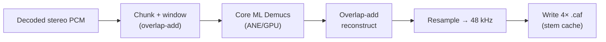

### 36.3 GPU/ANE scheduling and back-pressure

Separation is orchestrated by the same job runner as analysis (§19), but on a **dedicated, low-concurrency lane** because each job saturates the ANE/GPU. Rules:

- **Serialize** heavy separations (concurrency 1–2); never run more Core ML separations than the device can sustain without starving audio.
- During an **active performance** (engine running), prep-time separations are **paused or throttled** so the ANE/GPU and memory bandwidth stay available for real-time stem playback and metering. An on-demand separation the DJ explicitly triggered runs at higher priority than background prep but still yields to the audio thread's needs.
- Progress and stage are surfaced (mockup `ipad/03-analysis.html`-style) so the user sees "separating…" and can prioritize a specific track.

### 36.4 Stem cache format and layout

Cached stems are stored as **four `.caf` files** per track (one per stem), 48 kHz, in a content-addressed stem directory keyed by the track's file hash + stem-model version (so a model upgrade invalidates cleanly, like `analysis_version`). The `asset` table (or a dedicated `stem_asset` row) records their presence, size, sample rate, and model version. Total stem storage is reported in Settings (mockup `ipad/12-settings-storage.html` shows "Stem Cache 18.7 GB"). CAF is chosen for the same reasons as elsewhere (robust, seekable, native).

### 36.5 Performance-time loading and memory

When a stem-enabled deck loads a track:

- If cached stems exist and match the current model version, the four `.caf` files are opened and fed to the four stem players (§35.1). Loading is memory-mapped/streamed like any deck source; only the working buffers are resident.
- If not, the deck loads the **full mix** immediately (so the DJ can play now) and enqueues an on-demand separation; when stems are ready they are swapped in on a beat boundary (the deck briefly reconfigures its voices off the RT path, then resumes), and the stem faders become live.
- Memory is bounded: at most the two loaded decks' stem sets are resident; unloading a deck releases its stem buffers. Stem cache on disk is subject to the same eviction policy as other caches under storage pressure (§43), never evicting stems for a currently loaded deck.

**On-demand separation is best-effort on iOS, and the fallback is the normal case.** The previous specification could assume a Mac GPU with a wall socket behind it. Here, on-demand separation during a live set costs 20–60 s of sustained GPU/ANE load and is a direct contributor to the thermal ceiling (NFR-THERM-1) — the one risk in §50.1 most likely to end a performance badly.

Therefore:

- **Prepared stems are the specified path** (FR-ENG-3). A gig crate exists precisely so that separation happens the night before, on a charger, under the thermal governor.
- On-demand separation during a live session is **permitted, deprioritized, and cancellable**: it runs at the lowest GPU priority, is abandoned the instant `thermalState` reaches `.serious`, and never blocks the deck.
- The deck plays the full mix immediately and the stem faders remain visibly disabled with an honest label ("stems not prepared") rather than appearing live and doing nothing.
- **On iPhone, live four-stem separation on both decks simultaneously is not offered.** Two live stems on the focused deck (typically vocals + everything-else, which is the split that matters for a transition) is the specified iPhone capability; the full four are available from cache. This is the one place the iPhone's capability is narrower than the iPad's, and it is a thermal limit, not a UI limit — it is stated in §2.1 rather than hidden.

### 36.6 Quality and fallback

Separation quality is model-bound; the app treats stems as an *enhancement*, never a correctness requirement. If separation fails or is unavailable (older hardware, model missing), stem-dependent features degrade gracefully to full-mix playback (the deck still plays; stem faders are disabled with an explanatory state), mirroring the project-wide "silent-fallback is a defect; explicit-degrade is correct" stance (§46).

## 37. Recording pipeline

### 37.1 What is recorded

Recording captures the **master bus output** — exactly what the audience hears — post-limiter (§35.5), as a stereo file (mockup `ipad/09-recording-finish.html` "Recording Complete", default M4A/AAC 256 kbps per mockup `ipad/12-settings-storage.html`). Recording is independent of the output device: it taps the same master signal that goes to hardware, so the recorded file matches the performance sample-for-sample (modulo the encoder).

### 37.2 Tap → encode → segment

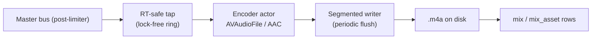

- The **tap** runs in (or right after) the render callback and does nothing but copy the master block into a **lock-free ring buffer** — no encoding, no file I/O on the audio thread.
- An **encoder actor** (off the RT thread) drains the ring, feeds an `AVAudioFile`/`AVAudioConverter` configured for AAC, and writes to disk. Because it's decoupled by the ring, encoder hiccups never stall audio; the ring is sized to absorb scheduling jitter.
- The writer **flushes periodically** (segment/checkpoint) so a crash loses at most a few seconds.

### 37.3 Crash recovery

Recording is designed so a crash or power loss leaves a **playable, near-complete file**:

- The file is written incrementally with periodic flushes; on unexpected termination the on-disk M4A is finalizable up to the last flush.
- A **recording journal** row (in `mix`, marked in-progress with its output URL and start time) lets the app, on next launch, detect an interrupted recording, finalize/repair the file, and present it in the mixes library (mockup `ipad/10-mixes.html`) rather than losing it. This mirrors the recording-journal pattern noted in the schema (§15) and the crash-recovery expectations of a serious capture tool (FR-REC-3).

### 37.4 Metadata capture and the timeline

While recording, the engine logs a lightweight **event timeline** — deck loads, cues, loop toggles, crossfader/EQ moves at low rate — into `mix_track_event`, so a finished mix knows which tracks played and when (mockup `ipad/09-recording-finish.html`'s timeline; mockup `ipad/03-analysis.html` "performance history"). This is written by the same encoder/side-car actor, not the RT thread; events arrive via the same command/telemetry channel. The tracklist and section markers derive from this log and are stored with the mix, enabling the mix-detail "performance history" view (§41.12).

### 37.5 Finishing and delivery

On stop (mockup `ipad/09-recording-finish.html`):

1. Finalize the M4A, compute duration/size, write the final `mix` row and `mix_asset` (file URL, format, bitrate, size).
2. Let the user set title/notes (mockup `ipad/09-recording-finish.html` fields).
3. Offer **Keep on device** (done, and the default), **Also sync to my other devices** (marks the asset for optional CloudKit upload, §38.1 — off by default because a 90-minute set is ~170 MB of a 5 GB quota), and **Export / Share** to the Files app or the share sheet with an optional tracklist cue-sheet (FR-REC-4). The mix immediately appears in "Recorded Mixes" (mockup `ipad/10-mixes.html`) and in the free player's library (FR-REC-5).

Recording defaults (format, bitrate, output folder) come from Settings (mockup `ipad/12-settings-storage.html`). The recorder never blocks the engine and never changes what the audience hears — the tap is read-only on the master signal.

### 37.6 Delivery format — why M4A and not MP3 (new — M5)

The natural request is "share it as an MP3", and it is worth recording precisely why the product
does not, so the decision is not relitigated every milestone.

- **The platform provides no MP3 encoder.** AVFoundation/AudioToolbox decode MP3 but do not
  encode it. `AVAudioConverter` offers AAC, ALAC, and the uncompressed formats. There is no
  system API that produces an `.mp3` file.
- **Producing one requires vendoring a third-party encoder** (LAME being the practical choice),
  which is a new dependency — a standing prohibition — and carries an LGPL review before it could
  ship in a paid App Store binary. The repo has a precedent for vendoring C (`sqlite-vec.c`, §9.1),
  so this is *possible*; it is not *free*, and it is not on M5's critical path.
- **AAC in M4A satisfies the actual requirement.** The user-facing goal is "a file my friends can
  play". M4A/AAC plays natively on iOS, Android, macOS, Windows, and in every messaging app a
  practice set realistically travels through, at better quality per bit than MP3.

**Decision:** M5 ships **AAC 256 kbps in M4A**, and the UI names that format honestly rather than
promising MP3 (FR-REC-7). An MP3 export option is an **M6 candidate**, gated on the licensing
review, and is recorded in §50.3 as a deferred item rather than dropped.


# Part VI — Multi-Device Sync and the Watch Remote

The previous specification devoted this Part to a CloudKit *bridge*: a protocol whose purpose
was to carry finished mixes from a Mac to a phone, plus a read-only companion app to receive
them. **Neither exists here.** The studio and the listener are the same device.

What remains is genuinely smaller and genuinely optional: keeping an iPhone and an iPad in
agreement about a library the user owns, and a Watch remote that lets a performer keep their
hands free. Nothing in this Part is on the critical path; the app is complete with sync
disabled and no Watch paired (FR-SYNC-6).

## 38. CloudKit sync protocol

### 38.1 Scope: what syncs, what does not, and why

The rule is: **sync what a human authored; re-derive what a machine can.**

| Category | Syncs? | Rationale |
|---|---|---|
| Track metadata, source references, ratings, tags | ✅ | Human-authored or user-curated; tiny. |
| Playlists, smart crates, auto-playlist definitions and their briefs | ✅ | Human-authored; tiny; the highest-value thing to have on both devices. |
| Cue points, loops, grid corrections | ✅ (Pro) | Human-authored, expensive to redo, ~bytes each. Preparing a track on iPad and performing it on iPhone is the point. |
| Analysis results (BPM, key, energy, phrases, waveform pyramid) | ⛔ | Deterministic from bytes + analysis version (NFR-DET-1). Re-deriving costs seconds; transferring costs megabytes and quota. |
| **CLAP embeddings** | ⛔ | Same argument, and this is where the previous spec's iCloud footprint came from. Re-embedding a track costs ~1–2 s. |
| **Stems** | ⛔ | Gigabytes. Deterministic. Never. |
| Mix recordings (`.m4a`) | ⚠️ opt-in, **off by default** | Large (a 90-minute set at 256 kbps is ~170 MB). The user decides per mix. |
| Settings, hardware mappings, storage budgets | ✅ | Small; and a MIDI mapping the user spent an hour on should follow them. |
| Purchase/entitlement state | ⛔ | StoreKit and Family Sharing handle this. We never write it anywhere. |

FR-SYNC-5 is the load-bearing decision in this Part. The old spec synced embeddings because the
Mac was the only device that could produce them; here every device can, so the network is
strictly worse than the ANE.

### 38.2 Record types

The existing container `iCloud.guru.parso.tonearm` and the existing `RecordMapping` convention
(record name = `"<Type>-<syncID>"`, parent references carried as `syncID`) are reused verbatim.
DJ adds:

| Record type | Payload | Tier |
|---|---|---|
| `CuePoint` | `trackSyncID`, `index`, `framePosition`, `name`, `colorIndex` | Pro |
| `Loop` | `trackSyncID`, `inFrame`, `outFrame`, `beatLength`, `name` | Pro |
| `GridCorrection` | `trackSyncID`, `anchorFrame`, `bpmOverride`, `downbeatOffset`, `version` | Pro |
| `Crate` | `name`, `kind` (static / smart / gig), `queryJSON`, `ordering` | Free |
| `AutoPlaylistBrief` | `prompt`, `arcKind`, `arcPoints`, `targetSeconds`, `constraintsJSON`, `seed` | Free |
| `DJMix` | `title`, `notes`, `recordedAt`, `durationSeconds`, `trackEventsJSON`, `artworkAsset` | Pro |
| `DJMixAsset` | `mixSyncID`, `audioAsset` (CKAsset), `byteCount`, `sha256` | Pro, opt-in |
| `HardwareMapping` | `deviceName`, `mappingJSON`, `isDefault` | Pro |

`AutoPlaylistBrief` is worth calling out: syncing the **brief** rather than only the resulting
track list means a smart crate re-resolves against whatever library the receiving device has,
and the user's phrasing ("something for a rainy Sunday") survives as a first-class object they
can edit later.

### 38.3 Mapping layer (pure and testable)

Unchanged in shape from the previous spec, and unchanged in the repo: `RecordMapping` stays a
pure function pair per type — `toRecord(_:) -> CKRecord` and `fromRecord(_:) throws -> Model` —
with no I/O, so every mapping round-trip is a unit test with no CloudKit involved. New types
above join the same table-driven registry.

### 38.4 Conflict resolution

Last-writer-wins on `modifiedAt` is correct for almost everything here and wrong for exactly
one case: **cue points**, where two devices can each add a cue and LWW would silently discard
one. Cues therefore merge as a **set keyed on `(trackSyncID, index)`**, with a positional tie
broken by `modifiedAt`. A cue deleted on one device and edited on another resolves to the edit
(delete loses), because losing a cue you set is worse than seeing one you meant to remove.

Grid corrections are LWW — there is only one true grid, and the most recent human judgement
about it wins.

### 38.5 Engine and lifecycle

`CKSyncEngine` (or the existing `CloudSyncEngine` wrapper, extended) drives the state machine.
Because there is no longer a producer/consumer asymmetry between devices, the lifecycle
collapses to the symmetric case the existing engine already implements: observe local changes →
batch → push; subscribe to remote changes → fetch → merge → apply. No silent push is required
for correctness; mixes are not the reason sync exists any more.

`CloudSyncEngine.stop()` semantics are preserved exactly (NFR-REL-3): toggling sync off stops
syncing and **never bulk-deletes local data**.

### 38.6 Asset integrity and retention

Where mixes *are* synced, integrity is `byteCount` + SHA-256 (`CacheKeyGenerator`, NFR-DET-2),
and retention is a user-set policy (keep all / keep N most recent / keep 30 days). The Recorded
Mixes screen (§41.10) shows both local storage used and iCloud quota remaining, because a
90-minute set is a meaningful fraction of a free 5 GB tier and the user deserves to know that
before they tap.

### 38.7 Privacy posture

The private database only. No public or shared database, no CloudKit Functions, no server-side
logic. If the user has no iCloud account, or turns sync off, every feature in this document
still works. This is checked by an acceptance test that runs the full journey suite with sync
disabled (AT-SYNC-0).

## 39. The multi-device model

### 39.1 Devices are peers, not tiers

There is no primary device. An iPhone and an iPad running Platterhead are the same application
with the same capabilities and the same data model; they differ only in control surface
(§41 vs §42). A track prepared on either is prepared on both. A mix recorded on either plays on
both.

This is a simplification with real architectural consequence: there is no "authoritative"
library, no import/export handshake, no pairing flow, and no class of data that only one device
can produce. The previous spec's §39 (a read-only companion with its own reduced data model)
is deleted in its entirety.

### 39.2 Library divergence is expected and fine

Two devices will not hold the same audio. An iPad with 512 GB may hold the whole library; an
iPhone may hold a few gig crates and stream the rest from a remote library. The synced layer is
metadata and human-authored preparation, so both devices agree about *what the music is* and
*how it is prepared* while disagreeing about *what is currently on disk*.

The UI therefore never presents "missing" as an error. A track whose bytes are not local shows
a **caching affordance**, and — per FR-LIB-8 — cannot be loaded to a deck until it is fully
resident. On iPhone, tapping a non-resident track in a gig crate begins caching and shows
progress; the deck slot stays disabled until it completes.

### 39.3 Analysis is per-device and idempotent

Because analysis does not sync, each device analyzes what it holds. This is not duplicated work
in any meaningful sense — the phone was going to need the waveform pyramid locally to draw it
anyway — and it is what makes NFR-DET-3 (bit-identical output across A- and M-series) matter:
two devices independently analyzing the same file must agree, or a cue point synced from one
would land in the wrong place on the other.

## 39A. The Apple Watch performance remote

⟢ **Repo alignment.** The existing app already ships a watchOS target with a live `WCSession`
status surface, playlist sync and remote playback control. The performance remote is an
additive mode inside that app, reusing the existing session plumbing rather than introducing a
new transport.

### 39A.1 Why this exists

A DJ performing from a phone has one hand on the device and one on a controller or a drink. The
two things they need without looking are: *is it still recording*, and *how long is left on
this deck*. Both are glanceable. The Watch is the correct place for them, and the repo already
has the connection.

### 39A.2 Surface

A single watchOS screen, active only while a performance session is live:

- **Deck A / Deck B remaining time**, large, monospaced, colour-shifting to amber under 60 s and
  red under 20 s.
- **Master level meter**, a coarse 8-segment bar (enough to notice silence or clipping).
- **REC state and elapsed time**, with a tap-to-stop that requires a firm confirmation — the
  worst possible outcome is ending a set's recording by brushing your sleeve.
- **Load next**, which loads the top-ranked suggestion from the current gig crate into the
  free deck. One tap, haptic confirm.
- **Digital Crown** scrubs the suggestion list; a long press cancels.

### 39A.3 Transport and failure model

State flows Watch ⇄ phone over `WCSession` `sendMessage` for commands (needs reachability,
returns a reply) and `updateApplicationContext` for the ~2 Hz telemetry heartbeat (coalescing,
lossy, correct). Telemetry is deliberately **not** at display rate; a Watch does not need 60 fps
deck time and the battery cost would be absurd.

The failure model is the important part: **the Watch is never in the audio path.** If the
session drops, the phone continues performing and recording exactly as it was, and the Watch
shows a stale-data indicator rather than zeros. No engine state machine transition may be
initiated by, or blocked on, a Watch message. Commands are idempotent and carry the engine's
expected generation counter, so a delayed "load next" that arrives after the user already
loaded something is discarded rather than replayed.

- **AT-WATCH-1** Killing the Watch app mid-set changes nothing audible and does not interrupt
  the recording.
- **AT-WATCH-2** A `sendMessage` that times out is retried at most once, then surfaced as
  "not connected" on the Watch and ignored by the phone.
- **AT-WATCH-3** Stop-recording from the Watch produces a file byte-identical to stopping from
  the phone.

### 39A.4 What the Watch deliberately does not do

No waveforms, no EQ, no crossfader, no stem faders. A wrist is a status surface and a panic
button, not a mixer. Attempting otherwise produces a control surface that is worse than the
phone in every dimension including the one it is supposed to win, which is not looking at your
phone.

---
---

# Part VII — Presentation Layer

## 40. UI architecture pattern

### 40.1 Pattern: SwiftUI + observable view models over the core façades

The app uses **SwiftUI** with a **Model–View–ViewModel** shape that matches the existing repo:
`@MainActor final class …Model: ObservableObject` view models hold `@Published` state, call into
the core service façades (§10), and expose intent methods; views are thin and declarative. Where
a screen observes the database, the view model subscribes to a repository's
`ValueObservation`-backed `AsyncStream` (§18.4) and republishes; where it drives audio, it calls
the `PerformanceEngine` façade and reads back lightweight published telemetry (never touching
the RT thread directly).

⟢ **Repo alignment.** This is the same `@MainActor … ObservableObject + @Published` controller
pattern the codebase already uses (e.g. `AudioPlayer`), so DJ views compose naturally with the
existing player views and — critically — the free-tier search and playlist views are ordinary
citizens of the existing navigation rather than a bolted-on section.

```mermaid
flowchart LR
    View["SwiftUI View"] -->|intent| VM["@MainActor ViewModel<br/>(ObservableObject)"]
    VM -->|calls| Svc["Core façade<br/>(DJLibraryStore / PerformanceEngine / SearchService / …)"]
    Svc -->|AsyncStream / telemetry| VM
    VM -->|@Published| View
    Ent["EntitlementStore"] -->|@Published isPro| VM
```

### 40.2 Three view-model tiers

- **Data-bound VMs** (library, mixes, search, playlists): observe repositories; cheap; survive
  backgrounding.
- **Session VMs** (workspace, prep): own transient performance/edit state; coordinate the engine
  and analysis; may be large but hold no audio buffers themselves.
- **Ephemeral VMs** (sheets, settings panes, paywall): short-lived, own a slice of settings.

### 40.3 Telemetry cadence

Real-time readouts (meters, spectrum, thermal state, playhead) are **display-rate** concerns.
The engine publishes them via atomics/rings (§34.3); a single `CADisplayLink`-driven pump on the
main actor samples them and updates a small `@Published` telemetry struct. View models never
poll the RT thread and never block on it — the UI degrades to a stale-but-safe readout if a
frame is missed, never a glitch in audio.

**iOS-specific:** the pump runs at the display's native rate via `CADisplayLink.preferredFrameRateRange`,
which is 120 Hz on ProMotion iPads and iPhone Pro models. It is **throttled to 30 Hz whenever
`thermalState >= .serious`** and suspended entirely when the app is not foreground — a
background recording needs no meters.

### 40.4 Tier presentation rules (normative)

How Pro is presented is a design decision with a right answer, and getting it wrong will do more
commercial damage than any missing feature:

1. **Never hide a Pro feature.** Locked capabilities are visible, legible, and labelled. A user
   who cannot see the decks cannot want them.
2. **Never fake a Pro feature.** No blurred screenshots-as-UI, no dummy waveforms. The locked
   deck shows the *real* control surface, dimmed, with a single lock affordance.
3. **Never interrupt.** The paywall appears when the user reaches for a Pro control, never on
   launch, never on a timer, never over playback (FR-STORE-6).
4. **Never imply the free tier is a trial.** No "upgrade to unlock your music". The free tier is
   a complete product and the copy must say so.
5. **State the deal plainly.** One-time price, what's included, Family Sharing, GPLv3 source,
   and an explicit line that nothing free is being removed (§2.4).

`EntitlementStore.isPro` is a single `@Published` source of truth injected into the environment.
A purchase flips it and views update; **no relaunch, no reload, no re-analysis** (AT-STORE-2).

### 40.5 Screen inventory

| Surface | Count | Mockup folder |
|---|---|---|
| iPad (regular size class) | 20 files / 16 screens | `mockups/ipad/` |
| iPhone (compact size class) | 12 files / 10 screens | `mockups/iphone/` |
| watchOS | 1 file / 1 screen | `mockups/watch/` |

Several screens have more than one mockup file because a single static image cannot show the
behaviour: search has a query state and a refined-results state; the auto-playlist generator has
a brief state and a generated state; the paywall has an in-context locked state and the purchase
sheet; the iPhone solo deck has a performing state and a browse-while-performing state; the
iPhone twin deck has both decks resident and a bank momentarily raised over one jog; the iPad
workspace has the stems layout and the same decks with the jog module in the slot.

### 40.6 Mockup coverage contract

Every screen in §41, §42 and §42B MUST have a standalone HTML mockup before implementation.
Adding, removing, or materially changing a screen requires updating this inventory, the matching
§41/§42 mapping, `docs/plans/tonearm-mvp-ios/mockups/index.html`, and
`docs/plans/tonearm-mvp-ios/mockups/README.md`.

Mockups share one stylesheet, `mockups/platterhead.css`, and have **no external dependencies** —
no CDN, no fonts, no scripts. The shared sheet replaces the previous spec's
embedded-CSS-per-file convention because thirty files drifting apart visually is worse than one
relative `<link>`.

Current coverage: **iPad 16/16 · iPhone 10/10 · watchOS 1/1**.

**M5 additions:** `ipad/15-genre-picker.html` (§41.1a) and `ipad/16-transitions.html` (§41.18).
`ipad/07-dj-workspace.html` is **materially revised** by §41.9b — the channel-strip relayout and
the §26A waveform stack — and its caption records what changed and why, so the M4 layout is not
mistaken for current.

### 40.7 The jog control model (both size classes)

A jog is the control that makes a touch surface read as an instrument rather than a player, and
it is the one control that cannot be ported from hardware unchanged. It is specified once here
because iPhone and iPad differ only in size.

#### 40.7.1 Geometry

| | iPhone (§42.7a) | iPad (§41.9a) |
|---|---|---|
| Diameter | 168 pt ≈ **28 mm** | 248 pt ≈ **48 mm** |
| Reference | DDJ-FLX4 platter ≈ 106 mm · CDJ-3000 ≈ 206 mm | |
| Driven by | thumb, pivoting from a bottom corner | whole hand |

(Device metrics: iPhone 16 is 393 pt across 2.56 in ⇒ 154 pt/in; an 1180 × 820 pt iPad is
≈ 131 pt/in. Both are derived, not measured — see §50.3.)

28 mm is small against hardware and **correct against the thumb**: it is the arc a thumb sweeps
without regripping, and a regrip mid-mix is the failure mode the whole compact layout exists to
avoid. Three properties make the small platter usable.

#### 40.7.2 Rotation is contact-relative, never absolute

Angular displacement is measured from wherever the finger lands. The user never has to reach the
far side of the platter, so the effective control is the ~15 mm of arc nearest the thumb rather
than the full disc. This is also what makes the same code correct at both diameters.

#### 40.7.3 The radius split

Hardware splits a jog by *surface* — capacitive top for scratch, textured side for bend. A
touchscreen has no side, so the split is by **radius**, decided at touch-down and **fixed for the
duration of the gesture** (a drag that crosses the boundary does not change mode):

| Region | Fraction | Action |
|---|---|---|
| Platter | inner 58% | **position** — scratch in vinyl mode, nudge in CDJ mode; touch = hold |
| Ring | outer 42% | **pitch bend** — temporary tempo offset, released on lift |

The ring is the outer band precisely because bend is coarse and forgiving and the outer band is
the hardest to reach accurately. The platter is the precision surface and it is the near one.

#### 40.7.4 Sensitivity and haptics

`jogSensitivity` is per deck, 0.5–2.0, surfaced in the mixer column (§41.9a) and in settings. A
28 mm platter at 1.0 gives roughly a quarter of a hardware platter's angular resolution;
scratchers raise it, nudgers lower it.

**Haptic detents** replace the resolution the small disc gives up: Core Haptics fires a light
transient per beat and a heavier one per downbeat while the platter is held. This is an
**iPhone-only** advantage — iPad has no Taptic Engine, which is why the iPad jog compensates with
size and with a bar/beat readout inside the platter. The asymmetry is stated rather than papered
over, and per NFR-A11Y-6 it never removes the control.

#### 40.7.5 The phase ghost

Each jog draws two markers: a **white marker** for this deck's position within the bar, and a
**ghost marker** for *the other deck's* beat phase, on the same dial. Aligning the two dots is
beatmatching, without headphones.

A DJ controller cannot do this — its platters know nothing about each other. On a phone it costs
one additional layer transform per frame. The beat-phase meter in the mixer column (§42.7a,
§41.9a) is the same information summed to one axis, not a duplicate readout.

#### 40.7.6 Coexistence with waveform scrub

Dragging the waveform remains the precision surface for needle-drop and fine grid work. The two
never conflict and neither is redundant: waveform drag is **absolute** positioning over a
zoomable timeline; the jog is **relative** rotation with inertia. Users who find touch jogs
imprecise — a legitimate complaint, given that a finger occludes the platter it is turning — lose
nothing, because the iPad module slot (§41.9a) swaps the jog away entirely and the iPhone bank
tab leaves it unused.

#### 40.7.7 Engine contract

**The jog does not touch the engine.** It emits the transport intents `PerformanceEngine` already
defines — `scrub(to:)`, `nudge(rate:)`, `hold`, `release` — and renders from the telemetry pump
via `CADisplayLink` on the main actor, never from the render thread (§40.3, §12.2). FR-ENG-9's
"identical engine on both devices" is preserved by construction, and the DEBUG RT-assertion shim
(§46.3) covers the jog path like any other.

## 41. iPad screens (regular size class)

The iPad is the full workspace. Layout is a three-column `NavigationSplitView` at full width,
collapsing to two columns in Slide Over and one in narrow multitasking. **Performance views are
landscape-locked**; everything else rotates freely.

### 41.1 First run & sources (mockup `ipad/01-first-run.html`)

- **View ▸ VM ▸ data:** `FirstRunView` ▸ `FirstRunModel` ▸ `SourceRepository`, `BookmarkVault`.
- Chooses music locations (Files, app container, external volume, or a remote library), and
  offers to download the CLAP model now or later (FR-SEM-6).
- Explicitly **does not** ask for an account, an email, or an iCloud sign-in. The only choice
  that matters is where the music is.
- States what will happen next in plain numbers: "~4,200 tracks · about 3 hours of analysis ·
  we'll do it while you're charging."

### 41.1a The genre picker (new — M5; mockup `ipad/15-genre-picker.html`; FR-LIB-10)

First run gains a second, **skippable** step for the user who has no library yet — which is every
new DJ, and the reason M5's exit narrative would otherwise stall at "open the app".

- A grid of **top-level genres**, each expanding to **sub-genres** where the catalogue exposes
  them (electronic → techno / house / drum & bass …; hip-hop → boom bap / trap / instrumental …).
  Multi-select; each selection becomes **its own library** (§18A.3).
- The step states plainly what it will do: *"Techno · about 400 tracks · we'll fetch the list now
  and cache the audio you actually use."* Listing is cheap; audio caching is on demand.
- **"Skip — I have my own music" is a first-class, equally weighted choice.** A user with a Plex
  server must not be pushed through a picker they do not need.
- **No account is requested here either**, preserving §41.1's promise. An "I have a
  <catalogue> account" checkbox is available and collapsed by default; it unlocks favourites and
  personal playlists and gates nothing (§18A.2).
- Licence and attribution are stated once, up front, in one sentence — not buried in settings.

### 41.2 Library (mockup `ipad/02-library.html`)

- **View ▸ VM ▸ data:** `LibraryView` ▸ `LibraryModel` ▸ `DJLibraryStore.tracks`,
  `AnalysisStatusRepository`.
- Sidebar: Music / Crates / Smart Crates / Gig Crates / Mixes / Search.
- Table columns per FR-LIB-4, plus a per-row stage indicator (◔ stage 1, ◑ stage 2, ● stage 3).
- The single search field accepts literal *and* semantic queries (FR-LIB-5); typing a phrase
  that parses as a vibe offers "search by feel" inline rather than in a separate mode.

### 41.3 Analysis & library health (mockup `ipad/03-analysis.html`)

- **View ▸ VM ▸ data:** `AnalysisView` ▸ `AnalysisModel` ▸ `AnalysisCoordinator`,
  `StorageBudgetService`.
- Per-stage progress with honest ETAs; the thermal and power governor's current decision stated
  in words ("paused — device is warm", "waiting for charger", FR-ANL-7/8).
- Controls: Analyze now · Only while charging · Pause · Re-analyze at new version.
- Storage breakdown by cache (audio cache / waveforms / vectors / stems) with the vector index's
  current tier and size (§16.1).

### 41.4 Vibe search — query (mockup `ipad/04a-vibe-search-query.html`)

- **View ▸ VM ▸ data:** `SearchView` ▸ `SearchModel` ▸ `SearchService`, `EmbeddingService`.
- **Free tier.** The privacy line is stated once, on first use, in the view: *"Your query never
  leaves this device."* (NFR-PRIV-5.)
- Suggestion chips seeded from the library's own descriptor distribution, not a hard-coded list.
- Coverage indicator when the index is incomplete (FR-SEM-8).

### 41.5 Vibe search — results & refine (mockup `ipad/04b-vibe-search-results.html`)

- Ranked results with the hybrid score decomposed (semantic / BPM / key / energy) so the ranking
  is legible rather than magic.
- Additive and subtractive refinement chips (`+ hypnotic`, `− vocals`) that re-rank without a
  new round of embedding where possible.
- Actions: Play · Queue · Save as Smart Crate · **Make a playlist from this** (→ §41.6) ·
  *Load to deck* (locked, Pro).

### 41.6 Auto-playlist — brief (mockup `ipad/05a-autoplaylist-brief.html`)

- **View ▸ VM ▸ data:** `PlaylistBriefView` ▸ `AutoPlaylistModel` ▸ `PlaylistGenerator` (§28A).
- Natural-language brief, target duration or track count, energy-arc picker (Steady / Build /
  Peak-and-Release / Wind-down / Wave, or draw your own), and constraint toggles (artist
  spacing, key continuity strength, allow explicit, only fully-cached).
- Seeded from a track, a crate, or nothing.

### 41.7 Auto-playlist — generated (mockup `ipad/05b-autoplaylist-result.html`)

- The generated sequence rendered **against the requested arc**: a curve with each track plotted
  on it, so a mismatch is visible instead of asserted.
- Per-transition compatibility badge (key adjacency, BPM delta) between rows.
- Per-track: lock 🔒, reject ✕ (regenerate around it), replace ⟳.
- Footer: total duration versus target, save as Playlist or Smart Crate, and the single
  dismissible **"Blend these"** Pro entry point (FR-PLIST-10).

### 41.8 Track preparation (mockup `ipad/06-track-preparation.html`)

- **View ▸ VM ▸ data:** `PreparationView` ▸ `PreparationModel` ▸ `WaveformService`,
  `GridCorrectionRepository`, `CueRepository`.
- **Pro**, except the analysis readout (energy curve, phrase map, vibe descriptors), which is
  free per FR-PREP-4 and is what a free user sees here.
- Zoomable waveform with beat/bar labels, phrase regions, hot cue lane, loop lane.
- Grid tools sized for a thumb (FR-PREP-5): tap-to-downbeat, drag-nudge with haptic detents,
  ×2 / ÷2.

### 41.9 DJ workspace (mockup `ipad/07-dj-workspace.html`)

- **View ▸ VM ▸ data:** `WorkspaceView` ▸ `WorkspaceModel` ▸ `PerformanceEngine`,
  `TelemetryPump`.
- Two decks flanking a centre mixer, per the previous spec's proven layout, re-proportioned for
  a 1180×820 landscape canvas and for fingers rather than a mouse.
- Per deck: waveform, transport, BPM/key/pitch, cue/play/sync/loop, and a **module slot** in the
  lower third (§41.9a) whose default is the four stem faders.
- Centre: 3-band EQ per channel, filter, crossfader, master meter, limiter indicator, **beat-phase
  meter**, **thermal state**, buffer/latency readout, record button with elapsed time.
- **The two EQ groups stack vertically, not side by side.** Six 44 pt knobs do not fit across a
  268 pt column (6 × 44 = 264 against 242 pt of inner width, and two groups of three need 284 pt),
  and NFR-A11Y-6 forbids shrinking a control to make a layout fit. Stacking costs ~67 pt of column
  height, which the column has.
- Landscape-locked. Screen-dimming and auto-lock are disabled while a deck is playing, and
  re-enabled the moment both decks stop.

### 41.9a DJ workspace — jog module (mockup `ipad/07b-dj-workspace-jog.html`)

The same screen with the deck **module slot** occupied by a jog rather than stem faders. The slot
offers `JOG · STEMS · PADS · FX`, is remembered per deck, and **defaults to `STEMS`** so §41.9 is
what an existing user sees unless they ask for something else.

- Jog per §40.7 at 248 pt, flanked by ± pitch-bend buttons for users who would rather not touch a
  platter at all.
- Vinyl mode (Deck A in the mockup) versus CDJ mode (Deck B): identical geometry, different
  platter action — scratch versus nudge — shown inside the platter so the mode is never a guess.
- The centre column gains **jog sensitivity** per deck (§40.7.4) next to the beat-phase meter.
- Holding `LOOP` opens a **release-to-commit flyout** of beat counts: release over a size to set
  it, release outside to cancel. A mistimed grab never changes a loop mid-phrase. This is the
  same idiom the compact surface uses (§42.7b, idiom 3), and the two must behave identically.

### 41.9b Club-standard control ergonomics (new — M5; amends 41.9)

**This subsection supersedes §41.9's centre-column description.** M4 shipped a centre column that
was laid out to *fit*, not to *transfer*: two EQ groups stacked as "DECK A · EQ" over
"DECK B · EQ", filters as horizontal sliders in a separate row, and no channel strip at all. That
arrangement is legible but it is not the instrument a club-trained DJ has in their hands, and
FR-TRANS-2 makes muscle-memory transfer a requirement rather than a nicety.

**Reference idiom.** The two-channel Pioneer controller (DDJ-FLX4 class) paired with rekordbox.
We adopt its *conventions* — control order, grouping, and position — not its industrial design,
its branding, or its exact proportions.

#### The normative arrangement

```
┌── DECK A ─────────────┐ ┌──── MIXER ────┐ ┌── DECK B ─────────────┐
│ title · BPM · key     │ │  master meter │ │     title · BPM · key │
│ overview + phrase     │ │ ┌─CH A─┬─CH B┐│ │     overview + phrase │
│ ┌──────┐        ┌──┐  │ │ │ TRIM │TRIM ││ │  ┌──┐        ┌──────┐ │
│ │ JOG  │        │T │  │ │ │  HI  │ HI  ││ │  │ T│        │ JOG  │ │
│ │      │        │E │  │ │ │ MID  │ MID ││ │  │ E│        │      │ │
│ └──────┘        │M │  │ │ │ LOW  │ LOW ││ │  │ M│        └──────┘ │
│  8 perf pads    │P │  │ │ │FILTER│FILT ││ │  │ P│    8 perf pads  │
│ CUE  PLAY       │O │  │ │ │ ▮▮▮  │ ▮▮▮ ││ │  │ O│      PLAY  CUE │
│                 └──┘  │ │ │ CUE  │ CUE ││ │  └──┘                │
│                       │ │ └──┬───┴──┬──┘│ │                      │
│                       │ │   CROSSFADER  │ │                      │
└───────────────────────┘ └───────────────┘ └──────────────────────┘
```

Binding rules, each traceable to FR-TRANS-2:

1. **Per-channel vertical strips, side by side** — not per-function rows. Reading top to bottom
   within one channel: **TRIM → HI → MID → LOW → FILTER → channel fader → CUE**. This is the
   single most important change; it is the order every club mixer uses and the order the five
   transitions are taught in.
2. **The crossfader is horizontal, bottom-centre, and always visible.** It spans the mixer column
   beneath both channel strips. It is never in a drawer, never behind a mode.
3. **CUE sits to the left of PLAY** at each deck's inner base, both ≥ 54 pt. Deck B mirrors
   horizontally so both decks' transports fall under the inner thumbs.
4. **The jog is centred in the deck column**, with the **tempo fader on the deck's outer edge** —
   away from the mixer, where the outer hand rests.
5. **Eight performance pads**, two rows of four, directly below the jog, with the mode selector
   (`HOT CUE · PAD FX · BEAT JUMP · SAMPLER`) immediately above them. M4 shipped four pads; eight
   is the club standard and the pad row is where hot cues live during a transition.
6. **The filter is a knob in the channel strip**, not a slider in a separate row. Centre-detented,
   bypassed at centre (§35.3), high-pass right / low-pass left.
7. **Beat FX (§35A) occupies a compact block below the crossfader**: ON/OFF, beat length, depth.
   Reachable without leaving the mixer column, because Echo Out is performed with the other hand
   already on the fader.

#### The geometry, honestly

§41.9's stacked-EQ argument was arithmetically correct for the layout it described — six 44 pt
knobs in one row need 284 pt against 242 pt of inner width. The channel-strip arrangement does not
have that problem, because each channel needs only **one knob of width**, not three:

| | M4 (shipped) | M5 (this section) |
|---|---|---|
| Mixer column | 268 pt | **320 pt** |
| Knobs across | 3 (one EQ group) | 2 (one per channel) — 2 × 44 = 88 pt |
| Knobs down per channel | — | 4 × 44 = 176 pt + labels |
| Deck column | ~442 pt | **~416 pt** |
| Jog module (248 + bend columns) | fits | still fits (328 of 416) |

**TRIM is compact.** Five full 44 pt knobs stacked exceed the column's height budget once channel
faders, crossfader, master meter and the Beat FX block are placed. TRIM — the one control of the
five not used *during* a transition — renders as a compact control at the strip head; HI, MID, LOW
and FILTER keep full 44 pt targets (NFR-A11Y-6 is not negotiated away to make a layout fit).

**This changes shipped geometry tests.** `WorkspaceModelTests`' column-budget assertions and
`ModuleGeometry.jogModuleWidth` are written against `1fr 268px 1fr`; the M5 layout commit updates
them and must not weaken them — the budget is still asserted, against the new numbers.

**Sequencing note.** Re-laying out *before* the still-unrun §50.3 device pass is deliberate: the
safe-area, thumb-arc and platter-size assumptions get validated once, against the layout that
ships, instead of twice against two different layouts.

### 41.9c Per-deck queues (new — M5; FR-ENG-13)

The M5 narrative says "build a Deck A playlist and a Deck B playlist", and that needs a mechanism,
not an assumption. It is deliberately the smallest one that works:

- **A deck's queue is an ordinary playlist.** No new entity, no new table — the `playlist` /
  `smart_crate` / `gig_crate` rows already exist and auto-playlists (§28A) already produce them.
  A genre library (§18A) is itself browsable as a list, so "the techno crate" needs no promotion
  step before it can feed a deck.
- **Each deck has its own selector.** The deck's browse surface (the iPad crate strip, the compact
  crate sheet §42.7) carries a source picker at its head; deck A and deck B may point at
  **different** playlists simultaneously, which is the entire point.
- **Loading is one gesture** from that surface, and it goes through the §49.3a/`DeckLoader` path —
  including the FR-LIB-8 cached-audio gate, so a remote track that is not fully cached is visibly
  not deck-ready rather than failing at load.
- **The existing transition ranking is a sort, not a queue.** §28A.2's cost ranking against the
  playing deck (already shipped in the crate strip) re-orders *within* the selected playlist. It
  advises; it never picks, never auto-advances, and never overrides the user's order.

Nothing here auto-mixes: there is no "next track plays automatically" behaviour on a deck. The
queue is a shortlist the DJ loads from, which is what a DJ actually wants and the opposite of what
a consumer player does.

### 41.18 The transition coach (new — M5; mockup `ipad/16-transitions.html`)

A free, non-modal teaching surface for the §35B five. For each transition: a one-paragraph
description, when to reach for it, and a **control walkthrough that highlights the real controls
in place** on the workspace rather than depicting them in an illustration. Rules:

- It **never takes over the surface** — it is a side panel or an overlay the user dismisses; decks
  keep playing (the §42.7b drawer discipline applies).
- It **never performs the transition.** No auto-mix, no "do it for me" button. It shows where the
  hands go; the user moves them. An app that performs the transition teaches nothing.
- It is **free tier** (FR-TRANS-6) and available before purchase, because it is the honest
  demonstration of what Pro does.

### 41.10 Stems & FX detail (mockup `ipad/08-dj-stems-fx.html`)

- A focused view over one deck's four stems with per-stem gain, mute, solo and the cached-stem
  status (prepared / separating / unavailable → full-mix fallback per FR-ENG-3).
- Shows the separation queue and the GPU/ANE budget in use, so "why isn't this ready" always has
  a visible answer.
- Filter and EQ curves rendered as a single response plot rather than three knobs pretending to
  be independent.

### 41.11 Recording finish (mockup `ipad/09-recording-finish.html`)

- **View ▸ VM ▸ data:** `RecordingFinishView` ▸ `RecordingModel` ▸ `RecordingService`,
  `MixRepository`.
- Title, notes, generated artwork, the captured timeline with track events, and the duration.
- Destination: keep on device · also sync (with the size and the quota consequence stated) ·
  export to Files · share.
- Offers a tracklist text/cue-sheet export (FR-REC-4).

**New in M5 — the review listen (FR-REC-6).** The finished mix is **playable in place, on this
screen, the instant it finalises** — a transport under the timeline, seekable, with the track
events marked so the user can jump straight to the transition they want to hear. No export step,
no re-encode, no "find it in Mixes". Closing the loop between performing and hearing yourself is
the point of recording at this stage of learning, and a flow that makes the user hunt for the file
breaks it.

**New in M5 — attribution (§18A.5).** Where the mix contains tracks from a genre library, the
finish screen lists artist and licence per track, and the exported cue-sheet carries the same.
The share action includes it by default. This is what makes a practice set safe to post publicly.

**Format honesty (FR-REC-7).** The screen names the container it is actually producing —
**M4A / AAC 256 kbps** — and does not offer or imply MP3. The platform ships no system MP3
encoder; `.mp3` output is deferred to M6 behind a third-party-encoder licensing review (§37.6).

### 41.12 Mixes (mockup `ipad/10-mixes.html`)

- **View ▸ VM ▸ data:** `MixesView` ▸ `MixesModel` ▸ `MixRepository`, `CloudSyncEngine`.
- Local storage used, iCloud quota remaining, per-mix sync state and retention policy.
- Mixes are ordinary playable items in the free player (FR-REC-5) — a user whose Pro entitlement
  has not restored yet can still play everything they recorded.

### 41.13 MIDI, audio & cue (mockup `ipad/11-midi-audio-cue.html`)

- **View ▸ VM ▸ data:** `HardwareView` ▸ `HardwareModel` ▸ `MIDIService`, `AudioRouteService`.
- Connected USB-C / BLE / Network MIDI devices; MIDI-learn with a live "move a control" capture
  state; mapping import/export; bundled controller presets.
- Audio device list with channel count, **granted** sample rate and buffer (FR-SESS-2), measured
  round-trip latency, and the route-warning banner for Bluetooth (FR-SESS-4).
- **Cue mode** selector: multichannel routing when > 2 channels exist, otherwise **split output**
  with a diagram of the splitter cable (FR-HW-3) — because the single most common support
  question for mobile DJing is "how do I pre-listen".

### 41.14 Settings & storage (mockup `ipad/12-settings-storage.html`)

- Per-cache budgets with sliders and live "what this evicts" feedback.
- Analysis policy (charging only, thermal ceiling, Wi-Fi only for remote-library fetches).
- Sync toggles per category, matching §38.1 exactly — including the read-only explanation of why
  stems and embeddings never sync.
- Purchase state, restore, Family Sharing status, and a link to the source.

### 41.15 Paywall — in context (mockup `ipad/13a-paywall-context.html`)

The workspace as a **free** user sees it: the real two-deck surface, dimmed to ~35%, controls
inert, a single unobtrusive lock chip reading "Platterhead DJ · one-time". Nothing is blurred
and nothing is fake (§40.4).

### 41.16 Paywall — purchase sheet (mockup `ipad/13b-paywall-sheet.html`)

- One-time price, "yours forever", Family Sharing, restore.
- An explicit, non-negotiable line: **"Everything you have now stays free — including remote
  libraries, search and playlists."**
- The GPLv3 note: you can build this from source instead, with the link.
- Optional single 10-minute trial session (FR-STORE-6), offered once and never again.
- No countdown, no strikethrough price, no scarcity language.

### 41.17 Gig crate (mockup `ipad/14-gig-crate.html`)

- **View ▸ VM ▸ data:** `GigCrateView` ▸ `GigCrateModel` ▸ `StemService`, `CacheService`,
  `StorageBudgetService`.
- The bridge between free and Pro: any playlist — including one the generator made — can be
  promoted to a gig crate, which caches audio and queues stage-3 stems for its tracks.
- Shows per-track readiness (cached / analyzed / stems), the storage this crate will consume
  against the budget, and what will be evicted to make room (FR-ANL-9).

## 42. iPhone screens (compact size class)

### 42.1 The two postures

The iPhone runs the identical engine (FR-ENG-9). What differs is the control surface, and it
differs **by orientation**, because the two ways a phone is held are two different instruments.

A 6-inch screen cannot hold two decks, a mixer and four stem faders at a usable touch size, and
pretending otherwise produces the worst version of every competitor's app. That constraint is
real and this specification does not evade it. What it does not imply is that the phone must show
one deck: the sentence proves something narrower — a phone cannot hold two decks **and their
control banks simultaneously**. Removing the simultaneity is cheaper than removing a deck.

#### The constraint is reach, not pixels

Area was never the problem. iPhone 16 landscape is 852 × 393 pt — about 40% of the 1180 × 820 pt
canvas §41.9 fits two decks and a mixer into. The problem is that in a two-handed landscape grip
**the thumbs are the only free digits**, and a thumb does not reach uniformly:

| Zone | Radius from thumb pivot | What it supports |
|---|---|---|
| Fine-control arc | ≈ 30 mm ≈ **185 pt** | continuous, eyes-free, controlled dragging |
| Stretch arc | ≈ 45 mm ≈ **275 pt** | reliable taps; unreliable drags |
| Beyond | — | needs a regrip, and a regrip mid-mix is the failure |

So the screen partitions itself, and it partitions along the line the design wants anyway:

```
┌───────────────────────────────────────────────────────────┐
│ ///// telemetry — read, never touched /////               │
│ ═══════════ waveforms, one shared playhead ═══════════    │  DISPLAY
│ track A          master / phase          track B          │  (where the eyes are)
│                                                           │
│  ◉ JOG A  [T]      mixer column       [T]  JOG B ◉        │  CONTROL
│  ▔▔▔▔▔▔▔▔▔▔▔▔ crossfader drag surface ▔▔▔▔▔▔▔▔▔▔▔▔        │  (where the thumbs are)
└───────────────────────────────────────────────────────────┘
     ↑ left thumb arc                    right thumb arc ↑
```

**The centre of the screen is out of reach and that is a feature**: it is where the eyes already
are, so it carries information and never controls. Every control sits in an arc. The layout is
derived from the phone's ergonomics rather than compromised against them.

#### Orientation is the mode switch

There is no toggle, no setting, and no button:

- **Portrait → solo deck** (§42.6, §42.7). One deck in focus, one in a strip. This is the
  "twenty minutes on a train, one hand" case §2.2 names, and two decks do not belong there.
- **Landscape → twin deck** (§42.7a, §42.7b). Both decks resident, a jog each, control banks
  momentary. This is the performing posture, and it is the posture §41.9 already locks the iPad
  into.

Rotation is a **view** change only. Both decks are live in the engine in both orientations, and
rotating mid-playback changes no engine state (FR-ENG-10, AT-TWIN-1).

#### In portrait: one deck in focus, one deck in a strip

- The focused deck gets the full width: waveform, transport, cues, stems.
- The other deck occupies a 72-pt strip showing title, remaining time, BPM/key and a play/pause
  — enough to know it is there and to stop it.
- A single swipe (or a tap on the strip) swaps focus. The swap is a **view** change only; both
  decks are always live in the engine.
- The crossfader lives in the always-visible bottom bar, because it is the one control you must
  never have to navigate to.
- **Mix Assist** (optional, default on): when the focused deck is within 32 bars of its outro
  phrase, the strip glows and offers the next suggestion from the gig crate.

Everything else — cues, loops, EQ, filter, stems — is reachable in one gesture from the focused
deck, and every control obeys NFR-A11Y-3 (44 pt minimum, haptic confirm).

The focused deck's bank chips are `Stems · EQ · Filter · Cues · **Jog**`. The `Jog` bank raises a
single 168 pt jog (§40.7) bound to the focused deck, in the space the stem faders occupy — so the
one-handed user gets the traditional control without a second screen and without rotating.

### 42.2 Library home (mockup `iphone/01-library-home.html`)

The existing player's home, with the semantic search field promoted to the top and a
"Playlists made for you" shelf. Free tier, and the primary surface for most users.

### 42.3 Vibe search (mockup `iphone/02-vibe-search.html`)

The §41.4/41.5 content collapsed to one scrolling screen: field, chips, ranked results with the
score decomposition available on tap rather than always shown.

### 42.4 Auto-playlist (mockup `iphone/03-autoplaylist.html`)

Brief and result on one screen, separated by a generate action; the arc renders as a compact
sparkline above the sequence rather than a full plot.

### 42.5 Track preparation (mockup `iphone/04-track-preparation.html`)

The compact preparation surface: waveform with pinch-zoom, a cue pad row, and the grid tools.
Free users see the analysis readout only (FR-PREP-4).

### 42.6 Solo deck — performing, portrait (mockup `iphone/05a-solo-deck.html`)

The focused deck at full width with the other deck's strip and the crossfader bar. Shows the
thermal chip, buffer readout and record state inline, because on a phone there is no menu bar
to hide them in.

### 42.7 Solo deck — browse while performing, portrait (mockup `iphone/05b-solo-deck-browse.html`)

The same performance surface with the gig crate sheet raised to ~60% height, ranked by
transition compatibility against the currently playing deck. Both decks remain visible and the
crossfader remains reachable — the sheet may never cover it. This is the screen that proves the
solo-deck model works, which is why it gets its own mockup.

### 42.7a Twin deck — landscape (mockup `iphone/05c-twin-deck-landscape.html`)

- **View ▸ VM ▸ data:** `TwinDeckView` ▸ `WorkspaceModel` ▸ `PerformanceEngine`, `TelemetryPump`.
  The **same view model as the iPad workspace** (§41.9) — this is a second view, not a second
  session model.
- **Pro.** Both decks resident, per FR-ENG-10.

**The canvas.** 852 pt wide, less a 59 pt sensor-housing inset and the same inset mirrored on the
opposite edge, leaves **734 pt of usable width × 372 pt of height** (393 less the 21 pt home
indicator). The dead bands carry nothing interactive. *The exact landscape `safeAreaInsets` on a
Dynamic Island phone is an assumption (§50.3); treating both edges as dead is correct if iOS
mirrors the inset and merely wasteful if it does not.*

**Vertical budget** — 354 pt of 372, leaving 18 pt of slack:

| Band | Height | Contents |
|---|---|---|
| Telemetry | 20 | thermal · granted buffer/latency · cue mode · record elapsed |
| Waveforms | 90 | deck A and deck B stacked on **one shared playhead** |
| Identity | 38 | title / −time / BPM / key per deck; master spectrum and limiter centre |
| Control | 206 | jog (168) + bank tab (24) per deck; mixer column centre |

**Horizontal budget** — 734 pt exactly:

```
734 = 30 │ 168 jog A │ 6 │ 54 transport │ 8 │ 202 mixer │ 8 │ 54 transport │ 6 │ 168 jog B │ 30
          └──────── deck A: 228 ────────┘   gap        gap   └──────── deck B: 228 ───────┘
```

**The stacked-waveform display** is what makes two decks worth having on a small screen: two
waveforms, one playhead, aligned grids, so phase error reads as horizontal offset at a glance
without counting anything. It costs 90 pt for both decks — less than the 82 pt §42.6 spends on one.

**The mixer column (202 pt)** carries only what must be shared and continuous: the beat-phase
meter (centred means locked, with signed millisecond error), channel faders A and B, SYNC (tap =
beat, hold = downbeat), and the crossfader. It carries **no EQ**, and the arithmetic is the whole
argument: three 44 pt knobs plus gaps is 152 pt, which fits one 228 pt deck column and cannot fit
two inside 202 pt. EQ is therefore a bank, not a resident control (§42.7b). Per NFR-A11Y-6 the
knobs do not shrink to make this work.

**The crossfader** sits ~367 pt (60 mm) from either thumb pivot — inside the stretch arc, outside
the fine-control arc — and §42.1 requires that it never be navigated to. Three things resolve that:

1. the visible fader is centred and 202 pt wide, so a thumb reaching its near end drags inward;
2. the **entire bottom edge**, full width and ~40 pt tall, is a relative drag surface for it at
   1:1 — reachable from deep inside either arc;
3. a double-tap on either half slams the fader to that side, quantized to the next beat when
   quantize is on.

This requires `.defersSystemGestures(on: .bottom)`, so the home-indicator swipe needs a second
deliberate swipe. That is a **shipping requirement for every full-screen performance view**, not
only this one: an accidental swipe-to-home mid-set is unrecoverable.

**Filter** is a 24 pt vertical slider pinned to each screen edge. It costs no layout width, sits
at the innermost point of each thumb arc, and stays reachable with a bank drawer open — which
matters, because filter and EQ get worked together.

**Touch targets.** Transport buttons are 54 × 54 and 54 × 48; the crossfader cap is 22 × 29 on a
44 pt drag strip; bank tabs are 228 × 24 visually but carry a 44 pt hit region extending up over
the jog's lower rim; the jog is 168 pt across (§40.7).

### 42.7b The momentary bank drawer (mockup `iphone/05d-twin-deck-drawer.html`)

The screen that proves the twin-deck model works, the way §42.7 proves the solo-deck one — which
is why it gets its own mockup. Five modal idioms exist on the compact performance surface and
each has a rule that bounds it:

| # | Idiom | Where | Rule |
|---|---|---|---|
| 1 | **Momentary bank drawer** | over one deck's jog, 228 pt wide | may cover that deck's jog and transport, and nothing else |
| 2 | **Screen-edge slider** | outer 24 pt, both edges | continuous, always live, never occluded by 1 |
| 3 | **Release-to-commit flyout** | anchored to LOOP / CUE | sliding out cancels; nothing changes on the way out |
| 4 | **Bottom-edge drag surface** | full width, ~40 pt | relative crossfader control from anywhere |
| 5 | **Half-height crate sheet** | §42.7, unchanged | may never cover the crossfader |

Two normative rules make the set trustworthy rather than clever:

**Spring-loading.** *Holding* a bank tab raises the drawer; *releasing* dismisses it and returns
the jog under the thumb within one frame. A held drawer cannot leave the surface in a mode the
user has forgotten about, which is the failure that makes small DJ interfaces dangerous mid-set.
A *tap* pins the bank for hands-free work, and a pinned bank self-dismisses after 12 s of no touch
(AT-TWIN-3).

**Nothing modal covers the shared controls.** The crossfader, both waveforms, the beat-phase meter
and the *opposite* deck's jog stay live and hit-testable through every idiom above (FR-ENG-12,
AT-TWIN-2). This is §42.7's existing rule generalized rather than a new one.

The banks themselves are `EQ · STEMS · PADS · CUES`. Three 44 pt EQ knobs plus gaps is 152 pt
inside a 228 pt drawer; the STEMS bank shows **two** live stem faders per §2.1's iPhone budget,
not four. Filter is deliberately absent from the drawer — it stays on the screen edge, visible and
under a thumb while the drawer is open.

#### What the compact surface still cannot do

Stated because the design is worth less if it overclaims:

- **Four live stem faders per deck.** §2.1's budget of 2 live stems on iPhone stands.
- **Two-handed scratching.** One thumb per platter; the other hand is holding the phone.
- **Eight cue pads by blind reach.** Four at 44 pt fit a drawer; eight do not, and muscle memory
  for a surface that moves is not muscle memory.
- **Simultaneous EQ on both decks.** 152 pt × 2 does not fit 202 pt and no gesture fixes it. This
  is a genuine capability the iPad has and the phone does not.

### 42.7c Club conventions on a 393 pt screen (new — M5)

§41.9b's arrangement assumes an iPad's width. The phone cannot hold two five-control channel
strips and stay above 44 pt targets, and NFR-A11Y-6 forbids shrinking to make it fit. This
subsection states what the compact surface keeps, what it moves, and — importantly — what it
honestly does not attempt.

**The transferable core, always visible** (never in a drawer, never behind a mode):

- **Crossfader** — the §42.7a bottom-edge 1:1 relative surface. Already shipped; unchanged.
- **Channel faders A/B** — flanking the mixer column, already in `TwinDeckView`.
- **Filter per deck** — the screen-edge sliders (§42.7b rule 2). A knob does not fit; the edge
  slider is always live and never occluded, which preserves Filter Transition (§35B row 2) as a
  one-thumb move. This is a *substitution of form, not of function*, and is the one place the
  compact surface deliberately departs from the club control shape.
- **CUE left of PLAY** at each deck's inner base, ≥ 54 pt — identical to §41.9b rule 3.
- **Jog** centred per deck, 168 pt (§42.7a).

**Moved into the momentary bank drawer** (§42.7b, spring-loaded, dismisses on release):

- **EQ — HI / MID / LOW as three 44 pt knobs**, which is what makes Bass Swap (§35B row 1)
  performable on a phone. The drawer's spring-loading is the enabling idiom: press, kill the low,
  release, and the drawer is gone within one frame with the kill still applied.
- **TRIM**, pads, cues, and stems, per the existing bank tabs.

**Beat FX (§35A)** gets a dedicated compact treatment: a single **ECHO** button in the always-visible
band with a long-press flyout for beat length and depth, using the same release-to-commit idiom as
LOOP (§42.7b idiom 3). Echo Out is a two-control transition — echo on, fader down — so both controls
must be reachable without a drawer.

**What the phone does not attempt.** It does not render two full channel strips, and it does not
claim to. The honest statement in the UI and in the docs is that **the phone is a capable
performance surface and the tablet is the training-transfer surface**; a user learning to move
from a club controller should be pointed at the iPad layout (§41.9b). Pretending otherwise on a
393 pt screen would fail FR-TRANS-2 quietly, which is worse than scoping it openly.

**AT-TRANS-\* runs on both surfaces.** The five transitions are acceptance-tested against the
compact surface as well, with the drawer interactions in the script — if Bass Swap cannot be
performed on the phone, that is a finding, not an accepted limitation.

### 42.8 Stems & cue (mockup `iphone/06-stems-cue.html`)

Four stem faders sized for thumbs, the split-cue toggle with its cable diagram, and headphone
mix. Split cue is the iPhone's headline hardware answer (FR-HW-3b) and deserves a first-class
surface rather than a settings row.

### 42.9 Recording finish (mockup `iphone/07-recording-finish.html`)

The §41.11 flow in a sheet: title, artwork, timeline summary, keep/sync/export.

### 42.10 Paywall (mockup `iphone/08-paywall.html`)

The §41.16 sheet in compact form, with the same copy rules and the same prohibitions.

### 42.11 Settings & storage (mockup `iphone/09-settings-storage.html`)

Budgets, analysis policy, sync categories, purchase and restore.

## 42A. Liquid Glass adoption

The app adopts **Liquid Glass** (iOS 26 material) **behind a capability flag**, exactly as
established in J's other projects: a `GlassFeature.isEnabled` gate that is true only on OS 26+
and falls back to conventional materials on the deployment floor (iOS 18). Adoption is
**surgical** — applied to chrome (toolbars, deck panels, sheet backgrounds, the crossfader bar)
where it enhances depth without harming legibility — and **never** to waveforms, meters, or the
energy-arc plot, where contrast carries information.

```swift
enum GlassFeature {
    static var isEnabled: Bool {
        if #available(iOS 26, *) { return UserToggle.glass } else { return false }
    }
}
// Usage: view.modifier(GlassFeature.isEnabled ? AnyGlassBackground() : AnyMaterialBackground())
```

One iOS-specific caveat the Mac spec did not have: glass materials cost GPU, and the GPU is
shared with stem separation. `GlassFeature.isEnabled` is additionally **forced false during an
active performance session with on-demand separation running**, which is invisible to the user
and buys back measurable frame time (§43.3).

## 42B. watchOS screen

### 42B.1 Performance remote (mockup `watch/01-performance-remote.html`)

- **View ▸ VM ▸ data:** `PerformanceRemoteView` ▸ `RemoteModel` ▸ existing `WCSession` plumbing.
- Content and failure model per §39A. The screen exists only while a session is live; otherwise
  the Watch app shows its ordinary playback UI, unchanged.

---
---

# Part VIII — Cross-Cutting Concerns

## 43. Performance and resource budgets

### 43.1 Philosophy

Budgets exist so the app degrades **predictably** and never at the expense of the audio thread. The single inviolable rule: **the render callback must complete within its period with margin, always** (NFR-PERF-2). Everything else — analysis throughput, stem separation speed, UI smoothness — yields to that.

Budgets below are targets on an **A17-class iPhone**, the deliberately pessimistic reference; an M-series iPad has roughly double the sustained headroom. The app measures against them at runtime and adapts per §43.7 rather than assuming.

**Three budgets that did not exist on a Mac now dominate.** A laptop has a fan, a wall socket, and 16 GB of RAM it will happily swap. A phone has none of those, and each absence becomes a hard constraint: **thermal** (§43.7, NFR-THERM), **power** (§43.7 gates), and **memory** (§43.5, NFR-REL-4 — where exceeding the budget does not slow the app down, it terminates it). Where the Mac spec could treat resource pressure as a quality-of-service problem, this specification treats it as a correctness problem.

### 43.2 CPU budget (performance-time)

| Consumer | Target (2 decks, prepared stems) | Hard ceiling |
|---|---|---|
| Audio render (both decks + mixer + limiter) | ≤ 30% of one P-core-equivalent within each callback | never overrun the period |
| Metering/spectrum pump (§40.3) | ≤ 3% | throttled to 30 Hz at `.serious` |
| UI (SwiftUI) idle / interacting | ≤ 5% / ≤ 15% | — |
| Background analysis during performance | **zero — suspended** (FR-ANL-2) | not "throttled"; suspended |
| Total sustained | ≤ ~35% of available performance cores | NFR-PERF-2 |

The ceiling matters more than the typical: the render path keeps ≥ 40% headroom against its period at the chosen buffer. Note the difference from the Mac spec, which throttled background analysis during performance — **on iOS it is suspended outright**, because the marginal track analyzed is worth far less than the thermal headroom it costs (§43.7).

### 43.3 GPU / Metal budget

| Consumer | Target | Notes |
|---|---|---|
| Waveform/spectrum rendering | modest, batched | Metal-drawn waveforms; one draw per frame; LOD-reduced at `.serious` |
| Real-time stem playback (no GPU needed) | 0 (CPU/vDSP) | stems already separated → just summed on CPU |
| Liquid Glass materials (§42A) | small but non-zero | **forced off during separation and at `.serious`** |
| **On-demand stem separation** (Core ML) | bursty, ANE/GPU-bound | abandoned at `.serious` (§43.7); prefer prepared stems (§36.5) |

Steady performance with **prepared** stems is CPU/vDSP-bound and leaves the GPU largely free — which is the whole reason §36.5 makes prepared stems the specified path. Sustained GPU load during a set is the dominant contributor to the thermal ceiling (NFR-THERM-1) and therefore the thing the design spends the most effort avoiding.

### 43.4 ANE (Neural Engine) budget

The ANE is used **offline/opportunistically** for CLAP embedding (§27) and Demucs separation (§36), never in the render path. During a live performance, ANE work is **suspended**, not throttled, so it never competes with audio for memory bandwidth. Outside performance, the ANE runs as hot as the governor allows — which on a charger at `.nominal` is full throughput (~1.5–3 s/track for stages 1–2, §4.2), and on battery at `.serious` is nothing at all.

### 43.5 Memory budget

| Region | Budget | Notes |
|---|---|---|
| Loaded decks (2) audio buffers | bounded, streamed | memory-mapped/streamed sources; only working windows resident |
| Stem sets (≤ 2 decks × 4 stems) | bounded | released on deck unload (§36.5) |
| Analysis working set (per job) | bounded per job | freed on completion; concurrency-limited |
| Vector matrix (Tier A) | 26 MB at 50k tracks, **mmap'd** | pages in on demand; kernel-evictable, never counted as dirty (§16.2) |
| Vector index (Tier B, sqlite-vec) | on disk, queried | not fully resident; ANN reads as needed |
| Waveform pyramids | LOD-cached | only visible resolutions resident (§26) |

The previous specification's 6.3 GB index is gone (§16.0); the replacement is small enough to
mmap. Audio is streamed, not slurped, so resident memory is dominated by working buffers, not
track length.

**The iOS hard ceiling (new — NFR-REL-4).** On macOS, exceeding a memory budget makes the machine
slow. On iOS it makes the app *disappear*, mid-set, with no warning and no recourse. The
performance-time budget is therefore a hard limit enforced in code, not a target:

| Device class | Total RAM | App footprint ceiling while performing |
|---|---|---|
| iPhone (8 GB, A17-class) | 8 GB | **1.4 GB** |
| iPhone (6 GB) | 6 GB | 1.0 GB |
| iPad (8 GB+, M-series) | 8–16 GB | 2.0 GB |

Enforcement:

- `PerformanceMonitor` samples footprint via `task_vm_info` every 2 s during a session and at
  every deck load.
- Crossing 80% of the ceiling sheds, in this order: waveform LOD caches → the non-focused deck's
  cached stem tails → on-demand separation → analysis (already suspended).
- Crossing 95% **refuses the next deck load** with an honest message rather than gambling.
- `AT-MEM-1` runs a 90-minute two-deck session with four prepared stems and asserts the footprint
  never crosses the ceiling and the app is never terminated.

### 43.6 Storage budget and cache eviction

The previous specification's storage figures — 6.3 GB of analysis, **18.7 GB of stems** — were
Mac figures. They are not survivable on a phone that also holds the user's music and photos, and
they are the second budget (after §16.0) that this specification rescales.

**Every cache has a user-visible budget with a slider, and the app never exceeds it.** Defaults
are chosen against a 128 GB device with a real music library on it:

| Category | Old spec (Mac) | Default budget (iPhone) | Default (iPad) | Scope |
|---|---|---|---|---|
| Vector matrix / index | 6.3 GB | ~26 MB (unbudgeted, it is too small to matter) | same | library-wide |
| Waveform pyramids | inline | 300 MB | 600 MB | LRU |
| Remote-library audio cache | unlimited | user-set, default 8 GB | 20 GB | LRU, existing behaviour |
| **Stems** | **18.7 GB, library-wide** | **4 GB, gig-crate scoped** | **12 GB** | LRU by `gig_crate.lastPerformedAt` |
| Mixes | 2.4 GB | unbudgeted (user content — never auto-evicted) | same | explicit deletion only |

**Gig-crate scoping is the change that makes stems affordable** (FR-ANL-9). A 300-track crate at
~13 MB/track of stems is ~4 GB — one prepared night out, not a whole library. This is not merely
a smaller number: it matches how DJs actually work, and it means the "which stems do I have"
question always has a crisp answer instead of a percentage.

Regenerable caches are **evictable under pressure** by an LRU policy with pinning:

- **Never evict:** analysis/stems for a **currently loaded deck** or an in-progress recording;
  mix audio pending upload; anything in the gig crate for a session that is live.
- **Evict first:** waveform pyramids, then stems for the least-recently-performed gig crate, then
  older analysis intermediates (re-derivable from the immutable pipeline, §17).
- **Never evict mixes.** They are the user's own recordings and cannot be re-derived. If storage
  is critical the app asks; it does not choose.
- Eviction is **shown before it happens** (§41.17): preparing a crate that exceeds the budget
  displays exactly which crate's stems will be dropped to make room.
- The user can **clear caches** explicitly, and the app reports sizes truthfully from directory
  probes (§41.14).
- A system cache purge (§13.1) is silently absorbed and re-derived, never surfaced as an error.

⟢ **Repo alignment.** Reuses the codebase's cache-manager patterns and SHA-256 content addressing (`CacheKeyGenerator`, CryptoKit — **never** Swift `Hasher`, which reseeds per launch; a defect caught across J's projects) so cache keys are stable across launches (§13, §36.4).

### 43.7 Runtime adaptation

The app closes the loop between budgets and reality:

1. Measure render-load ratio and audio-margin continuously (§34.3).
2. If margin drops below threshold: **pause background analysis/separation**, then if still
   tight, **surface a buffer-size suggestion** (§34.2), never silently glitch.
3. If storage is low: evict per §43.6 and warn.
4. If memory approaches the ceiling: shed per §43.5.
5. If thermal pressure rises: apply the governor below.

#### The thermal governor (normative — NFR-THERM-2, FR-ANL-7)

Every background lane declares its behaviour at each `ProcessInfo.thermalState`. This table *is*
the specification; there is no discretionary throttling anywhere else in the codebase.

| Lane | `.nominal` | `.fair` | `.serious` | `.critical` |
|---|---|---|---|---|
| **Performance engine (decks, mixer, recording)** | full | full | full | **full — everything else has already been shed** |
| Telemetry pump (§40.3) | 120 Hz | 60 Hz | 30 Hz | 30 Hz |
| Liquid Glass materials (§42A) | on | on | off | off |
| Waveform scroll rendering | full | full | reduced LOD | playhead only |
| On-demand stem separation | allowed | allowed | **abandoned** | abandoned |
| Stage 3 (prepared stems, background) | full | half concurrency | **paused** | paused |
| Stage 2 (embeddings) | full | half concurrency | paused | paused |
| Stage 1 (essentials) | full | full | half concurrency | paused |
| Remote-library prefetch | full | full | paused | paused |
| CloudKit sync | full | full | deferred | deferred |

Additional gates, independent of thermal state:

- **Bulk analysis requires either mains power or an explicit "do it now" from the user**, and
  never starts below 20% battery (FR-ANL-7).
- **A live performance session pins every analysis lane to paused**, regardless of thermal state
  or power (FR-ANL-2). A deck being loaded is a stronger signal than any measurement.
- Recovery is **hysteretic**: lanes resume one state *below* where they were shed (a lane paused
  at `.serious` resumes at `.nominal`, not at `.fair`), so the device does not oscillate.
- The current decision is **stated in words** in the UI (§41.3, and as a chip in the workspace),
  because "why is this taking so long" and "why is my phone hot" must both have visible answers
  (NFR-THERM-4).

## 44. Hardware integration

### 44.1 Surfaces

Three hardware surfaces (mockup `ipad/11-midi-audio-cue.html`): **audio I/O** (USB-C
class-compliant interfaces and DJ controllers with built-in audio), **MIDI control**
(class-compliant USB-C, Bluetooth LE MIDI, and Network MIDI), and — new, and specific to
mobile — **cue monitoring** (§44.2a). All are optional; the app is fully usable with the
built-in output and touch, but first-class when present (FR-HW-\*).

**What changed from the Mac spec, and why it is less bad than it sounds.** iOS cannot enumerate
and select an arbitrary CoreAudio device the way macOS can: there is no device picker, the system
owns the route, and `AVAudioSession` mediates everything. In exchange, iOS gained the thing that
made this whole platform pivot viable — **every current iPhone and iPad has USB-C**, and
AlphaTheta, Pioneer DJ and Hercules now ship bus-powered controllers that connect to a phone with
the cable in the box and are marketed that way. Class-compliant USB audio and USB MIDI both work
without a driver, without a camera adapter, and without a powered hub for bus-powered devices.

DVS remains a non-goal, and MIDI clock master remains roadmap.

### 44.2 Audio device selection and multichannel routing

- **The route is observed, not chosen.** `AudioSessionCoordinator` (§34A) reports the current
  route, its channel count and the granted format; attaching a device is a route change (§34A.3),
  not a selection. The UI lists what is connected and what it can do — it does not offer a picker
  the OS would ignore.
- **Multichannel routing**, where the connected device offers more than two output channels, maps
  logical outputs (master, cue, and — for external-mixer workflows — per-deck sends) to physical
  channels via `channel_routing` rows (§15) applied as the output node's channel map. A
  four-channel USB-C interface is the common case and gives true independent cue.
- **Buffer changes** and channel-count changes trigger the sanctioned engine rebuild (§34A.5).

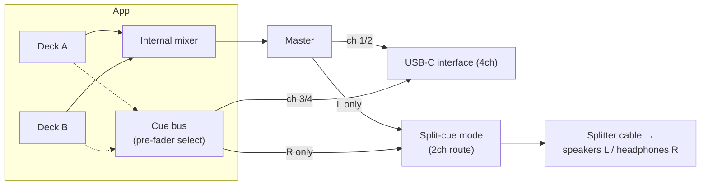

### 44.2a Cue monitoring — the mobile problem, and the answer

**This is the single most important hardware section in this specification**, because it is the
one thing a DJ cannot work without and the one thing a phone does not natively provide.

Pre-listening ("cueing") requires two independent stereo outputs: the master to the room, and the
cue bus to the headphones. A phone has one. The previous specification never had to think about
this because a Mac has a headphone jack *and* a USB interface.

Three supported modes, in order of quality:

| Mode | Requires | Quality | Notes |
|---|---|---|---|
| **1. True multichannel** | USB-C interface / controller with ≥ 4 output channels | Full — independent master and cue | The path serious users take. Channel roles assigned in §44.2. |
| **2. Split output** | A **$10 stereo-to-dual-mono splitter cable** and any stereo output | Good — mono master, mono cue | Master is summed to mono on the **left** channel, cue summed to mono on the **right**. The splitter feeds L to the speakers and R to the headphones. Works on *every* device, with no accessory beyond the cable. |
| **3. Cue-in-place** | Nothing | Poor, but real | No pre-listen; the cue button briefly solos the target deck to the single output. For practice only, and labelled as such. |

Mode 2 is the specified default for users without an interface, and it is why FR-HW-3 exists in
the form it does. Implementation is a pair of gain matrices applied at the master bus:

```swift
// Split-cue output matrix. Master → L, Cue → R, each summed to mono.
// Applied as a 2-in/2-out matrix on the output mixer, updated only on mode change.
outL = 0.5 * (masterL + masterR)
outR = 0.5 * (cueL    + cueR)
```

Both are attenuated 6 dB so a summed mono signal cannot clip a channel that was fine in stereo.

The cost is honest and must be stated in the UI: **your master is mono while split cue is on.**
For headphone-cueing in a bedroom or feeding a single PA, this is a non-issue. For a stereo
system it is a real trade, and the user should reach for mode 1. The settings screen says exactly
this in one sentence, with the cable diagram, because §50.1 identifies unfamiliarity — not
technology — as the risk here.

### 44.3 MIDI: CoreMIDI plumbing

`HardwareService` (§10) owns CoreMIDI — **which exists on iOS in full**, and is the reason
FR-HW-1 survived the platform change intact. It discovers endpoints, opens inputs, timestamps
incoming events, and translates them into engine **intents** on the main actor (which then cross
the RT boundary as commands, §12). Outgoing MIDI (LED/jog feedback) is supported for controllers
that reflect state. MIDI I/O never runs on the audio thread; it feeds the same command channel
everything else uses.

Three transports, all `MIDIClientCreateWithBlock` clients, all identical downstream:

- **USB-C class-compliant** — the primary path. Plug in, endpoint appears.
- **Bluetooth LE MIDI** — via `CABTMIDICentralViewController`. Adds ~10 ms of control latency,
  which is acceptable for pads and faders and is *not* acceptable for a jog wheel; the UI says so
  when a BLE device is bound to a jog action.
- **Network MIDI (RTP)** — for an iPad on the same Wi-Fi as a laptop-based rig. Supported, not
  recommended for performance.

### 44.4 MIDI-learn and mapping model

Mappings are data, not code (§15's `controller_profile`/`midi_mapping`/`midi_binding`):

- **MIDI-learn:** the UI enters a capture mode, the user moves a control, `HardwareService` reports the next incoming message's identity (channel, type, number), and the app binds it to a chosen **action** (e.g., `deckB.stem.vocals.gain`, `crossfader`, `deckA.hotcue.1`) with a value transform (absolute/relative, range, curve).
- **Per-deck stem CC mappings** are just bindings whose target is a stem gain on a specific deck.
- Profiles are named and reusable; **bundled default profiles ship for the controllers that
  market themselves as phone-compatible** (DDJ-FLX2, DDJ-FLX4, DDJ-GRV6, DDJ-200, Hercules
  DJControl Mix, Reloop Mixon series). A user who buys the controller the box says works with a
  phone should not have to MIDI-learn 40 controls to find out that it does. Bindings persist and
  reload with the session.
- Mappings export as JSON to the Files app and import from it (FR-HW-2), so a community can share
  profiles without the app needing a server to host them.

```swift
struct MidiBinding: Codable {
    var input: MidiAddress        // channel, status, data1
    var action: EngineAction      // enum of bindable targets
    var transform: ValueTransform // absolute/relative, min/max, curve
}
enum EngineAction: Codable {      // illustrative subset
    case crossfader
    case channelFader(DeckID)
    case eq(DeckID, EQBand)
    case stemGain(DeckID, Stem)
    case hotCue(DeckID, Int)
    case loopToggle(DeckID)
    case sync(DeckID)
    case play(DeckID)
}
```

### 44.5 Latency and clocking for hardware

Control latency from a pad/knob follows the §34.1 budget (MIDI → intent → command → next
callback). For audio, the interface's own buffer adds to the round trip; the app displays the
**granted** figure from `AVAudioSession` (§34A.2), never a computed ideal. Bluetooth LE MIDI adds
its own ~10 ms and is reported separately, because a user debugging "why does this feel late"
needs to know which link is responsible.

There is no attempt to slave the audio clock to external MIDI clock in v1 (the app is the tempo
authority via its grids and sync, §32); syncing *to* external clock is a roadmap item (§50).

## 45. Security and privacy model

### 45.1 Principles

The DJ app inherits the ecosystem's stance: **no accounts, no telemetry, no ads, no third-party servers**; all data is local or in the **user's private iCloud**; open-source (GPL-3.0) (NFR-PRIV-\*, §2). There is nothing to log in to and nowhere for data to go except the user's own devices and iCloud.

### 45.2 Data at rest

- The library, analysis, embeddings, stems, and mixes live in the app's container on the user's Mac. Access to the user's music folders is via **security-scoped bookmarks** (`BookmarkVault`), so the app touches only what the user granted (§41.1).
- No secrets are stored (there is no API key, no account token); CloudKit uses the system iCloud identity, not app-held credentials.

### 45.3 Data in transit

- The only network egress is **CloudKit** to the user's **private** database (§38.7). There are no analytics endpoints, crash-reporting SDKs, or content servers. This is enforceable and audited the same way the existing repo enforces zero-telemetry (a CI registry test that fails the build if a networking symbol outside the sanctioned CloudKit path appears).

⟢ **Repo alignment.** The codebase already ships a **FreeTierRegistry/CI test** asserting no telemetry; the DJ target is added to that guard so the "no tracking" claim is continuously verified, not merely intended.

### 45.4 Permissions and least privilege

On iOS every one of these is a system prompt the user sees, so the list is also a promise about
how often the app interrupts someone. It asks for four things, three of them lazily, and only
ever immediately after the user asked for the feature that needs them.

| Permission | When requested | Why | If denied |
|---|---|---|---|
| **Files** (document picker / bookmarks) | First time the user adds a source | The library. There is no product without it. | The app offers the app-container and remote libraries instead. |
| **Microphone** | **Only** when talkover is explicitly enabled (§34A.1) | Talkover, nothing else. Recording taps the master bus, not an input. | Talkover is unavailable; everything else works. |
| **Bluetooth** | Only when the user opens BLE MIDI discovery | BLE MIDI controllers (§44.3) | USB-C MIDI and everything else works. |
| **Local network** | Only when the user opens Network MIDI, or connects a LAN remote library | RTP-MIDI, SMB/Jellyfin/Plex/Subsonic | Those providers are unavailable; the other six work. |

Never requested: Photos, Contacts, Location, Notifications (there is nothing to notify about that
the user did not just ask for), Tracking (there is no tracking), Apple Music library access
(catalogue tracks are DRM-protected and out of scope by §6).

- **iCloud:** used only if the user is signed in and enables sync; absence of iCloud never blocks
  anything (FR-SYNC-6).
- **StoreKit:** contacted only when the user opens the paywall or taps Restore. Entitlement is
  cached and honored offline forever (FR-STORE-2), so the App Store is never in the path of using
  something already bought.
- **On-demand resources:** the CLAP and Demucs downloads (§27.1a) hit Apple's CDN and no one
  else's, only after the user asks for the feature.

### 45.5 Threat model (brief)

The relevant risks for a local, single-user creative tool are **data loss** (mitigated by
immutable analysis, crash-safe recording §37.3, and optional iCloud copies of mixes) and
**privacy leakage** (mitigated by having no backend and no telemetry). There is no multi-tenant
surface, no server to breach, and no shared data. Supply-chain risk is limited by a small,
audited dependency set (GRDB, sqlite-vec, the Core ML models) pinned by version.

Two additions specific to this specification:

- **Search queries are user content and are treated as such** (NFR-PRIV-5). The CLAP text encoder
  runs on-device; a query string never leaves the process, is never logged, and is never
  persisted except where the user explicitly saved it as a smart crate or a playlist brief. This
  is worth stating loudly because it is the assumption everyone makes about a search box and
  almost no product honors.
- **Purchase state is not data we hold.** The entitlement is a StoreKit fact, cached locally in
  a file with no user identifier in it. There is no account, no receipt uploaded anywhere, no
  device fingerprint, and nothing that could identify a purchaser to us — because there is no
  "us" in the data path (FR-STORE-7).

## 46. Error handling, resilience, and watchdogs

### 46.1 Failure philosophy

Two rules govern every subsystem: **(1) never crash or glitch the audio thread**, and **(2) fail loud, not silent** — a missing model, a failed separation, or a corrupt cache must produce an explicit, recoverable state, never a quiet wrong result. This directly encodes a defect class J has hit before (a gitignored CLAP model silently falling back to a degenerate path); the architecture forbids silent fallback (§36.6, §45).

### 46.2 Layered resilience

- **Analysis (Part IV):** each job is isolated; a failure marks that track's `analysis_run` as failed with a reason and moves on (the batch never dies for one bad file). Re-analysis is idempotent (§17). Corrupt/undecodable inputs are quarantined with a clear state in the library (mockup `ipad/02-library.html`'s analysis column).
- **Search (Part IV):** if the vector index is missing/mismatched, semantic search reports **unavailable** and offers to (re)build, rather than returning empty-but-plausible results.
- **Engine (Part V):** the render path is defensive — a deck with no valid buffer renders silence, not garbage; a bad command is ignored at the boundary; the graph is only reconfigured off-thread (§34.4).
- **Recording (§37):** crash-safe via journaling and periodic flush; interrupted recordings are recovered on next launch.
- **Sync (Part VI):** resumable via `CKSyncEngine` state; network loss parks rather than fails; never bulk-deletes.

### 46.3 Real-time assertions (debug shim)

Because the cardinal sin is doing forbidden work on the audio thread, the codebase includes an **RT-assertion shim**: in DEBUG builds, a thread-local flag is set around the render callback, and wrappers around allocation/locking/logging **assert** if called while that flag is set. This catches accidental `malloc`, `os_unfair_lock`, or `print` on the audio thread during development, before it ever ships. In RELEASE the shim compiles out to nothing.

```swift
#if DEBUG
enum RTGuard {
    @TaskLocal static var inRenderContext = false
    static func assertRTSafe(_ what: @autoclosure () -> String) {
        assert(!inRenderContext, "RT-UNSAFE: \(what()) on audio thread")
    }
}
// render callback wraps its body in RTGuard.$inRenderContext.withValue(true) { … }
// allocation/lock/log helpers call RTGuard.assertRTSafe("malloc"/"lock"/"log")
#endif
```

(The exact mechanism is thread-local rather than task-local in the C render context; the shim is illustrative of intent — assert, don't ship a glitch.)

### 46.4 Watchdogs and health

- **Render watchdog:** monitors the render-load ratio (§34.3); sustained high load triggers the throttle-then-suggest-buffer policy (§43.7) and a UI hint, never a silent dropout.
- **Stall watchdog (per app, per project convention):** detects a stuck deck/stream (no progress when it should be playing) and recovers (reload/seek) with a surfaced state. ⟢ Consistent with J's "stall watchdog stays per-app in first phase" decision from the shared-engine work.
- **Sync watchdog:** surfaces stuck uploads/downloads with retry, rather than a spinner forever.

### 46.5 User-visible error surfaces

Errors map to concrete UI: failed analysis shows in the library's analysis column with a reason on hover and a "retry"; unavailable search offers "rebuild index"; a failed separation disables stems for that deck with an explanation; a sync problem shows on the mix (mockup `ipad/10-mixes.html`) with retry. The user is never left guessing, and no error takes down audio.

## 47. Testing strategy and acceptance criteria

### 47.1 The pure/shell split makes testing tractable

The architecture deliberately concentrates the tricky logic in **pure functions** (DSP kernels, beat/phase math, Camelot mapping, scoring, record mapping, merge policy) that are deterministic and unit-testable off any device, and keeps the **impure shell** (audio callback, CoreMIDI, CloudKit networking, file I/O) thin. This is the same testability posture as the existing repo's `RecordMapping`/`SyncMerge`/`SyncGating` split (§38.3).

### 47.2 Test tiers

- **Unit (pure):** DSP correctness against synthetic signals (a known-BPM click track yields the right tempo/grid; a pure tone yields the right chroma/key; a ramp yields the right loudness); scoring/ranking math; Camelot compatibility; record mapping round-trips; sync merge conflict outcomes.
- **Golden-file (analysis):** a small corpus of fixture tracks with **checked-in expected analysis** (BPM, key, downbeats, phrase boundaries within tolerance) so pipeline changes are caught as diffs; embedding-version bumps regenerate goldens deliberately.
- **Engine (integration, deterministic):** drive the engine with an **offline render** (no hardware) and scripted commands; assert sample-accurate behavior — a scheduled cue lands on the exact frame, a loop wraps seamlessly, sync aligns phase — by rendering to a buffer and inspecting it. The RT-assertion shim (§46.3) runs in these tests to catch RT-unsafe code.
- **Sync (integration):** against the CloudKit test/local environment, assert upload→download round-trips of a mix and its asset, deletion propagation, and resumability.
- **UI (smoke/snapshot):** view models exercised with fake services; key screens snapshot-tested for regressions.

### 47.3 Acceptance tests (traceable to requirements)

Each functional-requirement family has explicit acceptance tests referenced throughout the document:

| Test ID | Requirement | Passes when |
|---|---|---|
| **AT-ING-\*** | FR-LIB, FR-ANL | Importing a folder analyzes all tracks through stages 1–2; failures are isolated and reported; re-analysis is idempotent; library health reflects true counts (`ipad/02`, `ipad/03`). |
| **AT-SEARCH-\*** | FR-SEM | A natural-language query returns ranked results under the latency target; +/− refine alters results correctly; a query saves as a smart crate that re-evaluates; **AT-SEARCH-5** asserts Tier A and Tier B return identical orderings on the same fixture (§16.5); **AT-SEM-6** passes the whole suite with every ODR absent (§27.1a). |
| **AT-PLIST-\*** | FR-PLIST | Seven gates in §28A.7, including duration ±5%, ≤ 3 s generation, ≥ 40% lower transition cost than shuffle over the same track set, determinism under a fixed seed, and a blind preference test (`ipad/05a`, `ipad/05b`). |
| **AT-GRID-\*** | FR-PREP | Analyzed grids match golden BPM/downbeats within tolerance; manual `grid_correction` overrides without mutating immutable analysis and persists (`ipad/06`, §23.3). |
| **AT-ENGINE-\*** (incl. **AT-ENGINE-SYNC-\***) | FR-ENG | Offline-rendered output shows sample-accurate cues/loops, correct time-stretch with key-lock, and phase-aligned sync; render-load stays within budget; no RT-unsafe calls (`ipad/07`, §30–34). |
| **AT-TWIN-\*** | FR-ENG-10, FR-ENG-11, FR-ENG-12, NFR-A11Y-6 | **AT-TWIN-1** rotating to landscape mid-playback changes no engine state — both decks continue, sample-accurate; **AT-TWIN-2** with a bank drawer open the crossfader, both waveforms, the beat-phase meter and the opposite jog remain hit-testable; **AT-TWIN-3** releasing a held bank tab restores the jog within one frame and a pinned bank dismisses after 12 s idle; **AT-TWIN-4** no jog code executes on the render thread under the §46.3 shim (`iphone/05c`, `iphone/05d`, `ipad/07b`). |
| **AT-WAVE-\*** *(new — M5)* | FR-WAVE | **AT-WAVE-1** analysis persists a beat grid with real `firstBeatSample`/`beatCount`, downbeat rows, phrase rows and a band-split pyramid — a re-read after analysis returns all four (§19.4); **AT-WAVE-2** the render model's colour split for a synthesised bass-only / mid-only / treble-only signal puts the energy in the expected band; **AT-WAVE-3** beat-grid positions composed with a `grid_correction` match what the engine quantises to, sample for sample; **AT-WAVE-4** the phrase ribbon's spans and bar lengths equal the persisted `phrase` rows, and a low-confidence span is marked, not hidden; **AT-WAVE-5** an unanalysed track renders the honest empty state and never synthetic geometry; **AT-WAVE-6** cue and loop markers land on their sample positions at every zoom level; **AT-WAVE-7** the renderer selects the coarsest pyramid level ≤ 1 px/bin and steps one level coarser at `.serious` (§26A.7). |
| **AT-TRANS-1..5** *(new — M5)* | FR-TRANS, §35B | Each of the five beginner transitions is driven as a scripted command sequence against the **offline render** and asserted in the output buffer: **1 Bass Swap** — killing LOW removes the low band from that channel and the other channel's low is unaffected; **2 Filter Transition** — a full high-pass sweep on the outgoing leaves the incoming spectrum unchanged, and both filters at centre are bit-exact bypass; **3 Echo Out** — with the echo enabled and the channel fader taken to zero, the master bus **still contains a decaying tail** at the beat-synced interval, and the tail decays monotonically to silence (§35A.2); **4 Fader Cut** — a sharp-curve crossfader cut on a downbeat produces a sample-accurate transition with no zipper artefact; **5 Blend** — a simultaneous two-deck blend stays inside the limiter ceiling. Each also runs as a **layout assertion** on both surfaces: every control the transition needs is present, ≥ 44 pt, and not occluded (§41.9b, §42.7c). |
| **AT-GENRE-\*** *(new — M5)* | FR-LIB-9, FR-LIB-10, §18A | A genre subscribes as its own `Source` with popularity-descending order; sub-genres are distinct libraries; **browsing and playback work with no account** and the optional-credentials path changes nothing about availability; a cached genre track analyses and loads to a deck through the ordinary path; a partially cached track is never deck-ready (FR-LIB-8); licence and attribution survive to the library row, the finish screen and the cue-sheet (§18A.5); a network failure reports itself rather than presenting an empty library (§18A.6); the connector appears in the free-tier registry (AT-FREE-\*). |
| **AT-SESS-\*** | FR-SESS | Seven gates in §34A.7: route loss pauses rather than blasting the speaker, a phone call mid-recording costs at most one segment, media-services reset recovers in 300 ms, displayed latency equals granted latency on every route. |
| **AT-THERM-\*** | NFR-THERM | A 90-minute two-deck session with prepared stems on battery at 50% brightness never reaches `.critical`, never drops a buffer, and sheds lanes in exactly the §43.7 order. **This is a shipping gate for M4.** |
| **AT-MEM-\*** | NFR-REL-4 | The same session never crosses the §43.5 footprint ceiling and the app is never terminated by the watchdog. |
| **AT-STEM-\*** | FR-ENG-3, FR-ANL-9 | Gig-crate separation respects the storage budget, evicts LRU by `lastPerformedAt`, shows what will be evicted before evicting it, and never evicts stems for a loaded deck. |
| **AT-REC-\*** | FR-REC | A recorded set matches the master bus; periodic flush yields a playable file after simulated crash; the event timeline/tracklist is captured; a finished mix plays in the free player with Pro disabled (FR-REC-5) (`ipad/09`, `ipad/10`, §37). |
| **AT-SYNC-\*** | FR-SYNC | Cues and playlists converge across two devices; cue merge (not LWW) preserves both devices' additions (§38.4); **AT-SYNC-0** runs every journey suite with sync disabled and no iCloud account. |
| **AT-STORE-\*** | FR-STORE | Purchase unlocks decks with no relaunch (**AT-STORE-2**); entitlement survives airplane mode indefinitely; restore works on a fresh device; **AT-STORE-4** covers every row of the Founders-grant decision table (Appendix T.4); no paywall appears unprompted after dismissal. |
| **AT-FREE-\*** | FR-FREE, §2.4 | Every capability in the free-tier registry works with `isPro == false` — including all ten remote-library providers, semantic search and auto-playlists. Failing this fails the build (§47.4). |
| **AT-MIDI-\*** | FR-HW | MIDI-learn binds a captured control to an action over USB-C, BLE and Network MIDI; per-deck stem CC mappings drive the right gains; multichannel routing sends audio to the mapped physical channels; **split-cue mode produces master-on-L and cue-on-R with correct 6 dB attenuation** (§44.2a) (`ipad/11`, §44). |
| **AT-WATCH-\*** | FR-HW-5 | Three gates in §39A.3: killing the Watch app changes nothing audible, a timed-out message degrades to "not connected", and stopping from the wrist produces a byte-identical file. |

### 47.4 Continuous enforcement (CI gates)

Beyond correctness tests, CI enforces **product invariants** as grep/registry gates — the same enforcement mechanism J uses across projects:

- **Zero-telemetry gate:** fails the build if a networking symbol outside the sanctioned CloudKit path is introduced in the DJ target (§45.3).
- **RT-safety gate:** the engine integration tests run with the DEBUG RT-assertion shim; any RT-unsafe call fails CI (§46.3).
- **Schema/immutability gate:** analysis-mutating writes must go through the versioned pipeline; a gate flags direct writes to immutable analysis tables outside a migration/version bump (§17).
- **Determinism gate:** golden-file analysis diffs must be intentional (an embedding/analysis version bump), not accidental.

This makes the document's promises — private, deterministic, real-time-safe — **continuously verified properties** of the codebase rather than aspirations, closing the loop between architecture and enforcement.


# Part IX — Delivery

## 48. Implementation roadmap and milestones

The previous specification's roadmap built the whole product and shipped once. This one does
not, because the tier split creates something the Mac plan could not have: **three shippable
releases before the paid feature exists.**

The free tier — remote libraries for everyone, semantic search, auto-playlists — is
independently valuable, independently marketable, and is the audience that Pro converts from.
Building it first means the DJ engine launches to users who already have an analyzed library and
a reason to care, rather than to an empty App Store listing.

```mermaid
flowchart LR
    M0["M0 Foundations<br/>schema · entitlement · free-tier flip"] --> M1["M1 Analysis 1–2<br/>+ thermal governor"]
    M1 --> M2["M2 Semantic<br/>CLAP ODR · vectors · search"]
    M2 --> M3["M3 Auto-playlists<br/>sequencer · arcs"]
    M3 --> M4["M4 Engine<br/>2 decks · sync · StoreKit"]
    M4 --> M5["M5 Waveforms · club ergonomics<br/>genre libraries · stems · recording"]
    M5 --> M6["M6 Hardware · cue<br/>Watch · polish"]
    M2 -.->|"ship: 2.0 free"| R1((App Store))
    M3 -.->|"ship: 2.1 free"| R1
    M4 -.->|"ship: 3.0 — Pro launch"| R1
    M6 -.->|"ship: 3.1"| R1

    style M4 fill:#1c1633,stroke:#7c5cff
    style R1 fill:#12211a,stroke:#42dc88
```

### 48.1 M0 — Foundations, entitlement, and the free-tier flip

The milestone that makes a promise before it builds a feature.

- `dj_v2` database, migrations, analysis versioning (§13–17).
- GRDB records and repositories for the new domains (§18).
- **Retire `ProFeature.remoteLibraries`**: all ten providers become free, the case is removed,
  and `Tests/FreeTierRegistryTests.swift` gains remote libraries to its guarded set (Appendix
  T.5). This ships on its own, immediately, as a free update — it costs nothing to give away
  early and it is the most goodwill per line of diff available anywhere in this plan.
- `EntitlementStore` with the new `djPerformance` non-consumable, StoreKit 2 verification,
  offline caching, and the **Founders grant** (Appendix T.4).
- README rewrite to the §2.4 line.
- **Clear the go-live defect register (Part X).** D-9 (archive.org `-1002`), D-10 (Subsonic adds
  but does not play) and D-13 (Jellyfin empty password) are **blocking**: this milestone's whole
  proposition is *"every remote provider is now free for everyone"*, and shipping that headline
  over providers that do not work converts the plan's largest goodwill move into its largest
  embarrassment. The Now Playing and Playlists defects (D-1…D-8) ship in the same update.
- **Exit:** remote libraries free in production; entitlement plumbing under test with no Pro
  feature behind it yet; **the Part X register green, verified by `make test-ui-regression`**
  (§53.2) — which is run by hand for this gate and is not, and does not become, a CI job.

### 48.2 M1 — Analysis stages 1–2 and the thermal governor

- Decode substrate, `PCMBuffer`, loudness/dynamic range (§19–20).
- vDSP STFT, spectral features, onset, tempo, beat grid, downbeats, key, phrases, waveform
  pyramid (§21–26).
- **The thermal and power governor** (§43.7, FR-ANL-7/8) — built here, not retrofitted, because
  everything after this milestone depends on it and because on a phone it is not an
  optimization, it is a correctness property.
- Analysis UI as a visible activity (§41.3).
- **Exit:** a 4,000-track library analyzes to stage 1 overnight on a charger without the device
  becoming unpleasant to hold. Golden-file regression green (Appendix R.2). NFR-DET-3 verified
  against the Mac spec's fixtures.

### 48.3 M2 — Semantic layer → **first free release**

- CLAP Core ML conversion and **on-demand-resource packaging** (§27.1a, FR-SEM-6).
- Embedding pipeline, pooling, int8 quantization (§27.4).
- The tiered vector store: static-linked `sqlite-vec` and the vDSP brute-force path, with the
  switch at ~30k tracks (§16.1).
- Hybrid ranking (§28), search UI (§41.4–41.5, §42.3), smart crates.
- **Exit:** FR-SEM-3 met (≤ 120 ms at 30k tracks on A17), coverage-honest results, and the whole
  thing works in airplane mode once the model is downloaded. **Ship it.**

### 48.4 M3 — Auto-playlists → **second free release**

- The sequencer (§28A): transition cost, arc adherence, beam search, spacing constraints.
- Brief parsing, arc presets and drawn arcs, constraint toggles.
- Generated-playlist UI with lock/reject/regenerate (§41.6–41.7, §42.4).
- `AutoPlaylistBrief` persistence and sync (§38.2).
- **Exit:** FR-PLIST-2 (±5% duration) and FR-PLIST-8 (≤ 3 s) met; a blind listening check where
  the generated sequence beats shuffle on the same track set. **Ship it.**

### 48.5 M4 — Real-time engine → **Pro launch**

- AVAudioEngine graph, master clock, sample-accurate scheduler (§29–30).
- **§34A audio session** — categories, buffer negotiation, route changes, interruptions. This is
  the highest-risk work in the entire plan and it is deliberately in the same milestone as the
  engine so its failures surface immediately rather than in beta.
- Time-stretch/key lock, beat sync, cues, loops, quantized triggering (§31–33).
- Deck and mixer architecture, EQ, filter, crossfader, limiter (§35).
- iPad workspace (§41.9), its jog module (§41.9a), and both iPhone postures — solo deck
  (§42.6–42.7) and twin deck (§42.7a–42.7b) — over one shared `WorkspaceModel`.
- Paywall (§41.15–41.16, §42.10) and the purchase flow.
- **Exit:** AT-ENGINE-\* green, a 60-minute two-deck session inside NFR-THERM-1, and a purchase
  that unlocks the decks without a relaunch (AT-STORE-2). **Ship 3.0.**

### 48.6 M5 — **The milestone where it becomes a DJ app**

M5 was scoped as "stems, recording, gig crates" — three subsystems. It is re-scoped here as an
**outcome**, because the subsystems were on track to land without the product being usable: after
M4 the engine is complete and correct, and yet no track can reach a deck, no waveform shows real
audio, and nothing in the shipping app opens a performance surface at all.

**The milestone is complete when the owner can perform this end to end, on a device, without
developer assistance:**

> Open the app → pick a genre (say **electronic → techno**) → get a library of current, legally
> usable tracks ordered by interest → build a Deck A playlist and a Deck B playlist → open the
> workspace → mix, using all five beginner transitions (Bass Swap, Filter, Echo Out, Fader Cut,
> Blend) with the controls where a club-trained hand expects them → record a 20-minute set →
> **listen to it immediately, in the app** → share it with a friend as a file that plays.

Everything below serves that sentence.

**Delivered:**

- **The unblockers M4 left behind** — an app-side entry point into the DJ surfaces, and the
  library → decode → deck load seam. Without these the narrative cannot start (§49.3a).
- **Analysis persistence** (§19.4) — beat grid, downbeats, phrases and the band-split waveform
  pyramid actually written, closing the gap that made every waveform placeholder geometry.
- **Rekordbox-class waveform display** (§26A) — frequency-coloured, beat-gridded, phrase-ribboned,
  overview + scrolling detail on a shared playhead (FR-WAVE-1..7).
- **Club-standard control ergonomics** (§41.9b, §42.7c) — per-channel TRIM→HI→MID→LOW→FILTER
  strips over vertical channel faders, bottom-centre crossfader, CUE left of PLAY, eight
  performance pads, tempo fader on the outer edge (FR-TRANS-1/2).
- **Beat FX: the post-fader beat-synced echo** (§35A) — the one piece of new DSP, and the only
  thing standing between the M4 engine and all five transitions (FR-TRANS-4).
- **Genre libraries** (§18A) — practice material with no account and no pre-existing collection
  (FR-LIB-9/10), plus the first-run genre picker (§41.1a).
- **Stems, recording, gig crates** — the original M5 scope, unchanged in substance: separation +
  cache (§36), stem voices on decks (§35.1), gig crates (§41.17), the record tap → segmented M4A
  → crash-recovery journal (§37), and **the review listen** (FR-REC-6, §41.11).
- **The transition coach** (§41.18, FR-TRANS-6) — free, teaching, never performing.

**Exit:**

1. **AT-STEM-\*** and **AT-REC-\*** green; a recording survives a forced termination with at most
   the final segment lost (NFR-REL-2).
2. **AT-WAVE-\*** green — the waveform renders from persisted analysis, not placeholders.
3. **AT-TRANS-1..5** green — each of the five transitions asserted in the offline render *and*
   as a layout assertion on both the tablet and compact surfaces.
4. **AT-GENRE-\*** green — a genre subscribes, caches, analyses and reaches a deck, with no account.
5. **The narrative above, performed on a device by the owner** — one 20-minute recorded set using
   all five transitions, played back in-app, exported and played on a second device. This is a
   **user-owned shipping gate**, run in the post-M5 device pass alongside M4's deferred
   AT-THERM-1 and AT-MEM-1. It is the gate that matters; the other four are how we know it will
   pass.

**Ships?** No — M5 remains an internal milestone. But it is the first build where the product's
own thesis is testable, and the §50.3 device assumptions are validated against **this** layout,
not M4's.

### 48.7 M6 — Hardware, cue, Watch, polish

- CoreMIDI, MIDI-learn, mappings, bundled presets (§44.3–44.4).
- USB-C audio device enumeration, channel routing, and **split-cue output** (FR-HW-3).
- The Watch performance remote (§39A).
- Accessibility pass, keyboard shortcuts, localization, Liquid Glass.
- **Exit:** AT-MIDI-\*, AT-WATCH-\* green; split cue verified on a $10 splitter with a real pair
  of headphones, because that is how most users will actually cue.

### 48.8 Milestone summary

| Milestone | Theme | Ships? | Gate |
|---|---|---|---|
| M0 | Foundations, entitlement, free-tier flip | ✅ free update | Remote libraries free in production |
| M1 | Analysis 1–2, thermal governor | — | Golden files, NFR-DET-3 |
| M2 | Semantic search | ✅ **2.0 free** | FR-SEM-3 |
| M3 | Auto-playlists | ✅ **2.1 free** | FR-PLIST-2/8 |
| M4 | Engine + StoreKit | ✅ **3.0 Pro launch** | AT-ENGINE-\*, NFR-THERM-1 |
| **M5** | **Waveforms, club ergonomics, genre libraries, stems, recording** | — | AT-STEM-\*, AT-REC-\*, **AT-WAVE-\***, **AT-TRANS-1..5**, **AT-GENRE-\***, + the owner's end-to-end set |
| M6 | Hardware, cue, Watch, polish | ✅ **3.1** | AT-MIDI-\*, AT-WATCH-\* |

## 49. Coding-agent execution guide

This section tells an agentic coding tool how to build from this document in J's established
plan-first workflow: committed markdown plans, small reviewable commits, CI gates as the enforcement
mechanism.

### 49.1 Working agreement

- One commit per numbered subsection or per acceptance-test cluster, never one per milestone.
- Every commit message states which FR/NFR IDs it advances and which acceptance tests it makes green.
- Pure logic lands with unit tests in the same commit. Shell/IO lands with an integration test or an
  explicit note saying why it cannot have one.
- No commit may add a network call. A change that appears to need one is a design bug; escalate rather
  than adding it (NFR-PRIV-1).

### 49.2 Order of implementation (per milestone)

1. Schema and migrations first — everything else binds to them.
2. Pure algorithms with golden-file tests, no UI.
3. Façade and actor plumbing (§10, §11).
4. View models with a fake façade.
5. Views last, against the mockup.

### 49.3 Non-negotiable invariants for the agent

1. **Nothing allocates, locks, or does I/O in the render callback.** The debug assertion shim
   (§46.3) is not optional and does not get disabled to make a test pass.
2. **No Swift `Hasher` for identity.** SHA-256 via `CacheKeyGenerator` (NFR-DET-2).
3. **No feature may be gated on network, account, or iCloud.**
4. **No telemetry.** The existing CI guard fails the build; do not weaken it.
5. **Nothing in the free-tier registry may be re-gated.** Adding a Pro gate to a listed
   capability fails `FreeTierRegistryTests` and that failure is correct.
6. **No `#if os(...)` around DJ core modules.** Platform conditionals belong in the presentation
   layer and §34A only.
7. **Analysis output must stay deterministic and cross-silicon-identical** (NFR-DET-3). No
   fast-math, no reassociation, no parallel reduction with nondeterministic ordering.
8. **The thermal governor is never bypassed** to make a benchmark look better.
9. *(new — M5)* **A computed artifact with a destination table gets written.** Returning a count
   or a level number in place of the data is the analysis-layer form of a silent fallback (§19.4,
   §46.2), and it is how every waveform in the product came to be placeholder geometry.
10. *(new — M5)* **A control that a specified transition requires may not live behind a mode.**
    §35B's five are performable from the default surface or the layout is wrong (FR-TRANS-1).

### 49.3a Reachability — the invariant M4 violated (new — M5)

Through M4 the entire DJ feature set compiled, linked into the app binary, and passed 1,183 tests
while being **unreachable from the running app**: no view outside `Sources/DJ/` referenced any
performance surface, and `WorkspaceModel` held no reference to the library. The engine was
correct and the product was not usable.

Two standing checks follow, and they apply to every milestone from here:

1. **A feature is not done until it is reachable.** Every user-facing surface a milestone
   delivers must have a navigable path from the app's root, exercised by a test or a UI regression
   lane. "It compiles and its unit tests pass" is not delivery.
2. **A feature is not done until real data flows through it.** A surface fed only by fakes and
   placeholder geometry has not been integrated; the seam that carries real data is part of the
   feature, not a follow-up.

Both are M5 commit-1 work precisely because they are cheap to fix and expensive to keep deferring.

### 49.4 Definition of done (per commit)

Tests green · acceptance IDs advanced and named · no new dependency without an Appendix Q entry ·
no new network host · mockup coverage contract (§40.6) still satisfied · CHANGELOG entry naming
the tier the change lands in.

## 50. Risks and open questions

### 50.1 Technical risks

| Risk | Impact | Mitigation |
|---|---|---|
| **Thermal ceiling during a long set** — the risk that has no macOS analogue and the one most likely to cause a bad review | A 90-minute set throttles and drops audio | Prepared stems over on-demand (§36.5); everything else sheds first (§43.7); ProMotion pump throttled; Liquid Glass disabled during separation; **NFR-THERM-1 is a shipping gate for M4, not a stretch goal** |
| **`AVAudioSession` interruption during a recording** | Corrupted or lost set | Segmented flush (§37.2); interruption state machine (§34A.4); AT-REC crash/interrupt matrix |
| **Split cue is unfamiliar to users** | Support burden; "how do I pre-listen" | First-class UI with a cable diagram (§41.13, §42.8), not a settings row; bundled explanation on first performance |
| **CLAP model download fails or is evicted by the system** | Search silently broken | ODR with explicit state; app fully functional without it (FR-SEM-6); re-download surfaced in §41.3 |
| **`sqlite-vec` static linking against system SQLite on iOS** | Vector search unavailable | Vendored static C target + `sqlite3_auto_extension` (§16.3); the **vDSP brute-force path is a complete fallback**, not a degraded one, up to ~30k tracks |
| **Time-stretch quality** at wide tempo pulls via `AVAudioUnitTimePitch` | Audible artifacts beyond ±8% | Constrain UI warnings; key-lock tuned for music (§31.2) |
| **On-demand stem separation latency** on A-series | DJ waits mid-set | Prefer gig-crate caching; "stems when ready" plays full mix immediately (§36.5) |
| **iOS memory watchdog kills a performance** | Set ends | Hard performance-time memory ceiling (§43.5, NFR-REL-4); stem paging; no full-file buffers |
| **Founders-grant edge cases** (family sharing, refunds, restore on a new device) | Someone who paid is asked to pay again | Appendix T.4 decision table; err toward granting; AT-STORE-4 covers each row |

### 50.2 Product / scope questions (open)

- **Should the 10-minute trial session exist at all?** FR-STORE-6 permits it once. It may convert
  well or it may cheapen the "complete free product" message. Decide with a real cohort at M4,
  and be willing to remove it.
- ~~**iPhone two-deck in landscape?**~~ **Resolved.** Both postures ship: portrait is the solo
  deck (§42.6–42.7), landscape is the twin deck with a jog per side (§42.7a–42.7b), and
  orientation is the only switch between them. The earlier worry — that shipping both means
  neither gets designed properly — is answered by their sharing one view model and one engine
  contract, so there is one design with two layouts rather than two designs. What remains open is
  a *measurement*, not a decision: whether a 28 mm platter with haptics can hold a beat (§50.3).
  If it cannot, the iPhone jog becomes a nudge control and vinyl mode is iPad-only.
- **Four decks, MIDI clock, DVS, effects beyond EQ/filter?** All post-v1, unchanged from the
  previous spec's position.
- **A Mac build later?** Architecturally open by construction (§2, invariant 49.3.6). It would be
  the *same purchase*. It is not v1.0 and it is not v1.1.
- **Should auto-playlists be able to write a crossfade plan** (not perform it — just annotate
  where transitions should happen) **for free users?** It would be a genuinely novel free
  feature and a strong Pro tease. Deferred to post-M3.

### 50.3 Assumptions to validate early

- That an A17-class device sustains a two-deck performance with four prepared stems inside
  NFR-THERM-1 — **validate in M4 on real hardware, on battery, at 50% brightness, for 90
  minutes**. This is the assumption that, if false, changes the product.
- That int8-quantized track-level CLAP vectors retain enough ranking quality for FR-SEM-2 —
  validate in M2 against f32 ground truth with a recall@10 target (§16.6).
- That the vDSP brute-force scan holds under 120 ms at 30k tracks — validate in M2 before
  committing to the `sqlite-vec` integration at all; if brute force is fast enough at the sizes
  real users have, the ANN index may be deferrable indefinitely.
- That `AVAudioUnitTimePitch` key-lock quality is acceptable in the beatmatching range on
  A-series — validate in M4 with real material.
- That users understand split cue with one diagram — validate in M6 with five people who have
  never DJ'd.
- That the landscape `safeAreaInsets` on a Dynamic Island phone are what §42.7a assumes — the
  59 pt dead band on both edges is derived, not measured. **Validate in M4 on the first
  TestFlight build, before the twin-deck layout is fixed.**
- That the fine-control thumb arc is ≈ 185 pt (§42.1). If it is materially smaller on a real
  grip, the jog moves outward and shrinks before anything else in the layout changes.
- That a 28 mm platter with haptic detents is enough to hold a beat against the phase ghost
  (§40.7). **If it is not, the iPhone jog is a nudge control and vinyl mode is iPad-only** —
  an acceptable outcome, to be decided by measurement rather than argument.
- That `.defersSystemGestures(on: .bottom)` genuinely prevents an accidental home swipe during a
  crossfader drag — validate in M4; there is no recovery from backgrounding mid-set.
- That two jogs rendering at display rate stay inside the §43.3 GPU budget — measure on the
  thermal-floor device with Liquid Glass already forced off by an active separation (§42A), which
  is the worst case and the one a benchmark on an idle device will miss.

**New in M5:**

- That **two frequency-coloured detail waveforms plus two jogs** at display rate stay inside the
  §43.3 budget — a harder case than the jog-only measurement above, and the one that decides
  whether §26A.7's degradation ladder is enough. Validate in M5 on the thermal-floor device.
- That the **channel-strip layout (§41.9b) actually transfers** — validate in M5 with three
  people who mix on a two-channel club controller, by asking them to perform the five transitions
  with no instruction. If they hunt for a control, that control is in the wrong place. This is a
  measurement, not an argument, and it is why the layout lands before the device pass rather than
  after it.
- That the **Jamendo catalogue is deep enough per sub-genre** to build two usable deck playlists —
  validate in M5 against the real API for the three genres the owner would actually practise
  with. If a sub-genre returns a thin or stale list, the genre picker should not offer it.
- That the **owner's `client_id` registration** and the catalogue's terms permit the shipped usage
  pattern at the volumes a real user generates. User-owned, and a precondition of shipping §18A.
- That **`grid_correction` composed at render time is fast enough** to redraw the grid at
  performance zoom without a frame hitch on a track with many corrections (§26A.3).
- **Deferred, recorded rather than dropped:** MP3 export via a vendored encoder (§37.6) — an M6
  candidate contingent on an LGPL review. Revisit only if real users ask for `.mp3` specifically
  rather than "a file I can send someone".

---
---

# Part X — Go-Live Defects and the UI Regression Suite

Parts I–IX describe what Platterhead is becoming. This part describes what is
**wrong with it now**, and the standing harness that keeps those things fixed.

Everything here is a defect in the *shipping player* — Now Playing, Playlists,
remote libraries — not in the DJ work. It is in this document rather than a
separate one because it gates the same release train: **M0 makes remote libraries
free for everyone** (§48.1), and shipping "every provider is now free" while
archive.org returns `-1002` and Subsonic plays nothing converts the plan's largest
goodwill move into its largest embarrassment. The defect register is therefore an
**M0 exit gate**, not a backlog.

## 51. The defect register

Seventeen defects, `D-1` … `D-17`, each traceable to the report that raised it.
Requirement IDs in the `FR-FIX-*` family are assigned per defect so Appendix L can
carry them like any other requirement.

**Diagnosis confidence is stated explicitly.** Some root causes below were read
directly out of the code and are certain; others are reported symptoms that have
not yet been reproduced. The register never blurs the two, because a confident
wrong diagnosis costs more than an honest unknown.

### 51.1 Report-to-defect map

The original report numbered its items 1–14 with two numbers used twice. This is
the mapping, so nothing is silently dropped.

| Report item | Defect | Area |
|---|---|---|
| 1 — Now Playing too wide | **D-1** | Now Playing |
| 2 — "Tap to change" covers artwork | **D-2** | Now Playing |
| 3 — Watch icon should download to Watch | **D-3** | Now Playing |
| 4 — Add to Playlist missing | **D-4** | Now Playing |
| 5 (first) — Download missing | **D-5** | Now Playing |
| 5 (second) / 6 — overflow menu, ranked by use | **D-6** | Now Playing |
| 6 — duplicate local-folder playlists | **D-7** | Playlists |
| 7 — playlist detail toolbar order | **D-8** | Playlists |
| 8 — archive.org lists/collections fail `-1002` | **D-9** | Remote |
| 9 — Subsonic adds but does not play | **D-10** | Remote |
| 10 — WebDAV needs a local test server | **D-11** | Remote |
| 11 — SMB needs a test server | **D-12** | Remote |
| 12 — Jellyfin demo, empty password | **D-13** | Remote |
| 13 — Plex needs a local server | **D-14** | Remote |
| 14 (first) — archive.org "The Vapor Vault" | **D-15** | Remote |
| 14 (second) — archive.org private list + credentials | **D-16** | Remote |
| 14 (second, cont.) — Dropbox, Google Drive, OneDrive, pCloud | **D-17** | Remote |

### 51.2 Now Playing

> **D-1 · The Now Playing toolbar overflows the screen** — `FR-FIX-1`
> **Root cause: diagnosed, certain.** `NowPlayingView.toolbar` is an `HStack` of
> nine controls with hard `.frame(width: 36, height: 36)` and `spacing: 12`. Its
> intrinsic width is `9×36 + 8×12 = 420 pt`. The screen offers `393 − 2×24 = 345 pt`.
> A hard frame cannot compress, so the row exceeds its bounds by 75 pt and the
> controls at the ends are pushed out of reach. **This reads as "missing margin"
> but the margin is present** (`.padding(.horizontal, 24)`); the row is simply
> wider than the space.
>
> **D-1 subsumes D-3 and D-5** (below): those controls exist in code and are
> hypothesised to be the ones pushed out. *Verify on device before fixing* — if
> they are hittable and merely clipped, the fix is the same, but the report of
> "missing" would have a second cause worth knowing about.
>
> Secondary finding: 36 pt controls are below the 44 pt minimum hit target that
> NFR-A11Y-3 requires of performance controls and that Apple documents for touch
> targets generally. The fix must not preserve 36 pt.

> **D-2 · "Tap to Change" covers the artwork** — `FR-FIX-2`
> **Root cause: diagnosed, certain.** `artworkOverlay` draws a persistent capsule
> over the bottom-right of the image whenever custom artwork exists, and
> `.onTapGesture` on the whole artwork opens the photo picker. Both go. A
> `.contextMenu` offering *Change Artwork* / *Remove Artwork* **already exists** on
> the same view; the fix promotes those two actions into the Now Playing overflow
> menu (§52.2) and deletes the overlay and the whole-image tap. Artwork then
> displays artwork.

> **D-3 · The Watch control does not perform "Download to Watch"** — `FR-FIX-3`
> **Root cause: partially diagnosed.** `watchButton(for:)` is present and calls
> `appState.downloadToWatch(rows:)` on tap, so the action is wired. The likely
> explanation is D-1 (the control is off-screen or unhittable). **Reproduce before
> concluding.** If the button is reachable and still does nothing, this is a
> separate defect in the transfer path and must be re-filed with that finding.

> **D-4 · Add to Playlist is absent from Now Playing** — `FR-FIX-4`
> **Root cause: diagnosed, certain.** There is no add-to-playlist affordance in
> `NowPlayingView` at all — not in the toolbar, not in a menu. This is a missing
> feature rather than a layout casualty. It becomes a primary control (§52.2).

> **D-5 · Download is absent from Now Playing** — `FR-FIX-5`
> **Root cause: partially diagnosed.** As D-3: `phoneDownloadButton(for:)` exists
> and is wired to `appState.download(rows:)`. Same hypothesis, same instruction to
> reproduce first.

> **D-6 · There is no overflow menu, so everything competes for the same row** —
> `FR-FIX-6`. The structural defect behind D-1. Resolved by §52.

### 51.3 Playlists

> **D-7 · Local folder playlists appear more than once** — `FR-FIX-7`
> **Root cause: diagnosed, certain.** `LibraryStore.folderPlaylist(matchingSourceId:)`
> finds a folder's playlist by **title equality** with the source's title:
> ```swift
> Playlist.filter(Column("title") == source.title
>                 && Column("kind") == PlaylistKind.folder.rawValue)
>         .fetchOne(db)
> ```
> and the title is `folderURL.lastPathComponent` (`IngestService`). Identity is
> therefore a display string, which produces at least three failures:
> 1. re-importing a folder whose title lookup misses creates a **second** playlist
>    for the same directory;
> 2. two different directories with the same leaf name (`…/Jazz/Music`,
>    `…/Rock/Music`) collide;
> 3. `renamePlaylist` propagates a rename to sources **by title match**, so it can
>    rewrite the wrong source's title — and `.fetchOne` silently takes the first of
>    however many matched.
>
> **Fix direction:** give `playlist` a `sourceId` foreign key and match on it. The
> folder's security-scoped bookmark, not its name, is the identity. Title becomes
> what it should be — a label the user may change freely. A migration must
> de-duplicate existing rows, keeping the playlist with the bookmark and merging
> track membership rather than deleting blindly.

> **D-8 · Playlist detail toolbar is wrong** — `FR-FIX-8`
> Required order, left to right: **`+`** (add tracks) · **Edit** · **`…`**
> (overflow). **Rename** moves off the bar and into the overflow menu. Not yet
> diagnosed against `PlaylistsView`/detail; it is a straightforward layout change.

### 51.4 Remote libraries

> **D-9 · archive.org collections, favorites, items and private lists all fail
> with `NSURLErrorDomain -1002`** — `FR-FIX-9`
> **Root cause: diagnosed, certain, and it explains every reported symptom at
> once.** `RemoteConnectorCatalog` is keyed by `SourceKind`:
> ```swift
> public static func connector(for kind: SourceKind) -> RemoteConnector? {
>     all.first { $0.sourceKind == kind }
> }
> public static func requireConnector(for kind: SourceKind) throws -> RemoteConnector {
>     guard let connector = connector(for: kind) else { throw URLError(.unsupportedURL) }  // −1002
>     return connector
> }
> ```
> `SourceKind` declares `.iaItem`, `.iaList`, `.iaCollection`, `.iaFavorites`. The
> catalog registers **`.iaList` twice and the other three not at all**. Therefore:
> - `.iaCollection`, `.iaFavorites`, `.iaItem` → no match → `-1002`. This is the
>   reported failure exactly.
> - `.iaList` matches, but `first` always returns the **public**-list connector, so
>   the private-list connector declared immediately after it is **unreachable
>   through this API** — which is why private lists fail too.
>
> The public connector's own `proDisplayName` reads *"archive.org (public lists,
> items, collections)"*: it was written to cover kinds its `sourceKind` can never
> match. `IARemoteLibraryProvider` handles all four kinds correctly; the fault is
> entirely in catalog lookup.
>
> **Fix direction:** the relationship between connectors and source kinds is
> **1-to-many**, so a one-key map cannot express it. Key the catalog by the
> `connectorID` that already exists and is unique, and let a connector declare the
> set of kinds it serves. `requireConnector(for:)` becomes a lookup that can
> legitimately return several candidates, with selection by `connectorID` recorded
> on the source at add time. Add a test asserting **every** `SourceKind` case
> resolves to at least one connector — this defect class recurs whenever a kind is
> added.

> **D-10 · Subsonic library adds but no track plays** — `FR-FIX-10`
> **Root cause: diagnosed against the public Navidrome demo.** Authentication and
> asset resolution are working: `ping.view`, `getArtists.view`, `getArtist.view`,
> and `getAlbum.view` accept the generated Subsonic token, and
> `SubsonicProvider.resolve(node:)` produces the expected `rest/stream.view?id=…`
> URL. The demo answers that URL with `206 Partial Content`, `Accept-Ranges: bytes`,
> a valid `Content-Range`, and `Content-Type: audio/mpeg`; the first byte-range
> body is an MP3. This rules out auth, URL construction, byte ranges, and asset
> resolution as the cause.
>
> The failure is in the playback hand-off. `RemoteTrackRowFactory` stores the
> resolved URL, but `CachingResourceLoader` supplies AVFoundation content
> information by deriving a UTI from the URL path extension. A Subsonic stream
> URL ends in `.view`, so it falls through to generic `public.audio`; the loader
> never propagates the server's `audio/mpeg` response MIME type (and the asset
> does not retain it separately). The track therefore appears and resolves, but
> AVFoundation receives no concrete MP3 content type for the custom resource
> loader and does not advance playback. This is a small, local playback-boundary
> fix: preserve/use the resolved MIME type (with a safe URL-extension fallback),
> then assert that the elapsed transport time advances in the D-10 lane.
>
> Fixture: the public Navidrome demo, `https://demo.navidrome.org`, user `demo`,
> password `demo` (published credentials, not secret). The regression lane must
> assert **playback advances**, not merely that a track row appeared — "adds
> cleanly, plays nothing" is precisely this defect's shape and an existence
> assertion would pass throughout it (§53.5).

> **D-11 · WebDAV has no local test server** — `FR-FIX-11` · §54.1
> **D-12 · SMB has no local test server** — `FR-FIX-12` · §54.1
> **D-14 · Plex has no local test server** — `FR-FIX-14` · §54.3

> **D-13 · Jellyfin cannot be added with an empty password** — `FR-FIX-13`
> **Root cause: partially diagnosed.** `JellyfinAPI.authenticate(username:password:)`
> takes a `String` and posts it as `Pw`, so the API layer accepts `""` without
> complaint. The block is therefore expected to be **UI-side validation** requiring
> a non-empty password before enabling *Connect*. Fixture: the public demo,
> user `demo`, **no password**. The lane asserts the Connect action is enabled with
> the field blank — a user who cannot try the demo cannot evaluate the connector.

> **D-15 · archive.org "The Vapor Vault" must play** — `FR-FIX-15`
> The named public collection is the standing archive.org fixture. Blocked by D-9.

> **D-16 · archive.org private list must resolve and play** — `FR-FIX-16`
> Credentials come from `.test-credentials` (§54.2) and appear in no source file,
> no compose file, and nowhere in this document. Blocked by D-9.

> **D-17 · Dropbox, Google Drive, OneDrive and pCloud** — `FR-FIX-17`
> **Status: further along than reported.** `RemoteConnectorCatalog` already
> registers all four (`.dropbox`, `.googleDrive`, `.oneDrive`, `.pCloud`), with
> `CloudDriveProvider`, `CloudDriveAPI`, `OAuthCore` and a design note at
> `docs/plans/remote-oauth-connectors-handoff.md`. The work is **finish and
> verify**, not build. Each needs an app registration only the account owner can
> create (§54.5), so its lane skips until those exist.
>
> ⚠️ Each of these adds a network host. NFR-PRIV-1 and the operating brief treat a
> new host as a design decision requiring explicit sign-off rather than an
> implementation detail. That sign-off is hereby **on the record for these four and no others**.

## 52. Now Playing information architecture

### 52.1 What the arithmetic allows

The safe width is `393 − 2×24 = 345 pt`. At the 44 pt minimum with 8 pt gaps, a
single row holds `n` controls where `44n + 8(n−1) ≤ 345` — so **n ≤ 6**. Six is
not a taste judgement; it is the largest honest number.

### 52.2 The split

Prior art agrees on the shape: Spotify's mobile Now Playing surfaces save,
shuffle, repeat, queue and device-connect on the screen and puts everything else
behind a three-dot *more options* menu. Apple Music follows the same pattern. The
allocation below is Platterhead's, ranked by expected frequency:

**Transport row** (unchanged in kind, gains two members that were misfiled in the
toolbar): `shuffle · previous · play/pause · next · repeat`.
Shuffle and repeat belong beside the transport they modify, which is where both
reference apps put them and where users reach for them.

**Primary row — exactly six:**

| Slot | Control | Why it is primary |
|---|---|---|
| 1 | Favourite | one tap, highest frequency, no substitute |
| 2 | **Add to Playlist** (D-4) | the missing action; the reason a user opens this screen with intent |
| 3 | **Download to phone** (D-5) | Platterhead's differentiator; offline is the product |
| 4 | **Download to Watch** (D-3) | ditto, and unreachable anywhere else |
| 5 | AirPlay / output | reached mid-listen, urgently |
| 6 | **Overflow `…`** | everything below |

**Overflow menu:** Change Artwork · Remove Artwork (D-2) · Equaliser · Sleep
Timer · Share · Go to Album · Go to Artist · Show Queue.

The three demoted controls — EQ, sleep timer, share — are session-shaped rather
than track-shaped: set once, not per song.

### 52.3 Rules

1. **Six is a ceiling, not a target.** A seventh primary control requires demoting
   one, and the regression lane asserts the count.
2. **The overflow menu is not a dumping ground.** Its contents are enumerated
   above and asserted by `testOverflowMenuContainsExactlySecondaryActions`; adding
   to it is a spec change.
3. **Nothing occludes artwork.** No affordance, badge or scrim is drawn over the
   image (D-2).
4. **44 pt minimum**, per NFR-A11Y-3, with no exceptions bought by fitting more in.

## 53. The UI regression suite

### 53.1 What it is

An `XCUITest` suite that drives the real app against real servers, covering the
paths that unit tests structurally cannot: adding a library through the actual
Add-Library form, and hearing a track actually play.

```
scripts/run-ui-regression.sh          the runner
docker-compose.ui-regression.yml      WebDAV, SMB, Plex, fixture media, optional Jellyfin
scripts/ui-regression/…               fixture generation
UIRegressionTests/UIRegressionSupport.swift      skip contract, credentials, playback assertion
UIRegressionTests/NowPlayingRegressionUITests    D-1 … D-6
UIRegressionTests/PlaylistRegressionUITests      D-7, D-8
UIRegressionTests/RemoteLibraryRegressionUITests D-9 … D-17
```

The suite is its **own target** (`TonearmUIRegressionTests`) in its **own scheme**
(`TonearmUIRegression`), separate from the smoke test that shares the app's scheme.
That is deliberate. It makes §53.2's "never in CI" rule structural rather than
conventional — `xcodebuild test -scheme Tonearm` cannot reach these lanes — and it
preserves `scripts/verify-ui-smoke-tests.sh`, which requires `UITests/` to hold
exactly one smoke test and fails the moment a second test lands beside it.

### 53.2 It is deliberately outside CI — a positive contract

Run **on demand**, by a human, before a release:

```
make test-ui-regression                 # every lane
make test-ui-regression LANES=remote    # one group
```

It requires Docker, a simulator, and the public internet, and it is allowed to
take minutes. It is therefore **excluded by construction** from `make test-swift`,
from the GitHub Actions workflow, and from every git hook — CI still runs
`swift test` only (operating brief §1).

**This is a requirement, not an omission.** A future agent may not "helpfully"
wire this suite into CI, a pre-commit hook, or a pre-push hook. Doing so would
make every commit depend on third-party demo servers being up, which is the
fastest way to teach a team to ignore a red build.

### 53.3 Lane inventory

Every lane maps 1:1 to a defect ID; the mapping is in the test names and doc
comments, so a reader of either the register or the suite can find the other.

### 53.4 Skip-versus-fail — the contract that keeps the suite honest

A lane whose **prerequisites** are absent — no credential, Docker stopped, a
public demo unreachable — **skips with a stated reason and does not fail the run.**
Only an assertion about Platterhead's own behaviour may fail.

Without this rule the suite goes red for reasons the team cannot fix, and a suite
that is red for unfixable reasons stops being read. The runner prints every skip
with the exact remedy (which section of `.test-credentials` to fill, which service
to start).

### 53.5 Assertions must be about behaviour, not existence

D-10 is a library that adds cleanly and plays nothing. Any lane asserting only
that a track row appeared would have passed for the entire life of that defect.
So `assertPlaybackAdvances()` requires the transport to report playing **and** the
elapsed time to change — the pair, not either alone. Remote-library lanes must use
it. This is the single most important line in the suite.

### 53.6 Status

Scaffolded and running: the harness, the runner, the skip contract, the compose
services, and every lane as a named test with its defect ID. Lane **bodies** are
`TODO(D-n)` and skip. They are written before the fixes on purpose — the fix commit
for `D-n` fills in lane `D-n`, and "the lane is green" is what closes the defect.

## 54. Fixtures, servers, and credentials

### 54.1 Fixture media is generated, never committed

`scripts/ui-regression/make-fixture-media.py` writes one 5-second 440 Hz WAV at
−12 dBFS, mounted into every local server. Generated rather than committed so no
binary and no third-party audio enters the repo, and unmistakable if it ever plays
by accident.

### 54.2 Credentials: one gitignored file, no literals anywhere

`.test-credentials` (gitignored) holds real values; `.test-credentials.example`
(committed) holds key names only. The runner exports each entry as
`PH_TEST_<SECTION>_<KEY>` and tests read the environment — **no credential is ever
a literal in a test file, a compose file, a script, or this document.**

Published demo credentials (Navidrome `demo`/`demo`, Jellyfin `demo`/empty) are
**not secrets** and are set by the runner directly. The distinction is whether
disclosure harms anyone.

### 54.3 Server matrix

| Lane | Server | Runnable today |
|---|---|---|
| D-9, D-15 | archive.org, public | ✅ needs only the internet |
| D-16 | archive.org, private list | ✅ once `.test-credentials` is filled |
| D-10 | `demo.navidrome.org` | ✅ needs only the internet |
| D-11 | WebDAV container | ✅ needs Docker |
| D-12 | Samba container | ✅ needs Docker |
| D-13 | `demo.jellyfin.org/stable` | ✅ needs only the internet |
| D-14 | Plex container | ⛔ needs a claim token (§54.5) |
| D-17 | Dropbox / Drive / OneDrive / pCloud | ⛔ needs app registrations (§54.5) |

### 54.4 Migrate the credential that is protected only by luck

`scripts/subsonic-test-env.local.sh` contains a real Subsonic password and is
protected **only** by `.git/info/exclude` — which is machine-local and does not
travel with the repository. A fresh clone would not ignore it. Its values move to
the `[subsonic-local]` section of `.test-credentials`, whose ignore rule lives in
the committed `.gitignore`, and the script is then deleted. Tracked as part of
D-10.

### 54.5 What only the account owner can do

- Obtain a Plex claim token from `plex.tv/claim` (valid four minutes) → `[plex]`.
- Register OAuth applications for Dropbox, Google Drive, OneDrive and pCloud, and
  record the client IDs → `[cloud-oauth]` (D-17).
- Decide whether the archive.org account used for D-16 should have its password
  rotated before go-live.

Until each is done, its lane skips with that instruction as the reason.

---
---

### Appendix A — Remaining GRDB record structs (enumeration)

Part III §18 gave `DJTrack` and `CuePoint` in full as the pattern. The remaining records follow the **same shape** — `Codable` struct conforming to `FetchableRecord, MutablePersistableRecord`, `static let databaseTableName` (snake_case), camelCase columns, `didInsert` capturing rowID, and a `Columns` enum for type-safe queries. The complete set to implement, grouped by migration:

**`dj_v1` (relational core):** `Artist`, `Album`, `Track` (`DJTrack`), `TrackArtist`, `Genre`, `TrackGenre`, `Folder`, `Asset`, `ImportEvent`, `CuePoint`, `HotCueBank`, `Loop`, `GridCorrection`, `Playlist`, `PlaylistItem`, `SmartCrate`, `CrateRule`, `Rating`, `Tag`, `TrackTag`, `AppSetting`.

**`dj_v2` (analysis, semantic, session, hardware, sync):** `AnalysisVersion`, `AnalysisRun`, `Loudness`, `FrameFeatures`, `OnsetEnvelope`, `TempoCandidate`, `BeatGrid`, `BeatBlob`, `Downbeat`, `KeyEstimate`, `Phrase`, `EnergyCurve`, `WaveformPyramid`, `EmbeddingVersion`, `TrackEmbedding`, `WindowEmbedding`, `PerformanceSession`, `Mix`, `MixTrackEvent`, `MixAsset`, `AudioDevice`, `ChannelRouting`, `ControllerProfile`, `MidiMapping`, `MidiBinding`, `CloudRecordMap`, `AssetUpload`, `SyncCursor`.

Each record's fields correspond 1:1 to the DDL columns in §14–15; BLOB-carrying records (`FrameFeatures`, `OnsetEnvelope`, `BeatBlob`, `EnergyCurve`, `WaveformPyramid`, `TrackEmbedding`, `WindowEmbedding`) expose the raw `Data` plus typed accessors that decode the binary layouts of §15.7 / Appendix C.

### Appendix B — Camelot wheel (full mapping)

The 24 keys and their Camelot codes, with compatible neighbors (same number ±0, and ±1 around the wheel, plus the relative major/minor toggle A↔B at the same number). Used by §24.3 and transition scoring (§28).

| Camelot | Key | | Camelot | Key |
|---|---|---|---|---|
| 1A | A♭ minor | | 1B | B major |
| 2A | E♭ minor | | 2B | F♯ major |
| 3A | B♭ minor | | 3B | D♭ major |
| 4A | F minor | | 4B | A♭ major |
| 5A | C minor | | 5B | E♭ major |
| 6A | G minor | | 6B | B♭ major |
| 7A | D minor | | 7B | F major |
| 8A | A minor | | 8B | C major |
| 9A | E minor | | 9B | G major |
| 10A | B minor | | 10B | D major |
| 11A | F♯ minor | | 11B | A major |
| 12A | D♭ minor | | 12B | E major |

**Compatibility rule (as implemented):** from code `nX`, harmonically compatible targets are `nX` (same), `(n±1)X` (adjacent, same letter), and `nY` (relative major/minor toggle). Energy-boost mixes (+7 / "diagonal") are offered as secondary hints. The scorer returns a graded compatibility, not a binary, so the transition weight (§28.1) can rank near-matches.

### Appendix C — DSP constants and BLOB layouts

**Core STFT/analysis constants (defaults; all live in typed `Config` structs, §21):**

| Constant | Default | Where |
|---|---|---|
| Working sample rate | 48 000 Hz | engine + analysis |
| STFT window | 4096 samples, Hann | §21.1 |
| Hop / overlap | 50% (2048) | §21.1 |
| Onset envelope | spectral-flux, half-wave rectified | §22.1 |
| Tempo search range | ~70–180 BPM (octave-folded) | §22.3 |
| Chroma | 12-bin, Constant-Q/HPCP | §24.1 |
| CLAP window | 10 s, overlapping | §27.3 |
| Embedding storage | f16, L2-normalized | §16, §27 |
| Waveform LODs | multi-resolution pyramid | §26.1 |

**BLOB binary layouts (little-endian; versioned by the owning analysis/embedding version):**
- **Frame features:** header `{u32 magic, u16 version, u16 featureCount, u32 frameCount, f32 hopSeconds}` then `frameCount × featureCount × f32` row-major (feature order fixed and documented in the header's version).
- **Onset envelope:** header `{u32 magic, u16 version, u32 count, f32 hopSeconds}` then `count × f32`.
- **Beat blob:** header `{u32 magic, u16 version, u32 beatCount}` then `beatCount × {f64 timeSeconds, u8 isDownbeat, u8 confidenceQ8, u16 barIndex}` (packed).
- **Energy curve:** header `{u32 magic, u16 version, u32 count, f32 hopSeconds}` then `count × f32` in [0,1].
- **Embedding:** header `{u32 magic, u16 version, u16 dim}` then `dim × f16` (unit-norm). Window embeddings prepend `{f32 startSeconds, f32 endSeconds}` per window.

All layouts begin with a magic + version so a reader can reject a mismatched blob and trigger regeneration (§17, §46.2) rather than misparse.

### Appendix D — Core ML conversion commands (developer, offline)

These are **developer-side** steps run once per model version (not shipped in the app); outputs (`.mlpackage`) are bundled. Illustrative:

```bash
# CLAP audio + text encoders → Core ML (music-domain checkpoint)
python -m tonearm_tools.convert_clap \
    --checkpoint clap-music.pt \
    --audio-out CLAPAudioEncoder.mlpackage \
    --text-out  CLAPTextEncoder.mlpackage \
    --compute-units all --fp16

# Demucs (4-stem) → Core ML, fixed chunk framing
python -m tonearm_tools.convert_demucs \
    --checkpoint htdemucs.pt \
    --out DemucsStems.mlpackage \
    --chunk-seconds 7.8 --overlap 0.25 \
    --compute-units all --fp16
```

Conversion uses `coremltools`; both models target `ComputeUnit.all` (ANE+GPU+CPU) and fp16 to fit the ANE. Each converted model is stamped with the `embedding_version` / stem-model version it corresponds to, so the app's caches (§27.6, §36.4) invalidate correctly on upgrade. Exact scripts, checkpoints, and licensing of model weights are tracked in the tools repo; the app depends only on the produced `.mlpackage`s and their version stamps.

### Appendix E — Consolidated entity-relationship overview

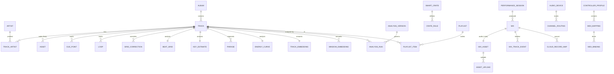

---

## Design summary

This specification (v2.0-iOS) expands the Platterhead design and the accompanying mockups into an implementation-ready architecture for **one universal iOS/iPadOS application**. It defines the product topology (one app, one core, one library, two capability tiers — §2.4), the full data layer (relational core + analysis + the tiered semantic vector store of §16), the offline analysis pipeline (DSP → grids → key → phrase → CLAP), the auto-playlist sequencer (§28A), the real-time audio engine (lock-free RT boundary, sample-accurate scheduler, sync, stems, recording), the audio-session subsystem that iOS demands and macOS never needed (§34A), optional peer sync and the Watch performance remote, the presentation layer (every mockup screen mapped to View ▸ ViewModel ▸ data/services), the cross-cutting budgets — including the thermal governor and memory ceiling that make a phone different from a laptop — and a phased delivery roadmap that ships the free tier three times before the paid feature exists. Every design choice is aligned to the conventions of the existing `johnarleyburns/parso-tonearm` repository (GRDB patterns, `CloudSyncEngine`, `RecordMapping`, SHA-256 content addressing, snake_case tables / camelCase columns, zero-telemetry CI enforcement), so the DJ capability extends the shipping app rather than forking it.

The reference appendices that follow (F–L) provide build-grade detail beyond the narrative: concrete DSP algorithm implementations (F), the semantic-embedding subsystem in depth (G), worked end-to-end traces (H), the consolidated public-interface index (I), the configuration and tuning reference (J), the concurrency and threading model (K), and the requirements-traceability matrix (L).

---

# Appendix F — Reference algorithm implementations

The main body (Part IV) specifies the analysis pipeline's *structure, configuration, and contracts*. This appendix gives **reference implementations** of the core DSP kernels dense enough to build from directly. All are **pure** (deterministic, no I/O), operate on the 48 kHz working rate, and are the unit under the golden-file and unit tests of §47. Real code uses Accelerate/`vDSP` for the hot loops; the listings show the actual call shape, not pseudocode.

## F.1 FFT setup and the windowed real FFT

The STFT (§21) uses a single reused `vDSP.FFT` object sized to the 4096-sample window. Setup happens once; the transform runs per hop with no per-call allocation.

```swift
import Accelerate

final class STFT {
    let n: Int                       // 4096
    let log2n: vDSP_Length
    private let fft: vDSP.FFT<DSPSplitComplex>
    private var window: [Float]      // Hann, length n
    private var real: [Float]        // scratch, length n/2
    private var imag: [Float]        // scratch, length n/2

    init(n: Int = 4096) {
        self.n = n
        self.log2n = vDSP_Length(log2(Float(n)))
        self.fft = vDSP.FFT(log2n: log2n, radix: .radix2, ofType: DSPSplitComplex.self)!
        self.window = [Float](repeating: 0, count: n)
        vDSP_hann_window(&window, vDSP_Length(n), Int32(vDSP_HANN_NORM)) // periodic Hann
        self.real = [Float](repeating: 0, count: n / 2)
        self.imag = [Float](repeating: 0, count: n / 2)
    }

    /// Compute the power spectrum (length n/2) of one frame in-place scratch.
    /// `frame` is n samples of mono audio; caller advances by the hop (2048).
    func powerSpectrum(_ frame: UnsafePointer<Float>, into power: inout [Float]) {
        // 1) Window the frame (element-wise multiply).
        var windowed = [Float](repeating: 0, count: n)
        vDSP_vmul(frame, 1, window, 1, &windowed, 1, vDSP_Length(n))

        // 2) Pack real input into split-complex (even→real, odd→imag) for real FFT.
        windowed.withUnsafeBufferPointer { wp in
            wp.baseAddress!.withMemoryRebound(to: DSPComplex.self, capacity: n / 2) { cp in
                real.withUnsafeMutableBufferPointer { rp in
                    imag.withUnsafeMutableBufferPointer { ip in
                        var split = DSPSplitComplex(realp: rp.baseAddress!, imagp: ip.baseAddress!)
                        vDSP_ctoz(cp, 2, &split, 1, vDSP_Length(n / 2))
                        // 3) Forward real FFT.
                        fft.forward(input: split, output: &split)
                        // 4) Magnitude² → power. (DC and Nyquist handled in bins 0.)
                        vDSP_zvmags(&split, 1, &power, 1, vDSP_Length(n / 2))
                    }
                }
            }
        }
    }
}
```

Notes: the `vDSP_ctoz` packing is the standard real-FFT idiom (treat the real signal as interleaved complex, then unpack). `vDSP_zvmags` yields magnitude-squared directly (cheaper than magnitude; the sqrt is only taken where a linear magnitude is needed). Frequency of bin *k* is `k · 48000 / 4096 ≈ 11.72·k` Hz.

## F.2 Spectral features per frame

From the power spectrum, the per-frame features of §21.3 are cheap reductions:

```swift
struct SpectralFrame {
    var centroid: Float; var rolloff: Float; var flux: Float
    var rms: Float; var zcr: Float; var bandEnergy: SIMD8<Float>
}

func features(power: [Float], prevPower: [Float], frame: [Float],
              sampleRate: Float, rolloffPct: Float = 0.85) -> SpectralFrame {
    let n2 = power.count
    // Centroid = Σ f·P / ΣP
    var total: Float = 0; vDSP_sve(power, 1, &total, vDSP_Length(n2))
    var num: Float = 0
    for k in 0..<n2 { num += Float(k) * power[k] }
    let binHz = sampleRate / Float(2 * n2)
    let centroid = total > 0 ? (num / total) * binHz : 0

    // Rolloff = freq below which rolloffPct of energy lies
    var cum: Float = 0; let thresh = total * rolloffPct; var rolloffBin = n2 - 1
    for k in 0..<n2 { cum += power[k]; if cum >= thresh { rolloffBin = k; break } }
    let rolloff = Float(rolloffBin) * binHz

    // Flux = Σ max(0, P - Pprev)  (half-wave rectified spectral difference)
    var flux: Float = 0
    for k in 0..<n2 { let d = power[k] - prevPower[k]; if d > 0 { flux += d } }

    // RMS of the time-domain frame
    var rms: Float = 0; vDSP_rmsqv(frame, 1, &rms, vDSP_Length(frame.count))

    // Zero-crossing rate
    var zc = 0
    for i in 1..<frame.count { if (frame[i] >= 0) != (frame[i-1] >= 0) { zc += 1 } }
    let zcr = Float(zc) / Float(frame.count)

    // Eight log-spaced band energies (sub-bass … air)
    var bands = SIMD8<Float>(repeating: 0)
    let edges: [Int] = bandEdgeBins(n2: n2)          // precomputed
    for b in 0..<8 {
        var e: Float = 0
        for k in edges[b]..<edges[b+1] { e += power[k] }
        bands[b] = e
    }
    return SpectralFrame(centroid: centroid, rolloff: rolloff, flux: flux,
                         rms: rms, zcr: zcr, bandEnergy: bands)
}
```

The `flux` series across frames **is** the onset novelty function of §22.1 (after per-frame normalization); it is stored as `onset_envelope`.

## F.3 Onset envelope post-processing and peak picking

```swift
/// Normalize flux to a novelty curve, then adaptive-threshold peak-pick (§22.2).
func onsets(flux: [Float], hopSeconds: Float) -> [Float] {   // → onset times (s)
    // 1) Smooth (small moving average) and remove slow drift (subtract local mean).
    let smoothed = movingAverage(flux, window: 3)
    let local = movingAverage(smoothed, window: 16)          // local mean
    var novelty = zip(smoothed, local).map { max(0, $0 - $1) }
    // 2) Normalize to [0,1].
    if let mx = novelty.max(), mx > 0 { novelty = novelty.map { $0 / mx } }
    // 3) Peak pick: local maximum above an adaptive threshold with a refractory gap.
    var times: [Float] = []
    let minGap = Int(0.03 / hopSeconds)                      // ~30 ms refractory
    var last = -minGap
    for i in 1..<(novelty.count - 1) {
        let v = novelty[i]
        let isPeak = v > novelty[i-1] && v >= novelty[i+1]
        let thr = 0.15 + 0.5 * localMedian(novelty, at: i, radius: 16)
        if isPeak && v >= thr && (i - last) >= minGap {
            times.append(Float(i) * hopSeconds); last = i
        }
    }
    return times
}
```

## F.4 Tempo estimation by autocorrelation / comb filtering

The tempo histogram (§22.3) is derived by correlating the onset novelty against a bank of comb templates at candidate BPMs and picking the peak, with octave-error resolution (§22.4).

```swift
struct TempoResult { var bpm: Double; var strength: Double; var alternates: [Double] }

func estimateTempo(novelty: [Float], hopSeconds: Float,
                   range: ClosedRange<Double> = 70...180) -> TempoResult {
    // Autocorrelation of the novelty function (via vDSP), lag in frames.
    let m = novelty.count
    var ac = [Float](repeating: 0, count: m)
    vDSP_conv(novelty, 1, novelty.reversed(), 1, &ac, 1, vDSP_Length(m), vDSP_Length(m))
    // Score each candidate BPM by summing autocorrelation energy at its beat period
    // and integer multiples (comb): reinforces true tempo, suppresses subharmonics.
    var best = TempoResult(bpm: 0, strength: -1, alternates: [])
    var scores: [(bpm: Double, s: Double)] = []
    var bpm = range.lowerBound
    while bpm <= range.upperBound {
        let periodFrames = (60.0 / bpm) / Double(hopSeconds)
        var s = 0.0
        for h in 1...4 {                                     // comb harmonics
            let lag = Int((periodFrames * Double(h)).rounded())
            if lag < m { s += Double(ac[lag]) / Double(h) }  // weight decays with h
        }
        scores.append((bpm, s))
        if s > best.strength { best = TempoResult(bpm: bpm, strength: s, alternates: []) }
        bpm += 0.1
    }
    // Octave-error check: compare best against ½× and 2× using onset phase agreement.
    best.alternates = [best.bpm * 0.5, best.bpm * 2.0].filter { range.contains($0) }
    best.bpm = resolveOctave(candidate: best.bpm, scores: scores, range: range)
    return best
}
```

The comb-with-decaying-harmonics scoring is what prevents the classic half/double-tempo mistake: a true tempo scores at its period *and* its multiples, so it beats a subharmonic that only scores at even lags (§22.4).

## F.5 Beat grid by dynamic programming

Given a tempo estimate and the onset novelty, beats are placed to jointly maximize onset alignment and tempo regularity — the standard dynamic-programming beat tracker (§23.1).

```swift
/// Ellis-style DP beat tracking: choose beat frames maximizing
/// Σ onset(bi) + λ·Σ consistency(interval_i, idealPeriod).
func trackBeats(novelty: [Float], bpm: Double, hopSeconds: Float,
                lambda: Double = 100) -> [Int] {           // → beat frame indices
    let period = (60.0 / bpm) / Double(hopSeconds)          // ideal inter-beat frames
    let n = novelty.count
    var score = [Double](repeating: 0, count: n)
    var back  = [Int](repeating: -1, count: n)
    let lo = Int(period * 0.5), hi = Int(period * 1.5)      // allowed interval window
    for i in 0..<n {
        score[i] = Double(novelty[i])
        var bestPrev = -Double.greatestFiniteMagnitude; var bestJ = -1
        for j in max(0, i - hi)...max(0, i - lo) where j < i {
            let interval = Double(i - j)
            let penalty = -lambda * pow(log(interval / period), 2) // log-Gaussian consistency
            let cand = score[j] + penalty
            if cand > bestPrev { bestPrev = cand; bestJ = j }
        }
        if bestJ >= 0 { score[i] += bestPrev; back[i] = bestJ }
    }
    // Backtrace from the best-scoring tail beat.
    var i = (score.enumerated().max { $0.element < $1.element })?.offset ?? 0
    var beats: [Int] = []
    while i >= 0 { beats.append(i); i = back[i] }
    return beats.reversed()
}
```

The recovered beat frames are converted to seconds and stored as the `beat_grid` (with per-beat confidence from the local novelty); the median inter-beat interval refines the stored BPM. Downbeats (§23.2) are then chosen by correlating a bar-level accent pattern (spectral-flux emphasis on low bands) against beat groups of 4.

## F.6 Chroma (HPCP) and key correlation

Key detection (§24) folds spectral energy into 12 pitch classes (HPCP/chroma), averages over the track, and correlates against major/minor key templates.

```swift
/// Map power spectrum bins to a 12-bin chroma via pitch-class of each bin's frequency.
func chroma(power: [Float], sampleRate: Float, refA: Float = 440) -> SIMD12<Float> {
    var c = SIMD12<Float>(repeating: 0)
    let binHz = sampleRate / Float(2 * power.count)
    for k in 1..<power.count {
        let f = Float(k) * binHz
        if f < 27.5 || f > 5000 { continue }               // piano-ish range
        let midi = 69 + 12 * log2(f / refA)                // fractional MIDI note
        let pc = ((Int(midi.rounded()) % 12) + 12) % 12
        c[pc] += power[k]
    }
    // L1 normalize
    let s = c.sum(); return s > 0 ? c / s : c
}

/// Correlate averaged chroma against Krumhansl-style major/minor profiles at all 12 rotations.
func estimateKey(avgChroma: SIMD12<Float>) -> (pc: Int, isMinor: Bool, score: Float) {
    let major: SIMD12<Float> = /* profile */ krumhanslMajor
    let minor: SIMD12<Float> = krumhanslMinor
    var best: (Int, Bool, Float) = (0, false, -.greatestFiniteMagnitude)
    for rot in 0..<12 {
        let rotated = rotate(avgChroma, by: rot)
        let sMaj = correlate(rotated, major)
        let sMin = correlate(rotated, minor)
        if sMaj > best.2 { best = (rot, false, sMaj) }
        if sMin > best.2 { best = (rot, true,  sMin) }
    }
    return best   // pc+isMinor → Camelot via Appendix B table
}
```

The winning `(pitch-class, mode)` maps through the Appendix B table to a Camelot code stored in `key_estimate`; the correlation score becomes the stored confidence.

## F.7 Energy curve

Perceived energy (§25/§28 uses it; mockup `ipad/06-track-preparation.html` shows "7.8/10") is a smoothed blend of loudness and spectral activity per beat:

```swift
/// Per-beat energy in [0,1]: combine band-weighted RMS (loudness) and HF flux (activity).
func energyCurve(frames: [SpectralFrame], beats: [Int], hopSeconds: Float) -> [Float] {
    func atBeat(_ b: Int) -> Float {
        let f = frames[min(b, frames.count - 1)]
        let loud = f.rms                                   // level
        let hf = f.bandEnergy[5] + f.bandEnergy[6] + f.bandEnergy[7]  // brightness/activity
        return 0.6 * loud + 0.4 * sqrt(hf)
    }
    var raw = beats.map { atBeat(Int(Float($0))) }
    // Normalize to [0,1] and smooth over a few beats.
    if let mx = raw.max(), mx > 0 { raw = raw.map { $0 / mx } }
    return movingAverage(raw, window: 4)
}
```

The scalar "energy 7.8/10" shown per track is the curve's robust central tendency (e.g., median) scaled to 0–10; the full curve drives phrase/section contrast and transition scoring.


---

# Appendix G — Semantic embedding subsystem in depth

Part IV §27 introduced CLAP at the level the narrative needs. This appendix expands the **semantic subsystem** — model choice rationale, the exact embedding lifecycle, the vector-store contract, and the hybrid ranking math — to the depth a builder needs, because "vibe search" (mockup `ipad/04b-vibe-search-results.html`) is the app's signature differentiator.

## G.1 Why CLAP, and which CLAP

CLAP (Contrastive Language–Audio Pretraining) learns a **shared embedding space** for audio and text: an audio clip and a text description that match land near each other. That is exactly the primitive vibe search needs — embed the library's audio once, embed the user's phrase at query time, and rank by nearness. The alternative approaches are worse fits:

- **Tag classifiers** (predict genre/mood labels) force everything through a fixed vocabulary; "dark driving bassline" isn't a label.
- **Metadata/text search** can't see the audio at all.
- **Raw audio-feature similarity** (MFCC/chroma distance) captures timbre but not *meaning* ("euphoric", "brooding").

The chosen model is a **music-domain CLAP checkpoint** (trained/fine-tuned on music rather than general audio events), converted to Core ML (Appendix D), producing a fixed-dimensional (e.g., 512-d) L2-normalized embedding from a mel-spectrogram input. Music-domain weights matter: a general-audio CLAP over-indexes on sound-event semantics (dog, rain) rather than musical character.

## G.2 The embedding lifecycle (end to end)

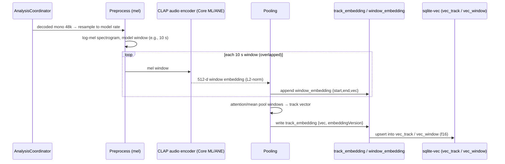

Key properties: **windowed** (a 6-minute track yields many overlapping 10 s windows, so within-track variation is captured for section-level search); **pooled** to one track vector for whole-track ranking; **versioned** by `embeddingVersion` so a model upgrade re-embeds cleanly and the vec tables rebuild (§17, §27.6). Preprocessing (resample → log-mel) is deterministic and part of the versioned contract, so goldens are stable.

## G.3 Pooling strategies

Two pooled representations are maintained because they answer different questions:

- **Whole-track vector** (for "find tracks like this / matching this vibe"): an **attention-weighted mean** of window embeddings, weighting musically salient windows (e.g., higher-energy or more representative sections) above intros/outros. A plain mean is the fallback and is often close.
- **Window vectors** (for "find the *moment* that matches" and for transition points): kept individually in `vec_window` so search can locate a specific 10 s region — useful for finding a compatible drop or breakdown, not just a compatible track.

```swift
func poolTrack(windows: [[Float]], saliency: [Float]) -> [Float] {
    // weighted mean then renormalize
    let dim = windows.first?.count ?? 0
    var acc = [Float](repeating: 0, count: dim)
    let wsum = max(saliency.reduce(0,+), 1e-6)
    for (w, s) in zip(windows, saliency) {
        vDSP_vsma(w, 1, [s/wsum], acc, 1, &acc, 1, vDSP_Length(dim))
    }
    return l2normalize(acc)
}
```

## G.4 Vector store contract (sqlite-vec)

> ⟢ **Revised in v2.0-iOS.** This appendix's original text assumed one strategy — library-wide
> f16 vectors in `vec_track`/`vec_window`, always queried through sqlite-vec. **§16 supersedes
> it**: vectors are **int8-quantized** (§16.6), whole-track vectors are library-wide while window
> vectors are **crate-scoped** (§16.4), and there are **two interchangeable implementations**
> behind one façade — a Tier A brute-force vDSP scan up to ~30k tracks and Tier B sqlite-vec above
> it (§16.1). Where this appendix and §16 disagree, **§16 is normative.**

The store holds **int8, L2-normalized** vectors with a per-row dequantization scale, keyed by
`trackID` (and window id). Because vectors are unit-norm, **inner product equals cosine
similarity**, so top-K by inner product is the ranking primitive in both tiers.

**Tier A** (≤ 30k tracks, the default) scans an mmap'd `vectors.i8` matrix with `vDSP`, returning
*exact* top-K — no index to build, none to corrupt, nothing to keep in sync. **Tier B** uses the
sqlite-vec `vec0` virtual table and is queried in the same SQL statement that applies relational
constraints (§16.5's hybrid query), so the ANN candidate set is already filtered by BPM/Camelot
before scoring. Both tiers call the *same* pure scoring functions (§16.5), and AT-SEARCH-5 asserts
they produce identical orderings on the same fixture.

```sql
-- Conceptual hybrid query, Tier B (see §16.5 for the concrete form).
-- Tier A runs the identical re-rank in Swift over the scan's top candidates.
WITH knn AS (
    SELECT track_rowid, distance
    FROM vec_track
    WHERE embedding MATCH :queryVec        -- ANN over the (constrained) space
    ORDER BY distance LIMIT :k
)
SELECT t.*, knn.distance
FROM knn JOIN track t ON t.rowid = knn.track_rowid
JOIN beat_grid g ON g.trackID = t.id
JOIN key_estimate ke ON ke.trackID = t.id
WHERE g.bpm BETWEEN :bpmLo AND :bpmHi      -- relational constraints
  AND ke.camelot IN (:camelotSet)
ORDER BY /* fused score, see G.5 */ ;
```

## G.5 Hybrid ranking math

The final rank fuses semantic nearness with musical compatibility using the HLD's weights (semantic 0.40, BPM 0.20, Camelot 0.20, energy 0.10, phrase 0.10, §28.1). Each component is normalized to [0,1]; the composite is a weighted sum:

```
score(t) = 0.40 · sem(t)      // 1 − normalized cosine distance to query
         + 0.20 · bpmFit(t)   // 1 at exact tempo match, decays over ± window
         + 0.20 · keyFit(t)   // Camelot compatibility grade (Appendix B)
         + 0.10 · energyFit(t)// closeness of energy to desired/among-results
         + 0.10 · phraseFit(t)// phrase-length / structure compatibility
```

```swift
func fusedScore(_ c: Candidate, q: Query, w: Weights = .default) -> Double {
    let sem     = 1.0 - c.cosineDistance                    // sqlite-vec distance
    let bpmFit  = gaussian(c.bpm - q.targetBPM, sigma: q.bpmTolerance)
    let keyFit  = camelotCompatibility(c.camelot, q.camelot) // 0…1 graded
    let energy  = 1.0 - abs(c.energy - q.targetEnergy)
    let phrase  = phraseCompatibility(c.phraseLen, q.phraseLen)
    return w.sem*sem + w.bpm*bpmFit + w.key*keyFit + w.energy*energy + w.phrase*phrase
}
```

The **+/- refine terms** (mockup `ipad/04b-vibe-search-results.html`) adjust the *query vector*: a "+" term's text embedding is added (and renormalized), a "−" term's is subtracted, nudging the semantic anchor before ANN — vector arithmetic in the shared space, which is why refinement feels semantic rather than keyword-ish. BPM/Camelot constraints act as hard filters (they gate the candidate set) *and* as soft `bpmFit`/`keyFit` terms (they order within the set), so tightening them both narrows and re-ranks.

## G.6 Incremental re-indexing

New or changed tracks are embedded and upserted without a full rebuild; an `embeddingVersion` bump
(new model) marks the index stale and re-embeds in the background (§27.6), showing progress like
analysis (mockup `ipad/03-analysis.html`). Deletions remove rows from `*_embedding` and either
delete the vec row (Tier B) or tombstone the matrix row (Tier A) in the same transaction; a
compaction pass runs once tombstones exceed 20% (§16.7). Re-indexing is interruptible by the
thermal governor (§43.7) and resumes from the row table, which is always the source of truth.

The search stays available during incremental work, operating on whatever is currently indexed and
**reporting coverage honestly** (FR-SEM-8). It also stays available across a *tier crossing*: when
a library grows past the Tier B threshold, the ANN index builds in the background while Tier A
keeps serving queries, and the switch is atomic (§16.7). Nothing here ever syncs (FR-SYNC-5).

---

# Appendix H — Worked end-to-end traces

Three traces show the moving parts cooperating. They are illustrative narratives, not new requirements, and cross-reference the sections that own each step.

## H.1 A track from drop to searchable

A DJ drops `Midnight Drive.aiff` into the watched folder (`~/Music`, mockup `ipad/02-library.html`).

1. **Detect (shell):** `FolderWatchService` reports the new file; `DJLibraryStore` inserts `folder`/`asset`/`track` rows and an `import_event` (§14). The library list shows it immediately with analysis state *pending* (mockup `ipad/02-library.html`'s analysis column).
2. **Enqueue (shell):** `AnalysisCoordinator` creates an `analysis_run` at the current `analysis_version` and schedules a job on the runner (§19), concurrency-limited.
3. **Decode + loudness (pure/shell):** the file is decoded to 48 kHz mono (for analysis) and stereo (for loudness); BS.1770 integrated loudness and DR are computed and stored in `loudness` (§20).
4. **DSP (pure):** the `STFT` (Appendix F.1) runs at 4096/2048; per-frame `SpectralFrame`s (F.2) are computed; the flux series becomes `onset_envelope` (F.3).
5. **Tempo + grid (pure):** `estimateTempo` (F.4) yields ~124 BPM with octave check; `trackBeats` (F.5) places the grid; downbeats are marked; results land in `tempo_candidate`/`beat_grid`/`downbeat` (§23).
6. **Key (pure):** averaged `chroma` (F.6) correlates to, say, A minor → **8A**, stored in `key_estimate` (§24).
7. **Phrase + energy (pure):** phrase boundaries (§25) and the `energy_curve` (F.7, robust central value ≈ 7.8/10) are stored.
8. **Waveform (pure):** the multi-resolution `waveform_pyramid` is generated for instant zoomed rendering (§26).
9. **Embedding (Core ML):** overlapping 10 s windows are embedded by CLAP, pooled to a track vector, written to `track_embedding`/`window_embedding` and upserted into `vec_track`/`vec_window` (Appendix G).
10. **Done:** the `analysis_run` is marked complete; the library health metric (mockup `ipad/02-library.html`, 98.7%) ticks up; the track now appears in vibe-search results and can be prepared (mockup `ipad/06-track-preparation.html`). Every step wrote through the versioned, immutable analysis contract (§17), so re-running is idempotent and a version bump re-derives cleanly.

## H.2 A beatmatched transition at the sample level

Deck A is playing (124.0 BPM, **8A**); the DJ loads a 122.0 BPM **9A** track to Deck B and presses **SYNC**, then rides the crossfader (mockup `ipad/07-dj-workspace.html`).

1. **Load B (shell):** `WorkspaceModel` sends `load(deckB, track)`; the engine opens the source (or four stem `.caf` files, §36.5) and snapshots B's grid into the RT engine state (§12).
2. **Sync press → command (main→RT):** `WorkspaceModel` calls `PerformanceEngine.sync(deckB, to: master=deckA)`. `SyncEngine.correction` (§32.1, pure) computes `targetRate = 124.0/122.0 ≈ 1.0164` and the phase delta between B's current beat phase and A's, converting it to a sample shift. The result is enqueued as an `RTCommand` on the lock-free ring.
3. **Apply at boundary (RT):** at the next render callback, the engine sets B's `AVAudioUnitTimePitch.rate` to 1.0164 with **key-lock on** (pitch held, §31), and applies the scheduled sub-beat playhead nudge so B's beats coincide with A's (§30.2). No allocation or locking occurs; the render load meter (§34.3) barely moves.
4. **Bar alignment (RT):** because bar-sync is the default (§32.2), the nudge targets the nearest **downbeat**, so B's bar 1 lands on A's bar 1 — phrases line up.
5. **Crossfade (main→RT):** as the DJ moves the crossfader, `crossfaderGains` (§35.4, constant-power) ramps A down and B up; the values arrive as commands and are smoothed per block so there's no zipper noise.
6. **EQ swap (RT):** the DJ pulls A's LOW and pushes B's LOW (bass swap) via the 3-band isolator EQ (§35.2); kills are phase-coherent so the low end transitions cleanly.
7. **Master → limiter → out/record (RT):** the summed mix passes the brickwall limiter (§35.5); the same master feeds the output device, the metering tap (spectrum/levels in mockup `ipad/07-dj-workspace.html`), and — if recording — the RT-safe record tap (§37.2), which copies the block to a ring for the encoder actor. The audience hears a phase-aligned, bar-matched, bass-swapped blend; the recorded M4A captures it sample-for-sample.

Throughout, the only main-thread work was translating gestures to commands and reading a 60 fps telemetry struct; all audio-affecting logic ran lock-free in the callback, and all the tricky math (`correction`, gains) was pure and unit-tested (§47.2).

## H.3 A vibe search to a smart crate

The DJ types "dark driving bassline", constrains 122–126 BPM, and clicks a Camelot neighbor set (mockup `ipad/04b-vibe-search-results.html`).

1. **Embed query (Core ML):** the phrase is embedded by the CLAP **text** encoder to a 512-d unit vector (Appendix G.2).
2. **Refine (pure):** the DJ adds "+hypnotic" and "−cheesy"; those term embeddings are added/subtracted and the query renormalized (Appendix G.5) — the semantic anchor shifts.
3. **Constrained ANN (SQL):** `SemanticSearchService` issues the hybrid query (§16, G.4): sqlite-vec finds nearest `vec_track` rows **within** the BPM/Camelot filter; the candidate set is already musically valid.
4. **Fuse + rank (pure):** each candidate's `fusedScore` (G.5) combines semantic nearness (0.40) with bpm/key/energy/phrase fit; results are ordered and shown with a **% match** (mockup `ipad/04b-vibe-search-results.html`) derived from the composite. Latency is the measured ANN+rank time (~43 ms, mockup `ipad/04b-vibe-search-results.html`).
5. **Save Smart Crate (shell):** the DJ clicks **Save Smart Crate**; the query (text, refine terms, constraints, weights) persists as a `smart_crate` + `crate_rule` set (§14). It re-evaluates as the library grows, so newly imported tracks that fit appear automatically — a *living* selection, not a frozen list.


---

# Appendix I — Consolidated public interface index

This appendix collects the **normative public interfaces** of the DJ subsystem in one place, so a coding agent can implement against a single reference. Signatures are authoritative (Part II §10 introduced them in context); where a type is defined in the body, the owning section is noted. Access levels reflect the module boundaries of §9 (`TonearmDJ` is a macOS-gated library product in the existing package). Concurrency annotations (`@MainActor`, `actor`, `Sendable`) reflect §11.

## I.1 Library and persistence

```swift
// Owns the DJ-authoritative library DB (tonearm-dj.sqlite); §14, §18.
public protocol DJLibraryStore: Sendable {
    func importFolder(_ url: URL) async throws -> ImportSummary
    func track(id: TrackID) async throws -> DJTrack?
    func allTracks() -> AsyncStream<[DJTrack]>                 // ValueObservation-backed
    func search(_ q: LibraryQuery) async throws -> [DJTrack]   // relational (SearchQueryBuilder)
    func upsertCue(_ cue: CuePoint) async throws
    func upsertLoop(_ loop: Loop) async throws
    func saveGridCorrection(_ c: GridCorrection) async throws
    func setRating(_ r: Rating) async throws
    func tag(_ trackID: TrackID, _ tag: Tag) async throws
    func saveSmartCrate(_ crate: SmartCrate, rules: [CrateRule]) async throws
    func evaluateSmartCrate(id: CrateID) async throws -> [DJTrack]
}

public struct ImportSummary: Sendable {
    public let added: Int, updated: Int, skipped: Int, failed: [URL]
}
```

Repositories (§18) back the store:

```swift
public protocol DJTrackRepository: Sendable {
    func observeAll() -> AsyncStream<[DJTrackRow]>
    func observe(id: TrackID) -> AsyncStream<DJTrackRow?>
    func page(_ req: PageRequest) async throws -> [DJTrackRow]  // windowed for scale
}
```

## I.2 Analysis

```swift
// Orchestrates the offline pipeline (Part IV); §19.
public protocol AnalysisCoordinator: Sendable {
    func enqueue(_ trackID: TrackID, priority: JobPriority) async
    func enqueueAll(missingAt version: AnalysisVersionID) async
    func pause(); func resume()
    func prioritize(_ trackID: TrackID) async
    var progress: AsyncStream<AnalysisProgress> { get }        // per-track stage/percent
    func result(for trackID: TrackID) async throws -> TrackAnalysis?
}

public struct AnalysisProgress: Sendable {
    public let trackID: TrackID
    public let stage: AnalysisStage                            // decode|features|tempo|key|phrase|waveform|embed
    public let fraction: Double
    public let computeUnit: ComputeUnit                        // ane|gpu|cpu (for mockup `ipad/03-analysis.html` badges)
}

public enum AnalysisStage: String, Sendable, CaseIterable {
    case decode, loudness, features, onsets, tempo, beats, key, phrase, waveform, embed
}

// Pure DSP kernels (Appendix F provides reference bodies); all deterministic.
public enum DSP {
    public static func powerSpectrum(_ frame: [Float], _ stft: STFT) -> [Float]
    public static func spectralFeatures(power: [Float], prev: [Float], frame: [Float]) -> SpectralFrame
    public static func onsetEnvelope(flux: [Float]) -> [Float]
    public static func estimateTempo(novelty: [Float], hopSeconds: Float,
                                     range: ClosedRange<Double>) -> TempoResult
    public static func trackBeats(novelty: [Float], bpm: Double, hopSeconds: Float) -> [Int]
    public static func chroma(power: [Float], sampleRate: Float) -> SIMD12<Float>
    public static func estimateKey(avgChroma: SIMD12<Float>) -> KeyEstimateResult
    public static func energyCurve(frames: [SpectralFrame], beats: [Int], hopSeconds: Float) -> [Float]
    public static func waveformPyramid(_ samples: [Float], levels: Int) -> WaveformPyramid
}
```

## I.3 Semantic search

```swift
// CLAP text/audio embedding (Core ML); §27, Appendix G.
public protocol CLAPEmbedder: Sendable {
    func embedText(_ text: String) async throws -> Embedding          // 512-d unit vector
    func embedAudioWindows(_ pcm: PCMBuffer) async throws -> [WindowEmbedding]
    func pool(_ windows: [WindowEmbedding]) -> Embedding
    var version: EmbeddingVersionID { get }
}

// Search over the vector store fused with musical constraints; §28, G.5.
public protocol SemanticSearchService: Sendable {
    func search(text: String,
                refine: RefineTerms,                                  // +/- terms
                constraints: MusicalConstraints,                      // bpm range, camelot set
                weights: RankWeights = .default,
                limit: Int) async throws -> SearchResults
    func similar(to trackID: TrackID, constraints: MusicalConstraints,
                 limit: Int) async throws -> SearchResults
}

public struct RefineTerms: Sendable { public var positive: [String]; public var negative: [String] }
public struct MusicalConstraints: Sendable {
    public var bpmRange: ClosedRange<Double>?
    public var camelot: Set<Camelot>?
    public var energyRange: ClosedRange<Double>?
}
public struct SearchResults: Sendable {
    public let items: [ScoredTrack]                                   // ordered, with % match
    public let latencyMillis: Double                                  // mockup `ipad/04b-vibe-search-results.html` readout
    public let coverage: Double                                       // fraction of library indexed
}
public struct ScoredTrack: Sendable { public let track: DJTrack; public let score: Double
                                      public let components: ScoreBreakdown }
```

## I.4 Real-time performance engine

```swift
// The control/telemetry façade over the RT audio engine; §29–37.
// All mutating calls enqueue lock-free RT commands (§12); none block on audio.
@MainActor public protocol PerformanceEngine: AnyObject {
    // Transport / loading
    func load(_ deck: DeckID, track: TrackID, stems: Bool) async throws
    func play(_ deck: DeckID); func pause(_ deck: DeckID)
    func cue(_ deck: DeckID)                                          // CDJ-style temp cue
    func seek(_ deck: DeckID, toSample: Int64, quantized: Bool)
    // Tempo / key
    func setRate(_ deck: DeckID, percent: Double, keyLock: Bool)
    func shiftKey(_ deck: DeckID, semitones: Int)
    func sync(_ deck: DeckID, to master: DeckID)
    func unsync(_ deck: DeckID)
    // Cues / loops
    func triggerHotCue(_ deck: DeckID, index: Int)
    func setLoop(_ deck: DeckID, beats: Double)                       // ½,1,2,4,8,16
    func exitLoop(_ deck: DeckID)
    func setQuantize(_ on: Bool, resolution: QuantizeResolution)
    // Mixer
    func setChannelFader(_ deck: DeckID, _ gain: Float)
    func setEQ(_ deck: DeckID, band: EQBand, _ gain: Float)
    func setFilter(_ deck: DeckID, _ amount: Float)                   // −1 LP … 0 … +1 HP
    func setCrossfader(_ x: Float, curve: CrossfaderCurve)
    func setStemGain(_ deck: DeckID, stem: Stem, _ gain: Float)
    // Recording (delegates to RecordingService)
    func startRecording(_ config: RecordingConfig) async throws
    func stopRecording() async throws -> Mix
    // Telemetry (read-only; sampled by a 60 fps main pump, §40.3)
    var telemetry: AsyncStream<EngineTelemetry> { get }
    // Device / routing / buffer (rebuilds graph off-RT, §34.4)
    func applyAudioConfig(_ config: AudioIOConfig) async throws
}

public struct EngineTelemetry: Sendable {
    public struct Deck: Sendable { public let playheadSample: Int64; public let bpmEffective: Double
                                   public let level: StereoLevel; public let phase: Double }
    public let deckA: Deck, deckB: Deck
    public let masterLevel: StereoLevel
    public let spectrum: [Float]                                      // metering bins
    public let renderLoad: Double                                     // 0…1 (mockup `ipad/07-dj-workspace.html` CPU%)
    public let gpuLoad: Double
}
```

## I.5 Stems, recording, sync, hardware

```swift
// Demucs→Core ML separation; offline batch + on-demand; §36.
public protocol StemSeparator: Sendable {
    func hasCachedStems(_ trackID: TrackID) async -> Bool
    func separate(_ trackID: TrackID, urgency: SeparationUrgency) async throws -> StemSet
    var progress: AsyncStream<StemProgress> { get }
    var modelVersion: StemModelVersionID { get }
}
public enum SeparationUrgency: Sendable { case background, onDemand }

// RT-safe capture of the master bus → segmented M4A; §37.
public protocol RecordingService: Sendable {
    func start(_ config: RecordingConfig) async throws
    func logEvent(_ event: MixTrackEvent)                             // timeline (off-RT)
    func stop() async throws -> Mix                                   // finalizes file + rows
    func recoverInterrupted() async throws -> [Mix]                   // crash recovery, §37.3
}
public struct RecordingConfig: Sendable {
    public var format: AudioFormat = .m4a_aac(bitrate: 256_000)       // mockup `ipad/12-settings-storage.html` default
    public var outputFolder: URL
}

// DJ-side CloudKit sync (extends existing CloudSyncEngine); §38.
public protocol DJSyncService: Sendable {
    func requestSync(mixID: MixID) async throws                       // Save & Sync to iPhone
    func cancelSync(mixID: MixID) async throws
    func delete(mixID: MixID) async throws                            // propagates (.deleteSelf)
    var uploadState: AsyncStream<[MixID: UploadState]> { get }        // mockup `ipad/10-mixes.html` progress
    var accountStatus: AsyncStream<CloudAccountStatus> { get }
    var quota: AsyncStream<StorageQuota> { get }                      // mockup `ipad/10-mixes.html`/10
}

// CoreAudio devices/routing + CoreMIDI mapping/learn; §44.
public protocol HardwareService: Sendable {
    func audioDevices() async -> [AudioDevice]
    func midiEndpoints() async -> [MidiEndpoint]
    func beginMidiLearn() -> AsyncStream<MidiAddress>                 // next control captured
    func bind(_ binding: MidiBinding) async throws
    func loadProfile(_ id: ControllerProfileID) async throws
    func saveRouting(_ routing: [ChannelRouting]) async throws
    func setAudioIO(_ config: AudioIOConfig) async throws            // device + buffer
}
```

## I.5a Auto-playlists, entitlement, audio session, model delivery (new in v2.0-iOS)

Normative signatures live in the sections cited; this is the index entry.

```swift
// §28A — Playlist/ .  Pure core, actor shell.
public enum PlaylistSequencer {                                   // pure, deterministic (§28A.2–28A.3)
    static func arcError(energy: Double, position: Int, count: Int, arc: EnergyArc) -> Double
    static func transitionCost(_ a: TrackFeatures, _ b: TrackFeatures,
                               _ c: SequencingConstraints) -> Double
    static func sequence(candidates: [TrackFeatures], brief: PlaylistBrief,
                         seed: UInt64) -> [SequencedSlot]
}
public actor PlaylistGenerator {                                  // §28A.3, FR-PLIST-1..8
    func generate(_ brief: PlaylistBrief) async throws -> AutoPlaylistResult
    func replaceSlot(_ index: Int, in: AutoPlaylistResult) async throws -> AutoPlaylistResult
    func reject(_ trackID: Int64, for briefID: Int64) async throws -> AutoPlaylistResult
    func extend(_ result: AutoPlaylistResult, bySeconds: Int) async throws -> AutoPlaylistResult
}
public enum EnergyArc: Codable, Sendable { /* §28A.5 */ }
public struct SequencingConstraints: Codable, Sendable { /* §28A.2 */ }

// Appendix T — Entitlement/ .
@MainActor public final class EntitlementStore: ObservableObject {  // T.2, FR-STORE-1..7
    @Published public private(set) var isPro: Bool
    @Published public private(set) var source: Source                // purchased | foundersGrant | familyShared | builtFromSource
    public func purchase() async throws
    public func restore() async throws
}
public enum ProCapability: String, CaseIterable { /* T.3 — checked at intent boundaries only */ }

// §34A — Session/ .  The one platform-conditional module.
public actor AudioSessionCoordinator {                             // FR-SESS-1..5
    public struct Granted: Sendable { /* granted, never requested — §34A.2 */ }
    public func enter(_ mode: Mode) throws -> Granted
    public func currentGranted() -> Granted
    public var routeChanges: AsyncStream<RouteChange> { get }       // §34A.3
    public var interruptions: AsyncStream<Interruption> { get }     // §34A.4
}

// §27.1a — model delivery.
public actor ModelResourceService {                                // FR-SEM-6
    public func lease(_ tag: ModelTag) async throws -> ModelLease   // retains an NSBundleResourceRequest
    public func isAvailable(_ tag: ModelTag) -> Bool                // absence is never an error
    public var progress: AsyncStream<(ModelTag, Double)> { get }
}
```

## I.6 Shared value types (index)

The value objects threaded through the interfaces above, with their owning sections:

| Type | Kind | Owner |
|---|---|---|
| `TrackID`, `MixID`, `CrateID`, `DeckID` | typed IDs | §13 |
| `DJTrack`, `DJTrackRow`, `CuePoint`, `Loop`, `GridCorrection`, `SmartCrate`, `CrateRule`, `Rating`, `Tag` | records | §18, App. A |
| `PCMBuffer` | decoded audio | §19.3 |
| `SpectralFrame`, `TempoResult`, `KeyEstimateResult`, `WaveformPyramid` | DSP outputs | App. F |
| `TrackAnalysis` | aggregate analysis view | §17 |
| `Embedding`, `WindowEmbedding`, `EmbeddingVersionID` | semantic | §27, App. G |
| `ScoredTrack`, `ScoreBreakdown`, `RankWeights`, `MusicalConstraints`, `RefineTerms` | search | §28, App. G |
| `RTCommand`, `EngineSnapshot` | RT boundary POD | §12 |
| `EngineTelemetry`, `StereoLevel` | telemetry | §40 |
| `Stem`, `StemSet`, `StemModelVersionID`, `SeparationUrgency` | stems | §36 |
| `Mix`, `MixAsset`, `MixTrackEvent`, `RecordingConfig`, `AudioFormat` | recording | §37 |
| `UploadState`, `CloudAccountStatus`, `StorageQuota` | sync | §38 |
| `AudioDevice`, `MidiEndpoint`, `MidiAddress`, `MidiBinding`, `ChannelRouting`, `ControllerProfile`, `AudioIOConfig`, `EngineAction`, `ValueTransform` | hardware | §44 |
| `Camelot`, `EQBand`, `CrossfaderCurve`, `QuantizeResolution` | enums | §24, §35 |

## I.7 Enumerations (canonical values)

```swift
public enum DeckID: Sendable { case a, b }                            // v1 is two decks
public enum Stem: String, Sendable, CaseIterable { case vocals, drums, bass, other }
public enum EQBand: Sendable { case low, mid, high }
public enum CrossfaderCurve: Sendable { case constantPower, linear, sharp }
public enum QuantizeResolution: Sendable { case beat, halfBeat, bar }
public enum ComputeUnit: String, Sendable { case ane, gpu, cpu }
public enum JobPriority: Int, Sendable { case background = 0, normal = 1, interactive = 2 }
public struct Camelot: Hashable, Sendable { public let number: Int   // 1…12
                                            public let isB: Bool }    // A=minor, B=major
public enum AudioFormat: Sendable { case m4a_aac(bitrate: Int); case wav; case aiff }
```

This index, together with the DDL (§14–15), the DSP reference (Appendix F), and the semantic detail (Appendix G), is sufficient to scaffold every module of the DJ subsystem without re-reading the narrative — which is the point of the plan-first, interface-driven workflow (§49).


---

# Appendix J — Configuration and tuning reference

Every tunable in the analysis and engine subsystems lives in a typed `Config` struct with a documented default, so behavior is discoverable and testable rather than scattered as magic numbers (§21 established the pattern). This appendix enumerates the tunables, their defaults, valid ranges, and the effect of changing them. Defaults are the shipping values; goldens (§47.2) are pinned to them, so changing a default that affects analysis output is an `analysis_version` bump (§17).

## J.1 Analysis DSP config

```swift
public struct AnalysisConfig: Sendable {
    // STFT
    public var sampleRate: Double = 48_000        // working rate; fixed across the app
    public var fftSize: Int = 4096                // window length (power of two)
    public var hopSize: Int = 2048                // 50% overlap
    public var window: WindowKind = .hann         // hann|hamming|blackman
    // Onset / tempo
    public var onsetSmoothing: Int = 3            // frames of moving average
    public var onsetLocalMean: Int = 16           // frames for drift removal
    public var onsetRefractoryMs: Double = 30     // min gap between onsets
    public var tempoRange: ClosedRange<Double> = 70...180
    public var tempoResolution: Double = 0.1      // BPM grid for the search
    public var combHarmonics: Int = 4             // comb template depth (octave-error guard)
    // Beats
    public var beatConsistencyLambda: Double = 100 // DP tempo-regularity weight
    // Key
    public var chromaRefA: Double = 440
    public var chromaMinHz: Double = 27.5
    public var chromaMaxHz: Double = 5_000
    // Energy
    public var energyLoudnessWeight: Double = 0.6 // vs 0.4 activity
    public var energySmoothingBeats: Int = 4
    // Waveform
    public var waveformLevels: Int = 6            // LOD count
    public var waveformBaseBin: Int = 256         // samples per bin at finest LOD
}
```

| Tunable | Default | Range | Effect of increasing |
|---|---|---|---|
| `fftSize` | 4096 | 1024–16384 | Finer frequency resolution, coarser time resolution; slower transform |
| `hopSize` | 2048 | 256–fftSize | Fewer frames (faster) but coarser onset timing |
| `tempoRange` | 70–180 | — | Wider range risks more octave confusion; narrower is faster and safer for known genres |
| `combHarmonics` | 4 | 2–6 | Stronger suppression of half/double tempo; diminishing returns past 4 |
| `beatConsistencyLambda` | 100 | 10–500 | More regular (rigid) grid; too high ignores real tempo drift |
| `energyLoudnessWeight` | 0.6 | 0–1 | Energy tracks loudness more (vs brightness/activity) |
| `waveformLevels` | 6 | 3–8 | More zoom levels cached; more storage in `waveform_pyramid` |

## J.2 Semantic config

```swift
public struct SemanticConfig: Sendable {
    public var windowSeconds: Double = 10          // CLAP window length
    public var windowOverlap: Double = 0.5         // 50% overlap
    public var embeddingDim: Int = 512             // model output
    public var poolingSaliency: Saliency = .energyWeighted // energyWeighted|mean
    public var annCandidateK: Int = 400            // shortlist before fusion (§16.5 poolSize)
    public var weights = RankWeights.default       // 0.40/0.20/0.20/0.10/0.10
    public var bpmToleranceBPM: Double = 3         // gaussian σ for bpmFit

    // ── v2.0-iOS additions (§16, §27.1a) ──────────────────────────
    public var quantization: Quantization = .int8  // int8 | f16 — see §16.6 gate
    public var tierBThresholdTracks: Int = 30_000  // brute-force below, sqlite-vec above (§16.1)
    public var persistWindowVectors: WindowPolicy = .preparedCratesOnly  // §16.4
    public var queryDebounceMillis: Int = 250      // §27.5 — the encoder, not the scan, is the budget
    public var modelDelivery: ModelDelivery = .onDemandResource          // §27.1a, FR-SEM-6
}

public struct RankWeights: Sendable, Equatable {
    public var sem = 0.40, bpm = 0.20, key = 0.20, energy = 0.10, phrase = 0.10
    public static let `default` = RankWeights()
}
```

| Tunable | Default | Effect |
|---|---|---|
| `windowSeconds` | 10 | Longer windows = coarser section granularity, fewer window vectors |
| `annCandidateK` | 400 | Larger shortlist = more thorough fusion, slightly slower (§16.5) |
| `weights.sem` | 0.40 | Higher = ranking leans on vibe over musical fit; lower = more DJ-mixing-driven |
| `bpmToleranceBPM` | 3 | Wider = tempo mismatch penalized less |
| `quantization` | `.int8` | 516 B/track. `.f16` is the fallback if the §16.6 recall@10 ≥ 0.95 gate fails — 4× larger, never a return to f32 windows |
| `tierBThresholdTracks` | 30,000 | Below it, exact brute-force vDSP; above it, sqlite-vec ANN (§16.1). Raise it if M2 measurement shows the scan is faster than assumed |
| `persistWindowVectors` | `.preparedCratesOnly` | The single change that turns a 6.3 GB index into 6.6 MB (§16.0). `.always` reproduces the v1.0 footprint and is not supported on iOS |
| `queryDebounceMillis` | 250 | The text encoder dominates the 120 ms budget; without debounce the ANE queue backs up (§27.5) |

## J.3 Engine and mixer config

```swift
public struct EngineConfig: Sendable {
    public var bufferFramesWithStems: Int = 256    // default when any deck stemmed (§34.2)
    public var bufferFramesNoStems: Int = 128
    public var renderLoadWarnRatio: Double = 0.6   // suggest larger buffer above this (§34.2)
    public var syncMode: SyncMode = .continuousBar // continuousBar|continuousBeat|momentary
    public var defaultCrossfaderCurve: CrossfaderCurve = .constantPower
    public var quantizeDefault: QuantizeResolution = .bar
    public var gainSmoothingMs: Double = 8         // fader/EQ ramp to avoid zipper
    public var limiterCeilingDb: Double = -0.3     // brickwall ceiling (§35.5)
    public var limiterLookaheadMs: Double = 2
    public var keyLockDefault: Bool = true
}

public struct MixerConfig: Sendable {
    public var eqLowSplitHz: Double = 200          // Linkwitz-Riley crossover (§35.2)
    public var eqHighSplitHz: Double = 2_000
    public var eqMaxBoostDb: Double = 6
    public var filterResonance: Double = 0.7       // color-filter Q
}
```

| Tunable | Default | Effect |
|---|---|---|
| `bufferFramesWithStems` | 256 | Lower = tighter latency, less headroom (glitch risk with stems) |
| `renderLoadWarnRatio` | 0.6 | Lower = warns/throttles earlier (safer); higher = risks dropouts |
| `syncMode` | continuousBar | Bar sync aligns phrases; beat sync only aligns beats; momentary snaps once |
| `gainSmoothingMs` | 8 | Longer = smoother but laggier fader response |
| `limiterCeilingDb` | −0.3 | Closer to 0 = louder, less headroom against inter-sample peaks |
| `eq*SplitHz` | 200 / 2000 | Moves the LOW/MID/HIGH band boundaries |

## J.4 Storage and cache config

```swift
public struct StorageConfig: Sendable {
    public var evictionEnabled: Bool = true
    public var pinLoadedDeckAssets: Bool = true    // never evict loaded/recording assets (§43.6)
    public var recordingFlushSeconds: Double = 5   // crash-recovery granularity (§37.3)

    // ── v2.0-iOS: budgets are MANDATORY and user-visible (§43.6) ──
    // `nil` ("evict only under pressure") is not a supported iOS configuration.
    // A phone shares storage with the user's photos; an unbounded cache is a defect.
    public var stemCacheBudgetGB: Double            // iPhone 4.0 · iPad 12.0
    public var remoteAudioCacheBudgetGB: Double     // iPhone 8.0 · iPad 20.0
    public var waveformCacheBudgetMB: Double        // iPhone 300 · iPad 600
    public var stemScope: StemScope = .gigCratesOnly // §43.6, FR-ANL-9 — never library-wide
    public var mixesEvictable: Bool = false         // ALWAYS false: user content (§43.6)
    public var excludeCachesFromBackup: Bool = true // ALWAYS true (§13.1)
}
```

| Tunable | Default (iPhone / iPad) | Effect |
|---|---|---|
| `recordingFlushSeconds` | 5 | Lower = less data lost on crash or interruption, slightly more I/O (§34A.4) |
| `stemCacheBudgetGB` | 4.0 / 12.0 | Replaces the v1.0 spec's 18.7 GB library-wide cache. Exceeding it shows what will be evicted *before* evicting (§41.17) |
| `remoteAudioCacheBudgetGB` | 8.0 / 20.0 | Transparent cache for remote libraries — free tier (FR-LIB-7) |
| `waveformCacheBudgetMB` | 300 / 600 | First lane shed under memory pressure (§43.5) |
| `stemScope` | `.gigCratesOnly` | The decision that makes stems affordable on a phone. `.library` is not offered |
| `mixesEvictable` | `false` | Recordings cannot be re-derived. If storage is critical the app asks; it never chooses |
| `pinLoadedDeckAssets` | `true` | Guarantees the performing decks' data is never evicted mid-set |

All configs are surfaced where a user reasonably tunes them (buffer size, storage budgets, analysis
policy, sync categories — mockups `ipad/11-midi-audio-cue.html`, `ipad/12-settings-storage.html`,
`iphone/09-settings-storage.html`) and otherwise hold safe defaults. Developer/analysis tunables
(DSP, semantic) are not user-facing but are single-source-of-truth constants the tests pin.

---

# Appendix K — Concurrency and threading model reference

The isolation rules of §11 and the RT boundary of §12 are consolidated here as a single map, because "which code runs where" is the most common source of audio bugs.

## K.1 Execution domains

| Domain | Runs | Isolation | May do | Must NOT do |
|---|---|---|---|---|
| **Audio render thread** | the render callback(s): deck rendering, EQ/filter/mixer, master sum, limiter, record/metering taps | none (real-time priority, driven by CoreAudio) | read the atomic engine snapshot, drain the command ring, arithmetic on pre-allocated buffers | allocate, lock, log, call Swift runtime that may allocate, touch the DB/filesystem/network, `await` |
| **Main actor** | UI, view models, gesture→intent, telemetry pump, command *production* | `@MainActor` | build `RTCommand`s and push to the ring, read telemetry atomics, drive SwiftUI | block on audio, do heavy DSP inline |
| **Analysis executor** | the job runner, DSP kernels, Core ML embedding/separation | `actor`/task pool, bounded concurrency | CPU/ANE/GPU work, DB writes for results | touch the audio render state directly |
| **Sync executor** | `CKSyncEngine` work, asset upload/download | `@MainActor` wrapper + background tasks | CloudKit I/O, DB writes for sync state | block the audio path |
| **DB writer** | serialized GRDB writes | GRDB's serial write queue | transactional writes | long-held write transactions during performance |

## K.2 The two boundaries that matter

1. **Main → RT (control):** every audio-affecting user action becomes a small POD `RTCommand` pushed onto a **single-producer/single-consumer lock-free ring** (§12); the render thread drains it at the top of each callback and applies commands at sample-accurate boundaries. Nothing else crosses this way — no objects, no closures, no locks.

2. **RT → Main (telemetry):** the render thread publishes lightweight state (playheads, levels, spectrum bins, render load) into **pre-allocated atomics / a double-buffered snapshot**; a 60 fps main-actor pump reads them for the UI (§40.3). The render thread never calls into Swift-actor code or the UI.

```mermaid
flowchart LR
    subgraph Main["@MainActor"]
        VM["ViewModels / gestures"]
        Pump["60fps telemetry pump"]
    end
    subgraph RT["Audio render thread (RT priority)"]
        Cb["render callback"]
    end
    VM -->|RTCommand ring (SPSC, lock-free)| Cb
    Cb -->|atomics / double-buffered snapshot| Pump
    Pump --> VM
```

## K.3 Sendability and data types across boundaries

- Everything crossing the main→RT ring is a **trivially copyable value** (`RTCommand` is an enum of PODs: deck id, sample position, float gains, rate). No reference types, no strings, no arrays with heap storage.
- Everything crossing RT→main is **fixed-size numeric** (levels, sample counts, a fixed-length spectrum buffer that lives in a pre-allocated double buffer). 
- Larger structures (a newly loaded track's grid/stem buffers) are prepared **off** the RT thread and handed to the engine by swapping an **immutable snapshot pointer** the render thread reads atomically — the render thread never constructs or frees them.
- `Sendable` conformances are explicit on all cross-actor types; the RT POD types are `Sendable` by construction (§11).

## K.4 Reconfiguration windows

The graph is only reconfigured at **sanctioned, rare, user-initiated moments** — buffer/device change (§34.4), or swapping a deck's stem voices when on-demand stems become ready (§36.5). Reconfiguration tears down and rebuilds off the RT path, then resumes; it is never triggered by a routine control gesture. This keeps the steady-state render path allocation-free and lock-free (§43.1), which is the single most important property for glitch-free audio.

---

# Appendix L — Requirements traceability matrix

Every functional and non-functional requirement family (§4–5) maps to the sections that satisfy it and the acceptance tests that verify it (§47.3). This is the checklist a reviewer (or the coding agent, §49) uses to confirm the design is complete and testable.

| Requirement | Tier | Satisfied by | Verified by |
|---|---|---|---|
| **FR-LIB** (import, watch, browse, organize, **remote libraries free**, deck-load caching gate) | F / P | §14 (schema), §18 (repos), §41.2, reuse of `FolderWatchService`/`BookmarkVault`; FR-LIB-8 by §39.2 | AT-ING-\*, AT-FREE-\* |
| **FR-ANL** (staged analysis; thermal governance) | F / P | §19–26, Appendix F, §17 (versioned/immutable), §43.7 (governor) | AT-ING-\*, AT-GRID-\*, AT-THERM-\*, golden-file tests |
| **FR-SEM** (natural-language / vibe search, **free**) | F | §27–28, Appendix G, §16 (tiered vectors), §27.1a (ODR), §41.4–41.5 | AT-SEARCH-\*, AT-SEM-6 |
| **FR-PLIST** (auto-playlist generation, **free**) | F / P | §28A, §14.3 (brief/result/item tables), §41.6–41.7 | AT-PLIST-\* |
| **FR-PREP** (beat grid edit, cues, loops, corrections) | P (readout F) | §23.3, §33, §41.8, `cue_point`/`loop`/`grid_correction` | AT-GRID-\* |
| **FR-ENG** (decks, sync, time-stretch, key-lock, cues, quantize, mixer, stems, **twin deck + jog**) | P | §29–36, §12 (RT boundary), §40.7 (jog model), §41.9, §41.9a, §42.1 (two postures), §42.7a–42.7b | AT-ENGINE-\*, AT-ENGINE-SYNC-\*, AT-STEM-\*, AT-TWIN-\* |
| **FR-SESS** (audio session, routes, interruptions) | all | §34A | AT-SESS-\* |
| **FR-REC** (record master, crash-safe, timeline, export, plays free) | P | §37, §41.11–41.12 | AT-REC-\* |
| **FR-SYNC** (optional multi-device; derived data never syncs) | F / P | §38–39 | AT-SYNC-\*, AT-SYNC-0 |
| **FR-HW** (MIDI-learn, USB-C audio, **split cue**, Watch remote) | P | §44, §44.2a, §39A, §41.13 | AT-MIDI-\*, AT-WATCH-\* |
| **FR-STORE** (one-time purchase, offline entitlement, Founders grant, no nagging) | — | Appendix T, §40.4, §41.15–41.16 | AT-STORE-\* |
| **FR-FREE / FR-PRO** (the §2.4 line) | — | §2.4, Appendix T.5 (registry) | AT-FREE-\*, CI free-tier gate |
| **NFR-PERF** (latency, render-load, throughput budgets) | — | §34, §34A, §43 | AT-ENGINE-\* (load), performance measurements |
| **NFR-THERM** (thermal and power ceilings) | — | §43.7 governor, §36.5 (stems policy), §40.3 (pump) | AT-THERM-\* |
| **NFR-PRIV** (no accounts/telemetry/backend; queries never leave the device) | — | §38.7, §45, CI zero-telemetry gate | CI telemetry gate, code review |
| **NFR-REL** (resilience, crash-safety, memory ceiling) | — | §46, §37.3, §43.5 | AT-REC-\*, AT-MEM-\*, fault-injection tests |
| **NFR-DET** (deterministic, versioned, cross-silicon-identical analysis) | — | §17, Appendix F (pure kernels), §28A.3 (seeded generation) | Determinism/golden gates, AT-PLIST-6 |
| **FR-FIX** (go-live defect register: Now Playing IA, playlist identity, remote connectors) | F | Part X — §51 (register), §52 (Now Playing IA), §53 (regression suite), §54 (fixtures and credentials) | `make test-ui-regression`, lane per defect ID; gate on §48.1 |
| **NFR-A11Y** (accessibility, touch targets, keyboard, Reduce Motion, **44 pt is never shrunk away**) | — | §40, §40.7.4 (haptics), §41.9 (EQ stacking), §42A (Glass only on chrome, not data), NFR-A11Y-3/4/5/6 | Snapshot/accessibility audits, AT-TWIN-\* |

Where a requirement maps to a CI **gate** (privacy, determinism, RT-safety) rather than only a test case, the property is *continuously* enforced (§47.4) — the design's core promises are machine-checked on every change, not merely asserted once.


---

# Appendix M — Phase-by-phase build manifest

This appendix turns the roadmap (§48) and execution guide (§49) into a concrete, repo-shaped manifest: for each milestone, the plan document, the source files to add (aligned to the existing package layout under `Sources/`), and the commit breakdown. Paths assume the DJ code lives under a `Sources/DJ/...` tree inside the existing package as the `TonearmDJ` macOS-gated product (§9); shared reuse points to existing modules. This is directly consumable by a coding agent following the plan-first workflow.

## M.1 Milestone M0 — Foundations, entitlement & the free-tier flip

**Plan:** `docs/plans/dj-phase-0-foundations.md`

| File | Purpose |
|---|---|
| `Package.swift` (edit) | Add `TonearmDJ` library product + `guru.parso.tonearm.dj` executable target; add `CSQLiteVec` C target; wire sqlite-vec (§9, §16) |
| `Sources/Pro/ProFeature.swift` (edit) | **Delete the `remoteLibraries` case** and every call site gating on it — all ten providers become free (§2.4, §48.1) |
| `Sources/Pro/EntitlementStore.swift` | StoreKit 2 `currentEntitlements`, offline cache, `Transaction.updates` observer (App. T.2) |
| `Sources/Pro/ProCapability.swift` | the seven Pro capabilities; gate checked at intent boundaries only (App. T.3) |
| `Sources/Pro/FoundersGrant.swift` | grant from the retired product's original purchase date (App. T.4) |
| `Tests/FreeTierRegistryTests.swift` (edit) | **add remote libraries, semantic search, auto-playlists, stages 1–2, mix playback** to the guarded-free set (App. T.5) |
| `README.md` (edit) | redraw the free/Pro line: listening vs performing (§2.4) |
| `Sources/DJ/Data/DJSchema.swift` | `enum DJSchema` migrator, `migrationOrder = ["dj_v1"]`, DEBUG erase-on-change (mirrors existing `Schema`, §17) |
| `Sources/DJ/Data/DJMigrations+v1.swift` | `dj_v1` DDL (relational core, §14) |
| `Sources/DJ/Data/DJDatabase.swift` | DB open/config (WAL), path `tonearm-dj.sqlite` |
| `Sources/DJ/Data/DJRecords.swift` | `DJTrack`, `Artist`, `Album`, `Asset`, `Folder`, `ImportEvent` records (App. A) |
| `Sources/DJ/Data/DJTrackRepository.swift` | `ValueObservation`→`AsyncStream` (§18) |
| `Sources/DJ/Domain/DJLibraryStore.swift` | store protocol + impl; folder import via reused `BookmarkVault`/`FolderWatchService` |
| `Sources/DJ/Features/Library/LibraryView.swift` + `LibraryModel.swift` | bare library list (§41.2) |
| `Tests/DJTests/SchemaTests.swift`, `RecordRoundTripTests.swift` | migration + record round-trips |

**Commits:** (0.1) package/targets + DJ modules compile with **no platform gate** (§9.1, invariant §49.3.6);
(0.2) schema + DB open + record round-trip tests; (0.3) folder import + library list;
(0.4) **retire `remoteLibraries` and extend the free-tier registry** — shippable on its own, immediately, as a free update;
(0.5) `EntitlementStore` + Founders grant + AT-STORE-\* with no Pro feature behind it yet;
(0.6) **connector catalog keyed by `connectorID`** — fixes D-9 for all four archive.org kinds, plus the
"every `SourceKind` resolves to a connector" test (§51.4);
(0.7) **folder-playlist identity by `sourceId`** + de-duplicating migration — D-7 (§51.3);
(0.8) **Now Playing IA** — six primary controls, overflow menu, no artwork overlay, 44 pt targets — D-1…D-6 (§52);
(0.9) **playlist detail toolbar** `+ · Edit · …` with Rename under the overflow — D-8;
(0.10) **Subsonic playback** — D-10 — and **Jellyfin empty-password** — D-13;
(0.11) fill the UI regression lane bodies for every defect fixed above, and migrate
`scripts/subsonic-test-env.local.sh` into `.test-credentials` (§54.4).
Each defect commit fills in its own lane; "the lane is green" is what closes the defect (§53.6).
**Exit:** M0 (§48.1) — remote libraries free in production; CI build/schema/telemetry/free-tier gates green;
Part X register green under `make test-ui-regression`.

## M.2 Milestone M1 — Ingestion & analysis

**Plan:** `docs/plans/dj-phase-1-analysis.md`

| File | Purpose |
|---|---|
| `Sources/DJ/Data/DJMigrations+v2.swift` | `dj_v2` DDL (analysis tables, §15) |
| `Sources/DJ/Analysis/AudioDecode.swift` | decode → 48k mono/stereo `PCMBuffer` (§19.3) |
| `Sources/DJ/Analysis/Loudness.swift` | BS.1770 (reuse/extend existing `ReplayGain`) (§20) |
| `Sources/DJ/Analysis/STFT.swift` | vDSP FFT (App. F.1) |
| `Sources/DJ/Analysis/SpectralFeatures.swift` | per-frame features (App. F.2) |
| `Sources/DJ/Analysis/Onsets.swift` | novelty + peak-pick (App. F.3) |
| `Sources/DJ/Analysis/Tempo.swift` | comb/autocorr tempo (App. F.4) |
| `Sources/DJ/Analysis/Beats.swift` | DP beat tracker + downbeats (App. F.5) |
| `Sources/DJ/Analysis/Key.swift` | chroma + key correlation (App. F.6) |
| `Sources/DJ/Analysis/Phrase.swift`, `Energy.swift`, `Waveform.swift` | §25, F.7, §26 |
| `Sources/DJ/Analysis/AnalysisCoordinator.swift` | job runner, concurrency limits, progress stream (§19) |
| `Sources/DJ/Analysis/AnalysisVersions.swift` | version constants (§17) |
| `Sources/DJ/Features/Ingestion/AnalysisView.swift` + model | mockups `ipad/02-library.html` and `ipad/03-analysis.html` progress |
| `Tests/DJTests/Golden/*` + `DSPTests.swift` | golden fixtures + kernel unit tests |

**Commits:** (1.1) decode+loudness; (1.2) STFT+features+onsets w/ unit tests; (1.3) tempo+beats+downbeats w/ goldens; (1.4) key+phrase+energy+waveform; (1.5) coordinator + screens + health metric. **Exit:** M1 (§48.2), AT-ING-\*, AT-GRID-\*.

## M.3 Milestone M2 — Semantic search

**Plan:** `docs/plans/dj-phase-2-semantic.md`

| File | Purpose |
|---|---|
| `Sources/DJ/Semantic/CLAPEmbedder.swift` | Core ML text/audio encoders (App. G.2) |
| `Sources/DJ/Semantic/Preprocess.swift` | resample → log-mel (deterministic) |
| `Sources/DJ/Semantic/Pooling.swift` | window→track pooling (App. G.3) |
| `Sources/DJ/Semantic/VectorStore.swift` | sqlite-vec upsert/query wrapper (§16) |
| `Sources/DJ/Semantic/SemanticSearchService.swift` | hybrid query + fusion (App. G.4–G.5) |
| `Resources/CLAPAudioEncoder.mlpackage`, `CLAPTextEncoder.mlpackage` | bundled models (App. D) |
| `Sources/DJ/Features/VibeSearch/VibeSearchView.swift` + model | mockup `ipad/04b-vibe-search-results.html` |
| `Tests/DJTests/SearchTests.swift`, `FusionTests.swift` | ranking math + constrained ANN |

**Commits:** (2.1) embedder + preprocess + **On-Demand-Resource delivery** (§27.1a) with the app fully functional when the tags are absent;
(2.2) **Tier A** int8 matrix + vDSP scan + upsert during analysis — measured at 30k *before* any sqlite-vec work (§50.3);
(2.3) the §16.6 recall@10 ≥ 0.95 quantization gate; (2.4) hybrid ranking + audio-to-audio search + tests;
(2.5) Vibe Search screens + smart-crate save; (2.6) Tier B sqlite-vec **only if 2.2 shows it is needed**.
**Exit:** M2 / **ship 2.0 free** (§48.3) — FR-SEM-3 met, AT-SEARCH-\*, AT-SEM-6.

## M.4 Milestone M3 — Auto-playlists

**Plan:** `docs/plans/dj-phase-3-autoplaylists.md`

| File | Purpose |
|---|---|
| `Sources/DJ/Data/DJMigrations+v4.swift` | `auto_playlist_brief` / `_result` / `_item` / `_rejection` DDL (§14.3) |
| `Sources/DJ/Playlist/EnergyArc.swift` | five closed-form presets + custom points; CDF mapping onto the library's own energy range (§28A.5) |
| `Sources/DJ/Playlist/TransitionCost.swift` | **pure** — BPM, Camelot, timbre (CLAP cosine), energy-step terms (§28A.2) |
| `Sources/DJ/Playlist/PlaylistSequencer.swift` | **pure** — beam search, diversity guard, spacing, duration close-out (§28A.3) |
| `Sources/DJ/Playlist/BriefExtractor.swift` | ~200 deterministic lines: durations, counts, BPM, arc phrases. **No LLM** (§28A.6) |
| `Sources/DJ/Playlist/PlaylistGenerator.swift` | actor: resolve candidates → sequence → persist brief/result/items |
| `Sources/DJ/Features/Playlist/PlaylistBriefView.swift` + model | mockups `ipad/05a-autoplaylist-brief.html`, `iphone/03-autoplaylist.html` |
| `Sources/DJ/Features/Playlist/PlaylistResultView.swift` + model | arc plot, per-transition badges, lock/reject/replace (mockup `ipad/05b-autoplaylist-result.html`) |
| `Sources/DJ/Sync/AutoPlaylistBriefMapping.swift` | the *brief* syncs, not just the track list (§38.2) |
| `Tests/DJTests/SequencerTests.swift`, `ArcTests.swift`, `BriefExtractorTests.swift` | AT-PLIST-1..7 (§28A.7) |

**Commits:** (3.1) arcs + transition cost, pure, golden-tested; (3.2) beam sequencer + duration close-out;
(3.3) brief extractor + persistence + sync mapping; (3.4) brief and result UI on both size classes;
(3.5) the AT-PLIST-3 shuffle-comparison harness and the blind listening check.
**Exit:** M3 / **ship 2.1 free** (§48.4) — FR-PLIST-2 (±5%) and FR-PLIST-8 (≤ 3 s) met.

## M.5 Milestone M4 — Real-time engine, audio session & purchase

**Plan:** `docs/plans/dj-phase-4-engine.md`

| File | Purpose |
|---|---|
| `Sources/DJ/Engine/RTCommand.swift`, `CommandRing.swift` | SPSC lock-free ring, POD commands (§12) |
| `Sources/DJ/Engine/EngineSnapshot.swift` | double-buffered atomic snapshot (§12) |
| `Sources/DJ/Engine/AudioGraph.swift` | AVAudioEngine graph + source nodes (§29) |
| `Sources/DJ/Engine/DeckClock.swift`, `Scheduler.swift` | master clock, sample-accurate events (§30) |
| `Sources/DJ/Engine/TimePitch.swift` | rate/key-lock/key-shift (§31) |
| `Sources/DJ/Engine/SyncEngine.swift` | pure phase/tempo correction (§32) |
| `Sources/DJ/Engine/CueLoop.swift` | cues/loops/quantize (§33) |
| `Sources/DJ/Engine/Mixer.swift` | 3-band EQ, filter, crossfader, limiter (§35) |
| `Sources/DJ/Engine/RenderLoad.swift` | render-load metering (§34.3) |
| `Sources/DJ/Session/AudioSessionCoordinator.swift` | **modes, buffer negotiation with read-back, route changes, interruptions, graph rebuild (§34A)** — landed here, not later, so its failures surface with the engine rather than in beta (§48.5) |
| `Sources/DJ/Perf/MemoryCeiling.swift` | `task_vm_info` sampling, shed order, refuse-load at 95% (§43.5, NFR-REL-4) |
| `Sources/DJ/Engine/RTGuard.swift` | DEBUG RT-assertion shim (§46.3) |
| `Sources/DJ/Engine/PerformanceEngine.swift` | main-actor façade (App. I.4) |
| `Sources/DJ/Features/Prep/TrackPrepView.swift` + model | mockup `ipad/06-track-preparation.html` |
| `Sources/DJ/Features/Workspace/WorkspaceView.swift` + `WorkspaceModel.swift` | mockup `ipad/07-dj-workspace.html`; **one session VM for every performance surface** — the compact views are additional views over it, never additional models |
| `Sources/DJ/Features/Workspace/SoloDeckView.swift` | **iPhone portrait surface** — focus + strip + always-reachable crossfader (§42.1, §42.6; mockups `iphone/05a`, `iphone/05b`) |
| `Sources/DJ/Features/Workspace/TwinDeckView.swift` | **iPhone landscape surface** — both decks resident, jog each, momentary banks (§42.7a; mockups `iphone/05c`, `iphone/05d`). Orientation is the only switch and it is presentation-layer only |
| `Sources/DJ/Features/Workspace/JogGestureModel.swift` | **pure** — contact-relative rotation → `scrub`/`nudge`/`hold`/`release`, radius split fixed at touch-down, sensitivity 0.5–2.0 (§40.7.2–40.7.4). No SwiftUI import |
| `Sources/DJ/Features/Workspace/JogView.swift` | `CADisplayLink` render off the telemetry pump; position marker + **phase ghost** (§40.7.5, §40.7.7) |
| `Sources/DJ/Features/Workspace/BankDrawer.swift`, `EdgeSlider.swift` | the five modal idioms and their two rules (§42.7b); `.defersSystemGestures(on: .bottom)` lives here |
| `Sources/DJ/Features/Workspace/DeckModuleSlot.swift` | iPad `JOG · STEMS · PADS · FX`, persisted per deck, **default `STEMS`** (§41.9a) |
| `Sources/DJ/Features/Common/TelemetryPump.swift` | `CADisplayLink` pump, ProMotion-aware, throttled at `.serious` (§40.3) |
| `Sources/DJ/Features/Paywall/PaywallView.swift` + model | mockups `ipad/13a`, `ipad/13b`, `iphone/08` — rules and prohibitions per §40.4 and App. T.7 |
| `Tests/DJTests/EngineOfflineTests.swift`, `SyncMathTests.swift`, `AudioSessionMatrixTests.swift` | offline-render assertions, phase math, AT-SESS-\* route/interruption matrix |

**Commits:** (4.1) RT boundary + guard + offline harness; (4.2) `AudioSessionCoordinator` + route/interruption matrix;
(4.3) single-deck play/cue/loop sample-accurate; (4.4) mixer (EQ/filter/xfader/limiter); (4.5) time-stretch/key-lock;
(4.6) dual-deck sync + telemetry + iPad workspace; (4.7) iPhone portrait solo-deck surface;
(4.8) `JogGestureModel` (pure, unit-tested — including a drag that crosses the platter/ring boundary mid-gesture,
which must **not** change mode) + `JogView`; (4.9) `TwinDeckView` + orientation switch (AT-TWIN-1);
(4.10) bank drawers, edge sliders, bottom-edge crossfader surface, `.defersSystemGestures(on: .bottom)`
(AT-TWIN-2, AT-TWIN-3); (4.11) iPad deck module slot, default `STEMS`; (4.12) Track Prep + grid corrections;
(4.13) paywall + purchase flow + memory ceiling.

**Sequencing note.** Commits 4.8–4.11 are the compact twin-deck surface. They are presentation-only — no engine,
schema, or analysis change — and they sit at the end of the milestone deliberately: if `AT-SESS-*` or **AT-THERM-1**
have eaten the schedule, they move to M6 at zero rework cost, because they share `WorkspaceModel` with the iPad
workspace already delivered in 4.6. The order within the milestone is otherwise §49.2's: views last.

**Exit:** M4 / **ship 3.0 — Pro launch** (§48.5). AT-ENGINE-\*, AT-ENGINE-SYNC-\*, AT-SESS-\*, AT-STORE-\*,
AT-TWIN-\*, and **AT-THERM-1 as a shipping gate** — a 60-minute two-deck session inside NFR-THERM-1, on battery,
measured. The §50.3 device assumptions behind §42.7a (safe-area insets, thumb arc, platter size) are checked on the
first TestFlight build of this milestone, before the layout is fixed.

## M.6 Milestone M5 — Waveforms, club ergonomics, genre libraries, stems & recording

**Plan:** `docs/plans/dj-phase-4-stems-recording.md` (the appendix's original filename; the plan's
scope is §48.6's re-scoped milestone).

**Order matters here more than in any previous milestone.** The narrative in §48.6 is a chain, and
the chain is only as useful as its first broken link: reachability → data seam → persistence →
render → ergonomics → the missing DSP → material → then the original stems/recording scope.
§49.2's rule (schema → pure kernels → façade → view model → view) applies *within* each commit.

| File | Purpose |
|---|---|
| **`Sources/Features/…` (app-side, edit)** | **the DJ entry point** — a navigable route from the app root to the performance surfaces (§49.3a) |
| **`Sources/DJ/Features/Workspace/DeckLoader.swift`** | **library → decode → `DeckSource` seam**; the FR-LIB-8 cached-audio gate |
| **`Sources/DJ/Analysis/AnalysisCoordinator.swift` (edit)** | **persist phrases, downbeats, real beat grid + `beat_blob`, band-split pyramid** (§19.4) |
| **`Sources/DJ/Data/WaveformRepository.swift`** | read side — pyramid slice + grid + phrases + cues → `WaveformRenderModel` (§26A.1) |
| **`Sources/DJ/Features/Waveform/WaveformRenderer.swift`** | frequency-coloured, beat-gridded `Canvas` renderer; pyramid-level selection + thermal degradation (§26A.2/.7) |
| **`Sources/DJ/Features/Waveform/PhraseRibbon.swift`** | labelled phrase spans, bar lengths, low-confidence marking (§26A.4) |
| **`Sources/DJ/Engine/BeatEcho.swift`** | pure post-fader beat-synced delay kernel (§35A.2) |
| `Sources/DJ/Engine/RTCommand.swift` (edit) | `setEcho*` tags; stem tags |
| **`Sources/Domain/Entities.swift` (edit)** | `SourceKind.jamendoGenre` (§18A.3) |
| **`Sources/Remote/Providers/JamendoGenreProvider.swift`** | genre listing, popularity ordering, licence passthrough (§18A) |
| **`Sources/DJ/Features/Onboarding/GenrePickerView.swift`** + model | mockup `ipad/15-genre-picker.html` (§41.1a) |
| **`Sources/DJ/Features/Coach/TransitionCoachView.swift`** + model | mockup `ipad/16-transitions.html` (§41.18) |
| `Sources/DJ/Stems/StemSeparator.swift` | Demucs Core ML, chunk/overlap-add (§36) |
| `Sources/DJ/Stems/StemCache.swift` | content-addressed `.caf` cache, versioned (§36.4) |
| `Sources/DJ/Engine/StemVoices.swift` | four-voice deck summing (§35.1) |
| `Sources/DJ/Recording/RecordTap.swift` | RT-safe master tap → ring (§37.2) |
| `Sources/DJ/Recording/Encoder.swift` | encoder actor → segmented M4A (§37.2) |
| `Sources/DJ/Recording/RecordingService.swift` | journal, finalize, recovery (§37) |
| `Sources/DJ/Recording/MixTimeline.swift` | event log → `mix_track_event` (§37.4) |
| `Sources/DJ/Features/Finish/RecordingFinishView.swift` + model | mockup `ipad/09-recording-finish.html`; **the review listen** (FR-REC-6) |
| `Sources/DJ/Features/Mixes/MixesView.swift` + model | mockup `ipad/10-mixes.html` |
| `Tests/DJTests/{WaveformPersistenceTests,WaveformRenderTests,BeatEchoTests,TransitionTests,GenreLibraryTests,RecordingRecoveryTests,StemCacheTests}.swift` | AT-WAVE-\*, AT-TRANS-\*, AT-GENRE-\*, AT-REC-\*, AT-STEM-\* |

**Commits:**
(5.1) **reachability + deck load seam** — the app-side entry point and library → deck path (§49.3a);
(5.2) **analysis persistence** — phrases, downbeats, real beat grid, band-split pyramid (§19.4, AT-WAVE-1);
(5.3) **waveform render** — colour, grid, phrase ribbon, overview + detail, shared playhead (§26A, AT-WAVE-2..7);
(5.4) **club ergonomics** — the §41.9b channel-strip relayout, 8 pads, tempo faders, compact adaptation (§42.7c), geometry tests updated;
(5.5) **Beat FX echo** — the post-fader beat-synced delay (§35A) + AT-TRANS-1..5 across both surfaces;
(5.6) **genre libraries** — `SourceKind.jamendoGenre`, the provider, the first-run picker (§18A, §41.1a, AT-GENRE-\*);
(5.7) Demucs ODR + separation + cache + version stamp;
(5.8) stem voices live on decks, honest disabled state when unprepared (§36.5);
(5.9) **gig crates** — promotion, budgeted separation, LRU eviction shown before it happens (§41.17);
(5.10) record tap + encoder + segmented file;
(5.11) journal + crash/interruption recovery + finalize;
(5.12) Finish + Mixes + timeline + export + **review listen** + attribution (§41.11, FR-REC-6/7);
(5.13) the transition coach (§41.18, FR-TRANS-6).

**Sequencing note.** 5.1–5.3 are the unblockers and are worth landing before anything else in the
milestone: until they exist, no other commit can be verified against a real track. 5.4's relayout
lands *before* the deferred §50.3 device pass so the device assumptions are checked once, against
the layout that ships.

**Exit:** M5 (§48.6) — AT-STEM-\*, AT-REC-\*, **AT-WAVE-\***, **AT-TRANS-1..5**, **AT-GENRE-\***,
plus the owner's end-to-end recorded set as the user-owned shipping gate.

## M.7 Milestone M6 — Hardware, cue, Watch, polish; v3.1

**Plan:** `docs/plans/dj-phase-5-sync-hardware.md`

| File | Purpose |
|---|---|
| `Sources/DJ/Sync/DJRecordMapping.swift` | DJMix/DJMixAsset/DJMixTrackEvent mapping (§38.3) |
| `Sources/DJ/Sync/DJSyncMerge.swift` | merge/conflict policy (pure) (§38.5) |
| `Sources/DJ/Sync/DJSyncService.swift` | extends existing `CloudSyncEngine`; upload/download lifecycle (§38) |
| `Sources/DJ/Hardware/AudioIO.swift` | route observation + channel roles + **split cue** (§44.2, §44.2a) |
| `Sources/DJ/Session/AudioSessionCoordinator.swift` (harden) | the full route/interruption matrix and `mediaServicesWereReset`; the coordinator itself landed in M4 (§48.5) |
| `Sources/DJ/Hardware/MIDI.swift` | CoreMIDI in/out, timestamped intents (§44.3) |
| `Sources/DJ/Hardware/MidiLearn.swift`, `ControllerProfiles.swift` | learn + default profiles (§44.4) |
| `Sources/DJ/Features/Hardware/HardwareView.swift` + model | mockup `ipad/11-midi-audio-cue.html` |
| `Sources/DJ/Features/Settings/SettingsView.swift` + model | mockup `ipad/12-settings-storage.html`, storage/eviction (§43.6) |
| `Sources/DJ/Common/GlassFeature.swift` | Liquid Glass capability flag (§42A) |
| `Sources/DJ/Features/Workspace/JogHaptics.swift` | Core Haptics per-beat / per-downbeat detents while a platter is held; capability-checked, absent on iPad (§40.7.4, NFR-A11Y-6) |
| `Sources/DJ/Features/Workspace/SoloDeckView.swift` (edit) | the portrait **`Jog` bank** — a single jog bound to the focused deck (§42.6) |
| `Sources/DJ/Features/Settings/SettingsView.swift` (edit) | per-deck jog sensitivity (§40.7.4) |
| `Sources/DJ/Hardware/WatchRemote.swift` | performance remote over the existing `WCSession` (§39A) |
| `WatchApp/PerformanceRemoteView.swift` + model | mockup `watch/01-performance-remote.html` (§42B) |
| `Tests/DJTests/SyncRoundTripTests.swift`, `MidiMappingTests.swift` | upload/download round-trip; learn/bind |
| CI (edit) | add DJ target to zero-telemetry registry gate (§45.3); enable RT-safety + determinism gates (§47.4) |

**Commits:** (6.1) DJ record types + mapping/cue-merge + tests; (6.2) optional peer sync; (6.3) `AudioSessionCoordinator` hardening + route/interruption matrix; (6.4) route observation, channel roles, **split cue**; (6.5) CoreMIDI over USB-C/BLE/Network + learn + bundled profiles + Hardware screen; (6.6) Watch performance remote; (6.7) Settings/storage/eviction + Glass + a11y pass; (6.8) CI invariant gates; (6.9) jog haptic detents, the portrait `Jog` bank, and per-deck jog sensitivity in settings (§40.7.4, §42.6). **Exit:** M6 / v3.1 (§48.7), AT-MIDI-\*, AT-WATCH-\*, the remaining AT-SESS-\* hardening rows, and all CI gates green.

## M.8 Cross-cutting, landed continuously

Some work is not a phase but a standing discipline, added alongside every commit:

- **Tests first for pure code** (DSP, mapping, sync, fusion) — they carry the risk and are cheap (§47.1).
- **CI gates** enabled as soon as the relevant surface exists (telemetry from M0; RT-safety from M3; determinism from M1) so regressions are caught immediately (§47.4).
- **Plan docs** (`docs/plans/dj-phase-N-*.md`) authored before each phase, copying the normative interfaces (App. I) and acceptance tests (§47.3) so the agent implements against a fixed target (§49.1).

This manifest, the interface index (App. I), the DDL (§14–15), and the DSP reference (App. F) together constitute a complete, ordered build plan: an agent can start at M0.1 and proceed commit by commit to a shipping v1.0, with every step verified by tests and machine-checked invariants.

---

# Appendix N — Architecture decisions and rationale (ADR log)

The most consequential decisions in this design are recorded here in short ADR form — decision, rationale, and the alternative rejected — so future changes can revisit them with the original reasoning in view. Each cross-references the section that develops it. Several of these encode lessons from J's prior Parso projects.

**ADR-1 — One package, one app, no platform gates.** *(Revised in v2.0-iOS.)* The DJ capability is a second library product inside the *existing* `TonearmCore` package, linked by the *same* app target, with the v1.0 `#if os(macOS)` conditional **removed rather than inverted**. *Rationale:* maximal reuse of the shipping player's data/sync/audio infrastructure; an in-app purchase that unlocks decks without a relaunch (AT-STORE-2); and a future Mac or Vision build that is the same purchase rather than a second product. *Rejected:* a standalone DJ app (doubles marketing, support and distribution for no user benefit — see `DJ_PLATFORM_STRATEGY.md` §5.3, option B); and an `#if os(iOS)` gate (would make NFR-DET-3 untestable and close the Mac door for no saving). (§2, §9.1, §49.3.6.)

**ADR-2 — Separate DJ database, DJ-authoritative `track`.** The DJ app owns `tonearm-dj.sqlite` with its own migrator, rather than sharing the player's DB. *Rationale:* the DJ schema is large and analysis-heavy (46 tables + vectors) and evolves independently; the player shouldn't carry it. *Rejected:* one shared DB (couples two release cadences; bloats the iOS binary's store). (§13–17.)

**ADR-3 — Immutable, versioned analysis with corrections layered on top.** Analysis rows are write-once under an `analysis_version`; user grid edits live in a separate `grid_correction` table. *Rationale:* deterministic, diffable, cache-safe re-analysis; a model bump re-derives cleanly; user intent is never lost. *Rejected:* mutating analysis in place (non-reproducible, no golden testing). (§17, §23.3.)

**ADR-4 — Lock-free SPSC command ring for all audio control.** Every audio-affecting action crosses main→RT as a POD command on a single-producer/single-consumer ring; telemetry returns via atomics. *Rationale:* the render thread must never allocate/lock; this is the only way to guarantee glitch-free audio under load. *Rejected:* locks or actor calls on the audio path (priority inversion, dropouts). (§12, §46.3, App. K.)

**ADR-5 — `AVAudioUnitTimePitch` for time-stretch/key-lock in v1.** Use the platform time-pitch unit rather than a custom phase-vocoder. *Rationale:* native, ANE/DSP-optimized, good enough in the beatmatching range; ships fast. *Rejected (deferred):* a bespoke high-quality stretch (worth it only if the range proves inadequate — a tracked risk). (§31, §50.1.)

**ADR-6 — Prep-time stem caching; "stems when ready" at performance time.** Demucs separation runs offline into a content-addressed `.caf` cache; live requests fall back to the full mix until stems materialize. *Rationale:* separation is too heavy to block a live deck; caching makes stems instant when prepared. *Rejected:* on-the-fly separation in the render path (impossible within the latency budget). (§36.)

**ADR-7 — sqlite-vec inside the app DB, not a separate vector service.** Vectors live in vec virtual tables in the same SQLite file, queried in one hybrid statement with relational constraints. *Rationale:* local-first, zero-backend, and the constraint filter shrinks the ANN space; no extra process. *Rejected:* an external vector DB (adds a dependency/service, breaks the offline thesis). (§16, App. G.)

**ADR-8 — Fetch-complete-then-remux for compressed sources (from the iOS player).** Progressive streaming of packetized formats through the caching path is infeasible (the CAF `pakt` packet-table problem); the design fetches then remuxes with an "Opus when ready" policy. *Rationale:* correctness over a fragile progressive path — a lesson already established in the player. *Rejected:* progressive Opus via the resource-loader (proven infeasible). (Carried convention; §19.)

**ADR-9 — SHA-256/CryptoKit content addressing, never Swift `Hasher`.** All cache keys derive from stable SHA-256 hashes. *Rationale:* Swift's `Hasher` reseeds per launch, so keys wouldn't survive a restart — a defect caught across multiple Parso projects. *Rejected:* `Hasher`-based keys (silent cache misses across launches). (§43.6, §49.3.)

**ADR-10 — Fail loud, never silent-fallback.** A missing model, corrupt cache, or failed separation yields an explicit, recoverable state, not a plausible-but-wrong result. *Rationale:* directly encodes a prior failure (a gitignored CLAP model silently degrading retrieval). *Rejected:* silent degradation (masks bugs, produces wrong output). (§46.1, §36.6.)

**ADR-11 — Bar-sync as the default sync mode.** SYNC aligns to the nearest *downbeat*, not merely the nearest beat. *Rationale:* DJs mix in phrases; bar alignment keeps intros/drops coherent. *Rejected default:* beat-only sync (can align on the wrong beat of the bar). (§32.2.)

**ADR-12 — Mixes sync Mac→iPhone; library/analysis/stems stay local.** Only finished mixes (opt-in) and their small metadata traverse CloudKit. *Rationale:* bounds iCloud usage (2.4 GB mixes vs 600 GB+ audio) and keeps the protocol one-directional and simple. *Rejected:* syncing the library/analysis (huge, regenerable, pointless to replicate). (§38.1.)

**ADR-13 — CI gates as the enforcement mechanism.** Privacy (zero-telemetry), determinism (golden), and RT-safety are enforced as build-failing gates, not conventions. *Rationale:* the design's core promises become continuously-verified properties; matches J's cross-project practice. *Rejected:* relying on code review/discipline alone (regressions slip in). (§47.4, §49.3.)

**ADR-14 — Liquid Glass behind a capability flag, on chrome only.** Glass is applied via `GlassFeature.isEnabled` to chrome surfaces, never to data-dense readouts, with an iOS 18/macOS 15 floor. *Rationale:* native look on OS 26 without sacrificing waveform/meter legibility or the deployment floor; single codebase. *Rejected:* forked views or blanket adoption (maintenance burden / legibility loss). (§42A.)

# Appendix O — Glossary

Domain terms span DJ practice, DSP, audio engineering, and ML; this glossary fixes their meaning as used in this document.

- **ANN (approximate nearest neighbor):** sub-linear search for the closest vectors to a query; sqlite-vec provides it over embeddings (§16).
- **Bar / downbeat:** a bar is a group of beats (4 in common time); the downbeat is beat 1, the phrase-anchoring beat used for bar-sync (§23.2, §32.2).
- **Beat grid:** the per-track sequence of beat timestamps (with downbeats) that all tempo/sync/quantize operations reference (§23).
- **Beatmatching:** adjusting one track's tempo (and phase) to match another so they play in time; here achieved via time-stretch + phase sync (§31–32).
- **Brickwall limiter:** a fast limiter with a hard ceiling on the master bus preventing clipping when decks sum (§35.5).
- **Camelot:** a DJ notation for musical key arranged on a wheel so harmonic neighbors are numerically adjacent; drives key-compatible suggestions (§24.3, App. B).
- **Chroma / HPCP:** a 12-bin pitch-class energy profile used for key detection (§24, App. F.6).
- **CLAP:** Contrastive Language–Audio Pretraining — a model mapping audio and text into one embedding space, enabling natural-language "vibe" search (§27, App. G).
- **Constant-power crossfade:** a fader law keeping perceived loudness constant across the blend by using sine/cosine gains (§35.4).
- **Content addressing:** naming a cached artifact by a hash of its inputs (SHA-256) so identical inputs reuse the cache across launches (§43.6).
- **DR (dynamic range) / LUFS:** loudness measures (BS.1770/LUFS for integrated loudness; DR for macro-dynamics) computed at analysis time (§20).
- **Hann window:** the tapering applied to each STFT frame to reduce spectral leakage (§21.1, App. F.1).
- **Key-lock (master tempo):** holding pitch constant while changing tempo (or vice versa) so beatmatching doesn't detune the music (§31.2).
- **Linkwitz-Riley crossover:** the filter topology splitting audio into LOW/MID/HIGH bands for the 3-band DJ EQ with phase-coherent recombination (§35.2).
- **Onset / novelty function:** points of acoustic change (note attacks) and the continuous curve emphasizing them, the basis for tempo/beat tracking (§22, App. F.3).
- **Phrase:** a musical section (often 8/16/32 beats) — the unit at which DJs plan transitions; segmented at analysis time (§25).
- **POD (plain-old-data):** a trivially copyable value with no heap references, required for anything crossing the RT command ring (§12, App. K.3).
- **Quantize:** snapping actions (cues, loops, jumps) to the nearest beat/bar so they stay in time (§33).
- **Render callback / render load:** the real-time audio function called each buffer, and the fraction of its time budget it consumes — the core metric for glitch-free playback (§34.3).
- **Smart crate:** a saved query (semantic + musical constraints) that re-evaluates as the library grows, versus a static playlist (§14, §41.4).
- **STFT:** Short-Time Fourier Transform — the windowed, hopped FFT producing the time-frequency representation all spectral features derive from (§21, App. F.1).
- **Stems:** the separated instrument sub-mixes (vocals/drums/bass/other) produced by Demucs, enabling per-stem faders (§36).
- **SPSC ring:** single-producer/single-consumer lock-free queue carrying commands from the main actor to the audio thread (§12).

---

# Appendix P — State machines

The document references several state machines in prose; this appendix draws them explicitly (Mermaid `stateDiagram-v2`). They are the authoritative state models for the subsystems that own them.

## P.1 Deck transport state

A deck's playback state, driving transport UI (mockup `ipad/07-dj-workspace.html`) and gating which commands are valid. Transitions are applied at the RT boundary; the diagram is the logical model the engine and view model share (§29–33).

```mermaid
stateDiagram-v2
    [*] --> Empty
    Empty --> Loading: load(track)
    Loading --> Cued: ready (playhead at cue)
    Loading --> Error: decode/asset fail
    Error --> Loading: retry
    Cued --> Playing: play
    Playing --> Cued: cue (return to cue point)
    Playing --> Paused: pause
    Paused --> Playing: play
    Playing --> Looping: setLoop(beats)
    Looping --> Playing: exitLoop
    Cued --> Empty: unload
    Paused --> Empty: unload
    Playing --> Empty: unload
    Looping --> Empty: unload
```

Sync/tempo/EQ/stem changes are *orthogonal* modifiers valid in `Playing`, `Paused`, `Cued`, and `Looping` (they don't change the transport state), so they're not shown as transitions; they're parameters applied within a state.

## P.2 Analysis job lifecycle

Each track's `analysis_run` moves through this machine (§17, §19); failures are isolated per job so one bad file never stalls the batch.

```mermaid
stateDiagram-v2
    [*] --> Pending: enqueue
    Pending --> Decoding: runner picks up
    Decoding --> Analyzing: PCM ready
    Decoding --> Failed: undecodable
    Analyzing --> Embedding: DSP/grids/key/phrase done
    Analyzing --> Failed: DSP error
    Embedding --> Complete: vectors written + indexed
    Embedding --> Failed: model missing/mismatch
    Failed --> Pending: retry (or version bump)
    Complete --> Pending: re-analyze at new analysis_version
    Complete --> [*]
```

`Failed` always carries a reason surfaced in the library's analysis column (§46.5); `Complete → Pending` is how an `analysis_version`/`embedding_version` bump triggers clean re-derivation (ADR-3).

## P.3 Recording lifecycle

The master-bus recorder (§37), designed to be crash-safe via journaling.

```mermaid
stateDiagram-v2
    [*] --> Idle
    Idle --> Recording: startRecording(config)
    Recording --> Recording: periodic flush (every N s)
    Recording --> Finalizing: stopRecording
    Finalizing --> Saved: file closed + mix/rows written
    Saved --> Idle
    Recording --> Interrupted: crash/kill
    Interrupted --> Recovered: recoverInterrupted() on next launch
    Recovered --> Saved: finalize salvaged segments
```

The `Recording → Interrupted → Recovered → Saved` path is what makes a killed session yield a playable file from the last flush (§37.3, AT-REC-\*).

## P.4 Mix sync / upload state

Per-mix sync state on the Mac (mockup `ipad/10-mixes.html`), backed by `CKSyncEngine` resumability (§38.4).

```mermaid
stateDiagram-v2
    [*] --> Local
    Local --> Queued: requestSync
    Queued --> UploadingMeta: engine sends metadata
    UploadingMeta --> UploadingAsset: metadata saved
    UploadingAsset --> UploadingAsset: chunk progress (%)
    UploadingAsset --> Synced: asset saved
    UploadingAsset --> Paused: network lost
    Paused --> UploadingAsset: resume (token)
    Queued --> Local: cancelSync
    Synced --> Deleting: delete
    Local --> Deleting: delete
    Deleting --> [*]: propagated (.deleteSelf)
```

`Paused → UploadingAsset` (resume from the saved change token) is why large uploads survive drops and relaunches; `Deleting` propagates removal to the user's other devices (§38.6). Note that in v2.0-iOS this machine drives an **optional** convenience (§38.1), not the product's spine — a device with sync disabled never enters it.

## P.5 MIDI-learn state

The bind-a-control flow on the Hardware screen (§44.4, mockup `ipad/11-midi-audio-cue.html`).

```mermaid
stateDiagram-v2
    [*] --> Idle
    Idle --> Listening: beginMidiLearn(targetAction)
    Listening --> Captured: next MIDI message received
    Captured --> Bound: user confirms transform
    Captured --> Listening: re-arm (wrong control)
    Bound --> Idle: saved to profile
    Listening --> Idle: cancel
```

The captured message's identity (channel/status/data1) plus the chosen `EngineAction` and `ValueTransform` become a persisted `midi_binding` that reloads with the session (§44.4).

---

# Appendix Q — Dependency and licensing manifest

Because Platterhead ships as an open-source (GPL-3.0) application that also bundles machine-learning models, the dependency and licensing picture needs to be explicit — model weights in particular carry license terms distinct from code and must be cleared before shipping.

## Q.1 Runtime code dependencies

| Dependency | Role | Version pin | License | Notes |
|---|---|---|---|---|
| **GRDB.swift** | SQLite access, records, migrations, `ValueObservation` | 7.0.0 (as in existing `Package.swift`) | MIT | Already a dependency of the player; reused (§18) |
| **sqlite-vec** | Vector virtual tables / ANN inside SQLite | pinned commit, vendored as `CSQLiteVec` C target | Apache-2.0 / MIT (permissive) | Compiled in-tree; no separate service (ADR-7) |
| **system `sqlite3`** | Underlying engine | OS-provided (`linkedLibrary("sqlite3")`) | Public domain | Matches repo convention |
| **Apple frameworks** | AVFoundation, Accelerate/vDSP, CoreML, CoreMIDI, CoreAudio, CloudKit, SwiftUI | SDK | Apple SDK terms | Platform-native; the Apple-Silicon thesis (§1) |

The **only** third-party Swift package additions beyond the platform are GRDB (already present) and the vendored sqlite-vec C target — a deliberately small, auditable surface (§45.5). No analytics/crash SDKs are present, which the zero-telemetry CI gate enforces (§45.3).

### Q.1a Network hosts (new — M5)

The app contacts no host of its own. Every network destination is either a **server the user
supplied** (the ten remote-library providers) or the platform's own (CloudKit). M5 adds the first
exception, and it is recorded here because "no new network hosts" is a standing rule that only an
owner decision can lift (handoff §9).

| Host | Role | Tier | Credential | Authorised |
|---|---|---|---|---|
| `api.jamendo.com` | Genre-library catalogue — listing, popularity ordering, licence metadata (§18A) | **Free** | `client_id`, an **application** credential registered once by the owner; no user account (§18A.2) | Owner decision, M5 |

Three constraints ride with it:

- **The Free Music Archive was evaluated and rejected**, not overlooked. FMA shut down their
  public API, and their app-developers page prohibits both hotlinked playback and scraped browse
  queries — the two operations this feature needs. Building against FMA requires written
  permission from FMA first (§18A.2).
- **The catalogue is Creative Commons**, so licence identifiers and attribution must survive to
  the library row, the recording finish screen, and the exported cue-sheet (§18A.5). This is a
  licensing obligation on *shipped user content*, not a nicety.
- **CI never touches the live host.** Provider tests run against recorded fixtures (Appendix R);
  the real `client_id` lives in `.test-credentials`, which is gitignored and never committed.

**Deferred, and tracked here rather than dropped:** an **MP3 encoder** (LAME or equivalent) for
FR-REC-7. The platform ships no system MP3 encoder, so `.mp3` export would be the first
third-party *runtime* dependency since sqlite-vec, under LGPL, inside a GPL-3.0-distributed
commercial binary. M5 ships AAC/M4A instead (§37.6); revisit in M6 only with a completed licence
review.

## Q.2 Model weights (the licensing-sensitive part)

The ML models are **not** code and are governed by their own licenses; the app bundles converted `.mlpackage`s (App. D), so their weight licenses flow into the shipped product:

- **CLAP (music-domain checkpoint):** the specific checkpoint's license must permit redistribution in a (commercial, GPL-distributed) app. Several music-audio CLAP checkpoints are research-licensed; **before shipping, the chosen checkpoint's terms must be verified as compatible with GPL-3.0 distribution and commercial use**, or a permissively-licensed/self-trained alternative substituted. This is a tracked pre-ship gate, not an assumption.
- **Demucs (htdemucs) weights:** Demucs code is MIT, but pretrained weights have historically carried terms tied to their training data (e.g., research/non-commercial in some releases). **The stem-model weights must likewise be license-cleared for commercial GPL distribution**, or replaced with cleared weights, before stems ship. If clearance fails, stems degrade to a disabled feature (the architecture already treats stems as optional, §36.6) rather than blocking release.

Both models are **versioned** (`embedding_version` / stem-model version, App. D) so a weight substitution is a clean cache-invalidating swap, not a code change. The document deliberately isolates model choice behind the embedder/separator façades (App. I.3, I.5) so the app is not coupled to any one checkpoint.

## Q.3 Build and developer tooling

| Tool | Role | Notes |
|---|---|---|
| **XcodeGen** | Generate the Xcode project from spec | Repo convention; the DJ targets are added to the project spec (§9) |
| **coremltools** (dev-only) | Convert CLAP/Demucs → Core ML | Runs offline in the tools repo (App. D); not shipped |
| **Swift Testing / XCTest** | Unit, golden, engine, sync tests | The test tiers of §47 |
| **CI (grep/registry gates)** | Enforce privacy/determinism/RT-safety invariants | Build-failing gates (§47.4) |

## Q.4 GPL-3.0 posture

The application source is GPL-3.0, consistent with the ecosystem (§2). The "Pro" capabilities
are built from source per repo policy — **there is no proprietary binary gate and no obfuscated
entitlement check**. Anyone may clone the repository, remove the four-line entitlement guard, and
build Platterhead DJ for themselves. This is not a leak in the business model; it is the business
model's honesty clause, and §41.16 states it on the paywall itself.

Monetization is therefore a one-time purchase of the *packaged, signed, App-Store-delivered*
product: convenience, updates, and supporting the work. This is the same bargain a great many
GPL apps on the App Store make, and it caps how aggressively the product can be priced — which
is exactly why `DJ_PLATFORM_STRATEGY.md` lands where it does rather than at a professional-tool
price.

Two consequences an implementer must respect:

- **The entitlement check must be simple and legible**, not obfuscated. Obfuscating it would
  achieve nothing (the source is published) while making the code worse and the promise dishonest.
- **Model weights are redistributed under their own (verified-compatible) licenses**, delivered
  as ODR alongside the GPL source. The model-weight clearance in Q.2 remains the one item that
  must be closed before a public commercial release — and it now covers a **free-tier** feature
  (CLAP powers free semantic search), which raises its priority: it gates M2, not M5.

---

# Appendix R — Test fixtures and golden-file specification

§47 defines the *test tiers*; this appendix pins down the **fixtures and golden formats** they run against, so the coding agent creates exactly the right test data and the golden diffs are meaningful. All fixtures are small, checked in, and license-clean (synthetic or public-domain audio only — no copyrighted material in the repo).

## R.1 Synthetic signal fixtures (unit tests, no audio files)

These are *generated in code*, not stored, so DSP kernels can be tested deterministically without any audio asset:

| Fixture | Generation | Asserts (kernel) |
|---|---|---|
| `clickTrack(bpm:)` | impulses at exact beat intervals | `estimateTempo` returns the bpm; `trackBeats` places beats on the impulses (App. F.4–F.5) |
| `pureTone(hz:)` | sine at a known frequency | `chroma`/`estimateKey` map it to the correct pitch class (App. F.6) |
| `chirp(from:to:)` | linear sweep | spectral centroid rises monotonically (App. F.2) |
| `amplitudeRamp` | fixed tone, rising gain | loudness/energy curve tracks the ramp (§20, App. F.7) |
| `silence` / `dcOffset` | zeros / constant | edge-case guards: no NaNs, no false onsets (§46.2) |
| `twoToneChord(root:)` | root + third/fifth | key correlation prefers the right major/minor (App. F.6) |

Because these are generated with known parameters, the assertions are *exact within tolerance* (e.g., tempo within ±0.1 BPM, key exact), and they never drift — they are the fastest, most reliable layer (§47.2).

## R.2 Golden-file fixtures (analysis regression)

A small corpus (≈ 8–12 tracks) of **public-domain / Creative-Commons** audio (e.g., from the Internet Archive collections the ecosystem already uses) is checked in under `Tests/DJTests/Fixtures/audio/`, each with a sibling **golden JSON** under `Tests/DJTests/Fixtures/golden/` capturing its expected analysis:

```json
{
  "fixture": "fixture_house_124.flac",
  "analysisVersion": 3,
  "embeddingVersion": 2,
  "loudnessLUFS": -8.4,
  "bpm": 124.0,
  "bpmTolerance": 0.2,
  "downbeatsSec": [0.48, 2.42, 4.35, 6.29],
  "downbeatToleranceSec": 0.02,
  "key": { "camelot": "8A", "confidenceMin": 0.6 },
  "phraseBoundariesBeats": [0, 32, 64, 96],
  "energyMedian": 0.78,
  "embeddingChecksum": "sha256:…"     // stable hash of the f16 track vector
}
```

Golden semantics: numeric fields assert **within their stated tolerance** (analysis is deterministic but not bit-identical across CPU microarchitectures for floating-point reductions, so tolerances are calibrated, not zero). The `embeddingChecksum` asserts the *embedding pipeline* is unchanged; it is regenerated **deliberately** on an `embeddingVersion` bump (ADR-3). A golden diff that isn't accompanied by a version bump **fails CI** (the determinism gate, §47.4) — that is the whole point: unintended analysis changes are caught as diffs.

## R.3 Engine fixtures (offline-render integration)

Engine tests drive the `PerformanceEngine` with **scripted command sequences** against fixtures and render to an offline buffer (no hardware), then inspect the buffer:

```swift
// Illustrative offline-render assertion (AT-ENGINE-*)
let h = OfflineEngineHarness(sampleRate: 48_000)
h.load(.a, fixture: "fixture_house_124", stems: false)
h.setQuantize(true, .bar)
h.at(beat: 4).triggerHotCue(.a, index: 1)     // cue scheduled on the bar
let out = h.render(seconds: 4)
// Assert the transient from the cue lands within ±1 sample of the quantized bar boundary.
XCTAssertEqual(firstTransientSample(out), h.expectedBarSample(4), accuracy: 1)
```

Engine assertions are **sample-referenced** (a cue lands within ±1 sample of its quantized target; a loop wraps with no discontinuity; sync aligns Deck B's downbeats to Deck A's within a sample tolerance). The DEBUG RT-assertion shim (§46.3) runs during these tests, so any RT-unsafe call in the render path also fails them.

## R.4 Sync fixtures (round-trip)

Sync tests use the CloudKit local/test environment with **synthetic mixes** (a few seconds of generated audio + fabricated `mix`/`mix_track_event` rows). They assert: upload of `DJMix` + `DJMixAsset` + `DJMixTrackEvent`; download reconstructs the rows and materializes the asset; `byteCount`/checksum match; deletion propagates via `.deleteSelf`; and an interrupted upload resumes from the saved token (§38, AT-SYNC-\*). No real iCloud account or copyrighted audio is involved.

## R.5 Fixture provenance and CI hygiene

- **Licensing:** every checked-in audio fixture is synthetic or public-domain/CC, recorded in a `Tests/DJTests/Fixtures/PROVENANCE.md` with source and license — consistent with the project's open-source posture (Appendix Q) and so the test corpus can be redistributed with the GPL source.
- **Size:** fixtures are short (a few seconds to ~30 s) and, where possible, low-bitrate, to keep the repo small; the goldens, not the audio, carry the assertions.
- **Regeneration:** a developer tool (`tonearm_tools.regen_goldens`) recomputes goldens after an intentional `analysisVersion`/`embeddingVersion` bump; the resulting diff is reviewed as a deliberate change, never an incidental one.

This fixture specification, together with the acceptance-test catalog (§47.3) and the traceability matrix (Appendix L), makes every promised behavior **executably verifiable** — the agent knows exactly what data to create, what to assert, and which gate enforces it.

---

# Appendix S — Coding-agent quick-start checklist

A compact, ordered checklist the coding agent runs at the start of and during each phase. It operationalizes the execution guide (§49) and the build manifest (Appendix M) into a repeatable loop. Treat a red gate as a hard stop.

**Once, before Phase 0:**
1. Read Part I (what we're building) and §2 (topology) — internalize *extend, not fork*.
2. Read §9 (package layout) and §49 (working agreement); note the invariants in §49.3.
3. Confirm the existing repo builds and its tests pass before adding anything.

**At the start of each phase N:**
4. Open the phase plan (`docs/plans/dj-phase-N-*.md`) — it is the source of truth for scope and commit order.
5. From the plan, copy the **normative interfaces** for this phase (Appendix I) into the code as protocol stubs — implement against fixed signatures.
6. Skim the spec sections the plan cross-references for the *why*; don't re-read the whole document.

**For each task in the phase (in order):**
7. **Schema first:** land any migration + records for this slice, with round-trip tests (Part III).
8. **Pure logic + tests:** implement the deterministic core (DSP kernel, scoring, mapping, merge) and its unit/golden tests *before* wiring anything (§47.1, Appendix F/G, Appendix R fixtures).
9. **Shell:** wire the impure edge (job runner, render callback, CoreMIDI, CloudKit) around the pure core.
10. **UI:** bind the view model + screen (Part VII) only after the logic works.
11. **Acceptance + gates:** add the slice's acceptance-test coverage (§47.3) and confirm CI invariant gates are green (§47.4) — zero-telemetry, RT-safety (once the engine exists), determinism (once analysis exists).
12. **Definition of done (§49.4):** slice implemented, its tests pass, gates green, code matches the normative interfaces (or the spec was updated deliberately), no RT-unsafe or telemetry code introduced.

**Invariant self-check before every commit (§49.3):**
13. No allocation/locking/logging on the audio thread; all engine control via the command ring (§12, §46.3).
14. Analysis writes go through the versioned/immutable path; corrections layer over, never mutate (§17).
15. No networking outside the sanctioned CloudKit path; DJ target stays in the telemetry registry gate (§45.3).
16. Content addressing via SHA-256/CryptoKit, never Swift `Hasher` (§43.6, ADR-9).
17. snake_case tables, camelCase columns; CloudKit record names `"<Type>-<syncID>"` (§13, §38.2).

**At the end of each phase:**
18. Confirm the milestone's exit criteria and acceptance-test families are green (Appendix M / §48).
19. Update the plan doc's status and open the next phase's plan.

This checklist plus the four reference pillars — the interface index (I), the DDL (§14–15), the DSP reference (F), and the phase plans (Appendix M → `docs/plans/`) — is everything the agent needs to go from an empty target to a shipping v1.0 without re-reading the narrative each time.

---

# Appendix T — Entitlement, purchase, and the free-tier registry

This appendix specifies the mechanism behind §2.4 and `FR-STORE-*`. It is short because the
design is deliberately small: one product, one boolean, one file, no server.

## T.1 The products

| Product ID | Type | Status | Notes |
|---|---|---|---|
| `guru.parso.tonearm.pro` | Non-consumable | **Retired** — no longer purchasable | The shipping "Remote Libraries" product at $7.99 (⟢ `ProEntitlement.productID`, `Resources/Tonearm.storekit`). Owners receive the Founders grant (T.4). Never repriced, never revoked, never removed from a purchaser's account. |
| `guru.parso.tonearm.pro.dj` | Non-consumable | New | Platterhead DJ. One-time, Family Sharing enabled. Price per `DJ_PLATFORM_STRATEGY.md` §5.2. |

⟢ **The retired identifier is repo reality, not a new string.** `ProEntitlement.productID` is
already `"guru.parso.tonearm.pro"` and `Resources/Tonearm.storekit` already declares it as a
`familyShareable` non-consumable at 7.99. The Founders grant keys off *that* ID. Do not coin a
new one for the retired product — an identifier change would orphan every existing purchase.

There is no subscription product, no consumable, and no tier above this one. Adding one later
would contradict §1 and §6, and this table is the place a future contributor should notice that.

## T.2 The entitlement store

```swift
@MainActor
final class EntitlementStore: ObservableObject {
    @Published private(set) var isPro: Bool = false
    @Published private(set) var source: Source = .none

    enum Source: String, Codable {
        case none
        case purchased        // bought guru.parso.tonearm.pro.dj
        case foundersGrant    // owned the retired remote-libraries product (T.4)
        case familyShared     // Family Sharing from another member's purchase
        case builtFromSource  // GPL build; see T.6
    }
}
```

Rules, all normative:

1. **Verification** is `Transaction.currentEntitlements` with StoreKit 2's automatic
   `VerificationResult` checking. No receipt parsing, no server validation, no third-party SDK.
2. **The cached value wins when offline.** The verified result is written to a small file in
   Application Support and read at launch *before* any StoreKit call. A device in airplane mode
   for a year still has Pro (FR-STORE-2). There is no expiry, no grace period, and no
   revalidation deadline — those are subscription mechanics and they are forbidden here.
3. **A failed StoreKit call never revokes.** If verification errors, the cached value stands. The
   only thing that clears the cache is an explicit, successful, verified revocation (a refund).
4. **`Transaction.updates` is observed for the app's lifetime**, started before the first view
   appears, so a Family Sharing grant or an Ask-to-Buy approval arriving mid-session flips
   `isPro` immediately (AT-STORE-2).
5. **The cache file contains no user identifier**, no receipt, no device ID — a boolean, a source
   enum, and a timestamp (FR-STORE-7, §45.5).

## T.3 The gate

```swift
enum ProCapability: String, CaseIterable {
    case decks, mixer, stems, recording, hardware, preparation, gigCrates

    static func isEnabled(_ c: ProCapability, _ e: EntitlementStore) -> Bool { e.isPro }
}
```

⟢ **Repo alignment.** The shipping app has `Sources/Pro/ProFeature.swift` with a single case
(`remoteLibraries`) and `ProFeature.isEnabled` returning the global `ProEntitlement.isActive`.
The refactor is: delete the `remoteLibraries` case and every call site that gated on it, add the
capability enum above, and keep the single-boolean shape — because there is still exactly one
thing to buy. The existing structure anticipated this; it is a contained change, not a rewrite.

The gate is checked at **intent boundaries**, never inside the engine. `PerformanceEngine` has no
knowledge of entitlement; a view model refuses to load a deck. This keeps the RT path free of
policy, keeps the engine testable without StoreKit, and means the GPL build (T.6) removes four
lines rather than threading a flag through the audio graph.

## T.4 The Founders grant

Anyone who purchased the retired remote-libraries product receives Platterhead DJ at no charge.
This is generous on purpose: the population is finite and known, they are the users who paid
before there was much to pay for, and the alternative — asking them to buy again while giving
away what they bought — is the fastest way to convert goodwill into a one-star review.

Determination is from `Transaction.currentEntitlements`: if any verified transaction exists for
`guru.parso.tonearm.pro`, grant Pro with `source == .foundersGrant`.

| Case | Outcome |
|---|---|
| Owns retired product, has not bought DJ | ✅ Pro, `.foundersGrant`. UI thanks them by name of the thing they bought. |
| Owns retired product **and** bought DJ (bought before we shipped the grant) | ✅ Pro. **Offer a refund path** and say so plainly — they should not have paid twice. |
| Owns retired product via Family Sharing | ✅ Pro, `.foundersGrant`. Family Sharing was on for the old product; honoring it is the same promise. |
| Refunded the retired product | ⛔ No grant. The transaction is revoked and StoreKit reports it. |
| New user, never bought anything | ⛔ No grant. Remote libraries are free for them anyway. |
| Restores on a new device years later | ✅ Grant re-derives from `currentEntitlements`. Nothing is stored server-side because nothing needs to be. |

`AT-STORE-4` covers every row.

**Ambiguity resolves toward granting.** If verification is indeterminate for a user who plausibly
owned the old product, grant it. The cost of a wrong grant is one unearned copy; the cost of a
wrong denial is a person who paid us being told they did not.

## T.5 The free-tier registry (CI-enforced)

`Tests/FreeTierRegistryTests.swift` exists and currently fails the build if a
previously-free convenience is re-gated. Its registry **gains** the following, and the test's
meaning expands from "don't re-gate conveniences" to "don't re-gate anything on this list, ever":

```swift
// Tests/FreeTierRegistryTests.swift — the guarded set after this specification
static let permanentlyFree: Set<GuardedCapability> = [
    // — pre-existing —
    .allFormats, .gapless, .tenBandEQ, .parametricEQ, .replayGain, .crossfade,
    .crossfeed, .convolution, .bitPerfect, .unlimitedCache, .anyPrefetchDepth,
    .folderWatch, .fullBrowse, .queueEditing, .playlistEditing, .localImport,
    .widgets, .shortcuts, .shareExtension, .listeningStats, .scrobbling, .lyrics,
    .icloudSync, .smartPlaylists, .tagEditor, .bulkEdits, .duplicateDetection,
    .zeroTelemetry,

    // — NEW: freed by this specification (§2.4) —
    .remoteLibraryArchiveOrg, .remoteLibraryDropbox, .remoteLibraryGoogleDrive,
    .remoteLibraryOneDrive, .remoteLibraryPCloud, .remoteLibrarySubsonic,
    .remoteLibraryWebDAV, .remoteLibraryJellyfin, .remoteLibraryPlex, .remoteLibrarySMB,
    .semanticSearch, .smartCrates, .autoPlaylists, .analysisStage1, .analysisStage2,
    .analysisReadout,          // energy, phrases, vibe descriptors on the prep screen
    .mixPlayback,              // FR-REC-5: recordings play without Pro
]
```

The test asserts, for each member, that the capability functions with `isPro == false`. It is the
mechanical form of the promise in §2.4, and it is the reason that promise can be made credibly:
the README says these are free forever, and the build fails if anyone makes them not.

`AT-FREE-*` is this test. It runs on every change.

## T.6 Building from source

Per Q.4, the GPL build has no gate. `EntitlementStore` compiles with a `PLATTERHEAD_SOURCE_BUILD`
flag that sets `isPro = true` and `source = .builtFromSource`, and the App Store build does not
define it. Four lines, legible, documented in the README, and stated on the paywall (§41.16).

This is a feature. A product whose paywall admits you can remove it is making a claim about the
value of what is on the other side, and it is the same claim §1 makes about not needing a
license server.

## T.7 What the paywall may never do

Restating FR-STORE-5/6 as a checklist, because this is the part most likely to erode under
commercial pressure:

- ⛔ No countdown timers, "limited time", or strikethrough anchor prices.
- ⛔ No interstitial on launch, on the Nth launch, or after any elapsed time.
- ⛔ No repeat prompt after a dismissal in the same session.
- ⛔ No blurred or fake UI standing in for the real feature (§40.4).
- ⛔ No dark-pattern restore flow. Restore is a visible button, not a support article.
- ⛔ No "free trial" framing of the free tier. The free tier is a finished product.
- ✅ Contextual, once, when the user reaches for a deck; honest about price and permanence;
  explicit that nothing free is being taken away.


---

## Document status

This is the **canonical Architecture & Low-Level Design Specification (v2.0-iOS)** for Parso
Platterhead. It supersedes the macOS-first `TONEARM_DJ_ARCHITECTURE.md` (v1.0) and retargets the
entire product to **iOS 18+ / iPadOS 18+ as a single universal application** with a redrawn
free/Pro line: everything about *listening* — including all ten remote libraries, on-device
semantic search and auto-generated playlists — is free, and everything about *performing* is a
single one-time purchase.

It preserves the previous specification's engineering core intact (Parts III–V: the 53-table
schema, the immutable versioned analysis pipeline, the vDSP DSP kernels, CLAP embeddings, the
AVAudioEngine node graph, the actor concurrency model, the stem and recording pipelines) and
rewrites what the platform change actually touches:

- **Part I** — new thesis, staged analysis, the §2.4 tier line, and requirement groups
  `FR-PLIST`, `FR-SESS`, `FR-STORE`, `FR-FREE`/`FR-PRO` alongside the preserved originals.
- **§9** — platform gates removed rather than inverted; models moved to On-Demand Resources.
- **§13–16** — iOS storage locations and backup exclusion; auto-playlist and gig-crate schema;
  and the **tiered vector strategy** that replaces a 6.3 GB index with a 26 MB one.
- **§27.1a, §27.4–27.5** — ODR model delivery, crate-scoped windows, streaming pooling.
- **§28A** — the auto-playlist sequencer: cost model, beam search, arcs, brief parsing, gates.
- **§34A** — the audio session: modes, negotiation, route changes, interruptions, graph rebuild.
  The largest new subsystem, and the highest implementation risk in the plan.
- **§36.5, §43** — prepared-stems-first policy, the memory ceiling, rescaled storage budgets, and
  the normative **thermal governor**.
- **§44** — USB-C hardware, three MIDI transports, and **split-cue monitoring**.
- **Part VI** — the CloudKit bridge and companion deleted; optional peer sync and the Watch
  performance remote in their place.
- **Part VII** — iPad workspace and its jog module, the iPhone's two postures (solo deck in
  portrait, twin deck with jogs in landscape), the Watch remote, and the tier-presentation rules
  that govern how Pro is shown.
- **Part IX** — a roadmap that ships the free tier **three times before the paid feature exists**.
- **Appendix T** — entitlement, StoreKit, the Founders grant, and the free-tier CI registry.

Every design decision aligns with the existing `johnarleyburns/parso-tonearm` repository
conventions — GRDB migration patterns, `CloudSyncEngine`/`RecordMapping`, SHA-256/CryptoKit
content addressing (never Swift `Hasher`), snake_case tables with camelCase columns,
`"<Type>-<syncID>"` record names, and CI-enforced zero-telemetry — so **the DJ implementation
extends the shipping app rather than forking it**: one application, one library, one purchase.

Commercial reasoning, the competitor matrix and pricing live in
[`../tonearm-mvp/DJ_PLATFORM_STRATEGY.md`](../tonearm-mvp/DJ_PLATFORM_STRATEGY.md), which is
authoritative wherever the two documents appear to disagree.

*End of specification — v2.0-iOS.*
