# Parso Platterhead — Architecture & Low-Level Design Specification

**Version 1.0** · Canonical engineering blueprint
**Status:** Implementation-ready · supersedes HLD/LLD v0.2
**Repository:** `johnarleyburns/parso-tonearm`
**Platform target:** macOS 14+ (Apple Silicon only) with iOS 17+ read-only companion
**License:** Proprietary; all rights reserved
**Audience:** Agentic coding systems and human contributors implementing Platterhead with minimal ambiguity.

---

## Document conventions

- **Requirement IDs.** Functional requirements are `FR-<area>-<n>`, non-functional `NFR-<area>-<n>`. They are referenced by acceptance tests in Part IX.
- **Interface listings** are Swift and are *normative*: type names, access levels, and signatures are the contract an implementer must honor. Bodies are illustrative unless marked `// NORMATIVE BODY`.
- **DSP constants** appear in `Config` structs and are *tunable*: the identifier and units are fixed; the default value is a starting point for iterative tuning.
- **Diagrams** are Mermaid and render on GitHub. Class/state/sequence/ER/flow diagrams are used where each is clearest.
- **"MUST / SHOULD / MAY"** follow RFC 2119 sense.
- **Repo alignment callouts** (⟢) note where this design reuses or extends an existing `TonearmCore` type, so implementers extend rather than fork.
- **Public naming.** The app's user-visible name is **Platterhead** everywhere: macOS chrome, iOS additions, any future watchOS changes, App Store copy, screenshots, onboarding, alerts, settings, privacy copy, and HTML mockups. Legacy/internal identifiers such as `TonearmCore`, `TonearmDJ`, `guru.parso.tonearm.dj`, `iCloud.guru.parso.tonearm`, `tonearm-dj.sqlite`, repo paths, target names, and migration/tool names remain only when they refer to existing implementation or persistence identifiers; they MUST NOT appear in user-facing UI text.

---

## Table of contents

**Part I — Product & Requirements**
1. Vision and product thesis
2. Product topology and how DJ relates to the iOS player
3. Personas and primary journeys
4. Functional requirements
5. Non-functional requirements
6. Constraints, assumptions, non-goals
7. Glossary

**Part II — System Architecture**
8. Architectural overview and layering
9. Swift package and module architecture
10. Public module interfaces
11. Concurrency architecture (actors and isolation)
12. Thread, queue, and real-time execution model

**Part III — Data Layer**
13. Data architecture and storage engines
14. Complete SQLite schema (relational core)
15. Complete SQLite schema (analysis, performance, hardware, sync)
16. Vector storage with sqlite-vec
17. Migrations and analysis versioning
18. GRDB record and repository layer

**Part IV — Offline Analysis Pipeline**
19. Analysis pipeline architecture
20. Decode, loudness, dynamic range
21. FFT / DSP engine
22. Onset detection and tempo estimation
23. Beat and downbeat tracking
24. Key detection (Constant-Q / HPCP / Camelot)
25. Phrase segmentation
26. Waveform pyramid generation
27. CLAP semantic embeddings
28. Recommendation and transition scoring

**Part V — Real-Time Audio Engine**
29. AVAudioEngine node graph
30. Master clock and sample-accurate scheduler
31. Time-stretching and pitch (key) lock
32. Beat sync algorithms
33. Cue, loop, and quantized triggering
34. Latency budget and buffer management
35. Deck and mixer architecture
36. Stem separation pipeline
37. Recording pipeline

**Part VI — Sync & Companion**
38. CloudKit synchronization protocol
39. iPhone companion architecture

**Part VII — Presentation Layer**
40. UI architecture pattern
41. Mac screens mapped to view models and models
42. iOS and watchOS screens mapped to view models and models

**Part VIII — Cross-Cutting Concerns**
43. Performance budgets (CPU/GPU/ANE/memory)
44. Hardware integration (MIDI, multichannel audio)
45. Security and privacy model
46. Error handling, resilience, watchdogs
47. Testing strategy and acceptance tests

**Part IX — Delivery**
48. Implementation roadmap and milestones
49. Coding-agent execution guide
50. Risks and open questions
51. Appendices

---
---

# Part I — Product & Requirements

## 1. Vision and product thesis

Parso Platterhead is a **local-first DJ platform built exclusively for Apple Silicon**. It is the *performance and preparation* surface of the Platterhead music ecosystem, and it is the ecosystem's **monetization anchor**: where the iOS player is a free, complete player for people who own their music, Platterhead is a one-time-purchase professional tool that turns that same owned library into a mixable, analyzable, performable instrument.

The design commitments are non-negotiable and shape every decision in this document:

- **One-time purchase, no subscription.** No recurring revenue mechanics leak into the architecture: there is no license server to phone, no feature that degrades when "offline," no account.
- **No vendor cloud, no proprietary backend.** The only network dependency is the user's own **private CloudKit** database. There is no Platterhead server in the data path, ever.
- **Native Swift throughout, Apple-Silicon optimized.** Accelerate/vDSP for DSP, Core ML on the Neural Engine for semantic embedding, Metal for stem separation, AVAudioEngine for the real-time graph. No cross-platform audio middleware, no AudioKit fork.
- **Deterministic real-time audio, AI-assisted preparation.** AI never drives the performance. AI prepares: it labels, embeds, segments, and *suggests*. The performing DJ remains in a sample-accurate, deterministic engine whose behavior does not depend on a model's latency or a network round-trip.
- **Privacy as architecture, not policy.** Original audio is never copied into iCloud. Only compact metadata, embeddings, cue data, and mixes the user explicitly records and chooses to sync ever leave the machine.

The product thesis in one sentence: **Your Mac is the studio; your iCloud is the private bridge to your phone; nothing else is in the loop.**

### 1.1 Why this is a strong commercial position

The DJ software market is dominated by subscription models (Serato, rekordbox, djay Pro) and cloud-locked libraries. Platterhead's differentiators are precisely the things those products cannot easily offer: genuine offline operation, no subscription, no telemetry, and a semantic search engine that runs entirely on-device. The value proposition to the buyer is **ownership** — of the tool, the library, the analysis, and the recordings. This document's job is to make that proposition buildable without ambiguity.

### 1.2 Relationship to the existing HLD

This specification supersedes the v0.2 HLD. It preserves the v0.2 architecture (immutable analysis pipeline, vDSP FFT, CLAP embeddings, sqlite-vec, Demucs stems, CloudKit metadata sync) and expands each into implementable detail: a full relational schema, complete DSP algorithms with constants, the real AVAudioEngine node graph, a concrete CloudKit protocol with conflict resolution, actor-based concurrency, and per-subsystem performance budgets. Where v0.2 said "store cue points," this document gives the table, the record type, the sync mapping, and the UI binding.

## 2. Product topology and how DJ relates to the iOS player

Platterhead is **one ecosystem, two applications, one shared core, one private bridge.**

```mermaid
flowchart TB
    subgraph Mac["macOS — Platterhead (this spec, paid)"]
        MacApp["Platterhead.app<br/>SwiftUI + AppKit hosts"]
        Core1["TonearmCore<br/>(shared SPM package)"]
        DJKit["TonearmDJ modules<br/>Analysis · Engine · Stems · Perf"]
        MacApp --> DJKit --> Core1
    end

    subgraph iOS["iOS — Platterhead player (existing repo, free)"]
        iOSApp["Platterhead.app<br/>music player + Mac Mixes"]
        Core2["TonearmCore<br/>(same package)"]
        iOSApp --> Core2
    end

    subgraph Cloud["User's private CloudKit (no Platterhead server)"]
        Priv["iCloud.guru.parso.tonearm<br/>private database"]
    end

    Core1 -->|"metadata · embeddings · cues · mixes (CKAsset)"| Priv
    Priv -->|"mix delivery · settings"| Core2

    style Mac fill:#181c24,stroke:#7c5cff
    style iOS fill:#12151b,stroke:#28d7e5
    style Cloud fill:#14202b,stroke:#344457
```

**Key topology facts an implementer must internalize:**

- ⟢ **`TonearmCore` already exists** (`Package.swift`, product `TonearmCore`, platforms iOS 17 / macOS 14 / watchOS 10, GRDB 7 dependency, `linkedLibrary("sqlite3")`). The DJ application **extends** this package with new macOS-gated modules; it does not create a parallel core. Shared types — `Source`, `Album`, `Track`, `Asset`, `Playlist`, `LibraryStore`, `CloudSyncEngine`, `RecordMapping`, `CacheKeyGenerator`, `ReplayGain` — are reused verbatim.
- The **iOS app is not rewritten.** The five iOS deliverables in the mockups (modified Listen home, Mac Mixes library, mix detail, offline now-playing, sync settings) are *additive*: a new "Mixes from your Mac" surface backed by the same CloudKit container the Mac writes to.
- The **CloudKit container is shared and already named** `iCloud.guru.parso.tonearm` (see `CloudSyncEngine.containerID`). DJ adds new record types (`DJMix`, `BeatGrid`, `CuePoint`, `Loop`, `AudioEmbedding`, …) into the *same* private database and the *same* record zone strategy that `RecordMapping` already establishes (record name = `"<Type>-<syncID>"`, parent references carried as `syncID`).
- Bundle identifiers stay under the `guru.parso` prefix. The macOS app is `guru.parso.tonearm.dj`; it shares the CloudKit container entitlement `iCloud.guru.parso.tonearm` with the iOS app so both see the same private data.

### 2.1 Division of responsibility

| Capability | Mac DJ | iOS player |
|---|---|---|
| Library import & watched folders | ✅ authoritative | ✅ own local library (independent) |
| Audio analysis (BPM, key, phrases, embeddings) | ✅ produces | ⛔ consumes mix metadata only |
| Semantic vibe search | ✅ full (query + index) | ⛔ (future: search own library) |
| DJ decks, stems, mixing | ✅ | ⛔ |
| Mix recording | ✅ produces `.m4a` + CKAsset | ⛔ |
| Mix playback (offline) | ✅ | ✅ read-only companion |
| CloudKit metadata sync | ✅ read/write | ✅ read (mixes, settings) |
| Hardware (MIDI, multichannel) | ✅ | ⛔ |

The iOS side of this document (Part VII §42, Part VI §39) specifies only the *DJ-adjacent additions*. The rest of the iOS player is out of scope and already shipped.

## 3. Personas and primary journeys

**P1 — The owning DJ (primary buyer).** Owns a large DRM-free library (FLAC/ALAC/MP3), performs at home and small venues, values offline reliability and not paying rent for software. Wants fast preparation (accurate grids, good cues) and a way to *find the next track by feel* rather than by remembering file names.

**P2 — The bedroom producer.** Uses stems to practice transitions and to audition arrangement ideas. Cares about stem quality and low CPU so the laptop fan stays quiet.

**P3 — The mix archivist.** Records practice sets, wants them on the phone automatically for the commute, and wants a private history of what was played.

### 3.1 Primary journeys (each maps to screens and acceptance tests)

1. **First run → library ready.** Launch → iCloud check → choose music folder → background analysis → library becomes searchable. *(Screens: 01, 02, 03. Tests: AT-ING-\*.)*
2. **Find and prepare a track.** Vibe search "dark driving bassline" → preview → load to deck → adjust grid and set cues. *(Screens: 04, 05. Tests: AT-SEARCH-\*, AT-GRID-\*.)*
3. **Perform and record.** Two decks, live stems, EQ, crossfade, sync → record → finish and title. *(Screens: 06, 07. Tests: AT-ENGINE-\*, AT-REC-\*.)*
4. **Deliver to phone.** Finish recording → CKAsset upload → silent push → iPhone caches for offline. *(Screens: 07, 08, iOS 02–05. Tests: AT-SYNC-\*.)*
5. **Configure hardware.** Map a controller, route stems to a mixer's channels. *(Screen: 09. Tests: AT-MIDI-\*.)*

## 4. Functional requirements

Requirements are grouped by area. Each is testable; Part IX links them to acceptance tests.

### 4.1 Library & ingestion (`FR-LIB`)

- **FR-LIB-1** The app MUST import DRM-free audio by reference (security-scoped bookmark), never copying originals. ⟢ reuse `BookmarkVault`.
- **FR-LIB-2** The app MUST monitor watched directories and enqueue new/changed files for analysis. ⟢ reuse `FolderWatchService`.
- **FR-LIB-3** Supported decode formats MUST include FLAC, ALAC, MP3, AAC/M4A, WAV, AIFF; Opus via the existing remux path when needed.
- **FR-LIB-4** The library view MUST display, per track: title, artist, album, duration, BPM, musical key (Camelot + classical), an energy indicator, and analysis status (Ready / analyzing / stems %).
- **FR-LIB-5** Library search MUST support both literal (title/artist) and semantic (vibe) queries from a single field.
- **FR-LIB-6** The app MUST surface library-health metrics: percent fully analyzed, vector index size, watched folder status.

### 4.2 Analysis (`FR-ANL`)

- **FR-ANL-1** Every imported track MUST pass through the analysis pipeline exactly once per analysis version, producing: loudness (LUFS + ReplayGain), dynamic range, FFT frame features, onset envelope, tempo + beat grid, downbeats, musical key, phrase regions, waveform pyramid, and CLAP embeddings.
- **FR-ANL-2** Analysis MUST run at background priority and MUST NOT degrade real-time playback (playback thread protected).
- **FR-ANL-3** Analysis results MUST be versioned so improved algorithms can selectively re-run only affected stages.
- **FR-ANL-4** Beat grids MUST be sample-accurate and MUST store per-beat confidence.
- **FR-ANL-5** The user MUST be able to correct a grid (nudge, set downbeat, ×2 / ÷2 BPM) and persist the correction as authoritative over the detected grid.
- **FR-ANL-6** Average analysis time SHOULD be ≤ ~2 s of BPM+grid work per 5-minute track on an M-series baseline (see NFR-PERF).

### 4.3 Semantic search (`FR-SEM`)

- **FR-SEM-1** Free-text queries MUST be embedded locally with the CLAP text encoder and matched against the local sqlite-vec index; no network call.
- **FR-SEM-2** Results MUST be re-ranked by a hybrid score combining semantic similarity, BPM proximity, Camelot compatibility, and energy.
- **FR-SEM-3** Query latency (embed + ANN + re-rank) SHOULD be ≤ ~60 ms on a warm index for a 12k-track library.
- **FR-SEM-4** The user MUST be able to refine results with additive/subtractive vibe terms and constrain BPM and key compatibility to a loaded deck.
- **FR-SEM-5** A result set MUST be savable as a **Smart Crate** (a stored query, not a static copy).

### 4.4 Track preparation (`FR-PREP`)

- **FR-PREP-1** The preparation view MUST render a zoomable, sample-accurate waveform with beat markers and bar/beat labels.
- **FR-PREP-2** The user MUST be able to place, name, and delete hot cues at sample-accurate positions.
- **FR-PREP-3** The user MUST be able to define loops (in/out, length in beats) that snap to the grid.
- **FR-PREP-4** The view MUST display AI analysis: energy curve/value, phrase length, and semantic descriptors ("vibe").

### 4.5 Performance engine (`FR-ENG`)

- **FR-ENG-1** Two independent decks MUST provide transport, waveform, cue memory, looping, beat sync, and key lock.
- **FR-ENG-2** The mixer MUST provide per-deck 3-band EQ (high/mid/low), filters, a crossfader, and a master limiter.
- **FR-ENG-3** Live stem separation MUST expose four stems per deck (vocals/drums/bass/other) as independently faded/muted channels, computed on the GPU.
- **FR-ENG-4** Beat sync MUST phase- and tempo-align a synced deck to the master deck within sample accuracy at the sync instant.
- **FR-ENG-5** Cue and loop triggers MUST be quantizable to the beat/bar grid.
- **FR-ENG-6** Key lock MUST preserve pitch when tempo is changed within a defined range without artifacts objectionable at performance volume.
- **FR-ENG-7** The engine MUST record the master output to `.m4a` (AAC) locally while performing, with playlist history captured.

### 4.6 Recording & mixes (`FR-REC`)

- **FR-REC-1** On finishing, the user MUST be able to title and annotate the mix, review its timeline and track history, and choose *Save Locally Only* or *Save & Sync to iPhone*.
- **FR-REC-2** A synced mix MUST be wrapped as a `CKAsset` in the private database with playlist history and locally generated artwork attached.
- **FR-REC-3** The Recorded Mixes view MUST show upload progress and iCloud quota remaining.

### 4.7 Sync & companion (`FR-SYNC`)

- **FR-SYNC-1** Track metadata, embeddings, cue points, loops, ratings, and grid corrections MUST sync via the private CloudKit database. ⟢ extend `CloudSyncEngine`/`RecordMapping`.
- **FR-SYNC-2** Mix recordings MUST sync as `CKAsset`s and trigger a silent push so the iPhone can cache them for offline playback.
- **FR-SYNC-3** The iPhone companion MUST play mixes offline, show performance history, and expose per-mix and global download controls (auto-download, cellular, retention).
- **FR-SYNC-4** Original audio files MUST NEVER be uploaded.

### 4.8 Hardware (`FR-HW`)

- **FR-HW-1** The app MUST enumerate audio output devices and allow channel-role routing (master, cue/headphones, per-deck stem buses) for multichannel interfaces.
- **FR-HW-2** The app MUST support MIDI-learn mapping of controls (transport, EQ, stem levels, crossfader) to CC/note messages, per deck.
- **FR-HW-3** Mappings MUST be importable/exportable and persisted.

## 5. Non-functional requirements

### 5.1 Performance (`NFR-PERF`) — summarized; full budgets in §43

- **NFR-PERF-1** Real-time audio callback MUST never block on disk, network, database, or the GPU-synchronous path. Target output latency budget ≤ ~10 ms at 48 kHz / 128-frame buffers (device-dependent).
- **NFR-PERF-2** Sustained CPU during a two-deck performance with live stems SHOULD stay ≤ 20% on an M-series baseline (mockups show 12% target headroom); GPU stem load is separately budgeted.
- **NFR-PERF-3** UI MUST remain responsive (≥ 60 fps interaction) during background analysis.
- **NFR-PERF-4** Semantic query latency ≤ ~60 ms warm (see FR-SEM-3).

### 5.2 Privacy & security (`NFR-PRIV`)

- **NFR-PRIV-1** No Platterhead-operated network endpoint may appear in any code path. The only remote host is Apple CloudKit for the user's private database.
- **NFR-PRIV-2** No telemetry, analytics, crash-phone-home, or ad SDK. (Repo already enforces zero-telemetry; DJ inherits this.)
- **NFR-PRIV-3** Credentials/tokens (if any hardware or provider integration requires them) MUST live in Keychain.
- **NFR-PRIV-4** Original audio never leaves the device.

### 5.3 Reliability (`NFR-REL`)

- **NFR-REL-1** Analysis MUST be crash-safe and resumable: partial pipeline state persists so a relaunch continues rather than restarts.
- **NFR-REL-2** A recording in progress MUST be recoverable to the last flushed segment if the app terminates unexpectedly.
- **NFR-REL-3** Sync MUST be eventually consistent and MUST NOT bulk-delete local data on toggle-off (⟢ matches `CloudSyncEngine.stop()` semantics).

### 5.4 Portability & determinism (`NFR-DET`)

- **NFR-DET-1** Analysis outputs MUST be deterministic given identical input bytes and analysis version (reproducible grids/keys/embeddings), enabling cache validation and cross-device trust.
- **NFR-DET-2** Cache and content identity MUST use SHA-256 content/URL hashing — never Swift `Hasher` (reseeds per launch). ⟢ reuse `CacheKeyGenerator`.

### 5.5 Accessibility & localization (`NFR-A11Y`)

- **NFR-A11Y-1** All controls MUST be keyboard-navigable and expose accessibility labels; performance-critical controls also expose global keyboard shortcuts (⌘1/⌘2/⌘3 shown in nav).
- **NFR-A11Y-2** Text MUST honor Dynamic Type where the layout allows; color is never the sole carrier of state (status also uses text/badges).

## 6. Constraints, assumptions, non-goals

**Constraints**
- Apple Silicon only. The design assumes a Neural Engine and a Metal GPU; it does not target Intel Macs. First-run gates on `Apple Silicon Ready` (mockup 01).
- macOS 14+ (matches `TonearmCore` `.macOS(.v14)`), with Liquid Glass adoption on macOS/iOS where available (see §40) behind a capability flag.
- DRM-free audio only. The app never attempts to bypass DRM.

**Assumptions**
- The user is signed into iCloud for sync features; the app remains fully functional locally without it (sync simply inactive; ⟢ `SyncGating`).
- Libraries can be large (mockups depict 12,842 tracks, 6.3 GB vector index, 18.7 GB stem cache); the design targets tens of thousands of tracks.

**Non-goals (v1.0)**
- No streaming-service integration in the DJ app (owned files only).
- No AI-driven autoplay/automix performing without the user.
- No Windows/Linux/Intel support.
- No cloud rendering or server-side analysis.
- DVS (vinyl control), Rekordbox/Serato/Traktor library import, and MIDI clock master are **future** (Part IX roadmap), not v1.0.

## 7. Glossary

- **Analysis version** — integer identifying the algorithm set that produced a stored analysis artifact; enables selective re-run.
- **ANN** — approximate nearest neighbor search (here via sqlite-vec) over embedding vectors.
- **Beat grid** — ordered set of sample-accurate beat positions with confidence; the temporal skeleton for sync, loops, cues.
- **Camelot** — harmonic mixing notation (e.g., `8A`) grouping compatible keys; adjacency defines "compatible."
- **CLAP** — Contrastive Language–Audio Pretraining; a joint text/audio embedding model. Platterhead uses a **music-specialized** CLAP variant.
- **CKAsset** — CloudKit large-file attachment; mixes travel as CKAssets.
- **Downbeat** — the first beat of a bar; anchors phrase alignment and "1".
- **HPCP** — Harmonic Pitch Class Profile (chroma); input to key detection.
- **Phrase** — a musically coherent span (intro/verse/chorus/breakdown/drop/outro) stored as a cue region.
- **Smart Crate** — a persisted semantic/attribute query that resolves to a live set of tracks.
- **Stem** — an isolated source (vocals/drums/bass/other) produced by source separation.
- **syncID** — a UUID string used as the cross-device stable identity for a row/record (⟢ existing `RecordMapping` convention).
- **vDSP / Accelerate** — Apple's SIMD-accelerated DSP framework; the exclusive FFT/vector backend.

---
---

# Part II — System Architecture

## 8. Architectural overview and layering

Platterhead is layered so that **real-time audio is isolated from everything that can stall** (disk, network, database, GPU-synchronous work, and the model), and so that **all pure logic is unit-testable without hardware**. This mirrors the existing repo philosophy where mapping/merge/gating logic is pure and networking is a thin shell (`RecordMapping` vs `CloudSyncEngine`).

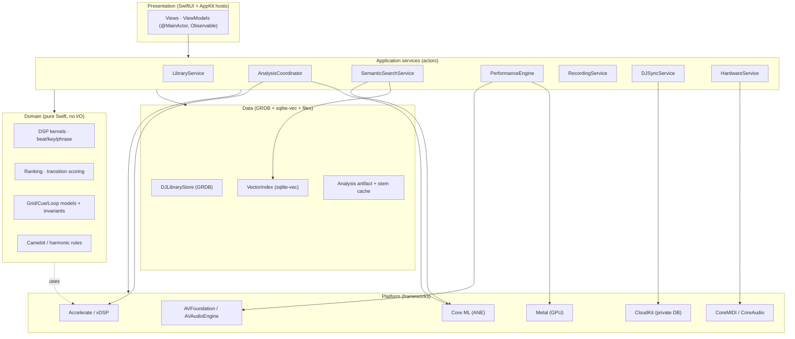

**Layering rules (enforced by module boundaries):**
1. **L1 Platform** is only touched by L4 services and a few L2 adapters. Domain (L3) never imports AVFoundation/CloudKit/Metal.
2. **L3 Domain** is pure and synchronous. Every DSP kernel, ranking function, and invariant check is a free function or value type with no `async`, no I/O, deterministic given inputs. This is what makes NFR-DET testable.
3. **L4 Application services** are the *only* place that combines I/O with logic. They are Swift **actors** (or `@MainActor` classes for UI-facing state). They own concurrency.
4. **L5 Presentation** holds no business logic beyond formatting; it observes L4 state.
5. The **real-time audio render thread lives below all of this** (CoreAudio's own thread, reached via AVAudioEngine and a `AURenderCallback`/`AVAudioSourceNode`). It communicates with L4 only through lock-free structures (§12). No Swift concurrency, no allocation, no locks on that thread.

### 8.1 The "two clocks" principle

Platterhead has two independent time domains that must not be conflated:

- **Preparation time** (wall-clock, best-effort, cancellable): analysis, embedding, search. Latency in the tens of milliseconds to seconds. Runs on background actors and `TaskPriority.background`.
- **Performance time** (sample-accurate, hard real-time): the render callback advancing sample-by-sample against the master clock. Latency budget in milliseconds; *no* best-effort work allowed.

Every subsystem in this document declares which clock it lives in. Mixing the two (e.g., calling the database from the render thread) is the cardinal sin the architecture is designed to prevent.

## 9. Swift package and module architecture

### 9.1 Package strategy

⟢ **Extend, don't fork.** The repo ships a single SPM library, `TonearmCore` (`Package.swift`). The DJ implementation introduces a second library product in the *same* package, `TonearmDJ`, that depends on `TonearmCore`. macOS-only code is compiled with `#if os(macOS)`; the DJ app target links `TonearmDJ`. This keeps shared types (entities, store, sync) singly-defined and lets the iOS companion link only `TonearmCore`.

```swift
// Package.swift (additions shown; existing TonearmCore target unchanged)
let package = Package(
    name: "TonearmCore",
    platforms: [.iOS(.v17), .macOS(.v14), .watchOS(.v10)],
    products: [
        .library(name: "TonearmCore", targets: ["TonearmCore"]),
        .library(name: "TonearmDJ",   targets: ["TonearmDJ"])   // NEW
    ],
    dependencies: [
        .package(url: "https://github.com/groue/GRDB.swift", from: "7.0.0"),
        // sqlite-vec is vendored as a C target (see §16.2), not a SwiftPM remote,
        // to keep the extension statically linked and offline-buildable.
    ],
    targets: [
        .target(name: "TonearmCore", /* ...existing... */),

        // NEW — vendored C extension for vector search
        .target(
            name: "CSQLiteVec",
            path: "Sources/CSQLiteVec",
            sources: ["sqlite-vec.c"],
            publicHeadersPath: "include",
            cSettings: [.define("SQLITE_CORE", to: "1")]
        ),

        // NEW — macOS DJ engine + analysis + shared DJ domain
        .target(
            name: "TonearmDJ",
            dependencies: [
                "TonearmCore",
                "CSQLiteVec",
                .product(name: "GRDB", package: "GRDB.swift")
            ],
            path: "Sources/DJ",
            resources: [
                .copy("Resources/CLAP"),      // Core ML .mlpackage(s)
                .copy("Resources/Demucs")     // Core ML stem model(s)
            ],
            linkerSettings: [
                .linkedFramework("Accelerate"),
                .linkedFramework("CoreML"),
                .linkedFramework("Metal"),
                .linkedFramework("MetalPerformanceShaders"),
                .linkedFramework("AVFoundation"),
                .linkedFramework("CoreMIDI"),
                .linkedLibrary("sqlite3")
            ]
        ),
        .testTarget(name: "TonearmDJTests", dependencies: ["TonearmDJ"], path: "Tests/DJ",
                    resources: [.copy("Fixtures")])
    ]
)
```

### 9.2 Module map

`TonearmDJ` is internally organized into modules (Swift files grouped by folder; not separate SPM targets, to keep build graph simple and cross-module `internal` access ergonomic). Each module has a **public façade** (an actor or namespace) and **internal** implementation.

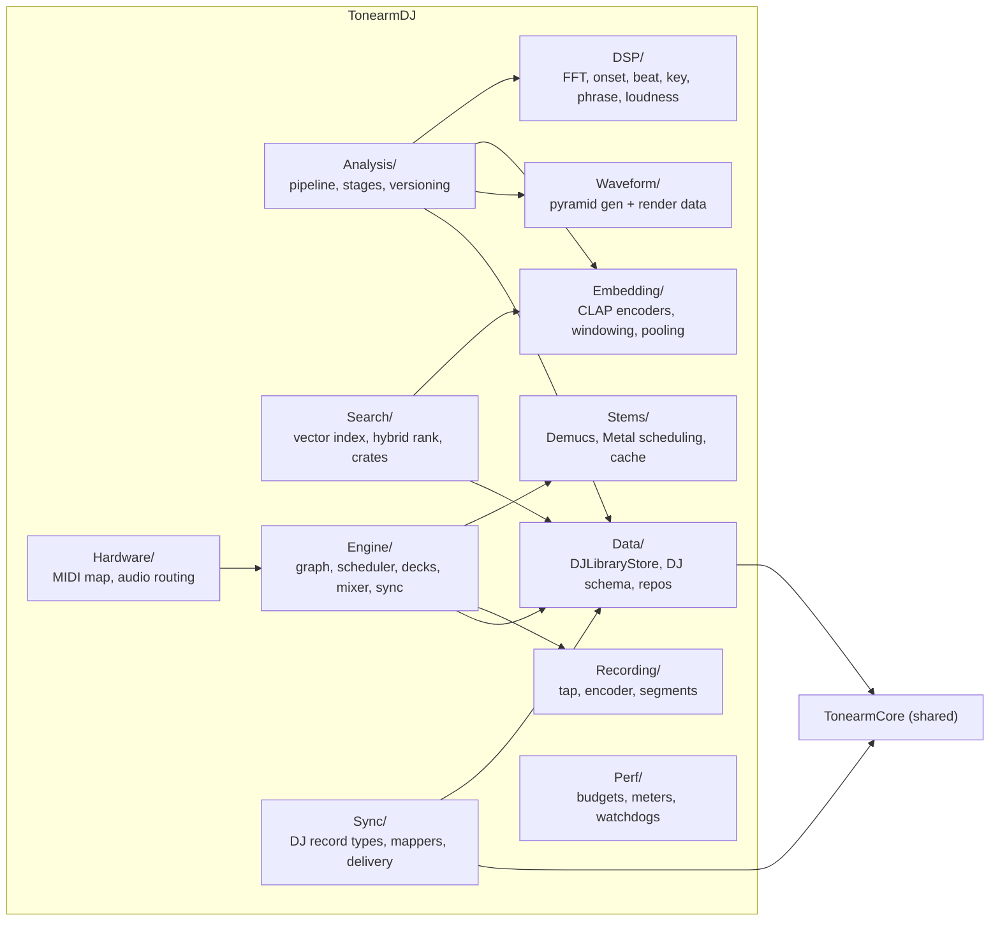

| Module | Clock | Responsibility | Key public type |
|---|---|---|---|
| `Data/` | prep | DJ tables, repositories over GRDB | `actor DJLibraryStore` |
| `DSP/` | prep (pure) | FFT, features, onset, beat, key, phrase, loudness | `enum` kernels (pure) |
| `Analysis/` | prep | Orchestrate stages, versioning, resumability | `actor AnalysisCoordinator` |
| `Embedding/` | prep | CLAP text/audio encode, windowing, pooling | `actor CLAPEmbedder` |
| `Search/` | prep | Vector index, hybrid ranking, Smart Crates | `actor SemanticSearchService` |
| `Waveform/` | prep | Multi-resolution waveform pyramids | `enum WaveformPyramid` |
| `Engine/` | perf | AVAudioEngine graph, scheduler, decks, mixer, sync | `@MainActor PerformanceEngine` + RT core |
| `Stems/` | perf-adjacent | Demucs inference, Metal scheduling, stem cache | `actor StemSeparator` |
| `Recording/` | perf-adjacent | Master tap → AAC segments → `.m4a` | `actor RecordingService` |
| `Sync/` | prep | DJ record types, mappers, CKAsset lifecycle | `enum DJRecordMapping` + `actor DJSyncService` |
| `Hardware/` | perf-adjacent | MIDI-learn, mapping store, audio device routing | `actor HardwareService` |
| `Perf/` | both | Meters, budgets, watchdogs | `actor PerformanceMonitor` |

## 10. Public module interfaces

The following listings are **normative signatures**. They define the seams an agentic implementer builds against. (Bodies are illustrative.)

### 10.1 Data façade

⟢ `DJLibraryStore` wraps a GRDB `DatabaseQueue`/`DatabasePool` exactly as `LibraryStore` does in the repo; it exposes the DJ tables. It is an `actor` for write serialization; reads use GRDB's own concurrency.

```swift
public actor DJLibraryStore {
    public static let shared = try! DJLibraryStore()

    /// Opens (and migrates) the DJ database. Shares the app-group container
    /// so the CloudKit sync layer and the app read the same file.
    public init(path: URL = DJLibraryStore.defaultURL) throws

    // Tracks & analysis
    public func upsertTrack(_ t: DJTrack) throws -> DJTrack.ID
    public func track(id: DJTrack.ID) throws -> DJTrack?
    public func tracks(matching q: LibraryQuery) throws -> [DJTrackRow]
    public func setAnalysisState(_ s: AnalysisState, for id: DJTrack.ID, version: Int) throws

    // Grids / cues / loops
    public func saveBeatGrid(_ g: BeatGrid, for id: DJTrack.ID, source: GridSource) throws
    public func beatGrid(for id: DJTrack.ID) throws -> BeatGrid?
    public func cuePoints(for id: DJTrack.ID) throws -> [CuePoint]
    public func upsertCuePoint(_ c: CuePoint) throws -> CuePoint.ID
    public func loops(for id: DJTrack.ID) throws -> [Loop]

    // Analysis artifacts (frames, phrases, waveform, loudness)
    public func saveFrames(_ f: [FFTFrame], for id: DJTrack.ID) throws
    public func savePhrases(_ p: [Phrase], for id: DJTrack.ID) throws
    public func saveWaveform(_ w: WaveformBlob, for id: DJTrack.ID) throws
    public func saveLoudness(_ l: LoudnessAnalysis, for id: DJTrack.ID) throws

    // Embeddings
    public func saveEmbeddings(track: DJTrack.ID, whole: Embedding, windows: [WindowEmbedding], version: Int) throws

    // Playlists / crates / mixes
    public func upsertSmartCrate(_ c: SmartCrate) throws -> SmartCrate.ID
    public func upsertMix(_ m: DJMix) throws -> DJMix.ID
    public func mixes() throws -> [DJMixRow]

    // Change stream for reactive UI (GRDB ValueObservation bridge)
    public nonisolated func observeTracks(_ q: LibraryQuery) -> AsyncStream<[DJTrackRow]>
}
```

### 10.2 Analysis façade

```swift
public actor AnalysisCoordinator {
    public init(store: DJLibraryStore, embedder: CLAPEmbedder, monitor: PerformanceMonitor)

    /// Enqueue a track for (re)analysis. Idempotent per (trackID, version).
    public func enqueue(_ id: DJTrack.ID, reason: AnalysisReason) async

    /// Enqueue only the stages whose version is behind current (selective re-run).
    public func reconcileVersions() async

    public func pause() async
    public func resume() async

    /// Progress stream for the Ingestion & Analysis screen.
    public nonisolated var progress: AsyncStream<AnalysisProgress> { get }
}

public enum AnalysisReason: Sendable { case newImport, fileChanged, versionUpgrade, userRequested }

public struct AnalysisProgress: Sendable {
    public let trackID: DJTrack.ID
    public let title: String
    public let stage: AnalysisStage      // .decode, .fft, .beat, .key, .phrase, .embed, .waveform, .persist
    public let stageFraction: Double     // 0...1 within stage
    public let queueDepth: Int
}
```

### 10.3 DSP kernels (pure, synchronous)

These live in `DSP/` and import only `Accelerate`. They are the substance of Part IV and are individually testable against fixtures.

```swift
public enum FFTKernel {
    /// Real FFT of a Hann-windowed frame. `log2n` fixes the transform size.
    public static func spectrum(_ frame: [Float], setup: FFTSetupHandle) -> Spectrum
}

public enum SpectralFeatures {
    public static func centroid(_ s: Spectrum) -> Float
    public static func rolloff(_ s: Spectrum, energyFraction: Float = 0.85) -> Float
    public static func flux(_ s: Spectrum, previous: Spectrum) -> Float
    public static func rms(_ frame: [Float]) -> Float
    public static func zeroCrossingRate(_ frame: [Float]) -> Float
    public static func bandEnergy(_ s: Spectrum, low: Float, high: Float) -> Float
}

public enum OnsetDetector {
    public static func envelope(frames: [Spectrum], config: OnsetConfig) -> [Float]
    public static func peaks(_ envelope: [Float], config: OnsetConfig) -> [OnsetPeak]
}

public enum TempoEstimator {
    public static func histogram(_ onsets: [OnsetPeak], config: TempoConfig) -> TempoHistogram
    public static func bpmCandidates(_ h: TempoHistogram, range: ClosedRange<Double> = 60...220) -> [BPMCandidate]
}

public enum BeatTracker {
    public static func grid(onsets: [OnsetPeak], bpm: BPMCandidate, config: BeatConfig) -> BeatGrid
    public static func downbeats(_ grid: BeatGrid, features: [FrameFeature], config: DownbeatConfig) -> [Int]
}

public enum KeyDetector {
    public static func chroma(_ frames: [ConstantQFrame], config: ChromaConfig) -> [HPCP]
    public static func estimate(_ chroma: [HPCP], config: KeyConfig) -> KeyEstimate  // key, mode, confidence
}

public enum PhraseSegmenter {
    public static func segment(features: [FrameFeature], beats: BeatGrid, config: PhraseConfig) -> [Phrase]
}

public enum LoudnessAnalyzer {
    public static func integratedLUFS(_ pcm: PCMBuffer) -> Double
    public static func replayGain(_ pcm: PCMBuffer) -> Double   // ⟢ align with TonearmCore.ReplayGain
    public static func dynamicRange(_ pcm: PCMBuffer) -> Double  // e.g., EBU DR / crest factor
}
```

### 10.4 Embedding façade

```swift
public actor CLAPEmbedder {
    public init(model: CLAPModel = .musicFP16)

    /// Whole-track + per-window audio embeddings (see §27 for windowing).
    public func embedAudio(_ pcm: PCMBuffer, config: EmbedConfig) async throws -> AudioEmbeddingResult

    /// Text → 512-d vector using the CLAP text encoder, for vibe search.
    public func embedText(_ prompt: String) async throws -> Embedding

    public nonisolated var version: Int { get }   // embedding_version
}

public struct AudioEmbeddingResult: Sendable {
    public let whole: Embedding                 // pooled 512-d
    public let windows: [WindowEmbedding]       // per-10s 512-d + time span
    public let version: Int
}
```

### 10.5 Search façade

```swift
public actor SemanticSearchService {
    public init(store: DJLibraryStore, embedder: CLAPEmbedder, index: VectorIndex)

    public func search(_ query: VibeQuery) async throws -> [SearchResult]
    public func saveCrate(_ query: VibeQuery, name: String) async throws -> SmartCrate.ID
    public func resolveCrate(_ id: SmartCrate.ID) async throws -> [SearchResult]

    /// Called by AnalysisCoordinator when embeddings change; keeps ANN index warm.
    public func indexDidChange(trackIDs: [DJTrack.ID]) async
}

public struct VibeQuery: Sendable, Codable {
    public var text: String
    public var positiveTerms: [String]     // "+ instrumental", "+ hypnotic"
    public var negativeTerms: [String]     // "– bright vocals"
    public var bpmRange: ClosedRange<Double>?
    public var compatibleWithKey: CamelotKey?   // "Compatible with Deck A · 8A"
    public var limit: Int = 100
}

public struct SearchResult: Sendable {
    public let track: DJTrackRow
    public let similarity: Float     // cosine, 0...1 (the "92% match")
    public let finalScore: Float     // hybrid score used for ordering
    public let reasons: RankBreakdown
}
```

### 10.6 Performance engine façade

The engine's *control surface* is `@MainActor` (bindable to SwiftUI); its *audio core* runs on the render thread and is reached only via the lock-free command ring (§12, §30).

```swift
@MainActor
public final class PerformanceEngine: ObservableObject {
    public static let shared = PerformanceEngine()

    @Published public private(set) var deckA: DeckState
    @Published public private(set) var deckB: DeckState
    @Published public private(set) var mixer: MixerState
    @Published public private(set) var meters: EngineMeters   // CPU/GPU/levels, updated ~30 Hz

    // Transport (enqueue RT commands; return immediately)
    public func load(_ track: DJTrack.ID, into deck: DeckID) async throws
    public func play(_ deck: DeckID)
    public func pause(_ deck: DeckID)
    public func cue(_ deck: DeckID)
    public func setPitch(_ deck: DeckID, percent: Double)      // tempo change
    public func toggleKeyLock(_ deck: DeckID)
    public func sync(_ deck: DeckID, to master: DeckID)
    public func setLoop(_ deck: DeckID, beats: Int?)
    public func triggerCue(_ deck: DeckID, _ cue: CuePoint.ID, quantize: Quantize)

    // Mixer
    public func setEQ(_ deck: DeckID, band: EQBand, gainDB: Float)
    public func setFilter(_ deck: DeckID, cutoff: Float, resonance: Float)
    public func setCrossfader(_ position: Float)               // -1...+1
    public func setStemLevel(_ deck: DeckID, stem: Stem, level: Float)
    public func setStemMute(_ deck: DeckID, stem: Stem, muted: Bool)

    // Recording
    public func startRecording() async throws
    public func stopRecording() async throws -> DJMix.ID
}
```

### 10.7 Stems, recording, sync, hardware façades

```swift
public actor StemSeparator {
    public init(model: DemucsModel = .htdemucsFP16, device: MTLDevice = MTLCreateSystemDefaultDevice()!)
    /// Offline pre-separation into cached stem files (preferred for performance).
    public func separateToCache(_ id: DJTrack.ID, pcm: PCMBuffer) async throws -> StemCacheHandle
    /// Live path: process a windowed buffer on GPU (used only when cache miss).
    public func separateLive(_ window: PCMBuffer) async throws -> StemBuffers
    public func evict(olderThan: Date) async
}

public actor RecordingService {
    public init(store: DJLibraryStore)
    public func begin(format: RecordingFormat) async throws -> RecordingHandle
    public func appendPlaylistEvent(_ e: MixTrackEvent) async
    public func finish(title: String, notes: String) async throws -> DJMix.ID
    public nonisolated var elapsed: AsyncStream<TimeInterval> { get }
}

public actor DJSyncService {
    public init(store: DJLibraryStore, engine: CloudSyncEngine = .shared)  // ⟢ reuse existing engine
    public func syncNow() async
    public func uploadMix(_ id: DJMix.ID) async throws
    public nonisolated var status: AsyncStream<DJSyncStatus> { get }
}

public actor HardwareService {
    public init()
    public func audioDevices() async -> [AudioDeviceInfo]
    public func setRouting(_ routing: ChannelRouting) async throws
    public func beginMIDILearn(for target: MIDITarget) async -> AsyncStream<MIDILearnEvent>
    public func saveMapping(_ m: MIDIMapping) async throws
    public func importMapping(_ url: URL) async throws -> MIDIMapping
}
```

## 11. Concurrency architecture (actors and isolation)

Platterhead uses Swift structured concurrency with a small number of **actors** as concurrency domains, `@MainActor` for UI-facing observable state, and a **lock-free boundary** to the audio render thread. The guiding rule: *every mutable subsystem is owned by exactly one isolation domain; cross-domain communication is by value (`Sendable`) or by lock-free ring.*

```mermaid
flowchart TB
    subgraph Main["@MainActor"]
        VMs["ViewModels · PerformanceEngine control · meters"]
    end
    subgraph Actors["Background actors (each = one domain)"]
        A1["DJLibraryStore"]:::a
        A2["AnalysisCoordinator"]:::a
        A3["CLAPEmbedder"]:::a
        A4["SemanticSearchService"]:::a
        A5["StemSeparator"]:::a
        A6["RecordingService"]:::a
        A7["DJSyncService"]:::a
        A8["HardwareService"]:::a
        A9["PerformanceMonitor"]:::a
    end
    subgraph RT["Real-time render thread (NO Swift concurrency)"]
        Ring["Lock-free command ring + atomic snapshots"]
        Render["AVAudioSourceNode render blocks"]
    end

    VMs -->|await| Actors
    VMs -->|enqueue commands| Ring
    Ring --> Render
    Render -->|lock-free meters/levels| A9
    A9 -->|await| VMs
    A2 --> A1 & A3
    A4 --> A1 & A3
    A5 --> A1
    A6 --> A1
    A7 --> A1

    classDef a fill:#181c24,stroke:#7c5cff;
```

### 11.1 Isolation rules

- **`DJLibraryStore` is the single writer** to the DJ database. All writes funnel through it (serialized by the actor). Reads may use GRDB `ValueObservation` bridged to `AsyncStream` for reactive UI; those observations run on GRDB's reader pool, not the actor, avoiding read/write contention.
- **`AnalysisCoordinator` owns the analysis queue** and a bounded task group (concurrency = number of performance cores minus a reserve; see §43). It never touches UI or the engine. It calls `CLAPEmbedder` and `DJLibraryStore`.
- **`CLAPEmbedder` serializes Core ML calls.** Core ML models are not free-threaded; the actor guarantees one prediction at a time per model and lets Core ML schedule the ANE. Text and audio encoders may be separate models behind one actor.
- **`StemSeparator` serializes GPU submission.** It owns the `MTLCommandQueue` and the stem cache. Live separation and cache eviction cannot race.
- **`PerformanceEngine` (control) is `@MainActor`.** It is bindable and cheap. It does *not* do audio work; it translates user intent into commands pushed onto the lock-free ring and updates published state from meter callbacks.
- **The render thread is outside Swift concurrency entirely.** It is created and managed by CoreAudio via AVAudioEngine. Our render blocks (`AVAudioSourceNode`) must be `@Sendable`, allocation-free, lock-free, and wait-free. They read an **atomic engine snapshot** (double-buffered) and drain a **single-producer/single-consumer command ring**. See §12 and §30.

### 11.2 Sendability and data transfer

- All types crossing an actor boundary are `Sendable`. Value types (`struct`, `enum`) dominate the domain layer for this reason.
- Large buffers (PCM, stem audio) are transferred as `@unchecked Sendable` wrappers around immutable, uniquely-owned storage (`class PCMBuffer` with copy-on-handoff discipline) to avoid copies while keeping the compiler's guarantees meaningful. Ownership is transferred, not shared.
- The render thread never receives a Swift object by reference from an actor. It receives **plain-old-data** written into pre-allocated ring slots (§12.2).

### 11.3 Cancellation and priority

- Analysis and embedding run at `TaskPriority.background`. Search runs at `.userInitiated`. Loading a deck runs at `.userInitiated` but its RT arming is immediate.
- Every long task checks `Task.isCancelled` between stages; the `AnalysisCoordinator` cancels in-flight work for a track if the file changes again or the user removes it.
- Priority inversion is avoided at the render boundary because the render thread never waits on an actor; it only reads lock-free state.

## 12. Thread, queue, and real-time execution model

This section defines the **hard real-time boundary** — the single most important correctness property in the product (NFR-PERF-1).

### 12.1 Threads and queues inventory

| Domain | Mechanism | Priority | May block? |
|---|---|---|---|
| UI | Main thread / `@MainActor` | user-interactive | No long blocks |
| Analysis | Actor + `TaskGroup` | background | Yes (disk, ANE) |
| Embedding | Actor, serial Core ML | background/user-init | Yes (ANE) |
| Search | Actor | user-initiated | Yes (SQLite) |
| Stems (offline) | Actor, serial Metal queue | user-initiated | Yes (GPU) |
| Recording | Actor + `AVAudioFile` writer | user-initiated | Yes (disk) |
| **Audio render** | **CoreAudio thread (HAL)** | **real-time** | **NEVER** |
| Sync | Actor → `CKSyncEngine` | utility | Yes (network) |

### 12.2 The lock-free boundary

Between `@MainActor` control and the render thread sit two structures, both pre-allocated at engine start and never reallocated:

1. **Command ring (SPSC).** A fixed-capacity, single-producer (main)/single-consumer (render) ring buffer of POD `RTCommand` values. Producer writes with release semantics; consumer reads with acquire semantics; head/tail are `atomic`. Commands are small (tag + union payload): `play/pause/cue/setPitch/setEQ/setXfader/setStemLevel/triggerCue/setLoop/...`. The render block drains up to *N* commands at the top of each callback, applies them to its private RT state, and returns.

```swift
// Illustrative shape; real impl uses C atomics or Swift Atomics package.
struct RTCommand {              // POD, trivially copyable, fixed size
    enum Tag: UInt8 { case play, pause, cue, setPitch, setEQ, setXfader,
                          setStemLevel, setStemMute, triggerCue, setLoop, loadArm }
    var tag: Tag
    var deck: UInt8             // 0 = A, 1 = B
    var i0: Int64              // e.g., cue sample position, loop length in beats
    var f0: Float              // e.g., gain dB, xfader position, level
    var f1: Float
    var ptr: UnsafeRawPointer? // e.g., pre-armed track render source (ownership transferred)
}

final class CommandRing {       // capacity is power of two
    private let capacity: Int
    private let buffer: UnsafeMutablePointer<RTCommand>
    private var head = ManagedAtomic<Int>(0)   // consumer (render)
    private var tail = ManagedAtomic<Int>(0)   // producer (main)

    /// Main thread. Returns false if full (caller coalesces or drops non-critical).
    func tryPush(_ cmd: RTCommand) -> Bool { /* CAS-free SPSC push */ }

    /// Render thread. Wait-free drain.
    @inline(__always) func drain(_ apply: (RTCommand) -> Void) { /* ... */ }
}
```

2. **Engine snapshot (double-buffered, atomic pointer swap).** For state too large or too structured for the ring (e.g., a newly computed beat grid, a swapped-in stem buffer set, a full EQ coefficient set), the producer builds an immutable snapshot off-thread, then publishes it with a single atomic pointer store. The render thread reads the current pointer once per callback with acquire semantics. The previous snapshot is reclaimed later on a non-RT thread (a simple retire list drained by the control side), never freed on the render thread.

### 12.3 The render callback contract

Each `AVAudioSourceNode` render block MUST:
- allocate nothing (no Swift `Array`, no `String`, no ARC traffic on non-`Unmanaged` objects);
- take no locks and call nothing that might (no `os_unfair_lock` held across work, no `NSLock`, no `print`, no logging that allocates);
- perform only bounded arithmetic and memory reads/writes on pre-allocated buffers;
- read the command ring and current snapshot exactly as described;
- write output frames and update *atomic* meter counters (peak, RMS) that the `PerformanceMonitor` samples at ~30 Hz.

Violations are caught in review and by a debug-only "RT assertion" shim that traps if allocation/locking is detected on the render thread (see §46.3).

### 12.4 Why AVAudioSourceNode (not a raw AURemoteIO)

`AVAudioSourceNode`/`AVAudioSinkNode` give us render blocks with full control while letting AVAudioEngine own device management, format conversion, and the multichannel `AVAudioEngine`↔device plumbing we need for cue/master routing (§29, §44). We get the deterministic callback we require without hand-rolling the HAL, and we keep the option to attach Apple's `AVAudioUnitTimePitch` and `AVAudioUnitEQ` where they meet quality/latency needs (§31, §35).

---
---

# Part III — Data Layer

## 13. Data architecture and storage engines

Platterhead persists three qualitatively different kinds of data, each with a matched engine:

1. **Relational + queryable state** — tracks, cues, loops, phrases, grids, playlists, mixes, hardware maps. Engine: **SQLite via GRDB 7** (⟢ the version already in `Package.swift`), WAL mode, one authoritative writer (`DJLibraryStore` actor). This is where editable, joinable, syncable state lives.
2. **Dense numeric arrays** — per-frame FFT features, onset envelopes, beat positions, energy curves, waveform pyramids, and embedding vectors. Storing one SQLite row per frame/beat would mean millions of rows per library and pathological write amplification. Instead these are stored as **compact binary BLOBs** with documented, versioned layouts, in "header" rows that carry metadata and a `format` byte. (⟢ mirrors the repo's `cache_entry.byteRanges` blob approach.)
3. **Vector search** — whole-track and per-window 512-D embeddings indexed for cosine ANN. Engine: **sqlite-vec** virtual tables in the *same* database file, so search joins directly against `track` without a second store (§16).

Large media on disk (stem caches, mix `.m4a` files) are **files referenced by path**, never blobs in SQLite. The database stores their locations, sizes, and lifecycle state.

### 13.1 Database files and locations

| File | Owner | Contents | Sync? |
|---|---|---|---|
| `tonearm-dj.sqlite` (+ `-wal`, `-shm`) | `DJLibraryStore` | all relational + analysis-header + vector tables | rows sync selectively via CloudKit |
| `Stems/<sha256>/*.caf` | `StemSeparator` | cached separated stems | never |
| `Mixes/<uuid>.m4a` | `RecordingService` | recorded mixes | as `CKAsset` when user opts in |
| `Waveforms/` (optional overflow) | `DJLibraryStore` | oversized waveform pyramids if not inlined | never |

The database lives in the app-group container so the (Mac-only) app and its helpers share one file. On iOS, only mix-related records are materialized (§39); the iOS app does not carry the analysis tables.

### 13.2 Conventions (aligned to the existing repo)

- **Table names** `snake_case`; **columns** `camelCase` (dominant repo style, e.g. `addedAt`, `followUpdates`).
- Every syncable table carries a **`syncID TEXT`** (UUID string) — the cross-device identity CloudKit uses (⟢ exactly as `RecordMapping` does; see §38). Local integer PKs are never sent over the wire.
- Foreign keys use `.references(onDelete:)` with explicit cascade/set-null semantics.
- Timestamps are stored as SQLite `datetime` (GRDB `Date`).
- All migrations are registered in an ordered list in `DJSchema` (⟢ mirrors `Schema.migrationOrder`), named `dj_v1`, `dj_v2`, ….
- **Analysis-version columns** (`analysisVersion`, `embeddingVersion`) are integers gating selective re-run (§17).
- BLOB layouts begin with a 1-byte `format` tag and are documented in §15.7 and Appendix C.

### 13.3 Table inventory (46 tables + 2 virtual)

Grouped by domain; DDL follows. Virtual (sqlite-vec) tables marked ▲.

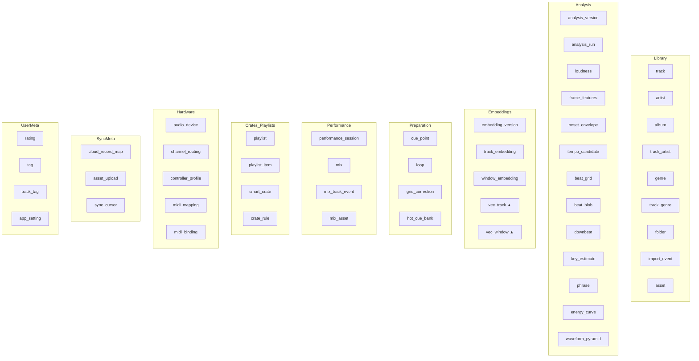

## 14. Complete SQLite schema — relational core (`Library`, `Preparation`, `Crates`, `UserMeta`)

The DDL below is presented as GRDB migration bodies. Migration `dj_v1` creates the library + preparation + crate + user-meta core; `dj_v2` (§15) adds analysis/embedding/performance/hardware/sync tables. (Splitting is cosmetic; both ship in v1.0.)

### 14.1 Library domain

```swift
migrator.registerMigration("dj_v1") { db in

    // ---- artist ----
    try db.create(table: "artist") { t in
        t.autoIncrementedPrimaryKey("id")
        t.column("syncID", .text).notNull().unique()
        t.column("name", .text).notNull()
        t.column("sortName", .text).notNull()
        t.column("createdAt", .datetime).notNull()
    }
    try db.create(indexOn: "artist", columns: ["sortName"])

    // ---- album ----
    try db.create(table: "album") { t in
        t.autoIncrementedPrimaryKey("id")
        t.column("syncID", .text).notNull().unique()
        t.column("title", .text).notNull()
        t.column("albumArtist", .text)
        t.column("year", .integer)
        t.column("artworkID", .text)              // hash key into artwork cache (local)
        t.column("createdAt", .datetime).notNull()
    }

    // ---- track (DJ-authoritative library row) ----
    try db.create(table: "track") { t in
        t.autoIncrementedPrimaryKey("id")
        t.column("syncID", .text).notNull().unique()
        t.column("albumID", .integer).references("album", onDelete: .setNull)
        t.column("title", .text).notNull()
        t.column("trackNo", .integer)
        t.column("discNo", .integer)
        t.column("durationSec", .double)
        t.column("codec", .text)                  // "flac","alac","mp3","aac","wav","aiff","opus"
        t.column("sampleRate", .integer)          // source sample rate
        t.column("channelCount", .integer)
        t.column("bitDepthOrBitrate", .text)
        t.column("contentHash", .text).notNull()  // SHA-256 of decoded PCM header + file id (⟢ CacheKeyGenerator style)
        t.column("sortKey", .text).notNull()
        // denormalized analysis summary for fast library listing (FR-LIB-4)
        t.column("bpm", .double)                  // authoritative (corrected) BPM
        t.column("detectedBPM", .double)
        t.column("camelot", .text)                // "8A"
        t.column("musicalKey", .text)             // "A minor"
        t.column("energy", .double)               // 0...10 summary (FR-PREP-4)
        t.column("analysisVersion", .integer).notNull().defaults(to: 0)
        t.column("embeddingVersion", .integer).notNull().defaults(to: 0)
        t.column("analysisState", .text).notNull().defaults(to: "pending") // see AnalysisState
        t.column("stemState", .text).notNull().defaults(to: "none")        // none|caching|ready
        t.column("addedAt", .datetime).notNull()
        t.column("updatedAt", .datetime).notNull()
    }
    try db.create(indexOn: "track", columns: ["sortKey"])
    try db.create(indexOn: "track", columns: ["bpm"])
    try db.create(indexOn: "track", columns: ["camelot"])
    try db.create(indexOn: "track", columns: ["analysisState"])

    // ---- track_artist (many-to-many, ordered, role) ----
    try db.create(table: "track_artist") { t in
        t.autoIncrementedPrimaryKey("id")
        t.column("trackID", .integer).notNull().references("track", onDelete: .cascade)
        t.column("artistID", .integer).notNull().references("artist", onDelete: .cascade)
        t.column("role", .text).notNull().defaults(to: "primary")   // primary|feature|remixer
        t.column("position", .integer).notNull().defaults(to: 0)
    }
    try db.create(index: "idx_track_artist_track", on: "track_artist", columns: ["trackID"])

    // ---- genre + track_genre ----
    try db.create(table: "genre") { t in
        t.autoIncrementedPrimaryKey("id")
        t.column("name", .text).notNull().unique()
    }
    try db.create(table: "track_genre") { t in
        t.column("trackID", .integer).notNull().references("track", onDelete: .cascade)
        t.column("genreID", .integer).notNull().references("genre", onDelete: .cascade)
        t.primaryKey(["trackID", "genreID"])
    }

    // ---- folder (watched directories; ⟢ populated by TonearmCore FolderWatchService adapter) ----
    try db.create(table: "folder") { t in
        t.autoIncrementedPrimaryKey("id")
        t.column("syncID", .text).notNull().unique()
        t.column("displayPath", .text).notNull()   // "~/Music/Platterhead", "/Volumes/DJ Archive"
        t.column("bookmark", .blob).notNull()       // security-scoped bookmark (⟢ BookmarkVault)
        t.column("watching", .boolean).notNull().defaults(to: true)
        t.column("addedAt", .datetime).notNull()
        t.column("lastScanAt", .datetime)
    }

    // ---- asset (file reference for a track; never a copy) ----
    try db.create(table: "asset") { t in
        t.autoIncrementedPrimaryKey("id")
        t.column("trackID", .integer).notNull().references("track", onDelete: .cascade)
        t.column("folderID", .integer).references("folder", onDelete: .setNull)
        t.column("bookmark", .blob)                 // security-scoped bookmark to the file
        t.column("relPath", .text)                  // path relative to folder, for display/rescan
        t.column("sizeBytes", .integer)
        t.column("fileModifiedAt", .datetime)       // for change detection (FR-LIB-2)
        t.column("unsupportedReason", .text)        // non-null if file can't be decoded
    }
    try db.create(index: "idx_asset_track", on: "asset", columns: ["trackID"])

    // ---- import_event (audit of ingestion) ----
    try db.create(table: "import_event") { t in
        t.autoIncrementedPrimaryKey("id")
        t.column("trackID", .integer).references("track", onDelete: .setNull)
        t.column("kind", .text).notNull()           // discovered|reanalyzed|removed|error
        t.column("detail", .text)
        t.column("at", .datetime).notNull()
    }
```

### 14.2 Preparation domain (cues, loops, grid corrections)

```swift
    // ---- cue_point (hot cues + named markers; FR-PREP-2) ----
    try db.create(table: "cue_point") { t in
        t.autoIncrementedPrimaryKey("id")
        t.column("syncID", .text).notNull().unique()
        t.column("trackID", .integer).notNull().references("track", onDelete: .cascade)
        t.column("samplePosition", .integer).notNull()   // sample-accurate (Int64)
        t.column("kind", .text).notNull().defaults(to: "hot")  // hot|load|fade|grid|memory
        t.column("label", .text)                          // "Intro","Bass enters","Breakdown"
        t.column("colorIndex", .integer).notNull().defaults(to: 0)
        t.column("hotIndex", .integer)                    // A=0,B=1,... nullable if not a pad
        t.column("createdAt", .datetime).notNull()
        t.column("updatedAt", .datetime).notNull()
    }
    try db.create(index: "idx_cue_track", on: "cue_point", columns: ["trackID"])

    // ---- hot_cue_bank (per-track pad layout metadata; optional grouping) ----
    try db.create(table: "hot_cue_bank") { t in
        t.autoIncrementedPrimaryKey("id")
        t.column("trackID", .integer).notNull().references("track", onDelete: .cascade)
        t.column("bankIndex", .integer).notNull().defaults(to: 0)
        t.column("name", .text)
    }

    // ---- loop (in/out, beats; snaps to grid; FR-PREP-3) ----
    try db.create(table: "loop") { t in
        t.autoIncrementedPrimaryKey("id")
        t.column("syncID", .text).notNull().unique()
        t.column("trackID", .integer).notNull().references("track", onDelete: .cascade)
        t.column("startSample", .integer).notNull()
        t.column("endSample", .integer).notNull()
        t.column("lengthBeats", .double)                  // e.g., 4, 8, 0.5 (grid-relative)
        t.column("label", .text)
        t.column("isActive", .boolean).notNull().defaults(to: false)
        t.column("createdAt", .datetime).notNull()
    }
    try db.create(index: "idx_loop_track", on: "loop", columns: ["trackID"])

    // ---- grid_correction (authoritative user override log; FR-ANL-5) ----
    try db.create(table: "grid_correction") { t in
        t.autoIncrementedPrimaryKey("id")
        t.column("syncID", .text).notNull().unique()
        t.column("trackID", .integer).notNull().references("track", onDelete: .cascade)
        t.column("op", .text).notNull()                   // nudge|setDownbeat|doubleBPM|halveBPM|setBPM|shift
        t.column("valueDouble", .double)                  // e.g., new BPM, nudge ms
        t.column("valueInt", .integer)                    // e.g., sample offset
        t.column("appliedAt", .datetime).notNull()
    }
```

### 14.3 Crates & playlists domain

```swift
    // ---- playlist (static, ordered) ----
    try db.create(table: "playlist") { t in
        t.autoIncrementedPrimaryKey("id")
        t.column("syncID", .text).notNull().unique()
        t.column("title", .text).notNull()
        t.column("kind", .text).notNull().defaults(to: "manual")   // manual|performance
        t.column("createdAt", .datetime).notNull()
        t.column("updatedAt", .datetime).notNull()
    }
    try db.create(table: "playlist_item") { t in
        t.autoIncrementedPrimaryKey("id")
        t.column("playlistID", .integer).notNull().references("playlist", onDelete: .cascade)
        t.column("trackID", .integer).notNull().references("track", onDelete: .cascade)
        t.column("position", .integer).notNull()
    }
    try db.create(index: "idx_pli_playlist", on: "playlist_item", columns: ["playlistID", "position"])

    // ---- smart_crate (a stored VibeQuery; resolves live; FR-SEM-5) ----
    try db.create(table: "smart_crate") { t in
        t.autoIncrementedPrimaryKey("id")
        t.column("syncID", .text).notNull().unique()
        t.column("name", .text).notNull()
        t.column("queryJSON", .text).notNull()            // encoded VibeQuery
        t.column("pinned", .boolean).notNull().defaults(to: false)
        t.column("createdAt", .datetime).notNull()
        t.column("updatedAt", .datetime).notNull()
    }
    // ---- crate_rule (optional normalized constraints for non-semantic crates) ----
    try db.create(table: "crate_rule") { t in
        t.autoIncrementedPrimaryKey("id")
        t.column("crateID", .integer).notNull().references("smart_crate", onDelete: .cascade)
        t.column("field", .text).notNull()                // bpm|camelot|energy|genre|rating|addedAt
        t.column("op", .text).notNull()                   // between|eq|gte|lte|in
        t.column("valueJSON", .text).notNull()
    }
```

### 14.4 User-meta domain (ratings, tags, settings)

```swift
    // ---- rating ----
    try db.create(table: "rating") { t in
        t.column("trackID", .integer).notNull().references("track", onDelete: .cascade)
        t.column("syncID", .text).notNull().unique()
        t.column("stars", .integer).notNull()             // 0...5
        t.column("updatedAt", .datetime).notNull()
        t.primaryKey(["trackID"])
    }
    // ---- tag + track_tag ----
    try db.create(table: "tag") { t in
        t.autoIncrementedPrimaryKey("id")
        t.column("syncID", .text).notNull().unique()
        t.column("name", .text).notNull().unique()
        t.column("colorIndex", .integer).notNull().defaults(to: 0)
    }
    try db.create(table: "track_tag") { t in
        t.column("trackID", .integer).notNull().references("track", onDelete: .cascade)
        t.column("tagID", .integer).notNull().references("tag", onDelete: .cascade)
        t.primaryKey(["trackID", "tagID"])
    }
    // ---- app_setting (typed key/value; ⟢ analog to AppSettings sync singleton) ----
    try db.create(table: "app_setting") { t in
        t.column("key", .text).notNull()
        t.column("valueJSON", .text).notNull()
        t.column("updatedAt", .datetime).notNull()
        t.primaryKey(["key"])
    }
} // end dj_v1
```

### 14.5 Library ER diagram

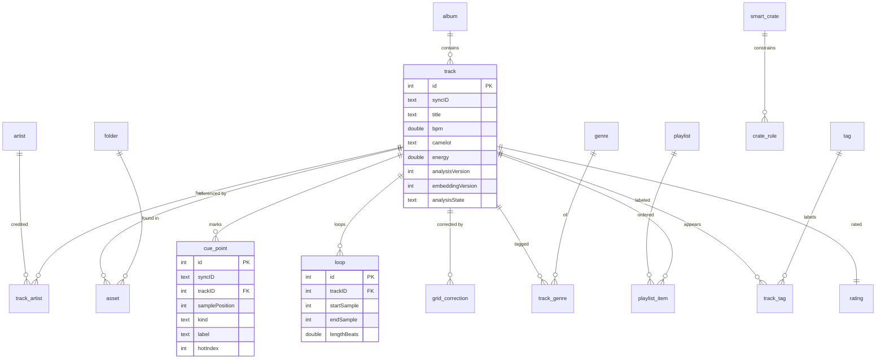

## 15. Complete SQLite schema — analysis, embeddings, performance, hardware, sync (`dj_v2`)

### 15.1 Analysis versioning & run-state

```swift
migrator.registerMigration("dj_v2") { db in

    // ---- analysis_version (registry of algorithm sets) ----
    try db.create(table: "analysis_version") { t in
        t.column("stage", .text).notNull()          // fft|beat|key|phrase|loudness|waveform|embedding
        t.column("version", .integer).notNull()
        t.column("descriptor", .text).notNull()     // human note, e.g., "HPCP+Krumhansl v3"
        t.column("introducedAt", .datetime).notNull()
        t.primaryKey(["stage", "version"])
    }

    // ---- analysis_run (per track, per stage: the resumable state machine; NFR-REL-1) ----
    try db.create(table: "analysis_run") { t in
        t.autoIncrementedPrimaryKey("id")
        t.column("trackID", .integer).notNull().references("track", onDelete: .cascade)
        t.column("stage", .text).notNull()
        t.column("version", .integer).notNull()
        t.column("state", .text).notNull()          // pending|running|done|failed|skipped
        t.column("attempts", .integer).notNull().defaults(to: 0)
        t.column("lastError", .text)
        t.column("startedAt", .datetime)
        t.column("finishedAt", .datetime)
        t.column("durationMS", .integer)
    }
    try db.create(index: "idx_run_track_stage", on: "analysis_run", columns: ["trackID", "stage"])
    try db.create(index: "idx_run_state", on: "analysis_run", columns: ["state"])
```

### 15.2 Loudness & dynamic range

```swift
    // ---- loudness (LUFS + ReplayGain + DR; FR-ANL-1) ----
    try db.create(table: "loudness") { t in
        t.column("trackID", .integer).notNull().references("track", onDelete: .cascade)
        t.column("integratedLUFS", .double)         // ITU-R BS.1770
        t.column("truePeakDBTP", .double)
        t.column("replayGainDB", .double)           // ⟢ compatible with TonearmCore.ReplayGain
        t.column("dynamicRangeDB", .double)         // crest / EBU DR
        t.column("loudnessRangeLU", .double)        // LRA
        t.column("version", .integer).notNull()
        t.primaryKey(["trackID"])
    }
```

### 15.3 Spectral / temporal analysis (headers + BLOBs)

Dense arrays are stored as BLOBs (§15.7). Editable/queryable structures (tempo candidates, phrases, key) are normalized rows.

```swift
    // ---- frame_features (one BLOB per track: N frames × M features) ----
    try db.create(table: "frame_features") { t in
        t.column("trackID", .integer).notNull().references("track", onDelete: .cascade)
        t.column("frameCount", .integer).notNull()
        t.column("hopSize", .integer).notNull()     // samples between frames
        t.column("fftSize", .integer).notNull()
        t.column("sampleRate", .integer).notNull()
        t.column("featureMask", .integer).notNull() // bitmask of which features present
        t.column("blob", .blob).notNull()           // FrameFeatures binary layout (§15.7)
        t.column("version", .integer).notNull()
        t.primaryKey(["trackID"])
    }

    // ---- onset_envelope (one BLOB per track: Float32 novelty curve) ----
    try db.create(table: "onset_envelope") { t in
        t.column("trackID", .integer).notNull().references("track", onDelete: .cascade)
        t.column("sampleRate", .double).notNull()   // envelope frame rate (Hz)
        t.column("count", .integer).notNull()
        t.column("blob", .blob).notNull()
        t.column("version", .integer).notNull()
        t.primaryKey(["trackID"])
    }

    // ---- tempo_candidate (top-K BPM hypotheses with confidence; FR-ANL-4) ----
    try db.create(table: "tempo_candidate") { t in
        t.autoIncrementedPrimaryKey("id")
        t.column("trackID", .integer).notNull().references("track", onDelete: .cascade)
        t.column("bpm", .double).notNull()
        t.column("confidence", .double).notNull()
        t.column("rank", .integer).notNull()        // 0 = best
    }
    try db.create(index: "idx_tempo_track", on: "tempo_candidate", columns: ["trackID", "rank"])

    // ---- beat_grid (header; authoritative grid metadata) ----
    try db.create(table: "beat_grid") { t in
        t.column("trackID", .integer).notNull().references("track", onDelete: .cascade)
        t.column("syncID", .text).notNull().unique()
        t.column("bpm", .double).notNull()          // grid tempo (may be corrected)
        t.column("firstBeatSample", .integer).notNull()
        t.column("beatCount", .integer).notNull()
        t.column("isConstantTempo", .boolean).notNull().defaults(to: true)
        t.column("source", .text).notNull()         // detected|corrected|imported
        t.column("confidence", .double)
        t.column("version", .integer).notNull()
        t.column("updatedAt", .datetime).notNull()
        t.primaryKey(["trackID"])
    }

    // ---- beat_blob (per-beat sample positions + confidence, for variable tempo) ----
    try db.create(table: "beat_blob") { t in
        t.column("trackID", .integer).notNull().references("track", onDelete: .cascade)
        t.column("blob", .blob).notNull()           // Int64 sample positions + Float32 confidence (§15.7)
        t.primaryKey(["trackID"])
    }

    // ---- downbeat (bar starts; anchors phrase & "1") ----
    try db.create(table: "downbeat") { t in
        t.autoIncrementedPrimaryKey("id")
        t.column("trackID", .integer).notNull().references("track", onDelete: .cascade)
        t.column("beatIndex", .integer).notNull()   // index into beat grid
        t.column("samplePosition", .integer).notNull()
        t.column("barNumber", .integer).notNull()
        t.column("confidence", .double)
    }
    try db.create(index: "idx_downbeat_track", on: "downbeat", columns: ["trackID"])

    // ---- key_estimate (global + optional per-segment) ----
    try db.create(table: "key_estimate") { t in
        t.autoIncrementedPrimaryKey("id")
        t.column("trackID", .integer).notNull().references("track", onDelete: .cascade)
        t.column("scope", .text).notNull().defaults(to: "global") // global|segment
        t.column("startSample", .integer)          // null for global
        t.column("endSample", .integer)
        t.column("camelot", .text).notNull()        // "8A"
        t.column("tonic", .integer).notNull()       // 0..11 (C=0)
        t.column("mode", .text).notNull()           // major|minor
        t.column("confidence", .double).notNull()
        t.column("version", .integer).notNull()
    }
    try db.create(index: "idx_key_track", on: "key_estimate", columns: ["trackID", "scope"])

    // ---- phrase (intro/verse/chorus/breakdown/drop/outro; FR-ANL-1, FR-PREP-4) ----
    try db.create(table: "phrase") { t in
        t.autoIncrementedPrimaryKey("id")
        t.column("syncID", .text).notNull().unique()
        t.column("trackID", .integer).notNull().references("track", onDelete: .cascade)
        t.column("startSample", .integer).notNull()
        t.column("endSample", .integer).notNull()
        t.column("startBeat", .integer)
        t.column("lengthBeats", .integer)           // e.g., 32
        t.column("type", .text).notNull()           // intro|verse|build|chorus|breakdown|drop|outro
        t.column("energy", .double)                 // 0...10 within phrase
        t.column("confidence", .double)
        t.column("version", .integer).notNull()
    }
    try db.create(index: "idx_phrase_track", on: "phrase", columns: ["trackID", "startSample"])

    // ---- energy_curve (BLOB: Float32 per-beat or per-frame energy 0...1) ----
    try db.create(table: "energy_curve") { t in
        t.column("trackID", .integer).notNull().references("track", onDelete: .cascade)
        t.column("resolution", .text).notNull()     // beat|frame
        t.column("count", .integer).notNull()
        t.column("blob", .blob).notNull()
        t.column("version", .integer).notNull()
        t.primaryKey(["trackID"])
    }

    // ---- waveform_pyramid (multi-resolution min/max/rms; §26) ----
    try db.create(table: "waveform_pyramid") { t in
        t.column("trackID", .integer).notNull().references("track", onDelete: .cascade)
        t.column("levels", .integer).notNull() // number of resolution levels
        t.column("baseSamplesPerBin", .integer).notNull()
        t.column("channelLayout", .text).notNull()  // mono|stereo-sum|stereo-split
        t.column("blob", .blob).notNull()           // packed per-level {min,max,rms} + optional band-split
        t.column("version", .integer).notNull()
        t.primaryKey(["trackID"])
    }
```

### 15.4 Embeddings

```swift
    // ---- embedding_version ----
    try db.create(table: "embedding_version") { t in
        t.column("version", .integer).notNull()
        t.column("modelName", .text).notNull()      // e.g., "music-clap-fp16"
        t.column("dimensions", .integer).notNull()  // 512
        t.column("windowSeconds", .double).notNull()
        t.column("hopSeconds", .double).notNull()
        t.column("pooling", .text).notNull()        // mean|attention
        t.column("introducedAt", .datetime).notNull()
        t.primaryKey(["version"])
    }

    // ---- track_embedding (whole-track pooled vector) ----
    try db.create(table: "track_embedding") { t in
        t.column("trackID", .integer).notNull().references("track", onDelete: .cascade)
        t.column("dims", .integer).notNull()
        t.column("vector", .blob).notNull()         // Float32[dims], L2-normalized
        t.column("version", .integer).notNull()
        t.primaryKey(["trackID"])
    }

    // ---- window_embedding (per-10s vectors for intra-song similarity; §27) ----
    try db.create(table: "window_embedding") { t in
        t.autoIncrementedPrimaryKey("id")
        t.column("trackID", .integer).notNull().references("track", onDelete: .cascade)
        t.column("windowIndex", .integer).notNull()
        t.column("startSample", .integer).notNull()
        t.column("endSample", .integer).notNull()
        t.column("vector", .blob).notNull()         // Float32[dims], L2-normalized
        t.column("version", .integer).notNull()
    }
    try db.create(index: "idx_winemb_track", on: "window_embedding", columns: ["trackID", "windowIndex"])
```

### 15.5 Performance & mixes

```swift
    // ---- performance_session (a DJ set in progress or completed) ----
    try db.create(table: "performance_session") { t in
        t.autoIncrementedPrimaryKey("id")
        t.column("syncID", .text).notNull().unique()
        t.column("startedAt", .datetime).notNull()
        t.column("endedAt", .datetime)
        t.column("deckAStartTrackID", .integer).references("track", onDelete: .setNull)
        t.column("deckBStartTrackID", .integer).references("track", onDelete: .setNull)
    }

    // ---- mix (recorded output; FR-REC-1) ----
    try db.create(table: "mix") { t in
        t.autoIncrementedPrimaryKey("id")
        t.column("syncID", .text).notNull().unique()
        t.column("sessionID", .integer).references("performance_session", onDelete: .setNull)
        t.column("title", .text).notNull()
        t.column("notes", .text)
        t.column("durationSec", .double).notNull()
        t.column("trackCount", .integer).notNull()
        t.column("format", .text).notNull()          // "m4a-aac-256"
        t.column("bitrateKbps", .integer)
        t.column("sizeBytes", .integer)
        t.column("artworkID", .text)                 // locally generated
        t.column("recordedAt", .datetime).notNull()
        t.column("syncPolicy", .text).notNull().defaults(to: "localOnly") // localOnly|syncToPhone
        t.column("localState", .text).notNull().defaults(to: "complete")  // recording|complete|corrupt
    }
    try db.create(index: "idx_mix_recordedAt", on: "mix", columns: ["recordedAt"])

    // ---- mix_track_event (playlist history within a mix; FR-REC-2) ----
    try db.create(table: "mix_track_event") { t in
        t.autoIncrementedPrimaryKey("id")
        t.column("mixID", .integer).notNull().references("mix", onDelete: .cascade)
        t.column("trackID", .integer).references("track", onDelete: .setNull)
        t.column("title", .text).notNull()           // snapshot (survives track deletion)
        t.column("artist", .text)
        t.column("deck", .text).notNull()            // A|B
        t.column("startOffsetSec", .double).notNull() // position within the mix
        t.column("bpmAtPlay", .double)
        t.column("camelotAtPlay", .text)
        t.column("position", .integer).notNull()      // 1..n order
    }
    try db.create(index: "idx_mte_mix", on: "mix_track_event", columns: ["mixID", "position"])

    // ---- mix_asset (local file + CKAsset lifecycle; §38.6) ----
    try db.create(table: "mix_asset") { t in
        t.column("mixID", .integer).notNull().references("mix", onDelete: .cascade)
        t.column("localRelPath", .text).notNull()     // "Mixes/<uuid>.m4a"
        t.column("ckRecordName", .text)               // "DJMix-<syncID>"
        t.column("ckAssetUploaded", .boolean).notNull().defaults(to: false)
        t.column("uploadedBytes", .integer).notNull().defaults(to: 0)
        t.column("totalBytes", .integer)
        t.column("lastUploadAt", .datetime)
        t.primaryKey(["mixID"])
    }
```

### 15.6 Hardware & sync-meta

```swift
    // ---- audio_device (enumerated CoreAudio outputs; FR-HW-1) ----
    try db.create(table: "audio_device") { t in
        t.autoIncrementedPrimaryKey("id")
        t.column("uid", .text).notNull().unique()     // CoreAudio device UID (stable)
        t.column("name", .text).notNull()             // "Pioneer DJM-750MK2"
        t.column("outputChannels", .integer).notNull()
        t.column("sampleRate", .double)
        t.column("bitDepth", .integer)
        t.column("lastSeenAt", .datetime).notNull()
    }

    // ---- channel_routing (role → device channel map; FR-HW-1) ----
    try db.create(table: "channel_routing") { t in
        t.autoIncrementedPrimaryKey("id")
        t.column("deviceUID", .text).notNull()
        t.column("role", .text).notNull()             // master|cue|deckAStems|deckBStems
        t.column("channelLow", .integer).notNull()    // e.g., 1
        t.column("channelHigh", .integer).notNull()   // e.g., 2
        t.column("updatedAt", .datetime).notNull()
    }
    try db.create(index: "idx_routing_device", on: "channel_routing", columns: ["deviceUID"])

    // ---- controller_profile (a mapped MIDI controller; FR-HW-2) ----
    try db.create(table: "controller_profile") { t in
        t.autoIncrementedPrimaryKey("id")
        t.column("syncID", .text).notNull().unique()
        t.column("name", .text).notNull()             // "DDJ-XP2"
        t.column("vendor", .text)
        t.column("midiEndpointName", .text)
        t.column("active", .boolean).notNull().defaults(to: false)
        t.column("createdAt", .datetime).notNull()
    }

    // ---- midi_mapping (a named mapping set belonging to a profile) ----
    try db.create(table: "midi_mapping") { t in
        t.autoIncrementedPrimaryKey("id")
        t.column("profileID", .integer).notNull().references("controller_profile", onDelete: .cascade)
        t.column("name", .text).notNull()
        t.column("updatedAt", .datetime).notNull()
    }

    // ---- midi_binding (single control → target; FR-HW-2/3) ----
    try db.create(table: "midi_binding") { t in
        t.autoIncrementedPrimaryKey("id")
        t.column("mappingID", .integer).notNull().references("midi_mapping", onDelete: .cascade)
        t.column("target", .text).notNull()           // deckA.play|deckA.vocalLevel|xfader|deckB.eqLow ...
        t.column("messageType", .text).notNull()      // cc|note|pitchbend
        t.column("channel", .integer).notNull()       // 1..16
        t.column("number", .integer).notNull()        // CC# or note#
        t.column("mode", .text).notNull()             // absolute|relative|toggle|trigger
        t.column("minValue", .integer).notNull().defaults(to: 0)
        t.column("maxValue", .integer).notNull().defaults(to: 127)
        t.column("invert", .boolean).notNull().defaults(to: false)
    }
    try db.create(index: "idx_binding_mapping", on: "midi_binding", columns: ["mappingID"])

    // ---- cloud_record_map (syncID ↔ local id ↔ CK record + change tag; §38) ----
    try db.create(table: "cloud_record_map") { t in
        t.column("recordType", .text).notNull()       // Track|CuePoint|Loop|DJMix|BeatGrid|...
        t.column("syncID", .text).notNull()
        t.column("localTable", .text).notNull()
        t.column("localID", .integer).notNull()
        t.column("ckRecordName", .text).notNull()
        t.column("ckChangeTag", .text)
        t.column("lastPushedAt", .datetime)
        t.column("lastPulledAt", .datetime)
        t.column("dirty", .boolean).notNull().defaults(to: false)
        t.primaryKey(["recordType", "syncID"])
    }
    try db.create(index: "idx_crm_dirty", on: "cloud_record_map", columns: ["dirty"])

    // ---- asset_upload (CKAsset upload queue for mixes; §38.6) ----
    try db.create(table: "asset_upload") { t in
        t.autoIncrementedPrimaryKey("id")
        t.column("mixID", .integer).notNull().references("mix", onDelete: .cascade)
        t.column("state", .text).notNull()            // queued|uploading|done|failed
        t.column("progress", .double).notNull().defaults(to: 0)
        t.column("attempts", .integer).notNull().defaults(to: 0)
        t.column("lastError", .text)
        t.column("updatedAt", .datetime).notNull()
    }

    // ---- sync_cursor (opaque CKSyncEngine state is stored by CK; this holds our aux cursors) ----
    try db.create(table: "sync_cursor") { t in
        t.column("scope", .text).notNull()            // "private"
        t.column("serverChangeToken", .blob)
        t.column("updatedAt", .datetime).notNull()
        t.primaryKey(["scope"])
    }
} // end dj_v2
```

### 15.7 BLOB binary layouts (normative)

All multi-byte integers are little-endian; floats are IEEE-754 `Float32`. Every BLOB begins with a 4-byte header: `magic:UInt8='T'`, `kind:UInt8`, `format:UInt8`, `flags:UInt8`.

**FrameFeatures** (`kind=0x01`): header, then `frameCount:UInt32`, `featureCount:UInt8`, `featureIDs:[UInt8]` (e.g., centroid, rolloff, flux, rms, zcr, lowE, highE), then a column-major `Float32[featureCount][frameCount]` matrix (column-major = each feature contiguous, enabling `vDSP` reductions per feature). Decoded lazily into `UnsafeBufferPointer<Float>` views; never fully re-boxed into Swift arrays for hot paths.

**OnsetEnvelope** (`kind=0x02`): header, `count:UInt32`, `frameRateHz:Float32`, then `Float32[count]`.

**BeatBlob** (`kind=0x03`): header, `beatCount:UInt32`, then `Int64[beatCount]` sample positions, then `Float32[beatCount]` confidences. (Downbeats are normalized rows; beats are dense → BLOB.)

**EnergyCurve** (`kind=0x04`): header, `count:UInt32`, `Float32[count]` in `0...1`.

**WaveformPyramid** (`kind=0x05`): header, `levelCount:UInt8`, `baseSamplesPerBin:UInt32`, `channels:UInt8`; then per level `{binCount:UInt32, Int16 min[], Int16 max[], UInt16 rms[]}`. Optional band-split (low/mid/high RMS) appended when `flags & 0x01` (used for the colored waveform look in mockups 05/06).

**Embedding vectors** (`track_embedding.vector`, `window_embedding.vector`): raw `Float32[dims]`, L2-normalized, no header (dims come from the row). Stored redundantly here and in the sqlite-vec virtual tables (§16) — the row copy is the source of truth; the vec table is a derived index rebuilt on version change.

## 16. Vector storage with sqlite-vec

### 16.1 Why sqlite-vec (not a separate vector DB)

The library metadata and the vectors live in one place, so vibe search is a **single SQL statement** joining `vec_track` (ANN) against `track` (attributes) for the hybrid re-rank (§28). There is no second process, no server, and the index is backed up and synced-adjacent to the same file. This matches Platterhead's local-first, no-backend commitment.

### 16.2 Vendoring and loading

sqlite-vec ships as a single C file, vendored as the `CSQLiteVec` SwiftPM target (§9.1). It is compiled into the app and registered as a **statically linked, auto-initialized extension** (`sqlite3_auto_extension`) at process start, *before* GRDB opens the database:

```swift
enum VecExtension {
    /// Call once, before any DatabaseQueue/Pool is created.
    static func register() {
        sqlite3_auto_extension(unsafeBitCast(sqlite3_vec_init as @convention(c) () -> Void,
                                             to: (@convention(c) () -> Int32)?.self))
    }
}
```

GRDB opens the DB through its normal configuration; because the extension is auto-registered, `CREATE VIRTUAL TABLE ... USING vec0(...)` and the `vec_search`/`MATCH` operators are available inside migrations and queries. (⟢ The package already links `sqlite3`; we link against the system SQLite, which supports loadable/auto extensions.)

### 16.3 Virtual tables

```sql
-- whole-track ANN (created in dj_v2 after track_embedding exists)
CREATE VIRTUAL TABLE vec_track USING vec0(
    trackID   INTEGER PRIMARY KEY,
    embedding FLOAT[512]            -- cosine distance (vectors are L2-normalized)
);

-- per-window ANN for "find similar portions of songs" (§27.5)
CREATE VIRTUAL TABLE vec_window USING vec0(
    windowRowID INTEGER PRIMARY KEY,   -- == window_embedding.id
    trackID     INTEGER,               -- auxiliary column for filtering/joins
    embedding   FLOAT[512]
);
```

### 16.4 Query shape (hybrid, single statement)

The vibe search embeds the text query to `:qvec`, retrieves an ANN candidate pool, and re-ranks with attribute math in SQL, so only the final ordered rows cross into Swift:

```sql
WITH ann AS (
    SELECT trackID, distance
    FROM vec_track
    WHERE embedding MATCH :qvec
    ORDER BY distance
    LIMIT :poolSize                     -- e.g., 400 candidates before re-rank
)
SELECT t.id, t.title, t.bpm, t.camelot, t.energy,
       (1.0 - ann.distance)                              AS similarity,
       -- hybrid score (weights from §28.1, passed as bind vars)
       :wSem  * (1.0 - ann.distance)
     + :wBPM  * bpmProximity(t.bpm, :targetBPM, :bpmTolerance)
     + :wKey  * camelotCompatibility(t.camelot, :targetCamelot)
     + :wEn   * (1.0 - abs(t.energy - :targetEnergy)/10.0)          AS finalScore
FROM ann JOIN track t ON t.id = ann.trackID
WHERE (:bpmLo IS NULL OR t.bpm BETWEEN :bpmLo AND :bpmHi)
ORDER BY finalScore DESC
LIMIT :limit;                            -- e.g., 100 (mockup shows "128 results")
```

`bpmProximity`, `camelotCompatibility` are registered **application-defined SQL functions** (GRDB `add(function:)`), pure and unit-tested (§28). Keeping them in SQL avoids marshalling the candidate pool into Swift just to score it.

### 16.5 Index lifecycle & incremental re-indexing (FR-SEM, §27.6)

- On new embedding: `INSERT INTO vec_track(trackID, embedding) VALUES(?, ?)` inside the same transaction that writes `track_embedding`.
- On embedding-version upgrade: `vec_track`/`vec_window` are **rebuilt** for affected tracks only, driven by `AnalysisCoordinator.reconcileVersions()`; the row-table copy (`track_embedding`) is the source of truth, so rebuild is a scan-and-insert, resumable and idempotent.
- On track delete: cascade removes `track_embedding`/`window_embedding`; a trigger (or the `DJLibraryStore` write path) removes the matching vec rows in the same transaction.

## 17. Migrations and analysis versioning

### 17.1 Migration policy

⟢ `DJSchema` mirrors `TonearmCore.Schema`: an ordered `migrationOrder` array and a `migrator(upTo:)` that registers migrations in sequence. In `DEBUG`, `eraseDatabaseOnSchemaChange = true` for fast iteration; in release builds migrations are strictly additive and never destructive. New tables/columns arrive as `dj_v3`, `dj_v4`, ….

```swift
public enum DJSchema {
    static let migrationOrder = ["dj_v1", "dj_v2"]   // append-only

    public static func migrator() -> DatabaseMigrator {
        var m = DatabaseMigrator()
        #if DEBUG
        m.eraseDatabaseOnSchemaChange = true
        #endif
        registerV1(&m)   // §14
        registerV2(&m)   // §15
        return m
    }
}
```

### 17.2 Analysis versioning (the selective-re-run engine)

Each analysis **stage** has an independent integer version, registered in `analysis_version`. The current versions the binary knows about are compile-time constants:

```swift
public enum AnalysisVersions {
    public static let fft       = 1
    public static let beat      = 2   // e.g., improved downbeat model shipped
    public static let key       = 1
    public static let phrase    = 1
    public static let loudness  = 1
    public static let waveform  = 1
    public static let embedding = 3   // music-CLAP fp16 revision
}
```

`AnalysisCoordinator.reconcileVersions()` computes, per track, the set of stages whose stored `version` is behind the constant, and enqueues **only those stages** — not a full re-analysis. Example: shipping a better downbeat detector bumps `beat` to 3; only the beat/downbeat stages re-run; embeddings, key, and waveform are untouched. This is the mechanism behind FR-ANL-3 and is what keeps a 12k-track library upgradeable in minutes, not hours.

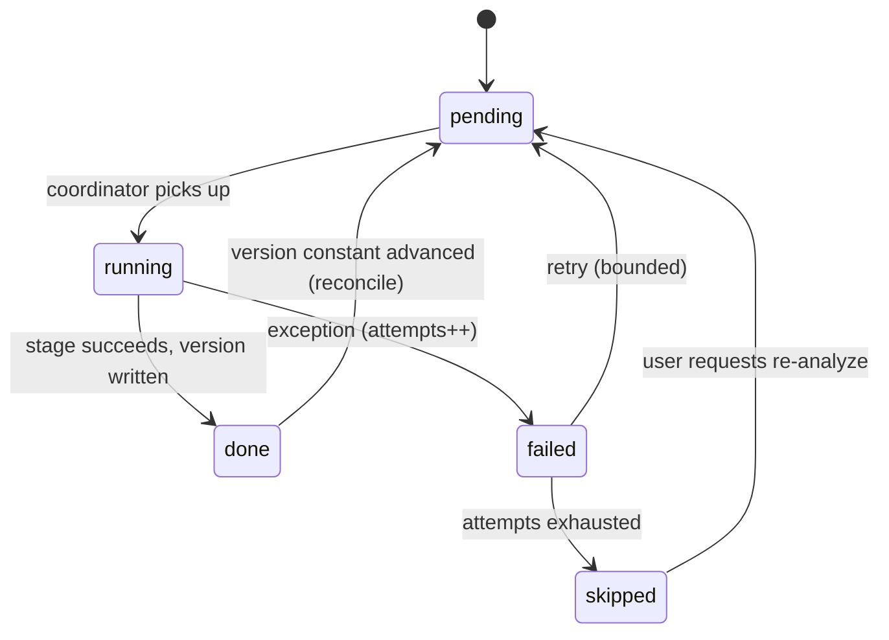

Each stage transition is a row update in `analysis_run` (crash-safe: on relaunch, `running` rows older than a threshold are reset to `pending`, satisfying NFR-REL-1). The denormalized `track.analysisState` is a roll-up (`pending` if any stage pending; `ready` when all `done`) used purely for fast library listing and the status column in mockup 02.

## 18. GRDB record and repository layer

### 18.1 Record types

Every table has a `Codable` struct conforming to GRDB's `FetchableRecord, MutablePersistableRecord` (⟢ exactly the pattern in `Records.swift`). Example for the two most-touched records:

```swift
public struct DJTrack: Codable, Identifiable, Equatable, Sendable {
    public var id: Int64?
    public var syncID: String
    public var albumID: Int64?
    public var title: String
    public var trackNo: Int?
    public var discNo: Int?
    public var durationSec: Double?
    public var codec: String?
    public var sampleRate: Int?
    public var channelCount: Int?
    public var bitDepthOrBitrate: String?
    public var contentHash: String
    public var sortKey: String
    public var bpm: Double?
    public var detectedBPM: Double?
    public var camelot: String?
    public var musicalKey: String?
    public var energy: Double?
    public var analysisVersion: Int
    public var embeddingVersion: Int
    public var analysisState: String
    public var stemState: String
    public var addedAt: Date
    public var updatedAt: Date
}
extension DJTrack: FetchableRecord, MutablePersistableRecord {
    public static let databaseTableName = "track"
    public mutating func didInsert(_ inserted: InsertionSuccess) { id = inserted.rowID }
}

public struct CuePoint: Codable, Identifiable, Equatable, Sendable {
    public var id: Int64?
    public var syncID: String
    public var trackID: Int64
    public var samplePosition: Int64
    public var kind: String          // hot|load|fade|grid|memory
    public var label: String?
    public var colorIndex: Int
    public var hotIndex: Int?
    public var createdAt: Date
    public var updatedAt: Date
}
extension CuePoint: FetchableRecord, MutablePersistableRecord {
    public static let databaseTableName = "cue_point"
    public mutating func didInsert(_ inserted: InsertionSuccess) { id = inserted.rowID }
}
```

The remaining records (`Loop`, `BeatGridHeader`, `Phrase`, `KeyEstimate`, `TempoCandidate`, `DJMix`, `MixTrackEvent`, `MixAsset`, `MIDIBinding`, `ChannelRouting`, `SmartCrateRecord`, `CloudRecordMap`, `AssetUpload`, …) follow the identical shape and are enumerated in Appendix A.

### 18.2 Row / view models for listing

Fast list screens (Library, Recorded Mixes) fetch **flat row structs** via joined SQL rather than object graphs, to avoid N+1 and to feed SwiftUI directly:

```swift
public struct DJTrackRow: Codable, FetchableRecord, Identifiable, Sendable {
    public var id: Int64
    public var title: String
    public var artistNames: String     // GROUP_CONCAT from track_artist
    public var albumTitle: String?
    public var durationSec: Double?
    public var bpm: Double?
    public var camelot: String?
    public var energy: Double?
    public var analysisState: String
    public var stemState: String
}
```

### 18.3 Repositories (grouped query surfaces on `DJLibraryStore`)

`DJLibraryStore` exposes repository-style methods (§10.1). Reactive listing uses GRDB `ValueObservation` bridged to `AsyncStream`, so the Library and Analysis screens update live as analysis completes without polling:

```swift
public nonisolated func observeTracks(_ q: LibraryQuery) -> AsyncStream<[DJTrackRow]> {
    AsyncStream { continuation in
        let observation = ValueObservation.tracking { db in
            try DJTrackRow.fetchAll(db, SearchQueryBuilder.sql(for: q))   // ⟢ reuse builder pattern
        }
        let cancellable = observation.start(
            in: dbPool,
            onError: { _ in continuation.finish() },
            onChange: { rows in continuation.yield(rows) })
        continuation.onTermination = { _ in cancellable.cancel() }
    }
}
```

### 18.4 Write discipline & transactions

- All writes go through `DJLibraryStore` actor methods, each wrapping a single GRDB transaction. Multi-table operations (e.g., "persist analysis": frames + onset + grid + downbeats + key + phrases + waveform + embeddings + vec rows) are **one transaction** so a crash leaves either the whole analysis or none (NFR-REL-1, NFR-DET-1).
- The `dirty` flag on `cloud_record_map` is set within the same transaction as any syncable change, so the sync layer (§38) can find exactly what to push without diffing.
- WAL mode + a `DatabasePool` gives concurrent readers (UI observations) during writes (analysis), which is essential for NFR-PERF-3 (responsive UI during analysis).

---
---

# Part IV — Offline Analysis Pipeline

## 19. Analysis pipeline architecture

Every imported track passes through an **immutable, staged, versioned** pipeline exactly once per analysis version. The pipeline is a directed acyclic graph of pure DSP kernels (L3) orchestrated by the `AnalysisCoordinator` actor (L4), which owns scheduling, persistence, and resumability.

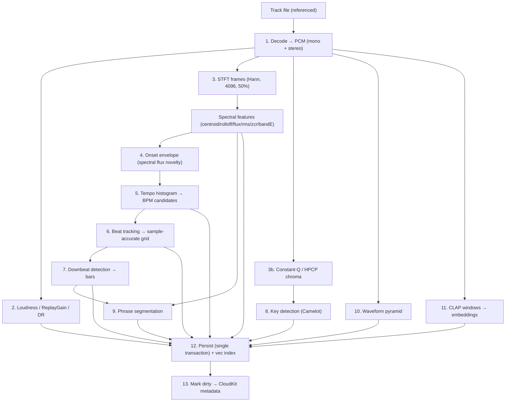

### 19.1 Execution properties

- **Idempotent per (track, version).** Re-running a stage overwrites its rows/BLOB and bumps the stored version; never appends duplicates.
- **Resumable.** Each stage's state is a row in `analysis_run`. On relaunch, stale `running` rows reset to `pending`; the coordinator continues.
- **Bounded concurrency.** A `withTaskGroup` runs up to `maxConcurrentTracks` (default = performanceCoreCount − 1, min 1) *tracks* in parallel; within a track, stages that depend on each other run in order, independent stages (e.g., waveform, embedding, loudness) may run concurrently. See §43 for the budget rationale.
- **Priority-fenced.** All analysis tasks run at `.background`; the coordinator additionally throttles when `PerformanceMonitor` reports the audio engine is live, protecting the playback thread (FR-ANL-2). Concretely: while a performance is active, `maxConcurrentTracks` is clamped to 1 and CLAP/Demucs (ANE/GPU) work is paused.

### 19.2 Decode substrate

⟢ Reuse `AVAudioFile`/`AVAudioConverter` (the repo already decodes via AVFoundation). The pipeline decodes once into a canonical **analysis format**: 44.1 kHz, `Float32`, both a mono sum (for most DSP) and stereo (for loudness true-peak and stem pre-separation). Opus is remuxed via the existing `Opus/` path when a direct AVFoundation decode is unavailable. A single decode pass feeds all downstream stages from an in-memory `PCMBuffer` (or a memory-mapped scratch file for very long tracks), avoiding repeated file reads.

### 19.3 The `PCMBuffer` type

```swift
public final class PCMBuffer: @unchecked Sendable {   // uniquely-owned; transferred, not shared
    public let sampleRate: Double
    public let channelCount: Int
    public let frameCount: Int
    public let mono: UnsafeBufferPointer<Float>        // length == frameCount
    public let channels: [UnsafeBufferPointer<Float>]  // deinterleaved
    // backing storage freed on deinit; never mutated after construction
}
```

Handing a `PCMBuffer` to another actor transfers ownership (the producer drops its reference). This gives zero-copy movement of large audio between decode → DSP → embedding → stems while keeping `Sendable` meaningful.

## 20. Decode, loudness, dynamic range

### 20.1 Loudness (ITU-R BS.1770 / EBU R128)

Integrated loudness uses BS.1770 K-weighting: a two-stage pre-filter (a high-shelf "head" filter + a high-pass), mean-square per 400 ms block with 75% overlap, absolute gate at −70 LUFS, then a relative gate at −10 LU below the ungated mean. Implemented with `vDSP` biquad (`vDSP_biquad`) for the K-weighting and `vDSP_measqv` for block mean-square.

```swift
public enum LoudnessAnalyzer {
    public static func integratedLUFS(_ pcm: PCMBuffer) -> Double {
        let kw = KWeighting.filter(pcm)                 // vDSP_biquad, per channel
        let blocks = kw.blockMeanSquares(windowMS: 400, overlap: 0.75)  // vDSP_measqv
        let gated = R128Gate.apply(blocks)              // absolute −70, relative −10 LU
        return -0.691 + 10 * log10(gated.channelWeightedSum)
    }
}
```

**True peak** (`truePeakDBTP`) is measured by 4× oversampling (polyphase FIR via `vDSP`) then max-abs. **ReplayGain** (`replayGainDB`) is derived from integrated loudness targeting −18 LUFS (−23 for R128 profile; both stored is unnecessary — pick −18 for DJ headroom and record the reference in `loudness.version`). ⟢ Cross-check the value against `TonearmCore.ReplayGain` so the player and DJ agree.

**Dynamic range** (`dynamicRangeDB`): loudness range LRA (10th–95th percentile of short-term loudness distribution) plus a crest-factor DR (peak − RMS) for a "how punchy" hint used lightly in phrase energy and recommendation.

Loudness informs (a) auto-gain on deck load so tracks are level-matched (the mixer's per-deck trim seeds from `replayGainDB`), and (b) the master limiter's headroom.

## 21. FFT / DSP engine

Accelerate/vDSP is used **exclusively**. No third-party DSP.

### 21.1 STFT configuration

```swift
public struct STFTConfig: Sendable {
    public var fftSize: Int = 4096        // tunable; power of two
    public var hopSize: Int = 2048        // 50% overlap
    public var window: WindowType = .hann
    public var sampleRate: Double = 44_100
}
```

Rationale: 4096 at 44.1 kHz → ~10.8 Hz bin spacing and ~93 ms frames, a good balance for music onset/timbre features; 50% overlap (hop 2048) gives ~21.5 fps frame rate. These are the v0.2 HLD values, retained and made configurable.

### 21.2 Windowing and the real FFT

A Hann window is precomputed once (`vDSP_hann_window`) and applied with `vDSP_vmul`. The real FFT uses `vDSP_fft_zrip` with a shared `FFTSetup` (created once per size, reused across all frames and tracks — creating a setup per frame is a common performance bug):

```swift
public final class FFTSetupHandle {
    let setup: FFTSetup                    // vDSP_create_fftsetup(log2n, FFT_RADIX2)
    let log2n: vDSP_Length
    // window buffer + split-complex scratch, all preallocated
}

public enum FFTKernel {
    public static func spectrum(_ frame: [Float], setup s: FFTSetupHandle) -> Spectrum {
        // 1) windowed = frame * hann         (vDSP_vmul)
        // 2) pack real → split complex        (vDSP_ctoz)
        // 3) in-place real FFT                (vDSP_fft_zrip)
        // 4) magnitude^2 per bin              (vDSP_zvmags) → power spectrum
        // 5) optional sqrt for magnitude      (vvsqrtf)
        // returns Spectrum { power:[Float], magnitude:[Float], binHz:Double }
    }
}
```

`Spectrum` holds the positive-frequency bins (`fftSize/2 + 1`). Frames are processed in a tight loop over the mono buffer; the setup, window, and scratch buffers are reused, so per-frame allocation is zero.

### 21.3 Spectral features (per frame)

Each frame yields the feature set stored in `frame_features` (§15.3). All are `vDSP` reductions over the power/magnitude spectrum:

- **Spectral centroid** — magnitude-weighted mean bin frequency (`vDSP_dotpr` of magnitude·binHz / sum(magnitude)). "Brightness."
- **Spectral rolloff** — frequency below which 85% of energy lies (cumulative sum threshold).
- **Spectral flux** — positive L2 difference of successive normalized magnitude spectra (`vDSP_vsub`, half-wave rectify, `vDSP_svesq`). The onset novelty driver.
- **RMS energy** — `vDSP_rmsqv` of the frame.
- **Zero-crossing rate** — sign-change count / frame length (noisiness/percussiveness cue).
- **Low/high band energy** — summed power in sub-band ranges (kick band ~20–120 Hz; air band ~8–20 kHz) via bin-range `vDSP_sve`.

These features feed onset detection (flux), phrase segmentation (all), key confidence weighting, and are summarized into the library `energy` value.

## 22. Onset detection and tempo estimation

### 22.1 Onset novelty envelope

The onset detection function is a **multi-band spectral flux** novelty curve. The spectrum is split into transient-relevant bands (kick, snare, hi-hat), each contributes half-wave-rectified flux, and the bands are summed with weights emphasizing percussive content:

```swift
public struct OnsetConfig: Sendable {
    public var bands: [ClosedRange<Float>] = [20...120, 120...2_000, 2_000...16_000] // kick/snare/hat
    public var bandWeights: [Float] = [1.0, 0.8, 0.6]
    public var meanRemovalWindow: Int = 16     // frames, for adaptive whitening
    public var frameRateHz: Float = 21.53      // = sampleRate/hopSize
}

public enum OnsetDetector {
    public static func envelope(frames: [Spectrum], config: OnsetConfig) -> [Float] {
        // per band: flux_b[n] = Σ max(0, |X_b[n]| − |X_b[n−1]|)
        // novelty[n] = Σ_b w_b · flux_b[n]
        // subtract moving mean (adaptive threshold), half-wave rectify
        // normalize to 0...1
    }
}
```

The envelope is stored in `onset_envelope` (BLOB) at the frame rate, so beat tracking and any future re-tuning don't need to re-run the FFT.

### 22.2 Peak picking

Onset peaks are local maxima of the novelty envelope that exceed an adaptive threshold (moving mean + k·moving std over a window), with a minimum inter-onset interval to suppress double-triggers:

```swift
public enum OnsetDetector {
    public static func peaks(_ env: [Float], config: OnsetConfig) -> [OnsetPeak] {
        // threshold[n] = mean(env, w) + k*std(env, w)
        // peak if env[n] == local max in ±m AND env[n] > threshold[n]
        // enforce minGapMS between accepted peaks
    }
}
```

### 22.3 Tempo histogram

Inter-onset intervals (and their integer multiples/divisions) vote into a tempo histogram over 60–220 BPM. Two complementary estimators are combined for robustness:

1. **Autocorrelation of the novelty envelope** (`vDSP_conv` for the correlation), peaks → periodicities → BPM.
2. **Inter-onset-interval histogram** with octave folding (a period T and 2T/½T reinforce the same tempo class).

```swift
public struct TempoConfig: Sendable {
    public var range: ClosedRange<Double> = 60...220
    public var binWidthBPM: Double = 0.5
    public var acfWeight: Double = 0.6
    public var ioiWeight: Double = 0.4
    public var preferredTempoCenter: Double = 125   // gentle prior toward common DJ tempos
    public var preferenceStrengthBPM: Double = 30
}
```

The histogram is smoothed, a **tempo prior** (a broad Gaussian around a configurable center, default 125 BPM) gently disambiguates octave errors common in electronic music, and the top-K peaks become `tempo_candidate` rows with confidences (rank 0 = best). The denormalized `track.detectedBPM` is candidate 0; `track.bpm` starts equal but becomes the corrected value if the user edits (FR-ANL-5).

### 22.4 Octave-error handling

Half/double-tempo confusion is the dominant BPM error. Mitigations: (a) octave-folded voting; (b) the tempo prior; (c) at beat-tracking time, the phase/energy fit of the grid is evaluated at candidate BPM *and* its ×2/÷2 — the variant whose beats land on higher onset energy wins. The user's ×2/÷2 control (mockup 05, "×2 BPM") writes a `grid_correction` and re-derives the grid from the chosen multiple.

## 23. Beat and downbeat tracking

### 23.1 Beat grid construction

Given a BPM candidate and the onset envelope, beat tracking finds the **phase** (position of beat 1) and lays a grid, then refines each beat to the nearest strong onset within a tolerance (so the grid is sample-accurate to the audio, not just periodic). The core is a dynamic-programming beat tracker (Ellis-style): maximize a score summing onset strength at beat locations minus a tempo-deviation penalty that keeps inter-beat intervals near the target period.

```swift
public struct BeatConfig: Sendable {
    public var tightness: Double = 100        // penalty weight for deviating from target period
    public var refineWindowMS: Double = 25    // snap-to-onset tolerance per beat
    public var allowVariableTempo: Bool = false  // constant-tempo default for DJ tracks
}

public enum BeatTracker {
    public static func grid(onsets: [OnsetPeak], bpm: BPMCandidate, config: BeatConfig) -> BeatGrid {
        // 1) target period P = sampleRate * 60 / bpm
        // 2) DP over candidate beat times maximizing Σ onset(t) − tightness·(log(Δt/P))²
        // 3) backtrack → beat times; refine each to nearest onset within refineWindowMS
        // 4) confidence per beat = normalized onset strength at that beat
        // returns BeatGrid { firstBeatSample, bpm, beats:[Int64], confidence:[Float] }
    }
}
```

For DJ material (typically constant tempo), `allowVariableTempo=false` fits a single global period + phase, producing a rigid grid that sync and loops rely on. The grid header goes to `beat_grid`; per-beat positions/confidence to `beat_blob`.

### 23.2 Downbeat detection

Downbeats (bar starts) are found by scoring each candidate phase (which beat is "1") over the track using features that correlate with bar boundaries: low-frequency energy peaks (kick on 1), spectral novelty at 4- and 8-beat periods, and harmonic-change alignment. A comb-filter / periodicity analysis at the bar level (assuming 4/4 by default, configurable) selects the beat offset (0–3) that best explains the pattern.

```swift
public struct DownbeatConfig: Sendable {
    public var beatsPerBar: Int = 4
    public var lowBandHz: ClosedRange<Float> = 20...120
    public var harmonicChangeWeight: Double = 0.5
    public var lowEnergyWeight: Double = 0.5
}

public enum BeatTracker {
    public static func downbeats(_ grid: BeatGrid, features: [FrameFeature],
                                 config: DownbeatConfig) -> [Int] {
        // for each offset o in 0..<beatsPerBar:
        //   score_o = Σ over bars ( lowEnergyWeight·lowBandEnergyAtBeat(o) +
        //                           harmonicChangeWeight·harmonicNoveltyAtBeat(o) )
        // pick argmax offset; downbeats = beats at indices ≡ offset (mod beatsPerBar)
        // returns beat indices that are downbeats
    }
}
```

Downbeats populate the `downbeat` table with `barNumber`, anchoring the bar/beat labels shown in preparation (mockup 05: `1.1.1 … 2.1.1`) and giving phrase segmentation its bar grid. The user's "Set Downbeat" control writes a `grid_correction` that shifts the chosen offset.

### 23.3 Grid corrections as authoritative overrides

User edits (nudge, set downbeat, ×2/÷2, set BPM) are appended to `grid_correction` and **replayed deterministically** over the detected grid to produce the authoritative `beat_grid` (`source = corrected`). This keeps corrections durable across re-analysis: bumping the beat analysis version re-detects, then re-applies the stored corrections on top, so the DJ never loses hand-tuned grids to an algorithm upgrade (a direct consequence of NFR-REL and FR-ANL-5).

## 24. Key detection (Constant-Q / HPCP / Camelot)

### 24.1 Chroma extraction

Musical key detection operates on a **Harmonic Pitch Class Profile (HPCP / chroma)** derived from a **Constant-Q transform (CQT)**, which gives log-frequency resolution matching musical semitones (unlike the linear FFT). The CQT is implemented as a precomputed sparse kernel matrix applied to FFT spectra (Brown–Puckette method): compute the linear FFT once (reusing §21), then multiply by the sparse CQT kernel (`vDSP` sparse matmul or a hand-rolled banded multiply) to obtain log-spaced bins spanning the musical range (e.g., 3 octaves from ~C2), folded into 12 pitch classes.

```swift
public struct ChromaConfig: Sendable {
    public var binsPerOctave: Int = 36        // 3 bins/semitone for tuning tolerance
    public var minFreqHz: Double = 65.4       // C2
    public var octaves: Int = 5
    public var tuningToleranceCents: Double = 50
    public var harmonicWeighting: Bool = true // weight by harmonic series to sharpen tonic
}

public enum KeyDetector {
    public static func chroma(_ frames: [ConstantQFrame], config: ChromaConfig) -> [HPCP] {
        // per frame: CQT magnitude → fold to 12 pitch classes (sum across octaves)
        // apply harmonic weighting; normalize each 12-vector
        // returns per-frame HPCP (12 floats)
    }
}
```

Tuning deviation is estimated from the CQT (peak clustering relative to equal-tempered grid) so tracks tuned off A440 still key-detect correctly.

### 24.2 Key estimation (template correlation)

The per-frame HPCP is aggregated (mean over the track, optionally excluding low-energy frames) into a single 12-vector, then correlated against the 24 major/minor **key profiles** (Krumhansl–Schmuckler, or the Temperley/Albrecht refinements). The best-correlating profile gives tonic + mode; the correlation margin gives confidence.

```swift
public struct KeyConfig: Sendable {
    public var profile: KeyProfile = .temperley   // krumhansl|temperley|albrecht
    public var segmentation: Bool = false         // also emit per-segment keys for key changes
    public var minConfidence: Double = 0.3
}

public enum KeyDetector {
    public static func estimate(_ chroma: [HPCP], config: KeyConfig) -> KeyEstimate {
        // aggregate chroma → 12-vector; for each of 24 keys: r = corr(vector, rotate(profile, tonic))
        // pick argmax; confidence = (rBest − rSecond) normalized
        // map (tonic, mode) → Camelot via table
    }
}
```

### 24.3 Camelot mapping and compatibility

The (tonic, mode) result maps to Camelot notation via a fixed table. Compatibility for harmonic mixing is defined by adjacency on the Camelot wheel:

```swift
public enum Camelot {
    /// Compatible = same number (relative major/minor), ±1 on the wheel same letter,
    /// and same number opposite letter. e.g., 8A ↔ {8A, 7A, 9A, 8B}.
    public static func compatible(_ key: CamelotKey) -> Set<CamelotKey>
    public static func compatibility(_ a: CamelotKey, _ b: CamelotKey) -> Float  // 1.0 same, 0.7 adjacent, ...
    public static func from(tonic: Int, mode: Mode) -> CamelotKey
}
```

The result is written to `key_estimate` (global scope) and denormalized into `track.camelot` / `track.musicalKey` for the library table and search re-rank. Optional per-segment key detection (`scope=segment`) captures modulations for tracks that change key.

### 24.4 The full Camelot table (Appendix reference)

The complete tonic×mode→Camelot table is in Appendix D; the compatibility values (`1.0` identical, `0.9` relative maj/min, `0.7` ±1 same letter, `0.5` energy-boost +7 semitones, `0.0` otherwise) are the tunable weights the `camelotCompatibility` SQL function and `Camelot.compatibility` share, so search re-rank and suggestion scoring agree.

## 25. Phrase segmentation

### 25.1 Approach

Phrase boundaries are found by combining **novelty in a self-similarity structure** with the bar grid. Two signals are fused:

1. **Timbral/harmonic self-similarity novelty.** Build a feature sequence (beat-synchronous averages of MFCC-like timbral features + chroma), compute a self-similarity matrix, and convolve a checkerboard kernel along its diagonal (Foote novelty) to score structural change points.
2. **Energy contour segmentation.** Detect sustained changes in RMS/low-band energy (breakdowns drop bass; drops spike it), giving intro/build/breakdown/drop cues.

Boundaries are snapped to the nearest **downbeat**, and phrases are quantized to musically plausible lengths (multiples of 4/8/16/32 beats), because DJ phrasing is bar-aligned.

```swift
public struct PhraseConfig: Sendable {
    public var beatSync: Bool = true
    public var kernelBars: Int = 8               // checkerboard kernel half-width in bars
    public var minPhraseBeats: Int = 16
    public var quantizeToBeats: [Int] = [16, 32]  // preferred phrase lengths
    public var energyDropThreshold: Double = 0.35 // fraction drop marking a breakdown
}

public enum PhraseSegmenter {
    public static func segment(features: [FrameFeature], beats: BeatGrid,
                               config: PhraseConfig) -> [Phrase] {
        // 1) beat-synchronous feature averaging
        // 2) self-similarity matrix + Foote checkerboard novelty → candidate boundaries
        // 3) fuse with energy-contour change points
        // 4) snap to downbeats; quantize lengths; label by energy shape:
        //    intro (low, rising) | build | drop (energy spike post-breakdown) |
        //    chorus (high sustained) | breakdown (bass drop) | outro (low, falling)
        // 5) energy per phrase (0..10) from RMS/low-band
    }
}
```

### 25.2 Output and use

Phrases go to the `phrase` table with type, `lengthBeats` (e.g., 32 as shown in mockup 05), energy, and confidence. They drive: the preparation view's phrase display, auto-placement of default cue regions (a "Bass enters" load cue at the first drop, a memory cue at each breakdown), and phrase-compatibility scoring in recommendations (§28). The denormalized `track.energy` is a weighted aggregate of phrase energies (peaks weighted higher, matching how DJs think about a track's "energy").

## 26. Waveform pyramid generation

### 26.1 Multi-resolution structure

A single full-resolution waveform is useless for both the zoomed-out overview and the sample-accurate zoom in preparation (mockup 05, "Zoom 1:8"). The pipeline generates a **pyramid** of precomputed min/max/RMS reductions at successive power-of-two bin sizes, so any zoom level renders by picking the nearest level and slicing — never by scanning the audio at draw time.

```swift
public struct WaveformConfig: Sendable {
    public var baseSamplesPerBin: Int = 256      // finest level
    public var levels: Int = 8                    // ×2 per level → up to 256*2^7 samples/bin
    public var bandSplit: Bool = true             // low/mid/high RMS for colored waveform
}

public enum WaveformPyramid {
    public static func build(_ pcm: PCMBuffer, config: WaveformConfig) -> WaveformBlob {
        // level 0: for each 256-sample bin → {min, max, rms} via vDSP_minv/maxv/rmsqv
        //          if bandSplit: also low/mid/high RMS from band-filtered copies
        // level k>0: reduce level k−1 pairwise (min of mins, max of maxes, rms combine)
        // pack into WaveformPyramid BLOB layout (§15.7, kind=0x05)
    }
}
```

### 26.2 Rendering contract

The UI waveform renderer (a `MTKView` or Canvas, §41) is handed a slice of the appropriate pyramid level plus the beat grid and cue/loop positions; it draws bars from min/max and colors from band-split RMS. Because the pyramid is precomputed and memory-mappable, scrolling and zooming during preparation and performance are allocation-free and smooth (NFR-PERF-3). The playing deck's moving playhead is a simple offset into the same slice; the render never touches the audio buffer.

## 27. CLAP semantic embeddings

Platterhead uses a **music-specialized CLAP** model (contrastive language–audio pretraining trained on music, not a generic environmental-audio CLAP) so that text like "dark driving bassline" or "late-night hypnotic" maps to musically meaningful audio neighborhoods. This is the engine behind Vibe Search and semantic recommendations.

### 27.1 Model selection and packaging

- **Model:** a music-domain CLAP (e.g., a LAION-CLAP music checkpoint or equivalent) converted to **Core ML**, quantized to **FP16**, packaged as `.mlpackage` and bundled as a resource in `TonearmDJ` (§9.1). Two encoders are used: the **audio encoder** (for track/window embeddings) and the **text encoder** (for query embeddings). Both output a shared 512-D space; vectors are **L2-normalized** so cosine == dot product.
- **Compute target:** `MLModelConfiguration.computeUnits = .cpuAndNeuralEngine` (matches HLD v0.2). The `CLAPEmbedder` actor serializes predictions; the ANE handles the heavy lifting, keeping CPU free for analysis and UI.
- **Versioning:** `embedding_version` (registry row) records model name, dims, window/hop seconds, and pooling. Bumping the model bumps the version and triggers incremental re-embedding + vec rebuild (§27.6).

### 27.2 Audio preprocessing

The audio encoder expects a fixed input representation (typically a log-mel spectrogram at the model's sample rate, e.g., 48 kHz, with the model's mel/window parameters). The embedder resamples the analysis PCM to the model rate (`AVAudioConverter`), computes the log-mel front-end (reusing vDSP mel-filterbank on the existing STFT machinery where parameters match, else a dedicated front-end), and feeds fixed-length windows.

### 27.3 Windowing strategy (10 s overlapping)

Each track is embedded as a sequence of **10-second windows with overlap** (default hop 5 s → 50% overlap), matching HLD v0.2 ("each 10-second window produces a 512-d embedding"). Overlap ensures a musical moment near a window boundary still lands well inside some window. Very short tracks use a single padded window; very long tracks are bounded (a cap on window count with uniform sub-sampling) to keep embedding time and storage predictable.

```swift
public struct EmbedConfig: Sendable {
    public var windowSeconds: Double = 10
    public var hopSeconds: Double = 5
    public var maxWindows: Int = 240            // ~20 min cap before subsampling
    public var pooling: Pooling = .attention    // mean|attention
}
```

### 27.4 Pooling to a whole-track vector

Per-window vectors are pooled into one whole-track vector for coarse "tracks like this" search. Two strategies:

- **Mean pooling** (baseline): L2-normalize the mean of window vectors. Robust, cheap.
- **Attention pooling** (default): a lightweight learned or heuristic attention that down-weights silence/intro/outro windows and up-weights the track's characteristic sections (often the drop/chorus). In the heuristic form, window weights are a softmax over window "salience" = a blend of energy (from §25) and distance-from-centroid (a window that is very unlike the track average is likely an intro/ambient tail and is de-emphasized). Pooling strategy is recorded in `embedding_version.pooling` so results are interpretable across upgrades.

Both the pooled whole-track vector (`track_embedding`) and all window vectors (`window_embedding`) are stored; windows enable intra-song similarity (§27.5) and finer crate rules.

### 27.5 Text query path and window-level search

- **Text search:** `embedText("dark driving bassline")` → text encoder → 512-D → L2-normalize → `:qvec` for the §16.4 query. Result time target ≤ ~60 ms (mockup 04 shows "43 ms"/"Result time"), dominated by the text-encoder forward pass (ANE) since ANN over 12k vectors is sub-millisecond.
- **Window-level search** ("find the part of a song that sounds like this"): query `vec_window` to retrieve the closest *windows*, then group by `trackID` and surface the matching time span. This powers future "similar portions" features and smarter transition suggestions (match the incoming track's intro window to the outgoing track's outro window).

### 27.6 Incremental background re-indexing

Embedding is the most expensive stage, so re-indexing is incremental and background-fenced:

- New/changed track → embed → write `track_embedding` + `window_embedding` + `vec_*` rows in the analysis transaction.
- Model upgrade → `embedding_version` bumps → `reconcileVersions()` enqueues only tracks whose `embeddingVersion` is behind → re-embed at `.background`, pausing while a performance is live. The vec virtual tables are rebuilt per-track from the row-table source of truth (§16.5), so an interrupted rebuild resumes cleanly.
- `SemanticSearchService.indexDidChange(trackIDs:)` is notified so any cached ANN structures stay warm and Smart Crates re-resolve against the new space.

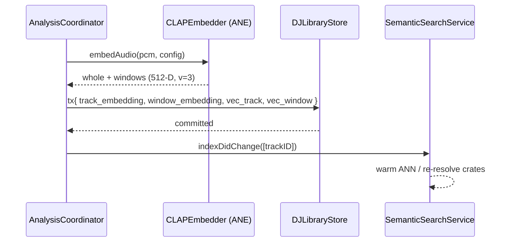

## 28. Recommendation and transition scoring

### 28.1 Candidate scoring

The recommendation score blends semantic similarity with DJ-domain compatibility, using the weights from the HLD (40/20/20/10/10), all tunable:

```swift
public struct RankWeights: Sendable {
    public var semantic: Float = 0.40
    public var bpm: Float = 0.20
    public var camelot: Float = 0.20
    public var energy: Float = 0.10
    public var phrase: Float = 0.10
}

public enum TransitionScorer {
    /// Score a candidate next track against a reference (loaded deck / current track).
    public static func score(candidate: DJTrackRow, reference: TrackContext,
                             weights: RankWeights) -> RankBreakdown {
        // semantic:  cosine(candidate.embedding, reference.embedding)      [from vec table]
        // bpm:       triangular proximity within tolerance (e.g., ±6%)
        // camelot:   Camelot.compatibility(candidate, reference)
        // energy:    1 − |candidate.energy − target.energy| / 10
        // phrase:    compatibility of candidate intro length vs reference outro (bar-multiple match)
        // final = Σ weight·component; RankBreakdown carries per-component values for UI "why"
    }
}
```

This same scorer serves three surfaces: Vibe Search re-rank (§16.4, semantic-dominant), the "Compatible with Deck A · 8A" refinement (constrain candidates to compatible keys/BPM), and future live "next track" suggestions. The `reasons`/`RankBreakdown` returned to the UI lets the app explain a suggestion ("+ higher energy, key-compatible").

### 28.2 "Feels like this but…" queries

Directional requests ("like this but slightly higher energy," HLD §11) are expressed by shifting the **target** used in scoring: start from the reference track's embedding and attributes, then bias `targetEnergy` up (or BPM, or key toward the next Camelot step) before scoring candidates. Because attributes are explicit columns and the embedding is a vector, these transforms are cheap and composable, and they combine with the additive/subtractive vibe terms from `VibeQuery` (a "+ hypnotic − bright vocals" query nudges the *semantic* target by adding/subtracting the text-embeddings of those terms before ANN).

### 28.3 Harmonic transition scoring (roadmap hook)

A dedicated harmonic-transition score (evaluating a *sequence* of tracks for a smooth journey around the Camelot wheel with monotone-ish energy) is specified as a future extension (Part IX). Its inputs — per-track Camelot, energy, phrase structure, and window embeddings for intro/outro matching — are all already produced by this pipeline, so it requires no new analysis, only a new scorer over stored data.

---
---

# Part V — Real-Time Audio Engine

The engine is where determinism is non-negotiable (NFR-PERF-1, NFR-DET). Everything in Part V lives on or below the **performance clock**; nothing here may touch disk, network, the database, or synchronous GPU/model calls on the render thread.

## 29. AVAudioEngine node graph

### 29.1 Complete graph

Two decks, each with source → time/pitch → per-stem gain → EQ/filter → deck bus; the two deck buses feed a crossfader, then master EQ, limiter, a tap for recording, and split routing to master and cue outputs.

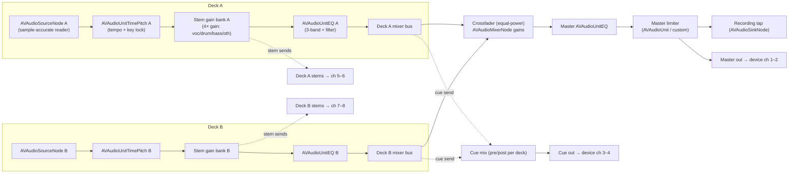

### 29.2 Node responsibilities

| Node | Type | Role | Clock |
|---|---|---|---|
| Source A/B | `AVAudioSourceNode` | Render frames from the deck's private reader (pre-decoded PCM + stem buffers), apply loop/cue logic sample-accurately, advance playhead | perf (render block) |
| TimePitch A/B | `AVAudioUnitTimePitch` | Tempo scaling (rate) and independent pitch (key lock) | perf |
| Stem gain bank | 4× gain (in source node or `AVAudioMixerNode` inputs) | Independent stem levels/mutes | perf |
| EQ A/B | `AVAudioUnitEQ` | 3-band shelf/peak + resonant filter (LP/HP sweep) | perf |
| Crossfader | `AVAudioMixerNode` input gains | Equal-power A↔B blend | perf |
| Master EQ | `AVAudioUnitEQ` | Master tone | perf |
| Limiter | custom `AVAudioUnit` or `AVAudioUnitEffect` | Brickwall protection at master | perf |
| Recording tap | `AVAudioSinkNode` | Copy master frames to the recording ring (§37) | perf → non-RT drain |
| Master/Cue/Stem outs | engine output routing | Multichannel device mapping (§44) | perf |

### 29.3 Why this shape

- **Source nodes, not `AVAudioPlayerNode`.** DJ playback needs sample-accurate loop points, key-lock-friendly rate control, and reading from **stem buffers** (four sources summed with independent gains) rather than a single file. `AVAudioSourceNode` gives a render block where the deck's reader controls exactly which samples come out this callback, enabling frame-accurate cue/loop and stem mixing. `AVAudioPlayerNode`'s scheduling model can't express beat-accurate looping cleanly.
- **Apple's TimePitch/EQ where they're good enough.** `AVAudioUnitTimePitch` provides quality time-stretch/pitch-shift on Apple Silicon; `AVAudioUnitEQ` provides clean shelving/peaking. Using them keeps the custom render code focused on the DJ-specific logic (reading, looping, stem summing) and leverages Apple's optimized DSP. The limiter is custom because DJ limiting has specific attack/release needs.
- **Stems summed in the source node.** Each deck's source node reads four stem buffers (from cache, §36) and sums them with per-stem gains before output, so "vocals mute / bass solo" is a gain change applied sample-accurately with no extra nodes. When stems aren't ready, the node reads the original mixed buffer and the stem faders are disabled.

## 30. Master clock and sample-accurate scheduler

### 30.1 The master clock

The engine's time base is the audio device's sample clock, surfaced by AVAudioEngine. All scheduling is expressed in **absolute sample frames** on this timeline. Each deck maintains a `playheadSample` (position within its track, in the track's own sample space) and a mapping to the master timeline via its current rate.

The **master deck** (mockup 06 marks Deck A "MASTER") defines the tempo/phase reference for sync. A `MasterClock` value snapshot (current master sample, master BPM, master downbeat phase) is published to the render thread via the double-buffered snapshot (§12.2) and read once per callback.

### 30.2 Sample-accurate scheduling of events

Cue triggers, loop boundaries, and sync engage points are scheduled at exact sample frames. The render block, each callback, knows the sample range `[frameStart, frameStart + frameCount)` it is about to produce and checks scheduled events against that range:

```swift
// Inside a deck's render block (illustrative; POD state only, no allocation)
func render(into out: UnsafeMutableBufferPointer<Float>, frames: Int, masterSample: Int64) {
    commandRing.drain { apply($0) }                 // §12.2
    var f = 0
    while f < frames {
        // Determine the next sample-accurate boundary within this callback:
        let nextEvent = min(loopBoundarySample(), scheduledCueSample(), Int64(frames - f) + cursor)
        let chunk = Int(nextEvent - cursor)
        readStemsMixed(into: out, at: f, count: chunk)   // sum 4 stems × gains
        cursor += Int64(chunk); f += chunk
        if cursor == loopEndSample && loopActive { cursor = loopStartSample }   // sample-accurate loop
        if cursor == scheduledCueSample { jumpTo(scheduledCueTarget); consumeCue() }
    }
    advancePlayheadAndMeters()
}
```

Because boundaries are honored *within* a callback (splitting the buffer at the exact frame), loops and cues are frame-accurate regardless of buffer size — the defining property DJs rely on.

### 30.3 Quantization

A quantized trigger (loop, cue, sync) computes its target sample as the next beat/bar boundary on the **master** grid, translated into the deck's local sample position via the current tempo mapping, then schedules the jump for that frame. Quantize resolution (1 beat, ½ beat, 1 bar, 4 bars) is a `Quantize` enum passed with the command; the boundary is derived from the beat grid snapshot the deck holds.

## 31. Time-stretching and pitch (key) lock

### 31.1 Tempo change

Deck tempo is changed by setting `AVAudioUnitTimePitch.rate` (mockup 06: "Pitch +1.2%" on the synced deck). Rate `r` means playback is `r×` speed. With **key lock on**, pitch is held constant while rate changes (the unit time-stretches). With key lock off, the classic vinyl behavior applies: rate change also shifts pitch (`pitch` follows `rate` as `1200·log2(r)` cents), which some DJs prefer for certain transitions.

```swift
public func setPitch(_ deck: DeckID, percent: Double) {   // e.g., +1.2 → rate 1.012
    let rate = 1.0 + percent / 100.0
    enqueue(.setRate(deck: deck, rate: Float(rate), keyLock: keyLock[deck]))
}
```

### 31.2 Key lock quality

`AVAudioUnitTimePitch` uses a high-quality algorithm suitable for the ±6–8% tempo range typical in beatmatching; artifacts are minimal within that range (FR-ENG-6). For larger shifts the UI can warn. The `overlap`/algorithm parameters are set for music (favoring transient preservation). Key lock state is per deck and reflected in the deck node's `pitch` handling as above.

### 31.3 Independent musical key shift

Beyond tempo, the engine supports shifting a deck's musical **key** by ±N semitones for harmonic mixing (e.g., nudging a track a semitone to match Camelot) via `AVAudioUnitTimePitch.pitch` (in cents, 100 per semitone) with rate held. This changes the effective Camelot of the playing deck; the UI reflects the shifted key so the compatibility hints (§28) stay honest.

## 32. Beat sync algorithms

### 32.1 What sync guarantees

`sync(deck, to: master)` makes the synced deck **tempo-matched and phase-aligned** to the master at the sync instant (FR-ENG-4). Two steps:

1. **Tempo match.** Set the synced deck's rate so its effective BPM equals the master's current effective BPM: `rate_synced = masterBPM / trackBPM_synced`. (If the master's tempo changes later, sync can be *continuous* — the synced deck's rate tracks — or *momentary*; default is continuous while "SYNC" is engaged, mockup 06 shows Deck B "SYNCED".)
2. **Phase align.** Compute the synced deck's current beat phase and the master's current beat phase (both from their grids and playheads at the sync sample), and shift the synced deck's playhead by the phase difference so beats coincide. The shift is applied as a scheduled, sample-accurate jump (a sub-beat nudge) at the next callback boundary, or ramped over a few milliseconds to avoid a click for large corrections.

```swift
public enum SyncEngine {
    /// Pure computation of the correction; applied by the render layer.
    public static func correction(master: DeckClock, synced: DeckClock,
                                  atMasterSample: Int64) -> SyncCorrection {
        let targetRate = master.effectiveBPM / synced.trackBPM
        let masterPhase = master.beatPhase(atMasterSample)            // 0..1 within a beat
        let syncedPhase = synced.beatPhase(synced.playheadSample)
        let phaseDeltaBeats = phaseDifference(masterPhase, syncedPhase) // (−0.5, 0.5]
        let sampleShift = Int64(phaseDeltaBeats * synced.samplesPerBeat)
        return SyncCorrection(setRate: Float(targetRate), playheadShiftSamples: sampleShift)
    }
}
```

### 32.2 Downbeat-aware sync

Optionally sync aligns **downbeats** (bar 1 to bar 1), not just beats, using the `downbeat` data — important for phrase-aligned mixing. The `SyncCorrection` then targets the nearest master downbeat phase. Beat-only vs bar sync is a preference; bar sync is the safer default for phrase-matched transitions.

### 32.3 Purity and testability

`SyncEngine.correction` is pure (no I/O, deterministic), so its phase math is unit-tested against fixtures with known grids (AT-ENGINE-SYNC-\*). The render layer only *applies* the returned rate and sample shift, keeping the hard-real-time code trivial and the tricky math testable off-thread — the same pure/shell split used throughout.

## 33. Cue, loop, and quantized triggering

### 33.1 Cues

Hot cues (from `cue_point`) are triggered by pad or MIDI. A cue trigger schedules a sample-accurate jump of the playhead to `samplePosition` (optionally quantized to the next beat/bar, §30.3). "Cue" (the transport CUE button, mockup 06) sets/returns to a temporary cue point (press-to-preview, release-to-return — classic CDJ behavior), implemented as a scheduled jump plus a play/pause gate. All cue logic is playhead arithmetic in the render block; no allocation.

### 33.2 Loops

A loop (from `loop`, or set live via "LOOP 8"/"LOOP 4" in mockup 06) defines `[startSample, endSample)`. When active, the render block wraps the cursor at `endSample` back to `startSample` (§30.2), sample-accurately, so the loop is seamless and beat-aligned. Loop length in beats (½, 1, 2, 4, 8, 16) is converted to samples via the grid; halving/doubling adjusts `endSample` to the grid. Loop in/out can be moved live; changes arrive as RT commands and take effect at the next boundary.

### 33.3 Quantized triggering

Both cues and loops honor a global **quantize** setting so triggers land on the grid (FR-ENG-5). The quantize resolution and the deck's grid snapshot let the render layer compute the exact target frame. This is what makes live looping and cue-juggling musical rather than sloppy.

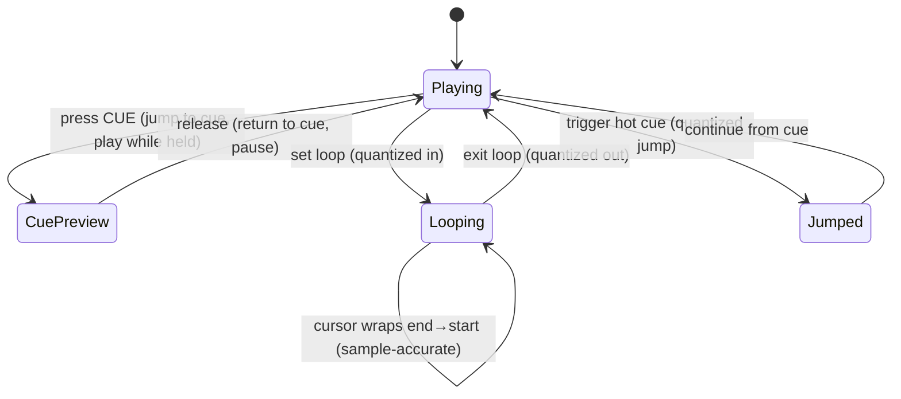

## 34. Latency budget and buffer management

### 34.1 The end-to-end budget

Performance credibility rests on *round-trip* latency — from a physical action (nudge a jog, move the crossfader, hit a cue pad) to the resulting change in the audio at the output. The target is **≤ 12 ms** action-to-audio at the default hardware buffer, and the engine must remain glitch-free (no dropouts) while sustaining it (NFR-PERF-2, FR-ENG-8). The budget decomposes as:

| Stage | Budget | Notes |
|---|---|---|
| Input event acquisition (HID/MIDI → main) | ≤ 1 ms | CoreMIDI / HID callback to main-actor intent |
| Intent → RT command enqueue | ≤ 0.1 ms | lock-free ring push (§12) |
| Command pickup latency (worst case) | 1 buffer | command applied at next render callback |
| Render callback compute | ≤ 30% of buffer period | headroom so we never overrun |
| Hardware output buffer | 1 buffer | AVAudioEngine → CoreAudio |
| DAC / interface | device-dependent | typically 1–2 ms on class-compliant gear |

At a **128-frame** buffer / 48 kHz, one buffer is ≈ 2.67 ms; two buffers plus compute and DAC land comfortably under 12 ms. At **256 frames** (≈ 5.33 ms) the app is still well within budget with more compute headroom, and this is the default for multi-deck + stems. The user can choose the buffer size in mockup 09 ("Buffer Size") to trade latency for headroom.

### 34.2 Why buffer size is a first-class setting

Stem playback (four AVAudioPlayerNodes per deck) plus EQ, filter, and metering costs materially more per callback than a single stereo file. The safe operating point depends on the mix of features and the machine. The engine therefore:

- Defaults to **256 frames** when stems are enabled on any deck, **128 frames** otherwise.
- Exposes a live **callback-load meter** (the CPU % in mockup 06's status bar is derived from render-time-over-period) so the user sees headroom.
- Applies an internal policy that *warns and suggests a larger buffer* if the measured render-time-over-period ratio exceeds a threshold (e.g., > 0.6) for a sustained window, rather than silently glitching (see §46 watchdogs).

### 34.3 Measuring render load

Render load is measured **inside** the render callback using the audio timestamp and the host clock, never with `Date`:

```swift
// Inside the render callback (illustrative; real code avoids even this if it allocates)
let start = mach_absolute_time()
renderAllDecksAndMix(into: outputBuffers, frameCount: frames)
let end = mach_absolute_time()
// Convert to seconds with cached timebase; publish via an atomic for the meter to read.
renderNanos.store(machToNanos(end - start), ordering: .relaxed)
```

The UI meter reads `renderNanos` (an atomic) at display cadence and divides by the buffer period to show a percentage. No timing computation crosses the RT boundary except a single relaxed atomic store.

### 34.4 Buffer pool and zero-allocation steady state

All buffers the render path can touch are **pre-allocated**:

- Per-deck scratch buffers for stem summing and EQ/filter state (sized to the max frame count).
- The mixer's master accumulation buffers.
- The metering ring that the spectrum/level views read from.

Steady-state rendering performs **no heap allocation, no locks, no Swift ARC traffic on reference types** (all hot structures are value types or pre-retained). Buffer size changes (a rare, user-initiated event) tear down and rebuild the engine and pools off the RT path, then resume — this is the one sanctioned time the graph is reconfigured.

### 34.5 Per-callback compute breakdown

Where §34.1's table budgets the *round-trip*, this one budgets the *compute inside a single callback* — the part the app controls. At 128 frames / 48 kHz (≈ 2.67 ms period) with two decks and stems, the callback must finish with headroom:

| Stage in callback | Budget (128f @48k, ~2.67 ms) |
|---|---|
| Drain command ring + read snapshot | < 50 µs |
| Deck A: read + stem-sum + loop/cue resolve | < 700 µs |
| Deck B: read + stem-sum + loop/cue resolve | < 700 µs |
| TimePitch / EQ (Apple units) | amortized in their own render |
| Crossfade + master EQ + limiter | < 300 µs |
| Recording/metering tap copy | < 100 µs |
| **Headroom** | remainder (≥ ~40%) |

These are targets the RT profiler (§34.3, §46.3) validates; the hard constraint is *never miss a callback*, guaranteed by the no-alloc/no-lock/no-IO contract (§34.4), not by hitting an average. If a deck's buffer is somehow not ready (should not happen given pre-loading, §34.2), that deck renders silence and bumps an atomic "starved" counter the monitor surfaces (NFR-REL) — the master output never blocks or glitches.

## 35. Deck and mixer architecture

### 35.1 A deck as a summed stem voice

Each deck is either a **single stereo source** (stems disabled) or **four stem voices** (vocals, drums, bass, other) summed with per-stem gain (mockup 06's stem faders). The deck presents one stereo signal to the mixer regardless. Internally:

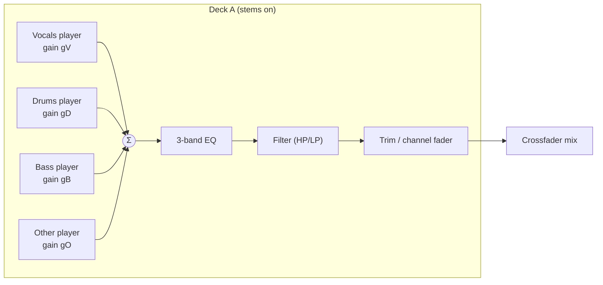

With stems **off**, `V` carries the full mix and `D/B/O` are silent (or, equivalently, a single player feeds the chain) — the downstream EQ/filter/fader path is identical, so the mixer doesn't care whether a deck is stemmed. Per-stem gains are smoothed (one-pole ramp) so fader moves don't click.

### 35.2 Three-band EQ

The channel EQ is a classic **isolator-style 3-band** (LOW/MID/HIGH, mockup 06 knobs) with full kill. Implementation is a pair of Linkwitz–Riley crossovers splitting the signal into three bands, each scaled by its knob gain (0 → −∞ dB kill, unity at 12 o'clock, up to +6 dB boost), then summed:

```swift
struct ThreeBandEQ {
    var lowMid  = LinkwitzRiley(splitHz: 200)   // LF/MF crossover
    var midHigh = LinkwitzRiley(splitHz: 2_000) // MF/HF crossover
    var gLow: Float = 1, gMid: Float = 1, gHigh: Float = 1  // smoothed targets

    mutating func process(_ x: SIMD2<Float>) -> SIMD2<Float> {
        let (lo, hiA) = lowMid.split(x)
        let (mid, hi) = midHigh.split(hiA)
        return lo * gLow + mid * gMid + hi * gHigh
    }
}
```

The crossover topology gives flat magnitude at unity and musical, phase-coherent kills. Coefficients are precomputed for 48 kHz; gains are ramped per block. (`SIMD2<Float>` carries the stereo pair; the real kernel processes a block with vDSP where it pays.)

### 35.3 Filter (HP/LP sweep)

A single per-channel **resonant filter** knob sweeps from low-pass (turn left) through neutral (center detent, bypassed) to high-pass (turn right), the standard DJ-mixer color filter. Implemented as a state-variable filter with a mapped cutoff and mild resonance; bypassed exactly at center to avoid coloring the neutral position.

### 35.4 Crossfader and channel faders

The **channel fader** (trim) sets each deck's contribution; the **crossfader** blends decks A↔B with a selectable curve (constant-power for smooth blends, or sharp for scratch-style cuts). Both use equal-power or linear laws as configured, with smoothing:

```swift
enum CrossfaderCurve { case constantPower, linear, sharp }

func crossfaderGains(_ x: Float, _ curve: CrossfaderCurve) -> (a: Float, b: Float) {
    switch curve {
    case .constantPower:
        let t = (x + 1) * 0.25 * .pi          // x∈[-1,1] → [0, π/2]
        return (cos(t), sin(t))
    case .linear:
        return ((1 - x) * 0.5, (x + 1) * 0.5)
    case .sharp:
        return (x < 0.4 ? 1 : 0, x > -0.4 ? 1 : 0) // hard cut with small overlap
    }
}
```

### 35.5 Master bus, limiter, and metering

Deck outputs are summed on the **master bus**, passed through a transparent **brickwall limiter** (lookahead, soft-knee) to guarantee the output never clips (FR-ENG-7), then split to (a) the output device and (b) the **recording tap** (§37) and (c) the **metering tap** feeding the spectrum and level meters (mockup 06). The limiter's ceiling and metering ballistics are fixed defaults; the limiter protects both ears and the recorded file. The master signal path (sum → limiter → taps) is the single point where the whole mix exists, which is exactly where recording and analysis of the live output attach.

### 35.6 Mapping to the node graph

Where feasible the chain uses **`AVAudioSourceNode` per deck** — the deck renders its own summed, EQ'd, filtered stereo block in its render block (all the DSP above executes there, lock-free), and AVAudioEngine handles device I/O and the master mix node. The limiter can be an `AVAudioUnit` (an Audio Unit effect) on the main mixer output, or hand-written in a final source/tap stage. This keeps sample-accurate control (§30) in our code while leaning on the engine for hardware plumbing (§29.3).

## 36. Stem separation pipeline

### 36.1 Two moments of stem use

Stems appear in **two** distinct contexts, and the pipeline serves both:

1. **Prep-time, offline (optional):** during or after analysis, a track can be separated and its stems cached so that loading it into a deck later is instant. This is a heavy, ANE/GPU-bound batch job (like the rest of Part IV).
2. **Performance-time, on demand:** when a DJ drags a not-yet-separated track onto a stem-enabled deck, the app must produce stems quickly enough to be useful — either by having them cached, or by separating in the background and swapping stems in when ready ("stems when ready", analogous to the existing player's "Opus when ready" fallback pattern).

The separation *engine* is shared; only the scheduling/urgency differs.

### 36.2 Model and conversion

Separation uses a **Demucs-family** source-separation model (4-stem: vocals/drums/bass/other) converted to **Core ML** so it runs on the Apple Neural Engine / GPU rather than the CPU. The conversion is an offline developer step (documented in Appendix D):

- Export the PyTorch model to a traced/ONNX form, then convert with `coremltools` to an `.mlpackage`, targeting `ComputeUnit.all` (ANE+GPU+CPU as available).
- Fixed input framing: the model runs on **fixed-length chunks** (e.g., a small number of seconds of stereo at the model's sample rate) with overlap-add at the seams to avoid boundary artifacts. Chunk length and overlap are constants in the stem module.
- Output is four stereo streams at the model's sample rate, resampled to the app's 48 kHz working rate if needed.

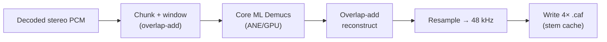

### 36.3 GPU/ANE scheduling and back-pressure

Separation is orchestrated by the same job runner as analysis (§19), but on a **dedicated, low-concurrency lane** because each job saturates the ANE/GPU. Rules:

- **Serialize** heavy separations (concurrency 1–2); never run more Core ML separations than the device can sustain without starving audio.
- During an **active performance** (engine running), prep-time separations are **paused or throttled** so the ANE/GPU and memory bandwidth stay available for real-time stem playback and metering. An on-demand separation the DJ explicitly triggered runs at higher priority than background prep but still yields to the audio thread's needs.
- Progress and stage are surfaced (mockup 03-style) so the user sees "separating…" and can prioritize a specific track.

### 36.4 Stem cache format and layout

Cached stems are stored as **four `.caf` files** per track (one per stem), 48 kHz, in a content-addressed stem directory keyed by the track's file hash + stem-model version (so a model upgrade invalidates cleanly, like `analysis_version`). The `asset` table (or a dedicated `stem_asset` row) records their presence, size, sample rate, and model version. Total stem storage is reported in Settings (mockup 10 shows "Stem Cache 18.7 GB"). CAF is chosen for the same reasons as elsewhere (robust, seekable, native).

### 36.5 Performance-time loading and memory

When a stem-enabled deck loads a track:

- If cached stems exist and match the current model version, the four `.caf` files are opened and fed to the four stem players (§35.1). Loading is memory-mapped/streamed like any deck source; only the working buffers are resident.
- If not, the deck loads the **full mix** immediately (so the DJ can play now) and enqueues an on-demand separation; when stems are ready they are swapped in on a beat boundary (the deck briefly reconfigures its voices off the RT path, then resumes), and the stem faders become live.
- Memory is bounded: at most the two loaded decks' stem sets are resident; unloading a deck releases its stem buffers. Stem cache on disk is subject to the same eviction policy as other caches under storage pressure (§43), never evicting stems for a currently loaded deck.

### 36.6 Quality and fallback

Separation quality is model-bound; the app treats stems as an *enhancement*, never a correctness requirement. If separation fails or is unavailable (older hardware, model missing), stem-dependent features degrade gracefully to full-mix playback (the deck still plays; stem faders are disabled with an explanatory state), mirroring the project-wide "silent-fallback is a defect; explicit-degrade is correct" stance (§46).

## 37. Recording pipeline

### 37.1 What is recorded

Recording captures the **master bus output** — exactly what the audience hears — post-limiter (§35.5), as a stereo file (mockup 07 "Recording Complete", default M4A/AAC 256 kbps per mockup 10). Recording is independent of the output device: it taps the same master signal that goes to hardware, so the recorded file matches the performance sample-for-sample (modulo the encoder).

### 37.2 Tap → encode → segment

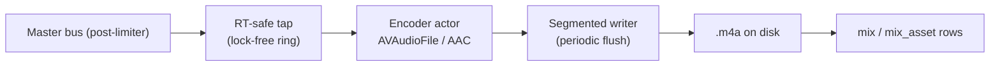

- The **tap** runs in (or right after) the render callback and does nothing but copy the master block into a **lock-free ring buffer** — no encoding, no file I/O on the audio thread.
- An **encoder actor** (off the RT thread) drains the ring, feeds an `AVAudioFile`/`AVAudioConverter` configured for AAC, and writes to disk. Because it's decoupled by the ring, encoder hiccups never stall audio; the ring is sized to absorb scheduling jitter.
- The writer **flushes periodically** (segment/checkpoint) so a crash loses at most a few seconds.

### 37.3 Crash recovery

Recording is designed so a crash or power loss leaves a **playable, near-complete file**:

- The file is written incrementally with periodic flushes; on unexpected termination the on-disk M4A is finalizable up to the last flush.
- A **recording journal** row (in `mix`, marked in-progress with its output URL and start time) lets the app, on next launch, detect an interrupted recording, finalize/repair the file, and present it in the mixes library (mockup 08) rather than losing it. This mirrors the recording-journal pattern noted in the schema (§15) and the crash-recovery expectations of a serious capture tool (FR-REC-3).

### 37.4 Metadata capture and the timeline

While recording, the engine logs a lightweight **event timeline** — deck loads, cues, loop toggles, crossfader/EQ moves at low rate — into `mix_track_event`, so a finished mix knows which tracks played and when (mockup 07's timeline; mockup 03 "performance history"). This is written by the same encoder/side-car actor, not the RT thread; events arrive via the same command/telemetry channel. The tracklist and section markers derive from this log and are stored with the mix, enabling the iPhone companion's "performance history" view (mockup iOS-03).

### 37.5 Finishing and delivery

On stop (mockup 07):

1. Finalize the M4A, compute duration/size, write the final `mix` row and `mix_asset` (file URL, format, bitrate, size).
2. Let the user set title/notes (mockup 07 fields).
3. Offer **Save Locally** (done) and **Save & Sync to iPhone** — the latter marks the mix's asset for CloudKit upload (§38), which happens in the background. The mix immediately appears in "Recorded Mixes" (mockup 08) with an upload-progress state until synced.

Recording defaults (format, bitrate, output folder) come from Settings (mockup 10). The recorder never blocks the engine and never changes what the audience hears — the tap is read-only on the master signal.


# Part VI — Sync and iPhone Companion

## 38. CloudKit sync protocol

### 38.1 Scope: what syncs and what does not

Platterhead's sync goal is narrow and deliberate: **finished mixes flow Mac → iPhone**, plus the small amount of metadata needed to browse and play them. The DJ's *library*, *analysis*, *stems*, and *vector index* do **not** sync — they are large, machine-local, and regenerable. This keeps iCloud usage bounded (mockup 10's storage breakdown shows mixes at 2.4 GB against 600 GB+ of local audio) and the protocol simple.

| Data | Syncs? | Direction | Rationale |
|---|---|---|---|
| Recorded mix audio (`.m4a`) | ✅ (opt-in per mix) | Mac → iPhone | The product's payload |
| Mix metadata (title, notes, duration, date) | ✅ | Mac → iPhone | Browse/play |
| Mix tracklist / performance history | ✅ | Mac → iPhone | mockup iOS-03 |
| Library tracks / albums / artists | ❌ | — | Machine-local, huge |
| Analysis, grids, embeddings, stems | ❌ | — | Regenerable, huge |
| DJ settings, MIDI mappings | ❌ (local) | — | Machine-specific |

⟢ **Repo alignment.** This reuses the existing `CloudSyncEngine` design wholesale: a `@MainActor` wrapper around `CKSyncEngine` against the **private** database, container **`iCloud.guru.parso.tonearm`**, custom zone **`TonearmLibrary`**, with the pure/testable split into `RecordMapping` / `SyncMerge` / `SyncGating`. The DJ app adds new record types to the same container and the iPhone app already knows how to consume that container. (§2 topology; existing `Sources/Sync/*`.)

### 38.2 Record types added by the DJ app

The DJ app introduces mix-centric record types alongside the existing library ones. All follow the established **record-name convention `"<Type>-<syncID>"`** where `syncID` is a UUID string, with parent references carried as syncID (migration-v7 convention):

| RecordType | Key fields | Asset? | Parent |
|---|---|---|---|
| `DJMix` | title, notes, startedAt, duration, bpmRange, keyList, createdOn | — | — |
| `DJMixAsset` | format, bitrate, byteCount, sampleRate | ✅ `CKAsset` (the `.m4a`) | `DJMix` |
| `DJMixTrackEvent` | atSeconds, kind, trackTitle, trackArtist, bpm, camelot | — | `DJMix` |
| `DJDeviceInfo` (optional) | deviceName, appVersion | — | — |

The audio lives on `DJMixAsset` as a `CKAsset` so CloudKit streams the file efficiently and the metadata record stays small and independently queryable. Tracklist events are separate child records so the companion can render the timeline without downloading the audio.

### 38.3 Mapping layer (pure and testable)

Conversion between local rows and `CKRecord`s is pure, mirroring `RecordMapping`:

```swift
enum DJRecordMapping {
    static func record(for mix: DJMix, zoneID: CKRecordZone.ID) -> CKRecord {
        let id = CKRecord.ID(recordName: "DJMix-\(mix.syncID)", zoneID: zoneID)
        let r = CKRecord(recordType: "DJMix", recordID: id)
        r["title"] = mix.title as CKRecordValue
        r["notes"] = mix.notes as CKRecordValue?
        r["startedAt"] = mix.startedAt as CKRecordValue
        r["duration"] = mix.duration as CKRecordValue
        r["bpmRange"] = mix.bpmRange as CKRecordValue?     // "122–124"
        r["createdOn"] = mix.createdOn as CKRecordValue?    // device tag
        return r
    }

    static func assetRecord(for a: DJMixAsset, fileURL: URL,
                            zoneID: CKRecordZone.ID) -> CKRecord {
        let id = CKRecord.ID(recordName: "DJMixAsset-\(a.syncID)", zoneID: zoneID)
        let r = CKRecord(recordType: "DJMixAsset", recordID: id)
        r["mixRef"] = CKRecord.Reference(
            recordID: .init(recordName: "DJMix-\(a.mixSyncID)", zoneID: zoneID),
            action: .deleteSelf)                            // asset dies with its mix
        r["format"] = a.format as CKRecordValue             // "m4a"
        r["bitrate"] = a.bitrate as CKRecordValue
        r["byteCount"] = a.byteCount as CKRecordValue
        r["audio"] = CKAsset(fileURL: fileURL)              // the payload
        return r
    }
}
```

The inverse (`CKRecord` → local rows) and the merge policy live in `DJSyncMerge`, unit-tested with fixtures — no network in the tests. `.deleteSelf` on the asset's parent reference means deleting a mix cleanly removes its asset and tracklist server-side.

### 38.4 Upload lifecycle (Mac side)

When the user chooses **Save & Sync to iPhone** (mockup 07) or toggles an existing mix to sync (mockup 08):

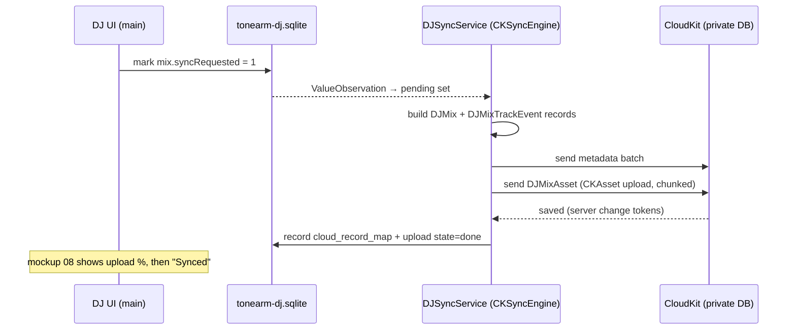

- The service uses `CKSyncEngine`'s state/serialization so uploads **resume** across launches and network drops; it does not re-upload assets already saved (tracked in `asset_upload` / `cloud_record_map`, §15).
- Uploads are **background-friendly**: the send happens off the main actor's critical path; progress is surfaced via observed state (mockup 08 "Uploading 47%").
- The engine **never bulk-deletes** on stop (existing `stop()` contract) — turning off sync for a mix is an explicit, scoped operation.

### 38.5 Download lifecycle (iPhone side)

The iPhone app (which already runs `CloudSyncEngine` for the music player) subscribes to the same zone and receives the new record types:

- On **silent push** / next fetch, it pulls new `DJMix` + `DJMixTrackEvent` metadata immediately (small), so mixes *appear* in the library (mockup iOS-02) quickly with a "download" affordance.
- `DJMixAsset` audio downloads per the user's policy (mockup iOS-05: auto-download on Wi‑Fi, cellular off by default). `CKAsset` files are materialized to the app's storage and referenced by a local mix row.
- Conflict handling is simple because the flow is one-directional for content: the Mac is authoritative for a mix's existence and audio; the iPhone may hold **local-only playback state** (last position, play counts) that never conflicts with Mac content. Last-writer-wins on the rare metadata edit, via the shared `SyncMerge` policy.

### 38.6 Asset integrity and retention

- Each `DJMixAsset` carries `byteCount` (and may carry a content hash) so the companion can verify a completed download and re-fetch on mismatch.
- Retention is user-controlled (mockup iOS-05 "Keep Downloaded: Forever"); the companion may evict downloaded audio under device storage pressure while keeping metadata, re-downloading on demand — the Mac and cloud remain the source of truth.
- Deleting a mix on the Mac propagates deletion (metadata + asset via `.deleteSelf`); the companion removes it on next sync.

### 38.7 Privacy posture

All of this uses the user's **private** CloudKit database in their own iCloud account (mockup 10 "Private Database", mockup 01 first-launch iCloud). There is **no Parso server, no third-party analytics, no shared/public zones** — consistent with the ecosystem's zero-backend, zero-telemetry stance (§43, NFR-PRIV-\*). If the user is signed out of iCloud, the DJ app is fully functional locally; sync simply parks until an account is available.

## 39. iPhone companion architecture

### 39.1 Additive, not a second app

The companion is **not** a new application — it is a set of **additive features inside the existing iOS player** (mockups iOS-01..05 explicitly modify the existing "Listen" home and add a Mixes section). It reuses the player's audio stack, navigation, and the already-present `CloudSyncEngine`; the DJ mixes are just a new content type surfaced alongside the user's existing library.

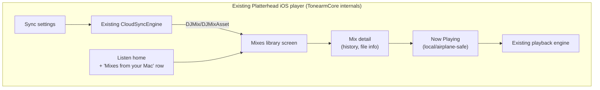

### 39.2 Data model on iPhone

The companion stores DJ mixes in the iOS app's existing GRDB database as a small set of additive tables/records (mix, mix_asset, mix_track_event mirrors) populated by the sync layer. These reuse the app's record/observation patterns; no schema fork, just new tables in the existing migrator. The mix's audio file is a local URL once downloaded.

### 39.3 Read-only and offline-first

The companion is **strictly read-only** with respect to mixes — it never edits or re-uploads mix content; it only manages local download/retention and playback state. Playback is **offline-first**: once a mix's audio is downloaded, it plays with **no network** (mockup iOS-04 shows an airplane-mode/local indicator), because DJs want to play their sets in venues with poor connectivity. This matches the product-wide local-first principle and the player's existing offline behavior.

### 39.4 Presentation surfaces

Each companion surface maps to the existing player's MV-* pattern (§40):

- **Listen home (modified):** a "Mixes from your Mac" shelf (mockup iOS-01) injected into the existing home view model's sections.
- **Mixes library (iOS-02):** list/grid of `DJMix` with download state and duration.
- **Mix detail (iOS-03):** metadata, **performance history/tracklist** rendered from `DJMixTrackEvent`, and file info (format/bitrate/size).
- **Now Playing (iOS-04):** the existing player chrome, fed a mix as its current item; scrubbing, artwork, local indicator.
- **Sync settings (iOS-05):** auto-download network policy, cellular toggle, retention — writing to the sync layer's config.

### 39.5 Playback integration

A mix is just another playable item to the existing engine: the companion wraps a downloaded mix's local `.m4a` in the player's existing item protocol and hands it to the engine. No DJ features (decks, EQ, stems) exist on iPhone — it is pure playback of a finished stereo file. This is why the companion is lightweight and why the heavy `TonearmDJ` module is macOS-gated and never shipped in the iOS binary (§9, `#if os(macOS)`).

### 39.6 The complete loop

The end-to-end product story closes here: a track is analyzed and prepared on the Mac (Parts IV–V), performed and recorded live (Part V/§37), synced to the DJ's phone via their private iCloud (§38), and played back anywhere, offline, inside the app they already use for listening (§39). One ecosystem, two apps, one private cloud bridge — the topology of §2 realized end to end.


# Part VII — Presentation Layer

## 40. UI architecture pattern

### 40.1 Pattern: SwiftUI + observable view models over the core façades

Both apps use **SwiftUI** with a **Model–View–ViewModel** shape that matches the existing repo: `@MainActor final class …Model: ObservableObject` view models hold `@Published` state, call into the core service façades (§10), and expose intent methods; views are thin and declarative. Where a screen observes the database, the view model subscribes to a repository's `ValueObservation`-backed `AsyncStream` (§18.4) and republishes; where it drives audio, it calls the `PerformanceEngine` façade and reads back lightweight published telemetry (never touching the RT thread directly).

⟢ **Repo alignment.** This is the same `@MainActor … ObservableObject + @Published` controller pattern the codebase already uses (e.g., `AudioPlayer`), so the DJ views compose naturally with existing ones and the iOS companion reuses the player's view models verbatim.

```mermaid
flowchart LR
    View["SwiftUI View"] -->|intent| VM["@MainActor ViewModel<br/>(ObservableObject)"]
    VM -->|calls| Svc["Core façade<br/>(DJLibraryStore / PerformanceEngine / …)"]
    Svc -->|AsyncStream / telemetry| VM
    VM -->|@Published| View
```

### 40.2 Three view-model tiers

- **Data-bound VMs** (library, mixes, search): observe repositories; cheap; survive backgrounding.
- **Session VMs** (workspace, prep): own transient performance/edit state; coordinate the engine and analysis; may be large but hold no audio buffers themselves.
- **Ephemeral VMs** (dialogs, settings panes): short-lived, own a slice of settings.

### 40.3 Telemetry cadence

Real-time readouts (meters, spectrum, CPU/GPU, playhead) are **display-rate** concerns. The engine publishes them via atomics/rings (§34.3); a single `DisplayLink`-driven pump on the main actor samples them at ~60 fps and updates a small `@Published` telemetry struct. View models never poll the RT thread and never block on it — the UI degrades to a stale-but-safe readout if a frame is missed, never a glitch in audio.

### 40.4 Screen inventory

Ten macOS screens (mockups Mac 01–10), five iOS surfaces (mockups iOS 01–05), and zero changed/new watchOS surfaces for this MVP. Each macOS and iOS surface is specified below as **View ▸ ViewModel ▸ Data/services** with the core types it binds to. All data models referenced are defined in Part III; all services in §10.

### 40.5 Mockup coverage contract

Every macOS screen in §41 MUST have a standalone HTML mockup before implementation. Every changed or new iOS or watchOS screen in §42 MUST also have a standalone HTML mockup before implementation. Adding, removing, or materially changing a screen requires updating this inventory, the matching §41/§42 mapping, `docs/plans/tonearm-mvp/tonearm-dj-mockups/index.html`, `docs/plans/tonearm-mvp/tonearm-dj-mockups/README.md`, and the mockup zip.

Current coverage is complete for the MVP: **Mac 10/10**, **iOS additions/modifications 5/5**, **watchOS additions/modifications 0/0**.

## 41. macOS screens

### 41.1 First launch / iCloud (mockup Mac-01)

- **View:** `FirstLaunchView` — welcome, iCloud account state, "what syncs" explainer, continue.
- **ViewModel:** `OnboardingModel` — reads iCloud account status (via the sync service), library-folder selection (defaults to `~/Music`), and writes initial `app_setting` rows.
- **Data/services:** `DJSyncService` (account status), `BookmarkVault` (security-scoped folder access), `DJLibraryStore` (persist watched folder). No analysis starts until a library location is confirmed.

### 41.2 Library (mockup Mac-02)

- **View:** `LibraryView` — the 12,842-track table (columns Title/Artist/Album/BPM/Key/Energy/Analysis), library-health banner (98.7%), vector-index size (6.3 GB), watched-folder chip (`~/Music`), sort/filter, multi-select.
- **ViewModel:** `LibraryModel` — subscribes to `DJTrackRepository.observeAll()` (or a windowed/paged query for scale), exposes sort/filter/search state, selection, and derived health metrics (count analyzed vs total). Column values (BPM/key/energy/analysis-state) come straight from the joined analysis rows.
- **Data/services:** `DJLibraryStore`, `DJTrackRepository` (Part III §18), `AnalysisCoordinator` (to show/enqueue analysis state), `FolderWatchService` (live folder changes). Health = `analysis_run` states aggregated; vector-index size from the sqlite-vec store file size (§16).

⟢ **Repo alignment.** Reuses `FolderWatchService`, `ReplayGain`/loudness fields, and `SearchQueryBuilder` from the existing codebase for the table's search box.

### 41.3 Ingestion & analysis (mockup Mac-03)

- **View:** `AnalysisView` — the live queue (7 pending), per-track stage (decode → FFT → CLAP), average time (~1.7 s), compute badges (ANE + CPU), throughput.
- **ViewModel:** `AnalysisModel` — subscribes to `AnalysisCoordinator` progress (an `AsyncStream` of per-track stage/percent, §19), shows the pipeline stages of Part IV, allows pause/prioritize.
- **Data/services:** `AnalysisCoordinator`, `analysis_run`/`analysis_version` rows, the job runner (§19). Timings are measured, not fabricated; the compute-unit badges reflect where CLAP/Core ML actually ran.

### 41.4 Vibe search (mockup Mac-04)

- **View:** `VibeSearchView` — the natural-language box ("dark driving bassline"), latency chip (43 ms), ranked results with % match, **+/- refine terms**, BPM range + Camelot constraints, **Save as Smart Crate**.
- **ViewModel:** `VibeSearchModel` — calls `SemanticSearchService.search(text:filters:)` (§27–28), holds the current query, positive/negative refine terms, and numeric/harmonic constraints; maps results to rows with score. "Save Smart Crate" persists the query as a `smart_crate` + `crate_rule` set (§14) so it re-evaluates as the library grows.
- **Data/services:** `SemanticSearchService`, `CLAPEmbedder` (text path), sqlite-vec store (§16), `smart_crate` persistence. The 43 ms figure is the measured ANN + rank time surfaced from the service.

### 41.5 Track preparation (mockup Mac-05)

- **View:** `TrackPrepView` — waveform with **beat grid & transient editor**, hot cues (A/B/C), energy readout (7.8/10), phrase length (32 beats), vibe descriptors, key/BPM, loop tools.
- **ViewModel:** `TrackPrepModel` — loads a track's analysis (grid, onsets, phrases, energy curve, key, embeddings-derived descriptors), supports **manual grid correction** (writes `grid_correction`, the authoritative override of §23.3), cue/loop CRUD (`cue_point`/`loop`), and preview playback via a single-deck engine instance.
- **Data/services:** `DJTrackRepository`, `AnalysisCoordinator` (re-derive if needed), `PerformanceEngine` (preview), `beat_grid`/`cue_point`/`loop`/`grid_correction` tables. Edits are immediate and persisted; corrections never mutate the immutable analysis, they layer over it (§17).

### 41.6 DJ workspace (mockup Mac-06)

- **View:** `WorkspaceView` — two decks (waveforms, transport, tempo/pitch, SYNC), **stem faders** (vocals/drums/bass/other), **3-band EQ** knobs (HIGH/MID/LOW), **crossfader**, spectrum, CPU/GPU readouts (12% / 48%), **REC** with timer, per-deck load.
- **ViewModel:** `WorkspaceModel` — the central **session VM**. Holds deck states (loaded track, playhead, tempo, key-lock, sync), mixer state (EQ/filter/fader/crossfader), stem gains, transport, and recording state. Sends **intents** to `PerformanceEngine` (load, play/cue, setRate, sync, setEQ, setStemGain, crossfade, start/stopRecording) which cross the RT boundary as commands (§12); reads back the 60 fps telemetry struct (playheads, levels, spectrum, CPU/GPU) for the meters.
- **Data/services:** `PerformanceEngine` (§10, §29–37), `RecordingService` (§37), `StemSeparator` (on-demand stems, §36), telemetry pump (§40.3). This screen never touches audio buffers; it is a control/telemetry surface over the engine.

### 41.7 Recording finish (mockup Mac-07)

- **View:** `RecordingFinishView` — title/notes fields, timeline (tracklist/markers), file summary, **Save Locally** / **Save & Sync to iPhone**.
- **ViewModel:** `RecordingFinishModel` — finalizes the mix (via `RecordingService`), binds title/notes, renders the timeline from `mix_track_event`, and triggers sync opt-in (sets `syncRequested`, §38.4).
- **Data/services:** `RecordingService`, `mix`/`mix_asset`/`mix_track_event`, `DJSyncService`. The timeline is the captured event log (§37.4), not a reconstruction.

### 41.8 Recorded mixes (mockup Mac-08)

- **View:** `MixesView` — grid of recorded mixes with upload/sync state (e.g., "Uploading 47%"), iCloud quota readout (38.2 GB), per-mix actions (play, sync toggle, delete, reveal).
- **ViewModel:** `MixesModel` — observes the `mix` table and the sync service's per-asset upload state; exposes sync toggles and deletion (which propagates to CloudKit, §38.6).
- **Data/services:** `mix`/`mix_asset`, `DJSyncService` (upload progress, quota), file system (reveal/play). Quota is read from CloudKit account/container info.

### 41.9 MIDI & audio (mockup Mac-09)

- **View:** `HardwareView` — audio device selection & buffer size, **multichannel routing** (e.g., Pioneer DJM-750MK2, 8-ch), **controller mapping** (DDJ-XP2), per-deck stem CC mappings, CPU target readout (~20%), MIDI-learn.
- **ViewModel:** `HardwareModel` — enumerates audio devices and MIDI endpoints (via `HardwareService`), edits `channel_routing`/`controller_profile`/`midi_mapping`/`midi_binding` (§15, §44), runs **MIDI-learn** (capture next control → bind to an action), and applies buffer-size changes (which trigger the sanctioned engine rebuild, §34.4).
- **Data/services:** `HardwareService` (CoreMIDI/CoreAudio, §44), routing/mapping tables, `PerformanceEngine` (apply routing/buffer). Mappings persist as profiles reusable across sessions.

### 41.10 Settings / iCloud (mockup Mac-10)

- **View:** `SettingsView` — private-CloudKit status, **storage breakdown** (Local 614 GB / Analysis 6.3 GB / Stems 18.7 GB / Mixes 2.4 GB), recording defaults (M4A/AAC 256 kbps, output folder), analysis/compute options, privacy statement.
- **ViewModel:** `SettingsModel` — reads storage sizes (DB, vector store, stem cache dir, mixes dir), edits `app_setting` rows (recording defaults, compute preferences), surfaces the privacy/zero-telemetry posture and iCloud account state.
- **Data/services:** `DJLibraryStore`/`app_setting`, file-size probes, `DJSyncService` (account), cache managers (for "clear cache" affordances, §43). Storage figures are real directory/file sizes, matching the categories the caches actually use.

## 42. iOS and watchOS companion screens

The five iOS surfaces are additive to the existing player and reuse its MV-* infrastructure (§39). Each is small.

### 42.1 Listen home — modified (mockup iOS-01)

- **View:** existing `ListenHomeView` + a **"Mixes from your Mac"** shelf.
- **ViewModel:** existing home model extended with a mixes section fed by `MixRepository.observeRecent()`.
- **Data/services:** iOS `mix` table (populated by sync, §38.5), existing home composition.

### 42.2 Mixes library (mockup iOS-02)

- **View:** `MixesLibraryView` — list/grid with download state, duration, date.
- **ViewModel:** `MixesLibraryModel` — observes `mix`; triggers per-mix download (asset fetch) and retention actions.
- **Data/services:** `mix`/`mix_asset`, `CloudSyncEngine` (download), retention policy (mockup iOS-05).

### 42.3 Mix detail (mockup iOS-03)

- **View:** `MixDetailView` — title/notes, **performance history/tracklist**, file info (format/bitrate/size), play.
- **ViewModel:** `MixDetailModel` — loads the mix, renders `mix_track_event` as the tracklist, exposes play/download.
- **Data/services:** `mix`/`mix_asset`/`mix_track_event`. Tracklist is the synced event log (§38.2), no audio needed to display it.

### 42.4 Now playing (mockup iOS-04)

- **View:** existing player Now-Playing chrome with a **local/airplane-safe** indicator.
- **ViewModel:** existing playback VM, handed a downloaded mix as its item.
- **Data/services:** existing engine + the mix's local `.m4a` (offline-first, §39.3).

### 42.5 Sync settings (mockup iOS-05)

- **View:** `MixSyncSettingsView` — auto-download (Wi‑Fi), cellular toggle (off default), retention ("Forever").
- **ViewModel:** `MixSyncSettingsModel` — reads/writes the sync layer's policy config.
- **Data/services:** `CloudSyncEngine` config, iOS `app_setting`.

### 42.6 watchOS companion impact (no MVP UI changes)

The DJ MVP does not add or materially change any watchOS views. Existing watchOS playback, browse, storage, and transfer-management views remain scoped to the shipped Platterhead player and are not part of Mac mix delivery in v1.0. If a future milestone adds watchOS mix browsing, mix playback, download policy, or storage management for DJ mixes, that milestone MUST add `watch/*.html` mockups and update §40.4/§40.5 before implementation.

## 42A. Liquid Glass adoption

The app adopts **Liquid Glass** (iOS/macOS 26 material) **behind a capability flag**, exactly as established in J's other projects: a `GlassFeature.isEnabled` gate that is true only on OS 26+ and falls back to conventional materials on the deployment floor (iOS 17 / macOS 14). Adoption is **surgical** — applied to chrome (toolbars, deck panels, the workspace's control surfaces, sheet backgrounds) where it enhances depth without harming legibility of waveforms/meters — never to data-dense readouts where contrast matters. This preserves the iOS 17/macOS 14 floor (§6 constraints) while looking native on current OSes, and keeps a single codebase via the flag rather than forked views.

```swift
enum GlassFeature {
    static var isEnabled: Bool {
        if #available(macOS 26, iOS 26, *) { return UserToggle.glass } else { return false }
    }
}
// Usage: view.modifier(GlassFeature.isEnabled ? AnyGlassBackground() : AnyMaterialBackground())
```


# Part VIII — Cross-Cutting Concerns

## 43. Performance and resource budgets

### 43.1 Philosophy

Budgets exist so the app degrades **predictably** and never at the expense of the audio thread. The single inviolable rule: **the render callback must complete within its period with margin, always** (NFR-PERF-2). Everything else — analysis throughput, stem separation speed, UI smoothness — yields to that. Budgets below are targets on a representative Apple-Silicon Mac (the mockups' machine class); the app measures against them at runtime and adapts (throttle background work, suggest a larger buffer) rather than assuming.

### 43.2 CPU budget (performance-time)

| Consumer | Target (2 decks, stems on) | Hard ceiling |
|---|---|---|
| Audio render (both decks + mixer + limiter) | ≤ 30% of one P-core-equivalent within each callback | never overrun the period |
| Metering/spectrum pump (main, 60 fps) | ≤ 3% | — |
| UI (SwiftUI) idle/interacting | ≤ 5% / ≤ 15% | — |
| Background analysis (during performance) | throttled to spare capacity | paused if audio margin drops |
| Total sustained (mockup 06 shows "CPU 12%") | ≤ ~25% typical | — |

The mockup's 12% is a plausible steady state with two decks and stems on a modern machine; the ceiling matters more than the typical — the render path keeps ≥ 40% headroom against its period at the chosen buffer.

### 43.3 GPU / Metal budget

| Consumer | Target | Notes |
|---|---|---|
| Waveform/spectrum rendering | modest, batched | Metal-drawn waveforms; one draw per frame |
| Real-time stem playback (no GPU needed) | 0 (CPU/vDSP) | stems already separated → just summed on CPU |
| **On-demand stem separation** (Core ML) | bursty, ANE/GPU-bound | scheduled off the audio path, throttled during performance (§36.3) |
| Mockup 06 "GPU 48%" | transient during separation/visuals | not a steady requirement |

The 48% GPU in mockup 06 reflects a moment of GPU-assisted work (visuals and/or a background separation), not a sustained floor. Steady performance with pre-separated stems is CPU/vDSP-bound and leaves the GPU largely free.

### 43.4 ANE (Neural Engine) budget

The ANE is used **offline/opportunistically** for CLAP embedding (§27) and Demucs separation (§36), never in the render path. During a live performance, ANE work is **paused or throttled** so it never competes with audio for memory bandwidth. Outside performance (library analysis), the ANE runs hot to maximize throughput (mockup 03's "ANE + CPU" badges; ~1.7 s/track).

### 43.5 Memory budget

| Region | Budget | Notes |
|---|---|---|
| Loaded decks (2) audio buffers | bounded, streamed | memory-mapped/streamed sources; only working windows resident |
| Stem sets (≤ 2 decks × 4 stems) | bounded | released on deck unload (§36.5) |
| Analysis working set (per job) | bounded per job | freed on completion; concurrency-limited |
| Vector index (sqlite-vec) | on disk (6.3 GB), queried | not fully resident; ANN reads as needed |
| Waveform pyramids | LOD-cached | only visible resolutions resident (§26) |

The 6.3 GB vector index (mockup 02) lives on disk and is queried by sqlite-vec; it is **not** loaded into RAM wholesale. Audio is streamed, not slurped, so resident memory is dominated by working buffers, not track length.

### 43.6 Storage budget and cache eviction

Storage categories match Settings (mockup 10): **Analysis 6.3 GB**, **Stems 18.7 GB**, **Mixes 2.4 GB**, plus the user's own audio (614 GB, not managed by the app). Regenerable caches (analysis intermediates, stems, waveform pyramids) are **evictable under pressure** by an LRU-ish policy with pinning:

- **Never evict:** analysis/stems for a **currently loaded deck** or an in-progress recording; mix audio pending upload.
- **Evict first:** waveform pyramids and stems for tracks not recently touched; then older analysis intermediates (re-derivable from the immutable pipeline, §17).
- The user can **clear caches** explicitly (Settings), and the app reports sizes truthfully from directory probes (§41.10).

⟢ **Repo alignment.** Reuses the codebase's cache-manager patterns and SHA-256 content addressing (`CacheKeyGenerator`, CryptoKit — **never** Swift `Hasher`, which reseeds per launch; a defect caught across J's projects) so cache keys are stable across launches (§13, §36.4).

### 43.7 Runtime adaptation

The app closes the loop between budgets and reality:

1. Measure render-load ratio and audio-margin continuously (§34.3).
2. If margin drops below threshold: **pause background analysis/separation**, then if still tight, **surface a buffer-size suggestion** (§34.2), never silently glitch.
3. If storage is low: evict per §43.6 and warn.
4. If thermal pressure rises (long sets on a laptop): throttle background lanes first, keeping the audio path whole.

## 44. Hardware integration

### 44.1 Surfaces

Two hardware surfaces (mockup 09): **audio I/O** (multichannel interfaces / DJ mixers like the Pioneer DJM-750MK2, 8 output channels) and **MIDI control** (controllers like the DDJ-XP2 for pads, and generic MIDI-learn for any device). Both are optional — the app is fully usable with the built-in output and mouse/keyboard — but first-class when present (FR-HW-\*).

### 44.2 Audio device selection and multichannel routing

- **Enumeration/selection** via CoreAudio; the chosen device and buffer size are `app_setting`s applied to the engine (a device or buffer change triggers the sanctioned engine rebuild, §34.4).
- **Multichannel routing** maps logical outputs — master, booth/monitor, and (for external-mixer or 4-deck workflows) per-deck sends — to the interface's physical channels via `channel_routing` rows (§15). A DJ mixer like the DJM-750MK2 can receive decks on separate channel pairs so the hardware crossfader/EQ can be used; alternatively the app's internal mixer feeds a stereo master. The routing model supports both "internal mixer → stereo out" and "send decks discretely to an external mixer".

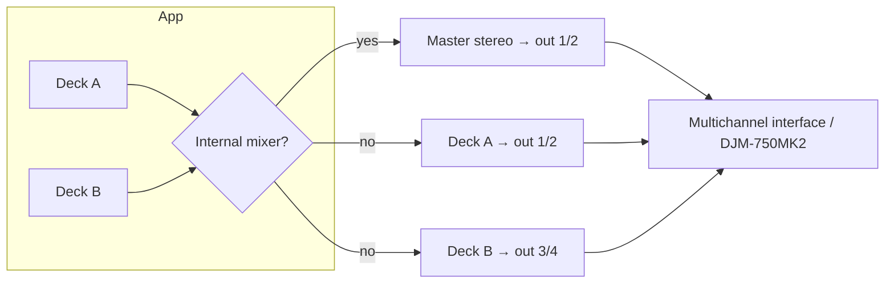

### 44.3 MIDI: CoreMIDI plumbing

`HardwareService` (§10) owns CoreMIDI: it discovers endpoints, opens inputs, timestamps incoming events, and translates them into engine **intents** on the main actor (which then cross the RT boundary as commands, §12). Outgoing MIDI (LED/jog feedback) is supported for controllers that reflect state (e.g., lighting a cue pad when a cue exists). MIDI I/O never runs on the audio thread; it feeds the same command channel everything else uses.

### 44.4 MIDI-learn and mapping model

Mappings are data, not code (§15's `controller_profile`/`midi_mapping`/`midi_binding`):

- **MIDI-learn:** the UI enters a capture mode, the user moves a control, `HardwareService` reports the next incoming message's identity (channel, type, number), and the app binds it to a chosen **action** (e.g., `deckB.stem.vocals.gain`, `crossfader`, `deckA.hotcue.1`) with a value transform (absolute/relative, range, curve).
- **Per-deck stem CC mappings** (mockup 09) are just bindings whose target is a stem gain on a specific deck.
- Profiles are named and reusable; a known controller (DDJ-XP2) can ship with a **default profile** the user can adopt or edit. Bindings persist and reload with the session.

```swift
struct MidiBinding: Codable {
    var input: MidiAddress        // channel, status, data1
    var action: EngineAction      // enum of bindable targets
    var transform: ValueTransform // absolute/relative, min/max, curve
}
enum EngineAction: Codable {      // illustrative subset
    case crossfader
    case channelFader(DeckID)
    case eq(DeckID, EQBand)
    case stemGain(DeckID, Stem)
    case hotCue(DeckID, Int)
    case loopToggle(DeckID)
    case sync(DeckID)
    case play(DeckID)
}
```

### 44.5 Latency and clocking for hardware

Control latency from a pad/knob follows the §34.1 budget (HID/MIDI → intent → command → next callback). For audio, the interface's own buffer adds to the round trip; the app accounts for the selected device's reported latency in its budget display. There is no attempt to slave the audio clock to external MIDI clock in v1 (the app is the tempo authority via its grids and sync, §32); syncing *to* external clock is a roadmap item (§50).

## 45. Security and privacy model

### 45.1 Principles

The DJ app inherits the ecosystem's stance: **no accounts, no telemetry, no ads, no third-party servers**; all data is local or in the **user's private iCloud** (NFR-PRIV-\*, §2). There is nothing to log in to and nowhere for data to go except the user's own devices and iCloud.

### 45.2 Data at rest

- The library, analysis, embeddings, stems, and mixes live in the app's container on the user's Mac. Access to the user's music folders is via **security-scoped bookmarks** (`BookmarkVault`), so the app touches only what the user granted (§41.1).
- No secrets are stored (there is no API key, no account token); CloudKit uses the system iCloud identity, not app-held credentials.

### 45.3 Data in transit

- The only network egress is **CloudKit** to the user's **private** database (§38.7). There are no analytics endpoints, crash-reporting SDKs, or content servers. This is enforceable and audited the same way the existing repo enforces zero-telemetry (a CI registry test that fails the build if a networking symbol outside the sanctioned CloudKit path appears).

⟢ **Repo alignment.** The codebase already ships a **FreeTierRegistry/CI test** asserting no telemetry; the DJ target is added to that guard so the "no tracking" claim is continuously verified, not merely intended.

### 45.4 Permissions and least privilege

- **Microphone/input:** not required for the core product (the app records its own master bus, not an input) — so no microphone permission is requested unless a future line-in feature is added.
- **Files:** user-selected folders only (bookmarks).
- **Local network / Bluetooth:** only if/when a hardware feature needs it; not by default.
- **iCloud:** used only if the user is signed in and opts to sync a mix; absence of iCloud never blocks local use.

### 45.5 Threat model (brief)

The relevant risks for a local, single-user creative tool are **data loss** (mitigated by immutable analysis, crash-safe recording §37.3, and iCloud copies of mixes) and **privacy leakage** (mitigated by having no backend and no telemetry). There is no multi-tenant surface, no server to breach, and no shared data. Supply-chain risk (dependencies) is limited by a small, audited dependency set (GRDB, sqlite-vec, the Core ML models) pinned by version.

## 46. Error handling, resilience, and watchdogs

### 46.1 Failure philosophy

Two rules govern every subsystem: **(1) never crash or glitch the audio thread**, and **(2) fail loud, not silent** — a missing model, a failed separation, or a corrupt cache must produce an explicit, recoverable state, never a quiet wrong result. This directly encodes a defect class J has hit before (a gitignored CLAP model silently falling back to a degenerate path); the architecture forbids silent fallback (§36.6, §45).

### 46.2 Layered resilience

- **Analysis (Part IV):** each job is isolated; a failure marks that track's `analysis_run` as failed with a reason and moves on (the batch never dies for one bad file). Re-analysis is idempotent (§17). Corrupt/undecodable inputs are quarantined with a clear state in the library (mockup 02's analysis column).
- **Search (Part IV):** if the vector index is missing/mismatched, semantic search reports **unavailable** and offers to (re)build, rather than returning empty-but-plausible results.
- **Engine (Part V):** the render path is defensive — a deck with no valid buffer renders silence, not garbage; a bad command is ignored at the boundary; the graph is only reconfigured off-thread (§34.4).
- **Recording (§37):** crash-safe via journaling and periodic flush; interrupted recordings are recovered on next launch.
- **Sync (Part VI):** resumable via `CKSyncEngine` state; network loss parks rather than fails; never bulk-deletes.

### 46.3 Real-time assertions (debug shim)

Because the cardinal sin is doing forbidden work on the audio thread, the codebase includes an **RT-assertion shim**: in DEBUG builds, a thread-local flag is set around the render callback, and wrappers around allocation/locking/logging **assert** if called while that flag is set. This catches accidental `malloc`, `os_unfair_lock`, or `print` on the audio thread during development, before it ever ships. In RELEASE the shim compiles out to nothing.

```swift
#if DEBUG
enum RTGuard {
    @TaskLocal static var inRenderContext = false
    static func assertRTSafe(_ what: @autoclosure () -> String) {
        assert(!inRenderContext, "RT-UNSAFE: \(what()) on audio thread")
    }
}
// render callback wraps its body in RTGuard.$inRenderContext.withValue(true) { … }
// allocation/lock/log helpers call RTGuard.assertRTSafe("malloc"/"lock"/"log")
#endif
```

(The exact mechanism is thread-local rather than task-local in the C render context; the shim is illustrative of intent — assert, don't ship a glitch.)

### 46.4 Watchdogs and health

- **Render watchdog:** monitors the render-load ratio (§34.3); sustained high load triggers the throttle-then-suggest-buffer policy (§43.7) and a UI hint, never a silent dropout.
- **Stall watchdog (per app, per project convention):** detects a stuck deck/stream (no progress when it should be playing) and recovers (reload/seek) with a surfaced state. ⟢ Consistent with J's "stall watchdog stays per-app in first phase" decision from the shared-engine work.
- **Sync watchdog:** surfaces stuck uploads/downloads with retry, rather than a spinner forever.

### 46.5 User-visible error surfaces

Errors map to concrete UI: failed analysis shows in the library's analysis column with a reason on hover and a "retry"; unavailable search offers "rebuild index"; a failed separation disables stems for that deck with an explanation; a sync problem shows on the mix (mockup 08) with retry. The user is never left guessing, and no error takes down audio.

## 47. Testing strategy and acceptance criteria

### 47.1 The pure/shell split makes testing tractable

The architecture deliberately concentrates the tricky logic in **pure functions** (DSP kernels, beat/phase math, Camelot mapping, scoring, record mapping, merge policy) that are deterministic and unit-testable off any device, and keeps the **impure shell** (audio callback, CoreMIDI, CloudKit networking, file I/O) thin. This is the same testability posture as the existing repo's `RecordMapping`/`SyncMerge`/`SyncGating` split (§38.3).

### 47.2 Test tiers

- **Unit (pure):** DSP correctness against synthetic signals (a known-BPM click track yields the right tempo/grid; a pure tone yields the right chroma/key; a ramp yields the right loudness); scoring/ranking math; Camelot compatibility; record mapping round-trips; sync merge conflict outcomes.
- **Golden-file (analysis):** a small corpus of fixture tracks with **checked-in expected analysis** (BPM, key, downbeats, phrase boundaries within tolerance) so pipeline changes are caught as diffs; embedding-version bumps regenerate goldens deliberately.
- **Engine (integration, deterministic):** drive the engine with an **offline render** (no hardware) and scripted commands; assert sample-accurate behavior — a scheduled cue lands on the exact frame, a loop wraps seamlessly, sync aligns phase — by rendering to a buffer and inspecting it. The RT-assertion shim (§46.3) runs in these tests to catch RT-unsafe code.
- **Sync (integration):** against the CloudKit test/local environment, assert upload→download round-trips of a mix and its asset, deletion propagation, and resumability.
- **UI (smoke/snapshot):** view models exercised with fake services; key screens snapshot-tested for regressions.

### 47.3 Acceptance tests (traceable to requirements)

Each functional-requirement family has explicit acceptance tests referenced throughout the document:

| Test ID | Requirement | Passes when |
|---|---|---|
| **AT-ING-\*** | FR-LIB, FR-ANL | Importing a folder analyzes all tracks; failures are isolated and reported; re-analysis is idempotent; library health reflects true counts (mockups 02/03). |
| **AT-SEARCH-\*** | FR-SEM | A natural-language query returns ranked results with scores under the latency target; +/- refine and BPM/Camelot constraints alter results correctly; a query saves as a smart crate that re-evaluates (mockup 04). |
| **AT-GRID-\*** | FR-PREP | Analyzed grids match golden BPM/downbeats within tolerance; manual `grid_correction` overrides without mutating immutable analysis and persists (mockup 05, §23.3). |
| **AT-ENGINE-\*** (incl. **AT-ENGINE-SYNC-\***) | FR-ENG | Offline-rendered output shows sample-accurate cues/loops, correct time-stretch with key-lock, and phase-aligned sync; render-load stays within budget; no RT-unsafe calls (mockup 06, §30–34). |
| **AT-REC-\*** | FR-REC | A recorded set matches the master bus; periodic flush yields a playable file after simulated crash; the event timeline/tracklist is captured (mockups 07/08, §37). |
| **AT-SYNC-\*** | FR-SYNC | Save & Sync uploads a mix; the companion downloads metadata then audio per policy; deletion propagates; uploads resume after interruption (mockups 08/iOS-02, §38). |
| **AT-MIDI-\*** | FR-HW | MIDI-learn binds a captured control to an action; per-deck stem CC mappings drive the right gains; multichannel routing sends audio to the mapped physical channels (mockup 09, §44). |

### 47.4 Continuous enforcement (CI gates)

Beyond correctness tests, CI enforces **product invariants** as grep/registry gates — the same enforcement mechanism J uses across projects:

- **Zero-telemetry gate:** fails the build if a networking symbol outside the sanctioned CloudKit path is introduced in the DJ target (§45.3).
- **RT-safety gate:** the engine integration tests run with the DEBUG RT-assertion shim; any RT-unsafe call fails CI (§46.3).
- **Schema/immutability gate:** analysis-mutating writes must go through the versioned pipeline; a gate flags direct writes to immutable analysis tables outside a migration/version bump (§17).
- **Determinism gate:** golden-file analysis diffs must be intentional (an embedding/analysis version bump), not accidental.

This makes the document's promises — private, deterministic, real-time-safe — **continuously verified properties** of the codebase rather than aspirations, closing the loop between architecture and enforcement.


# Part IX — Delivery

## 48. Implementation roadmap and milestones

The build follows six phases (extending the HLD's phasing). Each phase ends at a **demonstrable milestone** with acceptance tests green. Phases are ordered so that each rests on a proven substrate; nothing real-time is attempted before the data and analysis foundations exist.

### 48.1 Phase 0 — Foundations & scaffolding

**Goal:** the DJ target exists, builds, and can open its own database.
- Add the `TonearmDJ` macOS library product and the `guru.parso.tonearm.dj` app target to the existing package/repo (§9); wire XcodeGen.
- Stand up `tonearm-dj.sqlite` with the `DJSchema` migrator and migration `dj_v1` (relational core, §14). Vendored `CSQLiteVec` target compiles; `dj_v2` analysis tables and vec virtual tables load (§15–16).
- `DJLibraryStore` + `DJTrackRepository` with `ValueObservation` streams (§18).
- **Milestone M0:** app launches, creates its DB, imports a folder's file rows (no analysis yet), shows them in a bare library list. CI green (build, schema, zero-telemetry gates).

### 48.2 Phase 1 — Ingestion & analysis pipeline

**Goal:** a real library with real analysis.
- Decode substrate + loudness/DR (§19–20); the job runner with isolation and concurrency limits (§19).
- FFT/DSP engine and features (§21); onset/tempo (§22); beat/downbeat grids (§23); key/Camelot (§24); phrase segmentation (§25); waveform pyramids (§26). Persist all per Part III; immutability + versioning (§17).
- Library + Ingestion screens wired to real progress (mockups 02/03).
- **Milestone M1:** import → full analysis with visible stages and timings; golden-file analysis tests pass (**AT-ING-\***, **AT-GRID-\***). Library health is truthful.

### 48.3 Phase 2 — Semantic layer (CLAP + search)

**Goal:** natural-language vibe search.
- Package the CLAP Core ML model; embedding windows + pooling + versioning (§27); write `track_embedding`/`window_embedding` and index into sqlite-vec (§16).
- `SemanticSearchService`: text→embedding→ANN→hybrid rank with BPM/Camelot/energy/phrase weighting (§28); +/- refine; smart-crate persistence (§14).
- Vibe Search screen (mockup 04) with real latency readout.
- **Milestone M2:** "dark driving bassline" returns ranked, constrained results under the latency target; smart crates re-evaluate (**AT-SEARCH-\***).

### 48.4 Phase 3 — Real-time engine (single then dual deck)

**Goal:** deterministic, low-latency performance.
- The lock-free RT boundary (§12); AVAudioEngine graph (§29); master clock + sample-accurate scheduler (§30); time-stretch/key-lock (§31); sync (§32); cues/loops/quantize (§33); latency/buffer management (§34); deck+mixer (EQ/filter/crossfader/limiter, §35).
- Track Prep (mockup 05) and DJ Workspace (mockup 06) wired to the engine via the session VM; 60 fps telemetry pump (§40.3).
- **Milestone M3:** two decks beatmatch and mix with sample-accurate cues/loops, key-locked tempo, phase-aligned sync, within latency and render-load budgets; offline-render engine tests pass with the RT-safety shim (**AT-ENGINE-\***, **AT-ENGINE-SYNC-\***).

### 48.5 Phase 4 — Stems & recording

**Goal:** stem control and set capture.
- Demucs→Core ML separation (§36): offline batch + on-demand "stems when ready"; stem cache (`.caf`, content-addressed, versioned); throttling during performance.
- Recording pipeline (§37): RT-safe master tap → encoder actor → segmented M4A; crash-recovery journal; event timeline; finish/finalize (mockups 07/08).
- **Milestone M4:** stem faders work live; a set records to a crash-safe M4A with a captured tracklist (**AT-REC-\***). Stems degrade gracefully when unavailable (§36.6).

### 48.6 Phase 5 — Sync, companion & hardware; polish

**Goal:** the full ecosystem and pro I/O.
- DJ CloudKit record types + mapping/merge (§38) added to the existing `CloudSyncEngine`; upload/download lifecycle; iOS companion surfaces (mockups iOS-01..05) reusing the player (§39).
- Hardware: CoreAudio device/routing, CoreMIDI, MIDI-learn, controller profiles, multichannel (§44; mockup 09).
- Settings/storage/eviction (§43.6; mockup 10); Liquid Glass behind the capability flag (§42A); accessibility pass (NFR-A11Y).
- **Milestone M5 (v1.0):** record on Mac → sync to iPhone → play offline; MIDI-mapped controller drives the workspace; multichannel out to a DJ mixer; all acceptance tests and CI invariant gates green (**AT-SYNC-\***, **AT-MIDI-\***). Ship.

### 48.7 Milestone summary

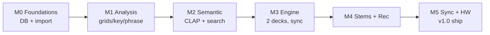

## 49. Coding-agent execution guide

This section tells an agentic coding tool (e.g., Claude Code) **how to build from this document** in J's established plan-first workflow: committed markdown plans, small reviewable PRs, CI gates as the enforcement mechanism.

### 49.1 Working agreement

- **One milestone = one plan file** in `docs/plans/` (e.g., `docs/plans/dj-phase-3-engine.md`), derived from the relevant sections here, listing the ordered PRs, the interfaces to implement (copy the normative signatures from Part II/Part III), and the acceptance tests to make green.
- **Small PRs**, each with tests; a PR is not done until its slice of the phase's acceptance tests pass and CI invariant gates are green.
- **Do not fork** existing modules; extend the package (§9) and reuse services (`BookmarkVault`, `FolderWatchService`, `ReplayGain`, `CacheKeyGenerator`, `CloudSyncEngine`, `RecordMapping`) per the ⟢ alignment callouts.

### 49.2 Order of implementation (per phase)

For each phase: **schema → pure logic → shell → UI → tests**.
1. Land the migration(s) and record types first (Part III), with round-trip tests.
2. Implement the **pure** functions (DSP kernels, scoring, mapping, sync merge) with unit/golden tests — these carry the risk and are cheap to test.
3. Wire the **shell** (job runner, audio callback, CoreMIDI, CloudKit) around the pure core.
4. Bind the **view models and screens** (Part VII).
5. Add **acceptance + CI gate** coverage (Part VIII) and only then close the milestone.

### 49.3 Non-negotiable invariants for the agent

The agent must preserve these or CI fails (and it should treat a red gate as a hard stop):
- **RT-safety:** no allocation/locking/logging on the audio thread; all engine control via the command ring (§12, §46.3).
- **Determinism/immutability:** analysis is versioned and immutable; corrections layer over it (§17).
- **Privacy/zero-telemetry:** no networking outside the sanctioned CloudKit path; DJ target stays in the telemetry registry gate (§45.3).
- **Stable hashing:** content addressing via SHA-256/CryptoKit, never Swift `Hasher` (§43.6).
- **Naming/records:** snake_case tables, camelCase columns; CloudKit record names `"<Type>-<syncID>"` (§13, §38.2).

### 49.4 Definition of done (per PR)

A PR is done when: it implements a named slice of a phase; unit/golden/engine/sync tests for that slice pass; CI invariant gates are green; the code matches the normative interfaces in this document (or the document is updated deliberately if an interface must change); and no RT-unsafe or telemetry code was introduced.

## 50. Risks and open questions

### 50.1 Technical risks

| Risk | Impact | Mitigation |
|---|---|---|
| **Time-stretch quality** at wide tempo pulls via `AVAudioUnitTimePitch` | Audible artifacts beyond ±8% | Constrain UI warnings; evaluate a higher-quality stretch (roadmap) if needed; key-lock tuned for music (§31.2) |
| **On-demand stem separation latency** | DJ waits for stems mid-set | Prefer prep-time caching; "stems when ready" fallback plays full mix immediately (§36.5) |
| **CLAP model size / index size** (6.3 GB class) | Disk footprint; build time | Windowed embeddings, f16 BLOBs, on-disk ANN; incremental re-index (§27.6); evictable intermediates (§43.6) |
| **Render-load spikes** with stems+EQ on modest hardware | Dropouts | Buffer-size policy, throttle background lanes, measured margin + suggestions (§34, §43.7) |
| **CoreML separation accuracy** on some material | Weak stems | Treat stems as enhancement; graceful degrade; allow model upgrades via versioned cache (§36) |
| **CloudKit asset upload reliability** on large mixes | Failed/slow sync | `CKSyncEngine` resumability; chunked assets; integrity via byteCount/hash (§38) |

### 50.2 Product / scope questions (open)

- **Four-deck support?** v1 targets two decks (mockup 06); the deck/mixer model generalizes, but routing/UI for four decks is a post-v1 decision (§44.2 already anticipates discrete sends).
- **External MIDI-clock slaving?** v1 is the tempo authority; syncing *to* external clock is deferred (§44.5).
- **Effects (reverb/delay/etc.) beyond EQ/filter?** Not in v1's core; the mixer architecture leaves room (an FX send/insert stage) but it is out of scope until the fundamentals ship.
- **Video/stream-out?** Explicitly out of scope (audio-first product).
- **Windows/other platforms?** Out of scope — the product is Apple-Silicon-native by thesis (§1, §6).
- **Streaming-service track sources?** Out of scope — the app is local-library-first (privacy thesis); Internet-Archive-style sources may already exist in the iOS player but DJ operates on the local library.

### 50.3 Assumptions to validate early

- That pre-separated stems make steady-state performance CPU/vDSP-bound with the GPU largely free (§43.3) — validate on target hardware in Phase 4.
- That the 43 ms search latency (mockup 04) holds at full library scale with sqlite-vec — validate in Phase 2 with a full-size index.
- That `AVAudioUnitTimePitch` key-lock quality is acceptable to DJs in the beatmatching range — validate with real material in Phase 3.

## 51. Appendices

### Appendix A — Remaining GRDB record structs (enumeration)

Part III §18 gave `DJTrack` and `CuePoint` in full as the pattern. The remaining records follow the **same shape** — `Codable` struct conforming to `FetchableRecord, MutablePersistableRecord`, `static let databaseTableName` (snake_case), camelCase columns, `didInsert` capturing rowID, and a `Columns` enum for type-safe queries. The complete set to implement, grouped by migration:

**`dj_v1` (relational core):** `Artist`, `Album`, `Track` (`DJTrack`), `TrackArtist`, `Genre`, `TrackGenre`, `Folder`, `Asset`, `ImportEvent`, `CuePoint`, `HotCueBank`, `Loop`, `GridCorrection`, `Playlist`, `PlaylistItem`, `SmartCrate`, `CrateRule`, `Rating`, `Tag`, `TrackTag`, `AppSetting`.

**`dj_v2` (analysis, semantic, session, hardware, sync):** `AnalysisVersion`, `AnalysisRun`, `Loudness`, `FrameFeatures`, `OnsetEnvelope`, `TempoCandidate`, `BeatGrid`, `BeatBlob`, `Downbeat`, `KeyEstimate`, `Phrase`, `EnergyCurve`, `WaveformPyramid`, `EmbeddingVersion`, `TrackEmbedding`, `WindowEmbedding`, `PerformanceSession`, `Mix`, `MixTrackEvent`, `MixAsset`, `AudioDevice`, `ChannelRouting`, `ControllerProfile`, `MidiMapping`, `MidiBinding`, `CloudRecordMap`, `AssetUpload`, `SyncCursor`.

Each record's fields correspond 1:1 to the DDL columns in §14–15; BLOB-carrying records (`FrameFeatures`, `OnsetEnvelope`, `BeatBlob`, `EnergyCurve`, `WaveformPyramid`, `TrackEmbedding`, `WindowEmbedding`) expose the raw `Data` plus typed accessors that decode the binary layouts of §15.7 / Appendix C.

### Appendix B — Camelot wheel (full mapping)

The 24 keys and their Camelot codes, with compatible neighbors (same number ±0, and ±1 around the wheel, plus the relative major/minor toggle A↔B at the same number). Used by §24.3 and transition scoring (§28).

| Camelot | Key | | Camelot | Key |
|---|---|---|---|---|
| 1A | A♭ minor | | 1B | B major |
| 2A | E♭ minor | | 2B | F♯ major |
| 3A | B♭ minor | | 3B | D♭ major |
| 4A | F minor | | 4B | A♭ major |
| 5A | C minor | | 5B | E♭ major |
| 6A | G minor | | 6B | B♭ major |
| 7A | D minor | | 7B | F major |
| 8A | A minor | | 8B | C major |
| 9A | E minor | | 9B | G major |
| 10A | B minor | | 10B | D major |
| 11A | F♯ minor | | 11B | A major |
| 12A | D♭ minor | | 12B | E major |

**Compatibility rule (as implemented):** from code `nX`, harmonically compatible targets are `nX` (same), `(n±1)X` (adjacent, same letter), and `nY` (relative major/minor toggle). Energy-boost mixes (+7 / "diagonal") are offered as secondary hints. The scorer returns a graded compatibility, not a binary, so the transition weight (§28.1) can rank near-matches.

### Appendix C — DSP constants and BLOB layouts

**Core STFT/analysis constants (defaults; all live in typed `Config` structs, §21):**

| Constant | Default | Where |
|---|---|---|
| Working sample rate | 48 000 Hz | engine + analysis |
| STFT window | 4096 samples, Hann | §21.1 |
| Hop / overlap | 50% (2048) | §21.1 |
| Onset envelope | spectral-flux, half-wave rectified | §22.1 |
| Tempo search range | ~70–180 BPM (octave-folded) | §22.3 |
| Chroma | 12-bin, Constant-Q/HPCP | §24.1 |
| CLAP window | 10 s, overlapping | §27.3 |
| Embedding storage | f16, L2-normalized | §16, §27 |
| Waveform LODs | multi-resolution pyramid | §26.1 |

**BLOB binary layouts (little-endian; versioned by the owning analysis/embedding version):**
- **Frame features:** header `{u32 magic, u16 version, u16 featureCount, u32 frameCount, f32 hopSeconds}` then `frameCount × featureCount × f32` row-major (feature order fixed and documented in the header's version).
- **Onset envelope:** header `{u32 magic, u16 version, u32 count, f32 hopSeconds}` then `count × f32`.
- **Beat blob:** header `{u32 magic, u16 version, u32 beatCount}` then `beatCount × {f64 timeSeconds, u8 isDownbeat, u8 confidenceQ8, u16 barIndex}` (packed).
- **Energy curve:** header `{u32 magic, u16 version, u32 count, f32 hopSeconds}` then `count × f32` in [0,1].
- **Embedding:** header `{u32 magic, u16 version, u16 dim}` then `dim × f16` (unit-norm). Window embeddings prepend `{f32 startSeconds, f32 endSeconds}` per window.

All layouts begin with a magic + version so a reader can reject a mismatched blob and trigger regeneration (§17, §46.2) rather than misparse.

### Appendix D — Core ML conversion commands (developer, offline)

These are **developer-side** steps run once per model version (not shipped in the app); outputs (`.mlpackage`) are bundled. Illustrative:

```bash
# CLAP audio + text encoders → Core ML (music-domain checkpoint)
python -m tonearm_tools.convert_clap \
    --checkpoint clap-music.pt \
    --audio-out CLAPAudioEncoder.mlpackage \
    --text-out  CLAPTextEncoder.mlpackage \
    --compute-units all --fp16

# Demucs (4-stem) → Core ML, fixed chunk framing
python -m tonearm_tools.convert_demucs \
    --checkpoint htdemucs.pt \
    --out DemucsStems.mlpackage \
    --chunk-seconds 7.8 --overlap 0.25 \
    --compute-units all --fp16
```

Conversion uses `coremltools`; both models target `ComputeUnit.all` (ANE+GPU+CPU) and fp16 to fit the ANE. Each converted model is stamped with the `embedding_version` / stem-model version it corresponds to, so the app's caches (§27.6, §36.4) invalidate correctly on upgrade. Exact scripts, checkpoints, and licensing of model weights are tracked in the tools repo; the app depends only on the produced `.mlpackage`s and their version stamps.

### Appendix E — Consolidated entity-relationship overview

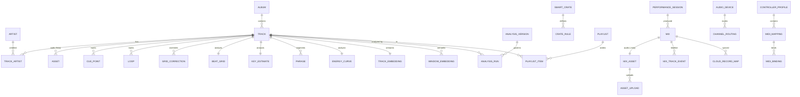

---

## Design summary

This specification (v1.0) expands the Platterhead HLD (v0.2) and the accompanying mockups into an implementation-ready architecture. It defines the product topology (one ecosystem, two apps, one shared `TonearmCore` package, one private CloudKit bridge), the full data layer (relational core + analysis + semantic vector store), the offline analysis pipeline (DSP → grids → key → phrase → CLAP), the real-time audio engine (lock-free RT boundary, sample-accurate scheduler, sync, stems, recording), the sync/companion design, the presentation layer (every mockup screen mapped to View ▸ ViewModel ▸ data/services), the cross-cutting budgets/hardware/security/resilience/testing concerns, and a phased delivery roadmap with a coding-agent execution guide and acceptance tests traceable to requirements. Every design choice is aligned to the conventions of the existing `johnarleyburns/parso-tonearm` repository (GRDB patterns, `CloudSyncEngine`, `RecordMapping`, SHA-256 content addressing, snake_case tables / camelCase columns, zero-telemetry CI enforcement), so the DJ application extends the codebase rather than forking it.

The reference appendices that follow (F–L) provide build-grade detail beyond the narrative: concrete DSP algorithm implementations (F), the semantic-embedding subsystem in depth (G), worked end-to-end traces (H), the consolidated public-interface index (I), the configuration and tuning reference (J), the concurrency and threading model (K), and the requirements-traceability matrix (L).

---

# Appendix F — Reference algorithm implementations

The main body (Part IV) specifies the analysis pipeline's *structure, configuration, and contracts*. This appendix gives **reference implementations** of the core DSP kernels dense enough to build from directly. All are **pure** (deterministic, no I/O), operate on the 48 kHz working rate, and are the unit under the golden-file and unit tests of §47. Real code uses Accelerate/`vDSP` for the hot loops; the listings show the actual call shape, not pseudocode.

## F.1 FFT setup and the windowed real FFT

The STFT (§21) uses a single reused `vDSP.FFT` object sized to the 4096-sample window. Setup happens once; the transform runs per hop with no per-call allocation.

```swift
import Accelerate

final class STFT {
    let n: Int                       // 4096
    let log2n: vDSP_Length
    private let fft: vDSP.FFT<DSPSplitComplex>
    private var window: [Float]      // Hann, length n
    private var real: [Float]        // scratch, length n/2
    private var imag: [Float]        // scratch, length n/2

    init(n: Int = 4096) {
        self.n = n
        self.log2n = vDSP_Length(log2(Float(n)))
        self.fft = vDSP.FFT(log2n: log2n, radix: .radix2, ofType: DSPSplitComplex.self)!
        self.window = [Float](repeating: 0, count: n)
        vDSP_hann_window(&window, vDSP_Length(n), Int32(vDSP_HANN_NORM)) // periodic Hann
        self.real = [Float](repeating: 0, count: n / 2)
        self.imag = [Float](repeating: 0, count: n / 2)
    }

    /// Compute the power spectrum (length n/2) of one frame in-place scratch.
    /// `frame` is n samples of mono audio; caller advances by the hop (2048).
    func powerSpectrum(_ frame: UnsafePointer<Float>, into power: inout [Float]) {
        // 1) Window the frame (element-wise multiply).
        var windowed = [Float](repeating: 0, count: n)
        vDSP_vmul(frame, 1, window, 1, &windowed, 1, vDSP_Length(n))

        // 2) Pack real input into split-complex (even→real, odd→imag) for real FFT.
        windowed.withUnsafeBufferPointer { wp in
            wp.baseAddress!.withMemoryRebound(to: DSPComplex.self, capacity: n / 2) { cp in
                real.withUnsafeMutableBufferPointer { rp in
                    imag.withUnsafeMutableBufferPointer { ip in
                        var split = DSPSplitComplex(realp: rp.baseAddress!, imagp: ip.baseAddress!)
                        vDSP_ctoz(cp, 2, &split, 1, vDSP_Length(n / 2))
                        // 3) Forward real FFT.
                        fft.forward(input: split, output: &split)
                        // 4) Magnitude² → power. (DC and Nyquist handled in bins 0.)
                        vDSP_zvmags(&split, 1, &power, 1, vDSP_Length(n / 2))
                    }
                }
            }
        }
    }
}
```

Notes: the `vDSP_ctoz` packing is the standard real-FFT idiom (treat the real signal as interleaved complex, then unpack). `vDSP_zvmags` yields magnitude-squared directly (cheaper than magnitude; the sqrt is only taken where a linear magnitude is needed). Frequency of bin *k* is `k · 48000 / 4096 ≈ 11.72·k` Hz.

## F.2 Spectral features per frame

From the power spectrum, the per-frame features of §21.3 are cheap reductions:

```swift
struct SpectralFrame {
    var centroid: Float; var rolloff: Float; var flux: Float
    var rms: Float; var zcr: Float; var bandEnergy: SIMD8<Float>
}

func features(power: [Float], prevPower: [Float], frame: [Float],
              sampleRate: Float, rolloffPct: Float = 0.85) -> SpectralFrame {
    let n2 = power.count
    // Centroid = Σ f·P / ΣP
    var total: Float = 0; vDSP_sve(power, 1, &total, vDSP_Length(n2))
    var num: Float = 0
    for k in 0..<n2 { num += Float(k) * power[k] }
    let binHz = sampleRate / Float(2 * n2)
    let centroid = total > 0 ? (num / total) * binHz : 0

    // Rolloff = freq below which rolloffPct of energy lies
    var cum: Float = 0; let thresh = total * rolloffPct; var rolloffBin = n2 - 1
    for k in 0..<n2 { cum += power[k]; if cum >= thresh { rolloffBin = k; break } }
    let rolloff = Float(rolloffBin) * binHz

    // Flux = Σ max(0, P - Pprev)  (half-wave rectified spectral difference)
    var flux: Float = 0
    for k in 0..<n2 { let d = power[k] - prevPower[k]; if d > 0 { flux += d } }

    // RMS of the time-domain frame
    var rms: Float = 0; vDSP_rmsqv(frame, 1, &rms, vDSP_Length(frame.count))

    // Zero-crossing rate
    var zc = 0
    for i in 1..<frame.count { if (frame[i] >= 0) != (frame[i-1] >= 0) { zc += 1 } }
    let zcr = Float(zc) / Float(frame.count)

    // Eight log-spaced band energies (sub-bass … air)
    var bands = SIMD8<Float>(repeating: 0)
    let edges: [Int] = bandEdgeBins(n2: n2)          // precomputed
    for b in 0..<8 {
        var e: Float = 0
        for k in edges[b]..<edges[b+1] { e += power[k] }
        bands[b] = e
    }
    return SpectralFrame(centroid: centroid, rolloff: rolloff, flux: flux,
                         rms: rms, zcr: zcr, bandEnergy: bands)
}
```

The `flux` series across frames **is** the onset novelty function of §22.1 (after per-frame normalization); it is stored as `onset_envelope`.

## F.3 Onset envelope post-processing and peak picking

```swift
/// Normalize flux to a novelty curve, then adaptive-threshold peak-pick (§22.2).
func onsets(flux: [Float], hopSeconds: Float) -> [Float] {   // → onset times (s)
    // 1) Smooth (small moving average) and remove slow drift (subtract local mean).
    let smoothed = movingAverage(flux, window: 3)
    let local = movingAverage(smoothed, window: 16)          // local mean
    var novelty = zip(smoothed, local).map { max(0, $0 - $1) }
    // 2) Normalize to [0,1].
    if let mx = novelty.max(), mx > 0 { novelty = novelty.map { $0 / mx } }
    // 3) Peak pick: local maximum above an adaptive threshold with a refractory gap.
    var times: [Float] = []
    let minGap = Int(0.03 / hopSeconds)                      // ~30 ms refractory
    var last = -minGap
    for i in 1..<(novelty.count - 1) {
        let v = novelty[i]
        let isPeak = v > novelty[i-1] && v >= novelty[i+1]
        let thr = 0.15 + 0.5 * localMedian(novelty, at: i, radius: 16)
        if isPeak && v >= thr && (i - last) >= minGap {
            times.append(Float(i) * hopSeconds); last = i
        }
    }
    return times
}
```

## F.4 Tempo estimation by autocorrelation / comb filtering

The tempo histogram (§22.3) is derived by correlating the onset novelty against a bank of comb templates at candidate BPMs and picking the peak, with octave-error resolution (§22.4).

```swift
struct TempoResult { var bpm: Double; var strength: Double; var alternates: [Double] }

func estimateTempo(novelty: [Float], hopSeconds: Float,
                   range: ClosedRange<Double> = 70...180) -> TempoResult {
    // Autocorrelation of the novelty function (via vDSP), lag in frames.
    let m = novelty.count
    var ac = [Float](repeating: 0, count: m)
    vDSP_conv(novelty, 1, novelty.reversed(), 1, &ac, 1, vDSP_Length(m), vDSP_Length(m))
    // Score each candidate BPM by summing autocorrelation energy at its beat period
    // and integer multiples (comb): reinforces true tempo, suppresses subharmonics.
    var best = TempoResult(bpm: 0, strength: -1, alternates: [])
    var scores: [(bpm: Double, s: Double)] = []
    var bpm = range.lowerBound
    while bpm <= range.upperBound {
        let periodFrames = (60.0 / bpm) / Double(hopSeconds)
        var s = 0.0
        for h in 1...4 {                                     // comb harmonics
            let lag = Int((periodFrames * Double(h)).rounded())
            if lag < m { s += Double(ac[lag]) / Double(h) }  // weight decays with h
        }
        scores.append((bpm, s))
        if s > best.strength { best = TempoResult(bpm: bpm, strength: s, alternates: []) }
        bpm += 0.1
    }
    // Octave-error check: compare best against ½× and 2× using onset phase agreement.
    best.alternates = [best.bpm * 0.5, best.bpm * 2.0].filter { range.contains($0) }
    best.bpm = resolveOctave(candidate: best.bpm, scores: scores, range: range)
    return best
}
```

The comb-with-decaying-harmonics scoring is what prevents the classic half/double-tempo mistake: a true tempo scores at its period *and* its multiples, so it beats a subharmonic that only scores at even lags (§22.4).

## F.5 Beat grid by dynamic programming

Given a tempo estimate and the onset novelty, beats are placed to jointly maximize onset alignment and tempo regularity — the standard dynamic-programming beat tracker (§23.1).

```swift
/// Ellis-style DP beat tracking: choose beat frames maximizing
/// Σ onset(bi) + λ·Σ consistency(interval_i, idealPeriod).
func trackBeats(novelty: [Float], bpm: Double, hopSeconds: Float,
                lambda: Double = 100) -> [Int] {           // → beat frame indices
    let period = (60.0 / bpm) / Double(hopSeconds)          // ideal inter-beat frames
    let n = novelty.count
    var score = [Double](repeating: 0, count: n)
    var back  = [Int](repeating: -1, count: n)
    let lo = Int(period * 0.5), hi = Int(period * 1.5)      // allowed interval window
    for i in 0..<n {
        score[i] = Double(novelty[i])
        var bestPrev = -Double.greatestFiniteMagnitude; var bestJ = -1
        for j in max(0, i - hi)...max(0, i - lo) where j < i {
            let interval = Double(i - j)
            let penalty = -lambda * pow(log(interval / period), 2) // log-Gaussian consistency
            let cand = score[j] + penalty
            if cand > bestPrev { bestPrev = cand; bestJ = j }
        }
        if bestJ >= 0 { score[i] += bestPrev; back[i] = bestJ }
    }
    // Backtrace from the best-scoring tail beat.
    var i = (score.enumerated().max { $0.element < $1.element })?.offset ?? 0
    var beats: [Int] = []
    while i >= 0 { beats.append(i); i = back[i] }
    return beats.reversed()
}
```

The recovered beat frames are converted to seconds and stored as the `beat_grid` (with per-beat confidence from the local novelty); the median inter-beat interval refines the stored BPM. Downbeats (§23.2) are then chosen by correlating a bar-level accent pattern (spectral-flux emphasis on low bands) against beat groups of 4.

## F.6 Chroma (HPCP) and key correlation

Key detection (§24) folds spectral energy into 12 pitch classes (HPCP/chroma), averages over the track, and correlates against major/minor key templates.

```swift
/// Map power spectrum bins to a 12-bin chroma via pitch-class of each bin's frequency.
func chroma(power: [Float], sampleRate: Float, refA: Float = 440) -> SIMD12<Float> {
    var c = SIMD12<Float>(repeating: 0)
    let binHz = sampleRate / Float(2 * power.count)
    for k in 1..<power.count {
        let f = Float(k) * binHz
        if f < 27.5 || f > 5000 { continue }               // piano-ish range
        let midi = 69 + 12 * log2(f / refA)                // fractional MIDI note
        let pc = ((Int(midi.rounded()) % 12) + 12) % 12
        c[pc] += power[k]
    }
    // L1 normalize
    let s = c.sum(); return s > 0 ? c / s : c
}

/// Correlate averaged chroma against Krumhansl-style major/minor profiles at all 12 rotations.
func estimateKey(avgChroma: SIMD12<Float>) -> (pc: Int, isMinor: Bool, score: Float) {
    let major: SIMD12<Float> = /* profile */ krumhanslMajor
    let minor: SIMD12<Float> = krumhanslMinor
    var best: (Int, Bool, Float) = (0, false, -.greatestFiniteMagnitude)
    for rot in 0..<12 {
        let rotated = rotate(avgChroma, by: rot)
        let sMaj = correlate(rotated, major)
        let sMin = correlate(rotated, minor)
        if sMaj > best.2 { best = (rot, false, sMaj) }
        if sMin > best.2 { best = (rot, true,  sMin) }
    }
    return best   // pc+isMinor → Camelot via Appendix B table
}
```

The winning `(pitch-class, mode)` maps through the Appendix B table to a Camelot code stored in `key_estimate`; the correlation score becomes the stored confidence.

## F.7 Energy curve

Perceived energy (§25/§28 uses it; mockup 05 shows "7.8/10") is a smoothed blend of loudness and spectral activity per beat:

```swift
/// Per-beat energy in [0,1]: combine band-weighted RMS (loudness) and HF flux (activity).
func energyCurve(frames: [SpectralFrame], beats: [Int], hopSeconds: Float) -> [Float] {
    func atBeat(_ b: Int) -> Float {
        let f = frames[min(b, frames.count - 1)]
        let loud = f.rms                                   // level
        let hf = f.bandEnergy[5] + f.bandEnergy[6] + f.bandEnergy[7]  // brightness/activity
        return 0.6 * loud + 0.4 * sqrt(hf)
    }
    var raw = beats.map { atBeat(Int(Float($0))) }
    // Normalize to [0,1] and smooth over a few beats.
    if let mx = raw.max(), mx > 0 { raw = raw.map { $0 / mx } }
    return movingAverage(raw, window: 4)
}
```

The scalar "energy 7.8/10" shown per track is the curve's robust central tendency (e.g., median) scaled to 0–10; the full curve drives phrase/section contrast and transition scoring.


---

# Appendix G — Semantic embedding subsystem in depth

Part IV §27 introduced CLAP at the level the narrative needs. This appendix expands the **semantic subsystem** — model choice rationale, the exact embedding lifecycle, the vector-store contract, and the hybrid ranking math — to the depth a builder needs, because "vibe search" (mockup 04) is the app's signature differentiator.

## G.1 Why CLAP, and which CLAP

CLAP (Contrastive Language–Audio Pretraining) learns a **shared embedding space** for audio and text: an audio clip and a text description that match land near each other. That is exactly the primitive vibe search needs — embed the library's audio once, embed the user's phrase at query time, and rank by nearness. The alternative approaches are worse fits:

- **Tag classifiers** (predict genre/mood labels) force everything through a fixed vocabulary; "dark driving bassline" isn't a label.
- **Metadata/text search** can't see the audio at all.
- **Raw audio-feature similarity** (MFCC/chroma distance) captures timbre but not *meaning* ("euphoric", "brooding").

The chosen model is a **music-domain CLAP checkpoint** (trained/fine-tuned on music rather than general audio events), converted to Core ML (Appendix D), producing a fixed-dimensional (e.g., 512-d) L2-normalized embedding from a mel-spectrogram input. Music-domain weights matter: a general-audio CLAP over-indexes on sound-event semantics (dog, rain) rather than musical character.

## G.2 The embedding lifecycle (end to end)

```mermaid
sequenceDiagram
    participant A as AnalysisCoordinator
    participant P as Preprocess (mel)
    participant M as CLAP audio encoder (Core ML/ANE)
    participant Pool as Pooling
    participant DB as track_embedding / window_embedding
    participant Vec as sqlite-vec (vec_track / vec_window)
    A->>P: decoded mono 48k → resample to model rate
    P->>P: log-mel spectrogram, model window (e.g., 10 s)
    loop each 10 s window (overlapped)
        P->>M: mel window
        M-->>Pool: 512-d window embedding (L2-norm)
        Pool->>DB: append window_embedding {start,end,vec}
    end
    Pool->>Pool: attention/mean pool windows → track vector
    Pool->>DB: write track_embedding {vec, embeddingVersion}
    DB->>Vec: upsert into vec_track / vec_window (f16)
```

Key properties: **windowed** (a 6-minute track yields many overlapping 10 s windows, so within-track variation is captured for section-level search); **pooled** to one track vector for whole-track ranking; **versioned** by `embeddingVersion` so a model upgrade re-embeds cleanly and the vec tables rebuild (§17, §27.6). Preprocessing (resample → log-mel) is deterministic and part of the versioned contract, so goldens are stable.

## G.3 Pooling strategies

Two pooled representations are maintained because they answer different questions:

- **Whole-track vector** (for "find tracks like this / matching this vibe"): an **attention-weighted mean** of window embeddings, weighting musically salient windows (e.g., higher-energy or more representative sections) above intros/outros. A plain mean is the fallback and is often close.
- **Window vectors** (for "find the *moment* that matches" and for transition points): kept individually in `vec_window` so search can locate a specific 10 s region — useful for finding a compatible drop or breakdown, not just a compatible track.

```swift
func poolTrack(windows: [[Float]], saliency: [Float]) -> [Float] {
    // weighted mean then renormalize
    let dim = windows.first?.count ?? 0
    var acc = [Float](repeating: 0, count: dim)
    let wsum = max(saliency.reduce(0,+), 1e-6)
    for (w, s) in zip(windows, saliency) {
        vDSP_vsma(w, 1, [s/wsum], acc, 1, &acc, 1, vDSP_Length(dim))
    }
    return l2normalize(acc)
}
```

## G.4 Vector store contract (sqlite-vec)

The vec virtual tables (§16) store **f16, L2-normalized** vectors keyed by `trackID` (and window id). Because vectors are unit-norm, **inner product equals cosine similarity**, so ANN by inner product is the ranking primitive. The store is queried in the same SQL statement that applies relational constraints (§16's hybrid query), so the ANN candidate set is already filtered by BPM/Camelot/etc. before scoring — the vector index never has to consider tracks the constraints exclude.

```sql
-- Conceptual hybrid query (see §16 for the concrete form):
WITH knn AS (
    SELECT track_rowid, distance
    FROM vec_track
    WHERE embedding MATCH :queryVec        -- ANN over the (constrained) space
    ORDER BY distance LIMIT :k
)
SELECT t.*, knn.distance
FROM knn JOIN track t ON t.rowid = knn.track_rowid
JOIN beat_grid g ON g.trackID = t.id
JOIN key_estimate ke ON ke.trackID = t.id
WHERE g.bpm BETWEEN :bpmLo AND :bpmHi      -- relational constraints
  AND ke.camelot IN (:camelotSet)
ORDER BY /* fused score, see G.5 */ ;
```

## G.5 Hybrid ranking math

The final rank fuses semantic nearness with musical compatibility using the HLD's weights (semantic 0.40, BPM 0.20, Camelot 0.20, energy 0.10, phrase 0.10, §28.1). Each component is normalized to [0,1]; the composite is a weighted sum:

```
score(t) = 0.40 · sem(t)      // 1 − normalized cosine distance to query
         + 0.20 · bpmFit(t)   // 1 at exact tempo match, decays over ± window
         + 0.20 · keyFit(t)   // Camelot compatibility grade (Appendix B)
         + 0.10 · energyFit(t)// closeness of energy to desired/among-results
         + 0.10 · phraseFit(t)// phrase-length / structure compatibility
```

```swift
func fusedScore(_ c: Candidate, q: Query, w: Weights = .default) -> Double {
    let sem     = 1.0 - c.cosineDistance                    // sqlite-vec distance
    let bpmFit  = gaussian(c.bpm - q.targetBPM, sigma: q.bpmTolerance)
    let keyFit  = camelotCompatibility(c.camelot, q.camelot) // 0…1 graded
    let energy  = 1.0 - abs(c.energy - q.targetEnergy)
    let phrase  = phraseCompatibility(c.phraseLen, q.phraseLen)
    return w.sem*sem + w.bpm*bpmFit + w.key*keyFit + w.energy*energy + w.phrase*phrase
}
```

The **+/- refine terms** (mockup 04) adjust the *query vector*: a "+" term's text embedding is added (and renormalized), a "−" term's is subtracted, nudging the semantic anchor before ANN — vector arithmetic in the shared space, which is why refinement feels semantic rather than keyword-ish. BPM/Camelot constraints act as hard filters (they gate the candidate set) *and* as soft `bpmFit`/`keyFit` terms (they order within the set), so tightening them both narrows and re-ranks.

## G.6 Incremental re-indexing

New or changed tracks are embedded and upserted without a full rebuild; an `embeddingVersion` bump (new model) marks the vec tables stale and re-embeds in the background (§27.6), showing progress like analysis (mockup 03). Deletions remove rows from both `*_embedding` and the vec tables in the same transaction. The search stays available during incremental work, operating on whatever is currently indexed and reporting coverage.

---

# Appendix H — Worked end-to-end traces

Three traces show the moving parts cooperating. They are illustrative narratives, not new requirements, and cross-reference the sections that own each step.

## H.1 A track from drop to searchable

A DJ drops `Midnight Drive.aiff` into the watched folder (`~/Music`, mockup 02).

1. **Detect (shell):** `FolderWatchService` reports the new file; `DJLibraryStore` inserts `folder`/`asset`/`track` rows and an `import_event` (§14). The library list shows it immediately with analysis state *pending* (mockup 02's analysis column).
2. **Enqueue (shell):** `AnalysisCoordinator` creates an `analysis_run` at the current `analysis_version` and schedules a job on the runner (§19), concurrency-limited.
3. **Decode + loudness (pure/shell):** the file is decoded to 48 kHz mono (for analysis) and stereo (for loudness); BS.1770 integrated loudness and DR are computed and stored in `loudness` (§20).
4. **DSP (pure):** the `STFT` (Appendix F.1) runs at 4096/2048; per-frame `SpectralFrame`s (F.2) are computed; the flux series becomes `onset_envelope` (F.3).
5. **Tempo + grid (pure):** `estimateTempo` (F.4) yields ~124 BPM with octave check; `trackBeats` (F.5) places the grid; downbeats are marked; results land in `tempo_candidate`/`beat_grid`/`downbeat` (§23).
6. **Key (pure):** averaged `chroma` (F.6) correlates to, say, A minor → **8A**, stored in `key_estimate` (§24).
7. **Phrase + energy (pure):** phrase boundaries (§25) and the `energy_curve` (F.7, robust central value ≈ 7.8/10) are stored.
8. **Waveform (pure):** the multi-resolution `waveform_pyramid` is generated for instant zoomed rendering (§26).
9. **Embedding (Core ML):** overlapping 10 s windows are embedded by CLAP, pooled to a track vector, written to `track_embedding`/`window_embedding` and upserted into `vec_track`/`vec_window` (Appendix G).
10. **Done:** the `analysis_run` is marked complete; the library health metric (mockup 02, 98.7%) ticks up; the track now appears in vibe-search results and can be prepared (mockup 05). Every step wrote through the versioned, immutable analysis contract (§17), so re-running is idempotent and a version bump re-derives cleanly.

## H.2 A beatmatched transition at the sample level

Deck A is playing (124.0 BPM, **8A**); the DJ loads a 122.0 BPM **9A** track to Deck B and presses **SYNC**, then rides the crossfader (mockup 06).

1. **Load B (shell):** `WorkspaceModel` sends `load(deckB, track)`; the engine opens the source (or four stem `.caf` files, §36.5) and snapshots B's grid into the RT engine state (§12).
2. **Sync press → command (main→RT):** `WorkspaceModel` calls `PerformanceEngine.sync(deckB, to: master=deckA)`. `SyncEngine.correction` (§32.1, pure) computes `targetRate = 124.0/122.0 ≈ 1.0164` and the phase delta between B's current beat phase and A's, converting it to a sample shift. The result is enqueued as an `RTCommand` on the lock-free ring.
3. **Apply at boundary (RT):** at the next render callback, the engine sets B's `AVAudioUnitTimePitch.rate` to 1.0164 with **key-lock on** (pitch held, §31), and applies the scheduled sub-beat playhead nudge so B's beats coincide with A's (§30.2). No allocation or locking occurs; the render load meter (§34.3) barely moves.
4. **Bar alignment (RT):** because bar-sync is the default (§32.2), the nudge targets the nearest **downbeat**, so B's bar 1 lands on A's bar 1 — phrases line up.
5. **Crossfade (main→RT):** as the DJ moves the crossfader, `crossfaderGains` (§35.4, constant-power) ramps A down and B up; the values arrive as commands and are smoothed per block so there's no zipper noise.
6. **EQ swap (RT):** the DJ pulls A's LOW and pushes B's LOW (bass swap) via the 3-band isolator EQ (§35.2); kills are phase-coherent so the low end transitions cleanly.
7. **Master → limiter → out/record (RT):** the summed mix passes the brickwall limiter (§35.5); the same master feeds the output device, the metering tap (spectrum/levels in mockup 06), and — if recording — the RT-safe record tap (§37.2), which copies the block to a ring for the encoder actor. The audience hears a phase-aligned, bar-matched, bass-swapped blend; the recorded M4A captures it sample-for-sample.

Throughout, the only main-thread work was translating gestures to commands and reading a 60 fps telemetry struct; all audio-affecting logic ran lock-free in the callback, and all the tricky math (`correction`, gains) was pure and unit-tested (§47.2).

## H.3 A vibe search to a smart crate

The DJ types "dark driving bassline", constrains 122–126 BPM, and clicks a Camelot neighbor set (mockup 04).

1. **Embed query (Core ML):** the phrase is embedded by the CLAP **text** encoder to a 512-d unit vector (Appendix G.2).
2. **Refine (pure):** the DJ adds "+hypnotic" and "−cheesy"; those term embeddings are added/subtracted and the query renormalized (Appendix G.5) — the semantic anchor shifts.
3. **Constrained ANN (SQL):** `SemanticSearchService` issues the hybrid query (§16, G.4): sqlite-vec finds nearest `vec_track` rows **within** the BPM/Camelot filter; the candidate set is already musically valid.
4. **Fuse + rank (pure):** each candidate's `fusedScore` (G.5) combines semantic nearness (0.40) with bpm/key/energy/phrase fit; results are ordered and shown with a **% match** (mockup 04) derived from the composite. Latency is the measured ANN+rank time (~43 ms, mockup 04).
5. **Save Smart Crate (shell):** the DJ clicks **Save Smart Crate**; the query (text, refine terms, constraints, weights) persists as a `smart_crate` + `crate_rule` set (§14). It re-evaluates as the library grows, so newly imported tracks that fit appear automatically — a *living* selection, not a frozen list.


---

# Appendix I — Consolidated public interface index

This appendix collects the **normative public interfaces** of the DJ subsystem in one place, so a coding agent can implement against a single reference. Signatures are authoritative (Part II §10 introduced them in context); where a type is defined in the body, the owning section is noted. Access levels reflect the module boundaries of §9 (`TonearmDJ` is a macOS-gated library product in the existing package). Concurrency annotations (`@MainActor`, `actor`, `Sendable`) reflect §11.

## I.1 Library and persistence

```swift
// Owns the DJ-authoritative library DB (tonearm-dj.sqlite); §14, §18.
public protocol DJLibraryStore: Sendable {
    func importFolder(_ url: URL) async throws -> ImportSummary
    func track(id: TrackID) async throws -> DJTrack?
    func allTracks() -> AsyncStream<[DJTrack]>                 // ValueObservation-backed
    func search(_ q: LibraryQuery) async throws -> [DJTrack]   // relational (SearchQueryBuilder)
    func upsertCue(_ cue: CuePoint) async throws
    func upsertLoop(_ loop: Loop) async throws
    func saveGridCorrection(_ c: GridCorrection) async throws
    func setRating(_ r: Rating) async throws
    func tag(_ trackID: TrackID, _ tag: Tag) async throws
    func saveSmartCrate(_ crate: SmartCrate, rules: [CrateRule]) async throws
    func evaluateSmartCrate(id: CrateID) async throws -> [DJTrack]
}

public struct ImportSummary: Sendable {
    public let added: Int, updated: Int, skipped: Int, failed: [URL]
}
```

Repositories (§18) back the store:

```swift
public protocol DJTrackRepository: Sendable {
    func observeAll() -> AsyncStream<[DJTrackRow]>
    func observe(id: TrackID) -> AsyncStream<DJTrackRow?>
    func page(_ req: PageRequest) async throws -> [DJTrackRow]  // windowed for scale
}
```

## I.2 Analysis

```swift
// Orchestrates the offline pipeline (Part IV); §19.
public protocol AnalysisCoordinator: Sendable {
    func enqueue(_ trackID: TrackID, priority: JobPriority) async
    func enqueueAll(missingAt version: AnalysisVersionID) async
    func pause(); func resume()
    func prioritize(_ trackID: TrackID) async
    var progress: AsyncStream<AnalysisProgress> { get }        // per-track stage/percent
    func result(for trackID: TrackID) async throws -> TrackAnalysis?
}

public struct AnalysisProgress: Sendable {
    public let trackID: TrackID
    public let stage: AnalysisStage                            // decode|features|tempo|key|phrase|waveform|embed
    public let fraction: Double
    public let computeUnit: ComputeUnit                        // ane|gpu|cpu (for mockup 03 badges)
}

public enum AnalysisStage: String, Sendable, CaseIterable {
    case decode, loudness, features, onsets, tempo, beats, key, phrase, waveform, embed
}

// Pure DSP kernels (Appendix F provides reference bodies); all deterministic.
public enum DSP {
    public static func powerSpectrum(_ frame: [Float], _ stft: STFT) -> [Float]
    public static func spectralFeatures(power: [Float], prev: [Float], frame: [Float]) -> SpectralFrame
    public static func onsetEnvelope(flux: [Float]) -> [Float]
    public static func estimateTempo(novelty: [Float], hopSeconds: Float,
                                     range: ClosedRange<Double>) -> TempoResult
    public static func trackBeats(novelty: [Float], bpm: Double, hopSeconds: Float) -> [Int]
    public static func chroma(power: [Float], sampleRate: Float) -> SIMD12<Float>
    public static func estimateKey(avgChroma: SIMD12<Float>) -> KeyEstimateResult
    public static func energyCurve(frames: [SpectralFrame], beats: [Int], hopSeconds: Float) -> [Float]
    public static func waveformPyramid(_ samples: [Float], levels: Int) -> WaveformPyramid
}
```

## I.3 Semantic search

```swift
// CLAP text/audio embedding (Core ML); §27, Appendix G.
public protocol CLAPEmbedder: Sendable {
    func embedText(_ text: String) async throws -> Embedding          // 512-d unit vector
    func embedAudioWindows(_ pcm: PCMBuffer) async throws -> [WindowEmbedding]
    func pool(_ windows: [WindowEmbedding]) -> Embedding
    var version: EmbeddingVersionID { get }
}

// Search over the vector store fused with musical constraints; §28, G.5.
public protocol SemanticSearchService: Sendable {
    func search(text: String,
                refine: RefineTerms,                                  // +/- terms
                constraints: MusicalConstraints,                      // bpm range, camelot set
                weights: RankWeights = .default,
                limit: Int) async throws -> SearchResults
    func similar(to trackID: TrackID, constraints: MusicalConstraints,
                 limit: Int) async throws -> SearchResults
}

public struct RefineTerms: Sendable { public var positive: [String]; public var negative: [String] }
public struct MusicalConstraints: Sendable {
    public var bpmRange: ClosedRange<Double>?
    public var camelot: Set<Camelot>?
    public var energyRange: ClosedRange<Double>?
}
public struct SearchResults: Sendable {
    public let items: [ScoredTrack]                                   // ordered, with % match
    public let latencyMillis: Double                                  // mockup 04 readout
    public let coverage: Double                                       // fraction of library indexed
}
public struct ScoredTrack: Sendable { public let track: DJTrack; public let score: Double
                                      public let components: ScoreBreakdown }
```

## I.4 Real-time performance engine

```swift
// The control/telemetry façade over the RT audio engine; §29–37.
// All mutating calls enqueue lock-free RT commands (§12); none block on audio.
@MainActor public protocol PerformanceEngine: AnyObject {
    // Transport / loading
    func load(_ deck: DeckID, track: TrackID, stems: Bool) async throws
    func play(_ deck: DeckID); func pause(_ deck: DeckID)
    func cue(_ deck: DeckID)                                          // CDJ-style temp cue
    func seek(_ deck: DeckID, toSample: Int64, quantized: Bool)
    // Tempo / key
    func setRate(_ deck: DeckID, percent: Double, keyLock: Bool)
    func shiftKey(_ deck: DeckID, semitones: Int)
    func sync(_ deck: DeckID, to master: DeckID)
    func unsync(_ deck: DeckID)
    // Cues / loops
    func triggerHotCue(_ deck: DeckID, index: Int)
    func setLoop(_ deck: DeckID, beats: Double)                       // ½,1,2,4,8,16
    func exitLoop(_ deck: DeckID)
    func setQuantize(_ on: Bool, resolution: QuantizeResolution)
    // Mixer
    func setChannelFader(_ deck: DeckID, _ gain: Float)
    func setEQ(_ deck: DeckID, band: EQBand, _ gain: Float)
    func setFilter(_ deck: DeckID, _ amount: Float)                   // −1 LP … 0 … +1 HP
    func setCrossfader(_ x: Float, curve: CrossfaderCurve)
    func setStemGain(_ deck: DeckID, stem: Stem, _ gain: Float)
    // Recording (delegates to RecordingService)
    func startRecording(_ config: RecordingConfig) async throws
    func stopRecording() async throws -> Mix
    // Telemetry (read-only; sampled by a 60 fps main pump, §40.3)
    var telemetry: AsyncStream<EngineTelemetry> { get }
    // Device / routing / buffer (rebuilds graph off-RT, §34.4)
    func applyAudioConfig(_ config: AudioIOConfig) async throws
}

public struct EngineTelemetry: Sendable {
    public struct Deck: Sendable { public let playheadSample: Int64; public let bpmEffective: Double
                                   public let level: StereoLevel; public let phase: Double }
    public let deckA: Deck, deckB: Deck
    public let masterLevel: StereoLevel
    public let spectrum: [Float]                                      // metering bins
    public let renderLoad: Double                                     // 0…1 (mockup 06 CPU%)
    public let gpuLoad: Double
}
```

## I.5 Stems, recording, sync, hardware

```swift
// Demucs→Core ML separation; offline batch + on-demand; §36.
public protocol StemSeparator: Sendable {
    func hasCachedStems(_ trackID: TrackID) async -> Bool
    func separate(_ trackID: TrackID, urgency: SeparationUrgency) async throws -> StemSet
    var progress: AsyncStream<StemProgress> { get }
    var modelVersion: StemModelVersionID { get }
}
public enum SeparationUrgency: Sendable { case background, onDemand }

// RT-safe capture of the master bus → segmented M4A; §37.
public protocol RecordingService: Sendable {
    func start(_ config: RecordingConfig) async throws
    func logEvent(_ event: MixTrackEvent)                             // timeline (off-RT)
    func stop() async throws -> Mix                                   // finalizes file + rows
    func recoverInterrupted() async throws -> [Mix]                   // crash recovery, §37.3
}
public struct RecordingConfig: Sendable {
    public var format: AudioFormat = .m4a_aac(bitrate: 256_000)       // mockup 10 default
    public var outputFolder: URL
}

// DJ-side CloudKit sync (extends existing CloudSyncEngine); §38.
public protocol DJSyncService: Sendable {
    func requestSync(mixID: MixID) async throws                       // Save & Sync to iPhone
    func cancelSync(mixID: MixID) async throws
    func delete(mixID: MixID) async throws                            // propagates (.deleteSelf)
    var uploadState: AsyncStream<[MixID: UploadState]> { get }        // mockup 08 progress
    var accountStatus: AsyncStream<CloudAccountStatus> { get }
    var quota: AsyncStream<StorageQuota> { get }                      // mockup 08/10
}

// CoreAudio devices/routing + CoreMIDI mapping/learn; §44.
public protocol HardwareService: Sendable {
    func audioDevices() async -> [AudioDevice]
    func midiEndpoints() async -> [MidiEndpoint]
    func beginMidiLearn() -> AsyncStream<MidiAddress>                 // next control captured
    func bind(_ binding: MidiBinding) async throws
    func loadProfile(_ id: ControllerProfileID) async throws
    func saveRouting(_ routing: [ChannelRouting]) async throws
    func setAudioIO(_ config: AudioIOConfig) async throws            // device + buffer
}
```

## I.6 Shared value types (index)

The value objects threaded through the interfaces above, with their owning sections:

| Type | Kind | Owner |
|---|---|---|
| `TrackID`, `MixID`, `CrateID`, `DeckID` | typed IDs | §13 |
| `DJTrack`, `DJTrackRow`, `CuePoint`, `Loop`, `GridCorrection`, `SmartCrate`, `CrateRule`, `Rating`, `Tag` | records | §18, App. A |
| `PCMBuffer` | decoded audio | §19.3 |
| `SpectralFrame`, `TempoResult`, `KeyEstimateResult`, `WaveformPyramid` | DSP outputs | App. F |
| `TrackAnalysis` | aggregate analysis view | §17 |
| `Embedding`, `WindowEmbedding`, `EmbeddingVersionID` | semantic | §27, App. G |
| `ScoredTrack`, `ScoreBreakdown`, `RankWeights`, `MusicalConstraints`, `RefineTerms` | search | §28, App. G |
| `RTCommand`, `EngineSnapshot` | RT boundary POD | §12 |
| `EngineTelemetry`, `StereoLevel` | telemetry | §40 |
| `Stem`, `StemSet`, `StemModelVersionID`, `SeparationUrgency` | stems | §36 |
| `Mix`, `MixAsset`, `MixTrackEvent`, `RecordingConfig`, `AudioFormat` | recording | §37 |
| `UploadState`, `CloudAccountStatus`, `StorageQuota` | sync | §38 |
| `AudioDevice`, `MidiEndpoint`, `MidiAddress`, `MidiBinding`, `ChannelRouting`, `ControllerProfile`, `AudioIOConfig`, `EngineAction`, `ValueTransform` | hardware | §44 |
| `Camelot`, `EQBand`, `CrossfaderCurve`, `QuantizeResolution` | enums | §24, §35 |

## I.7 Enumerations (canonical values)

```swift
public enum DeckID: Sendable { case a, b }                            // v1 is two decks
public enum Stem: String, Sendable, CaseIterable { case vocals, drums, bass, other }
public enum EQBand: Sendable { case low, mid, high }
public enum CrossfaderCurve: Sendable { case constantPower, linear, sharp }
public enum QuantizeResolution: Sendable { case beat, halfBeat, bar }
public enum ComputeUnit: String, Sendable { case ane, gpu, cpu }
public enum JobPriority: Int, Sendable { case background = 0, normal = 1, interactive = 2 }
public struct Camelot: Hashable, Sendable { public let number: Int   // 1…12
                                            public let isB: Bool }    // A=minor, B=major
public enum AudioFormat: Sendable { case m4a_aac(bitrate: Int); case wav; case aiff }
```

This index, together with the DDL (§14–15), the DSP reference (Appendix F), and the semantic detail (Appendix G), is sufficient to scaffold every module of the DJ subsystem without re-reading the narrative — which is the point of the plan-first, interface-driven workflow (§49).


---

# Appendix J — Configuration and tuning reference

Every tunable in the analysis and engine subsystems lives in a typed `Config` struct with a documented default, so behavior is discoverable and testable rather than scattered as magic numbers (§21 established the pattern). This appendix enumerates the tunables, their defaults, valid ranges, and the effect of changing them. Defaults are the shipping values; goldens (§47.2) are pinned to them, so changing a default that affects analysis output is an `analysis_version` bump (§17).

## J.1 Analysis DSP config

```swift
public struct AnalysisConfig: Sendable {
    // STFT
    public var sampleRate: Double = 48_000        // working rate; fixed across the app
    public var fftSize: Int = 4096                // window length (power of two)
    public var hopSize: Int = 2048                // 50% overlap
    public var window: WindowKind = .hann         // hann|hamming|blackman
    // Onset / tempo
    public var onsetSmoothing: Int = 3            // frames of moving average
    public var onsetLocalMean: Int = 16           // frames for drift removal
    public var onsetRefractoryMs: Double = 30     // min gap between onsets
    public var tempoRange: ClosedRange<Double> = 70...180
    public var tempoResolution: Double = 0.1      // BPM grid for the search
    public var combHarmonics: Int = 4             // comb template depth (octave-error guard)
    // Beats
    public var beatConsistencyLambda: Double = 100 // DP tempo-regularity weight
    // Key
    public var chromaRefA: Double = 440
    public var chromaMinHz: Double = 27.5
    public var chromaMaxHz: Double = 5_000
    // Energy
    public var energyLoudnessWeight: Double = 0.6 // vs 0.4 activity
    public var energySmoothingBeats: Int = 4
    // Waveform
    public var waveformLevels: Int = 6            // LOD count
    public var waveformBaseBin: Int = 256         // samples per bin at finest LOD
}
```

| Tunable | Default | Range | Effect of increasing |
|---|---|---|---|
| `fftSize` | 4096 | 1024–16384 | Finer frequency resolution, coarser time resolution; slower transform |
| `hopSize` | 2048 | 256–fftSize | Fewer frames (faster) but coarser onset timing |
| `tempoRange` | 70–180 | — | Wider range risks more octave confusion; narrower is faster and safer for known genres |
| `combHarmonics` | 4 | 2–6 | Stronger suppression of half/double tempo; diminishing returns past 4 |
| `beatConsistencyLambda` | 100 | 10–500 | More regular (rigid) grid; too high ignores real tempo drift |
| `energyLoudnessWeight` | 0.6 | 0–1 | Energy tracks loudness more (vs brightness/activity) |
| `waveformLevels` | 6 | 3–8 | More zoom levels cached; more storage in `waveform_pyramid` |

## J.2 Semantic config

```swift
public struct SemanticConfig: Sendable {
    public var windowSeconds: Double = 10          // CLAP window length
    public var windowOverlap: Double = 0.5         // 50% overlap
    public var embeddingDim: Int = 512             // model output
    public var poolingSaliency: Saliency = .energyWeighted // energyWeighted|mean
    public var annCandidateK: Int = 200            // ANN shortlist before fusion
    public var weights = RankWeights.default       // 0.40/0.20/0.20/0.10/0.10
    public var bpmToleranceBPM: Double = 3         // gaussian σ for bpmFit
}

public struct RankWeights: Sendable, Equatable {
    public var sem = 0.40, bpm = 0.20, key = 0.20, energy = 0.10, phrase = 0.10
    public static let `default` = RankWeights()
}
```

| Tunable | Default | Effect |
|---|---|---|
| `windowSeconds` | 10 | Longer windows = coarser section granularity, fewer window vectors |
| `annCandidateK` | 200 | Larger shortlist = more thorough fusion, slightly slower (the 43 ms budget, mockup 04) |
| `weights.sem` | 0.40 | Higher = ranking leans on vibe over musical fit; lower = more DJ-mixing-driven |
| `bpmToleranceBPM` | 3 | Wider = tempo mismatch penalized less |

## J.3 Engine and mixer config

```swift
public struct EngineConfig: Sendable {
    public var bufferFramesWithStems: Int = 256    // default when any deck stemmed (§34.2)
    public var bufferFramesNoStems: Int = 128
    public var renderLoadWarnRatio: Double = 0.6   // suggest larger buffer above this (§34.2)
    public var syncMode: SyncMode = .continuousBar // continuousBar|continuousBeat|momentary
    public var defaultCrossfaderCurve: CrossfaderCurve = .constantPower
    public var quantizeDefault: QuantizeResolution = .bar
    public var gainSmoothingMs: Double = 8         // fader/EQ ramp to avoid zipper
    public var limiterCeilingDb: Double = -0.3     // brickwall ceiling (§35.5)
    public var limiterLookaheadMs: Double = 2
    public var keyLockDefault: Bool = true
}

public struct MixerConfig: Sendable {
    public var eqLowSplitHz: Double = 200          // Linkwitz-Riley crossover (§35.2)
    public var eqHighSplitHz: Double = 2_000
    public var eqMaxBoostDb: Double = 6
    public var filterResonance: Double = 0.7       // color-filter Q
}
```

| Tunable | Default | Effect |
|---|---|---|
| `bufferFramesWithStems` | 256 | Lower = tighter latency, less headroom (glitch risk with stems) |
| `renderLoadWarnRatio` | 0.6 | Lower = warns/throttles earlier (safer); higher = risks dropouts |
| `syncMode` | continuousBar | Bar sync aligns phrases; beat sync only aligns beats; momentary snaps once |
| `gainSmoothingMs` | 8 | Longer = smoother but laggier fader response |
| `limiterCeilingDb` | −0.3 | Closer to 0 = louder, less headroom against inter-sample peaks |
| `eq*SplitHz` | 200 / 2000 | Moves the LOW/MID/HIGH band boundaries |

## J.4 Storage and cache config

```swift
public struct StorageConfig: Sendable {
    public var evictionEnabled: Bool = true
    public var stemCacheBudgetGB: Double? = nil    // nil = only evict under pressure
    public var waveformCacheBudgetGB: Double? = nil
    public var pinLoadedDeckAssets: Bool = true    // never evict loaded/recording assets (§43.6)
    public var recordingFlushSeconds: Double = 5   // crash-recovery granularity (§37.3)
}
```

| Tunable | Default | Effect |
|---|---|---|
| `recordingFlushSeconds` | 5 | Lower = less data lost on crash, slightly more I/O |
| `stemCacheBudgetGB` | nil | A hard cap forces earlier stem eviction; nil defers to pressure |
| `pinLoadedDeckAssets` | true | Guarantees the performing decks' data is never evicted mid-set |

All configs are surfaced where a user reasonably tunes them (buffer size, recording format/folder, sync policy — mockups 09/10/iOS-05) and otherwise hold safe defaults. Developer/analysis tunables (DSP, semantic) are not user-facing but are single-source-of-truth constants the tests pin.

---

# Appendix K — Concurrency and threading model reference

The isolation rules of §11 and the RT boundary of §12 are consolidated here as a single map, because "which code runs where" is the most common source of audio bugs.

## K.1 Execution domains

| Domain | Runs | Isolation | May do | Must NOT do |
|---|---|---|---|---|
| **Audio render thread** | the render callback(s): deck rendering, EQ/filter/mixer, master sum, limiter, record/metering taps | none (real-time priority, driven by CoreAudio) | read the atomic engine snapshot, drain the command ring, arithmetic on pre-allocated buffers | allocate, lock, log, call Swift runtime that may allocate, touch the DB/filesystem/network, `await` |
| **Main actor** | UI, view models, gesture→intent, telemetry pump, command *production* | `@MainActor` | build `RTCommand`s and push to the ring, read telemetry atomics, drive SwiftUI | block on audio, do heavy DSP inline |
| **Analysis executor** | the job runner, DSP kernels, Core ML embedding/separation | `actor`/task pool, bounded concurrency | CPU/ANE/GPU work, DB writes for results | touch the audio render state directly |
| **Sync executor** | `CKSyncEngine` work, asset upload/download | `@MainActor` wrapper + background tasks | CloudKit I/O, DB writes for sync state | block the audio path |
| **DB writer** | serialized GRDB writes | GRDB's serial write queue | transactional writes | long-held write transactions during performance |

## K.2 The two boundaries that matter

1. **Main → RT (control):** every audio-affecting user action becomes a small POD `RTCommand` pushed onto a **single-producer/single-consumer lock-free ring** (§12); the render thread drains it at the top of each callback and applies commands at sample-accurate boundaries. Nothing else crosses this way — no objects, no closures, no locks.

2. **RT → Main (telemetry):** the render thread publishes lightweight state (playheads, levels, spectrum bins, render load) into **pre-allocated atomics / a double-buffered snapshot**; a 60 fps main-actor pump reads them for the UI (§40.3). The render thread never calls into Swift-actor code or the UI.

```mermaid
flowchart LR
    subgraph Main["@MainActor"]
        VM["ViewModels / gestures"]
        Pump["60fps telemetry pump"]
    end
    subgraph RT["Audio render thread (RT priority)"]
        Cb["render callback"]
    end
    VM -->|RTCommand ring (SPSC, lock-free)| Cb
    Cb -->|atomics / double-buffered snapshot| Pump
    Pump --> VM
```

## K.3 Sendability and data types across boundaries

- Everything crossing the main→RT ring is a **trivially copyable value** (`RTCommand` is an enum of PODs: deck id, sample position, float gains, rate). No reference types, no strings, no arrays with heap storage.
- Everything crossing RT→main is **fixed-size numeric** (levels, sample counts, a fixed-length spectrum buffer that lives in a pre-allocated double buffer). 
- Larger structures (a newly loaded track's grid/stem buffers) are prepared **off** the RT thread and handed to the engine by swapping an **immutable snapshot pointer** the render thread reads atomically — the render thread never constructs or frees them.
- `Sendable` conformances are explicit on all cross-actor types; the RT POD types are `Sendable` by construction (§11).

## K.4 Reconfiguration windows

The graph is only reconfigured at **sanctioned, rare, user-initiated moments** — buffer/device change (§34.4), or swapping a deck's stem voices when on-demand stems become ready (§36.5). Reconfiguration tears down and rebuilds off the RT path, then resumes; it is never triggered by a routine control gesture. This keeps the steady-state render path allocation-free and lock-free (§43.1), which is the single most important property for glitch-free audio.

---

# Appendix L — Requirements traceability matrix

Every functional and non-functional requirement family (§4–5) maps to the sections that satisfy it and the acceptance tests that verify it (§47.3). This is the checklist a reviewer (or the coding agent, §49) uses to confirm the design is complete and testable.

| Requirement | Satisfied by | Verified by |
|---|---|---|
| **FR-LIB** (import, watch, browse, organize) | §14 (schema), §18 (repos), §41.2 (Library screen), reuse of `FolderWatchService`/`BookmarkVault` | AT-ING-\* |
| **FR-ANL** (analyze audio: loudness, DSP, tempo, key, phrase, waveform) | §19–26, Appendix F, §17 (versioned/immutable) | AT-ING-\*, AT-GRID-\*, golden-file tests |
| **FR-SEM** (natural-language / vibe search) | §27–28, Appendix G, §16 (sqlite-vec), §41.4 (Vibe Search) | AT-SEARCH-\* |
| **FR-PREP** (beat grid edit, cues, loops, corrections) | §23.3, §33, §41.5 (Track Prep), `cue_point`/`loop`/`grid_correction` | AT-GRID-\* |
| **FR-ENG** (decks, sync, time-stretch, key-lock, cues, quantize, mixer) | §29–35, §12 (RT boundary), §41.6 (Workspace) | AT-ENGINE-\*, AT-ENGINE-SYNC-\* |
| **FR-REC** (record master, crash-safe, timeline) | §37, §41.7 (Finish) | AT-REC-\* |
| **FR-SYNC** (mix → iPhone, browse/play, retention) | §38–39, §42 (iOS surfaces) | AT-SYNC-\* |
| **FR-HW** (audio devices, multichannel, MIDI-learn, controllers) | §44, §41.9 (Hardware) | AT-MIDI-\* |
| **NFR-PERF** (latency, render-load, throughput budgets) | §34, §43 | AT-ENGINE-\* (load), performance measurements |
| **NFR-PRIV** (no accounts/telemetry/backend; private iCloud) | §38.7, §45, CI zero-telemetry gate | CI telemetry gate, code review |
| **NFR-REL** (resilience, crash-safety, graceful degrade) | §46, §37.3 | AT-REC-\* (recovery), fault-injection tests |
| **NFR-DET** (deterministic, versioned analysis) | §17, Appendix F (pure kernels) | Determinism/golden gates |
| **NFR-A11Y** (accessibility, legibility of data views) | §40, §42A (Glass only on chrome, not data) | Snapshot/accessibility audits |

Where a requirement maps to a CI **gate** (privacy, determinism, RT-safety) rather than only a test case, the property is *continuously* enforced (§47.4) — the design's core promises are machine-checked on every change, not merely asserted once.


---

# Appendix M — Phase-by-phase build manifest

This appendix turns the roadmap (§48) and execution guide (§49) into a concrete, repo-shaped manifest: for each milestone, the plan document, the source files to add (aligned to the existing package layout under `Sources/`), and the PR breakdown. Paths assume the DJ code lives under a `Sources/DJ/...` tree inside the existing package as the `TonearmDJ` macOS-gated product (§9); shared reuse points to existing modules. This is directly consumable by a coding agent following the plan-first workflow.

## M.1 Milestone M0 — Foundations & scaffolding

**Plan:** `docs/plans/dj-phase-0-foundations.md`

| File | Purpose |
|---|---|
| `Package.swift` (edit) | Add `TonearmDJ` library product + `guru.parso.tonearm.dj` executable target; add `CSQLiteVec` C target; wire sqlite-vec (§9, §16) |
| `Sources/DJ/App/DJApp.swift` | macOS app entry (`@main`, `#if os(macOS)`), root scene |
| `Sources/DJ/Data/DJSchema.swift` | `enum DJSchema` migrator, `migrationOrder = ["dj_v1"]`, DEBUG erase-on-change (mirrors existing `Schema`, §17) |
| `Sources/DJ/Data/DJMigrations+v1.swift` | `dj_v1` DDL (relational core, §14) |
| `Sources/DJ/Data/DJDatabase.swift` | DB open/config (WAL), path `tonearm-dj.sqlite` |
| `Sources/DJ/Data/DJRecords.swift` | `DJTrack`, `Artist`, `Album`, `Asset`, `Folder`, `ImportEvent` records (App. A) |
| `Sources/DJ/Data/DJTrackRepository.swift` | `ValueObservation`→`AsyncStream` (§18) |
| `Sources/DJ/Domain/DJLibraryStore.swift` | store protocol + impl; folder import via reused `BookmarkVault`/`FolderWatchService` |
| `Sources/DJ/Features/Library/LibraryView.swift` + `LibraryModel.swift` | bare library list (§41.2) |
| `Tests/DJTests/SchemaTests.swift`, `RecordRoundTripTests.swift` | migration + record round-trips |

**PRs:** (0.1) package/targets + empty app builds; (0.2) schema + DB open + record round-trip tests; (0.3) folder import + library list. **Exit:** M0 milestone (§48.1), CI build/schema/telemetry gates green.

## M.2 Milestone M1 — Ingestion & analysis

**Plan:** `docs/plans/dj-phase-1-analysis.md`

| File | Purpose |
|---|---|
| `Sources/DJ/Data/DJMigrations+v2.swift` | `dj_v2` DDL (analysis tables, §15) |
| `Sources/DJ/Analysis/AudioDecode.swift` | decode → 48k mono/stereo `PCMBuffer` (§19.3) |
| `Sources/DJ/Analysis/Loudness.swift` | BS.1770 (reuse/extend existing `ReplayGain`) (§20) |
| `Sources/DJ/Analysis/STFT.swift` | vDSP FFT (App. F.1) |
| `Sources/DJ/Analysis/SpectralFeatures.swift` | per-frame features (App. F.2) |
| `Sources/DJ/Analysis/Onsets.swift` | novelty + peak-pick (App. F.3) |
| `Sources/DJ/Analysis/Tempo.swift` | comb/autocorr tempo (App. F.4) |
| `Sources/DJ/Analysis/Beats.swift` | DP beat tracker + downbeats (App. F.5) |
| `Sources/DJ/Analysis/Key.swift` | chroma + key correlation (App. F.6) |
| `Sources/DJ/Analysis/Phrase.swift`, `Energy.swift`, `Waveform.swift` | §25, F.7, §26 |
| `Sources/DJ/Analysis/AnalysisCoordinator.swift` | job runner, concurrency limits, progress stream (§19) |
| `Sources/DJ/Analysis/AnalysisVersions.swift` | version constants (§17) |
| `Sources/DJ/Features/Ingestion/AnalysisView.swift` + model | mockups 02/03 progress |
| `Tests/DJTests/Golden/*` + `DSPTests.swift` | golden fixtures + kernel unit tests |

**PRs:** (1.1) decode+loudness; (1.2) STFT+features+onsets w/ unit tests; (1.3) tempo+beats+downbeats w/ goldens; (1.4) key+phrase+energy+waveform; (1.5) coordinator + screens + health metric. **Exit:** M1 (§48.2), AT-ING-\*, AT-GRID-\*.

## M.3 Milestone M2 — Semantic search

**Plan:** `docs/plans/dj-phase-2-semantic.md`

| File | Purpose |
|---|---|
| `Sources/DJ/Semantic/CLAPEmbedder.swift` | Core ML text/audio encoders (App. G.2) |
| `Sources/DJ/Semantic/Preprocess.swift` | resample → log-mel (deterministic) |
| `Sources/DJ/Semantic/Pooling.swift` | window→track pooling (App. G.3) |
| `Sources/DJ/Semantic/VectorStore.swift` | sqlite-vec upsert/query wrapper (§16) |
| `Sources/DJ/Semantic/SemanticSearchService.swift` | hybrid query + fusion (App. G.4–G.5) |
| `Resources/CLAPAudioEncoder.mlpackage`, `CLAPTextEncoder.mlpackage` | bundled models (App. D) |
| `Sources/DJ/Features/VibeSearch/VibeSearchView.swift` + model | mockup 04 |
| `Tests/DJTests/SearchTests.swift`, `FusionTests.swift` | ranking math + constrained ANN |

**PRs:** (2.1) embedder + preprocess + model bundling; (2.2) vector store + upsert during analysis; (2.3) search service + fusion + tests; (2.4) Vibe Search screen + smart-crate save. **Exit:** M2 (§48.3), AT-SEARCH-\*.

## M.4 Milestone M3 — Real-time engine

**Plan:** `docs/plans/dj-phase-3-engine.md`

| File | Purpose |
|---|---|
| `Sources/DJ/Engine/RTCommand.swift`, `CommandRing.swift` | SPSC lock-free ring, POD commands (§12) |
| `Sources/DJ/Engine/EngineSnapshot.swift` | double-buffered atomic snapshot (§12) |
| `Sources/DJ/Engine/AudioGraph.swift` | AVAudioEngine graph + source nodes (§29) |
| `Sources/DJ/Engine/DeckClock.swift`, `Scheduler.swift` | master clock, sample-accurate events (§30) |
| `Sources/DJ/Engine/TimePitch.swift` | rate/key-lock/key-shift (§31) |
| `Sources/DJ/Engine/SyncEngine.swift` | pure phase/tempo correction (§32) |
| `Sources/DJ/Engine/CueLoop.swift` | cues/loops/quantize (§33) |
| `Sources/DJ/Engine/Mixer.swift` | 3-band EQ, filter, crossfader, limiter (§35) |
| `Sources/DJ/Engine/RenderLoad.swift` | render-load metering (§34.3) |
| `Sources/DJ/Engine/RTGuard.swift` | DEBUG RT-assertion shim (§46.3) |
| `Sources/DJ/Engine/PerformanceEngine.swift` | main-actor façade (App. I.4) |
| `Sources/DJ/Features/Prep/TrackPrepView.swift` + model | mockup 05 |
| `Sources/DJ/Features/Workspace/WorkspaceView.swift` + `WorkspaceModel.swift` | mockup 06 |
| `Sources/DJ/Features/Common/TelemetryPump.swift` | 60 fps pump (§40.3) |
| `Tests/DJTests/EngineOfflineTests.swift`, `SyncMathTests.swift` | offline-render assertions + phase math |

**PRs:** (3.1) RT boundary + guard + offline harness; (3.2) single-deck play/cue/loop sample-accurate; (3.3) mixer (EQ/filter/xfader/limiter); (3.4) time-stretch/key-lock; (3.5) dual-deck sync + telemetry + Workspace; (3.6) Track Prep + grid corrections. **Exit:** M3 (§48.4), AT-ENGINE-\*, AT-ENGINE-SYNC-\*.

## M.5 Milestone M4 — Stems & recording

**Plan:** `docs/plans/dj-phase-4-stems-recording.md`

| File | Purpose |
|---|---|
| `Sources/DJ/Stems/StemSeparator.swift` | Demucs Core ML, chunk/overlap-add (§36) |
| `Sources/DJ/Stems/StemCache.swift` | content-addressed `.caf` cache, versioned (§36.4) |
| `Resources/DemucsStems.mlpackage` | bundled model (App. D) |
| `Sources/DJ/Engine/StemVoices.swift` | four-voice deck summing (§35.1) |
| `Sources/DJ/Recording/RecordTap.swift` | RT-safe master tap → ring (§37.2) |
| `Sources/DJ/Recording/Encoder.swift` | encoder actor → segmented M4A (§37.2) |
| `Sources/DJ/Recording/RecordingService.swift` | journal, finalize, recovery (§37) |
| `Sources/DJ/Recording/MixTimeline.swift` | event log → `mix_track_event` (§37.4) |
| `Sources/DJ/Features/Finish/RecordingFinishView.swift` + model | mockup 07 |
| `Sources/DJ/Features/Mixes/MixesView.swift` + model | mockup 08 |
| `Tests/DJTests/RecordingRecoveryTests.swift`, `StemCacheTests.swift` | crash recovery + cache versioning |

**PRs:** (4.1) separation + cache + version stamp; (4.2) stem voices live on decks; (4.3) record tap + encoder + segmented file; (4.4) journal + recovery + finalize; (4.5) Finish + Mixes screens + timeline. **Exit:** M4 (§48.5), AT-REC-\*.

## M.6 Milestone M5 — Sync, companion, hardware; v1.0

**Plan:** `docs/plans/dj-phase-5-sync-hardware.md`

| File | Purpose |
|---|---|
| `Sources/DJ/Sync/DJRecordMapping.swift` | DJMix/DJMixAsset/DJMixTrackEvent mapping (§38.3) |
| `Sources/DJ/Sync/DJSyncMerge.swift` | merge/conflict policy (pure) (§38.5) |
| `Sources/DJ/Sync/DJSyncService.swift` | extends existing `CloudSyncEngine`; upload/download lifecycle (§38) |
| `Sources/DJ/Hardware/AudioIO.swift` | CoreAudio device enum + routing + buffer (§44.2) |
| `Sources/DJ/Hardware/MIDI.swift` | CoreMIDI in/out, timestamped intents (§44.3) |
| `Sources/DJ/Hardware/MidiLearn.swift`, `ControllerProfiles.swift` | learn + default profiles (§44.4) |
| `Sources/DJ/Features/Hardware/HardwareView.swift` + model | mockup 09 |
| `Sources/DJ/Features/Settings/SettingsView.swift` + model | mockup 10, storage/eviction (§43.6) |
| `Sources/DJ/Common/GlassFeature.swift` | Liquid Glass capability flag (§42A) |
| iOS additions (existing app targets) | `MixRepository`, iOS `mix*` tables, Mixes surfaces (mockups iOS-01..05, §39, §42) |
| `Tests/DJTests/SyncRoundTripTests.swift`, `MidiMappingTests.swift` | upload/download round-trip; learn/bind |
| CI (edit) | add DJ target to zero-telemetry registry gate (§45.3); enable RT-safety + determinism gates (§47.4) |

**PRs:** (5.1) DJ record types + mapping/merge + tests; (5.2) sync service + upload/download + Mixes progress; (5.3) iOS companion surfaces + offline playback; (5.4) CoreAudio devices/routing/buffer; (5.5) CoreMIDI + learn + profiles + Hardware screen; (5.6) Settings/storage/eviction + Glass + a11y pass; (5.7) CI invariant gates for the DJ target. **Exit:** M5 / v1.0 (§48.6), AT-SYNC-\*, AT-MIDI-\*, all gates green.

## M.7 Cross-cutting, landed continuously

Some work is not a phase but a standing discipline, added alongside every PR:

- **Tests first for pure code** (DSP, mapping, sync, fusion) — they carry the risk and are cheap (§47.1).
- **CI gates** enabled as soon as the relevant surface exists (telemetry from M0; RT-safety from M3; determinism from M1) so regressions are caught immediately (§47.4).
- **Plan docs** (`docs/plans/dj-phase-N-*.md`) authored before each phase, copying the normative interfaces (App. I) and acceptance tests (§47.3) so the agent implements against a fixed target (§49.1).

This manifest, the interface index (App. I), the DDL (§14–15), and the DSP reference (App. F) together constitute a complete, ordered build plan: an agent can start at M0.1 and proceed PR by PR to a shipping v1.0, with every step verified by tests and machine-checked invariants.

---

# Appendix N — Architecture decisions and rationale (ADR log)

The most consequential decisions in this design are recorded here in short ADR form — decision, rationale, and the alternative rejected — so future changes can revisit them with the original reasoning in view. Each cross-references the section that develops it. Several of these encode lessons from J's prior Parso projects.

**ADR-1 — One package, two apps, one private CloudKit bridge.** The DJ app is a new macOS-gated product inside the *existing* `TonearmCore` package, not a fork. *Rationale:* maximal reuse of the shipping player's data/sync/audio infrastructure, one place to maintain shared types, and a companion that is literally the same app. *Rejected:* a standalone DJ repo (would duplicate sync, records, and audio plumbing and drift). (§2, §9.)

**ADR-2 — Separate DJ database, DJ-authoritative `track`.** The DJ app owns `tonearm-dj.sqlite` with its own migrator, rather than sharing the player's DB. *Rationale:* the DJ schema is large and analysis-heavy (46 tables + vectors) and evolves independently; the player shouldn't carry it. *Rejected:* one shared DB (couples two release cadences; bloats the iOS binary's store). (§13–17.)

**ADR-3 — Immutable, versioned analysis with corrections layered on top.** Analysis rows are write-once under an `analysis_version`; user grid edits live in a separate `grid_correction` table. *Rationale:* deterministic, diffable, cache-safe re-analysis; a model bump re-derives cleanly; user intent is never lost. *Rejected:* mutating analysis in place (non-reproducible, no golden testing). (§17, §23.3.)

**ADR-4 — Lock-free SPSC command ring for all audio control.** Every audio-affecting action crosses main→RT as a POD command on a single-producer/single-consumer ring; telemetry returns via atomics. *Rationale:* the render thread must never allocate/lock; this is the only way to guarantee glitch-free audio under load. *Rejected:* locks or actor calls on the audio path (priority inversion, dropouts). (§12, §46.3, App. K.)

**ADR-5 — `AVAudioUnitTimePitch` for time-stretch/key-lock in v1.** Use the platform time-pitch unit rather than a custom phase-vocoder. *Rationale:* native, ANE/DSP-optimized, good enough in the beatmatching range; ships fast. *Rejected (deferred):* a bespoke high-quality stretch (worth it only if the range proves inadequate — a tracked risk). (§31, §50.1.)

**ADR-6 — Prep-time stem caching; "stems when ready" at performance time.** Demucs separation runs offline into a content-addressed `.caf` cache; live requests fall back to the full mix until stems materialize. *Rationale:* separation is too heavy to block a live deck; caching makes stems instant when prepared. *Rejected:* on-the-fly separation in the render path (impossible within the latency budget). (§36.)

**ADR-7 — sqlite-vec inside the app DB, not a separate vector service.** Vectors live in vec virtual tables in the same SQLite file, queried in one hybrid statement with relational constraints. *Rationale:* local-first, zero-backend, and the constraint filter shrinks the ANN space; no extra process. *Rejected:* an external vector DB (adds a dependency/service, breaks the offline thesis). (§16, App. G.)

**ADR-8 — Fetch-complete-then-remux for compressed sources (from the iOS player).** Progressive streaming of packetized formats through the caching path is infeasible (the CAF `pakt` packet-table problem); the design fetches then remuxes with an "Opus when ready" policy. *Rationale:* correctness over a fragile progressive path — a lesson already established in the player. *Rejected:* progressive Opus via the resource-loader (proven infeasible). (Carried convention; §19.)

**ADR-9 — SHA-256/CryptoKit content addressing, never Swift `Hasher`.** All cache keys derive from stable SHA-256 hashes. *Rationale:* Swift's `Hasher` reseeds per launch, so keys wouldn't survive a restart — a defect caught across multiple Parso projects. *Rejected:* `Hasher`-based keys (silent cache misses across launches). (§43.6, §49.3.)

**ADR-10 — Fail loud, never silent-fallback.** A missing model, corrupt cache, or failed separation yields an explicit, recoverable state, not a plausible-but-wrong result. *Rationale:* directly encodes a prior failure (a gitignored CLAP model silently degrading retrieval). *Rejected:* silent degradation (masks bugs, produces wrong output). (§46.1, §36.6.)

**ADR-11 — Bar-sync as the default sync mode.** SYNC aligns to the nearest *downbeat*, not merely the nearest beat. *Rationale:* DJs mix in phrases; bar alignment keeps intros/drops coherent. *Rejected default:* beat-only sync (can align on the wrong beat of the bar). (§32.2.)

**ADR-12 — Mixes sync Mac→iPhone; library/analysis/stems stay local.** Only finished mixes (opt-in) and their small metadata traverse CloudKit. *Rationale:* bounds iCloud usage (2.4 GB mixes vs 600 GB+ audio) and keeps the protocol one-directional and simple. *Rejected:* syncing the library/analysis (huge, regenerable, pointless to replicate). (§38.1.)

**ADR-13 — CI gates as the enforcement mechanism.** Privacy (zero-telemetry), determinism (golden), and RT-safety are enforced as build-failing gates, not conventions. *Rationale:* the design's core promises become continuously-verified properties; matches J's cross-project practice. *Rejected:* relying on code review/discipline alone (regressions slip in). (§47.4, §49.3.)

**ADR-14 — Liquid Glass behind a capability flag, on chrome only.** Glass is applied via `GlassFeature.isEnabled` to chrome surfaces, never to data-dense readouts, with an iOS 17/macOS 14 floor. *Rationale:* native look on OS 26 without sacrificing waveform/meter legibility or the deployment floor; single codebase. *Rejected:* forked views or blanket adoption (maintenance burden / legibility loss). (§42A.)

# Appendix O — Glossary

Domain terms span DJ practice, DSP, audio engineering, and ML; this glossary fixes their meaning as used in this document.

- **ANN (approximate nearest neighbor):** sub-linear search for the closest vectors to a query; sqlite-vec provides it over embeddings (§16).
- **Bar / downbeat:** a bar is a group of beats (4 in common time); the downbeat is beat 1, the phrase-anchoring beat used for bar-sync (§23.2, §32.2).
- **Beat grid:** the per-track sequence of beat timestamps (with downbeats) that all tempo/sync/quantize operations reference (§23).
- **Beatmatching:** adjusting one track's tempo (and phase) to match another so they play in time; here achieved via time-stretch + phase sync (§31–32).
- **Brickwall limiter:** a fast limiter with a hard ceiling on the master bus preventing clipping when decks sum (§35.5).
- **Camelot:** a DJ notation for musical key arranged on a wheel so harmonic neighbors are numerically adjacent; drives key-compatible suggestions (§24.3, App. B).
- **Chroma / HPCP:** a 12-bin pitch-class energy profile used for key detection (§24, App. F.6).
- **CLAP:** Contrastive Language–Audio Pretraining — a model mapping audio and text into one embedding space, enabling natural-language "vibe" search (§27, App. G).
- **Constant-power crossfade:** a fader law keeping perceived loudness constant across the blend by using sine/cosine gains (§35.4).
- **Content addressing:** naming a cached artifact by a hash of its inputs (SHA-256) so identical inputs reuse the cache across launches (§43.6).
- **DR (dynamic range) / LUFS:** loudness measures (BS.1770/LUFS for integrated loudness; DR for macro-dynamics) computed at analysis time (§20).
- **Hann window:** the tapering applied to each STFT frame to reduce spectral leakage (§21.1, App. F.1).
- **Key-lock (master tempo):** holding pitch constant while changing tempo (or vice versa) so beatmatching doesn't detune the music (§31.2).
- **Linkwitz-Riley crossover:** the filter topology splitting audio into LOW/MID/HIGH bands for the 3-band DJ EQ with phase-coherent recombination (§35.2).
- **Onset / novelty function:** points of acoustic change (note attacks) and the continuous curve emphasizing them, the basis for tempo/beat tracking (§22, App. F.3).
- **Phrase:** a musical section (often 8/16/32 beats) — the unit at which DJs plan transitions; segmented at analysis time (§25).
- **POD (plain-old-data):** a trivially copyable value with no heap references, required for anything crossing the RT command ring (§12, App. K.3).
- **Quantize:** snapping actions (cues, loops, jumps) to the nearest beat/bar so they stay in time (§33).
- **Render callback / render load:** the real-time audio function called each buffer, and the fraction of its time budget it consumes — the core metric for glitch-free playback (§34.3).
- **Smart crate:** a saved query (semantic + musical constraints) that re-evaluates as the library grows, versus a static playlist (§14, §41.4).
- **STFT:** Short-Time Fourier Transform — the windowed, hopped FFT producing the time-frequency representation all spectral features derive from (§21, App. F.1).
- **Stems:** the separated instrument sub-mixes (vocals/drums/bass/other) produced by Demucs, enabling per-stem faders (§36).
- **SPSC ring:** single-producer/single-consumer lock-free queue carrying commands from the main actor to the audio thread (§12).

---

# Appendix P — State machines

The document references several state machines in prose; this appendix draws them explicitly (Mermaid `stateDiagram-v2`). They are the authoritative state models for the subsystems that own them.

## P.1 Deck transport state

A deck's playback state, driving transport UI (mockup 06) and gating which commands are valid. Transitions are applied at the RT boundary; the diagram is the logical model the engine and view model share (§29–33).

```mermaid
stateDiagram-v2
    [*] --> Empty
    Empty --> Loading: load(track)
    Loading --> Cued: ready (playhead at cue)
    Loading --> Error: decode/asset fail
    Error --> Loading: retry
    Cued --> Playing: play
    Playing --> Cued: cue (return to cue point)
    Playing --> Paused: pause
    Paused --> Playing: play
    Playing --> Looping: setLoop(beats)
    Looping --> Playing: exitLoop
    Cued --> Empty: unload
    Paused --> Empty: unload
    Playing --> Empty: unload
    Looping --> Empty: unload
```

Sync/tempo/EQ/stem changes are *orthogonal* modifiers valid in `Playing`, `Paused`, `Cued`, and `Looping` (they don't change the transport state), so they're not shown as transitions; they're parameters applied within a state.

## P.2 Analysis job lifecycle

Each track's `analysis_run` moves through this machine (§17, §19); failures are isolated per job so one bad file never stalls the batch.

```mermaid
stateDiagram-v2
    [*] --> Pending: enqueue
    Pending --> Decoding: runner picks up
    Decoding --> Analyzing: PCM ready
    Decoding --> Failed: undecodable
    Analyzing --> Embedding: DSP/grids/key/phrase done
    Analyzing --> Failed: DSP error
    Embedding --> Complete: vectors written + indexed
    Embedding --> Failed: model missing/mismatch
    Failed --> Pending: retry (or version bump)
    Complete --> Pending: re-analyze at new analysis_version
    Complete --> [*]
```

`Failed` always carries a reason surfaced in the library's analysis column (§46.5); `Complete → Pending` is how an `analysis_version`/`embedding_version` bump triggers clean re-derivation (ADR-3).

## P.3 Recording lifecycle

The master-bus recorder (§37), designed to be crash-safe via journaling.

```mermaid
stateDiagram-v2
    [*] --> Idle
    Idle --> Recording: startRecording(config)
    Recording --> Recording: periodic flush (every N s)
    Recording --> Finalizing: stopRecording
    Finalizing --> Saved: file closed + mix/rows written
    Saved --> Idle
    Recording --> Interrupted: crash/kill
    Interrupted --> Recovered: recoverInterrupted() on next launch
    Recovered --> Saved: finalize salvaged segments
```

The `Recording → Interrupted → Recovered → Saved` path is what makes a killed session yield a playable file from the last flush (§37.3, AT-REC-\*).

## P.4 Mix sync / upload state

Per-mix sync state on the Mac (mockup 08), backed by `CKSyncEngine` resumability (§38.4).

```mermaid
stateDiagram-v2
    [*] --> Local
    Local --> Queued: requestSync
    Queued --> UploadingMeta: engine sends metadata
    UploadingMeta --> UploadingAsset: metadata saved
    UploadingAsset --> UploadingAsset: chunk progress (%)
    UploadingAsset --> Synced: asset saved
    UploadingAsset --> Paused: network lost
    Paused --> UploadingAsset: resume (token)
    Queued --> Local: cancelSync
    Synced --> Deleting: delete
    Local --> Deleting: delete
    Deleting --> [*]: propagated (.deleteSelf)
```

`Paused → UploadingAsset` (resume from the saved change token) is why large uploads survive drops and relaunches; `Deleting` propagates removal to the companion (§38.6).

## P.5 MIDI-learn state

The bind-a-control flow on the Hardware screen (§44.4, mockup 09).

```mermaid
stateDiagram-v2
    [*] --> Idle
    Idle --> Listening: beginMidiLearn(targetAction)
    Listening --> Captured: next MIDI message received
    Captured --> Bound: user confirms transform
    Captured --> Listening: re-arm (wrong control)
    Bound --> Idle: saved to profile
    Listening --> Idle: cancel
```

The captured message's identity (channel/status/data1) plus the chosen `EngineAction` and `ValueTransform` become a persisted `midi_binding` that reloads with the session (§44.4).

---

# Appendix Q — Dependency and licensing manifest

Because Platterhead ships as proprietary software that also bundles machine-learning models, the dependency and licensing picture needs to be explicit — model weights in particular carry terms distinct from code and must be cleared before shipping.

## Q.1 Runtime code dependencies

| Dependency | Role | Version pin | License | Notes |
|---|---|---|---|---|
| **GRDB.swift** | SQLite access, records, migrations, `ValueObservation` | 7.0.0 (as in existing `Package.swift`) | MIT | Already a dependency of the player; reused (§18) |
| **sqlite-vec** | Vector virtual tables / ANN inside SQLite | pinned commit, vendored as `CSQLiteVec` C target | Apache-2.0 / MIT (permissive) | Compiled in-tree; no separate service (ADR-7) |
| **system `sqlite3`** | Underlying engine | OS-provided (`linkedLibrary("sqlite3")`) | Public domain | Matches repo convention |
| **Apple frameworks** | AVFoundation, Accelerate/vDSP, CoreML, CoreMIDI, CoreAudio, CloudKit, SwiftUI | SDK | Apple SDK terms | Platform-native; the Apple-Silicon thesis (§1) |

The **only** third-party Swift package additions beyond the platform are GRDB (already present) and the vendored sqlite-vec C target — a deliberately small, auditable surface (§45.5). No analytics/crash SDKs are present, which the zero-telemetry CI gate enforces (§45.3).

## Q.2 Model weights (the licensing-sensitive part)

The ML models are **not** code and are governed by their own licenses; the app bundles converted `.mlpackage`s (App. D), so their weight licenses flow into the shipped product:

- **CLAP (music-domain checkpoint):** resolved. The `music_audioset_epoch_15_esc_90.14.pt` (LAION CLAP, HTSAT-base) checkpoint ships under Apache-2.0 — verified on record, not merely self-tagged. See `parso-audio-engine` `current_status.md` "Phase 7b".
- **Stem separation weights: resolved for the shipping default, open for the target.** Demucs (htdemucs)'s pretrained weights are **not** commercially usable — the author stated directly, on record, that the weights are "not covered by the MIT license, and are provided only for scientific purposes" (`facebookresearch/demucs#327`), trained on MUSDB18/MUSDB18-HQ (academic-use-only). Platterhead's shipping default separator is instead **Spleeter** (Deezer) — code and pretrained weights both MIT, trained on Deezer's own catalogue, not MUSDB18 — the author's own licensing determination after a full survey (see `parso-audio-engine` `current_status.md` "Phase 7" and README.md "On-device neural"). Demucs stays registered as a non-default backend, not removed, but is not the shipping choice. **The target remains a BS-RoFormer-class model** once one exists under a genuinely clean commercial license (surveyed candidates so far all trace back to MUSDB18/MoisesDB, including several checkpoints casually tagged MIT by uploaders with no legal review of the underlying data-rights question — see the README section for the specific rejected example). Track new releases against `parso-audio-engine` issue #2.

Both models are **versioned** (`embedding_version` / stem-model version, App. D) so a weight substitution — including a future Demucs→Spleeter→BS-RoFormer swap — is a clean cache-invalidating swap, not a code change: PAE's `SeparationBackendRegistry` (`ParsoAudioNeural/SeparationBackendRegistry.swift`) makes the active separation backend a runtime registration, not a compile-time choice, and the document's isolation of model choice behind the embedder/separator façades (App. I.3, I.5) is exactly what that registry formalizes.

## Q.3 Build and developer tooling

| Tool | Role | Notes |
|---|---|---|
| **XcodeGen** | Generate the Xcode project from spec | Repo convention; the DJ targets are added to the project spec (§9) |
| **coremltools** (dev-only) | Convert CLAP/Demucs → Core ML | Runs offline in the tools repo (App. D); not shipped |
| **Swift Testing / XCTest** | Unit, golden, engine, sync tests | The test tiers of §47 |
| **CI (grep/registry gates)** | Enforce privacy/determinism/RT-safety invariants | Build-failing gates (§47.4) |

## Q.4 Proprietary distribution posture

The application source and signed binaries are proprietary and may be used or distributed only
under the terms in the repository's `LICENSE` or another written agreement from the owner. The
"Pro" capabilities are delivered through the signed product and StoreKit entitlement flow.
Bundled model weights and third-party dependencies remain subject to their own verified terms;
the model-weight clearance in Q.2 must be closed before a public commercial release.

---

# Appendix R — Test fixtures and golden-file specification

§47 defines the *test tiers*; this appendix pins down the **fixtures and golden formats** they run against, so the coding agent creates exactly the right test data and the golden diffs are meaningful. All fixtures are small, checked in, and license-clean (synthetic or public-domain audio only — no copyrighted material in the repo).

## R.1 Synthetic signal fixtures (unit tests, no audio files)

These are *generated in code*, not stored, so DSP kernels can be tested deterministically without any audio asset:

| Fixture | Generation | Asserts (kernel) |
|---|---|---|
| `clickTrack(bpm:)` | impulses at exact beat intervals | `estimateTempo` returns the bpm; `trackBeats` places beats on the impulses (App. F.4–F.5) |
| `pureTone(hz:)` | sine at a known frequency | `chroma`/`estimateKey` map it to the correct pitch class (App. F.6) |
| `chirp(from:to:)` | linear sweep | spectral centroid rises monotonically (App. F.2) |
| `amplitudeRamp` | fixed tone, rising gain | loudness/energy curve tracks the ramp (§20, App. F.7) |
| `silence` / `dcOffset` | zeros / constant | edge-case guards: no NaNs, no false onsets (§46.2) |
| `twoToneChord(root:)` | root + third/fifth | key correlation prefers the right major/minor (App. F.6) |

Because these are generated with known parameters, the assertions are *exact within tolerance* (e.g., tempo within ±0.1 BPM, key exact), and they never drift — they are the fastest, most reliable layer (§47.2).

## R.2 Golden-file fixtures (analysis regression)

A small corpus (≈ 8–12 tracks) of **public-domain / Creative-Commons** audio (e.g., from the Internet Archive collections the ecosystem already uses) is checked in under `Tests/DJTests/Fixtures/audio/`, each with a sibling **golden JSON** under `Tests/DJTests/Fixtures/golden/` capturing its expected analysis:

```json
{
  "fixture": "fixture_house_124.flac",
  "analysisVersion": 3,
  "embeddingVersion": 2,
  "loudnessLUFS": -8.4,
  "bpm": 124.0,
  "bpmTolerance": 0.2,
  "downbeatsSec": [0.48, 2.42, 4.35, 6.29],
  "downbeatToleranceSec": 0.02,
  "key": { "camelot": "8A", "confidenceMin": 0.6 },
  "phraseBoundariesBeats": [0, 32, 64, 96],
  "energyMedian": 0.78,
  "embeddingChecksum": "sha256:…"     // stable hash of the f16 track vector
}
```

Golden semantics: numeric fields assert **within their stated tolerance** (analysis is deterministic but not bit-identical across CPU microarchitectures for floating-point reductions, so tolerances are calibrated, not zero). The `embeddingChecksum` asserts the *embedding pipeline* is unchanged; it is regenerated **deliberately** on an `embeddingVersion` bump (ADR-3). A golden diff that isn't accompanied by a version bump **fails CI** (the determinism gate, §47.4) — that is the whole point: unintended analysis changes are caught as diffs.

## R.3 Engine fixtures (offline-render integration)

Engine tests drive the `PerformanceEngine` with **scripted command sequences** against fixtures and render to an offline buffer (no hardware), then inspect the buffer:

```swift
// Illustrative offline-render assertion (AT-ENGINE-*)
let h = OfflineEngineHarness(sampleRate: 48_000)
h.load(.a, fixture: "fixture_house_124", stems: false)
h.setQuantize(true, .bar)
h.at(beat: 4).triggerHotCue(.a, index: 1)     // cue scheduled on the bar
let out = h.render(seconds: 4)
// Assert the transient from the cue lands within ±1 sample of the quantized bar boundary.
XCTAssertEqual(firstTransientSample(out), h.expectedBarSample(4), accuracy: 1)
```

Engine assertions are **sample-referenced** (a cue lands within ±1 sample of its quantized target; a loop wraps with no discontinuity; sync aligns Deck B's downbeats to Deck A's within a sample tolerance). The DEBUG RT-assertion shim (§46.3) runs during these tests, so any RT-unsafe call in the render path also fails them.

## R.4 Sync fixtures (round-trip)

Sync tests use the CloudKit local/test environment with **synthetic mixes** (a few seconds of generated audio + fabricated `mix`/`mix_track_event` rows). They assert: upload of `DJMix` + `DJMixAsset` + `DJMixTrackEvent`; download reconstructs the rows and materializes the asset; `byteCount`/checksum match; deletion propagates via `.deleteSelf`; and an interrupted upload resumes from the saved token (§38, AT-SYNC-\*). No real iCloud account or copyrighted audio is involved.

## R.5 Fixture provenance and CI hygiene

- **Provenance:** every checked-in audio fixture is synthetic or public-domain/CC, recorded in a `Tests/DJTests/Fixtures/PROVENANCE.md` with source and applicable terms.
- **Size:** fixtures are short (a few seconds to ~30 s) and, where possible, low-bitrate, to keep the repo small; the goldens, not the audio, carry the assertions.
- **Regeneration:** a developer tool (`tonearm_tools.regen_goldens`) recomputes goldens after an intentional `analysisVersion`/`embeddingVersion` bump; the resulting diff is reviewed as a deliberate change, never an incidental one.

This fixture specification, together with the acceptance-test catalog (§47.3) and the traceability matrix (Appendix L), makes every promised behavior **executably verifiable** — the agent knows exactly what data to create, what to assert, and which gate enforces it.

---

# Appendix S — Coding-agent quick-start checklist

A compact, ordered checklist the coding agent runs at the start of and during each phase. It operationalizes the execution guide (§49) and the build manifest (Appendix M) into a repeatable loop. Treat a red gate as a hard stop.

**Once, before Phase 0:**
1. Read Part I (what we're building) and §2 (topology) — internalize *extend, not fork*.
2. Read §9 (package layout) and §49 (working agreement); note the invariants in §49.3.
3. Confirm the existing repo builds and its tests pass before adding anything.

**At the start of each phase N:**
4. Open the phase plan (`docs/plans/dj-phase-N-*.md`) — it is the source of truth for scope and PR order.
5. From the plan, copy the **normative interfaces** for this phase (Appendix I) into the code as protocol stubs — implement against fixed signatures.
6. Skim the spec sections the plan cross-references for the *why*; don't re-read the whole document.

**For each PR in the phase (in order):**
7. **Schema first:** land any migration + records for this slice, with round-trip tests (Part III).
8. **Pure logic + tests:** implement the deterministic core (DSP kernel, scoring, mapping, merge) and its unit/golden tests *before* wiring anything (§47.1, Appendix F/G, Appendix R fixtures).
9. **Shell:** wire the impure edge (job runner, render callback, CoreMIDI, CloudKit) around the pure core.
10. **UI:** bind the view model + screen (Part VII) only after the logic works.
11. **Acceptance + gates:** add the slice's acceptance-test coverage (§47.3) and confirm CI invariant gates are green (§47.4) — zero-telemetry, RT-safety (once the engine exists), determinism (once analysis exists).
12. **Definition of done (§49.4):** slice implemented, its tests pass, gates green, code matches the normative interfaces (or the spec was updated deliberately), no RT-unsafe or telemetry code introduced.

**Invariant self-check before every commit (§49.3):**
13. No allocation/locking/logging on the audio thread; all engine control via the command ring (§12, §46.3).
14. Analysis writes go through the versioned/immutable path; corrections layer over, never mutate (§17).
15. No networking outside the sanctioned CloudKit path; DJ target stays in the telemetry registry gate (§45.3).
16. Content addressing via SHA-256/CryptoKit, never Swift `Hasher` (§43.6, ADR-9).
17. snake_case tables, camelCase columns; CloudKit record names `"<Type>-<syncID>"` (§13, §38.2).

**At the end of each phase:**
18. Confirm the milestone's exit criteria and acceptance-test families are green (Appendix M / §48).
19. Update the plan doc's status and open the next phase's plan.

This checklist plus the four reference pillars — the interface index (I), the DDL (§14–15), the DSP reference (F), and the phase plans (Appendix M → `docs/plans/`) — is everything the agent needs to go from an empty target to a shipping v1.0 without re-reading the narrative each time.

---

## Document status

This is the **canonical Architecture & Low-Level Design Specification (v1.0)** for Parso Platterhead. It expands the HLD (v0.2) and the 15 mockups into an implementation-ready design: product topology and requirements (Part I), system architecture and the real-time boundary (Part II), the complete data layer including the ~46-table schema and the sqlite-vec vector store (Part III), the offline analysis pipeline from DSP to CLAP (Part IV), the real-time audio engine — decks, sample-accurate scheduler, sync, stems, recording (Part V), CloudKit sync and the iPhone companion (Part VI), the presentation layer mapping every screen to View ▸ ViewModel ▸ data/services (Part VII), the cross-cutting budgets, hardware, security, resilience, and testing concerns (Part VIII), and the phased delivery roadmap with a coding-agent execution guide and acceptance tests traceable to requirements (Part IX). The appendices add reference-grade material: the full record enumeration (A), the Camelot wheel (B), DSP constants and BLOB layouts (C), Core ML conversion (D), the consolidated ER overview (E), concrete DSP algorithm implementations (F), the semantic subsystem in depth (G), worked end-to-end traces (H), the consolidated public-interface index (I), the configuration and tuning reference (J), the concurrency and threading model (K), the requirements-traceability matrix (L), the phase-by-phase build manifest (M), the architecture-decision log (N), the glossary (O), the consolidated state machines (P), the dependency and licensing manifest (Q), the test-fixtures and golden-file specification (R), and the coding-agent quick-start checklist (S).

Every design decision aligns with the existing `johnarleyburns/parso-tonearm` repository conventions — GRDB migration patterns, `CloudSyncEngine`/`RecordMapping`, SHA-256/CryptoKit content addressing (never Swift `Hasher`), snake_case tables with camelCase columns, `"<Type>-<syncID>"` record names, and CI-enforced zero-telemetry — so **the DJ implementation extends the codebase rather than forking it**, realizing one ecosystem, two apps, and one private CloudKit bridge.

*End of specification — v1.0.*
